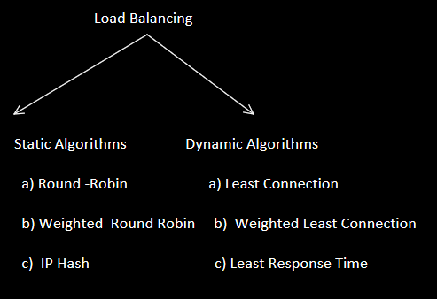
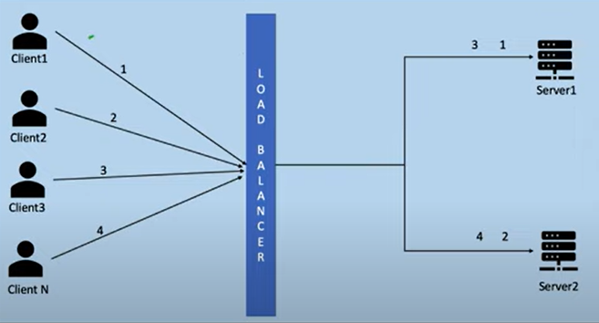
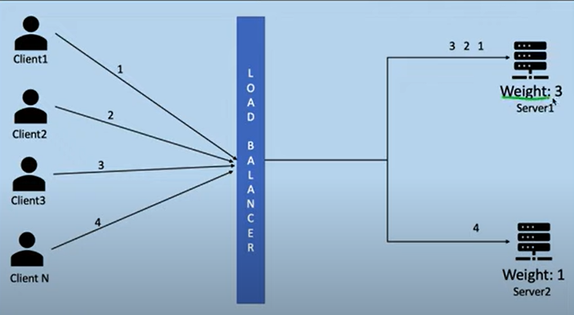
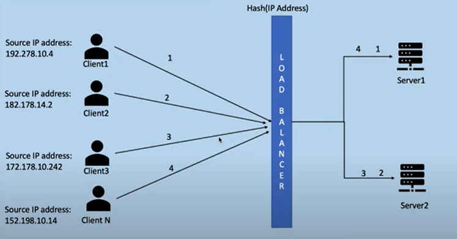

* A traffic router which distributes requests across servers in a cluster.
* Distribution of requests makes sure that none of the servers are loaded.
* Helps in making sure that request does not go to a dead server.
* Decides which server in the cluster is most suitable for handling any incoming requests.
* There can be hardware load balancers or software. These days software balancers are popular due to non-functional requirements.

Types of Load Balancers

* Network Load Balancer (L4 Balancer)
* Application Load Balancer (L7 Balancer)

The difference between L4 and L7 Balancers:

* In L7 , it can read the headers/session/data/response) , so based on these parameters it will take the decision. It has capability of Caching.So it is much more advanced.
* In L4, it can read TCP/UDP port ,IPAddress , source and destination. Based on these it needs to take the decision. This is much faster.

## Round Robin

## Weighted Round Robbin

## IP Hash

