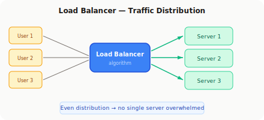
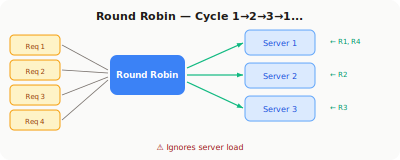
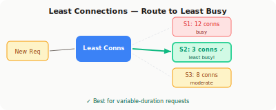
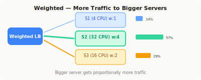
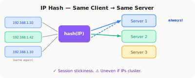
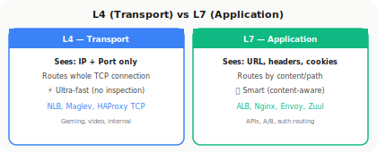

# Load Balancing

!!! danger "Real Incident: Reddit, 2023"
    A single misconfigured load balancer rule sent 80% of traffic to 2 of 50 servers. Those 2 servers melted. Cascading failure brought down all of Reddit for 3 hours. **Load balancing isn't just "spread traffic evenly" — it's the difference between staying up and going dark.**

---

## The 30-Second Explanation

**Load balancer = a traffic cop that distributes incoming requests across multiple servers so no single server gets overwhelmed.**

⚡

<h4 style="margin: 0 0 0.5rem; color: #2563eb; font-size: 0.95rem;">Performance</h4>

Spread load → lower latency per request

🔄

<h4 style="margin: 0 0 0.5rem; color: #059669; font-size: 0.95rem;">Availability</h4>

Server dies → LB routes around it

📈

<h4 style="margin: 0 0 0.5rem; color: #92400e; font-size: 0.95rem;">Scalability</h4>

Add servers → handle more traffic

---

---

## The Restaurant Analogy

You own a restaurant with 5 chefs. Customers line up at the door.

| Strategy | What the host does | Real equivalent |
|:---:|---|---|
| **Round Robin** | Customer 1 → chef 1, customer 2 → chef 2... repeats | Nginx default |
| **Least Connections** | "Which chef has fewest orders right now?" | HAProxy for APIs |
| **Weighted** | "Chef 3 is 2x fast — send double orders" | Mixed hardware |
| **IP Hash** | "You always sit at chef 2's counter" | Session affinity |
| **Random Two Choices** | Pick 2 chefs, send to less busy one | Netflix (power of 2) |

---

## Algorithms in Detail

### Round Robin

### Least Connections

### Weighted Round Robin

### IP Hash (Sticky Sessions)

---

## Algorithm Comparison

### Static (Don't check server state)

| Algorithm | How | Best For | Weakness |
|---|---|---|---|
| **Round Robin** | Cycle through servers | Equal-capacity, stateless | Ignores server load |
| **Weighted Round Robin** | More requests to higher-weight servers | Mixed hardware | Weights don't adapt |
| **IP Hash** | hash(client_IP) % N | Session stickiness | Uneven if IPs cluster |
| **URL Hash** | hash(URL) % N | Cache efficiency | Hot URLs = hot servers |

### Dynamic (React to real-time state)

| Algorithm | How | Best For | Weakness |
|---|---|---|---|
| **Least Connections** | Route to server with fewest active conns | WebSocket, long requests | Doesn't weight request cost |
| **Least Response Time** | Route to fastest-responding server | Latency-sensitive APIs | Needs health probes |
| **Random Two Choices** | Pick 2 random, choose less loaded | Large clusters (100+) | Slightly more logic |

!!! tip "Interview Gold"
    "Power of Two Choices" is used at Netflix. Picks 2 random servers and routes to the less loaded one. Avoids the herd effect where all clients pile onto the same "least loaded" server simultaneously. Near-optimal distribution with minimal state.

---

## L4 vs L7 — The Core Distinction

<table style="width: 100%; border-collapse: collapse;">
<thead>
<tr style="background: linear-gradient(135deg, #f8fafc, #f1f5f9);">
<th style="padding: 0.8rem; border-bottom: 2px solid #e2e8f0;"></th>
<th style="padding: 0.8rem; border-bottom: 2px solid #e2e8f0;">L4 (Transport)</th>
<th style="padding: 0.8rem; border-bottom: 2px solid #e2e8f0;">L7 (Application)</th>
</tr>
</thead>
<tbody>
<tr><td style="padding: 0.7rem; border-bottom: 1px solid #f1f5f9;"><strong>Sees</strong></td><td style="padding: 0.7rem; border-bottom: 1px solid #f1f5f9;">IP + Port only</td><td style="padding: 0.7rem; border-bottom: 1px solid #f1f5f9;">HTTP headers, URL, cookies, body</td></tr>
<tr><td style="padding: 0.7rem; border-bottom: 1px solid #f1f5f9;"><strong>Speed</strong></td><td style="padding: 0.7rem; border-bottom: 1px solid #f1f5f9;">Faster (no payload inspection)</td><td style="padding: 0.7rem; border-bottom: 1px solid #f1f5f9;">Slower (parses HTTP)</td></tr>
<tr><td style="padding: 0.7rem; border-bottom: 1px solid #f1f5f9;"><strong>TLS</strong></td><td style="padding: 0.7rem; border-bottom: 1px solid #f1f5f9;">Passes through</td><td style="padding: 0.7rem; border-bottom: 1px solid #f1f5f9;">Terminates (can inspect)</td></tr>
<tr><td style="padding: 0.7rem; border-bottom: 1px solid #f1f5f9;"><strong>Routing</strong></td><td style="padding: 0.7rem; border-bottom: 1px solid #f1f5f9;">By connection</td><td style="padding: 0.7rem; border-bottom: 1px solid #f1f5f9;">By URL, header, cookie</td></tr>
<tr><td style="padding: 0.7rem;"><strong>Use case</strong></td><td style="padding: 0.7rem;">Network edge, gaming, streaming</td><td style="padding: 0.7rem;">API gateway, A/B testing, auth routing</td></tr>
</tbody>
</table>

---

## Health Checks

| Type | How | When |
|---|---|---|
| **Passive** | Track 5xx responses. 3 failures in 30s = unhealthy | Every request (free) |
| **Active** | GET /health every 5s. No response in 2s = unhealthy | Periodic |
| **Deep** | Check DB, cache, queue connectivity | Less frequent (30s) |

**Key concepts:**

- **Draining**: Stop new requests, finish existing ones (graceful removal)
- **Circuit breaker**: Unhealthy? Remove immediately. Re-add after 3 consecutive passes.

---

## The LB is a SPOF — Now What?

| Solution | How |
|---|---|
| **Active-Passive** | Two LBs. Passive watches heartbeat. Primary dies → passive takes VIP. |
| **Active-Active** | Both serve traffic. DNS returns both IPs. Either handles full load. |
| **DNS-level** | Multiple A records. Client picks one. No single LB bottleneck. |

---

## Real Systems

| Company | Stack | Notable |
|---|---|---|
| **Google** | Maglev (L4) + Envoy (L7) | Maglev: 10M+ packets/sec per machine |
| **Netflix** | Zuul (L7) + Eureka (discovery) | Power of two choices algorithm |
| **AWS** | ALB (L7) + NLB (L4) | ALB does content-based routing |
| **Uber** | Custom L7 with ring routing | Routes by city for data locality |
| **Cloudflare** | Anycast + Unimog (L4) | Seamless traffic shifting between DCs |

---

## Global Load Balancing

| Method | How | Example |
|---|---|---|
| **GeoDNS** | DNS returns IP of nearest region | Route53 geolocation |
| **Anycast** | Same IP from multiple locations, BGP routes to nearest | Cloudflare (1.1.1.1) |
| **GSLB** | Health-aware GeoDNS | F5, Akamai GTM |

---

## The 3 Mistakes That Get You Rejected

!!! danger "Don't Say These"
    1. **"Round robin is always fine"** — If servers have different capacity or requests have different cost, round robin creates hotspots. You need weighted or dynamic algorithms.
    2. **"The load balancer can't fail"** — It absolutely can. Always discuss LB high availability (active-active, DNS failover).
    3. **"Just use sticky sessions for everything"** — Sticky sessions kill load balancing effectiveness and make scaling painful. Use stateless services + external session store instead.

---

## Interview Answer Template

> "For [system], I'd use [L4/L7] load balancing with [algorithm] because [reason]. Health checking: passive monitoring (5xx tracking) + active probes to /health every [N]s. LB HA: [active-active/passive] with [mechanism]. Global: [GeoDNS/Anycast] for multi-region routing."

---

## Quick Recall Card

| Question | Answer |
|---|---|
| L4 vs L7? | L4 = fast, dumb (IP/port). L7 = slower, smart (HTTP-aware) |
| Best default algorithm? | Least Connections (adapts to real load) |
| Best at massive scale? | Power of Two Choices (minimal state, near-optimal) |
| How to avoid LB SPOF? | Active-Active LBs or DNS-level redundancy |
| Sticky sessions how? | IP hash, cookie-based, or header-based |
| Health check types? | Passive (errors), Active (poll), Deep (deps) |
