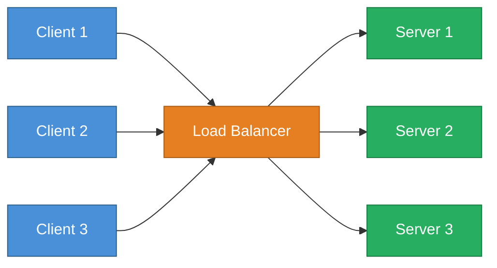
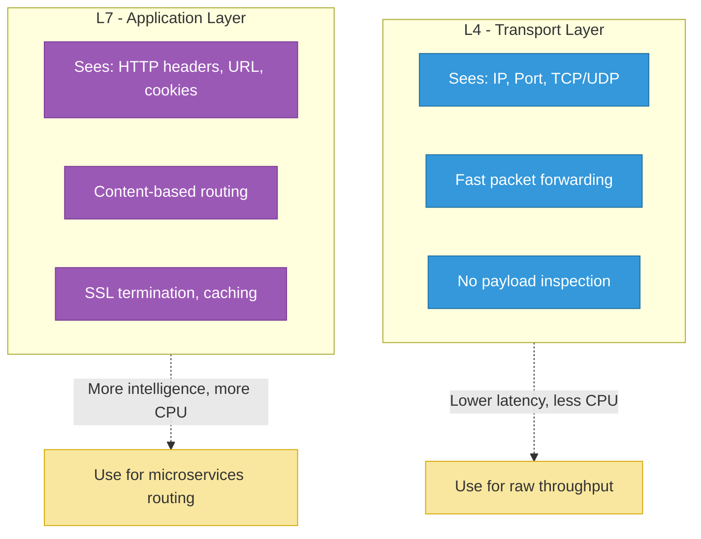
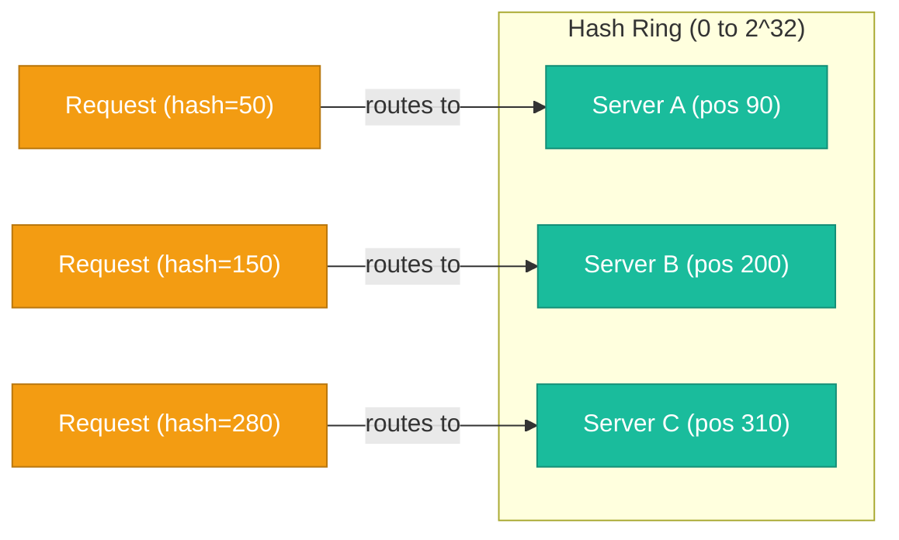
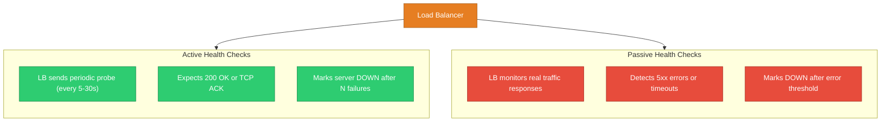
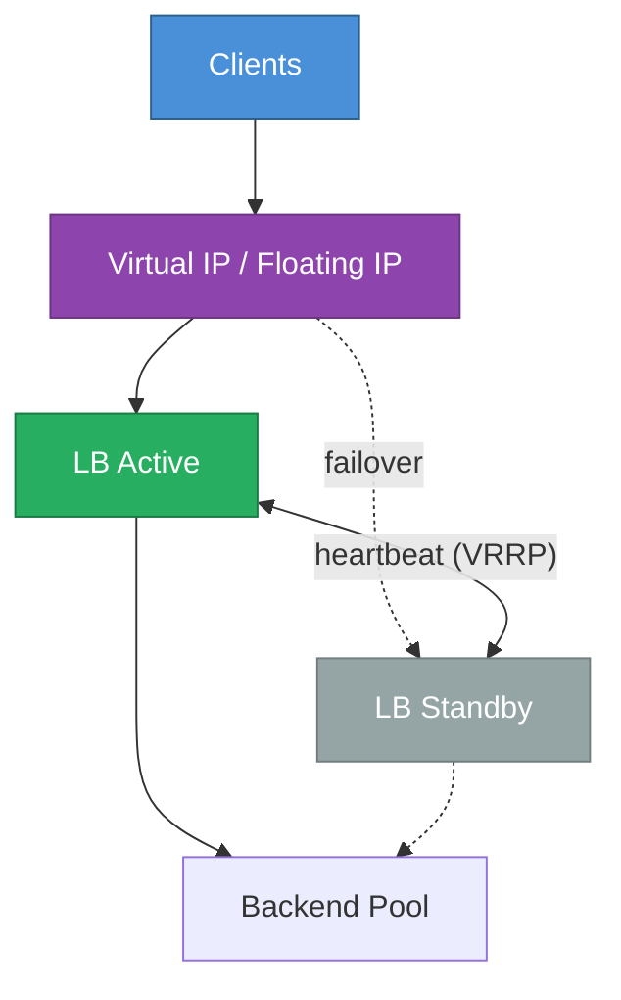
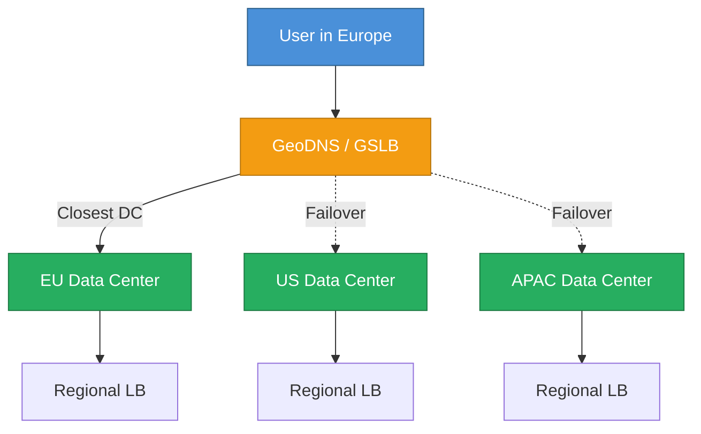

# Load Balancing

!!! tip "Why This Appears in Every System Design Interview"
    Load balancing is the single most common building block in distributed systems. Every FAANG interview that involves "Design X at scale" expects you to explain **where** you place a load balancer, **which algorithm** you choose, and **how** you ensure the LB itself is not a single point of failure. Master this topic and you unlock points in virtually every system design round.

---

## What is a Load Balancer?

A **load balancer** is a network device (physical or virtual) that distributes incoming client requests across a pool of backend servers. It ensures:

- No single server becomes a bottleneck
- Failed servers are removed from rotation automatically
- Horizontal scaling is seamless to the client

```mermaid
flowchart LR
    classDef clientStyle fill:#4A90D9,stroke:#2C5F8A,color:#fff
    classDef lbStyle fill:#E67E22,stroke:#A85C16,color:#fff
    classDef serverStyle fill:#27AE60,stroke:#1B7A43,color:#fff

    C1[Client 1]:::clientStyle --> LB[Load Balancer]:::lbStyle
    C2[Client 2]:::clientStyle --> LB
    C3[Client 3]:::clientStyle --> LB
    LB --> S1[Server 1]:::serverStyle
    LB --> S2[Server 2]:::serverStyle
    LB --> S3[Server 3]:::serverStyle
```

The client sees a **single virtual IP (VIP)**. The LB transparently fans out traffic to healthy backends.

---

## Types of Load Balancers

### L4 (Transport Layer) vs L7 (Application Layer)

```mermaid
flowchart TB
    classDef l4Style fill:#3498DB,stroke:#2471A3,color:#fff
    classDef l7Style fill:#9B59B6,stroke:#7D3C98,color:#fff
    classDef noteStyle fill:#F9E79F,stroke:#D4AC0D,color:#333

    subgraph L4["L4 - Transport Layer"]
        direction LR
        A1[Sees: IP, Port, TCP/UDP]:::l4Style
        A2[Fast packet forwarding]:::l4Style
        A3[No payload inspection]:::l4Style
    end

    subgraph L7["L7 - Application Layer"]
        direction LR
        B1[Sees: HTTP headers, URL, cookies]:::l7Style
        B2[Content-based routing]:::l7Style
        B3[SSL termination, caching]:::l7Style
    end

    L4 -.->|"Lower latency, less CPU"| N1[Use for raw throughput]:::noteStyle
    L7 -.->|"More intelligence, more CPU"| N2[Use for microservices routing]:::noteStyle
```

| Feature | L4 (Transport) | L7 (Application) |
|---------|----------------|-------------------|
| **OSI Layer** | Layer 4 (TCP/UDP) | Layer 7 (HTTP/HTTPS/gRPC) |
| **Decision inputs** | Source/dest IP, port, protocol | URL path, headers, cookies, body |
| **Speed** | Very fast (kernel-level forwarding) | Slower (full packet inspection) |
| **SSL termination** | No (pass-through) | Yes |
| **Content-based routing** | No | Yes (route `/api` vs `/static`) |
| **Caching** | No | Yes |
| **Connection multiplexing** | No | Yes |
| **WebSocket awareness** | No | Yes |
| **Use case** | High-throughput TCP services, databases, gaming | Web apps, APIs, microservices |

### Hardware vs Software Load Balancers

| Aspect | Hardware (F5, Citrix ADC) | Software (NGINX, HAProxy, Envoy) |
|--------|---------------------------|----------------------------------|
| **Cost** | $10K-$100K+ per appliance | Free / low cost |
| **Scalability** | Vertical only (buy bigger box) | Horizontal (add more instances) |
| **Flexibility** | Vendor-locked features | Fully programmable |
| **Throughput** | Extremely high (custom ASICs) | High (modern kernels approach HW speeds) |
| **Cloud-native** | No | Yes |
| **Deployment speed** | Weeks (procurement) | Minutes (container/VM) |

!!! note "Industry Trend"
    Software load balancers dominate modern architectures. Hardware LBs persist only in legacy on-prem environments requiring line-rate packet processing at 100 Gbps+.

---

## Load Balancing Algorithms

### 1. Round Robin

Requests are distributed sequentially across servers in a fixed circular order.

| Pros | Cons |
|------|------|
| Simplest to implement | Ignores server capacity differences |
| Zero state required | Ignores current server load |
| Perfectly even distribution for homogeneous fleets | Long-lived connections cause imbalance |

**When to use:** Stateless services with identical server specs and similar request costs.

---

### 2. Weighted Round Robin

Each server receives a weight proportional to its capacity. A server with weight 3 gets 3x the traffic of a server with weight 1.

| Pros | Cons |
|------|------|
| Handles heterogeneous hardware | Weights are static; must be manually tuned |
| Simple to reason about | Still ignores runtime load |

**When to use:** Mixed-capacity fleets (e.g., after a rolling upgrade with new and old instance types).

---

### 3. Least Connections

Routes to the server with the fewest active connections.

| Pros | Cons |
|------|------|
| Adapts to varying request durations | Requires real-time connection tracking |
| Great for long-lived connections (WebSockets) | New server gets flooded (thundering herd) |

**When to use:** Services with highly variable request processing times (video encoding, file uploads).

---

### 4. Weighted Least Connections

Combines least connections with server weights: `score = active_connections / weight`. Lowest score wins.

| Pros | Cons |
|------|------|
| Best of both capacity + load awareness | More complex state management |
| Industry standard for production LBs | Weight tuning still needed |

**When to use:** Production microservices with heterogeneous backends and variable latency.

---

### 5. IP Hash

A hash of the client IP determines the server. Same client always hits the same server.

| Pros | Cons |
|------|------|
| Built-in session affinity | Uneven distribution if client IPs are skewed |
| No external session store needed | Adding/removing servers reshuffles all mappings |

**When to use:** Legacy applications requiring sticky sessions without cookie support.

---

### 6. Consistent Hashing

Servers are placed on a hash ring. Each request is hashed and routed to the next server clockwise. Adding/removing a server only remaps `K/N` keys (K = total keys, N = total nodes).

```mermaid
flowchart LR
    classDef ringStyle fill:#1ABC9C,stroke:#148F77,color:#fff
    classDef reqStyle fill:#F39C12,stroke:#B9770E,color:#fff

    subgraph Ring["Hash Ring (0 to 2^32)"]
        direction TB
        S1["Server A (pos 90)"]:::ringStyle
        S2["Server B (pos 200)"]:::ringStyle
        S3["Server C (pos 310)"]:::ringStyle
    end

    R1["Request (hash=150)"]:::reqStyle -->|"routes to"| S2
    R2["Request (hash=50)"]:::reqStyle -->|"routes to"| S1
    R3["Request (hash=280)"]:::reqStyle -->|"routes to"| S3
```

| Pros | Cons |
|------|------|
| Minimal disruption on topology change | More complex implementation |
| Works well with caching layers | Requires virtual nodes for even distribution |
| Scales gracefully | Slight overhead for ring lookup |

**When to use:** Distributed caches (Memcached, Redis cluster), CDNs, any system where cache locality matters.

---

### 7. Least Response Time

Routes to the server with the lowest average response time **and** fewest active connections.

| Pros | Cons |
|------|------|
| Accounts for actual server performance | Requires latency measurement overhead |
| Self-healing (slow server gets less traffic) | Cold servers with no data get deprioritized |

**When to use:** Latency-sensitive APIs where backend performance varies (e.g., heterogeneous DB query times).

---

### 8. Random with Two Choices (Power of Two)

Pick two random servers; route to the one with fewer connections. Provides near-optimal distribution with minimal state.

| Pros | Cons |
|------|------|
| Near-optimal load distribution | Slightly more complex than pure random |
| Minimal coordination needed | Two-choice lookup per request |
| Proven by queuing theory (exponential improvement over random) | Not deterministic |

**When to use:** Large-scale distributed systems where maintaining global state is expensive (service meshes, peer-to-peer routing).

---

## Health Checks

A load balancer must detect unhealthy backends and stop sending them traffic.

### Active vs Passive Health Checks

```mermaid
flowchart TB
    classDef activeStyle fill:#2ECC71,stroke:#1B8C4E,color:#fff
    classDef passiveStyle fill:#E74C3C,stroke:#A93226,color:#fff
    classDef lbStyle fill:#E67E22,stroke:#A85C16,color:#fff

    LB[Load Balancer]:::lbStyle

    subgraph Active["Active Health Checks"]
        direction TB
        A1["LB sends periodic probe (every 5-30s)"]:::activeStyle
        A2["Expects 200 OK or TCP ACK"]:::activeStyle
        A3["Marks server DOWN after N failures"]:::activeStyle
    end

    subgraph Passive["Passive Health Checks"]
        direction TB
        P1["LB monitors real traffic responses"]:::passiveStyle
        P2["Detects 5xx errors or timeouts"]:::passiveStyle
        P3["Marks DOWN after error threshold"]:::passiveStyle
    end

    LB --> Active
    LB --> Passive
```

| Type | Active | Passive |
|------|--------|---------|
| **Mechanism** | Synthetic probes (HTTP GET /health) | Observe real request outcomes |
| **Detection speed** | Depends on check interval | Immediate (on failure) |
| **False positives** | Low (dedicated endpoint) | Higher (transient errors) |
| **Network overhead** | Small but constant | Zero extra traffic |
| **Best practice** | Use as primary mechanism | Use as supplement to active |

### TCP vs HTTP Health Checks

| Check Type | What it validates | Limitation |
|------------|-------------------|------------|
| **TCP** | Port is open, process is listening | App may be up but returning errors |
| **HTTP** | App responds 200 on `/health` or `/ready` | Slightly more overhead |
| **Custom script** | DB connectivity, disk space, dependencies | Complex to maintain |

!!! warning "Interview Tip"
    Always mention that health checks should test **deep health** (database connectivity, downstream dependencies) not just "is the process alive." A server returning 200 on a liveness probe while its DB connection pool is exhausted is still effectively dead.

---

## Session Persistence (Sticky Sessions)

Some applications require that a client's requests consistently reach the same backend.

| Strategy | How it works | Trade-offs |
|----------|-------------|------------|
| **Source IP affinity** | Hash client IP to pin to server | Breaks behind NAT/proxies (many clients share one IP) |
| **Cookie-based** | LB injects a cookie (`SERVERID=backend2`) | Requires L7 LB; cookie overhead; works universally |
| **Application token** | App generates session token; LB routes by token | Most flexible; requires app awareness |
| **No persistence** | Externalize state (Redis, DB) | Best for scalability; zero LB complexity |

!!! success "Best Practice"
    Prefer **externalized session state** (Redis/Memcached) over sticky sessions. Sticky sessions create hot spots and complicate failover. Externalized state allows any server to handle any request.

---

## High Availability for Load Balancers

The load balancer itself must not be a single point of failure.

```mermaid
flowchart TB
    classDef activeStyle fill:#27AE60,stroke:#1B7A43,color:#fff
    classDef passiveStyle fill:#95A5A6,stroke:#717D7E,color:#fff
    classDef vipStyle fill:#8E44AD,stroke:#6C3483,color:#fff
    classDef clientStyle fill:#4A90D9,stroke:#2C5F8A,color:#fff

    Client[Clients]:::clientStyle --> VIP[Virtual IP / Floating IP]:::vipStyle
    VIP --> LB1[LB Active]:::activeStyle
    VIP -.->|"failover"| LB2[LB Standby]:::passiveStyle
    LB1 <-->|"heartbeat (VRRP)"| LB2
    LB1 --> Servers[Backend Pool]
    LB2 -.-> Servers
```

### Patterns

| Pattern | How it works | RTO | Throughput |
|---------|-------------|-----|------------|
| **Active-Passive** | Standby takes over VIP via VRRP/keepalived on primary failure | 1-5 seconds | 1x (only one active) |
| **Active-Active** | Both LBs serve traffic; DNS or ECMP distributes across them | Near-zero | 2x (both active) |
| **DNS Failover** | DNS returns multiple IPs; TTL-based failover | 30s-5min (DNS TTL) | Nx (multi-region) |

!!! info "Cloud Managed LBs"
    AWS ALB/NLB, GCP Cloud Load Balancing, and Azure LB are **inherently highly available** -- they run across multiple AZs with automatic failover. You do not need to manage HA yourself when using managed offerings.

---

## Real-World Load Balancers

| Feature | NGINX | HAProxy | AWS ALB | AWS NLB | Envoy |
|---------|-------|---------|---------|---------|-------|
| **Layer** | L7 (L4 with stream) | L4 / L7 | L7 | L4 | L7 (L4 capable) |
| **Protocol** | HTTP, gRPC, TCP, UDP | HTTP, TCP | HTTP, gRPC, WebSocket | TCP, UDP, TLS | HTTP/1.1, HTTP/2, gRPC, TCP |
| **Performance** | Very high | Extremely high | Managed (auto-scales) | Millions of RPS | High |
| **Config reload** | Graceful reload | Hot reload | Managed | Managed | Hot restart / xDS API |
| **Service mesh** | NGINX Plus | N/A | N/A | N/A | Istio/Linkerd sidecar |
| **Observability** | Access logs, stubs | Stats socket, Prometheus | CloudWatch | CloudWatch | Built-in stats, tracing |
| **Cost** | Free (OSS) / Plus license | Free (OSS) / Enterprise | Pay per LCU-hour | Pay per NLCU-hour | Free (OSS) |
| **Best for** | Web serving + reverse proxy | Pure LB performance | AWS-native web apps | AWS low-latency TCP | Service mesh / K8s |

---

## Global Server Load Balancing (GSLB)

GSLB distributes traffic across **geographically distributed data centers** using DNS-based routing.

```mermaid
flowchart TB
    classDef clientStyle fill:#4A90D9,stroke:#2C5F8A,color:#fff
    classDef dnsStyle fill:#F39C12,stroke:#B9770E,color:#fff
    classDef dcStyle fill:#27AE60,stroke:#1B7A43,color:#fff

    User[User in Europe]:::clientStyle --> DNS[GeoDNS / GSLB]:::dnsStyle
    DNS -->|"Closest DC"| EU[EU Data Center]:::dcStyle
    DNS -.->|"Failover"| US[US Data Center]:::dcStyle
    DNS -.->|"Failover"| APAC[APAC Data Center]:::dcStyle

    EU --> LB1[Regional LB]
    US --> LB2[Regional LB]
    APAC --> LB3[Regional LB]
```

### How GeoDNS Works

1. User queries DNS for `api.example.com`
2. Authoritative DNS server checks client's resolver IP geolocation
3. Returns the IP of the nearest healthy data center
4. Traffic stays regional, reducing latency

### GSLB Routing Policies

| Policy | Description | Use Case |
|--------|-------------|----------|
| **Geolocation** | Route to nearest DC by geography | Reduce latency |
| **Latency-based** | Route to DC with lowest measured latency | Performance optimization |
| **Weighted** | Percentage split across DCs | Canary deployments across regions |
| **Failover** | Primary DC with fallback | Disaster recovery |
| **Geofencing** | Keep traffic in specific region | Data sovereignty / GDPR |

### GSLB Challenges

- **DNS caching:** Clients cache DNS records; failover limited by TTL
- **Resolver geolocation:** EDNS Client Subnet (ECS) needed for accuracy
- **Propagation delay:** DNS changes take time to propagate globally
- **Split-brain:** Multiple DCs may each think the other is down

---

## Interview Questions

??? question "You are designing a system that receives 100K RPS. Where do you place load balancers and why?"
    Place load balancers at three tiers: (1) **Edge/DNS level** -- GSLB to route users to the nearest region, (2) **External LB** -- L7 load balancer in front of your API gateway or web tier to handle SSL termination, rate limiting, and path-based routing, (3) **Internal LB** -- L4/L7 between microservices for east-west traffic. This layered approach isolates failure domains and allows independent scaling of each tier.

??? question "How would you ensure your load balancer is not a single point of failure?"
    Use **active-passive** with VRRP/keepalived for on-prem (floating VIP transfers in seconds), or **active-active** with Anycast/ECMP for high throughput. In cloud, use managed LBs (AWS ALB/NLB) which are inherently multi-AZ and fault-tolerant. For global redundancy, combine with DNS failover across regions.

??? question "When would you choose Consistent Hashing over Round Robin?"
    Choose consistent hashing when you need **cache locality** -- e.g., routing requests for a specific user to the same cache server to maximize hit rates. Round Robin is better when all requests are stateless and interchangeable. Consistent hashing shines in distributed caches, sharded databases, and CDNs where remapping on node addition/removal must be minimal.

??? question "Explain the difference between L4 and L7 load balancers with a real example."
    **L4 (NLB):** A gaming server needs raw TCP throughput with minimal latency. The LB sees only IP:port and forwards packets without inspecting content. Example: AWS NLB for a multiplayer game server. **L7 (ALB):** A microservices API needs path-based routing (`/users` to User Service, `/orders` to Order Service), SSL termination, and header inspection. Example: AWS ALB routing a REST API. L7 costs more CPU but enables intelligent routing.

??? question "A server is passing health checks but users report errors. What could be wrong?"
    The health check is too shallow -- it only verifies the process is alive (TCP check or simple HTTP 200) but does not validate **deep dependencies** (database, cache, downstream services). Fix: implement a `/health/ready` endpoint that checks connection pools, disk space, and critical dependencies. Also add **passive health checks** that monitor real traffic error rates to catch this scenario.

??? question "How does sticky sessions affect horizontal scaling, and what is the alternative?"
    Sticky sessions pin a user to one server, creating **hot spots** if some users generate more traffic. Scaling out does not help pinned users. If the sticky server dies, the session is lost. **Alternative:** Externalize session state into Redis or a distributed cache. Any server can then handle any request, enabling true horizontal scaling and graceful failover.

??? question "Your service spans 3 regions. How do you route users to the closest one while handling regional outages?"
    Use **GeoDNS (GSLB)** with health-checked endpoints. DNS resolves to the nearest healthy region based on client resolver IP (with EDNS Client Subnet for accuracy). Set low TTLs (30-60s) for faster failover. Combine with active health monitoring -- if a region fails health checks, the GSLB automatically removes it from DNS responses. For critical apps, add a client-side retry to a different region's IP as a backup.

??? question "Compare the 'Power of Two Choices' algorithm with Least Connections. When is each preferable?"
    **Least Connections** requires a centralized view of all servers' connection counts -- works well for a single LB managing a moderate backend pool. **Power of Two Choices** picks two random servers and chooses the less loaded one; it provides near-optimal distribution with O(1) state and no coordination. Prefer Two Choices in **large-scale distributed systems** (service meshes, thousands of nodes) where maintaining global state is impractical. Least Connections is better for smaller pools where precise balancing justifies the tracking overhead.

---

## Key Takeaways for Interviews

| Principle | Guidance |
|-----------|----------|
| **Default algorithm** | Weighted Least Connections for most production workloads |
| **Stateless is king** | Externalize state; avoid sticky sessions |
| **Health checks** | Always deep (check dependencies), not just shallow TCP |
| **HA for LBs** | Active-Active or managed cloud LBs; never single LB |
| **L4 vs L7** | L4 for speed, L7 for intelligence; use both in layered architecture |
| **Global routing** | GeoDNS + regional LBs for multi-region systems |
| **Consistent hashing** | Essential when cache hit rate matters |
