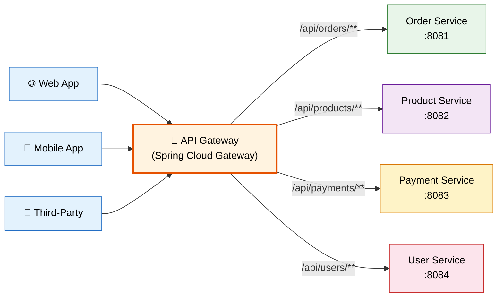
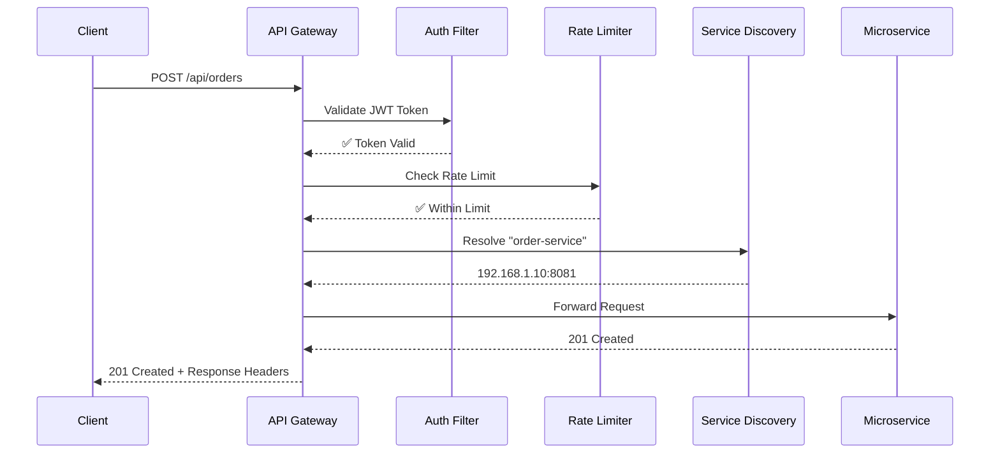
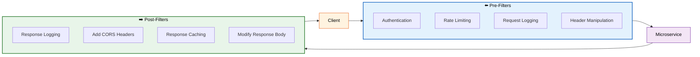

# 🚪 API Gateway Pattern

> **A single entry point for all client requests that routes, filters, and secures traffic to downstream microservices.**

---

!!! abstract "Real-World Analogy"
    Think of a **hotel reception desk**. Guests (clients) don't wander into the kitchen, laundry room, or maintenance area directly. They go to the reception, which routes their requests — room service goes to the kitchen, luggage goes to the bellboy, complaints go to the manager. The reception also handles authentication (checking your room key) and rate limiting (one complaint per hour, please).



---

## ❓ Why Do We Need an API Gateway?

Without a gateway, clients must know the addresses of every microservice — a nightmare for maintenance, security, and scalability.

| Concern | Without Gateway | With Gateway |
|---------|----------------|--------------|
| **Routing** | Client tracks every service URL | Single URL, gateway routes |
| **Security** | Each service implements auth | Centralized authentication |
| **Rate Limiting** | Each service implements limits | Gateway enforces globally |
| **Load Balancing** | Client-side or per-service | Gateway balances traffic |
| **SSL Termination** | Each service needs certificates | Gateway handles HTTPS |
| **Cross-Cutting Concerns** | Duplicated in every service | Centralized in gateway |
| **API Versioning** | Complex per service | Gateway manages versions |

---

## 🏗️ Request Flow Through API Gateway



---

## 🛠️ Spring Cloud Gateway Implementation

### Dependencies

```xml
<dependency>
    <groupId>org.springframework.cloud</groupId>
    <artifactId>spring-cloud-starter-gateway</artifactId>
</dependency>
<dependency>
    <groupId>org.springframework.cloud</groupId>
    <artifactId>spring-cloud-starter-netflix-eureka-client</artifactId>
</dependency>
<dependency>
    <groupId>org.springframework.boot</groupId>
    <artifactId>spring-boot-starter-actuator</artifactId>
</dependency>
```

### Route Configuration

=== "YAML Configuration"

    ```yaml
    server:
      port: 9000

    spring:
      application:
        name: api-gateway
      cloud:
        gateway:
          routes:
            - id: order-service
              uri: lb://order-service
              predicates:
                - Path=/api/orders/**
              filters:
                - StripPrefix=0
                - name: CircuitBreaker
                  args:
                    name: orderCircuitBreaker
                    fallbackUri: forward:/fallback/orders
                    
            - id: product-service
              uri: lb://product-service
              predicates:
                - Path=/api/products/**
                - Method=GET,POST,PUT
              filters:
                - StripPrefix=0
                - AddRequestHeader=X-Request-Source, api-gateway
                
            - id: inventory-service
              uri: lb://inventory-service
              predicates:
                - Path=/api/inventory/**
              filters:
                - StripPrefix=0
                - name: RequestRateLimiter
                  args:
                    redis-rate-limiter.replenishRate: 10
                    redis-rate-limiter.burstCapacity: 20
                    key-resolver: "#{@userKeyResolver}"

    eureka:
      client:
        service-url:
          defaultZone: http://localhost:8761/eureka
    ```

=== "Java Configuration"

    ```java
    @Configuration
    public class GatewayConfig {
        
        @Bean
        public RouteLocator customRouteLocator(RouteLocatorBuilder builder) {
            return builder.routes()
                .route("order-service", r -> r
                    .path("/api/orders/**")
                    .filters(f -> f
                        .circuitBreaker(c -> c
                            .setName("orderCB")
                            .setFallbackUri("forward:/fallback/orders"))
                        .addRequestHeader("X-Gateway-Time", 
                            String.valueOf(System.currentTimeMillis())))
                    .uri("lb://order-service"))
                .route("product-service", r -> r
                    .path("/api/products/**")
                    .and()
                    .method(HttpMethod.GET, HttpMethod.POST)
                    .filters(f -> f
                        .retry(config -> config
                            .setRetries(3)
                            .setStatuses(HttpStatus.SERVICE_UNAVAILABLE)))
                    .uri("lb://product-service"))
                .build();
        }
    }
    ```

---

## 🔍 Route Predicates

Predicates determine whether a request matches a route.

| Predicate | Example | Description |
|-----------|---------|-------------|
| `Path` | `/api/orders/**` | Match URL path |
| `Method` | `GET, POST` | Match HTTP method |
| `Header` | `X-Request-Id, \d+` | Match header with regex |
| `Query` | `category, electronics` | Match query parameter |
| `Host` | `**.example.com` | Match host header |
| `Before/After` | `2024-01-01T00:00:00` | Time-based routing |
| `Weight` | `group1, 8` | Canary deployments (80/20 split) |

```yaml
# Canary deployment example: 90% to v1, 10% to v2
routes:
  - id: product-v1
    uri: lb://product-service-v1
    predicates:
      - Path=/api/products/**
      - Weight=product-group, 90
      
  - id: product-v2
    uri: lb://product-service-v2
    predicates:
      - Path=/api/products/**
      - Weight=product-group, 10
```

---

## 🧹 Filters (Pre and Post)

Filters modify requests before forwarding and responses before returning.



### Custom Global Filter

```java
@Component
@Slf4j
public class LoggingFilter implements GlobalFilter, Ordered {
    
    @Override
    public Mono<Void> filter(ServerWebExchange exchange, GatewayFilterChain chain) {
        String requestId = UUID.randomUUID().toString();
        long startTime = System.currentTimeMillis();
        
        // Pre-filter: Add correlation ID
        exchange.getRequest().mutate()
            .header("X-Correlation-Id", requestId)
            .build();
        
        log.info("Request: {} {} [{}]", 
            exchange.getRequest().getMethod(),
            exchange.getRequest().getURI(),
            requestId);
        
        return chain.filter(exchange).then(Mono.fromRunnable(() -> {
            // Post-filter: Log response time
            long duration = System.currentTimeMillis() - startTime;
            log.info("Response: {} | {}ms [{}]",
                exchange.getResponse().getStatusCode(),
                duration, requestId);
        }));
    }
    
    @Override
    public int getOrder() {
        return -1; // Execute first
    }
}
```

### Authentication Filter

```java
@Component
public class AuthenticationFilter implements GatewayFilter {
    
    private final JwtUtil jwtUtil;
    
    @Override
    public Mono<Void> filter(ServerWebExchange exchange, GatewayFilterChain chain) {
        String authHeader = exchange.getRequest().getHeaders()
            .getFirst(HttpHeaders.AUTHORIZATION);
        
        if (authHeader == null || !authHeader.startsWith("Bearer ")) {
            exchange.getResponse().setStatusCode(HttpStatus.UNAUTHORIZED);
            return exchange.getResponse().setComplete();
        }
        
        String token = authHeader.substring(7);
        
        try {
            Claims claims = jwtUtil.validateToken(token);
            // Add user info to headers for downstream services
            exchange.getRequest().mutate()
                .header("X-User-Id", claims.getSubject())
                .header("X-User-Role", claims.get("role", String.class))
                .build();
            return chain.filter(exchange);
        } catch (JwtException e) {
            exchange.getResponse().setStatusCode(HttpStatus.UNAUTHORIZED);
            return exchange.getResponse().setComplete();
        }
    }
}
```

---

## ⏱️ Rate Limiting

Protect downstream services from being overwhelmed.

=== "Redis Rate Limiter Configuration"

    ```yaml
    spring:
      cloud:
        gateway:
          routes:
            - id: order-service
              uri: lb://order-service
              predicates:
                - Path=/api/orders/**
              filters:
                - name: RequestRateLimiter
                  args:
                    redis-rate-limiter.replenishRate: 10   # 10 requests/sec
                    redis-rate-limiter.burstCapacity: 20   # Allow burst up to 20
                    redis-rate-limiter.requestedTokens: 1  # Tokens per request
                    key-resolver: "#{@userKeyResolver}"
      data:
        redis:
          host: localhost
          port: 6379
    ```

=== "Key Resolver (Rate limit per user)"

    ```java
    @Configuration
    public class RateLimiterConfig {
        
        @Bean
        public KeyResolver userKeyResolver() {
            // Rate limit per user (from JWT)
            return exchange -> Mono.just(
                exchange.getRequest().getHeaders()
                    .getFirst("X-User-Id") != null 
                    ? exchange.getRequest().getHeaders().getFirst("X-User-Id")
                    : exchange.getRequest().getRemoteAddress().getAddress().getHostAddress()
            );
        }
        
        @Bean
        public KeyResolver ipKeyResolver() {
            // Rate limit per IP address
            return exchange -> Mono.just(
                exchange.getRequest().getRemoteAddress().getAddress().getHostAddress()
            );
        }
    }
    ```

---

## 🔌 Circuit Breaker Integration

Combine API Gateway with Circuit Breaker for resilience.

```yaml
spring:
  cloud:
    gateway:
      routes:
        - id: order-service
          uri: lb://order-service
          predicates:
            - Path=/api/orders/**
          filters:
            - name: CircuitBreaker
              args:
                name: orderServiceCB
                fallbackUri: forward:/fallback/orders

resilience4j:
  circuitbreaker:
    instances:
      orderServiceCB:
        slidingWindowSize: 10
        failureRateThreshold: 50
        waitDurationInOpenState: 10s
  timelimiter:
    instances:
      orderServiceCB:
        timeoutDuration: 3s
```

```java
@RestController
@RequestMapping("/fallback")
public class FallbackController {
    
    @GetMapping("/orders")
    public ResponseEntity<Map<String, String>> ordersFallback() {
        return ResponseEntity.status(HttpStatus.SERVICE_UNAVAILABLE)
            .body(Map.of(
                "message", "Order service is temporarily unavailable",
                "status", "CIRCUIT_OPEN",
                "retry-after", "30 seconds"
            ));
    }
}
```

---

## 🔄 Popular API Gateways Comparison

| Feature | Spring Cloud Gateway | Kong | NGINX | AWS API Gateway |
|---------|---------------------|------|-------|-----------------|
| **Language** | Java | Lua/Go | C | Managed |
| **Performance** | Good (reactive) | Excellent | Excellent | Good |
| **Extensibility** | Java filters | Plugins (Lua) | Modules | Lambda |
| **Service Discovery** | Eureka, Consul | DNS, Consul | Manual/DNS | AWS Services |
| **Best For** | Spring ecosystem | Multi-platform | Static routing | AWS-native apps |
| **Rate Limiting** | Redis-based | Built-in | Module | Built-in |
| **Cost** | Free (self-hosted) | Free/Enterprise | Free (self-hosted) | Pay per request |

---

## 🎯 Interview Q&A

??? question "Q1: What is an API Gateway and why do we need it?"
    An API Gateway is a **single entry point** for all client requests. It handles cross-cutting concerns: routing, authentication, rate limiting, SSL termination, load balancing, response caching, and request/response transformation. Without it, clients need to know every service URL, and each service must implement security independently.

??? question "Q2: What is the difference between API Gateway and Load Balancer?"
    A **Load Balancer** distributes traffic across instances of the SAME service (Layer 4/7). An **API Gateway** routes requests to DIFFERENT services based on path/headers, plus handles auth, rate limiting, transformation. The gateway often uses a load balancer internally (via service discovery).

??? question "Q3: How does Spring Cloud Gateway handle routing?"
    Routes are defined with three components: **Predicates** (when to match — path, method, headers), **Filters** (what to do — modify request/response), and **URI** (where to forward — typically `lb://service-name` for load-balanced calls via service discovery).

??? question "Q4: What are pre-filters and post-filters?"
    **Pre-filters** execute before forwarding to the downstream service (authentication, rate limiting, request logging, header injection). **Post-filters** execute after receiving the response (response logging, adding CORS headers, response modification). Global filters apply to all routes.

??? question "Q5: How do you implement rate limiting in Spring Cloud Gateway?"
    Use the `RequestRateLimiter` filter with Redis as the token store. Configure `replenishRate` (tokens per second), `burstCapacity` (max tokens), and a `KeyResolver` bean that determines the rate limit key (per user, per IP, per API key). Uses the Token Bucket algorithm internally.

??? question "Q6: What is the BFF (Backend for Frontend) pattern?"
    BFF = one API Gateway per client type (web, mobile, IoT). Each BFF is tailored to its client's needs — mobile BFF returns compressed data, web BFF returns rich data. Prevents one-size-fits-all APIs that either over-fetch or under-fetch data.

??? question "Q7: How do you handle API Gateway as a single point of failure?"
    1. Deploy multiple gateway instances behind a load balancer
    2. Use health checks and auto-scaling
    3. Implement circuit breakers within the gateway
    4. Keep the gateway stateless (store sessions in Redis)
    5. Use DNS failover for disaster recovery

---

## Related Topics

- [Service Discovery](ServiceDiscovery.md) — How the gateway finds services
- [Circuit Breaker](CircuitBreaker.md) — Resilience at the gateway level
- [Security in Microservices](security-microservices.md) — OAuth2 + JWT at the gateway
- [Observability](Observability.md) — Monitoring gateway metrics
