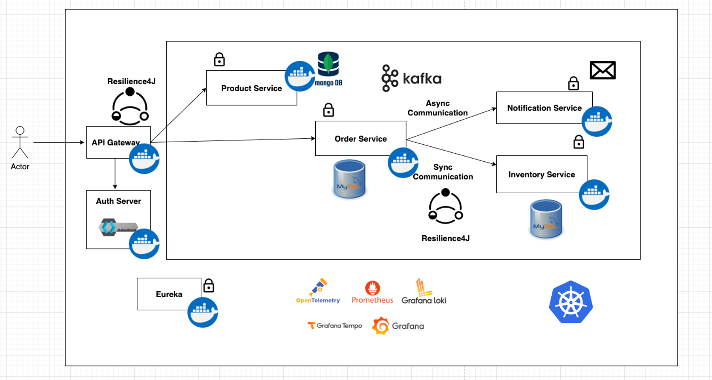
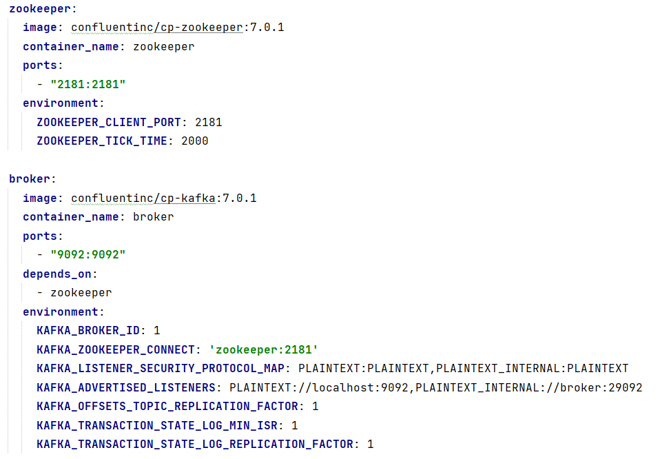

* Order --> Inventory (sync comm) to check whether inventory is available , while placing the order.
* 
* Order service will make a request to Notification Service and will not wait for the response.
* This type of communication is called Async communication.
* Async communication can be enabled using Event driven architecture.
* i.e performing async communication in the form of events.
* So whenever we receive an order to order microservice and the order is placed successfully.
* The order microservice will raise an event like "OrderPlacedEvent" , we can add this event to a queue in Kafka or any messaging system.
* The consumer, here the Notification Service will consume the message and process the message accordingly.

docker compose up -d
docker ps
docker logs -f broker

Configure kafka in order service

Spring for Apache Kafka. (in chrome)

KafkaTemplate (producer)

@KafkaTemplate

           <dependency>
            <groupId>org.springframework.kafka</groupId>
            <artifactId>spring-kafka</artifactId>
           </dependency>

* in producer microservice

      spring:
        kafka:
          bootstrapServers: localhost:9092
          producer:
            keySerializer: org.apache.kafka.common.serialization.StringSerializer
            valueSerializer: org.springframework.kafka.support.serializer.JsonSerializer
            properties:
              spring:
                json:
                  type:
                    mapping: event:com.example.orderservice.event.OrderPlacedEvent
          template:
            defaultTopic: notificationTopic

  @Autowired
  KafkaTemplate<String,OrderPlacedEvent> kafkaTemplate;

                kafkaTemplate.send("notificationTopic", new OrderPlacedEvent(order.getOrderNumber()));

* in consumer microservice

       kafka:
         bootstrapServers: localhost:9092
         consumer:
           groupId: notificationId
           keyDeserializer: org.apache.kafka.common.serialization.StringDeserializer
           valueDeserializer: org.springframework.kafka.support.serializer.JsonDeserializer
           properties:
             spring:
               json:
                 type:
                   mapping: event:com.example.notificationservice.OrderPlacedEvent
         template:
           defaultTopic: notificationTopic

* In service layer       
         
           @KafkaListener(topics = "notificationTopic")
           public void handleNotification(OrderPlacedEvent orderPlacedEvent){
           log.info("Notification received- {}",orderPlacedEvent.getOrderNumber());
           }