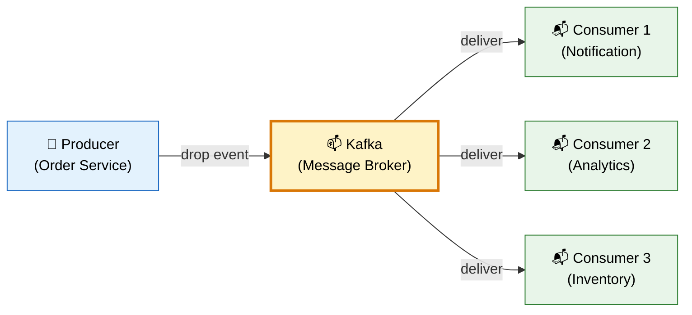
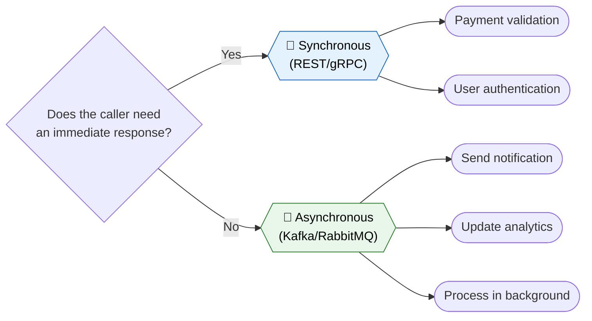
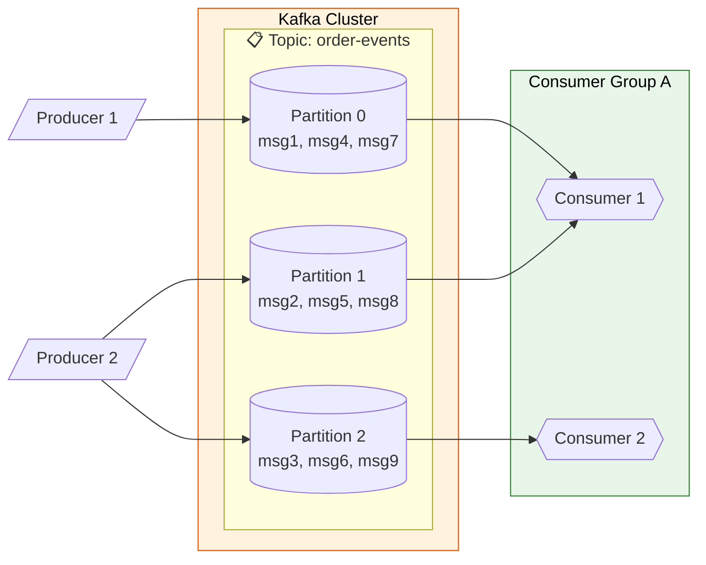

# 📨 Async Communication with Kafka

> **Decouple microservices using event-driven architecture — services communicate through events without waiting for responses.**

---

!!! abstract "Real-World Analogy"
    Think of a **post office**. You drop a letter (event) into the mailbox and walk away — you don't wait at the mailbox for a reply. The postal service (Kafka) ensures the letter reaches the right person (consumer) reliably, even if they're not home right now. Multiple people can receive copies of the same letter (consumer groups).


```mermaid
flowchart LR
    P["📮 Producer<br/>(Order Service)"] -->|drop event| K["📫 Kafka<br/>(Message Broker)"]
    K -->|deliver| C1["📬 Consumer 1<br/>(Notification)"]
    K -->|deliver| C2["📬 Consumer 2<br/>(Analytics)"]
    K -->|deliver| C3["📬 Consumer 3<br/>(Inventory)"]

    style P fill:#E3F2FD,stroke:#1565C0,color:#000
    style K fill:#FEF3C7,stroke:#D97706,stroke-width:3px,color:#000
    style C1 fill:#E8F5E9,stroke:#2E7D32,color:#000
    style C2 fill:#E8F5E9,stroke:#2E7D32,color:#000
    style C3 fill:#E8F5E9,stroke:#2E7D32,color:#000
```

---

## ❓ When to Use Async vs Sync


```mermaid
flowchart LR
    Q{"Does the caller need<br/>an immediate response?"}
    Q -->|"Yes"| Sync{{"🔄 Synchronous<br/>(REST/gRPC)"}}
    Q -->|"No"| Async{{"📨 Asynchronous<br/>(Kafka/RabbitMQ)"}}
    
    Sync --> S1(["Payment validation"])
    Sync --> S2(["User authentication"])
    
    Async --> A1(["Send notification"])
    Async --> A2(["Update analytics"])
    Async --> A3(["Process in background"])

    style Sync fill:#E3F2FD,stroke:#1565C0,color:#000
    style Async fill:#E8F5E9,stroke:#2E7D32,color:#000
```

| | Synchronous | Asynchronous |
|---|---|---|
| **Coupling** | Tight — caller waits | Loose — fire and forget |
| **Latency** | Adds up across calls | Non-blocking |
| **Failure** | Cascading failures | Resilient — retry later |
| **Use case** | Need immediate answer | Background processing |

---

## 🏗️ Kafka Architecture


```mermaid
flowchart LR
    subgraph Cluster["Kafka Cluster"]
        subgraph Topic["📋 Topic: order-events"]
            P0[("Partition 0<br/>msg1, msg4, msg7")]
            P1[("Partition 1<br/>msg2, msg5, msg8")]
            P2[("Partition 2<br/>msg3, msg6, msg9")]
        end
    end
    
    Prod1[/"Producer 1"/] --> P0
    Prod2[/"Producer 2"/] --> P1
    Prod2 --> P2
    
    subgraph CG["Consumer Group A"]
        C1{{"Consumer 1"}} 
        C2{{"Consumer 2"}}
    end
    
    P0 --> C1
    P1 --> C1
    P2 --> C2

    style Cluster fill:#FFF3E0,stroke:#E65100,color:#000
    style CG fill:#E8F5E9,stroke:#2E7D32,color:#000
```

| Concept | What it is |
|---------|-----------|
| **Topic** | Named feed/category of messages (like a table) |
| **Partition** | Topic split for parallelism and ordering |
| **Producer** | Publishes messages to topics |
| **Consumer** | Reads messages from topics |
| **Consumer Group** | Group of consumers that share partitions |
| **Broker** | Kafka server in the cluster |
| **Offset** | Position of a message in a partition |

!!! tip "Ordering Guarantee"
    Kafka guarantees ordering **within a partition**, not across partitions. Use the same key (e.g., orderId) to ensure related events go to the same partition.

---

## 🚀 Spring Boot + Kafka Setup

### Dependencies

```xml
<dependency>
    <groupId>org.springframework.kafka</groupId>
    <artifactId>spring-kafka</artifactId>
</dependency>
```

### Configuration

```yaml
spring:
  kafka:
    bootstrap-servers: localhost:9092
    producer:
      key-serializer: org.apache.kafka.common.serialization.StringSerializer
      value-serializer: org.springframework.kafka.support.serializer.JsonSerializer
    consumer:
      group-id: order-service-group
      auto-offset-reset: earliest
      key-deserializer: org.apache.kafka.common.serialization.StringDeserializer
      value-deserializer: org.springframework.kafka.support.serializer.JsonDeserializer
      properties:
        spring.json.trusted.packages: "*"
```

---

## 📤 Producing Messages

```java
// Event class
public record OrderPlacedEvent(
    String orderId,
    String userId,
    List<String> items,
    BigDecimal totalAmount,
    LocalDateTime timestamp
) {}

// Producer
@Service
@Slf4j
public class OrderEventProducer {

    private final KafkaTemplate<String, OrderPlacedEvent> kafkaTemplate;

    public OrderEventProducer(KafkaTemplate<String, OrderPlacedEvent> kafkaTemplate) {
        this.kafkaTemplate = kafkaTemplate;
    }

    public void publishOrderPlaced(Order order) {
        OrderPlacedEvent event = new OrderPlacedEvent(
            order.getId(), order.getUserId(),
            order.getItems(), order.getTotal(),
            LocalDateTime.now()
        );
        
        // Key = orderId ensures same order always goes to same partition (ordering!)
        kafkaTemplate.send("order-events", order.getId(), event)
            .whenComplete((result, ex) -> {
                if (ex == null) {
                    log.info("Event sent: topic={}, partition={}, offset={}",
                        result.getRecordMetadata().topic(),
                        result.getRecordMetadata().partition(),
                        result.getRecordMetadata().offset());
                } else {
                    log.error("Failed to send event", ex);
                }
            });
    }
}
```

---

## 📥 Consuming Messages

```java
// Notification Service — consumes order events
@Service
@Slf4j
public class NotificationConsumer {

    @KafkaListener(topics = "order-events", groupId = "notification-service-group")
    public void handleOrderPlaced(OrderPlacedEvent event) {
        log.info("Received order event: orderId={}", event.orderId());
        
        // Send notification to user
        notificationService.sendOrderConfirmation(event.userId(), event.orderId());
    }
}

// Analytics Service — same topic, different consumer group
@Service
public class AnalyticsConsumer {

    @KafkaListener(topics = "order-events", groupId = "analytics-service-group")
    public void trackOrder(OrderPlacedEvent event) {
        analyticsService.recordOrder(event.totalAmount(), event.items().size());
    }
}
```

!!! tip "Consumer Groups"
    Multiple consumer groups can read the same topic independently. Each group gets ALL messages. Within a group, messages are distributed across consumers (load balanced).

---

## 🛡️ Error Handling

=== "Retry with Backoff"

    ```java
    @Configuration
    public class KafkaConsumerConfig {
    
        @Bean
        public DefaultErrorHandler errorHandler() {
            BackOff backOff = new ExponentialBackOff(1000L, 2.0); // 1s, 2s, 4s, 8s...
            return new DefaultErrorHandler((record, ex) -> {
                // Send to Dead Letter Topic after retries exhausted
                log.error("Failed to process: {}", record.value(), ex);
            }, backOff);
        }
    }
    ```

=== "Dead Letter Topic"

    ```java
    @Configuration
    public class KafkaConfig {
    
        @Bean
        public DefaultErrorHandler errorHandler(KafkaTemplate<String, Object> template) {
            DeadLetterPublishingRecoverer recoverer = 
                new DeadLetterPublishingRecoverer(template);
            return new DefaultErrorHandler(recoverer, new FixedBackOff(1000L, 3));
        }
    }
    
    // Messages that fail 3 times go to: order-events.DLT (Dead Letter Topic)
    @KafkaListener(topics = "order-events.DLT", groupId = "dlt-handler")
    public void handleDeadLetter(OrderPlacedEvent event) {
        log.error("Dead letter: orderId={}", event.orderId());
        // Alert ops team, manual intervention needed
    }
    ```

---

## 📊 Kafka vs RabbitMQ

| | Kafka | RabbitMQ |
|---|---|---|
| **Model** | Log-based (append-only) | Queue-based (message removed after consume) |
| **Throughput** | Millions of msgs/sec | Thousands of msgs/sec |
| **Retention** | Messages retained (configurable) | Messages deleted after consume |
| **Replay** | Can replay from any offset | Cannot replay consumed messages |
| **Ordering** | Per-partition ordering | Per-queue ordering |
| **Best for** | Event streaming, high throughput | Task queues, complex routing |

---

## 🎯 Interview Questions

??? question "1. Why use Kafka over direct HTTP calls between services?"
    Kafka decouples services (producer doesn't know consumers), provides durability (messages persist), enables replay, handles backpressure, and allows multiple consumers to process the same event independently.

??? question "2. How does Kafka ensure message ordering?"
    Ordering is guaranteed **within a partition only**. To ensure ordering for related events (e.g., all events for one order), use the same partition key (orderId). All messages with the same key go to the same partition.

??? question "3. What is a Consumer Group?"
    A set of consumers that cooperatively consume from a topic. Each partition is assigned to exactly one consumer in the group (load balancing). Multiple groups can independently consume the same topic (pub-sub).

??? question "4. What happens if a consumer fails?"
    Kafka rebalances — the failed consumer's partitions are reassigned to healthy consumers in the group. Messages are reprocessed from the last committed offset. This means consumers must be **idempotent** (safe to process same message twice).

??? question "5. What is a Dead Letter Topic (DLT)?"
    A topic where messages that fail processing (after all retries) are sent. This prevents poison messages from blocking the queue. DLT messages can be monitored, analyzed, and reprocessed manually or automatically.

??? question "6. How do you ensure exactly-once processing?"
    Use idempotent producers (`enable.idempotence=true`), transactional producers (`isolation.level=read_committed`), and idempotent consumers (store processed message IDs and check before processing).

---

!!! warning "Common Pitfall"
    Don't create too many partitions. Each partition has overhead (file handles, memory). Start with `number_of_partitions = 2 × number_of_consumers` and scale up as needed.
