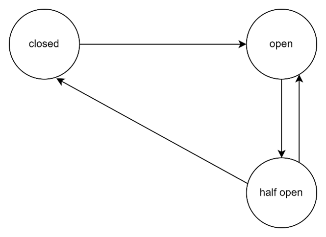

## What is fault Tolerance?

*Fault tolerance is the property that enables a system to continue operating properly in the event of the failure of some of its components.

* Hystrix provides Fault Tolerance by :
* Stop cascading failures. Fallbacks and graceful degradation.

* We’ll use the library and implement the Circuit Breaker design pattern, which is describing a strategy against failure cascading or fault tolerance at different levels in an application.

* Hystrix is watching methods for failing calls to related services. If there is such a failure, it will open the circuit and forward the call to a fallback method.

* Hystrix circuit Breaker will tolerate failures up to a threshold. Beyond that, it leaves the circuit open. Which means, it will forward all subsequent calls to the fallback method, to prevent future failures. This creates a time buffer for the related service to recover from its failing state.

The problem with Sync Communication is
a)	The inventory service may be down.
b)	The inventory service may respond slowly to the order service, the remote service calls can be slow due to api performance or database calls.
c)	This is not a good thing for the app performance.
d)	So our System/app should be Resilience.

Resilience should be able to recover or act accordingly to the difficult situations.

We have some set of States for the circuit Breaker.

Closed: If the communication between the Services and working perfectly then it is in closed state.

•	If the inventory Service is not responding to the Order Service due to network issues, service not available situations then circuit breaker will go into the state of Open.
•	So, in this state there is no meaning of requesting the inventory Service api’s.
•	So the inventory Service won’t allow any calls from Order Service.
•	We can configure that for certain amount of time don’t allow the requests to inventory service.
•	In this case we can send some custom logic or message which is handled by FallBackMethod.
•	After some certain duration in Open state, it moves to the Half Open state.
•	So in this state, the inventory service will start taking the requests to the inventory service.
•	It will check whether the requests are going through.
•	If the requests are still not going through, it will change the state to Open and executes the Fall Back Logic.
•	If the requests are going through then the state will move to Closed.
Implementing Fallback mechanism :
a)	Add  the below dependencies

      <dependency>
      <groupId>org.springframework.cloud</groupId>
      <artifactId>spring-cloud-starter-circuitbreaker-resilience4j</artifactId>
      <version>3.1.1</version>
      </dependency>

     <dependency>
     <groupId>org.springframework.boot</groupId>
     <artifactId>spring-boot-starter-actuator</artifactId>
     </dependency>

Step 2: Configure Properties
Add the following properties to your application.yml file:

    # Enable actuator
    management:
      health:
        circuitBreakers:
          enabled: true
      endpoints:
        web:
          exposure:
            include: '*'
      health:
        show-details: always

## Resilience4j properties
     resilience4j:
       circuitbreaker:
         instances:
           inventory:
             registerHealthIndicator: true
             event-consumer-buffer-size: 10
             slidingWindowType: COUNT_BASED
             slidingWindowSize: 5
             failureRateThreshold: 50
             waitDurationInOpenState: 5s
             permittedNumberOfCallsInHalfOpenState: 3
             automaticTransitionFromOpenToHalfOpenEnabled: true

•	For understanding the different states of Circuit Breaker then

        registerHealthIndicator: true

•	    For storing the states of CB of max-size , can define the no.of states we can see.

        event-consumer-buffer-size: 10

•	 Circuit Breaker will change the state from closed to open if the request is not successful.
     i.e If 5 requests are failing then the state will change to Open, for counting these requests which are failed, sliding window type is property.

        slidingWindowType: COUNT_BASED

•	Maximum requests required to change from open to closed , can be defined by.
         
       slidingWindowSize: 5

•	After a certain percentage of maximum failed requests the state from closed to open should be changed.

      failureRateThreshold: 50

•	Time required to change from open to Half-Open state.

        waitDurationInOpenState: 5s

•	Maximum that can be allowed to be taken in Half open state.

        permittedNumberOfCallsInHalfOpenState: 3

•	The state from open to Half-open must be changed automatically.

        automaticTransitionFromOpenToHalfOpenEnabled: true

Step 3: Implement Circuit Breaker in Controller or Service Layer

   Add the @CircuitBreaker annotation to your controller or service method, along with a fallback method:

       @CircuitBreaker(name = "inventory",fallbackMethod = "fallbackMethod")
       public String placeOrder(@RequestBody OrderRequestDto orderRequestDto){
         log.info("inside order controller");
         return orderService.placeOrder(orderRequestDto);
          }

       public String fallbackMethod(OrderRequestDto orderRequestDto, RuntimeException runtimeException){
      return "Oops! Something went wrong, please try after sometime";
         }

Monitoring Circuit Breaker States
You can check the states of the circuit breaker using the actuator endpoint:

      http://localhost:portNo/actuator/circuitbreakers

Step 4: Configure TimeLimiter 

•	The inventory service may not respond in time due to network issue or database performance issues or api performance issues.
•	So in this case we can introduce the concept of timeout, if the request to the 2nd microservice is not responding or the response time for the request id more.
•	Order service will wait for certain duration of time for the response of inventory service.
•	After that duration, it will not wait for the response, it will terminate the call.

Add the following properties to your application.yml file to configure timeouts and retries:

 
    timelimiter:
      instances:
        inventory:
          timeout-duration: 3s

    @CircuitBreaker(name = "inventory",fallbackMethod = "fallbackMethod")
    @TimeLimiter(name = "inventory")
    public CompletableFuture<String> placeOrder(@RequestBody OrderRequestDto orderRequestDto){
    log.info("inside order controller");
    return CompletableFuture.supplyAsync(()->orderService.placeOrder(orderRequestDto));
    }

    public CompletableFuture<String> fallbackMethod(OrderRequestDto orderRequestDto, RuntimeException runtimeException){
    return CompletableFuture.supplyAsync(()->"Oops! Something went wrong, please try after sometime");
    }

## Retry
*	If the 2nd microservice is not responding the first microservice will send the request again to the 2nd service without the interference of the client.
*	This mechanism is called Retry.

    retry:
      instances:
        inventory:
          max-attempts: 3
          wait-duration: 5s

and add the annotation @Retry(name = "inventory")

## Summary
By implementing the Circuit Breaker pattern with Spring Boot and Resilience4j, we can enhance the resilience of our application. The circuit breaker monitors the interaction between services and halts requests when a service is down or slow, allowing the system to recover gracefully and maintain performance. Additionally, using timeouts and retries further improves the robustness of the application.