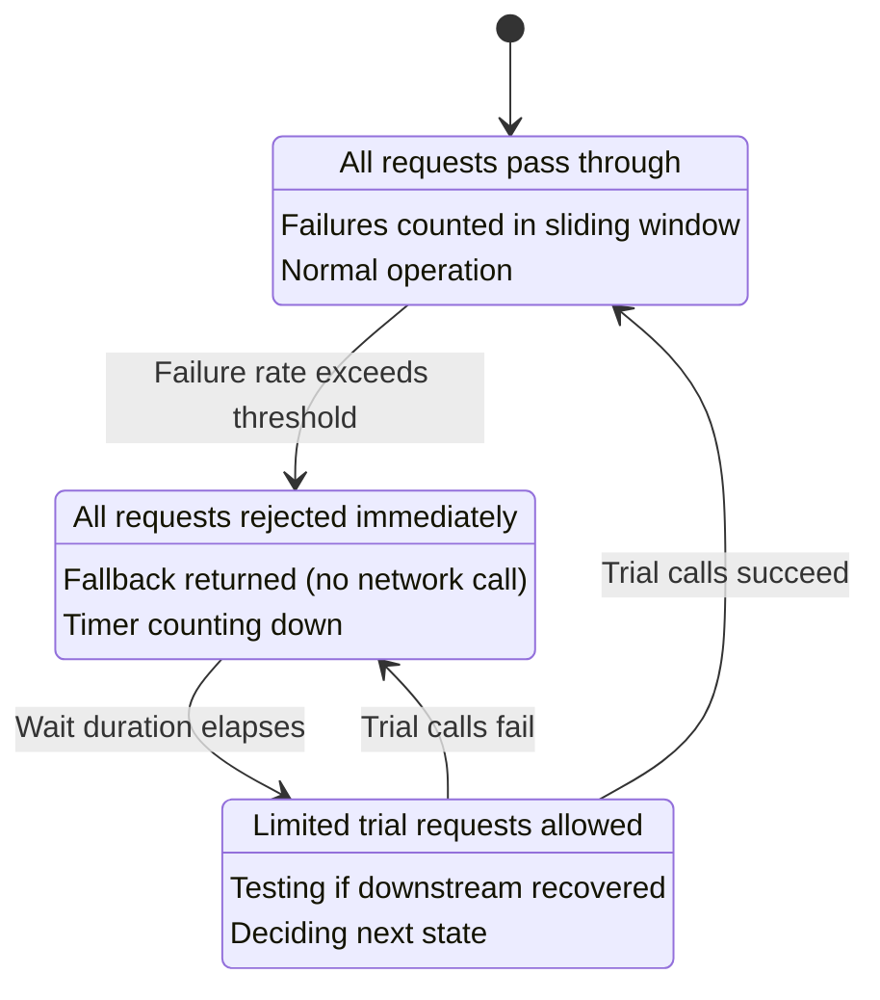
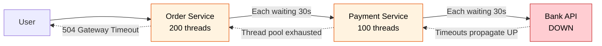
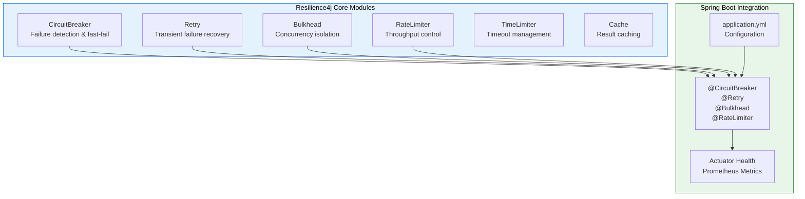
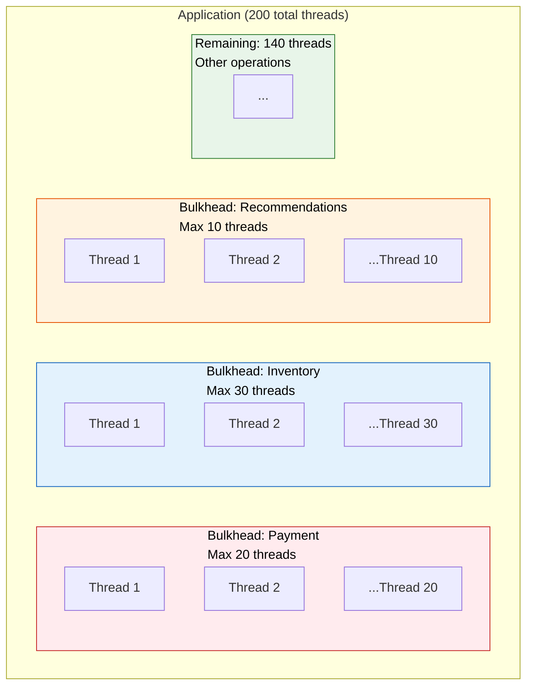
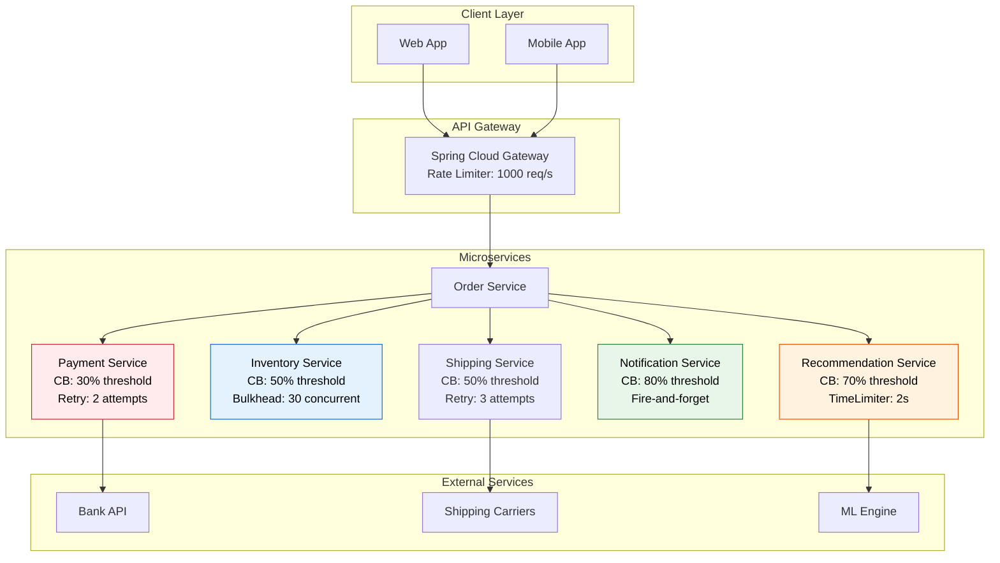
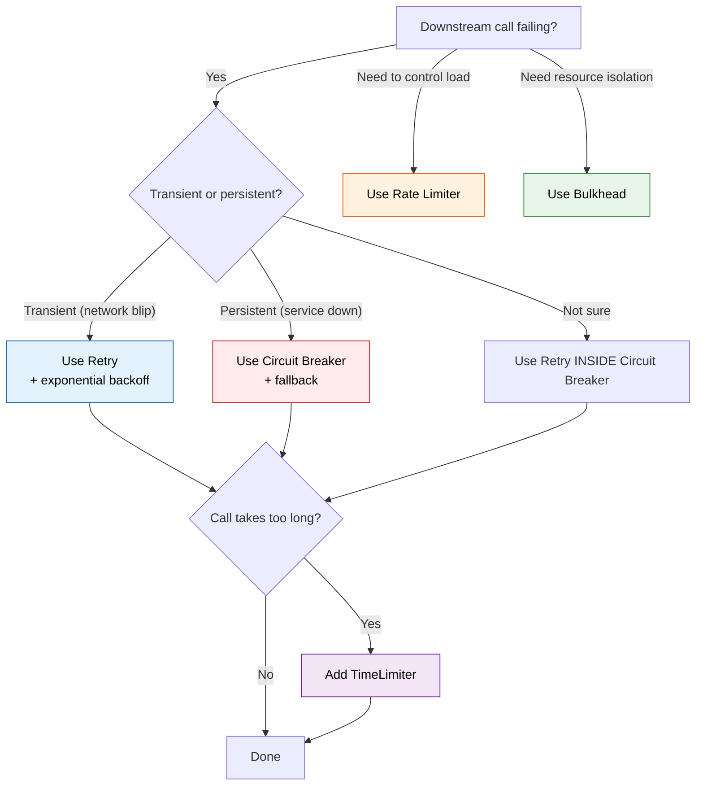

# Circuit Breaker Pattern

!!! eli5 "In Simple Terms 🧒"
    A circuit breaker is like a fuse in your house. When too much electricity flows through
    (too many failures), the fuse blows (circuit opens) to protect your appliances from
    catching fire. You stop sending electricity until you fix the problem. After a while, you
    carefully test if things work again (half-open state). If the test passes, normal power
    resumes. Without the fuse, one broken appliance could burn down the whole house.

A circuit breaker is the difference between a 5-minute blip and a 2-hour cascading outage. Without one, every thread blocks waiting for a slow downstream, exhausting the thread pool, taking down the entire service — and then the next service upstream does the same thing. Your entire platform collapses like dominoes because one database connection pool in a payment provider hit its limit.

!!! tip "💡 One-liner for interviews"
    "A circuit breaker monitors downstream failures and short-circuits requests when a service is unhealthy — failing fast with a fallback instead of waiting and exhausting resources."

---

## What Is a Circuit Breaker?

Think about the electrical circuit breaker in your house. When a short circuit occurs, the breaker trips open to prevent the wires from catching fire. You don't keep pushing current through a broken circuit — that makes things worse. Once the problem is fixed, you flip the breaker back on.

The software circuit breaker does exactly the same thing. It wraps calls to an external service and monitors failures. When failures exceed a threshold, it "trips open" — immediately returning a fallback response without making the network call at all. After a cooldown period, it lets a few trial requests through to test if the service has recovered.

**The core insight:** Slow is worse than down. A service that returns errors in 5ms is easy to handle. A service that hangs for 30 seconds before timing out destroys your entire system because it holds threads hostage.


```mermaid
stateDiagram-v2
    [*] --> CLOSED
    CLOSED --> OPEN: Failure rate exceeds threshold
    OPEN --> HALF_OPEN: Wait duration elapses
    HALF_OPEN --> CLOSED: Trial calls succeed
    HALF_OPEN --> OPEN: Trial calls fail
    
    CLOSED: All requests pass through
    CLOSED: Failures counted in sliding window
    CLOSED: Normal operation
    OPEN: All requests rejected immediately
    OPEN: Fallback returned (no network call)
    OPEN: Timer counting down
    HALF_OPEN: Limited trial requests allowed
    HALF_OPEN: Testing if downstream recovered
    HALF_OPEN: Deciding next state
```

---

## The Three States — Deep Dive

### CLOSED State (Normal Operation)

Every request passes through to the downstream service. The circuit breaker silently records outcomes in a sliding window. As long as the failure rate stays below the configured threshold, nothing happens — the breaker is invisible.

**What counts as failure?** Exceptions, timeouts, HTTP 5xx responses — whatever you configure. Business exceptions (like "item not found") typically should NOT count as circuit breaker failures.

### OPEN State (Failing Fast)

The circuit has tripped. Every incoming request is immediately rejected without making a network call. The fallback response is returned in microseconds instead of waiting 30 seconds for a timeout. This is the protective state — it gives the downstream service breathing room to recover instead of hammering it with requests it can't handle.

**Key detail:** An automatic timer starts when the circuit opens. After `waitDurationInOpenState` elapses, the circuit transitions to HALF_OPEN.

### HALF_OPEN State (Testing Recovery)

The circuit cautiously allows a configured number of trial requests through to test if the downstream service has recovered. If these succeed above the threshold, the circuit closes (back to normal). If they fail, it reopens and the wait timer resets.

**This is the most critical state for tuning.** Too few trial calls = slow recovery. Too many trial calls = you overwhelm a service that just came back up.

| State | Requests | Latency | Resource Usage | Purpose |
|-------|----------|---------|----------------|---------|
| **CLOSED** | Pass through | Normal (network call) | Normal | Monitoring |
| **OPEN** | Rejected immediately | Microseconds (no network) | Minimal | Protection |
| **HALF_OPEN** | Limited trial | Normal (network call) | Minimal | Recovery testing |

!!! example "🎯 Interview Tip"
    When explaining the states, emphasize WHY each exists:  
    CLOSED = "trust but verify" (monitoring)  
    OPEN = "protect the system" (circuit is broken, stop trying)  
    HALF_OPEN = "cautious optimism" (is it safe to reconnect?)

---

## Why Circuit Breakers — The Cascading Failure Problem


```mermaid
flowchart LR
    U["User"] --> A["Order Service<br/>200 threads"]
    A -->|"Each waiting 30s"| B["Payment Service<br/>100 threads"]
    B -->|"Each waiting 30s"| C["Bank API<br/>DOWN"]
    
    C -.->|"Timeouts propagate UP"| B
    B -.->|"Thread pool exhausted"| A
    A -.->|"504 Gateway Timeout"| U
    
    style C fill:#FFCDD2,stroke:#C62828,color:#000
    style B fill:#FFF3E0,stroke:#E65100,color:#000
    style A fill:#FFF3E0,stroke:#E65100,color:#000
```

**Without a circuit breaker, here's what happens:**

1. Bank API goes down (or gets slow — same effect)
2. Payment Service makes calls to Bank API. Each thread blocks for 30 seconds waiting for a timeout
3. Payment Service has 100 threads. After 100 concurrent orders, all threads are blocked waiting
4. Payment Service thread pool is exhausted. It can't handle any requests — even for non-bank operations
5. Order Service calls Payment Service. Same thing — threads start blocking
6. Order Service thread pool exhausts. Now the entire checkout flow is dead
7. API Gateway starts queuing. Health checks fail. Load balancer removes nodes
8. **Total outage. One slow dependency killed everything.**

!!! danger "⚠️ What breaks"
    The insidious part: the Bank API might not even be "down." It might just be slow — responding in 25 seconds instead of 200ms. Slow dependencies are MORE dangerous than fast-failing ones because they hold resources hostage.

**With a circuit breaker:**

1. Bank API gets slow
2. Payment Service circuit breaker detects rising failure/timeout rate
3. After threshold exceeded → circuit OPENS
4. All subsequent requests to Bank API immediately get a fallback response (0ms, no thread blocked)
5. Payment Service stays healthy for all other operations
6. Order Service stays healthy
7. Users see "Payment processing delayed, we'll charge you shortly" instead of a 504 error
8. Bank API recovers → HALF_OPEN → trial requests succeed → circuit CLOSES
9. **5-minute blip instead of 2-hour outage**

!!! warning "🔥 Production War Story"
    A major e-commerce platform had no circuit breakers on their recommendation service. During Black Friday, the recommendation engine's database hit connection limits. Without a breaker, every product page waited 30s for recommendations before rendering. Page load times went from 200ms to 30+ seconds. Cart abandonment spiked 90%. The fix took 4 hours to deploy because the deployment pipeline itself was affected. Revenue loss: $12M. The recommendation service wasn't even critical — they could have shown "Popular Items" as a fallback.

---

## Resilience4j — The Modern Standard

### Why Resilience4j, Not Hystrix?

Netflix Hystrix entered maintenance mode in November 2018. Netflix moved to adaptive concurrency limits internally and stopped investing in Hystrix. If you're starting a new project with Hystrix in 2024+, you're making a mistake.

| Feature | Hystrix | Resilience4j |
|---------|---------|--------------|
| Status | **Deprecated** (no updates since 2018) | Actively maintained |
| Design | Monolithic (all-or-nothing) | Modular (pick what you need) |
| Java Version | Java 6+ (old patterns) | Java 8+ (functional, CompletableFuture) |
| Dependencies | Archaius, RxJava, many transitive | Zero external dependencies (core) |
| Spring Boot | Spring Cloud Netflix (deprecated) | Spring Cloud Circuit Breaker (official) |
| Metrics | HystrixDashboard (custom) | Micrometer (Prometheus, Datadog, etc.) |
| Thread Model | Dedicated thread pools per command | Semaphore-based (lighter) or thread pool |
| Sliding Window | Fixed 10-second buckets | COUNT_BASED or TIME_BASED (configurable) |
| Configuration | Code-based mostly | YAML/properties + programmatic |

### Resilience4j Module Architecture


```mermaid
flowchart TB
    subgraph Core["Resilience4j Core Modules"]
        CB["CircuitBreaker<br/>Failure detection & fast-fail"]
        RT["Retry<br/>Transient failure recovery"]
        BH["Bulkhead<br/>Concurrency isolation"]
        RL["RateLimiter<br/>Throughput control"]
        TL["TimeLimiter<br/>Timeout management"]
        CH["Cache<br/>Result caching"]
    end
    
    subgraph Integration["Spring Boot Integration"]
        ANN["@CircuitBreaker<br/>@Retry<br/>@Bulkhead<br/>@RateLimiter"]
        ACT["Actuator Health<br/>Prometheus Metrics"]
        CFG["application.yml<br/>Configuration"]
    end
    
    CB --> ANN
    RT --> ANN
    BH --> ANN
    RL --> ANN
    ANN --> ACT
    CFG --> ANN
    
    style Core fill:#E3F2FD,stroke:#1565C0,color:#000
    style Integration fill:#E8F5E9,stroke:#2E7D32,color:#000
```

### Dependencies (Spring Boot)

```xml
<!-- Circuit Breaker + Spring Cloud integration -->
<dependency>
    <groupId>org.springframework.cloud</groupId>
    <artifactId>spring-cloud-starter-circuitbreaker-resilience4j</artifactId>
</dependency>

<!-- AOP support for annotations -->
<dependency>
    <groupId>org.springframework.boot</groupId>
    <artifactId>spring-boot-starter-aop</artifactId>
</dependency>

<!-- Health endpoints and metrics -->
<dependency>
    <groupId>org.springframework.boot</groupId>
    <artifactId>spring-boot-starter-actuator</artifactId>
</dependency>

<!-- Prometheus metrics export (production) -->
<dependency>
    <groupId>io.micrometer</groupId>
    <artifactId>micrometer-registry-prometheus</artifactId>
</dependency>
```

---

## Configuration Deep Dive

Every configuration parameter exists for a reason. Understanding WHY each one matters is the difference between a circuit breaker that works and one that either never trips or flaps constantly.

### Core Parameters Explained

```yaml
resilience4j:
  circuitbreaker:
    instances:
      paymentService:
        # --- Failure Detection ---
        failureRateThreshold: 50              # Open when 50% of calls fail
        slowCallRateThreshold: 80             # Open when 80% of calls are slow
        slowCallDurationThreshold: 3s         # What counts as "slow"
        
        # --- Sliding Window ---
        slidingWindowType: COUNT_BASED        # COUNT_BASED or TIME_BASED
        slidingWindowSize: 20                 # Last 20 calls (or 20 seconds)
        minimumNumberOfCalls: 10              # Don't evaluate until 10 calls
        
        # --- State Transitions ---
        waitDurationInOpenState: 30s          # How long to stay OPEN
        permittedNumberOfCallsInHalfOpenState: 5  # Trial calls in HALF_OPEN
        automaticTransitionFromOpenToHalfOpenEnabled: true
        
        # --- What Counts as Failure ---
        recordExceptions:
          - java.io.IOException
          - java.util.concurrent.TimeoutException
          - org.springframework.web.client.HttpServerErrorException
        ignoreExceptions:
          - com.example.BusinessNotFoundException   # 404 is not a failure
          - com.example.ValidationException         # Bad input is not downstream failure
```

### Parameter-by-Parameter Breakdown

| Parameter | What It Does | Too Low | Too High | Recommended |
|-----------|-------------|---------|----------|-------------|
| `failureRateThreshold` | % failures to trip circuit | Trips on minor blips (flapping) | Never trips, cascading failure | 50% for critical, 30% for non-critical |
| `slowCallRateThreshold` | % slow calls to trip | Trips during normal variance | Misses gradual degradation | 80-100% |
| `slowCallDurationThreshold` | What "slow" means | Normal calls trigger it | Misses actual slowness | 2-5x your p99 latency |
| `slidingWindowSize` | How many calls to evaluate | Not enough data, noisy | Slow to react to failures | 10-20 (count) or 10-60s (time) |
| `minimumNumberOfCalls` | Min calls before evaluating | 1 failure = 100% rate = trip | Slow initial protection | 5-10 |
| `waitDurationInOpenState` | How long to stay OPEN | Premature recovery attempts | Slow recovery after fix | 10-60s depending on service |
| `permittedNumberOfCallsInHalfOpenState` | Trial calls for recovery | Not enough signal | Overwhelm recovering service | 3-10 |

!!! tip "💡 One-liner for interviews"
    "`minimumNumberOfCalls` prevents the circuit from opening on the very first failure — you need a statistically meaningful sample before deciding a service is unhealthy."

---

## Sliding Window Types

### COUNT_BASED

Evaluates the last N calls regardless of when they happened. If `slidingWindowSize: 10`, it tracks the outcomes of the last 10 calls and calculates failure rate from those.

**When to use:** Consistent traffic. Services called at a predictable rate. Most common choice.

**Gotcha:** If traffic is bursty, a burst of 10 failures in 100ms opens the circuit even if the service was fine before and after.

### TIME_BASED

Evaluates all calls within the last N seconds. If `slidingWindowSize: 60`, it looks at every call made in the last 60 seconds.

**When to use:** Variable traffic. Services where call volume fluctuates significantly (batch jobs, event-driven).

**Gotcha:** During low traffic, you might not hit `minimumNumberOfCalls` for a long time, delaying protection.

```java
// Programmatic configuration showing both types
CircuitBreakerConfig countBased = CircuitBreakerConfig.custom()
    .slidingWindowType(SlidingWindowType.COUNT_BASED)
    .slidingWindowSize(20)       // Last 20 calls
    .minimumNumberOfCalls(10)    // Need at least 10 before evaluating
    .failureRateThreshold(50)
    .build();

CircuitBreakerConfig timeBased = CircuitBreakerConfig.custom()
    .slidingWindowType(SlidingWindowType.TIME_BASED)
    .slidingWindowSize(60)       // Last 60 seconds
    .minimumNumberOfCalls(20)    // Need at least 20 calls in that window
    .failureRateThreshold(50)
    .build();
```

!!! question "❓ Counter-questions"
    **Q: "When would you choose TIME_BASED over COUNT_BASED?"**  
    A: When traffic is highly variable. Example: a batch processing service that gets 1000 calls/minute during batch runs but 2 calls/minute otherwise. COUNT_BASED with size 10 would evaluate 5 minutes of "normal" traffic as one window during quiet periods — stale data. TIME_BASED with 60s always looks at "the last minute" regardless of volume, giving fresher signal during quiet periods.

---

## Fallback Strategies

A circuit breaker without a good fallback is only half the solution. The fallback determines what users actually experience during an outage.

### Strategy 1: Default/Static Value

Return a safe default. Simplest approach.

```java
private ProductResponse getProductFallback(String productId, Throwable t) {
    return ProductResponse.builder()
        .id(productId)
        .name("Product")
        .price(BigDecimal.ZERO)  // Don't show price if pricing service is down
        .available(false)        // Safer to say unavailable than to sell what you can't fulfill
        .message("Some details temporarily unavailable")
        .build();
}
```

### Strategy 2: Cached Data

Return the last known good response. Best for data that doesn't change frequently.

```java
@Service
public class ProductService {
    
    private final Cache<String, ProductResponse> productCache;
    
    @CircuitBreaker(name = "catalogService", fallbackMethod = "catalogFallback")
    public ProductResponse getProduct(String productId) {
        ProductResponse response = catalogClient.getProduct(productId);
        productCache.put(productId, response);  // Cache on success
        return response;
    }
    
    private ProductResponse catalogFallback(String productId, Throwable t) {
        ProductResponse cached = productCache.getIfPresent(productId);
        if (cached != null) {
            cached.setStale(true);  // Flag as potentially stale
            return cached;
        }
        // No cache available — return minimal response
        return ProductResponse.unavailable(productId);
    }
}
```

### Strategy 3: Degraded Service

Call a simpler/cheaper alternative service.

```java
private List<Product> recommendationsFallback(String userId, Throwable t) {
    // ML recommendation engine is down
    // Fall back to simple "most popular" which is a cheap DB query
    return popularProductsService.getTopProducts(10);
}
```

### Strategy 4: Queue for Later

Accept the request and process it asynchronously when the service recovers.

```java
private OrderResponse paymentFallback(OrderRequest request, Throwable t) {
    // Payment service is down — don't reject the order!
    // Queue it for processing when service recovers
    paymentRetryQueue.send(PaymentMessage.from(request));
    
    return OrderResponse.builder()
        .status("ACCEPTED_PENDING_PAYMENT")
        .message("Order accepted! Payment will be processed shortly.")
        .orderId(UUID.randomUUID().toString())
        .build();
}
```

### Strategy 5: Feature Toggle

Disable the feature entirely and hide it from the UI.

```java
private FeatureResponse featureFallback(String userId, Throwable t) {
    // Tell the frontend to hide this feature section entirely
    return FeatureResponse.disabled();
}
```

!!! warning "🔥 Production War Story"
    An airline booking system had a circuit breaker on their seat map service — but the fallback threw a NullPointerException because nobody tested it. When the seat map service went down during peak booking season, the circuit breaker opened correctly... and then the fallback crashed the entire booking page. **Always test your fallbacks under realistic conditions.**

---

## Circuit Breaker + Retry — Order Matters!

This is one of the most misunderstood aspects of resilience patterns. The decoration order determines behavior.

### Correct: Retry INSIDE Circuit Breaker

```
Request → CircuitBreaker → Retry → Actual Call
```

The circuit breaker wraps the retry. If all retries fail, that counts as ONE failure for the circuit breaker. Three retries failing = one circuit breaker failure count.

### Wrong: Retry OUTSIDE Circuit Breaker

```
Request → Retry → CircuitBreaker → Actual Call
```

If the circuit is OPEN, the retry will retry the rejection itself — pointless retries against a circuit that won't let anything through.

### Resilience4j Decoration Order

Resilience4j applies decorators in this fixed order (outermost to innermost):

```
Retry → CircuitBreaker → RateLimiter → TimeLimiter → Bulkhead → Function
```

This means:

- **Retry** wraps everything — if the circuit breaker rejects (CallNotPermittedException), retry can optionally retry after wait
- **CircuitBreaker** checks if the call is allowed before proceeding
- **RateLimiter** controls throughput
- **TimeLimiter** enforces timeout on the actual call
- **Bulkhead** limits concurrency for the actual execution

```java
@Retry(name = "paymentService")
@CircuitBreaker(name = "paymentService", fallbackMethod = "paymentFallback")
@RateLimiter(name = "paymentService")
@TimeLimiter(name = "paymentService")
@Bulkhead(name = "paymentService")
public CompletableFuture<PaymentResponse> processPayment(PaymentRequest request) {
    return CompletableFuture.supplyAsync(() -> paymentClient.charge(request));
}
```

```yaml
resilience4j:
  retry:
    instances:
      paymentService:
        maxAttempts: 3
        waitDuration: 1s
        enableExponentialBackoff: true
        exponentialBackoffMultiplier: 2
        retryExceptions:
          - java.io.IOException
          - java.util.concurrent.TimeoutException
        ignoreExceptions:
          - io.github.resilience4j.circuitbreaker.CallNotPermittedException  # Don't retry when circuit is OPEN
          
  circuitbreaker:
    instances:
      paymentService:
        slidingWindowSize: 10
        failureRateThreshold: 50
        waitDurationInOpenState: 30s
```

!!! danger "⚠️ What breaks"
    If you configure retry to also retry `CallNotPermittedException`, you'll retry 3 times against an OPEN circuit — wasting time for the same rejection. Always add `CallNotPermittedException` to `ignoreExceptions` in your retry config unless you intentionally want to wait for the circuit to transition to HALF_OPEN.

---

## Bulkhead Pattern — Resource Isolation

The bulkhead pattern comes from ship design. Ships have watertight compartments (bulkheads) so that if one compartment floods, the others stay dry and the ship stays afloat. In software, this means isolating resources so one slow service can't consume all available threads/connections.


```mermaid
flowchart TB
    subgraph Application["Application (200 total threads)"]
        subgraph BH1["Bulkhead: Payment<br/>Max 20 threads"]
            P1["Thread 1"] 
            P2["Thread 2"]
            P3["...Thread 20"]
        end
        subgraph BH2["Bulkhead: Inventory<br/>Max 30 threads"]
            I1["Thread 1"]
            I2["Thread 2"]
            I3["...Thread 30"]
        end
        subgraph BH3["Bulkhead: Recommendations<br/>Max 10 threads"]
            R1["Thread 1"]
            R2["Thread 2"]
            R3["...Thread 10"]
        end
        subgraph Shared["Remaining: 140 threads<br/>Other operations"]
            S1["..."]
        end
    end
    
    style BH1 fill:#FFEBEE,stroke:#C62828,color:#000
    style BH2 fill:#E3F2FD,stroke:#1565C0,color:#000
    style BH3 fill:#FFF3E0,stroke:#E65100,color:#000
    style Shared fill:#E8F5E9,stroke:#2E7D32,color:#000
```

### Semaphore Bulkhead

Uses a semaphore to limit concurrent calls. Runs on the caller's thread. Lightweight, no thread pool overhead.

```yaml
resilience4j:
  bulkhead:
    instances:
      inventoryService:
        maxConcurrentCalls: 20          # Max 20 parallel calls
        maxWaitDuration: 200ms          # Wait max 200ms for a permit, then reject
```

```java
@Bulkhead(name = "inventoryService", fallbackMethod = "bulkheadFallback")
@CircuitBreaker(name = "inventoryService", fallbackMethod = "circuitBreakerFallback")
public InventoryResponse checkInventory(String sku) {
    return inventoryClient.check(sku);
}

private InventoryResponse bulkheadFallback(String sku, BulkheadFullException e) {
    log.warn("Bulkhead full for inventory check: {}", sku);
    return InventoryResponse.unknown(sku);  // Can't confirm stock right now
}
```

**When to use:** Most cases. Lower overhead, simpler mental model.

### Thread Pool Bulkhead

Uses a separate thread pool. The caller's thread is not blocked — the call executes on the bulkhead's thread pool and returns a CompletableFuture.

```yaml
resilience4j:
  thread-pool-bulkhead:
    instances:
      paymentService:
        maxThreadPoolSize: 10           # Max 10 threads
        coreThreadPoolSize: 5           # Keep 5 alive
        queueCapacity: 25              # Queue 25 more before rejecting
        keepAliveDuration: 100ms
```

```java
@Bulkhead(name = "paymentService", type = Bulkhead.Type.THREADPOOL)
public CompletableFuture<PaymentResponse> processPayment(PaymentRequest req) {
    return CompletableFuture.supplyAsync(() -> paymentClient.charge(req));
}
```

**When to use:** When you want true thread isolation (caller thread never blocks). When the downstream call is very slow and you don't want to hold the request-handling thread.

| Aspect | Semaphore | Thread Pool |
|--------|-----------|-------------|
| Thread usage | Caller's thread | Dedicated pool |
| Overhead | Low | Higher (thread context switch) |
| Return type | Synchronous | CompletableFuture |
| Timeout support | Need TimeLimiter | Built-in via Future.get() |
| Best for | Fast calls, reactive | Slow calls, blocking I/O |

!!! tip "💡 One-liner for interviews"
    "Semaphore bulkhead limits concurrency on the caller's thread. Thread pool bulkhead provides true isolation — a slow service can't block the caller's thread at all because execution happens on a separate pool."

---

## Rate Limiter

Controls how many calls are made to a service in a given time period. Protects downstream services from being overwhelmed (different from circuit breaker which reacts to failures — rate limiter prevents them proactively).

### How It Works Internally

Resilience4j's rate limiter uses a token-bucket algorithm under the hood:

- Tokens are added to a bucket at a fixed rate (`limitRefreshPeriod`)
- Each call consumes one token
- If no tokens available, the call waits up to `timeoutDuration` for a new token
- If timeout expires before getting a token, the call is rejected

```yaml
resilience4j:
  ratelimiter:
    instances:
      externalApiService:
        limitForPeriod: 50               # 50 calls allowed per period
        limitRefreshPeriod: 1s           # Period resets every 1 second
        timeoutDuration: 500ms           # Wait max 500ms for permission
        registerHealthIndicator: true
        eventConsumerBufferSize: 100
```

```java
@RateLimiter(name = "externalApiService", fallbackMethod = "rateLimitFallback")
public ExchangeRate getExchangeRate(String currency) {
    return externalRateApi.getRate(currency);
}

private ExchangeRate rateLimitFallback(String currency, RequestNotPermitted e) {
    log.warn("Rate limit hit for exchange rate API");
    return exchangeRateCache.getLastKnown(currency);  // Use cached rate
}
```

!!! example "🎯 Interview Tip"
    Rate limiter vs. circuit breaker:  
    - **Rate limiter** = proactive. "Don't send more than 50 requests/second regardless of success/failure"  
    - **Circuit breaker** = reactive. "The service is failing, stop sending requests until it recovers"  
    They complement each other. Use both.

---

## TimeLimiter — Timeout Management

Cancels a call if it exceeds a deadline. Without this, a hanging service holds your thread forever (or until the HTTP client timeout, which is often too generous).

```yaml
resilience4j:
  timelimiter:
    instances:
      inventoryService:
        timeoutDuration: 3s              # Cancel after 3 seconds
        cancelRunningFuture: true        # Actually interrupt the thread
```

```java
@TimeLimiter(name = "inventoryService")
@CircuitBreaker(name = "inventoryService", fallbackMethod = "fallback")
public CompletableFuture<InventoryResponse> checkInventoryAsync(String sku) {
    return CompletableFuture.supplyAsync(() -> {
        // If this takes > 3s, TimeLimiter cancels it
        return inventoryClient.check(sku);
    });
}

public CompletableFuture<InventoryResponse> fallback(String sku, TimeoutException e) {
    return CompletableFuture.completedFuture(
        InventoryResponse.builder()
            .sku(sku)
            .status("TIMEOUT")
            .message("Inventory check timed out, assuming available")
            .build()
    );
}
```

**Important:** TimeLimiter requires `CompletableFuture` return type. For synchronous calls, use your HTTP client's timeout instead (e.g., `RestTemplate.setReadTimeout()`).

---

## Spring Boot Integration — Complete Implementation

### Annotation-Based (Recommended for Most Cases)

```java
@Service
@Slf4j
public class OrderService {
    
    private final PaymentClient paymentClient;
    private final InventoryClient inventoryClient;
    private final RecommendationClient recommendationClient;
    private final OrderRepository orderRepository;
    private final PaymentRetryQueue retryQueue;
    
    @CircuitBreaker(name = "paymentService", fallbackMethod = "paymentFallback")
    @Retry(name = "paymentService")
    public PaymentResult processPayment(Order order) {
        log.info("Processing payment for order: {}", order.getId());
        
        PaymentResponse response = paymentClient.charge(
            ChargeRequest.builder()
                .orderId(order.getId())
                .amount(order.getTotal())
                .currency(order.getCurrency())
                .idempotencyKey(order.getPaymentIdempotencyKey())  // Critical for retries!
                .build()
        );
        
        order.setPaymentId(response.getTransactionId());
        order.setStatus(OrderStatus.PAID);
        orderRepository.save(order);
        
        return PaymentResult.success(response.getTransactionId());
    }
    
    private PaymentResult paymentFallback(Order order, Throwable t) {
        log.warn("Payment circuit breaker fallback for order {}: {}", 
                 order.getId(), t.getMessage());
        
        // Queue for async processing — don't lose the sale!
        retryQueue.enqueue(order);
        order.setStatus(OrderStatus.PAYMENT_PENDING);
        orderRepository.save(order);
        
        return PaymentResult.pending("Payment will be processed shortly");
    }
    
    @CircuitBreaker(name = "inventoryService", fallbackMethod = "inventoryFallback")
    @Bulkhead(name = "inventoryService")
    public boolean checkInventory(String sku, int quantity) {
        return inventoryClient.isAvailable(sku, quantity);
    }
    
    private boolean inventoryFallback(String sku, int quantity, Throwable t) {
        log.warn("Inventory check fallback for SKU {}: {}", sku, t.getMessage());
        // Optimistic: allow the order, handle stock issues later
        // This is a business decision — discuss with product team
        return true;
    }
    
    @CircuitBreaker(name = "recommendationService", fallbackMethod = "recommendationFallback")
    @TimeLimiter(name = "recommendationService")
    @Bulkhead(name = "recommendationService")
    public CompletableFuture<List<Product>> getRecommendations(String userId) {
        return CompletableFuture.supplyAsync(() -> 
            recommendationClient.getPersonalized(userId, 10)
        );
    }
    
    private CompletableFuture<List<Product>> recommendationFallback(String userId, Throwable t) {
        // Recommendations are non-critical — show popular items instead
        return CompletableFuture.completedFuture(
            recommendationClient.getPopularItems(10)
        );
    }
}
```

### Full application.yml Configuration

```yaml
spring:
  application:
    name: order-service

management:
  health:
    circuitbreakers:
      enabled: true
  endpoints:
    web:
      exposure:
        include: health, circuitbreakers, circuitbreakerevents, metrics, prometheus
  endpoint:
    health:
      show-details: always
  metrics:
    export:
      prometheus:
        enabled: true

resilience4j:
  circuitbreaker:
    configs:
      # Shared defaults
      default:
        slidingWindowType: COUNT_BASED
        slidingWindowSize: 10
        minimumNumberOfCalls: 5
        failureRateThreshold: 50
        waitDurationInOpenState: 30s
        permittedNumberOfCallsInHalfOpenState: 3
        automaticTransitionFromOpenToHalfOpenEnabled: true
        registerHealthIndicator: true
        recordExceptions:
          - java.io.IOException
          - java.util.concurrent.TimeoutException
          - org.springframework.web.client.HttpServerErrorException
        ignoreExceptions:
          - com.example.BusinessException
          
    instances:
      # Critical path — aggressive protection
      paymentService:
        baseConfig: default
        slidingWindowSize: 10
        failureRateThreshold: 30           # Trip at 30% for payment (critical)
        waitDurationInOpenState: 60s       # Give payment provider more time to recover
        slowCallRateThreshold: 50
        slowCallDurationThreshold: 5s
        
      # Medium criticality
      inventoryService:
        baseConfig: default
        failureRateThreshold: 50
        waitDurationInOpenState: 20s
        
      # Low criticality — aggressive fallback is fine
      recommendationService:
        baseConfig: default
        failureRateThreshold: 70           # More tolerant — it's just recommendations
        waitDurationInOpenState: 10s       # Recover quickly
        slidingWindowSize: 5              # Smaller window — trip faster
        
  retry:
    configs:
      default:
        maxAttempts: 3
        waitDuration: 500ms
        enableExponentialBackoff: true
        exponentialBackoffMultiplier: 2
        retryExceptions:
          - java.io.IOException
          - java.util.concurrent.TimeoutException
        ignoreExceptions:
          - io.github.resilience4j.circuitbreaker.CallNotPermittedException
          
    instances:
      paymentService:
        baseConfig: default
        maxAttempts: 2                     # Payment: fewer retries (idempotency concerns)
        waitDuration: 1s
      inventoryService:
        baseConfig: default
        maxAttempts: 3
        
  bulkhead:
    instances:
      inventoryService:
        maxConcurrentCalls: 30
        maxWaitDuration: 200ms
      recommendationService:
        maxConcurrentCalls: 10
        maxWaitDuration: 100ms
        
  timelimiter:
    instances:
      recommendationService:
        timeoutDuration: 2s
        cancelRunningFuture: true
        
  ratelimiter:
    instances:
      paymentService:
        limitForPeriod: 100
        limitRefreshPeriod: 1s
        timeoutDuration: 0ms              # Reject immediately if rate exceeded
```

### Programmatic Configuration (When You Need Dynamic Control)

```java
@Configuration
public class ResilienceConfig {
    
    @Bean
    public CircuitBreakerRegistry circuitBreakerRegistry() {
        CircuitBreakerConfig paymentConfig = CircuitBreakerConfig.custom()
            .slidingWindowType(SlidingWindowType.COUNT_BASED)
            .slidingWindowSize(10)
            .minimumNumberOfCalls(5)
            .failureRateThreshold(30)
            .slowCallRateThreshold(50)
            .slowCallDurationThreshold(Duration.ofSeconds(5))
            .waitDurationInOpenState(Duration.ofSeconds(60))
            .permittedNumberOfCallsInHalfOpenState(3)
            .automaticTransitionFromOpenToHalfOpenEnabled(true)
            .recordExceptions(IOException.class, TimeoutException.class)
            .ignoreExceptions(BusinessException.class)
            .build();
            
        CircuitBreakerConfig inventoryConfig = CircuitBreakerConfig.custom()
            .slidingWindowType(SlidingWindowType.COUNT_BASED)
            .slidingWindowSize(20)
            .minimumNumberOfCalls(10)
            .failureRateThreshold(50)
            .waitDurationInOpenState(Duration.ofSeconds(20))
            .permittedNumberOfCallsInHalfOpenState(5)
            .build();
        
        return CircuitBreakerRegistry.of(Map.of(
            "paymentService", paymentConfig,
            "inventoryService", inventoryConfig
        ));
    }
    
    @Bean
    public Customizer<Resilience4JCircuitBreakerFactory> circuitBreakerCustomizer() {
        return factory -> {
            factory.configureDefault(id -> new Resilience4JConfigBuilder(id)
                .circuitBreakerConfig(CircuitBreakerConfig.ofDefaults())
                .timeLimiterConfig(TimeLimiterConfig.custom()
                    .timeoutDuration(Duration.ofSeconds(3))
                    .build())
                .build());
        };
    }
}
```

---

## Production Configuration Tuning

### Fast API (< 100ms p99) — Real-time user-facing

```yaml
# Example: Product catalog, search, user profiles
fastApiService:
  slidingWindowSize: 20
  minimumNumberOfCalls: 10
  failureRateThreshold: 40
  slowCallRateThreshold: 60
  slowCallDurationThreshold: 500ms     # 5x normal latency = slow
  waitDurationInOpenState: 15s         # Recover quickly
  permittedNumberOfCallsInHalfOpenState: 5
```

### Slow API (1-5s p99) — Batch/processing

```yaml
# Example: Report generation, ML inference, payment processing
slowApiService:
  slidingWindowType: TIME_BASED
  slidingWindowSize: 60                # 60-second window
  minimumNumberOfCalls: 5
  failureRateThreshold: 50
  slowCallRateThreshold: 80
  slowCallDurationThreshold: 10s       # These are expected to be slow
  waitDurationInOpenState: 60s         # Give more time to recover
  permittedNumberOfCallsInHalfOpenState: 3
```

### Critical Service (Payment, Auth)

```yaml
# Lower threshold — trip early, protect revenue
criticalService:
  slidingWindowSize: 10
  minimumNumberOfCalls: 5
  failureRateThreshold: 30             # Trip at 30% — can't risk payment failures
  slowCallRateThreshold: 50
  waitDurationInOpenState: 60s         # Long cooldown — don't overwhelm recovering service
  permittedNumberOfCallsInHalfOpenState: 2  # Very cautious recovery
```

### Nice-to-Have Service (Recommendations, Analytics)

```yaml
# Higher threshold — more tolerant, aggressive fallback is acceptable
niceToHaveService:
  slidingWindowSize: 5
  minimumNumberOfCalls: 3
  failureRateThreshold: 80             # Very tolerant — partial degradation is fine
  waitDurationInOpenState: 5s          # Short cooldown — try again quickly
  permittedNumberOfCallsInHalfOpenState: 5
```

!!! example "🎯 Interview Tip"
    When asked "How would you configure a circuit breaker?" — always ask back: "What's the criticality of the downstream service and what's the acceptable degradation?" Payment failing = revenue loss (aggressive protection). Recommendations failing = slightly worse UX (tolerant config, good fallback).

---

## Monitoring and Observability

### Actuator Endpoints

```bash
# Check all circuit breaker states
curl localhost:8080/actuator/health | jq '.components.circuitBreakers'

# Response:
{
  "status": "UP",
  "details": {
    "paymentService": {
      "status": "UP",
      "details": {
        "state": "CLOSED",
        "failureRate": "10.0%",
        "slowCallRate": "5.0%",
        "bufferedCalls": 20,
        "failedCalls": 2,
        "slowCalls": 1,
        "notPermittedCalls": 0
      }
    },
    "inventoryService": {
      "status": "CIRCUIT_OPEN",
      "details": {
        "state": "OPEN",
        "failureRate": "60.0%",
        "bufferedCalls": 10,
        "failedCalls": 6,
        "notPermittedCalls": 147
      }
    }
  }
}
```

### Event Listeners (Custom Alerting)

```java
@Component
@Slf4j
public class CircuitBreakerEventListener {
    
    public CircuitBreakerEventListener(CircuitBreakerRegistry registry) {
        registry.getAllCircuitBreakers().forEach(cb -> {
            cb.getEventPublisher()
                .onStateTransition(event -> {
                    log.warn("Circuit breaker '{}' transitioned: {} -> {}",
                        event.getCircuitBreakerName(),
                        event.getStateTransition().getFromState(),
                        event.getStateTransition().getToState());
                    
                    if (event.getStateTransition().getToState() == CircuitBreaker.State.OPEN) {
                        alertingService.sendAlert(
                            AlertLevel.HIGH,
                            "Circuit breaker OPENED: " + event.getCircuitBreakerName()
                        );
                    }
                })
                .onError(event -> {
                    log.debug("Circuit breaker '{}' recorded error: {}",
                        event.getCircuitBreakerName(),
                        event.getThrowable().getMessage());
                })
                .onCallNotPermitted(event -> {
                    metricsService.incrementCounter(
                        "circuit_breaker_rejected_total",
                        "name", event.getCircuitBreakerName()
                    );
                });
        });
    }
}
```

### Prometheus Metrics

Resilience4j automatically exposes metrics via Micrometer:

```promql
# Circuit breaker state (0=CLOSED, 1=OPEN, 2=HALF_OPEN)
resilience4j_circuitbreaker_state{name="paymentService"}

# Failure rate
resilience4j_circuitbreaker_failure_rate{name="paymentService"}

# Call outcomes
rate(resilience4j_circuitbreaker_calls_seconds_count{name="paymentService",kind="successful"}[5m])
rate(resilience4j_circuitbreaker_calls_seconds_count{name="paymentService",kind="failed"}[5m])

# Rejected calls (circuit open)
rate(resilience4j_circuitbreaker_not_permitted_calls_total{name="paymentService"}[5m])

# Alert rule: Circuit breaker has been OPEN for > 5 minutes
ALERTS{alertname="CircuitBreakerOpen"} == 1
  # rule: resilience4j_circuitbreaker_state == 1 for 5m
```

### Grafana Dashboard Queries

```promql
# Panel 1: Circuit breaker state timeline
resilience4j_circuitbreaker_state{name=~"$service"}

# Panel 2: Request success/failure rate
sum(rate(resilience4j_circuitbreaker_calls_seconds_count{kind="successful"}[1m])) by (name)
sum(rate(resilience4j_circuitbreaker_calls_seconds_count{kind="failed"}[1m])) by (name)

# Panel 3: Rejected calls (indicates open circuit)
sum(rate(resilience4j_circuitbreaker_not_permitted_calls_total[1m])) by (name)

# Panel 4: Call duration (p99)
histogram_quantile(0.99, rate(resilience4j_circuitbreaker_calls_seconds_bucket[5m]))
```

---

## Testing Circuit Breakers

### Unit Testing State Transitions

```java
@Test
void shouldOpenCircuitWhenFailureRateExceeded() {
    CircuitBreakerConfig config = CircuitBreakerConfig.custom()
        .slidingWindowSize(5)
        .minimumNumberOfCalls(5)
        .failureRateThreshold(50)
        .waitDurationInOpenState(Duration.ofSeconds(10))
        .build();
    
    CircuitBreaker circuitBreaker = CircuitBreaker.of("test", config);
    
    // Record 3 successes and 3 failures (60% failure rate > 50% threshold)
    circuitBreaker.onSuccess(0, TimeUnit.MILLISECONDS);
    circuitBreaker.onSuccess(0, TimeUnit.MILLISECONDS);
    circuitBreaker.onError(0, TimeUnit.MILLISECONDS, new IOException());
    circuitBreaker.onError(0, TimeUnit.MILLISECONDS, new IOException());
    circuitBreaker.onError(0, TimeUnit.MILLISECONDS, new IOException());
    
    // Circuit should be OPEN
    assertThat(circuitBreaker.getState()).isEqualTo(CircuitBreaker.State.OPEN);
    
    // Calls should be rejected
    CheckedRunnable decorated = CircuitBreaker.decorateCheckedRunnable(
        circuitBreaker, () -> { /* doesn't matter */ });
    assertThatThrownBy(decorated::run)
        .isInstanceOf(CallNotPermittedException.class);
}

@Test
void shouldTransitionToHalfOpenAfterWaitDuration() {
    CircuitBreakerConfig config = CircuitBreakerConfig.custom()
        .slidingWindowSize(5)
        .minimumNumberOfCalls(5)
        .failureRateThreshold(50)
        .waitDurationInOpenState(Duration.ofSeconds(1))
        .permittedNumberOfCallsInHalfOpenState(2)
        .build();
    
    CircuitBreaker circuitBreaker = CircuitBreaker.of("test", config);
    
    // Force circuit OPEN
    circuitBreaker.transitionToOpenState();
    assertThat(circuitBreaker.getState()).isEqualTo(CircuitBreaker.State.OPEN);
    
    // Wait for transition
    await().atMost(Duration.ofSeconds(2))
        .until(() -> circuitBreaker.getState() == CircuitBreaker.State.HALF_OPEN);
    
    // Record successful trial calls
    circuitBreaker.onSuccess(0, TimeUnit.MILLISECONDS);
    circuitBreaker.onSuccess(0, TimeUnit.MILLISECONDS);
    
    // Should transition back to CLOSED
    assertThat(circuitBreaker.getState()).isEqualTo(CircuitBreaker.State.CLOSED);
}
```

### Integration Testing with WireMock

```java
@SpringBootTest
@AutoConfigureWireMock(port = 0)
class PaymentServiceCircuitBreakerIT {
    
    @Autowired
    private PaymentService paymentService;
    
    @Autowired
    private CircuitBreakerRegistry registry;
    
    @BeforeEach
    void resetCircuitBreaker() {
        registry.circuitBreaker("paymentService").reset();
    }
    
    @Test
    void shouldOpenCircuitAfterConsecutiveFailures() {
        // Stub payment service to return 500
        stubFor(post("/api/payments/charge")
            .willReturn(serverError().withBody("Internal Server Error")));
        
        // Make enough calls to trip the circuit
        for (int i = 0; i < 10; i++) {
            try {
                paymentService.processPayment(testOrder());
            } catch (Exception ignored) {}
        }
        
        // Verify circuit is OPEN
        CircuitBreaker cb = registry.circuitBreaker("paymentService");
        assertThat(cb.getState()).isEqualTo(CircuitBreaker.State.OPEN);
        
        // Verify fallback is returned (not an exception)
        PaymentResult result = paymentService.processPayment(testOrder());
        assertThat(result.getStatus()).isEqualTo("PENDING");
        
        // Verify no more calls made to downstream
        verify(exactly(10), postRequestedFor(urlEqualTo("/api/payments/charge")));
    }
    
    @Test
    void shouldRecoverWhenServiceComesBack() {
        // First: service is down
        stubFor(post("/api/payments/charge")
            .willReturn(serverError()));
        
        // Trip the circuit
        IntStream.range(0, 10).forEach(i -> {
            try { paymentService.processPayment(testOrder()); } catch (Exception ignored) {}
        });
        
        // Now: service is back up
        stubFor(post("/api/payments/charge")
            .willReturn(okJson("{\"transactionId\": \"txn_123\", \"status\": \"SUCCESS\"}")));
        
        // Wait for HALF_OPEN transition
        CircuitBreaker cb = registry.circuitBreaker("paymentService");
        await().atMost(Duration.ofSeconds(35))
            .until(() -> cb.getState() == CircuitBreaker.State.HALF_OPEN);
        
        // Trial calls should succeed, closing the circuit
        PaymentResult result = paymentService.processPayment(testOrder());
        assertThat(result.getStatus()).isEqualTo("SUCCESS");
        
        await().atMost(Duration.ofSeconds(5))
            .until(() -> cb.getState() == CircuitBreaker.State.CLOSED);
    }
}
```

### Chaos Engineering

```java
// Chaos Monkey for Spring Boot — randomly inject failures
@Configuration
@Profile("chaos")
public class ChaosConfig {
    
    @Bean
    public ChaosMonkeySettings chaosMonkeySettings() {
        return ChaosMonkeySettings.builder()
            .assaultProperties(AssaultProperties.builder()
                .latencyActive(true)
                .latencyRangeStart(3000)   // Add 3-10s latency
                .latencyRangeEnd(10000)
                .exceptionsActive(true)
                .level(5)                   // Attack every 5th call
                .build())
            .build();
    }
}
```

---

## Common Mistakes and Anti-Patterns

### Mistake 1: Sliding Window Too Small (Flapping)

```yaml
# BAD: Window of 3 — one bad request = 33% failure rate
badConfig:
  slidingWindowSize: 3
  minimumNumberOfCalls: 1     # Even worse — evaluates after 1 call!
  failureRateThreshold: 50
```

**Problem:** Circuit flaps open/closed constantly. One timeout trips it, one success resets it. Your monitoring is full of noise. Users experience inconsistent behavior.

**Fix:** Use a window of at least 10 and `minimumNumberOfCalls` of at least 5.

### Mistake 2: No Fallback Defined

```java
// BAD: No fallback — exception propagates to user as 500
@CircuitBreaker(name = "paymentService")
public PaymentResult charge(Order order) {
    return paymentClient.charge(order);
}
// When circuit opens: CallNotPermittedException → 500 Internal Server Error → bad UX
```

**Fix:** Always define a fallback. Even if the fallback is "return a friendly error message."

### Mistake 3: Retrying Non-Idempotent Operations

```java
// DANGEROUS: Retry on payment without idempotency key
@Retry(name = "paymentService", maxAttempts = 3)
public void chargeCustomer(Order order) {
    paymentClient.charge(order.getAmount());  // No idempotency key!
    // If first call succeeds but response is lost (network issue),
    // retry charges the customer AGAIN. Double-charge!
}
```

**Fix:** Always include an idempotency key for mutating operations:

```java
@Retry(name = "paymentService", maxAttempts = 3)
public void chargeCustomer(Order order) {
    paymentClient.charge(
        order.getAmount(),
        order.getIdempotencyKey()  // Payment provider deduplicates by this key
    );
}
```

### Mistake 4: Circuit Breaker on Every Exception

```yaml
# BAD: Records ALL exceptions as failures
badConfig:
  recordExceptions:
    - java.lang.Exception     # This includes validation errors, 404s, etc.
```

**Problem:** A user passing invalid input (400 Bad Request) trips the circuit breaker. The service is healthy, but your circuit opened because of bad user input.

**Fix:** Only record infrastructure failures:

```yaml
recordExceptions:
  - java.io.IOException
  - java.util.concurrent.TimeoutException
  - org.springframework.web.client.HttpServerErrorException    # 5xx only
ignoreExceptions:
  - org.springframework.web.client.HttpClientErrorException    # 4xx — client's fault
  - com.example.ValidationException
```

### Mistake 5: Same Config for Every Service

Every downstream service has different characteristics. Using identical configs means some services never trip (threshold too high) while others flap constantly (threshold too low).

!!! danger "⚠️ What breaks"
    Using `waitDurationInOpenState: 5s` for a database that takes 2 minutes to failover means you'll keep trying every 5 seconds, sending trial requests to a service that won't be ready for 2 minutes — potentially slowing its recovery.

### Mistake 6: Circuit Breaker Without Timeout

```java
// BAD: No timeout — thread hangs for 30s even with circuit breaker
@CircuitBreaker(name = "service")
public Response callService() {
    return httpClient.get("/api/data");  // HttpClient timeout: 30s default
    // Circuit breaker only helps AFTER this fails — 
    // but thread was blocked 30s waiting for this timeout!
}
```

**Fix:** Always pair circuit breaker with aggressive timeouts:

```java
// Set HTTP client timeout much lower than default
@Bean
public WebClient webClient() {
    return WebClient.builder()
        .clientConnector(new ReactorClientHttpConnector(
            HttpClient.create()
                .responseTimeout(Duration.ofSeconds(3))  // 3s, not 30s!
        ))
        .build();
}
```

---

## Hystrix to Resilience4j Migration

### Why Hystrix Is Dead

- Netflix stopped development in November 2018
- Last release: 1.5.18 (no security patches)
- Spring Cloud Netflix module deprecated in Spring Cloud 2020
- Internally, Netflix moved to adaptive concurrency limits (not Hystrix)
- Java 6-era design: heavy, many dependencies, thread pool per command

### Migration Mapping

| Hystrix | Resilience4j | Notes |
|---------|--------------|-------|
| `@HystrixCommand` | `@CircuitBreaker` | Annotation-based, similar |
| `HystrixCommand.Setter` | `CircuitBreakerConfig.custom()` | Builder pattern |
| `commandProperties` | `application.yml` config | Externalized in R4j |
| Thread pool per command | Semaphore bulkhead (default) | Lighter by default |
| `@HystrixProperty` | YAML properties | Easier to change without redeploy |
| HystrixDashboard | Actuator + Prometheus + Grafana | Standard observability stack |
| Turbine aggregation | Prometheus federation | Industry standard |
| `getFallback()` | `fallbackMethod = "..."` | Named method reference |

### Migration Example

=== "Hystrix (Old)"

    ```java
    @HystrixCommand(
        fallbackMethod = "getDefaultInventory",
        commandProperties = {
            @HystrixProperty(name = "circuitBreaker.requestVolumeThreshold", value = "10"),
            @HystrixProperty(name = "circuitBreaker.errorThresholdPercentage", value = "50"),
            @HystrixProperty(name = "circuitBreaker.sleepWindowInMilliseconds", value = "30000"),
            @HystrixProperty(name = "execution.isolation.thread.timeoutInMilliseconds", value = "3000")
        },
        threadPoolProperties = {
            @HystrixProperty(name = "coreSize", value = "10"),
            @HystrixProperty(name = "maxQueueSize", value = "20")
        }
    )
    public InventoryResponse getInventory(String sku) {
        return inventoryClient.check(sku);
    }
    
    public InventoryResponse getDefaultInventory(String sku) {
        return InventoryResponse.unknown(sku);
    }
    ```

=== "Resilience4j (New)"

    ```java
    @CircuitBreaker(name = "inventoryService", fallbackMethod = "getDefaultInventory")
    @Bulkhead(name = "inventoryService")
    @TimeLimiter(name = "inventoryService")
    public CompletableFuture<InventoryResponse> getInventory(String sku) {
        return CompletableFuture.supplyAsync(() -> inventoryClient.check(sku));
    }
    
    public CompletableFuture<InventoryResponse> getDefaultInventory(String sku, Throwable t) {
        return CompletableFuture.completedFuture(InventoryResponse.unknown(sku));
    }
    ```
    
    ```yaml
    # application.yml — config externalized!
    resilience4j:
      circuitbreaker:
        instances:
          inventoryService:
            slidingWindowSize: 10
            failureRateThreshold: 50
            waitDurationInOpenState: 30s
      bulkhead:
        instances:
          inventoryService:
            maxConcurrentCalls: 10
      timelimiter:
        instances:
          inventoryService:
            timeoutDuration: 3s
    ```

### Key Migration Differences

1. **Fallback method signature changes:** Resilience4j fallback must include `Throwable` parameter
2. **Thread pool isolation is not default:** Use `@Bulkhead(type = THREADPOOL)` explicitly
3. **Timeout is separate:** Use `@TimeLimiter` instead of built-in Hystrix timeout
4. **Configuration is externalized:** YAML instead of annotations — change without redeploy
5. **No Hystrix Dashboard:** Use Actuator + Prometheus + Grafana (better, industry standard)

---

## Real-World Architecture: E-Commerce Example


```mermaid
flowchart TB
    subgraph Client["Client Layer"]
        WEB["Web App"]
        MOB["Mobile App"]
    end
    
    subgraph Gateway["API Gateway"]
        GW["Spring Cloud Gateway<br/>Rate Limiter: 1000 req/s"]
    end
    
    subgraph Services["Microservices"]
        OS["Order Service"]
        PS["Payment Service<br/>CB: 30% threshold<br/>Retry: 2 attempts"]
        IS["Inventory Service<br/>CB: 50% threshold<br/>Bulkhead: 30 concurrent"]
        RS["Recommendation Service<br/>CB: 70% threshold<br/>TimeLimiter: 2s"]
        NS["Notification Service<br/>CB: 80% threshold<br/>Fire-and-forget"]
        SS["Shipping Service<br/>CB: 50% threshold<br/>Retry: 3 attempts"]
    end
    
    subgraph External["External Services"]
        BANK["Bank API"]
        CARRIER["Shipping Carriers"]
        ML["ML Engine"]
    end
    
    WEB --> GW
    MOB --> GW
    GW --> OS
    OS --> PS
    OS --> IS
    OS --> RS
    OS --> NS
    OS --> SS
    PS --> BANK
    SS --> CARRIER
    RS --> ML
    
    style PS fill:#FFEBEE,stroke:#C62828,color:#000
    style IS fill:#E3F2FD,stroke:#1565C0,color:#000
    style RS fill:#FFF3E0,stroke:#E65100,color:#000
    style NS fill:#E8F5E9,stroke:#2E7D32,color:#000
```

**Resilience strategy per service criticality:**

| Service | Criticality | CB Threshold | Fallback Strategy | Why |
|---------|------------|--------------|-------------------|-----|
| Payment | Critical | 30% | Queue for retry | Revenue — don't lose sales |
| Inventory | High | 50% | Optimistic (allow order) | Better to oversell than lose sale |
| Shipping | High | 50% | Show "calculating" + async | Can get rates later |
| Recommendations | Low | 70% | Popular items | Nice-to-have, not blocking |
| Notifications | Low | 80% | Silent fail + retry queue | User doesn't see this |

---

## Interview Questions and Answers

??? question "Q1: What is the Circuit Breaker pattern and why is it needed in microservices?"
    A circuit breaker monitors calls to a downstream service and tracks failures in a sliding window. When the failure rate exceeds a configured threshold, it "trips open" — immediately rejecting all subsequent calls with a fallback response instead of making the network call. This prevents cascading failures where one slow/failed service exhausts thread pools upstream, bringing down the entire system.
    
    **Key insight to mention:** "Slow is worse than down" — a service returning errors fast is easy to handle. A service hanging for 30 seconds holds threads hostage and kills the caller.

??? question "Q2: Explain the three states and their transitions."
    **CLOSED:** Normal operation. All calls pass through. Outcomes tracked in a sliding window. If failure rate exceeds threshold → transitions to OPEN.
    
    **OPEN:** Protective state. All calls immediately rejected (CallNotPermittedException). Fallback returned. Timer running. After waitDuration → transitions to HALF_OPEN.
    
    **HALF_OPEN:** Recovery testing. Limited number of trial calls allowed through. If they succeed above threshold → CLOSED. If they fail → back to OPEN.
    
    **Bonus:** Mention `automaticTransitionFromOpenToHalfOpenEnabled` — if false, the transition only happens on the next call attempt (lazy), not proactively.

??? question "Q3: COUNT_BASED vs TIME_BASED sliding window — when would you choose each?"
    **COUNT_BASED** (last N calls): Best for consistent traffic. Simple mental model — "if 5 of the last 10 calls failed, trip." Doesn't go stale during traffic pauses.
    
    **TIME_BASED** (last N seconds): Best for variable traffic. During burst periods, it evaluates many calls. During quiet periods, old failures age out naturally. Better for services with highly variable call rates (batch processing, event-driven).
    
    **Gotcha with TIME_BASED:** During very low traffic, you might not reach `minimumNumberOfCalls` in the window, delaying failure detection.

??? question "Q4: How do Retry and Circuit Breaker work together? What's the correct order?"
    The circuit breaker should wrap the retry (Retry is INNER, CircuitBreaker is OUTER in decoration order). Execution: `CircuitBreaker → Retry → Actual Call`.
    
    If all retries fail, that counts as ONE failure for the circuit breaker. So 3 retries failing = 1 CB failure count.
    
    **Critical configuration:** Add `CallNotPermittedException` to retry's `ignoreExceptions` — you don't want to retry when the circuit is OPEN (it will just reject again).
    
    Resilience4j's annotation order: `Retry → CircuitBreaker → RateLimiter → TimeLimiter → Bulkhead` (outer to inner).

??? question "Q5: What is the Bulkhead pattern and how does it differ from Circuit Breaker?"
    **Bulkhead** isolates resources so one slow service can't consume all available threads. Like watertight compartments in a ship — if one floods, others stay dry.
    
    **Circuit Breaker** reacts to failure rate — trips when things are broken.
    **Bulkhead** limits concurrency — prevents resource starvation regardless of success/failure.
    
    **Example:** Payment service bulkhead allows max 20 concurrent calls. Even if payment is slow, only 20 threads are affected — the other 180 threads serve inventory checks, product pages, etc.
    
    Two types: Semaphore (lightweight, caller's thread) and Thread Pool (true isolation, dedicated threads).

??? question "Q6: Why was Hystrix deprecated and how is Resilience4j different?"
    Hystrix entered maintenance mode in 2018. Netflix internally moved to adaptive concurrency limits. Key issues: monolithic design, Java 6 era patterns, heavy dependencies (Archaius, RxJava), required dedicated thread pool per command.
    
    Resilience4j differences: modular (use only what you need), zero dependencies (core), Java 8+ functional design, semaphore-based by default (lighter), externalized config (YAML), integrates with standard observability (Micrometer/Prometheus instead of custom dashboard).

??? question "Q7: How would you configure a circuit breaker for a critical payment service vs. a nice-to-have recommendation service?"
    **Payment (critical):** Low failure threshold (30%), longer wait duration (60s — give payment provider time to recover), fewer trial calls (2-3 — cautious recovery), queue-based fallback (don't lose the sale), mandatory idempotency keys for retries.
    
    **Recommendations (nice-to-have):** High failure threshold (70% — partial failures acceptable), short wait duration (5-10s — try again quickly), more trial calls (5-10 — recover aggressively), fallback to "popular items" (good enough UX), no retry needed (stale recommendations are fine).
    
    **Key insight:** The circuit breaker config reflects a business decision about acceptable degradation, not just a technical one.

??? question "Q8: What are the most common circuit breaker anti-patterns?"
    1. **Sliding window too small** — 3 calls means one failure = 33% rate. Circuit flaps open/closed constantly.
    2. **No fallback** — Circuit opens, `CallNotPermittedException` propagates as 500 to user. Defeats the purpose.
    3. **Retrying non-idempotent ops** — Payment retry without idempotency key = double charge.
    4. **Recording business exceptions** — 404 "user not found" trips circuit. Only record infrastructure failures (IOException, TimeoutException, 5xx).
    5. **No timeout** — Thread blocks 30s waiting for timeout, THEN circuit breaker counts it. By then, damage is done.
    6. **Same config everywhere** — Database failover takes 2 minutes, but `waitDuration` is 5s. You'll send trial requests every 5s to a DB that won't be ready for 120s.

??? question "Q9: How do you test circuit breakers in production?"
    1. **Unit tests:** Force state transitions using `circuitBreaker.transitionToOpenState()`. Verify fallback is called, verify call counts.
    2. **Integration tests:** Use WireMock to simulate downstream failures (500s, timeouts). Verify circuit opens after threshold, closes after recovery.
    3. **Chaos Engineering:** Chaos Monkey for Spring Boot — randomly inject latency/exceptions. Verify system stays healthy during partial failures.
    4. **Monitoring:** Actuator endpoints for state. Prometheus metrics for failure rates. Alerts when circuit opens (Grafana/PagerDuty).
    5. **Manual testing:** `circuitBreaker.transitionToOpenState()` via admin endpoint (protected). Verify fallback works in staging.

??? question "Q10: How does a circuit breaker help with the thundering herd problem?"
    When a downstream service recovers after an outage, all upstream services simultaneously send requests — overwhelming it again (thundering herd). The circuit breaker's HALF_OPEN state prevents this:
    
    1. Circuit is OPEN — all traffic blocked
    2. Transitions to HALF_OPEN — only `permittedNumberOfCallsInHalfOpenState` (e.g., 3) trial requests go through
    3. If those succeed → circuit CLOSES and traffic gradually resumes
    4. The downstream only gets 3 requests initially, not thousands
    
    **Additional protection:** Add jitter to `waitDurationInOpenState` across service instances so they don't all transition to HALF_OPEN simultaneously.

??? question "Q11: Explain the difference between client-side and server-side circuit breakers."
    **Client-side (what we've discussed):** The calling service has the circuit breaker. It decides when to stop calling the downstream. Each caller makes independent decisions. Standard pattern with Resilience4j.
    
    **Server-side (API Gateway level):** The gateway/load balancer has the circuit breaker. It removes unhealthy instances from the pool. Shared decision — all clients benefit. Example: Spring Cloud Gateway with circuit breaker filter, Envoy proxy circuit breaking.
    
    **Best practice:** Use both. Client-side for service-specific fallbacks. Server-side (gateway) for global protection and centralized monitoring.

??? question "Q12: How would you handle circuit breaker state in a distributed environment with multiple instances?"
    Each service instance maintains its OWN circuit breaker state (not shared). This is by design:
    
    1. **No shared state needed** — each instance independently detects failures from its perspective
    2. **Network partition resilience** — if instance A can't reach downstream but instance B can, they should have different circuit states
    3. **Simpler** — no distributed consensus needed for circuit state
    
    **Consideration:** If you have 10 instances with `slidingWindowSize: 10` each, the downstream sees 100 calls collectively. Size your circuit breaker knowing your instance count.
    
    **Alternative:** For cross-instance circuit breaking, use a service mesh (Istio/Envoy) which tracks aggregate health centrally.

---

## Quick Reference: Complete Configuration Template

```yaml
# Production-ready Resilience4j configuration template
resilience4j:
  circuitbreaker:
    configs:
      default:
        slidingWindowType: COUNT_BASED
        slidingWindowSize: 10
        minimumNumberOfCalls: 5
        failureRateThreshold: 50
        slowCallRateThreshold: 80
        slowCallDurationThreshold: 3s
        waitDurationInOpenState: 30s
        permittedNumberOfCallsInHalfOpenState: 3
        automaticTransitionFromOpenToHalfOpenEnabled: true
        registerHealthIndicator: true
        eventConsumerBufferSize: 100
        recordExceptions:
          - java.io.IOException
          - java.util.concurrent.TimeoutException
          - org.springframework.web.client.HttpServerErrorException
        ignoreExceptions:
          - com.example.BusinessException
      critical:
        slidingWindowSize: 10
        minimumNumberOfCalls: 5
        failureRateThreshold: 30
        waitDurationInOpenState: 60s
        permittedNumberOfCallsInHalfOpenState: 2
      non-critical:
        slidingWindowSize: 5
        minimumNumberOfCalls: 3
        failureRateThreshold: 70
        waitDurationInOpenState: 10s
        permittedNumberOfCallsInHalfOpenState: 5
    instances:
      paymentService:
        baseConfig: critical
      inventoryService:
        baseConfig: default
      recommendationService:
        baseConfig: non-critical

  retry:
    configs:
      default:
        maxAttempts: 3
        waitDuration: 500ms
        enableExponentialBackoff: true
        exponentialBackoffMultiplier: 2
        retryExceptions:
          - java.io.IOException
          - java.util.concurrent.TimeoutException
        ignoreExceptions:
          - io.github.resilience4j.circuitbreaker.CallNotPermittedException
    instances:
      paymentService:
        baseConfig: default
        maxAttempts: 2
      inventoryService:
        baseConfig: default

  bulkhead:
    configs:
      default:
        maxConcurrentCalls: 25
        maxWaitDuration: 200ms
    instances:
      paymentService:
        maxConcurrentCalls: 15
        maxWaitDuration: 500ms
      inventoryService:
        baseConfig: default
      recommendationService:
        maxConcurrentCalls: 10
        maxWaitDuration: 100ms

  timelimiter:
    configs:
      default:
        timeoutDuration: 3s
        cancelRunningFuture: true
    instances:
      paymentService:
        timeoutDuration: 5s
      recommendationService:
        timeoutDuration: 2s

  ratelimiter:
    instances:
      paymentService:
        limitForPeriod: 100
        limitRefreshPeriod: 1s
        timeoutDuration: 0ms
      externalApi:
        limitForPeriod: 50
        limitRefreshPeriod: 1s
        timeoutDuration: 500ms
```

---

## Decision Flowchart: When to Use What


```mermaid
flowchart TD
    START["Downstream call failing?"] -->|"Yes"| Q1{"Transient or persistent?"}
    START -->|"Need to control load"| RL["Use Rate Limiter"]
    START -->|"Need resource isolation"| BH["Use Bulkhead"]
    
    Q1 -->|"Transient (network blip)"| RETRY["Use Retry<br/>+ exponential backoff"]
    Q1 -->|"Persistent (service down)"| CB["Use Circuit Breaker<br/>+ fallback"]
    Q1 -->|"Not sure"| BOTH["Use Retry INSIDE Circuit Breaker"]
    
    RETRY --> Q2{"Call takes too long?"}
    CB --> Q2
    BOTH --> Q2
    
    Q2 -->|"Yes"| TL["Add TimeLimiter"]
    Q2 -->|"No"| DONE["Done"]
    TL --> DONE
    
    style CB fill:#FFEBEE,stroke:#C62828,color:#000
    style RETRY fill:#E3F2FD,stroke:#1565C0,color:#000
    style RL fill:#FFF3E0,stroke:#E65100,color:#000
    style BH fill:#E8F5E9,stroke:#2E7D32,color:#000
    style TL fill:#F3E5F5,stroke:#6A1B9A,color:#000
```

| Pattern | Protects Against | Mechanism | Use When |
|---------|-----------------|-----------|----------|
| **Circuit Breaker** | Cascading failures | Fail fast after threshold | Service consistently failing |
| **Retry** | Transient failures | Try again with backoff | Network blips, brief timeouts |
| **Bulkhead** | Resource exhaustion | Limit concurrency | Prevent one service consuming all threads |
| **Rate Limiter** | Overloading downstream | Control request rate | External APIs with quotas |
| **TimeLimiter** | Thread blocking | Enforce deadline | Prevent indefinite waits |

---

---

## Quick Quiz

??? question "Q1: What are the three states of a circuit breaker, in the order of a typical failure-recovery cycle?"
    - [ ] A) OPEN -> CLOSED -> HALF_OPEN
    - [ ] B) HALF_OPEN -> OPEN -> CLOSED
    - [x] C) CLOSED -> OPEN -> HALF_OPEN (then back to CLOSED or OPEN)
    - [ ] D) CLOSED -> HALF_OPEN -> OPEN

    **Answer: C)** A circuit breaker starts CLOSED (normal operation, monitoring failures). When the failure rate exceeds the threshold, it transitions to OPEN (all requests rejected immediately). After a wait duration, it moves to HALF_OPEN where limited trial requests test recovery. If trials succeed, it returns to CLOSED. If they fail, it goes back to OPEN.

??? question "Q2: Why is 'slow' worse than 'down' when it comes to downstream service failures?"
    - [ ] A) Slow services use more bandwidth
    - [x] B) A slow service holds threads hostage waiting for timeouts, exhausting the caller's thread pool
    - [ ] C) Slow responses are harder to parse
    - [ ] D) Slow services cannot be detected by health checks

    **Answer: B)** A service returning errors in 5ms is easy to handle — the thread is freed immediately. A service hanging for 30 seconds before timing out holds the caller's thread hostage the entire time. With a thread pool of 200 threads and 30s timeouts, only 7 concurrent slow requests can eventually exhaust the pool, taking down the entire caller service.

??? question "Q3: What is the correct decoration order for Retry and CircuitBreaker in Resilience4j?"
    - [ ] A) Retry wraps CircuitBreaker (Retry is outermost)
    - [x] B) CircuitBreaker wraps Retry (CircuitBreaker is outermost, Retry is closest to the actual call)
    - [ ] C) They should never be used together
    - [ ] D) The order does not matter

    **Answer: B)** The correct execution flow is `CircuitBreaker -> Retry -> Actual Call`. If all retries for a single invocation fail, that counts as ONE failure for the circuit breaker. If Retry were outermost, it would retry against an OPEN circuit — pointless retries against guaranteed rejections. Always add `CallNotPermittedException` to retry's `ignoreExceptions`.

??? question "Q4: What is the purpose of `minimumNumberOfCalls` in circuit breaker configuration?"
    - [ ] A) It sets the maximum number of concurrent calls allowed
    - [ ] B) It defines how many calls must succeed before closing the circuit
    - [x] C) It prevents the circuit from evaluating failure rate until enough calls have been recorded
    - [ ] D) It limits the total number of calls per second

    **Answer: C)** Without `minimumNumberOfCalls`, a single failed request could produce a 100% failure rate and immediately trip the circuit. This parameter ensures a statistically meaningful sample is collected before evaluation — for example, with `minimumNumberOfCalls: 10`, the circuit will not evaluate (or trip) until at least 10 calls have been recorded in the sliding window.

---

## Related Topics

- [API Gateway](APIGATEWAY.md) — Circuit breakers at the gateway level
- [Service Discovery](ServiceDiscovery.md) — Detecting healthy instances
- [Observability](Observability.md) — Monitoring circuit breaker states
- [Inter-Service Communication](InterServiceCommunication.md) — Where failures occur
