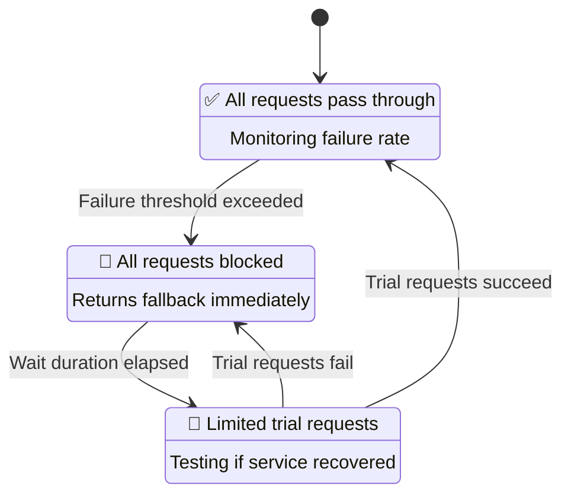
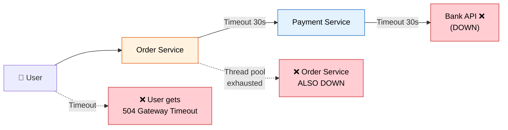
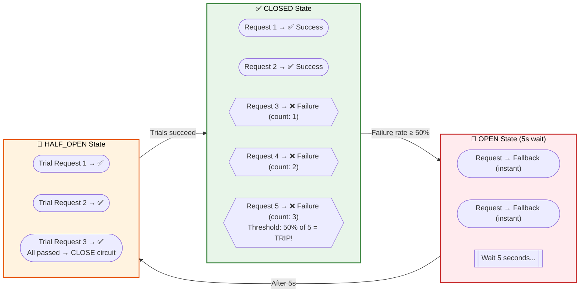
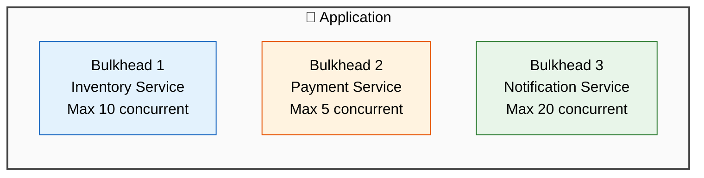

# 🔌 Circuit Breaker Pattern

> **Prevent cascading failures in distributed systems by detecting failures and stopping requests to unhealthy services.**

---

!!! abstract "Real-World Analogy"
    Think of an **electrical circuit breaker** in your home. When there's a short circuit (fault), the breaker **trips open** to prevent the entire house from catching fire. After the problem is fixed, you manually reset it. Similarly, in microservices, when a downstream service is failing, the circuit breaker "trips" to stop sending requests, preventing the failure from cascading to the entire system.


```mermaid
stateDiagram-v2
    [*] --> Closed
    Closed --> Open: Failure threshold exceeded
    Open --> HalfOpen: Wait duration elapsed
    HalfOpen --> Closed: Trial requests succeed
    HalfOpen --> Open: Trial requests fail
    
    Closed: ✅ All requests pass through
    Closed: Monitoring failure rate
    Open: 🚫 All requests blocked
    Open: Returns fallback immediately
    HalfOpen: 🔄 Limited trial requests
    HalfOpen: Testing if service recovered
```

---

## ❓ The Problem: Cascading Failures


```mermaid
flowchart LR
    U["👤 User"] --> A["Order Service"]
    A -->|"Timeout 30s"| B["Payment Service"]
    B -->|"Timeout 30s"| C["Bank API ❌<br/>(DOWN)"]
    
    A -.->|"Thread pool<br/>exhausted"| D["❌ Order Service<br/>ALSO DOWN"]
    U -.->|"Timeout"| E["❌ User gets<br/>504 Gateway Timeout"]
    
    style C fill:#FFCDD2,stroke:#C62828,color:#000
    style D fill:#FFCDD2,stroke:#C62828,color:#000
    style E fill:#FFCDD2,stroke:#C62828,color:#000
    style A fill:#FFF3E0,stroke:#E65100,color:#000
    style B fill:#E3F2FD,stroke:#1565C0,color:#000
```

**Without a circuit breaker:**

1. Bank API goes down
2. Payment Service threads **hang** waiting for Bank API (30s timeout each)
3. Payment Service thread pool **exhausts** — now Payment Service is also down
4. Order Service threads hang waiting for Payment Service
5. Order Service goes down too — **cascading failure**
6. Users see errors across the entire platform

!!! warning "The Domino Effect"
    One failing service can bring down your entire microservices ecosystem. Circuit breakers prevent this by **failing fast** instead of waiting indefinitely.

---

## 🔄 Three States Explained

| State | Behavior | Transitions To |
|-------|----------|---------------|
| **CLOSED** | All requests pass through. Failures are counted. | OPEN (when failure rate exceeds threshold) |
| **OPEN** | All requests are **blocked immediately**. Fallback is returned. | HALF_OPEN (after wait duration) |
| **HALF_OPEN** | Limited trial requests pass through to test recovery. | CLOSED (if trials succeed) or OPEN (if trials fail) |


```mermaid
flowchart LR
    subgraph Closed["✅ CLOSED State"]
        direction LR
        C1(["Request 1 → ✅ Success"])
        C2(["Request 2 → ✅ Success"])
        C3{{"Request 3 → ❌ Failure (count: 1)"}}
        C4{{"Request 4 → ❌ Failure (count: 2)"}}
        C5{{"Request 5 → ❌ Failure (count: 3)<br/>Threshold: 50% of 5 = TRIP!"}}
    end
    
    subgraph Open["🚫 OPEN State (5s wait)"]
        direction LR
        O1(["Request → Fallback (instant)"])
        O2(["Request → Fallback (instant)"])
        O3[["Wait 5 seconds..."]]
    end
    
    subgraph HalfOpen["🔄 HALF_OPEN State"]
        direction LR
        H1(["Trial Request 1 → ✅"])
        H2(["Trial Request 2 → ✅"])
        H3(["Trial Request 3 → ✅<br/>All passed → CLOSE circuit"])
    end
    
    Closed -->|"Failure rate ≥ 50%"| Open
    Open -->|"After 5s"| HalfOpen
    HalfOpen -->|"Trials succeed"| Closed
    
    style Closed fill:#E8F5E9,stroke:#2E7D32,stroke-width:2px,color:#000
    style Open fill:#FFEBEE,stroke:#C62828,stroke-width:2px,color:#000
    style HalfOpen fill:#FFF3E0,stroke:#E65100,stroke-width:2px,color:#000
```

---

## 🛠️ Resilience4j Implementation

!!! tip "Why Resilience4j, not Hystrix?"
    Netflix Hystrix is **deprecated** (maintenance mode since 2018). Resilience4j is the modern replacement — lightweight, modular, designed for Java 8+ and functional programming. It provides: Circuit Breaker, Rate Limiter, Retry, Bulkhead, and Time Limiter.

### Step 1: Dependencies

```xml
<dependency>
    <groupId>org.springframework.cloud</groupId>
    <artifactId>spring-cloud-starter-circuitbreaker-resilience4j</artifactId>
</dependency>
<dependency>
    <groupId>org.springframework.boot</groupId>
    <artifactId>spring-boot-starter-actuator</artifactId>
</dependency>
<dependency>
    <groupId>org.springframework.boot</groupId>
    <artifactId>spring-boot-starter-aop</artifactId>
</dependency>
```

### Step 2: Configuration

```yaml
# application.yml
management:
  health:
    circuitbreakers:
      enabled: true
  endpoints:
    web:
      exposure:
        include: health, circuitbreakers, metrics
  endpoint:
    health:
      show-details: always

resilience4j:
  circuitbreaker:
    instances:
      inventoryService:
        registerHealthIndicator: true
        slidingWindowType: COUNT_BASED
        slidingWindowSize: 10                        # Evaluate last 10 calls
        failureRateThreshold: 50                     # Open if 50% fail
        waitDurationInOpenState: 10s                  # Stay open for 10s
        permittedNumberOfCallsInHalfOpenState: 5     # Allow 5 trial calls
        automaticTransitionFromOpenToHalfOpenEnabled: true
        minimumNumberOfCalls: 5                      # Min calls before evaluating
        eventConsumerBufferSize: 10
```

### Step 3: Implementation

=== "Annotation-Based"

    ```java
    @Service
    @Slf4j
    public class OrderService {
        
        private final WebClient webClient;
        
        @CircuitBreaker(name = "inventoryService", fallbackMethod = "inventoryFallback")
        public OrderResponse placeOrder(OrderRequest request) {
            log.info("Calling inventory service...");
            
            Boolean inStock = webClient.get()
                .uri("http://inventory-service/api/inventory?skuCode=" + request.getSkuCode())
                .retrieve()
                .bodyToMono(Boolean.class)
                .block();
            
            if (Boolean.TRUE.equals(inStock)) {
                return new OrderResponse("SUCCESS", "Order placed successfully");
            }
            throw new InsufficientStockException("Item out of stock");
        }
        
        // Fallback method — MUST have same return type + exception parameter
        private OrderResponse inventoryFallback(OrderRequest request, Throwable throwable) {
            log.warn("Circuit breaker fallback triggered: {}", throwable.getMessage());
            return new OrderResponse("PENDING", 
                "Order queued — inventory service temporarily unavailable. " +
                "We'll process it shortly.");
        }
    }
    ```

=== "Programmatic (Functional)"

    ```java
    @Service
    public class OrderService {
        
        private final CircuitBreakerRegistry circuitBreakerRegistry;
        private final WebClient webClient;
        
        public OrderResponse placeOrder(OrderRequest request) {
            CircuitBreaker circuitBreaker = circuitBreakerRegistry
                .circuitBreaker("inventoryService");
            
            Supplier<OrderResponse> decoratedSupplier = CircuitBreaker
                .decorateSupplier(circuitBreaker, () -> callInventoryService(request));
            
            return Try.ofSupplier(decoratedSupplier)
                .recover(throwable -> inventoryFallback(request, throwable))
                .get();
        }
        
        private OrderResponse callInventoryService(OrderRequest request) {
            // Actual HTTP call
            Boolean inStock = webClient.get()
                .uri("/api/inventory?skuCode=" + request.getSkuCode())
                .retrieve()
                .bodyToMono(Boolean.class)
                .block();
            return new OrderResponse("SUCCESS", "Order placed");
        }
    }
    ```

---

## ⏱️ Time Limiter (Timeout)

Prevent threads from waiting indefinitely for a slow service.

```yaml
resilience4j:
  timelimiter:
    instances:
      inventoryService:
        timeoutDuration: 3s       # Cancel call after 3 seconds
        cancelRunningFuture: true  # Cancel the running future on timeout
```

```java
@CircuitBreaker(name = "inventoryService", fallbackMethod = "fallback")
@TimeLimiter(name = "inventoryService")
public CompletableFuture<OrderResponse> placeOrderAsync(OrderRequest request) {
    return CompletableFuture.supplyAsync(() -> {
        // This will be cancelled if it takes > 3 seconds
        return callInventoryService(request);
    });
}

public CompletableFuture<OrderResponse> fallback(OrderRequest request, Throwable t) {
    return CompletableFuture.completedFuture(
        new OrderResponse("TIMEOUT", "Service is slow, please try later"));
}
```

---

## 🔁 Retry Pattern

Automatically retry failed calls before giving up.

```yaml
resilience4j:
  retry:
    instances:
      inventoryService:
        maxAttempts: 3                    # Try 3 times total
        waitDuration: 2s                  # Wait 2s between retries
        enableExponentialBackoff: true    # 2s, 4s, 8s...
        exponentialBackoffMultiplier: 2
        retryExceptions:
          - java.io.IOException
          - java.util.concurrent.TimeoutException
        ignoreExceptions:
          - com.example.BusinessException  # Don't retry business errors
```

```java
@Retry(name = "inventoryService", fallbackMethod = "retryFallback")
@CircuitBreaker(name = "inventoryService", fallbackMethod = "circuitBreakerFallback")
public OrderResponse placeOrder(OrderRequest request) {
    log.info("Attempting to call inventory service...");
    return callInventoryService(request);
}
```

!!! tip "Order of Annotations Matters"
    Execution order: `Retry → CircuitBreaker → TimeLimiter → Bulkhead`. Retry wraps Circuit Breaker, meaning retries happen BEFORE the circuit breaker counts a failure. After all retries fail, THEN it counts as one failure for the circuit breaker.

---

## 🧱 Bulkhead Pattern

Isolate failures by limiting concurrent calls to a service — like watertight compartments in a ship.


```mermaid
flowchart LR
    subgraph Ship["🚢 Application"]
        B1["Bulkhead 1<br/>Inventory Service<br/>Max 10 concurrent"]
        B2["Bulkhead 2<br/>Payment Service<br/>Max 5 concurrent"]
        B3["Bulkhead 3<br/>Notification Service<br/>Max 20 concurrent"]
    end
    
    style B1 fill:#E3F2FD,stroke:#1565C0,color:#000
    style B2 fill:#FFF3E0,stroke:#E65100,color:#000
    style B3 fill:#E8F5E9,stroke:#2E7D32,color:#000
    style Ship fill:#FAFAFA,stroke:#424242,stroke-width:2px,color:#000
```

=== "Semaphore Bulkhead"

    ```yaml
    resilience4j:
      bulkhead:
        instances:
          inventoryService:
            maxConcurrentCalls: 10          # Max 10 parallel calls
            maxWaitDuration: 500ms          # Wait max 500ms for a permit
    ```

    ```java
    @Bulkhead(name = "inventoryService", fallbackMethod = "bulkheadFallback")
    public OrderResponse placeOrder(OrderRequest request) {
        return callInventoryService(request);
    }
    
    private OrderResponse bulkheadFallback(OrderRequest request, Throwable t) {
        return new OrderResponse("REJECTED", "Too many concurrent requests, please retry");
    }
    ```

=== "Thread Pool Bulkhead"

    ```yaml
    resilience4j:
      thread-pool-bulkhead:
        instances:
          inventoryService:
            maxThreadPoolSize: 10
            coreThreadPoolSize: 5
            queueCapacity: 20
            keepAliveDuration: 20ms
    ```

---

## 🚦 Rate Limiter

Control how many calls a service receives per time period.

```yaml
resilience4j:
  ratelimiter:
    instances:
      inventoryService:
        limitForPeriod: 100              # 100 calls allowed
        limitRefreshPeriod: 1s           # per 1 second
        timeoutDuration: 500ms           # Wait max 500ms for permission
```

```java
@RateLimiter(name = "inventoryService", fallbackMethod = "rateLimitFallback")
public OrderResponse placeOrder(OrderRequest request) {
    return callInventoryService(request);
}

private OrderResponse rateLimitFallback(OrderRequest request, Throwable t) {
    return new OrderResponse("RATE_LIMITED", "Too many requests. Try again in a moment.");
}
```

---

## 📊 Monitoring Circuit Breaker States

```yaml
# Actuator endpoints for monitoring
management:
  endpoints:
    web:
      exposure:
        include: health, circuitbreakers, circuitbreakerevents, metrics
```

```bash
# Check circuit breaker state
curl http://localhost:8081/actuator/health | jq '.components.circuitBreakers'

# Response:
# {
#   "inventoryService": {
#     "status": "UP",
#     "details": {
#       "state": "CLOSED",
#       "failureRate": "20.0%",
#       "slowCallRate": "0.0%",
#       "bufferedCalls": 10,
#       "failedCalls": 2
#     }
#   }
# }
```

---

## 🏗️ Complete Configuration (All Patterns Together)

```yaml
resilience4j:
  circuitbreaker:
    instances:
      inventoryService:
        slidingWindowSize: 10
        failureRateThreshold: 50
        waitDurationInOpenState: 10s
        permittedNumberOfCallsInHalfOpenState: 5
        automaticTransitionFromOpenToHalfOpenEnabled: true
        
  retry:
    instances:
      inventoryService:
        maxAttempts: 3
        waitDuration: 1s
        enableExponentialBackoff: true
        
  timelimiter:
    instances:
      inventoryService:
        timeoutDuration: 3s
        
  bulkhead:
    instances:
      inventoryService:
        maxConcurrentCalls: 20
        maxWaitDuration: 500ms
        
  ratelimiter:
    instances:
      inventoryService:
        limitForPeriod: 100
        limitRefreshPeriod: 1s
```

---

## 🎯 Interview Q&A

??? question "Q1: What is the Circuit Breaker pattern and why is it needed?"
    Circuit Breaker prevents **cascading failures** in distributed systems. When a downstream service fails, instead of waiting and exhausting thread pools, the circuit breaker fails fast by returning a fallback response. It has three states: CLOSED (normal), OPEN (blocking all calls), HALF_OPEN (testing recovery).

??? question "Q2: Explain the three states of a Circuit Breaker."
    **CLOSED**: Requests flow normally; failures are counted. **OPEN**: All requests are immediately rejected with a fallback (no network call made) — gives the downstream service time to recover. **HALF_OPEN**: After a wait period, limited trial requests pass through to test if the service recovered. If they succeed, circuit closes; if they fail, it reopens.

??? question "Q3: What is the difference between Circuit Breaker and Retry?"
    **Retry** = try again after a transient failure (network blip). **Circuit Breaker** = stop trying entirely when the service is consistently failing. They work together: retry handles temporary glitches; circuit breaker prevents overloading an already-struggling service with retries.

??? question "Q4: What is the Bulkhead pattern?"
    Inspired by ship compartments, Bulkhead **limits concurrent calls** to a service. If Inventory Service is slow, it won't consume all your threads — only its allocated 10. Payment Service still has its own pool of 5 threads available. Prevents one slow service from starving resources for others.

??? question "Q5: Why is Hystrix deprecated? What replaced it?"
    Hystrix entered maintenance mode in 2018 because Netflix moved to a more resilient architecture internally. **Resilience4j** replaced it — it's lighter (no external dependencies), designed for Java 8+ (functional style), modular (use only what you need), and integrates well with Spring Boot.

??? question "Q6: What is the sliding window in Resilience4j?"
    The sliding window tracks recent calls to calculate the failure rate. **COUNT_BASED**: last N calls (e.g., if 5 out of last 10 failed, rate = 50%). **TIME_BASED**: calls in the last N seconds. When the failure rate exceeds the threshold, the circuit opens.

??? question "Q7: How do you test a Circuit Breaker?"
    1. Use Actuator endpoints to monitor state transitions
    2. Inject failures (kill downstream service, add latency)
    3. Verify fallback is returned when circuit is OPEN
    4. Verify circuit transitions: CLOSED -> OPEN -> HALF_OPEN -> CLOSED
    5. Use chaos engineering tools (Chaos Monkey for Spring Boot)

---

## Related Topics

- [API Gateway](APIGATEWAY.md) — Circuit breakers at the gateway level
- [Service Discovery](ServiceDiscovery.md) — Detecting healthy instances
- [Observability](Observability.md) — Monitoring circuit breaker states
- [Inter-Service Communication](InterServiceCommunication.md) — Where failures occur
