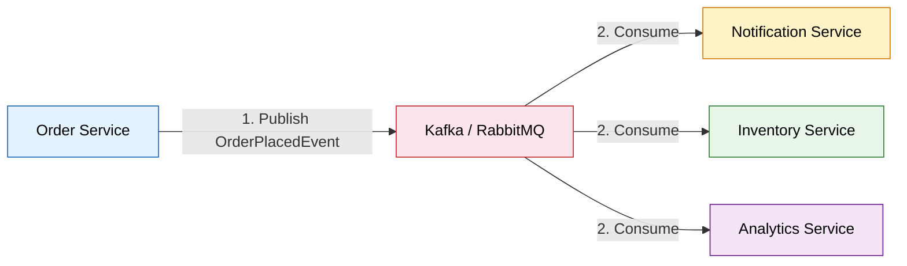

# 🔗 Inter-Service Communication

> **How microservices talk to each other — the backbone of any distributed architecture.**

---

!!! abstract "Real-World Analogy"
    Think of communication styles at a company. **Synchronous** = a phone call (you wait on the line until the other person responds). **Asynchronous** = sending an email (you fire and forget, continue your work, and check the reply later). Each has its place depending on urgency and coupling requirements.


---

## 📞 Synchronous Communication

The caller **waits** for a response before proceeding. Used when you need immediate confirmation (e.g., checking inventory before placing an order).

### Comparison of Approaches

| Feature | RestTemplate | WebClient | Feign Client | gRPC |
|---------|-------------|-----------|-------------|------|
| **Blocking** | Yes | No (Reactive) | Yes | No |
| **Ease of Use** | Simple | Moderate | Very Simple | Complex |
| **Performance** | Good | Excellent | Good | Best |
| **Status** | Deprecated (Spring 5) | Recommended | Recommended | High-perf use cases |
| **Protocol** | HTTP/1.1 | HTTP/1.1 & 2 | HTTP/1.1 | HTTP/2 (binary) |
| **Use Case** | Legacy code | Reactive apps | Declarative REST | Low-latency, polyglot |

---

### 1. RestTemplate (Deprecated)

!!! warning "Deprecated since Spring 5"
    `RestTemplate` is in maintenance mode. Use `WebClient` or `RestClient` (Spring 6.1+) for new projects.

=== "GET Request"

    ```java
    @Service
    public class InventoryClient {
        
        private final RestTemplate restTemplate;
        
        public InventoryClient(RestTemplate restTemplate) {
            this.restTemplate = restTemplate;
        }
        
        public Boolean checkInventory(String skuCode, int quantity) {
            String url = "http://inventory-service/api/inventory?skuCode={sku}&quantity={qty}";
            
            ResponseEntity<Boolean> response = restTemplate.exchange(
                url,
                HttpMethod.GET,
                new HttpEntity<>(getHeaders()),
                Boolean.class,
                skuCode, quantity
            );
            return response.getBody();
        }
        
        private HttpHeaders getHeaders() {
            HttpHeaders headers = new HttpHeaders();
            headers.setContentType(MediaType.APPLICATION_JSON);
            return headers;
        }
    }
    ```

=== "POST Request"

    ```java
    public OrderResponse createOrder(OrderRequest request) {
        ResponseEntity<OrderResponse> response = restTemplate.postForEntity(
            "http://order-service/api/orders",
            new HttpEntity<>(request, getHeaders()),
            OrderResponse.class
        );
        return response.getBody();
    }
    ```

---

### 2. WebClient (Recommended - Reactive)

Non-blocking, reactive HTTP client. Supports both synchronous and asynchronous usage.

=== "Reactive (Non-blocking)"

    ```java
    @Service
    public class InventoryClient {
        
        private final WebClient webClient;
        
        public InventoryClient(WebClient.Builder webClientBuilder) {
            this.webClient = webClientBuilder
                .baseUrl("http://inventory-service")
                .build();
        }
        
        public Mono<Boolean> checkInventory(String skuCode, int quantity) {
            return webClient.get()
                .uri(uriBuilder -> uriBuilder
                    .path("/api/inventory")
                    .queryParam("skuCode", skuCode)
                    .queryParam("quantity", quantity)
                    .build())
                .retrieve()
                .bodyToMono(Boolean.class);
        }
    }
    ```

=== "Synchronous (Blocking)"

    ```java
    public Boolean checkInventorySync(String skuCode, int quantity) {
        return webClient.get()
            .uri(uriBuilder -> uriBuilder
                .path("/api/inventory")
                .queryParam("skuCode", skuCode)
                .queryParam("quantity", quantity)
                .build())
            .retrieve()
            .bodyToMono(Boolean.class)
            .block(); // Blocks the thread — use only in non-reactive apps
    }
    ```

=== "With Error Handling"

    ```java
    public Mono<Boolean> checkInventoryWithErrorHandling(String skuCode, int quantity) {
        return webClient.get()
            .uri("/api/inventory?skuCode={sku}&quantity={qty}", skuCode, quantity)
            .retrieve()
            .onStatus(HttpStatusCode::is4xxClientError, 
                response -> Mono.error(new InventoryNotFoundException("Not found")))
            .onStatus(HttpStatusCode::is5xxServerError,
                response -> Mono.error(new ServiceUnavailableException("Inventory service down")))
            .bodyToMono(Boolean.class)
            .timeout(Duration.ofSeconds(3))
            .retry(3);
    }
    ```

---

### 3. OpenFeign Client (Declarative)

Write an interface, Spring generates the implementation. Integrates with service discovery and load balancing.

=== "Feign Client Interface"

    ```java
    @FeignClient(name = "inventory-service", fallback = InventoryFallback.class)
    public interface InventoryClient {
        
        @GetMapping("/api/inventory")
        Boolean checkInventory(
            @RequestParam("skuCode") String skuCode,
            @RequestParam("quantity") int quantity
        );
        
        @PostMapping("/api/inventory/reserve")
        InventoryResponse reserveInventory(@RequestBody ReserveRequest request);
    }
    ```

=== "Fallback Class"

    ```java
    @Component
    public class InventoryFallback implements InventoryClient {
        
        @Override
        public Boolean checkInventory(String skuCode, int quantity) {
            // Fallback logic when inventory service is down
            return false;
        }
        
        @Override
        public InventoryResponse reserveInventory(ReserveRequest request) {
            return new InventoryResponse("FAILED", "Service unavailable");
        }
    }
    ```

=== "Configuration"

    ```yaml
    # application.yml
    spring:
      cloud:
        openfeign:
          client:
            config:
              inventory-service:
                connectTimeout: 5000
                readTimeout: 5000
                loggerLevel: full
    ```

    ```java
    @SpringBootApplication
    @EnableFeignClients
    public class OrderServiceApplication {
        public static void main(String[] args) {
            SpringApplication.run(OrderServiceApplication.class, args);
        }
    }
    ```

---

### 4. gRPC (High Performance)

Binary protocol over HTTP/2. Best for internal service-to-service communication where performance is critical.

=== "Proto Definition"

    ```protobuf
    syntax = "proto3";
    
    package inventory;
    
    service InventoryService {
        rpc CheckInventory (InventoryRequest) returns (InventoryResponse);
        rpc ReserveInventory (ReserveRequest) returns (ReserveResponse);
    }
    
    message InventoryRequest {
        string sku_code = 1;
        int32 quantity = 2;
    }
    
    message InventoryResponse {
        bool available = 1;
        int32 available_quantity = 2;
    }
    ```

=== "gRPC Server (Inventory Service)"

    ```java
    @GrpcService
    public class InventoryGrpcService extends InventoryServiceGrpc.InventoryServiceImplBase {
        
        @Override
        public void checkInventory(InventoryRequest request, 
                                   StreamObserver<InventoryResponse> responseObserver) {
            boolean available = inventoryRepository
                .existsBySkuCodeAndQuantityGreaterThanEqual(
                    request.getSkuCode(), request.getQuantity());
            
            InventoryResponse response = InventoryResponse.newBuilder()
                .setAvailable(available)
                .build();
            
            responseObserver.onNext(response);
            responseObserver.onCompleted();
        }
    }
    ```

=== "gRPC Client (Order Service)"

    ```java
    @Service
    public class InventoryGrpcClient {
        
        @GrpcClient("inventory-service")
        private InventoryServiceGrpc.InventoryServiceBlockingStub inventoryStub;
        
        public boolean checkInventory(String skuCode, int quantity) {
            InventoryRequest request = InventoryRequest.newBuilder()
                .setSkuCode(skuCode)
                .setQuantity(quantity)
                .build();
            
            InventoryResponse response = inventoryStub.checkInventory(request);
            return response.getAvailable();
        }
    }
    ```

---

## 📧 Asynchronous Communication

The caller **does not wait** for a response. Used for fire-and-forget scenarios, event-driven workflows, and decoupling services.



### Kafka vs RabbitMQ

| Feature | Apache Kafka | RabbitMQ |
|---------|-------------|----------|
| **Model** | Distributed log (pub/sub) | Message queue (point-to-point + pub/sub) |
| **Throughput** | Millions of messages/sec | Thousands of messages/sec |
| **Retention** | Messages persisted (configurable) | Messages removed after consumption |
| **Ordering** | Guaranteed within partition | Guaranteed within queue |
| **Use Case** | Event streaming, event sourcing, analytics | Task queues, RPC, simple pub/sub |
| **Replay** | Yes (re-read from offset) | No (once consumed, gone) |
| **Complexity** | Higher (ZooKeeper/KRaft, partitions) | Lower (simple setup) |

---

### Event-Driven Architecture with Kafka

=== "Producer (Order Service)"

    ```java
    @Service
    @RequiredArgsConstructor
    public class OrderService {
        
        private final KafkaTemplate<String, OrderPlacedEvent> kafkaTemplate;
        
        @Transactional
        public String placeOrder(OrderRequest request) {
            Order order = orderRepository.save(mapToOrder(request));
            
            // Publish event asynchronously
            kafkaTemplate.send("order-events", order.getOrderNumber(),
                new OrderPlacedEvent(order.getOrderNumber(), order.getItems()));
            
            return order.getOrderNumber();
        }
    }
    ```

=== "Consumer (Notification Service)"

    ```java
    @Service
    @Slf4j
    public class NotificationConsumer {
        
        @KafkaListener(topics = "order-events", groupId = "notification-group")
        public void handleOrderPlaced(OrderPlacedEvent event) {
            log.info("Sending notification for order: {}", event.getOrderNumber());
            emailService.sendOrderConfirmation(event);
        }
    }
    ```

=== "Event Class"

    ```java
    @Data
    @AllArgsConstructor
    @NoArgsConstructor
    public class OrderPlacedEvent {
        private String orderNumber;
        private List<OrderItem> items;
        private Instant timestamp = Instant.now();
        private String eventId = UUID.randomUUID().toString();
    }
    ```

---

### Event-Driven with RabbitMQ

=== "Producer"

    ```java
    @Service
    @RequiredArgsConstructor
    public class OrderEventPublisher {
        
        private final RabbitTemplate rabbitTemplate;
        
        public void publishOrderPlaced(OrderPlacedEvent event) {
            rabbitTemplate.convertAndSend(
                "order-exchange",    // exchange
                "order.placed",      // routing key
                event
            );
        }
    }
    ```

=== "Consumer"

    ```java
    @Service
    @Slf4j
    public class NotificationListener {
        
        @RabbitListener(queues = "notification-queue")
        public void handleOrderPlaced(OrderPlacedEvent event) {
            log.info("Received order event: {}", event.getOrderNumber());
            notificationService.sendEmail(event);
        }
    }
    ```

=== "Configuration"

    ```java
    @Configuration
    public class RabbitConfig {
        
        @Bean
        public TopicExchange orderExchange() {
            return new TopicExchange("order-exchange");
        }
        
        @Bean
        public Queue notificationQueue() {
            return QueueBuilder.durable("notification-queue").build();
        }
        
        @Bean
        public Binding binding(Queue notificationQueue, TopicExchange orderExchange) {
            return BindingBuilder
                .bind(notificationQueue)
                .to(orderExchange)
                .with("order.*");
        }
    }
    ```

---

## 🤔 When to Use Sync vs Async

| Scenario | Communication Type | Example |
|----------|-------------------|---------|
| Need immediate response | **Synchronous** | Check inventory before placing order |
| Fire and forget | **Asynchronous** | Send notification email |
| Long-running operations | **Asynchronous** | Generate report, process payment |
| Query data from another service | **Synchronous** | Get user profile for display |
| Event broadcasting (1-to-many) | **Asynchronous** | Order placed -> notify, update analytics, reserve stock |
| Workflow orchestration | **Async (Saga)** | Multi-step order fulfillment |

!!! tip "Best Practice: Prefer Async"
    In microservices, prefer asynchronous communication wherever possible. It provides better fault isolation, scalability, and decoupling. Use synchronous only when you absolutely need an immediate response.

---

## 🎯 Interview Q&A

??? question "Q1: What is the difference between synchronous and asynchronous communication?"
    **Synchronous**: Caller waits for response (HTTP/gRPC). Creates temporal coupling — both services must be up simultaneously. **Asynchronous**: Caller publishes event and moves on. Decoupled — consumer can process later. Trade-off: sync is simpler but creates tighter coupling; async is more resilient but adds eventual consistency complexity.

??? question "Q2: Why is RestTemplate deprecated? What should you use instead?"
    RestTemplate is in maintenance mode since Spring 5 because it's blocking (one thread per request). For reactive apps, use **WebClient**. For Spring 6.1+, use **RestClient** (synchronous but modern API). For declarative style, use **OpenFeign**.

??? question "Q3: When would you choose gRPC over REST?"
    Use gRPC for: internal service-to-service communication where performance matters, polyglot environments (proto generates code for any language), streaming requirements, and when you need strong typing via proto contracts. Use REST for: public APIs, browser clients, simpler debugging with tools like curl/Postman.

??? question "Q4: How does OpenFeign simplify inter-service communication?"
    Feign lets you define a Java interface with annotations — Spring generates the HTTP client implementation at runtime. It integrates with service discovery (no hardcoded URLs), load balancing, and circuit breakers. Less boilerplate than WebClient for simple request-response patterns.

??? question "Q5: What are the advantages of event-driven communication?"
    1. **Loose coupling** — producer doesn't know about consumers
    2. **Scalability** — add consumers without changing producer
    3. **Resilience** — if consumer is down, messages wait in queue
    4. **Replay** — Kafka allows re-processing events
    5. **Temporal decoupling** — services don't need to be up simultaneously

??? question "Q6: How do you handle failures in async communication?"
    Use **Dead Letter Queues (DLQ)** for messages that fail after retries. Implement **idempotent consumers** (process same message twice safely). Use **retry with exponential backoff**. Monitor DLQ size as an alert metric.

??? question "Q7: Kafka vs RabbitMQ — when to use which?"
    **Kafka**: High-throughput event streaming, event sourcing, need message replay, ordered processing within partition, analytics pipelines. **RabbitMQ**: Simple task queues, RPC patterns, complex routing (topic/header exchanges), lower message volume, messages that should be deleted after processing.

---

## Related Topics

- [Async Communication with Kafka](AsyncCommunicationUsingKafka.md) — Deep dive into Kafka
- [API Gateway](APIGATEWAY.md) — Routing external requests
- [Circuit Breaker](CircuitBreaker.md) — Handling sync call failures
- [Event-Driven Architecture](event-driven.md) — Event sourcing and CQRS
