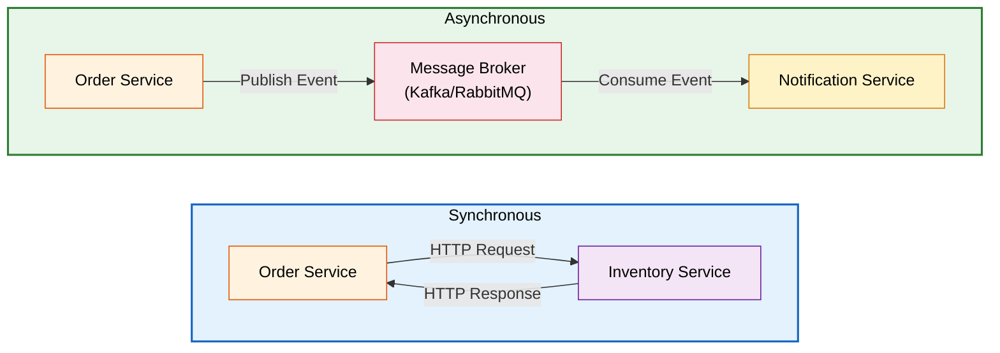
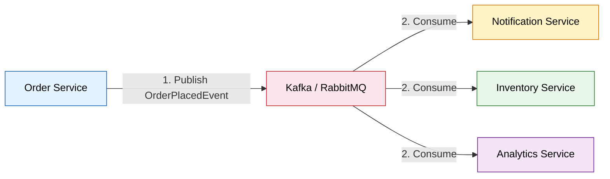
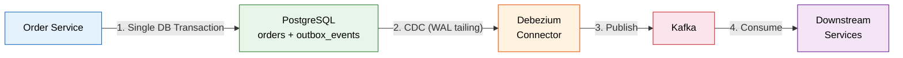
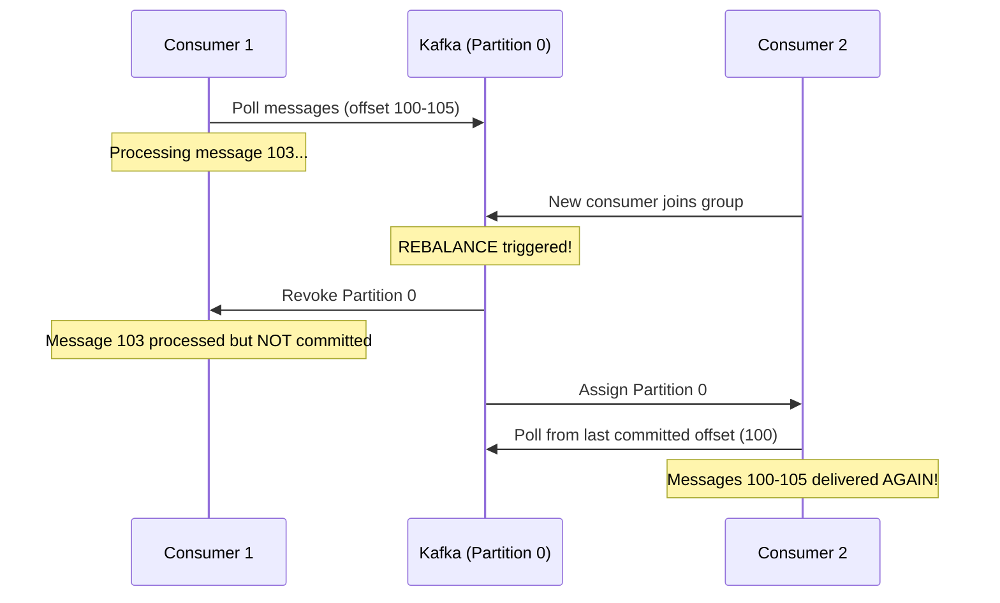
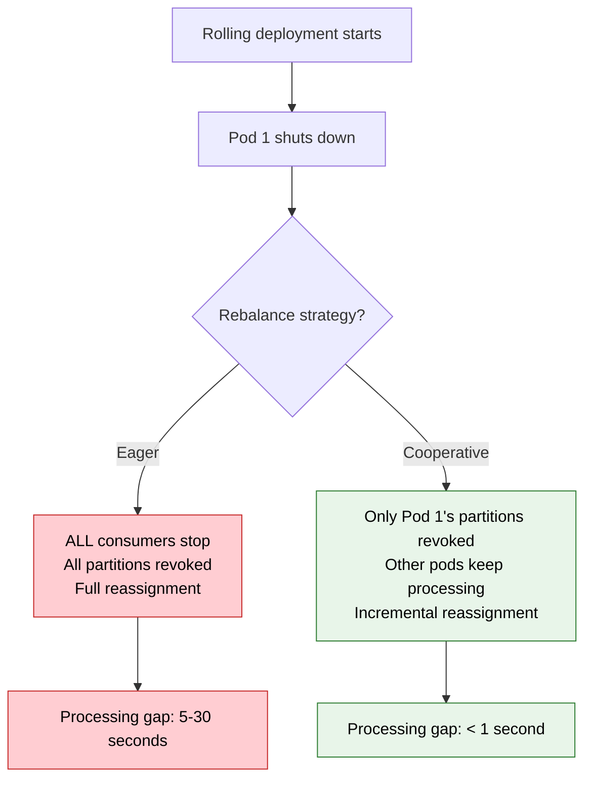
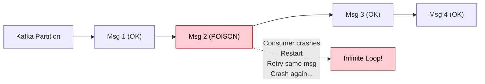

# Inter-Service Communication

> **How microservices talk to each other — the backbone of any distributed architecture.**

---

!!! abstract "Real-World Analogy"
    Think of communication styles at a company. **Synchronous** = a phone call (you wait on the line until the other person responds). **Asynchronous** = sending an email (you fire and forget, continue your work, and check the reply later). Each has its place depending on urgency and coupling requirements.



---

## Synchronous Communication

The caller **waits** for a response before proceeding. Used when you need immediate confirmation (e.g., checking inventory before placing an order).

### Comparison of Approaches

| Feature | RestTemplate | WebClient | Feign Client | gRPC |
|---------|-------------|-----------|-------------|------|
| **Blocking** | Yes | No (Reactive) | Yes | No |
| **Ease of Use** | Simple | Moderate | Very Simple | Complex |
| **Performance** | Good | Excellent | Good | Best |
| **Status** | Deprecated (Spring 5) | Recommended | Recommended | High-perf use cases |
| **Protocol** | HTTP/1.1 | HTTP/1.1 & 2 | HTTP/1.1 | HTTP/2 (binary) |
| **Use Case** | Legacy code | Reactive apps | Declarative REST | Low-latency, polyglot |

---

### 1. RestTemplate (Deprecated)

!!! warning "Deprecated since Spring 5"
    `RestTemplate` is in maintenance mode. Use `WebClient` or `RestClient` (Spring 6.1+) for new projects.

=== "GET Request"

    ```java
    @Service
    public class InventoryClient {
        
        private final RestTemplate restTemplate;
        
        public InventoryClient(RestTemplate restTemplate) {
            this.restTemplate = restTemplate;
        }
        
        public Boolean checkInventory(String skuCode, int quantity) {
            String url = "http://inventory-service/api/inventory?skuCode={sku}&quantity={qty}";
            
            ResponseEntity<Boolean> response = restTemplate.exchange(
                url,
                HttpMethod.GET,
                new HttpEntity<>(getHeaders()),
                Boolean.class,
                skuCode, quantity
            );
            return response.getBody();
        }
        
        private HttpHeaders getHeaders() {
            HttpHeaders headers = new HttpHeaders();
            headers.setContentType(MediaType.APPLICATION_JSON);
            return headers;
        }
    }
    ```

=== "POST Request"

    ```java
    public OrderResponse createOrder(OrderRequest request) {
        ResponseEntity<OrderResponse> response = restTemplate.postForEntity(
            "http://order-service/api/orders",
            new HttpEntity<>(request, getHeaders()),
            OrderResponse.class
        );
        return response.getBody();
    }
    ```

---

### 2. WebClient (Recommended - Reactive)

Non-blocking, reactive HTTP client. Supports both synchronous and asynchronous usage.

=== "Reactive (Non-blocking)"

    ```java
    @Service
    public class InventoryClient {
        
        private final WebClient webClient;
        
        public InventoryClient(WebClient.Builder webClientBuilder) {
            this.webClient = webClientBuilder
                .baseUrl("http://inventory-service")
                .build();
        }
        
        public Mono<Boolean> checkInventory(String skuCode, int quantity) {
            return webClient.get()
                .uri(uriBuilder -> uriBuilder
                    .path("/api/inventory")
                    .queryParam("skuCode", skuCode)
                    .queryParam("quantity", quantity)
                    .build())
                .retrieve()
                .bodyToMono(Boolean.class);
        }
    }
    ```

=== "Synchronous (Blocking)"

    ```java
    public Boolean checkInventorySync(String skuCode, int quantity) {
        return webClient.get()
            .uri(uriBuilder -> uriBuilder
                .path("/api/inventory")
                .queryParam("skuCode", skuCode)
                .queryParam("quantity", quantity)
                .build())
            .retrieve()
            .bodyToMono(Boolean.class)
            .block(); // Blocks the thread — use only in non-reactive apps
    }
    ```

=== "With Error Handling"

    ```java
    public Mono<Boolean> checkInventoryWithErrorHandling(String skuCode, int quantity) {
        return webClient.get()
            .uri("/api/inventory?skuCode={sku}&quantity={qty}", skuCode, quantity)
            .retrieve()
            .onStatus(HttpStatusCode::is4xxClientError, 
                response -> Mono.error(new InventoryNotFoundException("Not found")))
            .onStatus(HttpStatusCode::is5xxServerError,
                response -> Mono.error(new ServiceUnavailableException("Inventory service down")))
            .bodyToMono(Boolean.class)
            .timeout(Duration.ofSeconds(3))
            .retry(3);
    }
    ```

---

### 3. OpenFeign Client (Declarative)

Write an interface, Spring generates the implementation. Integrates with service discovery and load balancing.

=== "Feign Client Interface"

    ```java
    @FeignClient(name = "inventory-service", fallback = InventoryFallback.class)
    public interface InventoryClient {
        
        @GetMapping("/api/inventory")
        Boolean checkInventory(
            @RequestParam("skuCode") String skuCode,
            @RequestParam("quantity") int quantity
        );
        
        @PostMapping("/api/inventory/reserve")
        InventoryResponse reserveInventory(@RequestBody ReserveRequest request);
    }
    ```

=== "Fallback Class"

    ```java
    @Component
    public class InventoryFallback implements InventoryClient {
        
        @Override
        public Boolean checkInventory(String skuCode, int quantity) {
            // Fallback logic when inventory service is down
            return false;
        }
        
        @Override
        public InventoryResponse reserveInventory(ReserveRequest request) {
            return new InventoryResponse("FAILED", "Service unavailable");
        }
    }
    ```

=== "Configuration"

    ```yaml
    # application.yml
    spring:
      cloud:
        openfeign:
          client:
            config:
              inventory-service:
                connectTimeout: 5000
                readTimeout: 5000
                loggerLevel: full
    ```

    ```java
    @SpringBootApplication
    @EnableFeignClients
    public class OrderServiceApplication {
        public static void main(String[] args) {
            SpringApplication.run(OrderServiceApplication.class, args);
        }
    }
    ```

---

### 4. gRPC (High Performance)

Binary protocol over HTTP/2. Best for internal service-to-service communication where performance is critical.

=== "Proto Definition"

    ```protobuf
    syntax = "proto3";
    
    package inventory;
    
    service InventoryService {
        rpc CheckInventory (InventoryRequest) returns (InventoryResponse);
        rpc ReserveInventory (ReserveRequest) returns (ReserveResponse);
    }
    
    message InventoryRequest {
        string sku_code = 1;
        int32 quantity = 2;
    }
    
    message InventoryResponse {
        bool available = 1;
        int32 available_quantity = 2;
    }
    ```

=== "gRPC Server (Inventory Service)"

    ```java
    @GrpcService
    public class InventoryGrpcService extends InventoryServiceGrpc.InventoryServiceImplBase {
        
        @Override
        public void checkInventory(InventoryRequest request, 
                                   StreamObserver<InventoryResponse> responseObserver) {
            boolean available = inventoryRepository
                .existsBySkuCodeAndQuantityGreaterThanEqual(
                    request.getSkuCode(), request.getQuantity());
            
            InventoryResponse response = InventoryResponse.newBuilder()
                .setAvailable(available)
                .build();
            
            responseObserver.onNext(response);
            responseObserver.onCompleted();
        }
    }
    ```

=== "gRPC Client (Order Service)"

    ```java
    @Service
    public class InventoryGrpcClient {
        
        @GrpcClient("inventory-service")
        private InventoryServiceGrpc.InventoryServiceBlockingStub inventoryStub;
        
        public boolean checkInventory(String skuCode, int quantity) {
            InventoryRequest request = InventoryRequest.newBuilder()
                .setSkuCode(skuCode)
                .setQuantity(quantity)
                .build();
            
            InventoryResponse response = inventoryStub.checkInventory(request);
            return response.getAvailable();
        }
    }
    ```

---

## Asynchronous Communication

The caller **does not wait** for a response. Used for fire-and-forget scenarios, event-driven workflows, and decoupling services.



### Kafka vs RabbitMQ

| Feature | Apache Kafka | RabbitMQ |
|---------|-------------|----------|
| **Model** | Distributed log (pub/sub) | Message queue (point-to-point + pub/sub) |
| **Throughput** | Millions of messages/sec | Thousands of messages/sec |
| **Retention** | Messages persisted (configurable) | Messages removed after consumption |
| **Ordering** | Guaranteed within partition | Guaranteed within queue |
| **Use Case** | Event streaming, event sourcing, analytics | Task queues, RPC, simple pub/sub |
| **Replay** | Yes (re-read from offset) | No (once consumed, gone) |
| **Complexity** | Higher (KRaft, partitions) | Lower (simple setup) |

---

## The Dual-Write Problem (Critical Anti-Pattern)

!!! danger "This is the #1 bug in microservice event publishing"
    Publishing to a message broker inside a `@Transactional` method is the **dual-write anti-pattern**. The DB transaction and the Kafka send are two separate operations — if either fails independently, your system is inconsistent.

### The WRONG Way

```java title="OrderService.java — WRONG (Dual-Write)"
@Service
@RequiredArgsConstructor
public class OrderService {
    
    private final KafkaTemplate<String, OrderPlacedEvent> kafkaTemplate;
    
    @Transactional
    public String placeOrder(OrderRequest request) {
        Order order = orderRepository.save(mapToOrder(request));
        
        // DANGER: What if this send() fails AFTER the DB commits?
        // Result: Order exists in DB but no event published — downstream services never know
        //
        // DANGER: What if the DB transaction rolls back AFTER Kafka accepted the message?
        // Result: Event published for an order that doesn't exist
        kafkaTemplate.send("order-events", order.getOrderNumber(),
            new OrderPlacedEvent(order.getOrderNumber(), order.getItems()));
        
        return order.getOrderNumber();
    }
}
```

**Failure scenarios:**

| Scenario | DB State | Kafka State | Result |
|----------|----------|-------------|--------|
| Both succeed | Order saved | Event published | Correct |
| Kafka fails after DB commit | Order saved | No event | Silent data loss |
| DB rolls back after Kafka send | No order | Event published | Ghost event |
| Network partition mid-transaction | Unknown | Unknown | Inconsistent |

### The RIGHT Way: Transactional Outbox Pattern



```java title="OrderService.java — CORRECT (Outbox Pattern)"
@Service
@RequiredArgsConstructor
public class OrderService {
    
    private final OrderRepository orderRepository;
    private final OutboxRepository outboxRepository;
    private final ObjectMapper objectMapper;
    
    @Transactional  // Single atomic transaction — BOTH succeed or BOTH fail
    public String placeOrder(OrderRequest request) {
        Order order = orderRepository.save(mapToOrder(request));
        
        // Write event to outbox table in the SAME transaction
        OutboxEvent event = OutboxEvent.builder()
            .id(UUID.randomUUID())
            .aggregateId(order.getOrderNumber())
            .aggregateType("Order")
            .eventType("OrderPlaced")
            .payload(objectMapper.writeValueAsString(
                new OrderPlacedEvent(order.getOrderNumber(), order.getItems())))
            .createdAt(Instant.now())
            .build();
        outboxRepository.save(event);
        
        return order.getOrderNumber();
        // Debezium CDC picks up the outbox row from the WAL and publishes to Kafka
    }
}
```

```sql title="outbox_events table"
CREATE TABLE outbox_events (
    id              UUID PRIMARY KEY,
    aggregate_id    VARCHAR(255) NOT NULL,
    aggregate_type  VARCHAR(100) NOT NULL,
    event_type      VARCHAR(100) NOT NULL,
    payload         JSONB NOT NULL,
    created_at      TIMESTAMP NOT NULL DEFAULT NOW()
);
-- Debezium deletes rows after publishing (or you archive them)
```

!!! tip "Alternative: Polling Publisher"
    If Debezium/CDC is too complex, use a polling publisher that periodically queries the outbox table for unpublished events and sends them to Kafka. Simpler but higher latency and potential ordering issues.

---

## Delivery Semantics

Understanding message delivery guarantees is critical for building reliable async systems.

### At-Most-Once

Message may be lost but never delivered twice. Consumer commits offset BEFORE processing.

```java title="AtMostOnceConsumer.java"
@KafkaListener(topics = "order-events", groupId = "notification-group")
public void handleOrderPlaced(OrderPlacedEvent event, Acknowledgment ack) {
    ack.acknowledge();  // Commit offset FIRST
    // If processing fails after this point, message is lost forever
    emailService.sendOrderConfirmation(event);
}
```

**Use when:** Losing a message is acceptable (metrics, logging, non-critical notifications).

### At-Least-Once

Message is never lost but may be delivered multiple times. Consumer commits offset AFTER processing.

```java title="AtLeastOnceConsumer.java"
@KafkaListener(topics = "order-events", groupId = "inventory-group")
public void handleOrderPlaced(OrderPlacedEvent event, Acknowledgment ack) {
    // Process first
    inventoryService.reserveStock(event.getOrderNumber(), event.getItems());
    ack.acknowledge();  // Commit offset AFTER successful processing
    // If crash happens before ack, message will be redelivered (processed TWICE)
}
```

**Use when:** You cannot lose messages AND you have idempotent consumers.

### "Exactly-Once" (The Myth)

!!! warning "Exactly-once is not a delivery guarantee — it's an APPLICATION-LEVEL pattern"
    True exactly-once delivery is impossible in distributed systems (see the Two Generals Problem). What we actually implement is **at-least-once delivery + idempotent processing** = effectively-once semantics.

```java title="IdempotentConsumer.java — Effectively Exactly-Once"
@Service
@RequiredArgsConstructor
public class IdempotentOrderConsumer {
    
    private final ProcessedEventRepository processedEventRepo;
    private final InventoryService inventoryService;
    
    @KafkaListener(topics = "order-events", groupId = "inventory-group")
    @Transactional
    public void handleOrderPlaced(OrderPlacedEvent event, Acknowledgment ack) {
        // Idempotency check: have we processed this event before?
        if (processedEventRepo.existsByEventId(event.getEventId())) {
            log.info("Duplicate event {} — skipping", event.getEventId());
            ack.acknowledge();
            return;
        }
        
        // Process the event
        inventoryService.reserveStock(event.getOrderNumber(), event.getItems());
        
        // Record that we processed it (in SAME transaction as the business logic)
        processedEventRepo.save(new ProcessedEvent(event.getEventId(), Instant.now()));
        
        ack.acknowledge();
    }
}
```

```sql title="processed_events table"
CREATE TABLE processed_events (
    event_id    VARCHAR(255) PRIMARY KEY,
    processed_at TIMESTAMP NOT NULL,
    -- Auto-purge old entries
    CONSTRAINT check_ttl CHECK (processed_at > NOW() - INTERVAL '7 days')
);
```

!!! danger "What Breaks: No Idempotency"
    Without idempotency, consumer restarts or Kafka rebalancing causes messages to be processed twice — double charges, double inventory reservations, duplicate notifications. EVERY consumer must be idempotent in a distributed system.

---

## Message Ordering Guarantees

### Kafka Partition Key Strategy

Kafka guarantees ordering **within a single partition only**. Messages across partitions have no ordering guarantee.

```java title="OrderEventProducer.java — Partition Key Strategy"
@Service
public class OrderEventProducer {
    
    private final KafkaTemplate<String, OrderEvent> kafkaTemplate;
    
    public void publishOrderEvent(OrderEvent event) {
        // Use orderId as key — all events for same order go to same partition
        // This guarantees: OrderCreated → PaymentProcessed → Shipped arrive in order
        kafkaTemplate.send("order-events", event.getOrderId(), event);
    }
    
    // WRONG: Using random/null key — messages scatter across partitions
    public void publishWrong(OrderEvent event) {
        kafkaTemplate.send("order-events", event);  // null key = round-robin partition
        // OrderCreated might arrive AFTER PaymentProcessed!
    }
}
```

**Partition key selection rules:**

| Entity | Good Partition Key | Why |
|--------|-------------------|-----|
| Order events | `orderId` | All order lifecycle events stay ordered |
| User events | `userId` | User actions processed sequentially |
| Payment events | `orderId` (not paymentId) | Payments relate to orders |
| Inventory updates | `skuCode` | Stock changes for same SKU stay ordered |

!!! danger "What Breaks: Wrong Partition Key"
    If you use `paymentId` as the key for payment events, a refund for order-123 might land on a different partition than the original charge. The consumer processes the refund before the charge — resulting in a negative balance followed by a positive balance, instead of the correct sequence.

### What Happens During Rebalancing

When partitions are reassigned (consumer joins/leaves), in-flight messages may be reprocessed:



---

## Consumer Group Rebalancing

### Eager vs Cooperative Rebalancing

=== "Eager (Stop-the-World) — Default in older Kafka"

    ```java title="EagerRebalanceConfig.java"
    @Configuration
    public class KafkaConsumerConfig {
        
        @Bean
        public ConsumerFactory<String, String> consumerFactory() {
            Map<String, Object> props = new HashMap<>();
            props.put(ConsumerConfig.BOOTSTRAP_SERVERS_CONFIG, "kafka:9092");
            props.put(ConsumerConfig.GROUP_ID_CONFIG, "order-group");
            // Eager rebalance: ALL partitions revoked, then reassigned
            props.put(ConsumerConfig.PARTITION_ASSIGNMENT_STRATEGY_CONFIG,
                "org.apache.kafka.clients.consumer.RangeAssignor");
            return new DefaultKafkaConsumerFactory<>(props);
        }
    }
    ```
    
    **Problem:** During rolling deployments, EVERY consumer stops processing for the rebalance duration (potentially seconds). All partitions are revoked and reassigned, even those that don't change owners.

=== "Cooperative (Incremental) — Recommended"

    ```java title="CooperativeRebalanceConfig.java"
    @Configuration
    public class KafkaConsumerConfig {
        
        @Bean
        public ConsumerFactory<String, String> consumerFactory() {
            Map<String, Object> props = new HashMap<>();
            props.put(ConsumerConfig.BOOTSTRAP_SERVERS_CONFIG, "kafka:9092");
            props.put(ConsumerConfig.GROUP_ID_CONFIG, "order-group");
            // Cooperative: only revoke partitions that need to move
            props.put(ConsumerConfig.PARTITION_ASSIGNMENT_STRATEGY_CONFIG,
                "org.apache.kafka.clients.consumer.CooperativeStickyAssignor");
            return new DefaultKafkaConsumerFactory<>(props);
        }
    }
    ```
    
    **Benefit:** Only partitions that need to move are revoked. Other consumers keep processing unaffected partitions. Minimizes "stop" time during deployments.

### What Happens During Deployment



!!! danger "What Breaks: Ignoring Rebalancing During Deploys"
    With eager rebalancing and `session.timeout.ms = 10s`, a rolling deployment of 5 pods causes 5 consecutive rebalances, each pausing ALL consumers. Total processing gap: 30-50 seconds. Meanwhile, consumer lag spikes and downstream services see delayed data.

---

## Backpressure

When consumers can't keep up with producers, you need backpressure mechanisms to prevent unbounded queue growth and OOM.

### Consumer Lag Monitoring

```java title="ConsumerLagMonitor.java"
@Component
@Slf4j
public class ConsumerLagMonitor {
    
    private final AdminClient adminClient;
    private final MeterRegistry meterRegistry;
    
    @Scheduled(fixedDelay = 10_000)
    public void checkConsumerLag() {
        Map<TopicPartition, OffsetAndMetadata> committed = adminClient
            .listConsumerGroupOffsets("order-group")
            .partitionsToOffsetAndMetadata().get();
        
        Map<TopicPartition, ListOffsetsResult.ListOffsetsResultInfo> endOffsets = adminClient
            .listOffsets(committed.keySet().stream()
                .collect(Collectors.toMap(tp -> tp, tp -> OffsetSpec.latest())))
            .all().get();
        
        for (Map.Entry<TopicPartition, OffsetAndMetadata> entry : committed.entrySet()) {
            long lag = endOffsets.get(entry.getKey()).offset() - entry.getValue().offset();
            
            meterRegistry.gauge("kafka.consumer.lag",
                Tags.of("topic", entry.getKey().topic(),
                         "partition", String.valueOf(entry.getKey().partition())),
                lag);
            
            if (lag > 10000) {
                log.error("CRITICAL: Consumer lag {} on {}", lag, entry.getKey());
            }
        }
    }
}
```

### Controlling Consumption Rate

```java title="BackpressureConfig.java"
@Configuration
public class BackpressureConfig {
    
    @Bean
    public ConsumerFactory<String, OrderEvent> consumerFactory() {
        Map<String, Object> props = new HashMap<>();
        props.put(ConsumerConfig.BOOTSTRAP_SERVERS_CONFIG, "kafka:9092");
        
        // BACKPRESSURE: Only fetch 50 records per poll
        // If processing is slow, fewer records means less memory pressure
        props.put(ConsumerConfig.MAX_POLL_RECORDS_CONFIG, 50);
        
        // If processing takes longer than this, consumer is considered dead
        props.put(ConsumerConfig.MAX_POLL_INTERVAL_MS_CONFIG, 300_000); // 5 minutes
        
        // Fetch at most 1MB per partition per poll
        props.put(ConsumerConfig.MAX_PARTITION_FETCH_BYTES_CONFIG, 1_048_576);
        
        return new DefaultKafkaConsumerFactory<>(props);
    }
}
```

### Pause/Resume Pattern

```java title="AdaptiveConsumer.java"
@Component
@Slf4j
public class AdaptiveConsumer implements ConsumerSeekAware {
    
    private final KafkaListenerEndpointRegistry registry;
    private final AtomicInteger processingQueue = new AtomicInteger(0);
    
    private static final int HIGH_WATERMARK = 1000;
    private static final int LOW_WATERMARK = 200;
    
    @KafkaListener(id = "orderConsumer", topics = "order-events")
    public void consume(OrderPlacedEvent event) {
        processingQueue.incrementAndGet();
        try {
            processOrder(event);
        } finally {
            int remaining = processingQueue.decrementAndGet();
            if (remaining <= LOW_WATERMARK) {
                resumeConsumer();
            }
        }
    }
    
    @Scheduled(fixedDelay = 1000)
    public void checkBackpressure() {
        if (processingQueue.get() >= HIGH_WATERMARK) {
            log.warn("Backpressure: pausing consumer (queue size: {})", processingQueue.get());
            pauseConsumer();
        }
    }
    
    private void pauseConsumer() {
        MessageListenerContainer container = registry.getListenerContainer("orderConsumer");
        if (container != null && container.isRunning()) {
            container.pause();
        }
    }
    
    private void resumeConsumer() {
        MessageListenerContainer container = registry.getListenerContainer("orderConsumer");
        if (container != null && container.isPauseRequested()) {
            container.resume();
        }
    }
}
```

!!! danger "What Breaks: No Backpressure"
    Without backpressure, a burst of 1M messages causes: (1) Consumer heap fills up with in-flight messages, (2) GC pauses trigger `max.poll.interval.ms` timeout, (3) Consumer is kicked from group causing rebalance, (4) After rebalance, messages redelivered from last committed offset, (5) Cycle repeats — consumer never recovers. This is the "rebalance storm" anti-pattern.

---

## Correlation IDs and Distributed Tracing

In microservices, a single user request spawns calls across 5-10 services. Without correlation, debugging is impossible.

### Propagating Trace Context Through Kafka Headers

```java title="TracingProducerInterceptor.java"
@Component
public class TracingProducerInterceptor implements ProducerInterceptor<String, Object> {
    
    @Override
    public ProducerRecord<String, Object> onSend(ProducerRecord<String, Object> record) {
        // Inject current trace context into Kafka headers
        Span currentSpan = Span.current();
        if (currentSpan != null) {
            record.headers().add("X-Trace-Id", 
                currentSpan.getSpanContext().getTraceId().getBytes());
            record.headers().add("X-Span-Id",
                currentSpan.getSpanContext().getSpanId().getBytes());
            record.headers().add("X-Correlation-Id",
                MDC.get("correlationId").getBytes());
        }
        return record;
    }
    
    // ... other methods
}
```

```java title="TracingConsumerInterceptor.java"
@Component
public class TracingConsumerInterceptor {
    
    @KafkaListener(topics = "order-events", groupId = "inventory-group")
    public void handleOrderPlaced(
            @Payload OrderPlacedEvent event,
            @Header("X-Trace-Id") byte[] traceId,
            @Header("X-Correlation-Id") byte[] correlationId) {
        
        // Restore trace context for downstream tracing
        MDC.put("traceId", new String(traceId));
        MDC.put("correlationId", new String(correlationId));
        
        log.info("Processing order {} [traceId={}, correlationId={}]",
            event.getOrderNumber(), new String(traceId), new String(correlationId));
        
        try {
            inventoryService.reserveStock(event);
        } finally {
            MDC.clear();
        }
    }
}
```

### Spring Cloud Sleuth / Micrometer Tracing (Auto-propagation)

```yaml title="application.yml"
spring:
  kafka:
    producer:
      properties:
        interceptor.classes: io.micrometer.tracing.kafka.TracingProducerInterceptor
    consumer:
      properties:
        interceptor.classes: io.micrometer.tracing.kafka.TracingConsumerInterceptor

management:
  tracing:
    sampling:
      probability: 1.0  # Sample all traces (use 0.1 in production)
    propagation:
      type: w3c  # W3C TraceContext standard
```

!!! tip "With Micrometer Tracing (Spring Boot 3+), trace propagation through Kafka is automatic — no manual header injection needed."

!!! danger "What Breaks: No Correlation IDs"
    Without trace propagation, when an order fails at the delivery service, debugging requires: (1) find the error in delivery logs, (2) manually search inventory logs by orderId, (3) manually search payment logs, (4) manually correlate timestamps across services. With tracing: search by traceId and see the entire request flow in Jaeger/Zipkin in one view.

---

## Poison Pill Messages

A **poison pill** is a message that causes the consumer to crash every time it tries to process it. Without handling, it blocks the partition forever (other messages behind it can't be processed).



### Handling Poison Pills with Dead Letter Queue

```java title="PoisonPillHandler.java"
@Configuration
public class KafkaConsumerConfig {
    
    @Bean
    public ConcurrentKafkaListenerContainerFactory<String, OrderEvent> kafkaListenerContainerFactory(
            ConsumerFactory<String, OrderEvent> consumerFactory,
            KafkaTemplate<String, OrderEvent> kafkaTemplate) {
        
        ConcurrentKafkaListenerContainerFactory<String, OrderEvent> factory =
            new ConcurrentKafkaListenerContainerFactory<>();
        factory.setConsumerFactory(consumerFactory);
        
        // Retry 3 times, then send to DLQ
        DefaultErrorHandler errorHandler = new DefaultErrorHandler(
            new DeadLetterPublishingRecoverer(kafkaTemplate,
                (record, ex) -> new TopicPartition(record.topic() + ".DLQ", record.partition())),
            new FixedBackOff(1000L, 3L)  // 1 second delay, 3 retries
        );
        
        // Don't retry on deserialization errors (definitely poison)
        errorHandler.addNotRetryableExceptions(
            DeserializationException.class,
            ClassCastException.class,
            NullPointerException.class
        );
        
        factory.setCommonErrorHandler(errorHandler);
        return factory;
    }
}
```

```java title="DlqAlertConsumer.java"
@Service
@Slf4j
public class DlqAlertConsumer {
    
    private final AlertService alertService;
    private final MeterRegistry meterRegistry;
    
    @KafkaListener(topics = "order-events.DLQ", groupId = "dlq-monitor")
    public void handleDeadLetter(
            ConsumerRecord<String, byte[]> record,
            @Header(KafkaHeaders.EXCEPTION_MESSAGE) String errorMessage,
            @Header(KafkaHeaders.ORIGINAL_TOPIC) String originalTopic) {
        
        log.error("Dead letter received from topic {}: key={}, error={}",
            originalTopic, record.key(), errorMessage);
        
        // Increment DLQ counter for alerting
        meterRegistry.counter("kafka.dlq.messages",
            "original_topic", originalTopic).increment();
        
        // Alert if DLQ rate exceeds threshold
        alertService.alertIfThresholdExceeded("kafka.dlq.messages", 10, Duration.ofMinutes(5));
    }
}
```

!!! danger "What Breaks: No Poison Pill Handling"
    A single malformed message blocks an entire partition. All subsequent messages queue up behind it. Consumer restarts don't help — it retries the same message forever. The lag grows unbounded. Eventually, Kafka retention deletes old messages before they're processed = data loss.

---

## Schema Evolution (Avro + Schema Registry)

As services evolve, message schemas change. Without schema management, a producer adding a field breaks all consumers.

### Compatibility Modes

| Mode | Rule | Example |
|------|------|---------|
| **BACKWARD** (default) | New schema can read old data | Adding optional field with default |
| **FORWARD** | Old schema can read new data | Removing optional field |
| **FULL** | Both directions | Adding optional field with default |
| **NONE** | No guarantee | Renaming fields (dangerous!) |

### Avro Schema with Evolution

```json title="order-placed-v1.avsc"
{
  "type": "record",
  "name": "OrderPlacedEvent",
  "namespace": "com.example.events",
  "fields": [
    {"name": "orderId", "type": "string"},
    {"name": "amount", "type": "double"},
    {"name": "items", "type": {"type": "array", "items": "string"}},
    {"name": "timestamp", "type": "long", "logicalType": "timestamp-millis"}
  ]
}
```

```json title="order-placed-v2.avsc — Backward Compatible (added optional field)"
{
  "type": "record",
  "name": "OrderPlacedEvent",
  "namespace": "com.example.events",
  "fields": [
    {"name": "orderId", "type": "string"},
    {"name": "amount", "type": "double"},
    {"name": "items", "type": {"type": "array", "items": "string"}},
    {"name": "timestamp", "type": "long", "logicalType": "timestamp-millis"},
    {"name": "customerTier", "type": ["null", "string"], "default": null}
  ]
}
```

### Spring Kafka with Schema Registry

```java title="KafkaAvroConfig.java"
@Configuration
public class KafkaAvroConfig {
    
    @Bean
    public ProducerFactory<String, OrderPlacedEvent> producerFactory() {
        Map<String, Object> props = new HashMap<>();
        props.put(ProducerConfig.BOOTSTRAP_SERVERS_CONFIG, "kafka:9092");
        props.put(ProducerConfig.KEY_SERIALIZER_CLASS_CONFIG, StringSerializer.class);
        props.put(ProducerConfig.VALUE_SERIALIZER_CLASS_CONFIG, KafkaAvroSerializer.class);
        props.put("schema.registry.url", "http://schema-registry:8081");
        // Auto-register schema (disable in production — use CI/CD)
        props.put("auto.register.schemas", false);
        return new DefaultKafkaProducerFactory<>(props);
    }
    
    @Bean
    public ConsumerFactory<String, OrderPlacedEvent> consumerFactory() {
        Map<String, Object> props = new HashMap<>();
        props.put(ConsumerConfig.BOOTSTRAP_SERVERS_CONFIG, "kafka:9092");
        props.put(ConsumerConfig.KEY_DESERIALIZER_CLASS_CONFIG, StringDeserializer.class);
        props.put(ConsumerConfig.VALUE_DESERIALIZER_CLASS_CONFIG, KafkaAvroDeserializer.class);
        props.put("schema.registry.url", "http://schema-registry:8081");
        props.put("specific.avro.reader", true);
        return new DefaultKafkaConsumerFactory<>(props);
    }
}
```

**Schema compatibility check in CI/CD:**

```bash title="schema-compatibility-check.sh"
# Fails the build if new schema is not backward compatible
curl -X POST -H "Content-Type: application/vnd.schemaregistry.v1+json" \
  --data '{"schema": "'"$(cat order-placed-v2.avsc | jq -c . | sed 's/"/\\"/g')"'"}' \
  http://schema-registry:8081/compatibility/subjects/order-events-value/versions/latest

# Response: {"is_compatible": true} or {"is_compatible": false}
```

!!! danger "What Breaks: No Schema Registry"
    Producer deploys v2 schema (adds required field). Consumers still expect v1. Every message fails deserialization — entire consumer group is down. Rolling back the producer doesn't help because v2 messages are already in Kafka. You need to: (1) deploy consumer hotfix to handle both schemas, (2) drain the v2 messages, (3) finally deploy the corrected producer. Hours of downtime for what should be a safe field addition.

---

## Event-Driven Architecture with Kafka (Correct Pattern)

=== "Producer (with Outbox)"

    ```java title="OrderEventProducer.java"
    @Service
    @RequiredArgsConstructor
    public class OrderService {
        
        private final OrderRepository orderRepository;
        private final OutboxRepository outboxRepository;
        private final ObjectMapper objectMapper;
        
        @Transactional
        public String placeOrder(OrderRequest request) {
            Order order = orderRepository.save(mapToOrder(request));
            
            // Atomically save event in same transaction
            outboxRepository.save(OutboxEvent.builder()
                .aggregateId(order.getOrderNumber())
                .aggregateType("Order")
                .eventType("OrderPlaced")
                .payload(objectMapper.writeValueAsString(
                    new OrderPlacedEvent(order.getOrderNumber(), order.getItems(),
                        Instant.now(), UUID.randomUUID().toString())))
                .build());
            
            return order.getOrderNumber();
        }
    }
    ```

=== "Consumer (Idempotent)"

    ```java title="InventoryEventConsumer.java"
    @Service
    @Slf4j
    @RequiredArgsConstructor
    public class InventoryEventConsumer {
        
        private final InventoryService inventoryService;
        private final ProcessedEventRepository processedEvents;
        
        @KafkaListener(topics = "order-events", groupId = "inventory-group")
        @Transactional
        public void handleOrderPlaced(
                @Payload OrderPlacedEvent event,
                @Header(KafkaHeaders.RECEIVED_KEY) String key,
                Acknowledgment ack) {
            
            // Idempotency guard
            if (processedEvents.existsById(event.getEventId())) {
                ack.acknowledge();
                return;
            }
            
            inventoryService.reserveStock(event.getOrderNumber(), event.getItems());
            processedEvents.save(new ProcessedEvent(event.getEventId(), Instant.now()));
            
            ack.acknowledge();
        }
    }
    ```

=== "Event Class"

    ```java title="OrderPlacedEvent.java"
    @Data
    @AllArgsConstructor
    @NoArgsConstructor
    @Builder
    public class OrderPlacedEvent {
        private String orderNumber;
        private List<OrderItem> items;
        private Instant timestamp;
        private String eventId;  // For idempotency
    }
    ```

---

## Event-Driven with RabbitMQ

=== "Producer"

    ```java
    @Service
    @RequiredArgsConstructor
    public class OrderEventPublisher {
        
        private final RabbitTemplate rabbitTemplate;
        
        public void publishOrderPlaced(OrderPlacedEvent event) {
            rabbitTemplate.convertAndSend(
                "order-exchange",    // exchange
                "order.placed",      // routing key
                event
            );
        }
    }
    ```

=== "Consumer"

    ```java
    @Service
    @Slf4j
    public class NotificationListener {
        
        @RabbitListener(queues = "notification-queue")
        public void handleOrderPlaced(OrderPlacedEvent event) {
            log.info("Received order event: {}", event.getOrderNumber());
            notificationService.sendEmail(event);
        }
    }
    ```

=== "Configuration"

    ```java
    @Configuration
    public class RabbitConfig {
        
        @Bean
        public TopicExchange orderExchange() {
            return new TopicExchange("order-exchange");
        }
        
        @Bean
        public Queue notificationQueue() {
            return QueueBuilder.durable("notification-queue")
                .withArgument("x-dead-letter-exchange", "dlx-exchange")
                .withArgument("x-dead-letter-routing-key", "dlq.notification")
                .build();
        }
        
        @Bean
        public Binding binding(Queue notificationQueue, TopicExchange orderExchange) {
            return BindingBuilder
                .bind(notificationQueue)
                .to(orderExchange)
                .with("order.*");
        }
    }
    ```

---

## When to Use Sync vs Async

| Scenario | Communication Type | Example |
|----------|-------------------|---------|
| Need immediate response | **Synchronous** | Check inventory before placing order |
| Fire and forget | **Asynchronous** | Send notification email |
| Long-running operations | **Asynchronous** | Generate report, process payment |
| Query data from another service | **Synchronous** | Get user profile for display |
| Event broadcasting (1-to-many) | **Asynchronous** | Order placed -> notify, update analytics, reserve stock |
| Workflow orchestration | **Async (Saga)** | Multi-step order fulfillment |

!!! tip "Best Practice: Prefer Async"
    In microservices, prefer asynchronous communication wherever possible. It provides better fault isolation, scalability, and decoupling. Use synchronous only when you absolutely need an immediate response.

---

## Interview Q&A (Deep Dive with Follow-ups)

??? question "Q1: What is the dual-write problem and how do you solve it?"
    **Answer**: The dual-write problem occurs when a service writes to two systems (e.g., database and Kafka) without atomicity. If one write succeeds but the other fails, the systems are inconsistent. Solution: the **Transactional Outbox Pattern** — write both the business data and the event to the SAME database in one transaction. Then use CDC (Debezium) or a polling publisher to relay events from the outbox table to Kafka.
    
    **Follow-up: What if you can't use CDC? What are alternatives?**
    
    (1) **Polling Publisher**: A scheduled job queries the outbox table for unsent events and publishes them. Simpler than CDC but higher latency (polling interval) and potential ordering issues with multiple pollers. (2) **Listen to Yourself**: Publish the event AND consume it yourself — your own consumer does the DB write. Only one write point, but requires careful idempotency. (3) **Event Sourcing**: Don't write to a DB at all — write events to an event store (which IS Kafka). Reconstructs state from events. Eliminates dual-write entirely.

??? question "Q2: Explain at-most-once, at-least-once, and exactly-once delivery."
    **Answer**: **At-most-once**: Consumer commits offset before processing. If it crashes mid-processing, the message is lost. **At-least-once**: Consumer commits offset after processing. If it crashes after processing but before committing, the message is redelivered (processed twice). **Exactly-once**: Impossible to guarantee at the transport level. Achieved by combining at-least-once delivery with idempotent consumers — the consumer detects duplicates (via eventId) and skips them.
    
    **Follow-up: Doesn't Kafka have "exactly-once semantics" (EOS)?**
    
    Kafka's EOS (introduced in 0.11) provides exactly-once within a Kafka-to-Kafka pipeline (using transactions + idempotent producer). It guarantees that a consume-transform-produce cycle either fully commits or fully aborts. But this ONLY applies within Kafka — if your consumer writes to an external database, you still need application-level idempotency. EOS does not magically make your DB writes exactly-once.

??? question "Q3: How does Kafka guarantee message ordering?"
    **Answer**: Kafka guarantees ordering within a single partition only. All messages with the same partition key go to the same partition and are consumed in order. Across partitions, there is NO ordering guarantee. Choose your partition key carefully — it should represent the entity whose events need ordering (e.g., orderId for order lifecycle events).
    
    **Follow-up: What happens to ordering during consumer group rebalancing?**
    
    During rebalancing, partitions are reassigned. A consumer may have processed messages 100-105 but only committed offset 100. The new consumer re-reads from 100 — messages 101-105 are processed again. This doesn't violate ordering (they arrive in the same order) but violates exactly-once (duplicates). Solution: idempotent consumers + cooperative rebalancing (minimizes the window).
    
    **Follow-up: Can you have ordering across partitions?**
    
    Not natively. If you need global ordering, use a single partition (kills parallelism) or implement application-level ordering using vector clocks or sequence numbers. In practice, if you need ordering across different entities, you probably have a design problem — reconsider your partition key.

??? question "Q4: What is backpressure and how do you implement it in Kafka consumers?"
    **Answer**: Backpressure is a mechanism to slow down consumption when the consumer can't keep up with the producer rate. In Kafka: (1) Reduce `max.poll.records` to limit batch size. (2) Use `pause()` and `resume()` on the consumer to temporarily stop fetching. (3) Monitor consumer lag and alert when it exceeds thresholds. (4) Scale out consumers (add more instances to the group, up to partition count).
    
    **Follow-up: What happens if consumer lag keeps growing despite all backpressure measures?**
    
    You have a fundamental capacity mismatch. Options: (1) Scale partitions + consumers horizontally, (2) Optimize processing logic (batch DB writes, async I/O), (3) Drop low-priority messages (filter by priority header), (4) Increase retention and accept delayed processing as a conscious trade-off, (5) If lag is transient (burst), let it drain naturally.

??? question "Q5: What is a poison pill message and how do you handle it?"
    **Answer**: A poison pill is a message that crashes the consumer every time it's processed (e.g., malformed payload, unexpected null, schema mismatch). Without handling, it blocks the partition forever. Solution: configure a `DefaultErrorHandler` with max retries and a `DeadLetterPublishingRecoverer` that routes failed messages to a DLQ topic. Mark certain exceptions as non-retryable (deserialization errors).
    
    **Follow-up: How do you recover messages from the DLQ?**
    
    (1) **Manual replay**: Fix the consumer code, then replay DLQ messages back to the original topic. (2) **DLQ consumer dashboard**: Build a UI that shows DLQ messages, allows editing the payload, and republishing. (3) **Auto-retry**: A scheduled job replays DLQ messages to the original topic after a delay (useful for transient failures). (4) **Discard with audit**: For truly unrecoverable messages, log them to an audit table and discard.

??? question "Q6: How do you handle schema evolution in event-driven systems?"
    **Answer**: Use a Schema Registry (Confluent, Apicurio) with Avro/Protobuf. Define compatibility mode: BACKWARD (new consumer reads old messages), FORWARD (old consumer reads new messages), or FULL (both). Rules: (1) Only add optional fields with defaults for BACKWARD, (2) Only remove optional fields for FORWARD, (3) Never rename fields, (4) Never change field types. Validate schema compatibility in CI/CD before deployment.
    
    **Follow-up: What if you need a breaking schema change?**
    
    (1) **New topic**: Publish to `order-events-v2`, migrate consumers one by one, then decommission v1. (2) **Dual publishing**: Publish to both v1 and v2 topics during migration. (3) **Adapter consumer**: Deploy a bridge that reads v1 and republishes as v2. (4) **Versioned payloads**: Include a `schemaVersion` field and have consumers switch logic based on version (messy but works short-term).

??? question "Q7: How do you propagate distributed tracing context through Kafka?"
    **Answer**: Inject trace context (traceId, spanId, correlationId) into Kafka message headers on the producer side. On the consumer side, extract headers and set them in MDC/span context before processing. With Spring Boot 3 + Micrometer Tracing, this is automatic via `TracingProducerInterceptor` and `TracingConsumerInterceptor`. The trace context follows the W3C TraceContext standard.
    
    **Follow-up: What about batch consumers that process multiple messages?**
    
    Each message has its own trace context. Options: (1) Create a new parent span for the batch, with child spans per message (preserves per-message lineage). (2) Process messages individually with their own trace context (simpler but loses batch-level visibility). (3) Use batch-specific correlation (batch ID) alongside per-message traceId.

??? question "Q8: What happens during a Kafka consumer group rebalance? How do you minimize impact?"
    **Answer**: Rebalance redistributes partitions when consumers join/leave. During rebalance: (1) Affected consumers stop polling, (2) In-flight messages may be reprocessed, (3) No messages are processed until rebalance completes. Minimize impact with: (1) Use `CooperativeStickyAssignor` (only moves affected partitions), (2) Set `session.timeout.ms` high enough that GC pauses don't trigger false-positive rebalances, (3) Use `static.group.instance.id` for planned restarts (consumer rejoins with same assignment).
    
    **Follow-up: What is a "rebalance storm" and how do you prevent it?**
    
    A rebalance storm is when a rebalance causes consumers to exceed `max.poll.interval.ms` (because rebalance takes too long), which triggers ANOTHER rebalance, which causes more timeouts, creating an infinite loop. Prevention: (1) Increase `max.poll.interval.ms` during deployments, (2) Use cooperative rebalancing, (3) Deploy with `static.group.instance.id` + `session.timeout.ms` longer than deployment time.

??? question "Q9: How would you design idempotent message processing?"
    **Answer**: Three approaches: (1) **Deduplication table**: Store processed eventIds in a table; check before processing (requires DB transaction wrapping both the check and the business logic). (2) **Conditional updates**: Design operations as `UPDATE WHERE current_state = expected_state` — naturally idempotent. (3) **Natural idempotency**: Some operations are inherently idempotent (setting a field to a value, upserting). Choose based on your business logic.
    
    **Follow-up: How do you handle the deduplication table growing forever?**
    
    (1) Set a TTL — events older than Kafka's retention period can't be replayed anyway (e.g., keep 7 days of event IDs). (2) Use a partitioned table with daily partitions — drop old partitions via `pg_cron`. (3) Use Redis with TTL for the deduplication check (faster than DB but less durable — acceptable since it's a optimization, not a correctness requirement).

??? question "Q10: Compare Kafka vs RabbitMQ for event-driven microservices."
    **Answer**: **Kafka**: Distributed log, messages persist after consumption, replay possible, guaranteed order within partition, millions msg/sec throughput, ideal for event sourcing/streaming. **RabbitMQ**: Traditional queue, messages deleted after ack, no replay, guaranteed order within queue, thousands msg/sec, ideal for task queues and RPC patterns. Choose Kafka when you need: event replay, high throughput, multiple consumer groups reading same data. Choose RabbitMQ when you need: simple routing (exchanges/bindings), priority queues, message TTL, lower operational complexity.
    
    **Follow-up: Can RabbitMQ do what Kafka does with streams?**
    
    RabbitMQ Streams (3.9+) adds a Kafka-like append-only log with offset-based consumption and replay. However: (1) It's newer/less battle-tested, (2) Throughput still lower than Kafka, (3) Ecosystem (Connect, Streams API, ksqlDB) is absent. Use RabbitMQ Streams if you already run RabbitMQ and need light replay capability. Use Kafka for serious event streaming workloads.

??? question "Q11: How do you handle message replay safely?"
    **Answer**: Kafka allows replaying by resetting consumer offsets. But replay is dangerous without idempotent consumers — you re-execute all side effects (duplicate charges, duplicate emails). Safe replay requires: (1) Idempotent consumers (deduplication by eventId), (2) Isolate replay to a new consumer group (avoid affecting production consumers), (3) Replay to a staging environment first, (4) Use offset timestamps for targeted replay (only replay messages from the last hour).
    
    **Follow-up: When would you need to replay messages in production?**
    
    (1) Consumer had a bug that processed messages incorrectly — fix the bug, reset offset, reprocess. (2) New consumer group needs historical data (analytics service deployed after events were published). (3) Disaster recovery after data loss in a downstream database. (4) Testing a new version of consumer logic against production data.

??? question "Q12: How do you monitor the health of async communication?"
    **Answer**: Key metrics: (1) **Consumer lag** per partition (messages behind = processing delay), (2) **DLQ message rate** (poison pills or processing failures), (3) **End-to-end latency** (time from produce to consume-complete), (4) **Consumer rebalance frequency** (frequent = instability), (5) **Under-replicated partitions** (Kafka cluster health). Alert thresholds: lag > 10K messages (warning), lag > 100K (critical), DLQ rate > 1/min (warning), rebalance > 3/hour (investigate).
    
    **Follow-up: How do you debug "messages are being produced but never consumed"?**
    
    Checklist: (1) Is the consumer running? Check consumer group description: `kafka-consumer-groups --describe --group X`. (2) Is the consumer subscribed to the right topic? (3) Is the consumer in a rebalance loop? Check for frequent rebalance logs. (4) Is the consumer stuck processing a poison pill? Check for repeated error logs. (5) Is auto-offset-reset set to `latest` but messages were produced before the consumer started? (6) Network partition between consumer and broker? Check broker connectivity.

---

## Related Topics

- [Async Communication with Kafka](AsyncCommunicationUsingKafka.md) — Deep dive into Kafka
- [API Gateway](APIGATEWAY.md) — Routing external requests
- [Circuit Breaker](CircuitBreaker.md) — Handling sync call failures
- [Event-Driven Architecture](event-driven.md) — Event sourcing and CQRS
- [Saga Design Pattern](SagaDesignPattern.md) — Distributed transaction coordination
