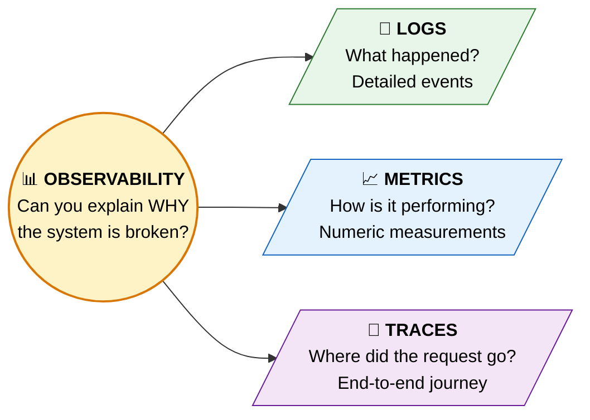
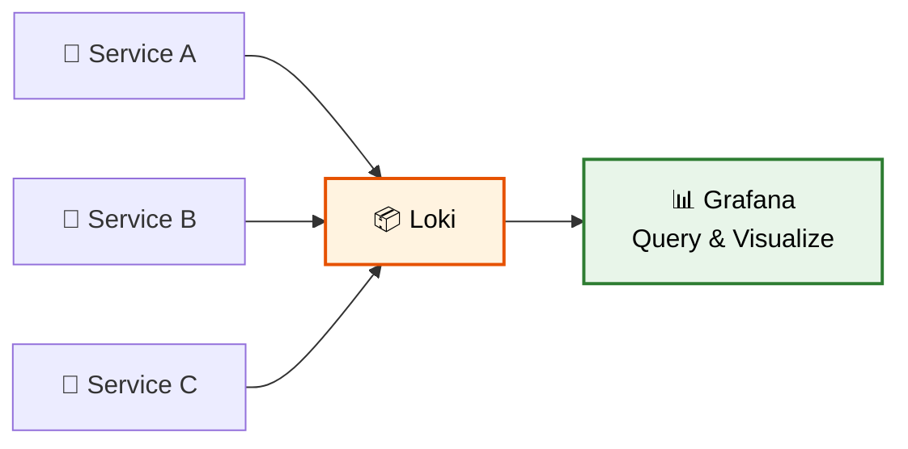
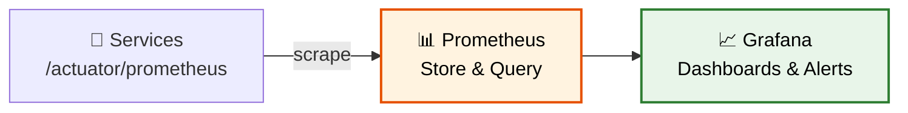
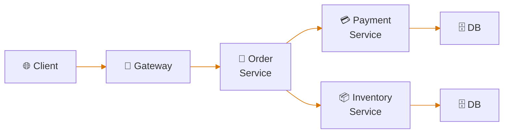
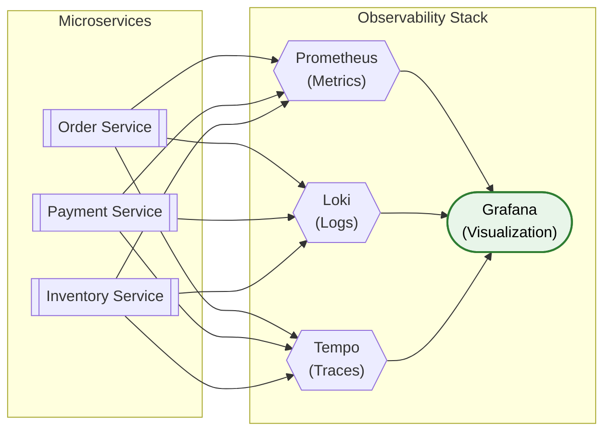

# 📊 Observability

> **Understanding the internal state of your distributed system through Logs, Metrics, and Traces — the three pillars of observability.**

---

!!! abstract "Real-World Analogy"
    Think of a **hospital monitoring system**. **Metrics** = vital signs dashboard (heart rate, blood pressure). **Logs** = doctor's notes (detailed events). **Traces** = patient journey (ER → Lab → Surgery → ICU). Together, they give a complete picture of health. Without all three, you're diagnosing blindly.



---

## 📝 Pillar 1: Logs

Structured, searchable records of discrete events.

### Structured Logging with Spring Boot

```xml
<!-- logback-spring.xml -->
<configuration>
    <appender name="JSON" class="ch.qos.logback.core.ConsoleAppender">
        <encoder class="net.logstash.logback.encoder.LogstashEncoder"/>
    </appender>
    <root level="INFO">
        <appender-ref ref="JSON"/>
    </root>
</configuration>
```

```java
@Slf4j
@Service
public class OrderService {
    
    public Order createOrder(OrderRequest request) {
        log.info("Creating order for user={}, items={}", request.getUserId(), request.getItems().size());
        // ... business logic
        log.info("Order created successfully orderId={}, total={}", order.getId(), order.getTotal());
        return order;
    }
}
```

Output (structured JSON):
```json
{
  "timestamp": "2024-01-15T10:30:00.123Z",
  "level": "INFO",
  "message": "Order created successfully orderId=ORD-123, total=49.99",
  "service": "order-service",
  "traceId": "abc123def456",
  "spanId": "span789"
}
```

### Log Aggregation Stack



---

## 📈 Pillar 2: Metrics

Numeric measurements aggregated over time — CPU, memory, request count, latency.

### Spring Boot Actuator + Micrometer

```xml
<dependency>
    <groupId>org.springframework.boot</groupId>
    <artifactId>spring-boot-starter-actuator</artifactId>
</dependency>
<dependency>
    <groupId>io.micrometer</groupId>
    <artifactId>micrometer-registry-prometheus</artifactId>
</dependency>
```

```yaml
management:
  endpoints:
    web:
      exposure:
        include: health,prometheus,metrics
  metrics:
    tags:
      application: order-service
```

### Custom Metrics

```java
@Service
public class OrderService {

    private final Counter orderCounter;
    private final Timer orderTimer;

    public OrderService(MeterRegistry registry) {
        this.orderCounter = Counter.builder("orders.created")
            .description("Total orders created")
            .tag("service", "order-service")
            .register(registry);
        this.orderTimer = Timer.builder("orders.processing.time")
            .description("Time to process an order")
            .register(registry);
    }

    public Order createOrder(OrderRequest request) {
        return orderTimer.record(() -> {
            Order order = processOrder(request);
            orderCounter.increment();
            return order;
        });
    }
}
```

### Metrics Stack: Prometheus + Grafana



---

## 🔗 Pillar 3: Distributed Tracing

Track a single request as it flows through multiple services.



All spans share the same **Trace ID** → you can see the entire request journey.

### Setup with Spring Boot 3

```xml
<dependency>
    <groupId>io.micrometer</groupId>
    <artifactId>micrometer-tracing-bridge-otel</artifactId>
</dependency>
<dependency>
    <groupId>io.opentelemetry</groupId>
    <artifactId>opentelemetry-exporter-zipkin</artifactId>
</dependency>
```

```yaml
management:
  tracing:
    sampling:
      probability: 1.0  # 100% in dev, lower in prod
  zipkin:
    tracing:
      endpoint: http://tempo:9411/api/v2/spans
```

### Trace Visualization (Grafana Tempo)

```
Trace ID: abc123def456
├── Gateway         [0ms ─────── 250ms]
│   ├── Order Service   [10ms ──── 200ms]
│   │   ├── Payment Service [50ms ── 150ms]
│   │   │   └── DB Query        [80ms ─ 120ms]
│   │   └── Inventory Service [60ms ── 180ms]
│   │       └── DB Query        [100ms ─ 160ms]
```

---

## 🏗️ Full Observability Stack (Docker Compose)



```yaml
# docker-compose.yml (observability stack)
services:
  prometheus:
    image: prom/prometheus
    ports: ["9090:9090"]
    volumes:
      - ./prometheus.yml:/etc/prometheus/prometheus.yml

  loki:
    image: grafana/loki:latest
    ports: ["3100:3100"]

  tempo:
    image: grafana/tempo:latest
    ports: ["3200:3200", "9411:9411"]

  grafana:
    image: grafana/grafana:latest
    ports: ["3000:3000"]
    environment:
      - GF_AUTH_ANONYMOUS_ENABLED=true
```

---

## 🔑 Correlation IDs

The **Trace ID** automatically propagates across services via HTTP headers:

| Header | Purpose |
|--------|---------|
| `traceparent` | W3C standard trace context |
| `X-B3-TraceId` | Zipkin B3 format |
| `X-Request-ID` | Custom correlation |

Spring Boot 3 + Micrometer Tracing handles this automatically.

---

## 🎯 Interview Questions

??? question "1. What are the three pillars of observability?"
    **Logs** (what happened — discrete events), **Metrics** (how it's performing — numeric aggregates), **Traces** (where the request went — end-to-end path). Together they answer: What's broken? Where? Why?

??? question "2. What's the difference between monitoring and observability?"
    **Monitoring** tells you WHEN something is broken (alerts on predefined thresholds). **Observability** tells you WHY it's broken — you can investigate unknown-unknowns by correlating logs, metrics, and traces.

??? question "3. How does distributed tracing work?"
    A unique Trace ID is generated at the entry point and propagated via HTTP headers to all downstream services. Each service creates a Span (with start time, duration, metadata) under that Trace ID. Collected spans form a trace tree showing the full request journey.

??? question "4. What is Micrometer in Spring Boot?"
    Micrometer is a metrics facade (like SLF4J for logs but for metrics). It provides a vendor-neutral API to collect metrics and can export to Prometheus, Datadog, CloudWatch, etc. Spring Boot 3 uses it for both metrics and tracing.

??? question "5. How would you debug a slow API in a microservices system?"
    1. Check **metrics** — identify which endpoint is slow (p99 latency)
    2. Look at **traces** — find the specific span where time is spent
    3. Check **logs** — find the error/slow query at that specific service and time
    4. Correlate using Trace ID across all three

??? question "6. What sampling rate would you use in production?"
    Typically 1-10% (`probability: 0.01 to 0.1`). 100% sampling generates too much data and impacts performance. For errors, always capture 100% (use tail-based sampling).
