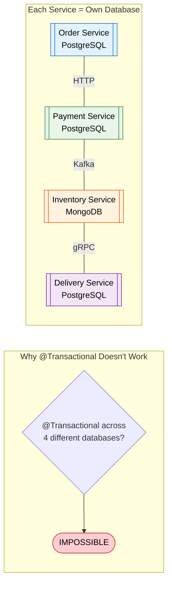
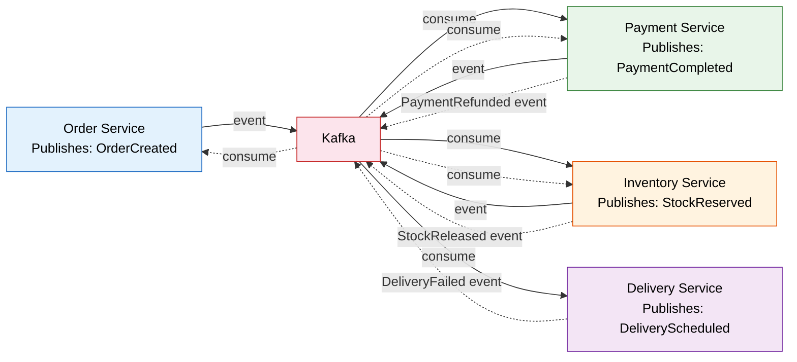
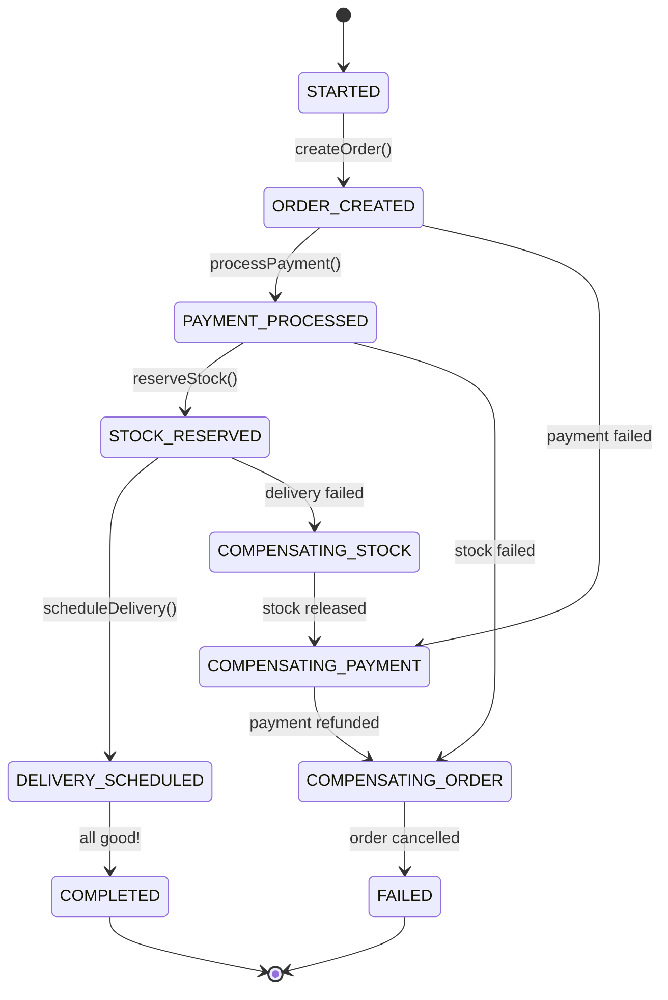
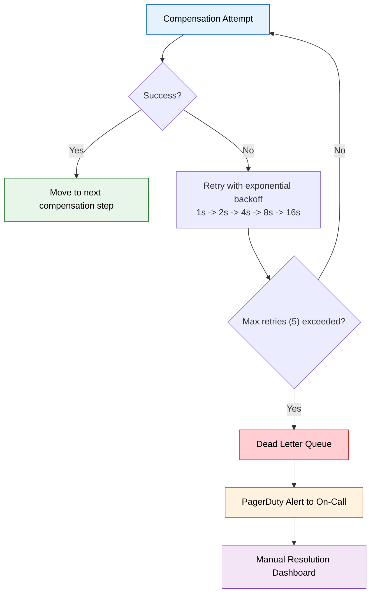
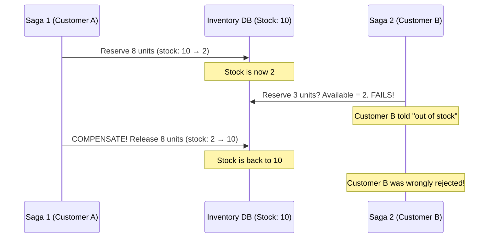

# Saga Design Pattern

---

## One-Liner Definition (Say This in an Interview)

> "A Saga is a sequence of local transactions across multiple services, where each step has a compensating action that undoes its effect if a later step fails — giving you eventual consistency without distributed locks."

---

## What Is a Saga?

Imagine you're ordering food on Swiggy. Behind the scenes, here's what happens:

1. **Order Service** creates the order
2. **Payment Service** charges your wallet Rs. 450
3. **Restaurant Service** accepts and starts cooking
4. **Delivery Service** assigns a delivery partner

Now imagine step 4 fails — no delivery partner is available in your area. You've already been charged Rs. 450, and the restaurant has started cooking. You can't just "rollback" like a database transaction. You need to:

- Tell the restaurant to stop cooking (compensate step 3)
- Refund Rs. 450 to the customer's wallet (compensate step 2)
- Mark the order as cancelled (compensate step 1)

**That's a Saga.** A sequence of local transactions where each transaction has a compensating counterpart that gets executed in reverse order when something goes wrong.

```mermaid
flowchart LR
    A["Create Order"] --> B["Charge Payment"]
    B --> C["Confirm Restaurant"]
    C --> D["Assign Rider"]
    D -->|"No rider!"| E["Cancel Restaurant"]
    E --> F["Refund Payment"]
    F --> G["Cancel Order"]
    
    style A fill:#E8F5E9,stroke:#2E7D32,color:#000
    style B fill:#E8F5E9,stroke:#2E7D32,color:#000
    style C fill:#E8F5E9,stroke:#2E7D32,color:#000
    style D fill:#FFCDD2,stroke:#C62828,color:#000
    style E fill:#FFF3E0,stroke:#E65100,color:#000
    style F fill:#FFF3E0,stroke:#E65100,color:#000
    style G fill:#FFF3E0,stroke:#E65100,color:#000
```



---

## Why Do You Need Sagas? (The Real Problem)

### The Monolith World Was Easy

In a monolith, you have one database and one `@Transactional` annotation:

```java title="MonolithOrderService.java"
@Transactional  // One atomic transaction — ALL succeed or ALL rollback
public void placeOrder(Order order) {
    orderRepository.save(order);           // 1. Save order
    paymentService.charge(order);          // 2. Charge payment
    inventoryService.reserve(order);       // 3. Reserve stock
    deliveryService.schedule(order);       // 4. Schedule delivery
}
// If step 3 throws an exception, steps 1 and 2 automatically roll back. Magic.
```

### The Microservices World Breaks This

In microservices, each service owns its own database. There is no single transaction manager that spans Order DB + Payment DB + Inventory DB + Delivery DB.



!!! danger "What Goes Wrong Without Sagas: A Real Incident"
    **The Scenario**: An e-commerce team at a mid-size startup deployed microservices without saga coordination. Their order flow was: create order -> charge payment -> reserve inventory -> schedule shipping.
    
    **What Happened**: The inventory service went down for 3 minutes during a flash sale. Payment service charged 2,400 customers successfully, but inventory reservation failed. No compensation logic existed.
    
    **The Fallout**: 2,400 customers were charged for products that were never reserved. Some products went out of stock when the system recovered. Customer support was flooded. They had to manually issue refunds for 2 days.
    
    **The Fix**: They implemented the Saga pattern with orchestration. Now, if inventory fails, payment automatically refunds within 30 seconds.

---

## When to Use Sagas (and When NOT To)

### Use Sagas When:

- You have a business transaction that spans 3+ microservices
- Each service has its own database (polyglot persistence)
- You need eventual consistency (not strong consistency)
- Operations can be logically "undone" (refund, cancel, release)
- You're building workflows like: order fulfillment, loan processing, hotel booking

### Do NOT Use Sagas When:

- You need strong consistency (use a single database or 2PC for 2 services)
- The transaction spans only 2 services (a simple retry + idempotent endpoint is enough)
- Operations cannot be compensated (e.g., launching a missile, sending a physical letter)
- Your team is small and a monolith would work fine (don't over-engineer)

!!! tip "Interview Tip"
    When asked "How do you handle distributed transactions in microservices?", start with: "There are two approaches — 2PC and Saga. 2PC gives strong consistency but kills availability because all participants hold locks until commit. Sagas give eventual consistency with high availability — each service commits locally and we use compensating transactions for rollback. In practice, Sagas are the standard for microservices at scale."

---

## How: Two Implementation Approaches

There are exactly two ways to implement a Saga. You need to know both cold for interviews.

---

## Approach 1: Choreography (Event-Driven, No Coordinator)

### What Is It?

Each service listens for events and decides what to do next. There's no central brain. It's like a dance where each dancer knows their next move based on the music (events), not a choreographer telling them.

### Where It Fits in Architecture



### The Dual-Write Problem (Critical Bug Most Teams Hit)

Here's the naive implementation that looks correct but has a critical flaw:

```java title="OrderService.java - WRONG (Dual-Write Anti-Pattern)"
@Service
public class OrderService {
    
    @Transactional
    public Order createOrder(OrderRequest request) {
        // Step 1: Write to database
        Order order = orderRepository.save(new Order(request));
        
        // Step 2: Publish event to Kafka
        // BUG: If Kafka publish fails AFTER the DB commits, we have an order
        // in the database but no event was published. Payment service never 
        // learns about this order. The customer sees "Processing..." forever.
        kafkaTemplate.send("order-events", new OrderCreatedEvent(order.getId()));
        
        return order;
    }
}
```

**Why this breaks**: The database commit and the Kafka publish are two separate operations. You can't wrap them in a single transaction (Kafka is not a transactional resource managed by your DB transaction manager). If the JVM crashes between the DB commit and the Kafka send, you have inconsistency.

!!! danger "What Breaks: The Dual-Write at Flipkart's Big Billion Days"
    During a sale event, a team saw ~0.1% of orders getting "stuck" in CREATED state forever. The root cause: under heavy load, the Kafka broker was occasionally slow to acknowledge. The @Transactional committed the order to Postgres, then the Kafka send timed out. The order existed in the DB but no event was ever published. 1,200 orders were affected in 4 hours. They deployed the Outbox Pattern the next week.

### The Fix: Outbox Pattern (Production-Grade)

The idea is simple: instead of writing to DB and Kafka separately, write the event to a special `outbox_events` table **in the same database transaction** as your business data. Then a separate process (CDC/Debezium) tails the outbox table and publishes to Kafka.

```java title="OrderService.java - CORRECT (Outbox Pattern)"
@Service
@Slf4j
public class OrderService {

    private final OrderRepository orderRepository;
    private final OutboxRepository outboxRepository;
    private final ObjectMapper objectMapper;

    @Transactional  // Single atomic DB transaction for BOTH the order AND the event
    public Order createOrder(OrderRequest request) {
        // Step 1: Save the order
        Order order = Order.builder()
            .customerId(request.getCustomerId())
            .items(request.getItems())
            .totalAmount(request.getTotalAmount())
            .status(OrderStatus.CREATED)
            .createdAt(Instant.now())
            .build();
        orderRepository.save(order);
        
        // Step 2: Write event to outbox table (SAME transaction - atomic!)
        OutboxEvent event = OutboxEvent.builder()
            .aggregateId(order.getId().toString())
            .aggregateType("Order")
            .eventType("OrderCreated")
            .payload(serializePayload(order))
            .status(OutboxStatus.PENDING)
            .createdAt(Instant.now())
            .build();
        outboxRepository.save(event);
        
        log.info("Order {} created with outbox event {}", order.getId(), event.getId());
        return order;
    }

    private String serializePayload(Order order) {
        try {
            OrderCreatedEvent event = new OrderCreatedEvent(
                order.getId().toString(),
                order.getCustomerId(),
                order.getTotalAmount(),
                order.getItems().stream()
                    .map(i -> new OrderItemDto(i.getSku(), i.getQuantity()))
                    .toList()
            );
            return objectMapper.writeValueAsString(event);
        } catch (JsonProcessingException e) {
            throw new RuntimeException("Failed to serialize outbox payload", e);
        }
    }
}
```

```sql title="outbox_events table (PostgreSQL)"
CREATE TABLE outbox_events (
    id              UUID PRIMARY KEY DEFAULT gen_random_uuid(),
    aggregate_id    VARCHAR(255) NOT NULL,
    aggregate_type  VARCHAR(100) NOT NULL,
    event_type      VARCHAR(100) NOT NULL,
    payload         JSONB NOT NULL,
    status          VARCHAR(50) DEFAULT 'PENDING',
    created_at      TIMESTAMP NOT NULL DEFAULT NOW(),
    published_at    TIMESTAMP,
    
    -- Index for CDC polling (if not using Debezium)
    CONSTRAINT idx_outbox_status_created 
        CHECK (status IN ('PENDING', 'PUBLISHED', 'FAILED'))
);

CREATE INDEX idx_outbox_pending ON outbox_events(status, created_at) 
    WHERE status = 'PENDING';
```

**Debezium CDC Connector** tails PostgreSQL's WAL and publishes events to Kafka automatically:

```json title="debezium-outbox-connector.json"
{
  "name": "order-outbox-connector",
  "config": {
    "connector.class": "io.debezium.connector.postgresql.PostgresConnector",
    "database.hostname": "order-db",
    "database.port": "5432",
    "database.dbname": "orderdb",
    "database.user": "debezium",
    "database.password": "${DEBEZIUM_PASSWORD}",
    "table.include.list": "public.outbox_events",
    "transforms": "outbox",
    "transforms.outbox.type": "io.debezium.transforms.outbox.EventRouter",
    "transforms.outbox.route.topic.replacement": "${routedByValue}-events",
    "transforms.outbox.table.field.event.id": "id",
    "transforms.outbox.table.field.event.key": "aggregate_id",
    "transforms.outbox.table.field.event.payload": "payload",
    "transforms.outbox.table.field.event.type": "event_type"
  }
}
```

### Payment Service (Choreography Consumer)

```java title="PaymentEventHandler.java"
@Service
@Slf4j
public class PaymentEventHandler {

    private final PaymentRepository paymentRepository;
    private final OutboxRepository outboxRepository;
    private final PaymentGateway paymentGateway;

    @KafkaListener(topics = "Order-events", groupId = "payment-service")
    @Transactional
    public void handleOrderCreated(OrderCreatedEvent event) {
        log.info("Received OrderCreated event for order: {}", event.getOrderId());
        
        // Idempotency check — critical for choreography!
        if (paymentRepository.existsByOrderIdAndStatus(event.getOrderId(), PaymentStatus.COMPLETED)) {
            log.warn("Payment already processed for order {}. Skipping (idempotent).", event.getOrderId());
            return;
        }

        try {
            // Charge the customer
            PaymentResult result = paymentGateway.charge(
                event.getCustomerId(), 
                event.getTotalAmount()
            );
            
            Payment payment = Payment.builder()
                .orderId(event.getOrderId())
                .customerId(event.getCustomerId())
                .amount(event.getTotalAmount())
                .transactionId(result.getTransactionId())
                .status(PaymentStatus.COMPLETED)
                .build();
            paymentRepository.save(payment);
            
            // Publish success event via outbox
            outboxRepository.save(OutboxEvent.builder()
                .aggregateId(event.getOrderId())
                .aggregateType("Payment")
                .eventType("PaymentCompleted")
                .payload(serializePaymentCompleted(payment))
                .status(OutboxStatus.PENDING)
                .createdAt(Instant.now())
                .build());
                
        } catch (InsufficientFundsException e) {
            log.error("Payment failed for order {}: {}", event.getOrderId(), e.getMessage());
            
            // Publish failure event — triggers compensation upstream
            outboxRepository.save(OutboxEvent.builder()
                .aggregateId(event.getOrderId())
                .aggregateType("Payment")
                .eventType("PaymentFailed")
                .payload(serializePaymentFailed(event.getOrderId(), e.getMessage()))
                .status(OutboxStatus.PENDING)
                .createdAt(Instant.now())
                .build());
        }
    }
    
    @KafkaListener(topics = "Inventory-events", groupId = "payment-service")
    @Transactional
    public void handleStockReservationFailed(StockReservationFailedEvent event) {
        log.info("Stock reservation failed for order {}. Initiating refund.", event.getOrderId());
        
        Payment payment = paymentRepository.findByOrderId(event.getOrderId())
            .orElseThrow(() -> new IllegalStateException("No payment found for order: " + event.getOrderId()));
        
        // Compensating transaction: refund
        paymentGateway.refund(payment.getTransactionId(), payment.getAmount());
        payment.setStatus(PaymentStatus.REFUNDED);
        paymentRepository.save(payment);
        
        // Publish refund event
        outboxRepository.save(OutboxEvent.builder()
            .aggregateId(event.getOrderId())
            .aggregateType("Payment")
            .eventType("PaymentRefunded")
            .payload(serializeRefund(payment))
            .status(OutboxStatus.PENDING)
            .createdAt(Instant.now())
            .build());
    }
}
```

### When to Use Choreography

| Good For | Bad For |
|----------|---------|
| 2-4 step workflows | 5+ step workflows (becomes spaghetti) |
| Independent teams owning services | When you need to see the full flow in one place |
| Simple compensation logic | Complex conditional compensation |
| High availability requirements | When debugging needs to be fast |

!!! tip "Interview Tip"
    "I'd use choreography for simple flows where each service is independently owned — like an event notification fan-out after order creation. But once you hit 5+ steps with conditional branching, choreography becomes a distributed monolith that's impossible to debug. That's when I switch to orchestration."

---

## Approach 2: Orchestration (Central Coordinator with State Machine)

### What Is It?

A single **Saga Orchestrator** service acts as the brain. It tells each service what to do, waits for the response, and decides the next step. If something fails, the orchestrator knows exactly which compensations to run and in what order.

### Where It Fits in Architecture



### Step 1: Define the Saga State Machine

```java title="SagaState.java"
public enum SagaState {
    // Forward states (happy path)
    STARTED,
    ORDER_CREATED,
    PAYMENT_PROCESSED,
    STOCK_RESERVED,
    DELIVERY_SCHEDULED,
    COMPLETED,
    
    // Compensation states (unhappy path)
    COMPENSATING_STOCK,
    COMPENSATING_PAYMENT,
    COMPENSATING_ORDER,
    FAILED,
    
    // Terminal error states (human intervention required)
    COMPENSATION_FAILED,
    TIMED_OUT;
    
    public boolean isTerminal() {
        return this == COMPLETED || this == FAILED || this == COMPENSATION_FAILED;
    }
    
    public boolean isCompensating() {
        return this.name().startsWith("COMPENSATING");
    }
}
```

### Step 2: Persist Saga State (Survive Crashes)

```sql title="saga_instances table (PostgreSQL)"
CREATE TABLE saga_instances (
    saga_id         UUID PRIMARY KEY DEFAULT gen_random_uuid(),
    saga_type       VARCHAR(100) NOT NULL,
    state           VARCHAR(50) NOT NULL,
    payload         JSONB NOT NULL,           -- original request
    saga_data       JSONB DEFAULT '{}',       -- accumulated IDs from each step
    created_at      TIMESTAMP NOT NULL DEFAULT NOW(),
    updated_at      TIMESTAMP NOT NULL DEFAULT NOW(),
    deadline_at     TIMESTAMP NOT NULL,       -- saga MUST complete by this time
    retry_count     INT DEFAULT 0,
    last_error      TEXT,
    version         BIGINT DEFAULT 0,         -- optimistic locking
    
    CONSTRAINT valid_state CHECK (state IN (
        'STARTED', 'ORDER_CREATED', 'PAYMENT_PROCESSED', 'STOCK_RESERVED',
        'DELIVERY_SCHEDULED', 'COMPLETED', 'COMPENSATING_STOCK', 
        'COMPENSATING_PAYMENT', 'COMPENSATING_ORDER', 'FAILED',
        'COMPENSATION_FAILED', 'TIMED_OUT'
    ))
);

CREATE INDEX idx_saga_active ON saga_instances(state, updated_at) 
    WHERE state NOT IN ('COMPLETED', 'FAILED', 'COMPENSATION_FAILED');
CREATE INDEX idx_saga_deadline ON saga_instances(deadline_at) 
    WHERE state NOT IN ('COMPLETED', 'FAILED');
```

### Step 3: The Production Orchestrator

This is the real deal. Not a snippet — a full orchestrator with error handling, retry logic, and crash recovery support.

```java title="OrderSagaOrchestrator.java"
@Service
@Slf4j
@RequiredArgsConstructor
public class OrderSagaOrchestrator {

    private final SagaRepository sagaRepository;
    private final OrderServiceClient orderService;
    private final PaymentServiceClient paymentService;
    private final InventoryServiceClient inventoryService;
    private final DeliveryServiceClient deliveryService;
    private final CompensationRetryHandler compensationHandler;
    private final MeterRegistry meterRegistry;  // Prometheus metrics
    
    private static final Duration SAGA_TIMEOUT = Duration.ofMinutes(5);

    /**
     * Entry point: starts a new order saga.
     * Returns the saga ID so the caller can poll for status.
     */
    @Transactional
    public UUID startSaga(OrderRequest request) {
        SagaInstance saga = SagaInstance.builder()
            .sagaType("OrderSaga")
            .state(SagaState.STARTED)
            .payload(toJson(request))
            .deadlineAt(Instant.now().plus(SAGA_TIMEOUT))
            .build();
        sagaRepository.save(saga);
        
        log.info("Saga {} started for customer {}", saga.getSagaId(), request.getCustomerId());
        meterRegistry.counter("saga.started", "type", "OrderSaga").increment();
        
        advanceSaga(saga);
        return saga.getSagaId();
    }
    
    /**
     * Advances the saga to the next state based on current state.
     * This method is IDEMPOTENT — safe to call multiple times for the same state
     * (important for crash recovery).
     */
    @Transactional
    public void advanceSaga(SagaInstance saga) {
        // Optimistic lock check — another instance might have progressed this saga
        SagaInstance fresh = sagaRepository.findByIdWithLock(saga.getSagaId())
            .orElseThrow(() -> new SagaNotFoundException(saga.getSagaId()));
        
        if (fresh.getState().isTerminal()) {
            log.info("Saga {} already in terminal state {}. Skipping.", 
                fresh.getSagaId(), fresh.getState());
            return;
        }
        
        try {
            switch (fresh.getState()) {
                case STARTED -> executeCreateOrder(fresh);
                case ORDER_CREATED -> executeProcessPayment(fresh);
                case PAYMENT_PROCESSED -> executeReserveStock(fresh);
                case STOCK_RESERVED -> executeScheduleDelivery(fresh);
                default -> log.warn("Saga {} in unexpected forward state: {}", 
                    fresh.getSagaId(), fresh.getState());
            }
        } catch (Exception e) {
            log.error("Saga {} failed at state {}: {}", 
                fresh.getSagaId(), fresh.getState(), e.getMessage(), e);
            fresh.setLastError(e.getMessage());
            fresh.incrementRetryCount();
            startCompensation(fresh);
        }
        
        fresh.setUpdatedAt(Instant.now());
        sagaRepository.save(fresh);
    }
    
    private void executeCreateOrder(SagaInstance saga) {
        OrderRequest request = fromJson(saga.getPayload(), OrderRequest.class);
        
        String orderId = orderService.createOrder(request);
        saga.putData("orderId", orderId);
        saga.transitionTo(SagaState.ORDER_CREATED);
        
        log.info("Saga {} - Order created: {}", saga.getSagaId(), orderId);
        
        // Continue to next step (recursive advancement)
        sagaRepository.save(saga);
        advanceSaga(saga);
    }
    
    private void executeProcessPayment(SagaInstance saga) {
        OrderRequest request = fromJson(saga.getPayload(), OrderRequest.class);
        
        String paymentId = paymentService.processPayment(
            saga.getData("orderId"), 
            request.getCustomerId(),
            request.getTotalAmount()
        );
        saga.putData("paymentId", paymentId);
        saga.transitionTo(SagaState.PAYMENT_PROCESSED);
        
        log.info("Saga {} - Payment processed: {}", saga.getSagaId(), paymentId);
        
        sagaRepository.save(saga);
        advanceSaga(saga);
    }
    
    private void executeReserveStock(SagaInstance saga) {
        OrderRequest request = fromJson(saga.getPayload(), OrderRequest.class);
        
        String reservationId = inventoryService.reserveStock(
            saga.getData("orderId"), 
            request.getItems()
        );
        saga.putData("reservationId", reservationId);
        saga.transitionTo(SagaState.STOCK_RESERVED);
        
        log.info("Saga {} - Stock reserved: {}", saga.getSagaId(), reservationId);
        
        sagaRepository.save(saga);
        advanceSaga(saga);
    }
    
    private void executeScheduleDelivery(SagaInstance saga) {
        OrderRequest request = fromJson(saga.getPayload(), OrderRequest.class);
        
        String deliveryId = deliveryService.scheduleDelivery(
            saga.getData("orderId"), 
            request.getDeliveryAddress()
        );
        saga.putData("deliveryId", deliveryId);
        saga.transitionTo(SagaState.COMPLETED);
        
        log.info("Saga {} COMPLETED successfully. Order: {}, Delivery: {}", 
            saga.getSagaId(), saga.getData("orderId"), deliveryId);
        meterRegistry.counter("saga.completed", "type", "OrderSaga").increment();
    }

    // =========================================================================
    // COMPENSATION LOGIC (The Unhappy Path)
    // =========================================================================
    
    /**
     * Determines which compensation state to enter based on where the saga failed.
     */
    public void startCompensation(SagaInstance saga) {
        log.warn("Starting compensation for saga {} from state {}", 
            saga.getSagaId(), saga.getState());
        meterRegistry.counter("saga.compensating", "type", "OrderSaga").increment();
        
        switch (saga.getState()) {
            case STOCK_RESERVED -> saga.transitionTo(SagaState.COMPENSATING_STOCK);
            case PAYMENT_PROCESSED -> saga.transitionTo(SagaState.COMPENSATING_PAYMENT);
            case ORDER_CREATED -> saga.transitionTo(SagaState.COMPENSATING_ORDER);
            case STARTED -> {
                saga.transitionTo(SagaState.FAILED);
                return;  // Nothing to compensate
            }
            default -> {
                // Already in a compensation state — continue from here
            }
        }
        sagaRepository.save(saga);
        executeCompensation(saga);
    }
    
    /**
     * Executes compensating transactions in reverse order.
     * Each step is idempotent — safe to retry on failure.
     */
    public void executeCompensation(SagaInstance saga) {
        try {
            switch (saga.getState()) {
                case COMPENSATING_STOCK -> {
                    String reservationId = saga.getData("reservationId");
                    if (reservationId != null) {
                        inventoryService.releaseStock(reservationId);
                        log.info("Saga {} - Stock released: {}", saga.getSagaId(), reservationId);
                    }
                    saga.transitionTo(SagaState.COMPENSATING_PAYMENT);
                    sagaRepository.save(saga);
                    executeCompensation(saga);  // Continue to next compensation
                }
                case COMPENSATING_PAYMENT -> {
                    String paymentId = saga.getData("paymentId");
                    if (paymentId != null) {
                        paymentService.refundPayment(paymentId);
                        log.info("Saga {} - Payment refunded: {}", saga.getSagaId(), paymentId);
                    }
                    saga.transitionTo(SagaState.COMPENSATING_ORDER);
                    sagaRepository.save(saga);
                    executeCompensation(saga);
                }
                case COMPENSATING_ORDER -> {
                    String orderId = saga.getData("orderId");
                    if (orderId != null) {
                        orderService.cancelOrder(orderId);
                        log.info("Saga {} - Order cancelled: {}", saga.getSagaId(), orderId);
                    }
                    saga.transitionTo(SagaState.FAILED);
                    sagaRepository.save(saga);
                    
                    log.info("Saga {} compensation COMPLETED. All steps reversed.", saga.getSagaId());
                    meterRegistry.counter("saga.failed", "type", "OrderSaga").increment();
                }
                default -> log.warn("Saga {} in unexpected compensation state: {}", 
                    saga.getSagaId(), saga.getState());
            }
        } catch (Exception e) {
            log.error("Compensation failed for saga {} at state {}: {}", 
                saga.getSagaId(), saga.getState(), e.getMessage(), e);
            compensationHandler.handleCompensationFailure(saga, e);
        }
    }
}
```

!!! warning "Why Persist State? A Crash Story"
    **What happens without saga persistence**: Your orchestrator holds saga state in local variables. It charges the customer (step 2), then the JVM crashes (OutOfMemoryError during a GC storm). When the service restarts, all in-memory state is gone. The customer is charged but no stock is reserved and no delivery is scheduled. Nobody knows this saga exists. The customer waits forever.
    
    **With persistence**: On restart, the recovery scheduler finds the saga in `PAYMENT_PROCESSED` state (it was saved before the crash). It picks up from where it left off — reserves stock and schedules delivery. The customer gets their food 30 seconds later than expected.

---

## Crash Recovery (The Unsung Hero)

Here's the thing most tutorials skip: your orchestrator will crash. Deployments happen. JVMs OOM. Pods get evicted. You need a process that detects stuck sagas and resumes them.

```java title="SagaRecoveryScheduler.java"
@Component
@Slf4j
@RequiredArgsConstructor
public class SagaRecoveryScheduler {

    private final SagaRepository sagaRepository;
    private final OrderSagaOrchestrator orchestrator;
    private final MeterRegistry meterRegistry;
    
    private static final Duration STUCK_THRESHOLD = Duration.ofSeconds(60);

    /**
     * Runs every 30 seconds. Finds sagas that haven't been updated recently
     * and are not in a terminal state. These are likely stuck due to a crash.
     */
    @Scheduled(fixedDelay = 30_000)
    @Transactional
    public void recoverStuckSagas() {
        Instant stuckSince = Instant.now().minus(STUCK_THRESHOLD);
        
        List<SagaInstance> stuckSagas = sagaRepository.findStuckSagas(
            List.of(SagaState.COMPLETED, SagaState.FAILED, SagaState.COMPENSATION_FAILED),
            stuckSince
        );
        
        if (!stuckSagas.isEmpty()) {
            log.warn("Found {} stuck sagas to recover", stuckSagas.size());
            meterRegistry.gauge("saga.stuck.count", stuckSagas.size());
        }
        
        for (SagaInstance saga : stuckSagas) {
            try {
                log.info("Recovering saga {} in state {} (last updated: {})", 
                    saga.getSagaId(), saga.getState(), saga.getUpdatedAt());
                
                if (saga.getState().isCompensating()) {
                    orchestrator.executeCompensation(saga);
                } else {
                    orchestrator.advanceSaga(saga);
                }
            } catch (Exception e) {
                log.error("Recovery failed for saga {}: {}", saga.getSagaId(), e.getMessage());
                // Don't rethrow — continue recovering other sagas
            }
        }
    }
    
    /**
     * Detects sagas that have exceeded their deadline.
     * A saga without a deadline is a saga that can hang forever.
     */
    @Scheduled(fixedDelay = 10_000)
    @Transactional
    public void handleTimedOutSagas() {
        List<SagaInstance> timedOut = sagaRepository.findTimedOutSagas(
            Instant.now(),
            List.of(SagaState.COMPLETED, SagaState.FAILED, SagaState.TIMED_OUT, 
                    SagaState.COMPENSATION_FAILED)
        );
        
        for (SagaInstance saga : timedOut) {
            log.error("Saga {} TIMED OUT in state {} (deadline was: {})", 
                saga.getSagaId(), saga.getState(), saga.getDeadlineAt());
            
            meterRegistry.counter("saga.timed_out", "type", saga.getSagaType()).increment();
            saga.transitionTo(SagaState.TIMED_OUT);
            sagaRepository.save(saga);
            
            orchestrator.startCompensation(saga);
        }
    }
}
```

```java title="SagaRepository.java (Custom Queries)"
@Repository
public interface SagaRepository extends JpaRepository<SagaInstance, UUID> {
    
    @Query("SELECT s FROM SagaInstance s WHERE s.state NOT IN :terminalStates " +
           "AND s.updatedAt < :threshold ORDER BY s.updatedAt ASC")
    List<SagaInstance> findStuckSagas(
        @Param("terminalStates") List<SagaState> terminalStates,
        @Param("threshold") Instant threshold
    );
    
    @Query("SELECT s FROM SagaInstance s WHERE s.deadlineAt < :now " +
           "AND s.state NOT IN :excludeStates")
    List<SagaInstance> findTimedOutSagas(
        @Param("now") Instant now,
        @Param("excludeStates") List<SagaState> excludeStates
    );
    
    @Lock(LockModeType.PESSIMISTIC_WRITE)
    @Query("SELECT s FROM SagaInstance s WHERE s.sagaId = :id")
    Optional<SagaInstance> findByIdWithLock(@Param("id") UUID id);
}
```

!!! danger "What Breaks: No Saga Timeout"
    **Scenario**: Uber's delivery assignment service had a bug where it returned HTTP 200 but with an empty response for certain edge cases. The saga orchestrator treated this as "still processing" and kept waiting. Without a deadline, 847 sagas were stuck in `STOCK_RESERVED` state for 6 hours. Customers were charged, restaurants prepared food, but no delivery was ever assigned. The fix: every saga gets a `deadline_at`. If it's not completed by then, force-compensate.

---

## Compensating Transaction Failure (When the Undo Itself Fails)

This is the scariest scenario: your saga failed at step 4, so you try to refund the payment (compensation for step 2), but the payment gateway is also down. Now what?



```java title="CompensationRetryHandler.java"
@Service
@Slf4j
@RequiredArgsConstructor
public class CompensationRetryHandler {

    private final SagaRepository sagaRepository;
    private final KafkaTemplate<String, CompensationFailedEvent> dlqPublisher;
    private final AlertService alertService;
    private final MeterRegistry meterRegistry;
    
    private static final int MAX_COMPENSATION_RETRIES = 5;
    private static final String DLQ_TOPIC = "saga-compensation-dlq";

    /**
     * Called when a compensation step throws an exception.
     * Implements a layered strategy: retry -> DLQ -> alert humans.
     */
    public void handleCompensationFailure(SagaInstance saga, Exception e) {
        saga.incrementRetryCount();
        saga.setLastError(e.getMessage());
        
        if (saga.getRetryCount() >= MAX_COMPENSATION_RETRIES) {
            // ===== ESCALATION: All retries exhausted =====
            log.error("CRITICAL: Saga {} compensation PERMANENTLY FAILED at state {} after {} retries. " +
                "Manual intervention required!", saga.getSagaId(), saga.getState(), saga.getRetryCount());
            
            saga.transitionTo(SagaState.COMPENSATION_FAILED);
            sagaRepository.save(saga);
            
            // 1. Publish to Dead Letter Queue for manual resolution
            CompensationFailedEvent dlqEvent = CompensationFailedEvent.builder()
                .sagaId(saga.getSagaId())
                .sagaType(saga.getSagaType())
                .failedState(saga.getState().name())
                .error(e.getMessage())
                .payload(saga.getPayload())
                .sagaData(saga.getSagaData())
                .retryCount(saga.getRetryCount())
                .failedAt(Instant.now())
                .build();
            dlqPublisher.send(DLQ_TOPIC, saga.getSagaId().toString(), dlqEvent);
            
            // 2. Page the on-call engineer immediately
            alertService.sendPagerDutyAlert(
                AlertSeverity.P1,
                "SAGA_COMPENSATION_FAILED",
                String.format("Saga %s stuck in %s after %d retries. " +
                    "Customer %s may have been charged without order fulfillment. " +
                    "Requires manual intervention.",
                    saga.getSagaId(), saga.getState(), saga.getRetryCount(),
                    extractCustomerId(saga))
            );
            
            meterRegistry.counter("saga.compensation_failed", 
                "type", saga.getSagaType(),
                "state", saga.getState().name()
            ).increment();
            
        } else {
            // Will be retried by SagaRecoveryScheduler on next run
            log.warn("Compensation retry {}/{} for saga {} at state {}: {}", 
                saga.getRetryCount(), MAX_COMPENSATION_RETRIES,
                saga.getSagaId(), saga.getState(), e.getMessage());
            sagaRepository.save(saga);
        }
    }
}
```

!!! danger "What Breaks: Fire-and-Forget Compensation"
    **Incident at a fintech company**: Their payment refund compensation failed because the payment gateway was doing maintenance. The code logged the error and moved on. 340 customers were charged Rs. 2,000-10,000 for cancelled orders. They only discovered it 3 days later when customer complaints spiked. The fix: DLQ + PagerDuty alert. No compensation failure should EVER be silently swallowed.

---

## Saga Isolation Problems (The Tricky Part for 3-5 YOE)

Here's something interviewers at senior levels love to ask: "Sagas provide ACD of ACID, but what about Isolation?"

The answer is: **Sagas do NOT provide isolation.** During execution, intermediate results are visible to other transactions. This causes real bugs.

### The Problem: Dirty Reads Between Concurrent Sagas

Imagine two orders for the same product happening simultaneously:



Customer B was told "out of stock" based on data that was only temporarily true. Saga 1 ended up compensating and releasing those 8 units, but by then Customer B's request was already rejected.

### Solution 1: Semantic Locks (Application-Level Locking)

Mark data as "in-progress" so other sagas know it might change:

```java title="InventoryService.java - Semantic Lock Pattern"
@Service
@Slf4j
public class InventoryService {
    
    @Transactional
    public String reserveStock(String orderId, List<OrderItem> items) {
        for (OrderItem item : items) {
            // SELECT FOR UPDATE prevents race conditions at DB level
            Inventory inv = inventoryRepository.findBySkuForUpdate(item.getSku());
            
            if (inv.getAvailableStock() < item.getQuantity()) {
                throw new InsufficientStockException(
                    "SKU %s: requested %d, available %d (pending: %d)".formatted(
                        item.getSku(), item.getQuantity(), 
                        inv.getAvailableStock(), inv.getPendingReservations()));
            }
            
            // Deduct from available, add to pending (semantic lock!)
            inv.setAvailableStock(inv.getAvailableStock() - item.getQuantity());
            inv.setPendingReservations(inv.getPendingReservations() + item.getQuantity());
            inv.setLockedBySagaId(orderId);
            inv.setLockExpiresAt(Instant.now().plus(Duration.ofMinutes(5)));
            inventoryRepository.save(inv);
        }
        
        String reservationId = UUID.randomUUID().toString();
        reservationRepository.save(new Reservation(reservationId, orderId, items, 
            ReservationStatus.PENDING));
        
        return reservationId;
    }
    
    /**
     * Called when saga completes successfully. 
     * Converts pending reservation to confirmed (removes semantic lock).
     */
    @Transactional
    public void confirmReservation(String reservationId) {
        Reservation res = reservationRepository.findById(reservationId)
            .orElseThrow();
        
        for (ReservationItem item : res.getItems()) {
            Inventory inv = inventoryRepository.findBySkuForUpdate(item.getSku());
            inv.setPendingReservations(inv.getPendingReservations() - item.getQuantity());
            inv.setLockedBySagaId(null);  // Release semantic lock
            inv.setLockExpiresAt(null);
            inventoryRepository.save(inv);
        }
        
        res.setStatus(ReservationStatus.CONFIRMED);
        reservationRepository.save(res);
    }
    
    /**
     * Called during compensation.
     * Releases the reservation and restores available stock.
     */
    @Transactional
    public void releaseStock(String reservationId) {
        Reservation res = reservationRepository.findById(reservationId)
            .orElseThrow();
        
        if (res.getStatus() == ReservationStatus.RELEASED) {
            log.info("Reservation {} already released. Idempotent skip.", reservationId);
            return;  // Idempotent!
        }
        
        for (ReservationItem item : res.getItems()) {
            Inventory inv = inventoryRepository.findBySkuForUpdate(item.getSku());
            inv.setAvailableStock(inv.getAvailableStock() + item.getQuantity());
            inv.setPendingReservations(inv.getPendingReservations() - item.getQuantity());
            inv.setLockedBySagaId(null);
            inventoryRepository.save(inv);
        }
        
        res.setStatus(ReservationStatus.RELEASED);
        reservationRepository.save(res);
    }
}
```

**How other sagas use this**: When a saga reads inventory, it sees both `availableStock` and `pendingReservations`. A conservative saga uses `availableStock` (already deducted). An optimistic saga might check `availableStock + pendingReservations` (assuming some pending reservations will be released).

### Solution 2: Commutative Updates

Design operations so the order of execution doesn't matter:

```java title="Commutative vs Non-Commutative"
// BAD: Non-commutative (order matters, causes lost updates)
account.setBalance(newCalculatedBalance);
// If two sagas calculate balance independently and both SET, last one wins

// GOOD: Commutative (safe regardless of execution order)
// SQL: UPDATE accounts SET balance = balance - 450 WHERE id = ? AND balance >= 450
accountRepository.decrementBalance(accountId, amount);
// Both sagas deduct independently. Final result is correct regardless of order.
```

### Solution 3: Reread Value (Optimistic Concurrency)

Before committing a saga step, re-read the value to verify it hasn't changed:

```java title="Reread Pattern with Version Check"
@Transactional
public void processPayment(String sagaId, String orderId, BigDecimal expectedAmount) {
    Order order = orderRepository.findById(orderId).orElseThrow();
    
    // Reread: verify the order amount hasn't been modified by another saga/process
    if (!order.getAmount().equals(expectedAmount)) {
        throw new SagaConflictException(
            "Order %s amount changed from %s to %s during saga execution. " +
            "Another process modified it.".formatted(orderId, expectedAmount, order.getAmount()));
    }
    
    // Also check version for optimistic locking
    if (order.getVersion() != expectedVersion) {
        throw new OptimisticLockException("Order modified concurrently");
    }
    
    paymentGateway.charge(order.getCustomerId(), order.getAmount());
}
```

!!! tip "Interview Tip"
    "Sagas sacrifice the I in ACID. To mitigate this, I use three strategies: semantic locks to mark in-progress data, commutative updates so order doesn't matter, and optimistic concurrency checks before each step commits. The choice depends on the domain — for inventory I use semantic locks, for balance updates I use commutative operations."

---

## Concurrent Saga Execution on Same Aggregate (Staff-Level Insight)

What if two customers try to buy the last item simultaneously? You need to prevent two sagas from operating on the same aggregate at the same time.

```java title="SagaLockManager.java - PostgreSQL Advisory Locks"
@Service
@RequiredArgsConstructor
public class SagaLockManager {
    
    private final JdbcTemplate jdbcTemplate;

    /**
     * Acquires a PostgreSQL advisory lock on an aggregate.
     * This lock is released at the end of the transaction.
     * If another transaction holds the lock, this returns false immediately (non-blocking).
     */
    @Transactional
    public boolean tryAcquireLock(String aggregateType, String aggregateId) {
        // pg_try_advisory_xact_lock: non-blocking, released at transaction end
        long lockId = (aggregateType + ":" + aggregateId).hashCode();
        
        Boolean acquired = jdbcTemplate.queryForObject(
            "SELECT pg_try_advisory_xact_lock(?)", Boolean.class, lockId);
        
        return Boolean.TRUE.equals(acquired);
    }
    
    /**
     * Blocking version — waits until lock is available.
     * Use with caution (can cause saga timeouts if lock is held too long).
     */
    @Transactional
    public void acquireLockBlocking(String aggregateType, String aggregateId) {
        long lockId = (aggregateType + ":" + aggregateId).hashCode();
        jdbcTemplate.execute("SELECT pg_advisory_xact_lock(" + lockId + ")");
    }
}
```

```java title="Usage in Orchestrator"
@Transactional
public void advanceSaga(SagaInstance saga) {
    String orderId = saga.getData("orderId");
    
    if (orderId != null && !sagaLockManager.tryAcquireLock("Order", orderId)) {
        log.info("Saga {} cannot acquire lock on Order {}. Another saga is active. " +
            "Will retry on next scheduler run.", saga.getSagaId(), orderId);
        return;  // Recovery scheduler will retry in 30 seconds
    }
    
    // Safe to proceed — we have exclusive access to this order aggregate
    // ... execute saga step
}
```

---

## Temporal.io: The Production Framework (Going Deeper - 5+ YOE)

Everything above — the saga table, recovery scheduler, retry handler, compensation logic — Temporal handles automatically. Here's what the same saga looks like with Temporal:

```java title="OrderSagaWorkflow.java - Interface"
@WorkflowInterface
public interface OrderSagaWorkflow {
    
    @WorkflowMethod
    OrderResult execute(OrderRequest request);
    
    @QueryMethod
    SagaState getCurrentState();
    
    @SignalMethod
    void cancel(String reason);
}
```

```java title="OrderSagaWorkflowImpl.java - Implementation"
public class OrderSagaWorkflowImpl implements OrderSagaWorkflow {

    // Each activity stub defines timeouts and retry policies
    private final OrderActivities orderActivities = Workflow.newActivityStub(
        OrderActivities.class,
        ActivityOptions.newBuilder()
            .setStartToCloseTimeout(Duration.ofSeconds(30))
            .setRetryOptions(RetryOptions.newBuilder()
                .setMaximumAttempts(3)
                .setInitialInterval(Duration.ofSeconds(1))
                .setBackoffCoefficient(2.0)
                .setDoNotRetry(InsufficientFundsException.class.getName()) // Don't retry business errors
                .build())
            .build());
    
    private final PaymentActivities paymentActivities = Workflow.newActivityStub(
        PaymentActivities.class,
        ActivityOptions.newBuilder()
            .setStartToCloseTimeout(Duration.ofSeconds(30))
            .setRetryOptions(RetryOptions.newBuilder()
                .setMaximumAttempts(3)
                .setInitialInterval(Duration.ofSeconds(1))
                .setBackoffCoefficient(2.0)
                .build())
            .build());
    
    private final InventoryActivities inventoryActivities = Workflow.newActivityStub(
        InventoryActivities.class,
        ActivityOptions.newBuilder()
            .setStartToCloseTimeout(Duration.ofSeconds(30))
            .setRetryOptions(RetryOptions.newBuilder()
                .setMaximumAttempts(3)
                .build())
            .build());
    
    private final DeliveryActivities deliveryActivities = Workflow.newActivityStub(
        DeliveryActivities.class,
        ActivityOptions.newBuilder()
            .setStartToCloseTimeout(Duration.ofMinutes(2))  // Delivery assignment can be slow
            .setRetryOptions(RetryOptions.newBuilder()
                .setMaximumAttempts(5)
                .build())
            .build());

    private SagaState currentState = SagaState.STARTED;

    @Override
    public OrderResult execute(OrderRequest request) {
        // Temporal's built-in Saga class tracks compensations
        Saga saga = new Saga(new Saga.Options.Builder()
            .setParallelCompensation(false)  // Run compensations sequentially (in reverse)
            .build());
        
        try {
            // Step 1: Create Order
            currentState = SagaState.ORDER_CREATED;
            String orderId = orderActivities.createOrder(request);
            saga.addCompensation(orderActivities::cancelOrder, orderId);
            
            // Step 2: Process Payment
            currentState = SagaState.PAYMENT_PROCESSED;
            String paymentId = paymentActivities.processPayment(orderId, request.getAmount());
            saga.addCompensation(paymentActivities::refundPayment, paymentId);
            
            // Step 3: Reserve Stock
            currentState = SagaState.STOCK_RESERVED;
            String reservationId = inventoryActivities.reserveStock(orderId, request.getItems());
            saga.addCompensation(inventoryActivities::releaseStock, reservationId);
            
            // Step 4: Schedule Delivery
            currentState = SagaState.DELIVERY_SCHEDULED;
            String deliveryId = deliveryActivities.scheduleDelivery(orderId, request.getAddress());
            // No compensation needed for last step (if this fails, previous compensations run)
            
            currentState = SagaState.COMPLETED;
            return new OrderResult(orderId, deliveryId, OrderResultStatus.SUCCESS);
            
        } catch (ActivityFailure e) {
            // Temporal automatically runs ALL registered compensations in reverse order!
            currentState = SagaState.FAILED;
            saga.compensate();
            return new OrderResult(null, null, OrderResultStatus.FAILED, e.getMessage());
        }
    }
    
    @Override
    public SagaState getCurrentState() {
        return currentState;
    }
    
    @Override
    public void cancel(String reason) {
        Workflow.newCancellationScope(() -> {
            // This triggers Temporal to cancel the workflow and run compensations
            throw new CancellationException("Cancelled by user: " + reason);
        }).run();
    }
}
```

```java title="OrderActivities.java - Activity Interface & Implementation"
@ActivityInterface
public interface OrderActivities {
    
    @ActivityMethod
    String createOrder(OrderRequest request);
    
    @ActivityMethod
    void cancelOrder(String orderId);
}

// Implementation — this is where you call your actual services
@Slf4j
@RequiredArgsConstructor
public class OrderActivitiesImpl implements OrderActivities {
    
    private final OrderServiceClient orderServiceClient;
    
    @Override
    public String createOrder(OrderRequest request) {
        log.info("Creating order for customer: {}", request.getCustomerId());
        OrderResponse response = orderServiceClient.createOrder(request);
        return response.getOrderId();
    }
    
    @Override
    public void cancelOrder(String orderId) {
        log.info("Compensating: cancelling order {}", orderId);
        orderServiceClient.cancelOrder(orderId);
    }
}
```

```java title="Starting and Querying the Workflow"
@RestController
@RequestMapping("/api/orders")
@RequiredArgsConstructor
public class OrderController {
    
    private final WorkflowClient workflowClient;

    @PostMapping
    public ResponseEntity<OrderResponse> placeOrder(@RequestBody OrderRequest request) {
        // Create a workflow stub with a unique ID
        String workflowId = "order-saga-" + UUID.randomUUID();
        
        OrderSagaWorkflow workflow = workflowClient.newWorkflowStub(
            OrderSagaWorkflow.class,
            WorkflowOptions.newBuilder()
                .setWorkflowId(workflowId)
                .setTaskQueue("order-saga-queue")
                .setWorkflowExecutionTimeout(Duration.ofMinutes(5))  // Saga deadline
                .build());
        
        // Start the workflow asynchronously
        WorkflowExecution execution = WorkflowClient.start(workflow::execute, request);
        
        return ResponseEntity.accepted()
            .body(new OrderResponse(workflowId, "PROCESSING"));
    }
    
    @GetMapping("/{workflowId}/status")
    public ResponseEntity<SagaStatusResponse> getStatus(@PathVariable String workflowId) {
        OrderSagaWorkflow workflow = workflowClient.newWorkflowStub(
            OrderSagaWorkflow.class, workflowId);
        
        SagaState state = workflow.getCurrentState();  // Query — doesn't block!
        return ResponseEntity.ok(new SagaStatusResponse(workflowId, state));
    }
    
    @PostMapping("/{workflowId}/cancel")
    public ResponseEntity<Void> cancelOrder(@PathVariable String workflowId, 
                                             @RequestBody CancelRequest reason) {
        OrderSagaWorkflow workflow = workflowClient.newWorkflowStub(
            OrderSagaWorkflow.class, workflowId);
        workflow.cancel(reason.getReason());  // Signal — triggers compensation
        return ResponseEntity.accepted().build();
    }
}
```

### Why Temporal Eliminates Complexity

| What You Build Yourself | What Temporal Gives You Free |
|------------------------|-------------------------------|
| `saga_instances` table | Workflow state stored in Temporal's DB |
| `SagaRecoveryScheduler` | Automatic replay from event history |
| Retry logic with backoff | Configured per-activity with `RetryOptions` |
| Timeout detection | `WorkflowExecutionTimeout` / `StartToCloseTimeout` |
| Compensation tracking | `saga.addCompensation()` runs in reverse automatically |
| DLQ for failed compensations | Activity retries + failure callbacks |
| Optimistic locking | Workflow ID uniqueness (one active workflow per ID) |
| Manual state machine | Write linear code — Temporal makes it durable |

!!! tip "Interview Tip"
    "For new projects with complex saga requirements (5+ steps, conditional branching, human-in-the-loop), I'd use Temporal.io. It eliminates the need for saga tables, recovery schedulers, and retry logic. You write linear code and Temporal makes it crash-recoverable through event sourcing. The trade-off is operational overhead — you need to run the Temporal cluster. For simple 3-step sagas, a custom state machine with a saga table is simpler."

---

## Choreography vs Orchestration: The Final Comparison

| Aspect | Choreography | Orchestration |
|--------|-------------|---------------|
| **Coordinator** | None — services react to events | Central orchestrator |
| **Coupling** | Loose — services don't know each other | Orchestrator knows all services |
| **Complexity** | Hard to trace (distributed logic) | Easy to understand (centralized) |
| **Single point of failure** | No | Yes (orchestrator must be HA) |
| **Best for** | Simple workflows (2-4 steps) | Complex workflows (5+ steps) |
| **Debugging** | Harder (trace events across 6 services) | Easier (one service to check) |
| **Technology** | Kafka + Outbox + Debezium | State machine / Temporal / Axon |
| **Crash recovery** | Each service handles its own idempotency | Orchestrator recovers from saga table |
| **Adding new steps** | Modify multiple services + events | Modify orchestrator only |
| **Testing** | Integration tests across services | Unit-testable orchestrator |
| **Visibility** | Need distributed tracing (Jaeger) | Query orchestrator for current state |

---

## Real Example: Swiggy-Style Food Delivery Order Flow

Let me walk you through exactly what happens when you place a food order:

```mermaid
flowchart LR
    U(("Customer taps<br/>Place Order")) --> OS{{"Order Service<br/>Creates order, validates address"}}
    OS --> PS{{"Payment Service<br/>Charges wallet/card"}}
    PS --> RS{{"Restaurant Service<br/>Sends order to kitchen"}}
    RS --> DS{{"Delivery Service<br/>Assigns nearest rider"}}
    DS --> Done(["Food Delivered!"])
    
    DS -->|"No rider in 5 mins"| C1[/"Tell restaurant to stop cooking"/]
    C1 --> C2[/"Refund full amount"/]
    C2 --> C3[/"Cancel order + notify customer"/]
    C3 --> Failed(["Order Cancelled<br/>Money Refunded in 2 mins"])

    style Done fill:#E8F5E9,stroke:#2E7D32,color:#000
    style Failed fill:#FFCDD2,stroke:#C62828,color:#000
    style U fill:#E3F2FD,stroke:#1565C0,color:#000
```



**The tricky edge cases:**

1. **Restaurant accepts, then cancels 10 mins later** (ran out of an ingredient): Compensation must refund customer AND cancel any assigned rider. But the rider is already on the way to the restaurant. You need to compensate the rider assignment too.

2. **Payment succeeds but restaurant is closed** (wrong hours in system): Must refund immediately. But the payment gateway takes 3-5 days for refunds to reach the bank account. What do you show the customer? Swiggy credits the "Swiggy wallet" instantly and initiates the bank refund in background.

3. **Rider picks up food, then app crashes** (rider's phone dies): The saga is now in a state where food is physically moving but the system doesn't know. Timeout kicks in, but you can't "undo" physical food pickup. This is where sagas hit their limit — you need human intervention (call the rider, call the customer).

---

## Interview Questions (Deep Dive with Follow-ups)

### For 1-2 Years Experience

??? question "1. What is the Saga pattern and why is it needed?"
    **One-liner**: "Saga manages distributed transactions across microservices using a sequence of local transactions with compensating actions, giving eventual consistency without distributed locks."
    
    **Full answer**: In microservices, each service has its own database. You can't use `@Transactional` across multiple services. If you charge a customer (Service A) and then inventory reservation fails (Service B), you need to refund the customer. Saga coordinates this: each step commits locally, and if a later step fails, compensating transactions undo previous steps in reverse order.
    
    **Counter-question: Why not use 2PC (Two-Phase Commit)?**
    
    2PC requires a coordinator that locks ALL participants until everyone agrees to commit. This means: (1) if ANY service is slow, ALL services wait holding locks — kills throughput, (2) if the coordinator crashes during the commit phase, all participants are stuck in "prepared" state (blocking protocol), (3) doesn't work across heterogeneous databases (Postgres + MongoDB + Redis). Sagas give up strong consistency for availability and performance.

??? question "2. What's the difference between compensation and rollback?"
    **One-liner**: "A rollback undoes uncommitted changes within one transaction. A compensation creates a new transaction that semantically reverses a previously committed transaction."
    
    Example: `processPayment(Rs. 450)` is compensated by `refundPayment(Rs. 450)`. The refund is a NEW debit entry in the ledger, not deleting the original credit. The original payment record still exists — you can see the full audit trail.
    
    **Counter-question: What if compensation is impossible?**
    
    Some operations can't be compensated — sending an SMS, emailing a confirmation, calling an external partner API. Solutions: (1) delay irreversible side effects until the saga completes all steps, (2) use a "pending" state (don't send "Order Confirmed" until delivery is assigned), (3) accept that you'll need a follow-up message ("Sorry, your order was cancelled").

### For 3-5 Years Experience

??? question "3. Choreography vs Orchestration — how do you choose?"
    **One-liner**: "Use choreography for simple 2-4 step flows with independent teams. Use orchestration for 5+ step flows where you need centralized visibility and complex compensation logic."
    
    **Decision framework**:
    
    - How many steps? 2-4 = choreography, 5+ = orchestration
    - Do you need to see "where is this saga right now"? Yes = orchestration
    - Do different teams own different services? Yes = choreography (no one wants a shared orchestrator)
    - Is compensation logic conditional (different paths)? Yes = orchestration
    - Do you need human-in-the-loop? Yes = orchestration (Temporal signals)
    
    **Counter-question: Can you combine both?**
    
    Yes! Use orchestration for the core order flow (order -> payment -> inventory -> delivery) and choreography for fan-out side effects (notification, analytics, loyalty points). The orchestrator publishes a "SagaCompleted" event that downstream services consume via choreography.

??? question "4. How do you handle concurrent sagas on the same entity?"
    **One-liner**: "Use advisory locks per aggregate to prevent two sagas from modifying the same entity simultaneously."
    
    Three approaches:
    
    1. **PostgreSQL advisory locks**: `pg_try_advisory_xact_lock(hash(orderId))` — second saga gets false and retries later
    2. **Optimistic locking**: Version column on the entity. Second saga gets stale version error, retries.
    3. **Kafka partition ordering**: Use orderId as partition key. All sagas for same order go to same partition, processed serially by one consumer.
    
    **Counter-question: What about Temporal?**
    
    Temporal handles this with workflow IDs. Only one workflow with a given ID can be active. If you start `"order-saga-ORDER123"` while another is running, Temporal rejects it. You can also use signals to communicate with a running workflow instead of starting a new one.

??? question "5. What are saga isolation problems and how do you solve them?"
    **One-liner**: "Sagas lack the I in ACID — intermediate state is visible to concurrent transactions, causing dirty reads. Solve with semantic locks, commutative updates, or optimistic concurrency checks."
    
    The three countermeasures:
    
    1. **Semantic locks**: Mark data as `PENDING_RESERVATION` so other sagas know it might change. They can wait or use conservative estimates.
    2. **Commutative updates**: Use `balance = balance - 450` instead of `balance = 5550`. Order of execution doesn't matter.
    3. **Reread value**: Before committing a step, re-read and verify the value hasn't changed since you first read it.
    
    **Counter-question: Give a real example of a dirty read bug**
    
    Two orders compete for the last 3 items. Saga 1 reserves all 3. Saga 2 reads stock = 0, tells customer "out of stock". Then Saga 1 fails at payment and compensates by releasing all 3 items. Customer B was wrongly rejected. Fix: Saga 2 should check `pendingReservations > 0` and either wait or allow over-reservation with later reconciliation.

### For 5+ Years Experience (Staff-Level)

??? question "6. How would you design a saga that spans days (loan application, insurance claim)?"
    **One-liner**: "Use Temporal with long-running workflows, human-in-the-loop signals, and ContinueAsNew to manage history growth."
    
    Design:
    
    - **Phases**: Split into sub-workflows (application submission -> credit check -> manual review -> approval -> disbursement)
    - **Human-in-the-loop**: Use `@SignalMethod` for manual approvals. Workflow waits for signal, times out after 48 hours if no response.
    - **History management**: Temporal stores event history. For 30-day workflows, use `Workflow.continueAsNew()` to reset history (carry forward only current state, not full history).
    - **Checkpointing**: After each major phase, persist a "phase completed" marker so you don't replay expensive steps on recovery.
    
    **Counter-question: How do you handle Temporal cluster downtime during a 30-day saga?**
    
    Temporal persists all state in its database. If the cluster goes down for 2 hours, nothing is lost — workflows resume when the cluster recovers. But activities that were executing during downtime will be retried (so they MUST be idempotent). For very long outages, workflow timers fire immediately on recovery if their deadline passed.

??? question "7. How do you monitor sagas in production? What alerts do you set?"
    **One-liner**: "Monitor saga duration percentiles, compensation rates, stuck saga count, and COMPENSATION_FAILED as a P1 alert."
    
    Metrics I'd track:
    
    - `saga.duration.p99` — if sagas take longer than expected, something is degraded
    - `saga.completed` vs `saga.failed` ratio — sudden spike in failures = incident
    - `saga.stuck.count` — any non-zero value means recovery isn't working
    - `saga.compensation_failed` — **P1 ALERT**. This means money is stuck.
    - `saga.compensation.duration.p99` — how long until customer gets refund?
    - Per-step latency — which service is the bottleneck?
    
    Dashboards:
    
    - Saga state distribution (pie chart: how many in each state right now?)
    - Saga throughput over time (line chart: completed/min, failed/min)
    - Oldest active saga age (number: if > 10 min, something is wrong)
    
    **Counter-question: What's your runbook for COMPENSATION_FAILED?**
    
    1. Check the DLQ message for the saga payload and failed state
    2. Identify which compensation step failed (payment refund? stock release?)
    3. Check if the downstream service is healthy (is payment gateway up?)
    4. If service is healthy: manually retry via admin API
    5. If service is down: wait for recovery, then retry from DLQ consumer
    6. Verify customer impact: was money charged without fulfillment? Issue immediate wallet credit.

??? question "8. Saga vs Event Sourcing — how do they relate?"
    **One-liner**: "Saga coordinates transactions across services. Event Sourcing stores state as events within a service. They're complementary — use event sourcing inside services for auditability, and sagas across services for coordination."
    
    How they work together:
    
    - Each saga step can produce domain events stored in an event store
    - The saga orchestrator can subscribe to these events to determine step completion
    - Axon Framework combines both: saga handlers react to domain events from event-sourced aggregates
    - Event sourcing gives you free audit trail — you can reconstruct "what happened to this order" from the event stream
    
    **Counter-question: Can you implement sagas using only an event store?**
    
    Yes — that's choreography with event sourcing. Each service emits events. Services subscribe and react. The saga is implicit in the event chain. Problem: no single view of "where is this order?" Solution: build a saga state projection that materializes the current state from the event stream.

---

## Key Takeaways (Production Checklist)

!!! tip "Before You Deploy a Saga to Production"
    1. **Always persist saga state** — never rely on in-memory orchestration (JVMs crash)
    2. **Every step must be idempotent** — crash recovery means steps may execute twice
    3. **Every saga needs a deadline** — without it, a saga can hang forever
    4. **Compensations need their own retry + DLQ + alert** — never silently swallow failures
    5. **Handle concurrent sagas on the same aggregate** — advisory locks or optimistic locking
    6. **Use the Outbox Pattern for events** — dual-write is a guaranteed bug under load
    7. **Monitor relentlessly** — stuck count, compensation failures, saga duration p99
    8. **For 5+ step sagas, use Temporal.io** — building your own is a multi-month project
    9. **Design compensations to be idempotent** — use saga_id + step as idempotency key
    10. **Accept that sagas lack isolation** — use semantic locks for correctness

---

## Framework Comparison (Quick Reference)

| Framework | Best For | Operational Overhead | Learning Curve |
|-----------|----------|---------------------|----------------|
| **Temporal.io** | Complex workflows, 5+ steps, human-in-the-loop | High (run Temporal cluster) | Medium |
| **Axon Framework** | Event Sourcing + CQRS + Sagas together | Medium (Axon Server) | High |
| **Eventuate Tram** | Choreography + orchestration with outbox | Low (just Kafka + DB) | Low |
| **Spring State Machine** | Simple sagas in Spring ecosystem | Low | Low |
| **Custom (state table + scheduler)** | Full control, simple 3-step flows | Low | Medium |
| **MassTransit (.NET)** | .NET microservices | Medium | Medium |
