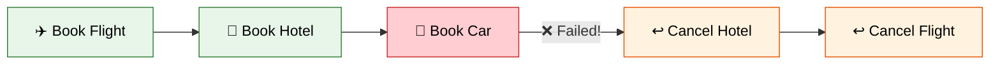
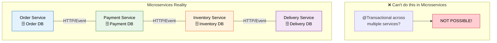
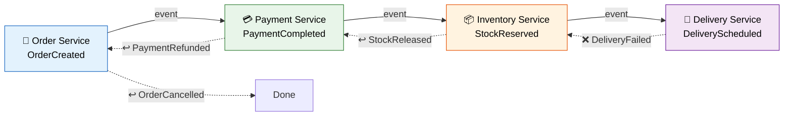
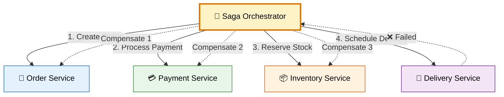
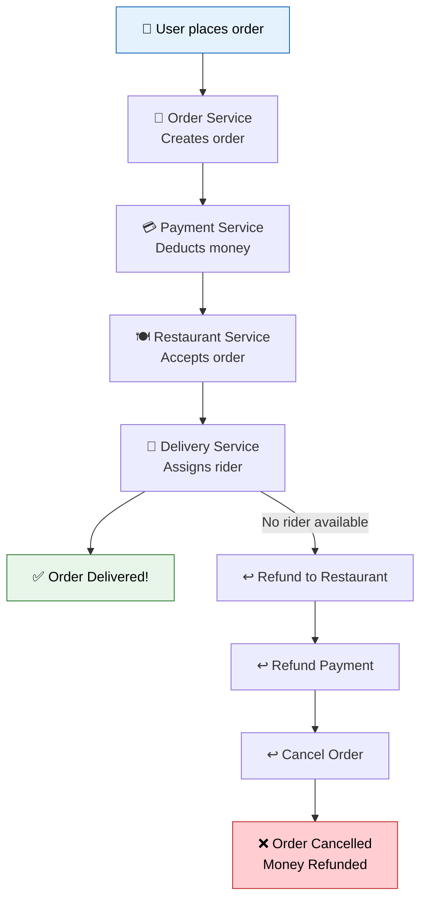

# 🎭 Saga Design Pattern

> **Manage distributed transactions across multiple microservices using a sequence of local transactions with compensating actions for rollback.**

---

!!! abstract "Real-World Analogy"
    Think of **booking a vacation** — you book a flight, then a hotel, then a car rental. If the car rental fails (no cars available), you need to **cancel the hotel** and **cancel the flight** (compensating transactions). Each booking is a separate service, and there's no single "undo all" button. The Saga pattern coordinates this sequence.



---

## ❓ The Problem

In a monolith, you have one database and one transaction:

```java
@Transactional  // One atomic transaction — either ALL succeed or ALL rollback
public void placeOrder(Order order) {
    orderRepository.save(order);         // 1. Save order
    paymentService.charge(order);        // 2. Charge payment
    inventoryService.reserve(order);     // 3. Reserve stock
    deliveryService.schedule(order);     // 4. Schedule delivery
}
```

In microservices, **each service has its own database** — there's no single `@Transactional` that spans multiple services.



---

## ✅ The Solution: Saga Pattern

A Saga is a sequence of **local transactions**. Each local transaction updates its own database and triggers the next step. If any step fails, **compensating transactions** are executed to undo previous steps.

---

## 📐 Two Implementation Approaches

### 1. Choreography (Event-Based)

Each service listens for events and reacts — no central coordinator.



```java
// Order Service — publishes event
@Service
public class OrderService {
    
    @Autowired private KafkaTemplate<String, OrderEvent> kafkaTemplate;
    
    @Transactional
    public Order createOrder(OrderRequest request) {
        Order order = orderRepository.save(new Order(request));
        kafkaTemplate.send("order-events", new OrderCreatedEvent(order.getId(), order.getAmount()));
        return order;
    }
    
    @KafkaListener(topics = "payment-events")
    public void handlePaymentFailed(PaymentFailedEvent event) {
        // Compensating transaction
        orderRepository.updateStatus(event.getOrderId(), OrderStatus.CANCELLED);
    }
}

// Payment Service — listens and reacts
@Service
public class PaymentService {
    
    @KafkaListener(topics = "order-events")
    public void handleOrderCreated(OrderCreatedEvent event) {
        try {
            Payment payment = processPayment(event.getOrderId(), event.getAmount());
            kafkaTemplate.send("payment-events", new PaymentCompletedEvent(event.getOrderId()));
        } catch (PaymentException e) {
            kafkaTemplate.send("payment-events", new PaymentFailedEvent(event.getOrderId()));
        }
    }
}
```

### 2. Orchestration (Central Coordinator)

A single **Saga Orchestrator** tells each service what to do and handles failures.



```java
// Saga Orchestrator
@Service
public class OrderSagaOrchestrator {

    public void executeSaga(OrderRequest request) {
        String orderId = null;
        String paymentId = null;
        String reservationId = null;
        
        try {
            // Step 1: Create Order
            orderId = orderService.createOrder(request);
            
            // Step 2: Process Payment
            paymentId = paymentService.processPayment(orderId, request.getAmount());
            
            // Step 3: Reserve Inventory
            reservationId = inventoryService.reserveStock(orderId, request.getItems());
            
            // Step 4: Schedule Delivery
            deliveryService.scheduleDelivery(orderId, request.getAddress());
            
        } catch (Exception e) {
            // Compensating transactions (reverse order)
            compensate(orderId, paymentId, reservationId);
        }
    }
    
    private void compensate(String orderId, String paymentId, String reservationId) {
        if (reservationId != null) inventoryService.releaseStock(reservationId);
        if (paymentId != null) paymentService.refundPayment(paymentId);
        if (orderId != null) orderService.cancelOrder(orderId);
    }
}
```

---

## ⚖️ Choreography vs Orchestration

| Aspect | Choreography | Orchestration |
|--------|-------------|---------------|
| **Coordinator** | None — services react to events | Central orchestrator |
| **Coupling** | Loose — services don't know each other | Orchestrator knows all services |
| **Complexity** | Hard to track (distributed logic) | Easy to understand (centralized) |
| **Single point of failure** | No | Yes (orchestrator) |
| **Best for** | Simple workflows (3-4 steps) | Complex workflows (5+ steps) |
| **Debugging** | Harder (trace events) | Easier (single place) |
| **Technology** | Kafka, RabbitMQ events | State machine, workflow engine |

---

## 🍕 Real Example: Swiggy/Zomato Order Flow



---

## 🎯 Interview Questions

??? question "1. What is the Saga pattern and why is it needed?"
    Saga manages distributed transactions in microservices where each service has its own database. Since you can't use a single ACID transaction across services, Saga uses a sequence of local transactions with compensating actions for rollback.

??? question "2. Choreography vs Orchestration — when to use which?"
    **Choreography**: simple flows (2-4 steps), high independence needed, no single point of failure desired. **Orchestration**: complex flows (5+ steps), need clear visibility, complex compensation logic.

??? question "3. What are compensating transactions?"
    Actions that semantically undo the effect of a previous transaction. E.g., if payment was charged, the compensating transaction is a refund. They don't literally "rollback" — they create a new transaction that reverses the business effect.

??? question "4. What happens if a compensating transaction fails?"
    This is a critical edge case. Solutions: retry with exponential backoff, store in a dead letter queue for manual intervention, or use idempotent operations so retries are safe.

??? question "5. How does Saga ensure data consistency?"
    Saga provides **eventual consistency**, not strong consistency. At any point during execution, data across services may be temporarily inconsistent. The system eventually reaches a consistent state when the saga completes (either all steps succeed or all compensations execute).

??? question "6. What frameworks support Saga in Java?"
    Axon Framework, MicroProfile LRA, Eventuate Tram, Temporal.io, and custom implementations using Kafka + state machines.

---

!!! warning "Key Pitfall"
    Sagas do NOT provide isolation (the "I" in ACID). During execution, intermediate results are visible to other transactions. Handle this with semantic locks, commutative updates, or pessimistic views.
