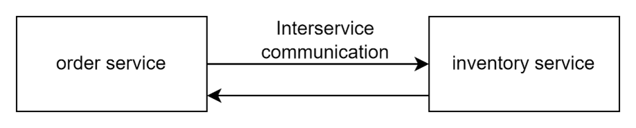
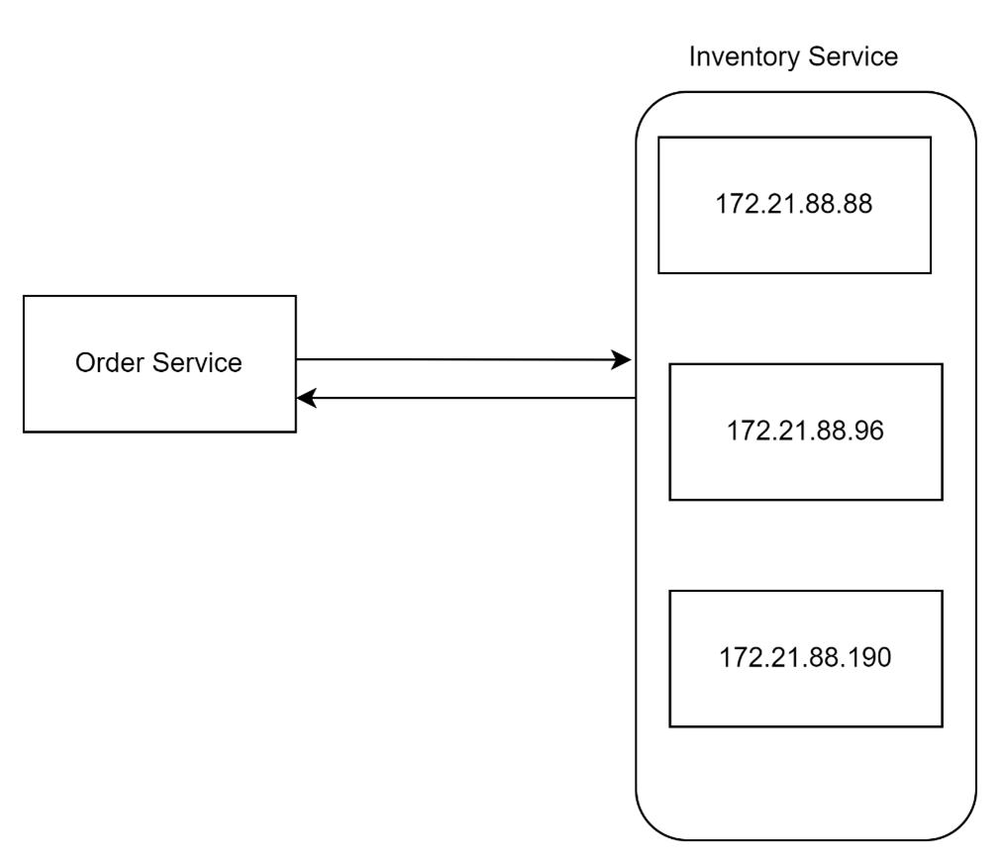
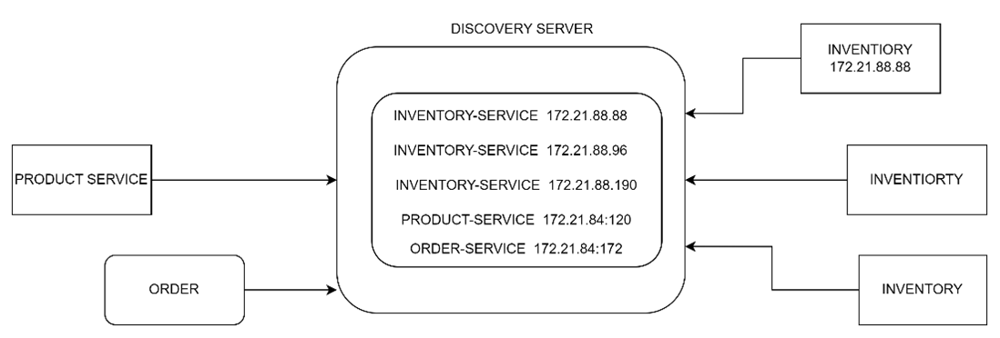

SERVICE DISCOVERY AND SERVICE REGISTRY:

- In the current development, the **Order service** is having inter service communication with **Inventory Service.**

- In the production development, every microservice will be deployed on cloud env.
- We cannot hardcode the ipAddress and the port details as they are dynamic and also we will have multiple instances of the same service.

- In this case how my order service will know to which instance of the inventory service it needs to send the request.
- If I hard code one of the Ip and port of one of the instance but that instance can go down.
- Order Service should know that particular instance is down and should call the other instance.
- For this we have a pattern called **Service Discovery and Registry**.

- In service discovery / Discovery service which will store the service name and the ip Address.
- First At the start of the App /Service they will register with the discovery server by making a request.
- Whenever they make a request, the server will add the details into its local copy.

STEPS:

1. Create a discovery service.
2. Add the dependency in the pom.xml
3. spring-cloud-starter-netflix-eureka-server
4. Add the annotation @EnableEurekaServer.
5. Add the properties in yml file. 

         eureka:
           instance:
             hostname: localhost
               client:
                 register-with-eureka: false
                   fetch-registry: false

         server:
           port: 8761

6.In the micro service (client) add the dependency .
  spring-cloud-starter-netflix-eureka-client.
7.Add the annotation 
  @EnableEurekaServer – spring boot 2
  @EnableDiscoveryServer – spring boot 3

     eureka:
       client:
         service-url:
           defaultZone: http://localhost:8761/eureka
             register-with-eureka: true
               fetch-registry: true
                 enabled: true
