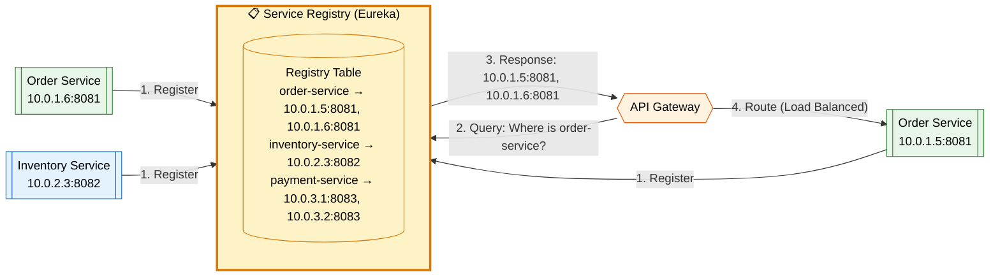
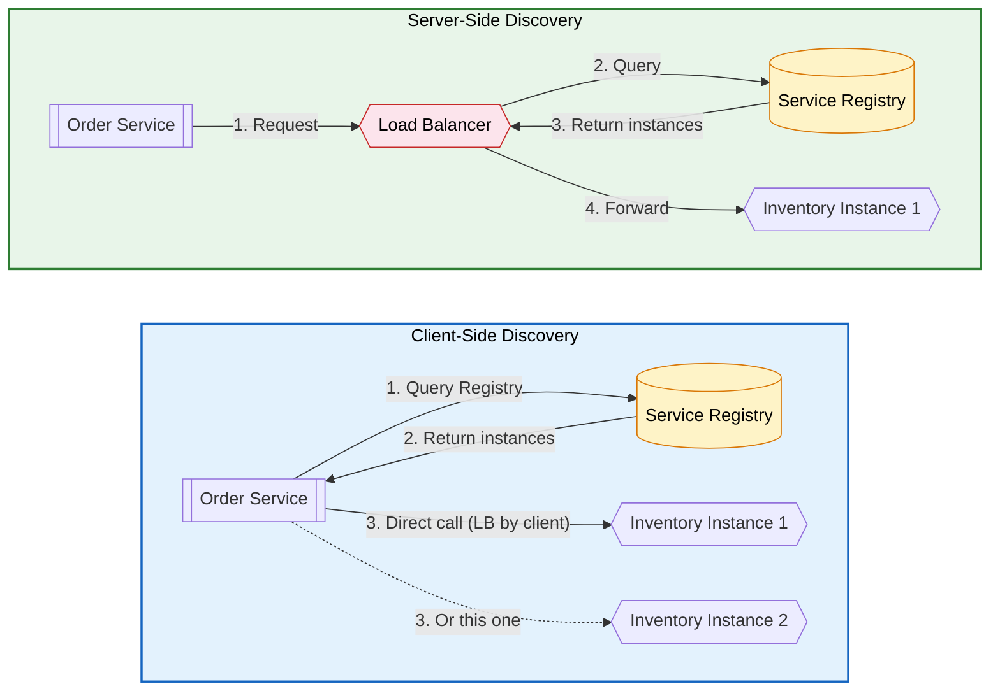
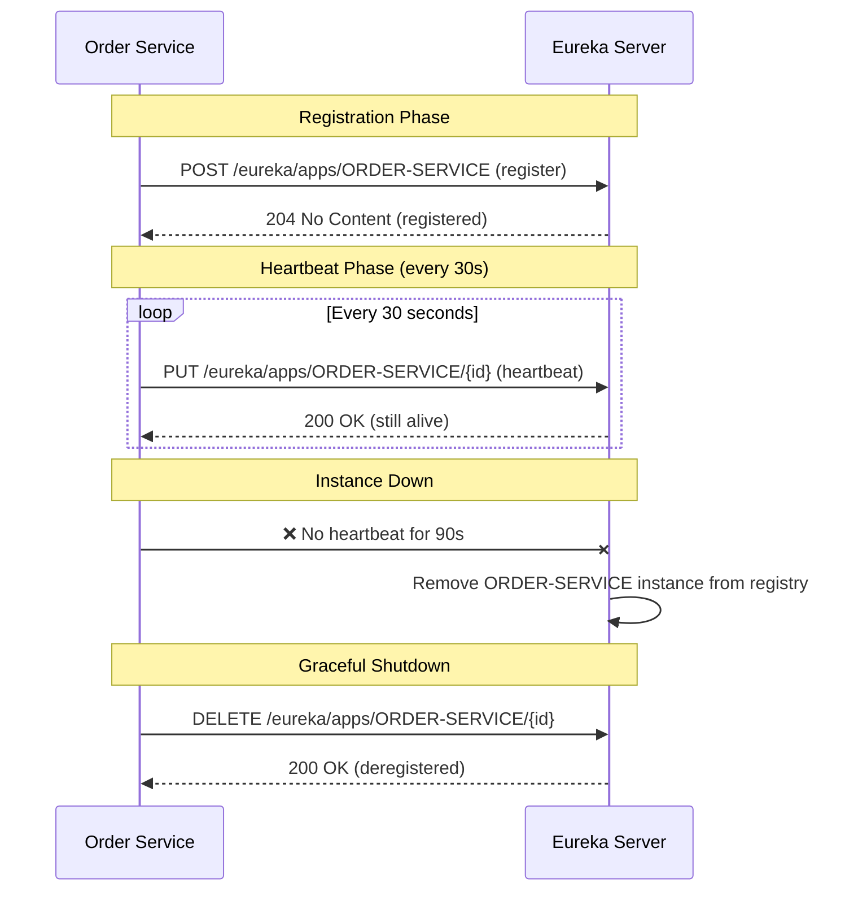

# 📋 Service Discovery & Registry

> **A mechanism that allows microservices to find and communicate with each other dynamically without hardcoded addresses.**

---

!!! abstract "Real-World Analogy"
    Think of a **phone directory (Yellow Pages)**. When you want to call a plumber, you don't memorize their phone number. You look them up in the directory by name, get their current number, and call them. If they change their number, they update the directory — you still find them by name. Service Discovery is the phone directory for microservices.


```mermaid
flowchart LR
    subgraph Discovery["📋 Service Registry (Eureka)"]
        REG[("Registry Table<br/>order-service → 10.0.1.5:8081, 10.0.1.6:8081<br/>inventory-service → 10.0.2.3:8082<br/>payment-service → 10.0.3.1:8083, 10.0.3.2:8083")]
    end
    
    S1[["Order Service<br/>10.0.1.5:8081"]] -->|"1. Register"| Discovery
    S2[["Order Service<br/>10.0.1.6:8081"]] -->|"1. Register"| Discovery
    S3[["Inventory Service<br/>10.0.2.3:8082"]] -->|"1. Register"| Discovery
    
    GW{{"API Gateway"}} -->|"2. Query: Where is order-service?"| Discovery
    Discovery -->|"3. Response: 10.0.1.5:8081, 10.0.1.6:8081"| GW
    GW -->|"4. Route (Load Balanced)"| S1
    
    style Discovery fill:#FEF3C7,stroke:#D97706,stroke-width:3px,color:#000
    style REG fill:#FEF3C7,stroke:#D97706,color:#000
    style S1 fill:#E8F5E9,stroke:#2E7D32,color:#000
    style S2 fill:#E8F5E9,stroke:#2E7D32,color:#000
    style S3 fill:#E3F2FD,stroke:#1565C0,color:#000
    style GW fill:#FFF3E0,stroke:#E65100,color:#000
```

---

## ❓ Why Do We Need Service Discovery?

In production microservices:

- Services run on **dynamic IPs** (cloud instances spin up/down)
- Multiple **instances** of the same service exist for scalability
- Instances **come and go** due to auto-scaling, deployments, or failures
- **Hardcoding URLs is impossible** — you can't update every caller when an IP changes

!!! warning "The Problem Without Service Discovery"
    ```
    // DON'T DO THIS - Hardcoded URLs
    String inventoryUrl = "http://192.168.1.45:8082/api/inventory";
    // What happens when:
    //   - Instance moves to a new IP?
    //   - You scale to 5 instances?
    //   - An instance goes down?
    ```

---

## 🔄 Client-Side vs Server-Side Discovery


```mermaid
flowchart LR
    subgraph ClientSide["Client-Side Discovery"]
        direction LR
        C1[["Order Service"]] -->|"1. Query Registry"| R1[("Service Registry")]
        R1 -->|"2. Return instances"| C1
        C1 -->|"3. Direct call (LB by client)"| I1{{"Inventory Instance 1"}}
        C1 -.->|"3. Or this one"| I2{{"Inventory Instance 2"}}
    end
    
    subgraph ServerSide["Server-Side Discovery"]
        direction LR
        C2[["Order Service"]] -->|"1. Request"| LB{{"Load Balancer"}}
        LB -->|"2. Query"| R2[("Service Registry")]
        R2 -->|"3. Return instances"| LB
        LB -->|"4. Forward"| I3{{"Inventory Instance 1"}}
    end
    
    style ClientSide fill:#E3F2FD,stroke:#1565C0,stroke-width:2px,color:#000
    style ServerSide fill:#E8F5E9,stroke:#2E7D32,stroke-width:2px,color:#000
    style R1 fill:#FEF3C7,stroke:#D97706,color:#000
    style R2 fill:#FEF3C7,stroke:#D97706,color:#000
    style LB fill:#FCE4EC,stroke:#C62828,color:#000
```

| Aspect | Client-Side | Server-Side |
|--------|------------|-------------|
| **How it works** | Client queries registry, picks instance | Load balancer queries registry, forwards |
| **Load Balancing** | Client-side (Ribbon/Spring Cloud LB) | Server-side (NGINX, AWS ALB) |
| **Examples** | Netflix Eureka + Ribbon | AWS ELB, Kubernetes Services |
| **Pros** | No extra hop, client controls LB strategy | Simple for client, centralized control |
| **Cons** | Couples client to registry | Extra network hop, single point of failure |

---

## 🏗️ Netflix Eureka Setup

### Eureka Server (Discovery Service)

=== "Dependencies (pom.xml)"

    ```xml
    <dependency>
        <groupId>org.springframework.cloud</groupId>
        <artifactId>spring-cloud-starter-netflix-eureka-server</artifactId>
    </dependency>
    ```

=== "Application Class"

    ```java
    @SpringBootApplication
    @EnableEurekaServer
    public class DiscoveryServerApplication {
        public static void main(String[] args) {
            SpringApplication.run(DiscoveryServerApplication.class, args);
        }
    }
    ```

=== "application.yml"

    ```yaml
    server:
      port: 8761

    spring:
      application:
        name: discovery-server

    eureka:
      instance:
        hostname: localhost
      client:
        register-with-eureka: false    # Don't register itself
        fetch-registry: false          # Don't fetch (it IS the registry)
      server:
        enable-self-preservation: true  # Don't evict during network partition
        eviction-interval-timer-in-ms: 5000
    ```

---

### Eureka Client (Microservice Registration)

=== "Dependencies (pom.xml)"

    ```xml
    <dependency>
        <groupId>org.springframework.cloud</groupId>
        <artifactId>spring-cloud-starter-netflix-eureka-client</artifactId>
    </dependency>
    ```

=== "Application Class"

    ```java
    @SpringBootApplication
    @EnableDiscoveryClient  // Spring Boot 3 — works with any discovery server
    public class OrderServiceApplication {
        public static void main(String[] args) {
            SpringApplication.run(OrderServiceApplication.class, args);
        }
    }
    ```

=== "application.yml"

    ```yaml
    spring:
      application:
        name: order-service  # This name is used for discovery

    server:
      port: 8081

    eureka:
      client:
        service-url:
          defaultZone: http://localhost:8761/eureka
        register-with-eureka: true
        fetch-registry: true
      instance:
        prefer-ip-address: true
        lease-renewal-interval-in-seconds: 30      # Heartbeat interval
        lease-expiration-duration-in-seconds: 90   # Time before eviction
    ```

---

## ❤️ Health Checks & Self-Registration


```mermaid
sequenceDiagram
    participant S as Order Service
    participant E as Eureka Server
    
    Note over S,E: Registration Phase
    S->>E: POST /eureka/apps/ORDER-SERVICE (register)
    E-->>S: 204 No Content (registered)
    
    Note over S,E: Heartbeat Phase (every 30s)
    loop Every 30 seconds
        S->>E: PUT /eureka/apps/ORDER-SERVICE/{id} (heartbeat)
        E-->>S: 200 OK (still alive)
    end
    
    Note over S,E: Instance Down
    S-xE: ❌ No heartbeat for 90s
    E->>E: Remove ORDER-SERVICE instance from registry
    
    Note over S,E: Graceful Shutdown
    S->>E: DELETE /eureka/apps/ORDER-SERVICE/{id}
    E-->>S: 200 OK (deregistered)
```

### Health Check Configuration

```yaml
eureka:
  instance:
    health-check-url-path: /actuator/health
    status-page-url-path: /actuator/info
    lease-renewal-interval-in-seconds: 30       # Send heartbeat every 30s
    lease-expiration-duration-in-seconds: 90    # Evict if no heartbeat for 90s

management:
  endpoints:
    web:
      exposure:
        include: health, info
  endpoint:
    health:
      show-details: always
```

!!! tip "Self-Preservation Mode"
    When Eureka detects that too many instances are losing heartbeats simultaneously (network partition), it enters **self-preservation mode** — it stops evicting instances. This prevents mass de-registration during temporary network issues. In development, you may want to disable this: `eureka.server.enable-self-preservation: false`.

---

## ⚖️ Load Balancing with Service Discovery

Once services are registered, use **Spring Cloud LoadBalancer** (replacement for Netflix Ribbon) to distribute calls across instances.

=== "Load-Balanced WebClient"

    ```java
    @Configuration
    public class WebClientConfig {
        
        @Bean
        @LoadBalanced  // Enables service name resolution
        public WebClient.Builder webClientBuilder() {
            return WebClient.builder();
        }
    }
    
    @Service
    public class OrderService {
        
        private final WebClient webClient;
        
        public OrderService(WebClient.Builder webClientBuilder) {
            this.webClient = webClientBuilder
                .baseUrl("http://inventory-service")  // Service name, NOT IP!
                .build();
        }
        
        public Boolean checkInventory(String skuCode) {
            return webClient.get()
                .uri("/api/inventory?skuCode=" + skuCode)
                .retrieve()
                .bodyToMono(Boolean.class)
                .block();
        }
    }
    ```

=== "Load-Balanced RestTemplate"

    ```java
    @Configuration
    public class RestTemplateConfig {
        
        @Bean
        @LoadBalanced
        public RestTemplate restTemplate() {
            return new RestTemplate();
        }
    }
    
    @Service
    public class OrderService {
        
        @Autowired
        private RestTemplate restTemplate;
        
        public Boolean checkInventory(String skuCode) {
            // Uses service name — resolved via Eureka
            return restTemplate.getForObject(
                "http://inventory-service/api/inventory?skuCode=" + skuCode,
                Boolean.class
            );
        }
    }
    ```

=== "Custom Load Balancer Strategy"

    ```java
    // Default is Round Robin. You can customize:
    @Configuration
    public class LoadBalancerConfig {
        
        @Bean
        public ServiceInstanceListSupplier discoveryClientServiceInstanceListSupplier(
                ConfigurableApplicationContext context) {
            return ServiceInstanceListSupplier.builder()
                .withDiscoveryClient()
                .withHealthChecks()         // Only route to healthy instances
                .withZonePreference()       // Prefer same-zone instances
                .withCaching()              // Cache results
                .build(context);
        }
    }
    ```

---

## 🌐 Service Discovery Alternatives

| Tool | Type | Best For |
|------|------|----------|
| **Netflix Eureka** | Client-side | Spring Cloud ecosystem |
| **Consul** (HashiCorp) | Both | Multi-datacenter, key-value store |
| **Kubernetes DNS** | Server-side | K8s-native applications |
| **AWS Cloud Map** | Server-side | AWS-native applications |
| **Zookeeper** | Client-side | Existing Hadoop/Kafka ecosystems |

!!! tip "In Kubernetes, You Don't Need Eureka"
    Kubernetes has built-in service discovery via **DNS and Services**. Each K8s Service gets a DNS name (e.g., `order-service.default.svc.cluster.local`). If you're on K8s, use native discovery instead of adding Eureka.

---

## 🎯 Interview Q&A

??? question "Q1: What is Service Discovery and why is it needed in microservices?"
    Service Discovery is a mechanism for services to find each other dynamically. It's needed because in cloud environments, service instances have dynamic IPs, scale up/down frequently, and can fail at any time. Hardcoding URLs is impossible — the registry provides a phone book that's always up to date.

??? question "Q2: Explain Client-Side vs Server-Side Discovery."
    **Client-side**: The client queries the registry, gets a list of instances, and picks one (using load balancing logic like Round Robin). Example: Eureka + Spring Cloud LoadBalancer. **Server-side**: The client sends requests to a load balancer/router that queries the registry and forwards the request. Example: Kubernetes Services, AWS ALB.

??? question "Q3: How does Eureka handle instance failures?"
    Each registered service sends **heartbeats** every 30 seconds. If Eureka doesn't receive a heartbeat for 90 seconds (configurable), it removes the instance from the registry. Clients that cache the registry will eventually refresh and stop calling the dead instance.

??? question "Q4: What is Eureka's Self-Preservation mode?"
    When more than 15% of instances miss heartbeats simultaneously, Eureka assumes it's a **network partition** (not actual failures) and stops evicting instances. This prevents mass de-registration during network issues. It's a safety net — better to have stale entries than an empty registry.

??? question "Q5: How does @LoadBalanced work with RestTemplate/WebClient?"
    The `@LoadBalanced` annotation adds an interceptor that resolves service names (like `http://inventory-service`) into actual IP:port using the service registry. It uses Spring Cloud LoadBalancer (default: Round Robin) to pick one instance from the available list.

??? question "Q6: What happens if the Eureka server goes down?"
    Clients **cache** the registry locally. Even if Eureka is temporarily unavailable, services can still communicate using cached data. For production, run multiple Eureka instances (peer-aware) that replicate registrations between them.

??? question "Q7: Eureka vs Consul vs Kubernetes DNS — when to use each?"
    **Eureka**: Pure Spring Cloud ecosystem, simple setup. **Consul**: Multi-datacenter, need key-value store + health checking + service mesh. **K8s DNS**: Already running on Kubernetes — use native discovery, no extra infrastructure needed.

---

## Related Topics

- [API Gateway](APIGATEWAY.md) — Uses service discovery for routing
- [Inter-Service Communication](InterServiceCommunication.md) — How services call each other
- [Circuit Breaker](CircuitBreaker.md) — Handling failed service calls
- [Containerization](containerization.md) — Kubernetes native discovery
