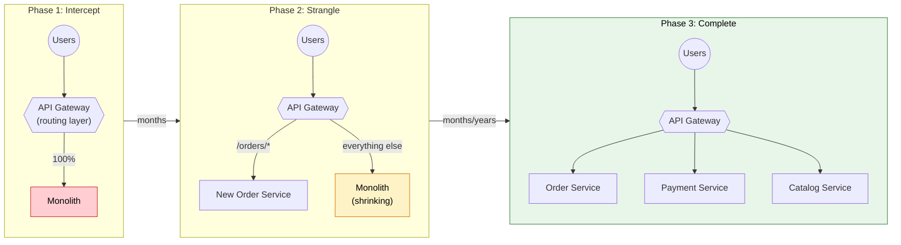
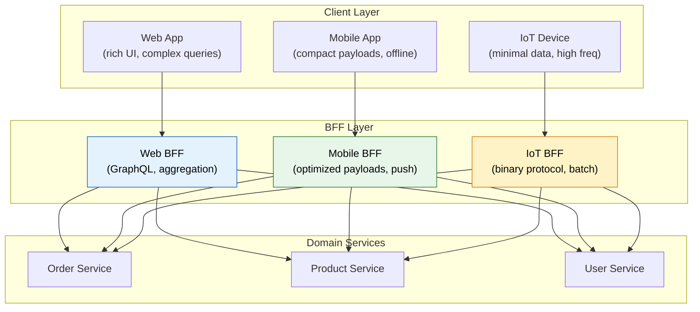
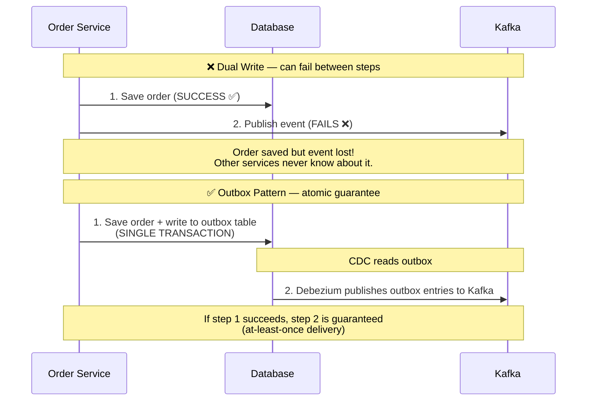
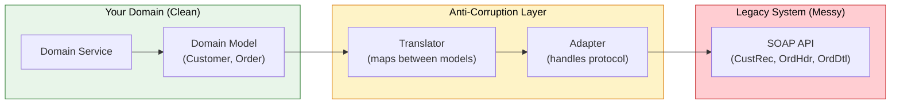
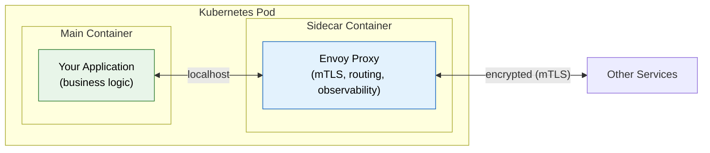
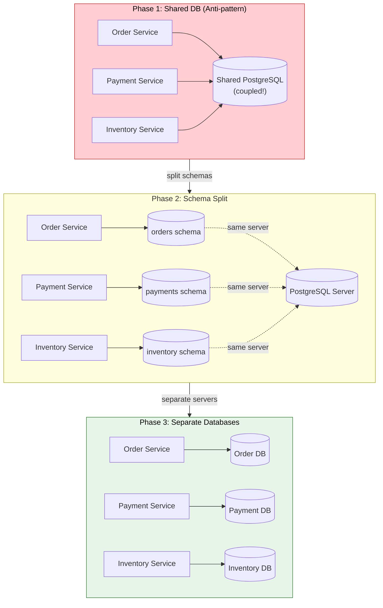

# Advanced Microservices Patterns

> **Beyond the basics — patterns that solve real problems in production distributed systems.**

---

!!! abstract "Real-World Analogy"
    These patterns are like **surgical techniques**. A general practitioner knows basic procedures, but a specialist knows when to use a particular technique, why it works, and what complications to watch for. Knowing these patterns separates senior architects from developers who just split code into services.

---

## Strangler Fig Pattern

### The Problem

You have a legacy monolith that can't be rewritten overnight. Business can't stop while you rebuild. You need to migrate incrementally without downtime.

!!! info "Origin of the Name"
    Named after the strangler fig tree, which grows around a host tree, eventually replacing it entirely while the host continues to live during the process. Coined by Martin Fowler.

### How It Works



### Implementation with Feature Flags

```java
@RestController
public class OrderController {

    private final LegacyOrderService legacyService;
    private final NewOrderService newService;
    private final FeatureFlagService flags;

    @PostMapping("/orders")
    public ResponseEntity<Order> createOrder(@RequestBody OrderRequest request) {
        if (flags.isEnabled("new-order-service", request.getRegion())) {
            return ResponseEntity.ok(newService.create(request));
        }
        return ResponseEntity.ok(legacyService.create(request));
    }
}
```

### When to Use vs Big-Bang Rewrite

| Criterion | Strangler Fig | Big-Bang Rewrite |
|-----------|--------------|-----------------|
| Risk tolerance | Low | Very high |
| Timeline | Months to years | Months (if it works) |
| Business continuity | Yes — always running | Requires feature freeze |
| Team size needed | Same team, incremental | Large team, parallel work |
| Success rate | High (~80%) | Low (~30%) |
| Best for | Critical systems, gradual improvement | Small apps, well-understood domains |

!!! danger "The Shared Database Trap"
    During migration, both the old monolith and new services often need the same data. Resist the temptation to share the database directly. Instead: use database views, CDC (Change Data Capture), or API calls to keep them decoupled. A shared database creates invisible coupling that defeats the purpose of extraction.

---

## Backends for Frontends (BFF)

### The Problem

A mobile app needs compact payloads and offline support. A web app needs rich data for complex UIs. An IoT device needs minimal data at high frequency. One API can't serve all three well.



### What Goes in a BFF

| BFF Responsibility | Domain Service Responsibility |
|-------------------|------------------------------|
| Response shaping (fields needed by this client) | Business logic |
| Aggregation (combining data from multiple services) | Data persistence |
| Client-specific auth (OAuth flows differ per platform) | Domain rules/validation |
| Caching strategy tuned to client patterns | Event publishing |
| Protocol translation (REST → GraphQL) | Core data model |

!!! warning "Anti-Pattern: Fat BFF"
    If your BFF contains business logic, validation rules, or data transformations that other BFFs also need, you've accidentally created a new monolith. BFFs should only contain **client-specific** concerns — formatting, aggregation, protocol translation.

### GraphQL as BFF Alternative

```java
// Instead of separate BFF services, one GraphQL layer
// lets each client request exactly what it needs
@QueryMapping
public Order order(@Argument Long id, DataFetchingEnvironment env) {
    Order order = orderService.findById(id);
    // GraphQL automatically resolves only requested fields
    // Mobile: { order { id, status } }           → 2 fields
    // Web:    { order { id, status, items, customer, timeline } } → many fields
    return order;
}
```

---

## Transactional Outbox Pattern

### The Dual-Write Problem



### Implementation

```sql
-- Outbox table
CREATE TABLE outbox_events (
    id UUID PRIMARY KEY,
    aggregate_type VARCHAR(255) NOT NULL,   -- e.g., 'Order'
    aggregate_id VARCHAR(255) NOT NULL,      -- e.g., order ID
    event_type VARCHAR(255) NOT NULL,        -- e.g., 'OrderCreated'
    payload JSONB NOT NULL,                  -- event data
    created_at TIMESTAMP DEFAULT NOW(),
    published BOOLEAN DEFAULT FALSE
);
```

```java
@Service
@RequiredArgsConstructor
public class OrderService {

    private final OrderRepository orderRepo;
    private final OutboxRepository outboxRepo;

    @Transactional  // single transaction for both writes!
    public Order createOrder(OrderRequest request) {
        Order order = orderRepo.save(new Order(request));

        outboxRepo.save(OutboxEvent.builder()
            .aggregateType("Order")
            .aggregateId(order.getId().toString())
            .eventType("OrderCreated")
            .payload(toJson(new OrderCreatedEvent(order)))
            .build());

        return order;
    }
}
// Debezium CDC connector reads the outbox table and publishes to Kafka
```

### Comparison: Outbox vs Alternatives

| Approach | Consistency | Complexity | Performance | Best For |
|----------|-------------|------------|-------------|----------|
| Outbox + CDC | At-least-once guaranteed | Medium | Good | Most use cases |
| Saga (orchestration) | Eventual, compensating | High | OK | Multi-service transactions |
| Event Sourcing | Strong (events are source of truth) | Very High | Good (reads via projections) | Audit-critical domains |
| Two-Phase Commit (2PC) | Strong | Low | Poor (blocking) | Rarely — avoid in microservices |

---

## Anti-Corruption Layer (ACL)

### The Problem

You're integrating with a legacy system (or third-party API) whose model doesn't match your domain. Without a boundary, their messy model leaks into your clean code.



### Implementation

```java
// Your clean domain model
public record Customer(String id, String fullName, String email, Address address) {}

// Legacy system returns this mess
// { "CUST_REC": { "CUST_NM_FIRST": "JOHN", "CUST_NM_LAST": "DOE", "CUST_EMAIL_ADDR": "..." } }

// Anti-Corruption Layer translates
@Component
public class CustomerAcl {

    private final LegacySoapClient legacyClient;

    public Customer findCustomer(String customerId) {
        CustRec legacy = legacyClient.getCustRec(customerId);  // legacy model

        // Translate to YOUR domain model — legacy naming/structure stays here
        return new Customer(
            legacy.getCustId(),
            legacy.getCustNmFirst() + " " + legacy.getCustNmLast(),
            legacy.getCustEmailAddr(),
            mapAddress(legacy.getAddrRec())
        );
    }
}
```

!!! tip "When to Use ACL"
    - Integrating with legacy mainframes or SOAP services
    - Wrapping a third-party API that may change its model
    - During Strangler Fig migration (new services talk to old system via ACL)
    - Bounded Context boundaries in DDD

---

## Sidecar Pattern

### What Runs in a Sidecar



### Common Sidecar Use Cases

| Sidecar Type | Responsibility | Examples |
|-------------|----------------|----------|
| **Service Mesh Proxy** | mTLS, load balancing, circuit breaking | Envoy (Istio), Linkerd-proxy |
| **Log Collector** | Ship logs to central system | Fluentd, Filebeat |
| **Auth Proxy** | Token validation, OAuth flow | OAuth2-proxy, OPA |
| **Config Watcher** | Reload config without restart | Consul-template, Vault agent |
| **Health Reporter** | Custom health checks | Custom scripts |

### Performance Impact

| Metric | Without Sidecar | With Envoy Sidecar | Overhead |
|--------|----------------|-------------------|----------|
| Latency (p50) | 2ms | 2.5ms | +0.5ms |
| Latency (p99) | 15ms | 17ms | +2ms |
| Memory per pod | 128MB | 168MB | +40MB |
| CPU per pod | 100m | 130m | +30m |

!!! info "When to Accept the Overhead"
    The sidecar adds ~0.5-2ms latency per hop. For most APIs (p99 < 100ms), this is negligible. For ultra-low-latency paths (high-frequency trading, real-time gaming), consider library-based alternatives (e.g., gRPC with in-process interceptors).

---

## Database per Service — Migration Strategies

### Phase 1: Shared Database (Starting Point)



### Handling Cross-Service Queries

| Pattern | How It Works | Best For |
|---------|-------------|----------|
| **API Composition** | Service A calls Service B's API to get data | Simple joins, low volume |
| **CQRS** | Maintain a denormalized read model updated by events | Complex queries, high read volume |
| **Data Replication** | Sync subset of data via events to local read-only copy | Latency-sensitive reads |
| **Materialized View** | Database-level view combining data from event stream | Reporting, analytics |

---

## Bulkhead Pattern (Advanced)

### Isolation Levels

```java
// Thread Pool Bulkhead — each dependency gets its own pool
@Bean
public ThreadPoolBulkheadConfig paymentBulkhead() {
    return ThreadPoolBulkheadConfig.custom()
        .maxThreadPoolSize(10)      // max 10 concurrent calls to payment
        .coreThreadPoolSize(5)
        .queueCapacity(20)          // queue 20 more before rejecting
        .build();
}

// Semaphore Bulkhead — lighter weight, no separate thread
@Bean
public BulkheadConfig inventoryBulkhead() {
    return BulkheadConfig.custom()
        .maxConcurrentCalls(15)     // max 15 concurrent calls
        .maxWaitDuration(Duration.ofMillis(500))  // wait 500ms for permit
        .build();
}
```

### Thread Pool vs Semaphore

| Aspect | Thread Pool Bulkhead | Semaphore Bulkhead |
|--------|---------------------|-------------------|
| Isolation | Full (separate threads) | Partial (same thread, limited concurrency) |
| Timeout support | Yes (thread can be interrupted) | No (relies on downstream timeout) |
| Overhead | Higher (context switching, memory) | Lower (just a counter) |
| Best for | Untrusted dependencies, long calls | Trusted dependencies, fast calls |
| Resilience4j default | — | Semaphore (lightweight) |

---

## Pattern Decision Matrix

| Problem | Pattern | Complexity | When to Use | Alternatives |
|---------|---------|------------|-------------|--------------|
| Migrate monolith without downtime | Strangler Fig | Medium | Critical systems, gradual migration | Big-bang rewrite (risky) |
| Multiple client types need different APIs | BFF | Medium | Mobile + Web + IoT clients | GraphQL single API |
| Guarantee event delivery with DB write | Transactional Outbox | Medium | Any service publishing events | Saga, Event Sourcing |
| Integrate with legacy/third-party | Anti-Corruption Layer | Low-Medium | Messy external models | Direct integration (leaks model) |
| Cross-cutting concerns (auth, logging) | Sidecar | Medium | Service mesh, Kubernetes | Library-based (in-process) |
| Database coupling between services | Database per Service | High | Independent deployability | Shared DB (simpler, coupled) |
| Prevent cascading failures | Bulkhead | Low-Medium | Multiple external dependencies | Circuit Breaker alone |

---

## Interview Quick Reference

??? question "When would you use the Strangler Fig pattern vs a rewrite?"

    **Answer:** Strangler Fig when: the system is critical (can't afford downtime), the team is small (can't staff a parallel rewrite), and domain knowledge is embedded in the legacy code (need to learn as you migrate). Rewrite when: the codebase is small, well-understood, and the new technology is fundamentally incompatible with incremental migration.

??? question "What's the dual-write problem and how does the Outbox pattern solve it?"

    **Answer:** Dual-write: when a service needs to update its database AND publish an event, there's no atomic way to do both across different systems. If the DB write succeeds but the event publish fails, your system is inconsistent. The Outbox pattern solves this by writing the event to an outbox table in the SAME database transaction as the business data. A separate process (CDC/Debezium) then reliably publishes those outbox entries to the message broker, guaranteeing at-least-once delivery.

??? question "How do you decide between Thread Pool and Semaphore bulkheads?"

    **Answer:** Thread Pool when calling untrusted or slow dependencies — you get true isolation (caller thread isn't blocked) and timeout support. Semaphore when calling trusted internal services with predictable latency — lower overhead, simpler, and good enough when you trust the downstream timeout configuration. Default to Semaphore unless you have evidence that thread pool isolation is needed.
