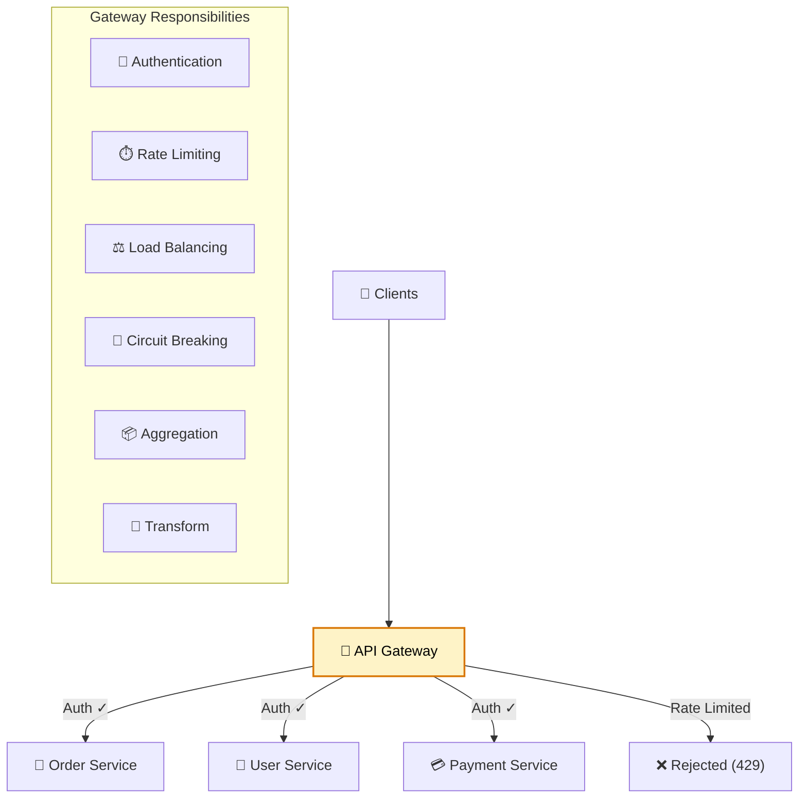

# 🚪 API Gateway Patterns (Advanced)

> **Beyond basic routing — rate limiting, authentication, request aggregation, and production-grade gateway configuration with Spring Cloud Gateway.**

---

!!! abstract "Real-World Analogy"
    Think of a **hotel concierge**. Guests don't directly contact the chef, housekeeping, or valet separately. The concierge handles all requests — authenticating guests (key card), routing to the right department, combining responses ("your room is ready AND your car is parked"), and throttling excessive requests ("sir, one call at a time").



---

## 🏗️ Spring Cloud Gateway Configuration

### Route Configuration

```yaml
spring:
  cloud:
    gateway:
      routes:
        - id: order-service
          uri: lb://order-service
          predicates:
            - Path=/api/orders/**
            - Method=GET,POST,PUT
          filters:
            - StripPrefix=1
            - AddRequestHeader=X-Gateway-Source, spring-cloud-gateway
            - name: CircuitBreaker
              args:
                name: orderCircuitBreaker
                fallbackUri: forward:/fallback/orders

        - id: user-service
          uri: lb://user-service
          predicates:
            - Path=/api/users/**
            - Header=X-Api-Version, v[2-9]  # Only v2+
          filters:
            - StripPrefix=1
            - name: RequestRateLimiter
              args:
                redis-rate-limiter.replenishRate: 100
                redis-rate-limiter.burstCapacity: 200
                key-resolver: "#{@userKeyResolver}"
```

---

## ⏱️ Rate Limiting

### Redis-Based Rate Limiter

```java
@Configuration
public class RateLimitConfig {

    @Bean
    public KeyResolver userKeyResolver() {
        return exchange -> Mono.justOrEmpty(
            exchange.getRequest().getHeaders().getFirst("X-User-Id"))
            .defaultIfEmpty("anonymous");
    }

    @Bean
    public KeyResolver ipKeyResolver() {
        return exchange -> Mono.just(
            Objects.requireNonNull(exchange.getRequest().getRemoteAddress())
                .getAddress().getHostAddress());
    }
}
```

```yaml
spring:
  cloud:
    gateway:
      routes:
        - id: public-api
          uri: lb://public-service
          predicates:
            - Path=/api/public/**
          filters:
            - name: RequestRateLimiter
              args:
                redis-rate-limiter.replenishRate: 10    # 10 requests/second
                redis-rate-limiter.burstCapacity: 20    # Allow burst up to 20
                redis-rate-limiter.requestedTokens: 1   # 1 token per request
                key-resolver: "#{@ipKeyResolver}"
```

### Custom Rate Limiter (Token Bucket)

```java
@Component
public class TieredRateLimiter implements RateLimiter<TieredRateLimiter.Config> {

    private final ReactiveRedisTemplate<String, String> redis;

    @Override
    public Mono<Response> isAllowed(String routeId, String id) {
        return getUserTier(id).flatMap(tier -> {
            int limit = switch (tier) {
                case "PREMIUM" -> 1000;
                case "STANDARD" -> 100;
                default -> 10;
            };
            return checkLimit(id, limit);
        });
    }
}
```

---

## 🔐 Authentication Filter

```java
@Component
public class JwtAuthenticationFilter implements GatewayFilterFactory<JwtAuthenticationFilter.Config> {

    private final JwtTokenProvider tokenProvider;

    @Override
    public GatewayFilter apply(Config config) {
        return (exchange, chain) -> {
            String token = extractToken(exchange.getRequest());

            if (token == null) {
                exchange.getResponse().setStatusCode(HttpStatus.UNAUTHORIZED);
                return exchange.getResponse().setComplete();
            }

            try {
                Claims claims = tokenProvider.validateToken(token);

                // Add user info to headers for downstream services
                ServerHttpRequest modifiedRequest = exchange.getRequest().mutate()
                    .header("X-User-Id", claims.getSubject())
                    .header("X-User-Roles", claims.get("roles", String.class))
                    .header("X-User-Email", claims.get("email", String.class))
                    .build();

                return chain.filter(exchange.mutate().request(modifiedRequest).build());
            } catch (JwtException e) {
                exchange.getResponse().setStatusCode(HttpStatus.UNAUTHORIZED);
                return exchange.getResponse().setComplete();
            }
        };
    }

    private String extractToken(ServerHttpRequest request) {
        String bearer = request.getHeaders().getFirst(HttpHeaders.AUTHORIZATION);
        if (bearer != null && bearer.startsWith("Bearer ")) {
            return bearer.substring(7);
        }
        return null;
    }
}
```

---

## 📦 Request Aggregation (BFF Pattern)

```java
@RestController
@RequiredArgsConstructor
public class OrderAggregationController {

    private final WebClient.Builder webClient;

    @GetMapping("/api/bff/order-details/{orderId}")
    public Mono<OrderDetailsBff> getOrderDetails(@PathVariable String orderId) {
        Mono<Order> orderMono = webClient.build()
            .get().uri("lb://order-service/api/orders/{id}", orderId)
            .retrieve().bodyToMono(Order.class);

        Mono<User> userMono = orderMono.flatMap(order ->
            webClient.build()
                .get().uri("lb://user-service/api/users/{id}", order.getUserId())
                .retrieve().bodyToMono(User.class));

        Mono<List<Product>> productsMono = orderMono.flatMap(order ->
            webClient.build()
                .get().uri("lb://product-service/api/products?ids={ids}",
                    String.join(",", order.getProductIds()))
                .retrieve().bodyToFlux(Product.class).collectList());

        return Mono.zip(orderMono, userMono, productsMono)
            .map(tuple -> new OrderDetailsBff(
                tuple.getT1(),
                tuple.getT2(),
                tuple.getT3()
            ));
    }
}
```

---

## 🔄 Request/Response Transformation

```java
@Component
public class ResponseTransformFilter implements GlobalFilter, Ordered {

    @Override
    public Mono<Void> filter(ServerWebExchange exchange, GatewayFilterChain chain) {
        return chain.filter(exchange).then(Mono.fromRunnable(() -> {
            ServerHttpResponse response = exchange.getResponse();

            // Add security headers
            response.getHeaders().add("X-Content-Type-Options", "nosniff");
            response.getHeaders().add("X-Frame-Options", "DENY");
            response.getHeaders().add("X-XSS-Protection", "1; mode=block");

            // Add correlation ID
            String correlationId = exchange.getRequest().getHeaders()
                .getFirst("X-Correlation-Id");
            if (correlationId != null) {
                response.getHeaders().add("X-Correlation-Id", correlationId);
            }
        }));
    }

    @Override
    public int getOrder() { return -1; }
}
```

---

## 🔌 Circuit Breaking at Gateway Level

```yaml
spring:
  cloud:
    gateway:
      routes:
        - id: payment-service
          uri: lb://payment-service
          predicates:
            - Path=/api/payments/**
          filters:
            - name: CircuitBreaker
              args:
                name: paymentCB
                fallbackUri: forward:/fallback/payments
            - name: Retry
              args:
                retries: 3
                statuses: BAD_GATEWAY, SERVICE_UNAVAILABLE
                methods: GET
                backoff:
                  firstBackoff: 100ms
                  maxBackoff: 500ms
                  factor: 2

resilience4j:
  circuitbreaker:
    configs:
      default:
        slidingWindowSize: 10
        failureRateThreshold: 50
        waitDurationInOpenState: 30s
```

```java
@RestController
public class FallbackController {

    @GetMapping("/fallback/payments")
    public ResponseEntity<Map<String, String>> paymentFallback() {
        return ResponseEntity.status(HttpStatus.SERVICE_UNAVAILABLE)
            .body(Map.of(
                "message", "Payment service is temporarily unavailable",
                "suggestion", "Please try again in a few moments"
            ));
    }
}
```

---

## 📊 Gateway Patterns Comparison

| Pattern | Description | Use Case |
|---|---|---|
| **Routing** | Direct traffic to correct service | All microservice architectures |
| **Aggregation** | Combine multiple service responses | Mobile/BFF clients needing combined data |
| **Rate Limiting** | Throttle excessive requests | Public APIs, DDoS protection |
| **Authentication** | Validate tokens at the edge | Centralized auth, remove auth from services |
| **Circuit Breaking** | Fail fast when service is down | Prevent cascade failures |
| **Request Transform** | Modify headers/body | Version migration, header injection |
| **Load Balancing** | Distribute across instances | High availability |
| **Caching** | Cache responses at edge | Reduce backend load |

---

## 🎯 Interview Questions

??? question "1. What is the API Gateway pattern and why is it needed?"
    A single entry point for all client requests. It handles cross-cutting concerns (auth, rate limiting, logging) so individual services don't have to. Benefits: simplified client code (one endpoint), centralized security, request aggregation for mobile clients, protocol translation, and canary routing.

??? question "2. How do you implement rate limiting at the gateway?"
    Use Redis-backed token bucket algorithm. Configure `RequestRateLimiter` filter with `replenishRate` (sustained rate), `burstCapacity` (max burst), and a `KeyResolver` (by user ID, IP, or API key). Different tiers get different limits. Return 429 with `Retry-After` header when exceeded.

??? question "3. What is the BFF (Backend for Frontend) pattern?"
    A specialized gateway layer per client type (mobile BFF, web BFF, third-party BFF). Each BFF aggregates and transforms data specifically for its client's needs. Mobile gets minimal payloads; web gets richer data. Prevents one-size-fits-all APIs that over-fetch or under-fetch.

??? question "4. How does authentication work at the gateway level?"
    Gateway validates JWT tokens and extracts claims (user ID, roles). It passes user context as headers to downstream services. Services trust the gateway (internal network) and use headers for authorization. Benefits: services don't need JWT libraries, token validation happens once, easy to swap auth providers.

??? question "5. Gateway vs Service Mesh — what's the difference?"
    **API Gateway**: edge proxy, client-facing, handles north-south traffic (external → internal). **Service Mesh**: internal proxy, handles east-west traffic (service → service). Use both: gateway for external clients + rate limiting; mesh for internal mTLS + observability. They complement, not replace, each other.
