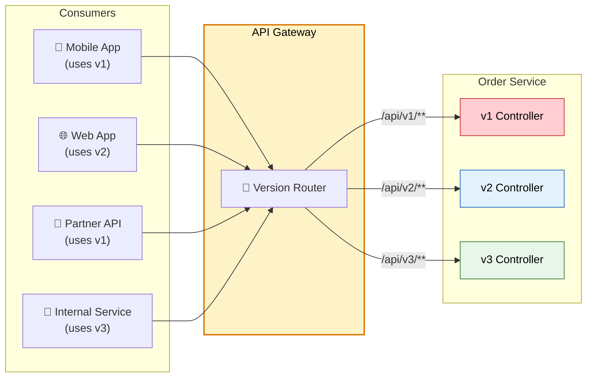
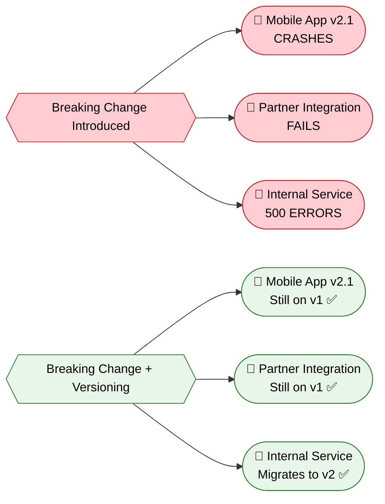
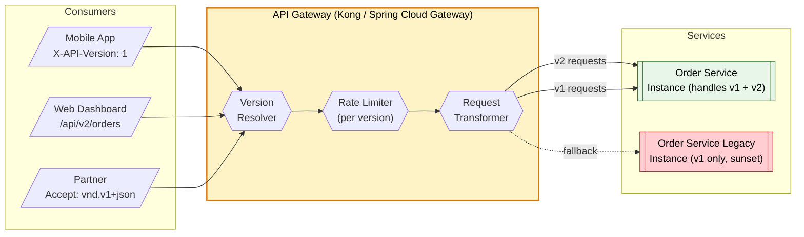
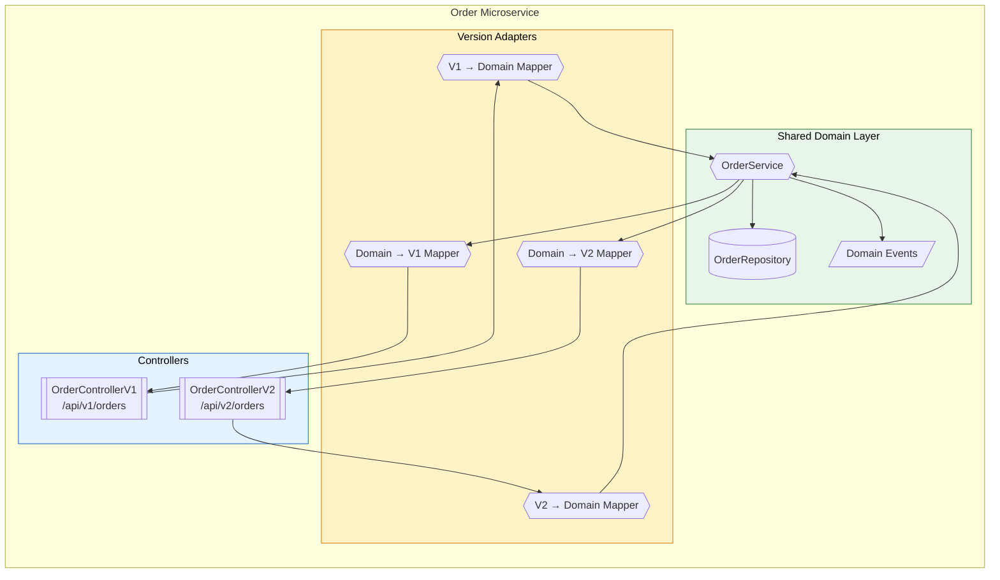

# 🔢 API Versioning Strategies

> **Evolve your microservice APIs without breaking existing consumers — using URI paths, headers, query params, and content negotiation to manage multiple API versions simultaneously.**

---

!!! abstract "Real-World Analogy"
    Think of a **power outlet standard**. When a country upgrades from 2-pin to 3-pin sockets (v2), they can't rip out all 2-pin outlets overnight — millions of devices still use them. So they run both standards in parallel, put adapters in place, and announce a sunset date for the old format. API versioning works the same way: new capabilities ship in v2 while v1 remains available for existing consumers until they migrate.



---

## 🤔 Why API Versioning Is Needed

| Scenario | Problem Without Versioning |
|---|---|
| Adding required fields | Existing consumers break instantly |
| Changing response structure | Mobile apps crash on unexpected JSON |
| Removing deprecated endpoints | Partner integrations fail silently |
| Different consumer cadences | Not all teams can upgrade simultaneously |
| Regulatory/compliance | Some consumers legally locked to old contracts |

**Key Principle**: Once an API is published and consumed, it becomes a **contract**. Breaking that contract breaks trust and uptime.



---

## 1️⃣ URI Path Versioning

The most common and visible approach — the version is embedded in the URL path.

```
GET /api/v1/orders/12345
GET /api/v2/orders/12345
```

### Spring Boot Implementation

```java
// ===== V1 Controller =====
@RestController
@RequestMapping("/api/v1/orders")
public class OrderControllerV1 {

    private final OrderService orderService;

    public OrderControllerV1(OrderService orderService) {
        this.orderService = orderService;
    }

    @GetMapping("/{orderId}")
    public ResponseEntity<OrderResponseV1> getOrder(@PathVariable String orderId) {
        Order order = orderService.findById(orderId);
        return ResponseEntity.ok(OrderResponseV1.from(order));
    }

    @PostMapping
    public ResponseEntity<OrderResponseV1> createOrder(@Valid @RequestBody CreateOrderRequestV1 request) {
        Order order = orderService.create(request.toCommand());
        URI location = URI.create("/api/v1/orders/" + order.getId());
        return ResponseEntity.created(location).body(OrderResponseV1.from(order));
    }
}

// ===== V2 Controller (adds pagination, enriched response) =====
@RestController
@RequestMapping("/api/v2/orders")
public class OrderControllerV2 {

    private final OrderService orderService;
    private final CustomerService customerService;

    public OrderControllerV2(OrderService orderService, CustomerService customerService) {
        this.orderService = orderService;
        this.customerService = customerService;
    }

    @GetMapping("/{orderId}")
    public ResponseEntity<OrderResponseV2> getOrder(@PathVariable String orderId) {
        Order order = orderService.findById(orderId);
        CustomerSummary customer = customerService.getSummary(order.getCustomerId());
        return ResponseEntity.ok(OrderResponseV2.from(order, customer));
    }

    @GetMapping
    public ResponseEntity<PagedResponse<OrderResponseV2>> listOrders(
            @RequestParam(defaultValue = "0") int page,
            @RequestParam(defaultValue = "20") int size,
            @RequestParam(defaultValue = "createdAt,desc") String sort) {
        
        Page<Order> orders = orderService.findAll(PageRequest.of(page, size, Sort.by(sort)));
        List<OrderResponseV2> items = orders.stream()
                .map(o -> OrderResponseV2.from(o, customerService.getSummary(o.getCustomerId())))
                .toList();
        
        return ResponseEntity.ok(new PagedResponse<>(items, orders.getTotalElements(), page, size));
    }
}
```

```java
// ===== V1 Response DTO =====
public record OrderResponseV1(
        String id,
        String customerId,
        BigDecimal totalAmount,
        String status,
        LocalDateTime createdAt
) {
    public static OrderResponseV1 from(Order order) {
        return new OrderResponseV1(
                order.getId(),
                order.getCustomerId(),
                order.getTotalAmount(),
                order.getStatus().name(),
                order.getCreatedAt()
        );
    }
}

// ===== V2 Response DTO (enriched with customer info, structured money) =====
public record OrderResponseV2(
        String id,
        CustomerSummary customer,
        Money totalAmount,
        OrderStatus status,
        List<OrderLineItem> items,
        ShippingInfo shipping,
        LocalDateTime createdAt,
        LocalDateTime updatedAt
) {
    public static OrderResponseV2 from(Order order, CustomerSummary customer) {
        return new OrderResponseV2(
                order.getId(),
                customer,
                new Money(order.getTotalAmount(), order.getCurrency()),
                order.getStatus(),
                order.getItems().stream().map(OrderLineItem::from).toList(),
                ShippingInfo.from(order.getShipping()),
                order.getCreatedAt(),
                order.getUpdatedAt()
        );
    }
}
```

---

## 2️⃣ Header Versioning (Custom Header)

Version is passed via a custom request header — the URL stays clean.

```
GET /api/orders/12345
X-API-Version: 2
```

### Spring Boot Implementation

```java
@RestController
@RequestMapping("/api/orders")
public class OrderController {

    private final OrderService orderService;
    private final Map<Integer, OrderResponseMapper> versionedMappers;

    public OrderController(OrderService orderService, List<OrderResponseMapper> mappers) {
        this.orderService = orderService;
        this.versionedMappers = mappers.stream()
                .collect(Collectors.toMap(OrderResponseMapper::getVersion, Function.identity()));
    }

    @GetMapping("/{orderId}")
    public ResponseEntity<?> getOrder(
            @PathVariable String orderId,
            @RequestHeader(value = "X-API-Version", defaultValue = "1") int version) {

        Order order = orderService.findById(orderId);
        OrderResponseMapper mapper = versionedMappers.get(version);
        
        if (mapper == null) {
            throw new UnsupportedApiVersionException(version);
        }
        
        return ResponseEntity.ok(mapper.map(order));
    }
}

// ===== Version-specific mappers =====
@Component
public class OrderResponseMapperV1 implements OrderResponseMapper {
    
    @Override
    public int getVersion() { return 1; }

    @Override
    public Object map(Order order) {
        return OrderResponseV1.from(order);
    }
}

@Component
public class OrderResponseMapperV2 implements OrderResponseMapper {
    
    private final CustomerService customerService;

    public OrderResponseMapperV2(CustomerService customerService) {
        this.customerService = customerService;
    }

    @Override
    public int getVersion() { return 2; }

    @Override
    public Object map(Order order) {
        CustomerSummary customer = customerService.getSummary(order.getCustomerId());
        return OrderResponseV2.from(order, customer);
    }
}
```

```java
// ===== Custom exception with proper HTTP mapping =====
@ResponseStatus(HttpStatus.BAD_REQUEST)
public class UnsupportedApiVersionException extends RuntimeException {
    public UnsupportedApiVersionException(int version) {
        super("API version " + version + " is not supported. Supported versions: [1, 2]");
    }
}
```

---

## 3️⃣ Content Negotiation (Accept Header / Media Type Versioning)

The version is embedded in the media type using vendor-specific MIME types. This is considered the most RESTful approach.

```
GET /api/orders/12345
Accept: application/vnd.company.orders.v2+json
```

### Spring Boot Implementation

```java
@RestController
@RequestMapping("/api/orders")
public class OrderController {

    private final OrderService orderService;
    private final CustomerService customerService;

    // V1 — produces the v1 media type
    @GetMapping(value = "/{orderId}", produces = "application/vnd.company.orders.v1+json")
    public ResponseEntity<OrderResponseV1> getOrderV1(@PathVariable String orderId) {
        Order order = orderService.findById(orderId);
        return ResponseEntity.ok(OrderResponseV1.from(order));
    }

    // V2 — produces the v2 media type
    @GetMapping(value = "/{orderId}", produces = "application/vnd.company.orders.v2+json")
    public ResponseEntity<OrderResponseV2> getOrderV2(@PathVariable String orderId) {
        Order order = orderService.findById(orderId);
        CustomerSummary customer = customerService.getSummary(order.getCustomerId());
        return ResponseEntity.ok(OrderResponseV2.from(order, customer));
    }
}
```

```java
// ===== Register custom media types in WebMvc configuration =====
@Configuration
public class WebMvcConfig implements WebMvcConfigurer {

    @Override
    public void configureContentNegotiation(ContentNegotiationConfigurer configurer) {
        configurer
                .favorParameter(false)
                .ignoreAcceptHeader(false)
                .defaultContentType(MediaType.APPLICATION_JSON)
                .mediaType("v1", MediaType.valueOf("application/vnd.company.orders.v1+json"))
                .mediaType("v2", MediaType.valueOf("application/vnd.company.orders.v2+json"));
    }
}
```

---

## 4️⃣ Query Parameter Versioning

Version is specified as a query parameter — simple but less clean.

```
GET /api/orders/12345?version=2
```

### Spring Boot Implementation

```java
@RestController
@RequestMapping("/api/orders")
public class OrderController {

    private final OrderService orderService;
    private final CustomerService customerService;

    @GetMapping("/{orderId}")
    public ResponseEntity<?> getOrder(
            @PathVariable String orderId,
            @RequestParam(value = "version", defaultValue = "1") int version) {

        Order order = orderService.findById(orderId);

        return switch (version) {
            case 1 -> ResponseEntity.ok(OrderResponseV1.from(order));
            case 2 -> {
                CustomerSummary customer = customerService.getSummary(order.getCustomerId());
                yield ResponseEntity.ok(OrderResponseV2.from(order, customer));
            }
            default -> throw new UnsupportedApiVersionException(version);
        };
    }
}
```

---

## 📊 Versioning Strategy Comparison

| Strategy | Visibility | Cacheability | RESTful | Ease of Use | Used By |
|---|---|---|---|---|---|
| **URI Path** (`/v1/`) | High — visible in URL | Excellent (URL-based) | Moderate | Easy for consumers | Google, Twitter, Facebook |
| **Custom Header** (`X-API-Version`) | Low — hidden in headers | Needs Vary header | Moderate | Moderate | Microsoft, Azure |
| **Content Negotiation** (`Accept`) | Low — in Accept header | Needs Vary header | Most RESTful | Complex for consumers | GitHub |
| **Query Param** (`?version=2`) | High — visible in URL | Excellent (URL-based) | Least RESTful | Easy for consumers | Netflix (internal) |

### When to Use Which

| Scenario | Recommended Strategy |
|---|---|
| Public API with many third-party consumers | **URI Path** — simple, discoverable, hard to misuse |
| Internal microservice-to-microservice calls | **Header** — clean URLs, easy gateway routing |
| REST purist / hypermedia API | **Content Negotiation** — proper media types |
| Quick prototyping / simple APIs | **Query Param** — easiest to implement and test |

---

## 🔀 Backward-Compatible vs Breaking Changes

### Non-Breaking Changes (Safe without new version)

| Change Type | Example | Why Safe |
|---|---|---|
| Adding optional fields | Adding `middleName` to response | Consumers ignore unknown fields |
| Adding new endpoints | `GET /api/v1/orders/{id}/tracking` | Does not affect existing endpoints |
| Adding optional query params | `?include=items` | Defaults maintain old behavior |
| Widening input constraints | Increasing max length from 50 to 100 | Previously valid inputs remain valid |
| Adding new enum values to response | Status: `SHIPPED` added | Consumers should handle unknowns |

### Breaking Changes (Require new version)

| Change Type | Example | Why Breaking |
|---|---|---|
| Removing a field | Dropping `customerName` from response | Consumers reading it will get null/error |
| Renaming a field | `total` → `totalAmount` | Consumers mapped to old name break |
| Changing field type | `price: "19.99"` → `price: 19.99` | Deserialization fails |
| Making optional field required | `shippingAddress` now mandatory | Old requests without it get 400 |
| Changing URL structure | `/orders/{id}` → `/orders/{orderId}` | Bookmarked/hardcoded URLs break |
| Changing error format | New error schema | Consumer error handling breaks |

```java
// ===== Example: Evolving a DTO safely (non-breaking) =====
public record OrderResponseV1(
        String id,
        String customerId,
        BigDecimal totalAmount,
        String status,
        LocalDateTime createdAt,
        
        // SAFE: New optional field — existing consumers ignore it via @JsonIgnoreProperties
        @JsonInclude(JsonInclude.Include.NON_NULL)
        String trackingNumber,
        
        // SAFE: New optional field with default
        @JsonInclude(JsonInclude.Include.NON_NULL)
        ShippingEstimate shippingEstimate
) {}
```

```java
// ===== Example: Breaking change that requires a new version =====

// V1: price as string (legacy mistake)
public record ProductResponseV1(
        String id,
        String name,
        String price  // "19.99" — string for historical reasons
) {}

// V2: price as structured Money object (BREAKING CHANGE)
public record ProductResponseV2(
        String id,
        String name,
        Money price  // { "amount": 19.99, "currency": "USD" } — proper type
) {}
```

---

## 🚪 API Gateway Handling of Versioning

The API Gateway acts as the central version router — decoupling consumers from service internals.



### Spring Cloud Gateway — Version-Based Routing

```java
@Configuration
public class GatewayVersionRoutingConfig {

    @Bean
    public RouteLocator versionedRoutes(RouteLocatorBuilder builder) {
        return builder.routes()
                // URI path versioning — route by path prefix
                .route("orders-v1", r -> r
                        .path("/api/v1/orders/**")
                        .filters(f -> f
                                .stripPrefix(2)  // remove /api/v1
                                .addRequestHeader("X-Routed-Version", "1")
                                .retry(config -> config.setRetries(3)))
                        .uri("lb://order-service"))

                .route("orders-v2", r -> r
                        .path("/api/v2/orders/**")
                        .filters(f -> f
                                .stripPrefix(2)  // remove /api/v2
                                .addRequestHeader("X-Routed-Version", "2")
                                .circuitBreaker(config -> config
                                        .setName("orders-v2-cb")
                                        .setFallbackUri("forward:/fallback/orders")))
                        .uri("lb://order-service"))

                // Header versioning — route by custom header
                .route("orders-header-v2", r -> r
                        .path("/api/orders/**")
                        .and()
                        .header("X-API-Version", "2")
                        .filters(f -> f.addRequestHeader("X-Routed-Version", "2"))
                        .uri("lb://order-service"))

                .build();
    }
}
```

### Gateway-Level Deprecation Enforcement

```java
@Component
public class DeprecationHeaderFilter implements GlobalFilter, Ordered {

    private static final Map<String, String> DEPRECATED_VERSIONS = Map.of(
            "v1", "2026-09-01"
    );

    @Override
    public Mono<Void> filter(ServerWebExchange exchange, GatewayFilterChain chain) {
        String path = exchange.getRequest().getPath().value();

        for (Map.Entry<String, String> entry : DEPRECATED_VERSIONS.entrySet()) {
            if (path.contains("/api/" + entry.getKey() + "/")) {
                exchange.getResponse().getHeaders().add("Sunset", entry.getValue());
                exchange.getResponse().getHeaders().add("Deprecation", "true");
                exchange.getResponse().getHeaders().add("Link",
                        "</api/v2/docs>; rel=\"successor-version\"");
            }
        }

        return chain.filter(exchange);
    }

    @Override
    public int getOrder() {
        return -1;
    }
}
```

---

## ⏳ API Deprecation Strategy

A well-planned deprecation lifecycle ensures consumers have time to migrate.

```mermaid
flowchart LR
    subgraph Phase1["Phase 1: Announce<br/>(Month 0)"]
        A1["Add Sunset header"]
        A2["Publish migration guide"]
        A3["Notify consumers"]
    end

    subgraph Phase2["Phase 2: Warn<br/>(Month 3)"]
        B1["Log all v1 usage"]
        B2["Send reminders"]
        B3["Deprecation warnings<br/>in responses"]
    end

    subgraph Phase3["Phase 3: Throttle<br/>(Month 6)"]
        C1["Rate-limit v1"]
        C2["Return 299 warnings"]
        C3["Final migration support"]
    end

    subgraph Phase4["Phase 4: Remove<br/>(Month 9)"]
        D1["Return 410 Gone"]
        D2["Redirect to v2 docs"]
        D3["Remove v1 code"]
    end

    Phase1 --> Phase2 --> Phase3 --> Phase4

    style Phase1 fill:#E8F5E9,stroke:#2E7D32,color:#000
    style Phase2 fill:#FEF3C7,stroke:#D97706,color:#000
    style Phase3 fill:#FFE0B2,stroke:#E65100,color:#000
    style Phase4 fill:#FFCDD2,stroke:#C62828,color:#000
```



### Sunset Headers (RFC 8594)

```java
@Component
public class SunsetHeaderInterceptor implements HandlerInterceptor {

    private final ApiVersionRegistry versionRegistry;

    public SunsetHeaderInterceptor(ApiVersionRegistry versionRegistry) {
        this.versionRegistry = versionRegistry;
    }

    @Override
    public void postHandle(HttpServletRequest request, HttpServletResponse response,
                           Object handler, ModelAndView modelAndView) {

        String version = extractVersion(request);
        VersionMetadata metadata = versionRegistry.getMetadata(version);

        if (metadata != null && metadata.isDeprecated()) {
            // RFC 8594 Sunset header
            response.setHeader("Sunset", metadata.getSunsetDate()
                    .format(DateTimeFormatter.RFC_1123_DATE_TIME));
            
            // Deprecation header (RFC draft)
            response.setHeader("Deprecation", metadata.getDeprecationDate()
                    .format(DateTimeFormatter.RFC_1123_DATE_TIME));
            
            // Link to successor version docs
            response.setHeader("Link",
                    String.format("<%s>; rel=\"successor-version\"", metadata.getSuccessorUrl()));
            
            // Warning header for intermediaries
            response.setHeader("Warning",
                    "299 - \"API version " + version + " is deprecated. " +
                    "Migrate to " + metadata.getSuccessorVersion() + " before " +
                    metadata.getSunsetDate() + "\"");
        }
    }

    private String extractVersion(HttpServletRequest request) {
        String path = request.getRequestURI();
        Matcher matcher = Pattern.compile("/api/(v\\d+)/").matcher(path);
        return matcher.find() ? matcher.group(1) : "v1";
    }
}
```

```java
// ===== Version Registry for managing lifecycle =====
@Component
public class ApiVersionRegistry {

    private final Map<String, VersionMetadata> versions = Map.of(
            "v1", new VersionMetadata("v1", "v2",
                    LocalDate.of(2026, 3, 1),   // deprecated since
                    LocalDate.of(2026, 9, 1),   // sunset date
                    "/api/v2/docs",
                    true),
            "v2", new VersionMetadata("v2", null,
                    null, null,
                    "/api/v2/docs",
                    false),
            "v3", new VersionMetadata("v3", null,
                    null, null,
                    "/api/v3/docs",
                    false)
    );

    public VersionMetadata getMetadata(String version) {
        return versions.get(version);
    }
}
```

### Returning 410 Gone After Sunset

```java
@Component
public class SunsetEnforcementFilter extends OncePerRequestFilter {

    private final ApiVersionRegistry versionRegistry;

    @Override
    protected void doFilterInternal(HttpServletRequest request,
                                     HttpServletResponse response,
                                     FilterChain filterChain) throws ServletException, IOException {

        String version = extractVersion(request);
        VersionMetadata metadata = versionRegistry.getMetadata(version);

        if (metadata != null && metadata.isPastSunset()) {
            response.setStatus(HttpStatus.GONE.value());
            response.setContentType(MediaType.APPLICATION_JSON_VALUE);
            response.getWriter().write("""
                {
                    "error": "GONE",
                    "message": "API version %s has been retired as of %s",
                    "migrationGuide": "%s",
                    "successorVersion": "%s"
                }
                """.formatted(version, metadata.getSunsetDate(),
                    metadata.getSuccessorUrl(), metadata.getSuccessorVersion()));
            return;
        }

        filterChain.doFilter(request, response);
    }
}
```

---

## 🌍 Real-World Approaches

### Stripe — URL Path + API Version Date

Stripe uses **date-based versioning** via headers, combined with a rolling compatibility window.

```
Stripe-Version: 2024-12-18
```

- Every breaking change gets a new date-stamped version
- Each account is pinned to the version they first integrated with
- Stripe maintains backward compatibility for **all** previous versions via request/response transformers
- Changes are cascaded — internally they transform through each version layer


### GitHub — Content Negotiation + URL

GitHub uses a hybrid approach:

```
Accept: application/vnd.github.v3+json
```

- Default version used when no `Accept` header specified
- Custom media types for different representations (`raw`, `html`, `full`)
- Preview features available via `Accept: application/vnd.github.scarlet-witch-preview+json`
- URL path (`api.github.com`) stays stable — versioning is in headers

### Netflix — Query Parameter (Internal) + GraphQL Federation

- Internal services use query param versioning or GraphQL schema evolution
- **GraphQL** allows additive-only changes (new fields) without versioning
- For breaking changes: field deprecation with `@deprecated` directive
- Federated graph allows independent service evolution

```graphql
type Order {
  id: ID!
  totalAmount: Money!
  # Deprecated: use totalAmount instead
  total: Float @deprecated(reason: "Use totalAmount for currency-aware pricing")
  customer: Customer!
  items: [OrderItem!]!
}
```

---

## 🏗️ Production Architecture: Multi-Version Service



**Key Design Principle**: The domain layer is version-agnostic. Controllers and mappers adapt between versioned DTOs and the internal domain model. This prevents version logic from polluting business logic.

---

## 🎯 Interview Questions

??? question "1. What are the different API versioning strategies, and when would you pick each one?"
    **URI Path Versioning** (`/api/v1/orders`) — most common, highly visible, great cacheability, best for public APIs (used by Google, Twitter). **Header Versioning** (`X-API-Version: 2`) — cleaner URLs, better for internal services, needs gateway support. **Content Negotiation** (`Accept: application/vnd.api.v2+json`) — most RESTful, used by GitHub, but complex for consumers. **Query Param** (`?version=2`) — simplest to implement and test, least RESTful. Choose URI path for public APIs due to discoverability. Choose headers for internal microservices where gateway handles routing. Choose content negotiation when building hypermedia APIs.

??? question "2. How does Stripe handle API versioning with hundreds of breaking changes over the years?"
    Stripe uses **date-based versioning** where each breaking change gets a date stamp (e.g., `2024-12-18`). Every API account is pinned to the version they first integrated with. Internally, Stripe builds **version transformation layers** — each version change has a forward and backward transformer. When a request arrives with an old version, it cascades through all transformers to reach the latest core logic, then the response cascades back through reverse transformers. This allows them to maintain a single core codebase while supporting every historical version. They also provide a dashboard to preview how upgrades affect your integration.

??? question "3. What is the difference between a breaking change and a backward-compatible change? Give examples."
    **Backward-compatible (non-breaking)**: Adding optional fields to responses, adding new endpoints, adding optional query parameters, widening validation constraints, adding new enum values. **Breaking changes**: Removing or renaming fields, changing field types (`string` to `number`), making optional fields required, changing URL structure, altering error response format, narrowing validation constraints. The key principle: existing consumers should continue working without modification after a non-breaking change. If any existing consumer could fail — it's breaking.

??? question "4. Design an API deprecation strategy for a microservice with 50+ consumer teams."
    **Phase 1 (Month 0)**: Add `Sunset` header (RFC 8594) and `Deprecation` header to all v1 responses. Publish a migration guide with example request/response diffs. Email all registered API key owners. **Phase 2 (Month 3)**: Log all v1 usage with consumer identity. Send direct reminders to teams still on v1. Add `Warning: 299` header. **Phase 3 (Month 6)**: Apply aggressive rate limiting to v1. Offer migration office hours. Final deadline communication. **Phase 4 (Month 9)**: Return `410 Gone` with a redirect to migration docs. Remove v1 code. Throughout: maintain a compatibility bridge endpoint that translates v1 requests to v2 internally (buys time for slow movers).

??? question "5. How would you handle API versioning at the API Gateway level?"
    The API Gateway serves as the **single version routing point**. It extracts the version from URI path, header, or query param and routes to the appropriate service instance or transformation layer. **Responsibilities**: version extraction/normalization, adding deprecation headers, rate limiting per version, request/response transformation for minor differences, logging version usage metrics for sunset planning, returning `410 Gone` for retired versions. In Spring Cloud Gateway, use route predicates with path patterns or header matchers. In Kong, use the `route` configuration with header-based or path-based matching. The gateway can also run an **adapter pattern** — transforming old requests to new format before forwarding to the service.

??? question "6. You're building a microservice consumed by mobile apps (which update slowly). How do you ensure API evolution doesn't break them?"
    **Strategy**: (1) Use URI path versioning for clear contract separation. (2) Follow **Postel's Law** — be conservative in what you send, liberal in what you accept. (3) Make all new response fields optional and use `@JsonIgnoreProperties(ignoreUnknown = true)` on the client side. (4) Never remove fields from an active version — only deprecate and add new ones. (5) Maintain N-1 version support minimum (since app store approval takes 1-2 weeks). (6) Use feature flags in the mobile app to toggle API version usage. (7) Monitor version adoption metrics from the gateway. (8) Provide a **long sunset window** (6-12 months) since mobile users may not update. (9) Consider using GraphQL where clients request only the fields they need — additive changes never break existing queries.
