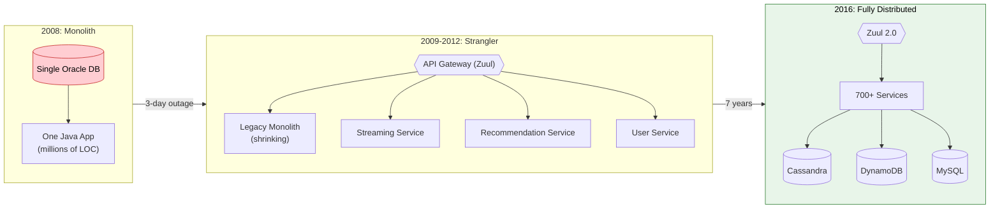
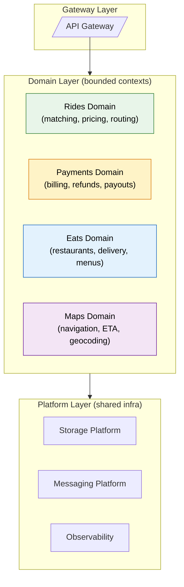
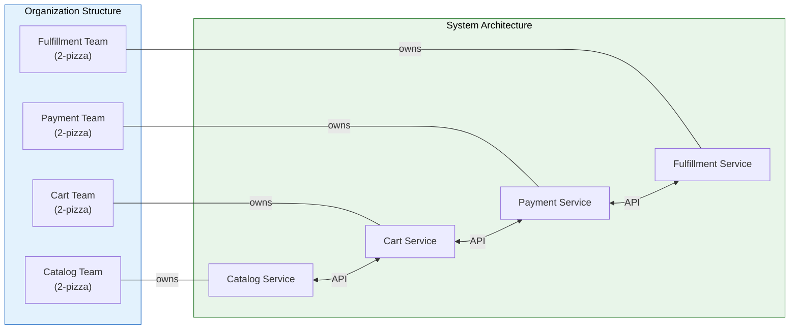
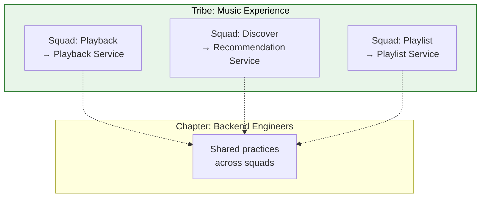

# Real-World Microservices Case Studies

> **How the world's largest companies decomposed monoliths, what worked, what failed, and what you can learn from their $billion experiments.**

---

!!! abstract "Real-World Analogy"
    These case studies are like **post-game analysis in sports**. You watch how championship teams executed their strategies — the plays that won, the mistakes that cost points, and the adaptations they made mid-game. You can't copy their playbook exactly (your team is different), but the patterns of success and failure are universal.

---

## Netflix — The Pioneer

### The Trigger: 2008 Database Corruption

In August 2008, Netflix experienced a major database corruption that took down their DVD shipping service for **three days**. The single Oracle database was a single point of failure for the entire company.

!!! quote "Reed Hastings (Netflix CEO)"
    "We decided that we needed to move to the cloud and break apart that single point of failure into hundreds of independently operating services."

### The Migration (2009-2016)

### Netflix OSS Stack

| Component | Tool | Purpose |
|-----------|------|---------|
| API Gateway | Zuul / Zuul 2 | Request routing, auth, rate limiting |
| Service Discovery | Eureka | Services register and find each other |
| Circuit Breaker | Hystrix | Fail fast when downstream is unhealthy |
| Client Load Balancing | Ribbon | Client-side LB between instances |
| Config Management | Archaius | Dynamic configuration without redeploy |
| Distributed Tracing | — | Custom (pre-Zipkin) |

### Key Lessons from Netflix

1. **Build for failure** — In a distributed system, failure is inevitable. Design every service to handle its dependencies being down.
2. **Chaos Monkey** — "The best way to avoid failure is to fail constantly." Netflix randomly kills production instances to ensure resilience.
3. **Each team owns their service end-to-end** — Build, deploy, monitor, and get paged at 3am.
4. **Freedom with responsibility** — Teams choose their own tech stack, but must meet platform-level SLAs.

!!! warning "What Went Wrong"
    - **Hystrix deprecated (2018)** — Thread pool isolation per dependency proved too complex for most teams to tune correctly. Replaced by Resilience4j in the ecosystem.
    - **700+ services = massive operational overhead** — Service discovery, versioning, testing became enormous challenges.
    - **Eventually-consistent data** — Moving from Oracle transactions to Cassandra required rethinking every data flow.

---

## Uber — Scale at Speed

### The Problem

Uber started as a monolithic Python application. By 2014, with exponential growth, the monolith couldn't scale:
- Single deployment took **hours** and blocked all teams
- A bug in the receipts feature could crash the trip-matching system
- The codebase was so large, new engineers took **months** to become productive

### DOMA: Domain-Oriented Microservice Architecture

After splitting into ~4000+ microservices, Uber found the opposite problem — too many services, too much complexity. They introduced **DOMA** in 2020:

### Key Lessons from Uber

| Lesson | Explanation |
|--------|-------------|
| **Too many services is as bad as a monolith** | With 4000+ services, dependency graphs became impossible to reason about |
| **Group services by domain** | Related services should be owned and deployed together as a "domain" |
| **Standardize the platform layer** | Don't let every team reinvent storage, auth, and messaging |
| **Invest in developer tooling** | Build internal platforms that make microservices easy (they built 100+ internal tools) |

!!! info "The Pendulum Swing"
    Uber's DOMA shows the industry pattern: monolith → too many microservices → domain-grouped services (macro-services). The sweet spot is somewhere between "one giant app" and "one function per service."

---

## Amazon — The Two-Pizza Team

### The Bezos API Mandate (2002)

!!! quote "Jeff Bezos (internal memo, ~2002)"
    "1. All teams will henceforth expose their data and functionality through service interfaces. 2. Teams must communicate with each other through these interfaces. 3. All service interfaces must be designed from the ground up to be externalizable. 4. Anyone who doesn't do this will be fired."

This single mandate restructured Amazon's entire engineering organization and eventually led to AWS.

### Conway's Law in Action

### Key Lessons from Amazon

1. **"You build it, you run it"** — Teams that write code also deploy it AND carry the pager. This creates accountability.
2. **Two-pizza teams (6-10 people)** — Small teams move faster and communicate better. Team size drives service boundaries.
3. **APIs as contracts** — Every internal interface is designed as if it were public. This discipline led to AWS existing.
4. **Decentralized data ownership** — Each service owns its database. No shared databases between teams.
5. **Cell-based architecture** — Services deployed in isolated "cells" to limit blast radius. One cell failure doesn't affect others.

---

## Spotify — Squad Model

### Organization = Architecture

### Key Lessons from Spotify

| Principle | Implementation |
|-----------|---------------|
| Autonomous squads | Each squad owns a service end-to-end |
| Alignment without control | Tribes set direction, squads decide how |
| Event-driven decoupling | Services communicate through Google Pub/Sub |
| Backstage developer portal | Internal tool for service discovery, docs, ownership |

!!! warning "The Reality Check"
    Spotify later admitted the "squad model" wasn't as clean as their 2012 whitepaper suggested. Key issues: cross-squad coordination was harder than expected, "guilds" and "chapters" were inconsistently applied, and some squads struggled with too much autonomy without enough guidance.

---

## Cross-Company Comparison

| Aspect | Netflix | Uber | Amazon | Spotify |
|--------|---------|------|--------|---------|
| **Migration trigger** | 3-day DB outage | Deploy bottleneck | CEO mandate | Rapid team growth |
| **# Services** | 700+ | 4000+ → DOMA | Thousands | Hundreds |
| **Migration time** | ~7 years | ~3 years | ~5 years | Gradual |
| **Key pattern** | Strangler Fig | Domain grouping | Two-pizza teams | Squad model |
| **Biggest mistake** | Over-granular services | Too many services | — | Over-rotation on autonomy |
| **Data strategy** | Cassandra (eventual) | Mixed (strong+eventual) | DynamoDB + Aurora | PostgreSQL + BigTable |
| **Communication** | REST + Messaging | gRPC + Kafka | REST + SQS/SNS | gRPC + Pub/Sub |

---

## Universal Lessons

### What Always Works

1. **Start with a monolith** — Almost every success story started monolithic and decomposed later. Premature microservices are a recipe for failure.
2. **Organizational structure drives architecture** (Conway's Law) — If your team structure doesn't match your service boundaries, you'll fight friction forever.
3. **Invest in platform/developer experience** — Every company that succeeded built internal tools, service templates, and observability platforms.
4. **Incremental migration** (Strangler Fig) — Big-bang rewrites fail. Gradually route traffic from old to new.
5. **Own what you build** — The team that writes the code deploys and monitors it.

### What Always Fails

1. **"Distributed monolith"** — Services that deploy together, share databases, or require coordinated releases give you the worst of both worlds.
2. **Too many services too fast** — Uber's 4000 services proved that micro in "microservices" doesn't mean tiny. Group by domain.
3. **Shared databases** — The moment two services share a database, you lose independent deployability.
4. **Ignoring operational readiness** — Without CI/CD, observability, and on-call culture, microservices multiply your operational burden.
5. **Copying Netflix at 10 engineers** — These companies had thousands of engineers and years to build platform tooling. Context matters.

---

## Interview Application

### How to Use These Stories in Interviews

??? question "Tell me about a time you migrated from a monolith to microservices"

    **Framework:** Use the Amazon/Netflix stories as inspiration, map to your own experience:
    
    1. **Situation:** "Our monolith had X problem" (deploy bottleneck, team coupling, scaling limitation)
    2. **Task:** "We needed to break service Y out because Z"
    3. **Action:** "We used the Strangler Fig pattern — routing traffic gradually via API Gateway"
    4. **Result:** "Deploy frequency went from weekly to daily, team velocity increased by X%"

??? question "How do you decide service boundaries?"

    **Answer structure:**
    
    - Start with business capabilities (DDD bounded contexts)
    - Align with team structure (Conway's Law — like Amazon's two-pizza teams)
    - Validate: can this service be deployed independently? Does one team own it?
    - Anti-pattern: splitting by technical layer (UI service, DB service) instead of business domain

??? question "What would you do differently if starting over?"

    **Strong answers reference real trade-offs:**
    
    - "Start with a modular monolith and only extract services that need independent scaling"
    - "Invest in observability BEFORE decomposing, not after (Netflix learned this the hard way)"
    - "Group services by domain from the start (Uber's DOMA insight), not one-service-per-entity"

??? question "When would you NOT use microservices?"

    - Small team (< 10 engineers) — operational overhead outweighs benefits
    - Unclear domain boundaries — you'll draw them wrong and create a distributed monolith
    - Tight latency requirements where network hops matter (high-frequency trading)
    - Early-stage startup — ship fast first, decompose later
