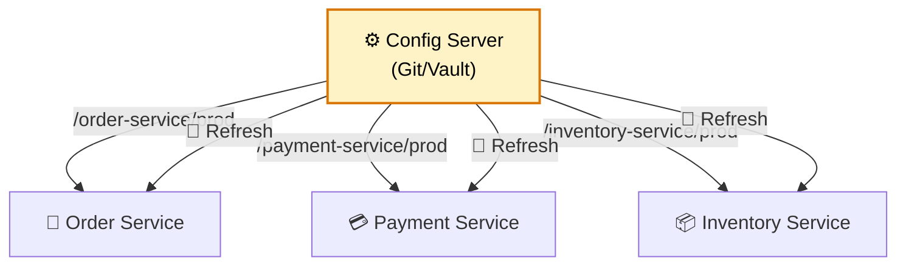
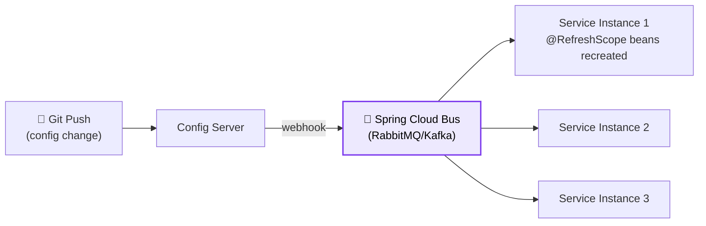
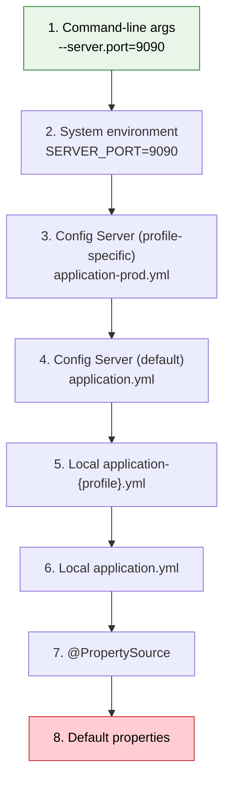

# ⚙️ Configuration Management

> **Externalize configuration from code — manage secrets, environment-specific settings, and feature flags across distributed services.**

---

!!! abstract "Real-World Analogy"
    Think of a **car rental company**. The same car model (your service JAR) is used across cities, but each city adjusts the GPS language, radio presets, and insurance policies (configuration). You don't build separate cars — you configure the same car differently per location. Spring Cloud Config does this for microservices.



---

## 🏗️ Spring Cloud Config Server

### Server Setup

```java
@SpringBootApplication
@EnableConfigServer
public class ConfigServerApplication { }
```

```yaml
# application.yml for config server
server:
  port: 8888
spring:
  cloud:
    config:
      server:
        git:
          uri: https://github.com/myorg/config-repo
          default-label: main
          search-paths: '{application}'
```

### Config Repository Structure

```
config-repo/
├── application.yml              ← shared defaults (all services)
├── order-service/
│   ├── application.yml          ← order-service defaults
│   ├── application-dev.yml      ← order-service dev
│   └── application-prod.yml     ← order-service prod
├── payment-service/
│   ├── application.yml
│   └── application-prod.yml
```

### Client Setup

```yaml
# bootstrap.yml (or spring.config.import in Boot 3)
spring:
  application:
    name: order-service
  config:
    import: "configserver:http://config-server:8888"
  cloud:
    config:
      fail-fast: true
      retry:
        max-attempts: 5
```

---

## 🔐 Secrets Management

### Approach 1: Spring Cloud Vault

```yaml
spring:
  cloud:
    vault:
      host: vault.internal
      port: 8200
      scheme: https
      authentication: KUBERNETES
      kubernetes:
        role: order-service
        service-account-token-file: /var/run/secrets/kubernetes.io/serviceaccount/token
      kv:
        enabled: true
        backend: secret
        default-context: order-service
```

```java
// Secrets automatically become properties
@Value("${db.password}")
private String dbPassword;  // Fetched from Vault at startup
```

### Approach 2: Kubernetes Secrets

```yaml
apiVersion: v1
kind: Secret
metadata:
  name: order-service-secrets
type: Opaque
data:
  DB_PASSWORD: c2VjcmV0MTIz  # base64
  API_KEY: bXlhcGlrZXk=
---
# Mount as environment variables
env:
  - name: DB_PASSWORD
    valueFrom:
      secretKeyRef:
        name: order-service-secrets
        key: DB_PASSWORD
```

### Approach 3: AWS Secrets Manager

```yaml
spring:
  config:
    import: "aws-secretsmanager:/secrets/order-service"
```

---

## 🔄 Dynamic Configuration Refresh

Change config without restarting services:

```java
@RestController
@RefreshScope  // Bean recreated on /actuator/refresh
public class FeatureController {

    @Value("${feature.new-checkout.enabled:false}")
    private boolean newCheckoutEnabled;

    @GetMapping("/api/checkout")
    public String checkout() {
        if (newCheckoutEnabled) {
            return "New checkout flow!";
        }
        return "Classic checkout";
    }
}
```

```bash
# Trigger refresh (single instance)
curl -X POST http://order-service:8080/actuator/refresh

# Or use Spring Cloud Bus (refreshes ALL instances)
curl -X POST http://config-server:8888/actuator/busrefresh
```



---

## 🏷️ Configuration Priority (Highest → Lowest)



---

## 🎯 Interview Questions

??? question "1. How do you manage configuration across 50+ microservices?"
    Use a **centralized config server** (Spring Cloud Config) backed by Git. Each service pulls its config on startup. Shared properties go in a global file, service-specific ones in their own directory. Secrets go in Vault/AWS Secrets Manager, not Git.

??? question "2. How do you change configuration without restarting?"
    Use `@RefreshScope` on beans that read dynamic properties. Trigger via `/actuator/refresh` endpoint. For multi-instance refresh, use **Spring Cloud Bus** (broadcasts refresh events to all instances via Kafka/RabbitMQ).

??? question "3. Where should secrets be stored?"
    Never in Git or property files. Use: **HashiCorp Vault** (full-featured secret management), **Kubernetes Secrets** (simple K8s deployments), **AWS Secrets Manager** / **GCP Secret Manager** (cloud-native). Spring Cloud integrates with all of these.

??? question "4. What is the property resolution order?"
    Command-line args > Environment variables > Config server profile-specific > Config server default > Local profile-specific > Local application.yml > Defaults. Higher priority overrides lower. This lets you override any property per environment.

??? question "5. How do you handle feature flags?"
    Store flags in config (`feature.x.enabled=true/false`). Use `@RefreshScope` for real-time toggling. For advanced use (percentage rollouts, A/B tests, user targeting), use dedicated tools like LaunchDarkly, Unleash, or GrowthBook.

