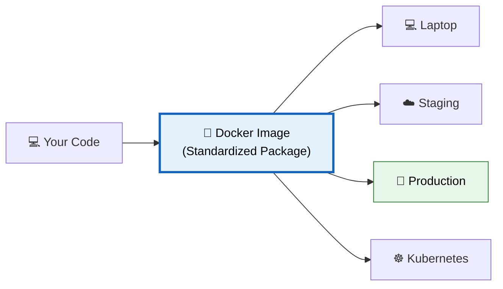
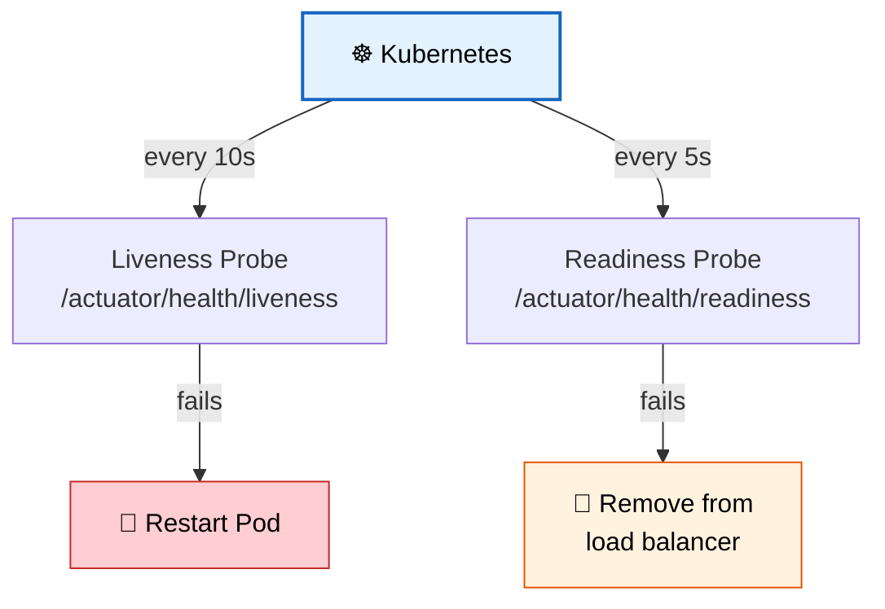

# 🐳 Containerizing Microservices

> **Package, deploy, and orchestrate microservices using Docker and Kubernetes for consistent, scalable environments.**

---

!!! abstract "Real-World Analogy"
    Think of **shipping containers**. Before containers, cargo was loaded loosely — fragile items broke, goods mixed up, loading took days. Shipping containers standardized everything — any cargo fits in a standard box that works on any ship, truck, or train. Docker does the same for software — package once, run anywhere.



---

## 🐳 Dockerfile for Spring Boot

### Multi-Stage Build (Production-Ready)

```dockerfile
# Stage 1: Build
FROM eclipse-temurin:21-jdk AS builder
WORKDIR /app
COPY pom.xml .
COPY src ./src
RUN ./mvnw package -DskipTests

# Stage 2: Run (minimal image)
FROM eclipse-temurin:21-jre
WORKDIR /app
COPY --from=builder /app/target/*.jar app.jar

# Non-root user for security
RUN addgroup --system appgroup && adduser --system --ingroup appgroup appuser
USER appuser

EXPOSE 8080
ENTRYPOINT ["java", "-jar", "app.jar"]
```

!!! tip "Why Multi-Stage?"
    Stage 1 has the JDK + Maven (large ~500MB). Stage 2 only has JRE + your JAR (~200MB). Final image is much smaller and has fewer vulnerabilities.

### Layered JARs (Faster Rebuilds)

```dockerfile
FROM eclipse-temurin:21-jre
WORKDIR /app

# Extract layers for better Docker caching
COPY --from=builder /app/target/*.jar app.jar
RUN java -Djarmode=layertools -jar app.jar extract

FROM eclipse-temurin:21-jre
WORKDIR /app
COPY --from=0 /app/dependencies/ ./
COPY --from=0 /app/spring-boot-loader/ ./
COPY --from=0 /app/snapshot-dependencies/ ./
COPY --from=0 /app/application/ ./

ENTRYPOINT ["java", "org.springframework.boot.loader.launch.JarLauncher"]
```

---

## 🐙 Docker Compose (Local Development)

```yaml
services:
  order-service:
    build: ./order-service
    ports: ["8081:8080"]
    environment:
      SPRING_PROFILES_ACTIVE: docker
      SPRING_DATASOURCE_URL: jdbc:postgresql://postgres:5432/orders
      SPRING_KAFKA_BOOTSTRAP_SERVERS: kafka:9092
    depends_on:
      postgres:
        condition: service_healthy

  payment-service:
    build: ./payment-service
    ports: ["8082:8080"]
    environment:
      SPRING_PROFILES_ACTIVE: docker
      SPRING_DATASOURCE_URL: jdbc:postgresql://postgres:5432/payments

  postgres:
    image: postgres:16
    environment:
      POSTGRES_DB: orders
      POSTGRES_USER: admin
      POSTGRES_PASSWORD: secret
    healthcheck:
      test: ["CMD-SHELL", "pg_isready -U admin"]
      interval: 5s
      timeout: 5s
      retries: 5

  kafka:
    image: confluentinc/cp-kafka:7.5.0
    ports: ["9092:9092"]
    environment:
      KAFKA_ADVERTISED_LISTENERS: PLAINTEXT://kafka:9092
      KAFKA_OFFSETS_TOPIC_REPLICATION_FACTOR: 1
```

---

## ☸️ Kubernetes Deployment

### Deployment + Service

```yaml
# deployment.yml
apiVersion: apps/v1
kind: Deployment
metadata:
  name: order-service
  labels:
    app: order-service
spec:
  replicas: 3
  selector:
    matchLabels:
      app: order-service
  template:
    metadata:
      labels:
        app: order-service
    spec:
      containers:
        - name: order-service
          image: myregistry/order-service:1.0.0
          ports:
            - containerPort: 8080
          env:
            - name: SPRING_PROFILES_ACTIVE
              value: "kubernetes"
            - name: DB_PASSWORD
              valueFrom:
                secretKeyRef:
                  name: db-credentials
                  key: password
          resources:
            requests:
              memory: "256Mi"
              cpu: "200m"
            limits:
              memory: "512Mi"
              cpu: "500m"
          livenessProbe:
            httpGet:
              path: /actuator/health/liveness
              port: 8080
            initialDelaySeconds: 30
            periodSeconds: 10
          readinessProbe:
            httpGet:
              path: /actuator/health/readiness
              port: 8080
            initialDelaySeconds: 10
            periodSeconds: 5
---
apiVersion: v1
kind: Service
metadata:
  name: order-service
spec:
  selector:
    app: order-service
  ports:
    - port: 80
      targetPort: 8080
  type: ClusterIP
```

### Health Probes



| Probe | Purpose | Failure Action |
|-------|---------|----------------|
| **Liveness** | Is the app alive? | Restart container |
| **Readiness** | Can it handle requests? | Remove from traffic |
| **Startup** | Has it started yet? | Wait before checking liveness |

### Spring Boot Actuator Config

```yaml
management:
  endpoint:
    health:
      probes:
        enabled: true
      group:
        liveness:
          include: livenessState
        readiness:
          include: readinessState,db,kafka
```

---

## 🔐 ConfigMap & Secrets

```yaml
# configmap.yml
apiVersion: v1
kind: ConfigMap
metadata:
  name: order-service-config
data:
  SPRING_PROFILES_ACTIVE: "kubernetes"
  SERVER_PORT: "8080"
  KAFKA_BOOTSTRAP_SERVERS: "kafka-cluster:9092"

---
# secret.yml
apiVersion: v1
kind: Secret
metadata:
  name: db-credentials
type: Opaque
data:
  username: YWRtaW4=       # base64 encoded
  password: c2VjcmV0MTIz   # base64 encoded
```

---

## 🎯 Interview Questions

??? question "1. Why use multi-stage Docker builds?"
    To minimize image size and attack surface. Build stage has full JDK/Maven (~500MB); runtime stage only has JRE + JAR (~200MB). Smaller images = faster pulls, less storage, fewer vulnerabilities.

??? question "2. What's the difference between liveness and readiness probes?"
    **Liveness**: Is the container alive? If not → restart it. **Readiness**: Can it serve traffic? If not → remove from load balancer (but don't restart). A service can be alive but not ready (e.g., warming cache).

??? question "3. How do you handle secrets in Kubernetes?"
    Use Kubernetes Secrets (base64 encoded), mount as environment variables or volumes. For production: use external secret managers (AWS Secrets Manager, HashiCorp Vault) with operators like External Secrets Operator.

??? question "4. How do you scale microservices in Kubernetes?"
    Horizontal Pod Autoscaler (HPA) based on CPU/memory metrics or custom metrics. Example: scale order-service from 3 to 10 pods when CPU > 70%.

??? question "5. What is a pod vs a container vs a deployment?"
    **Container**: single running process (Docker). **Pod**: smallest K8s unit, wraps 1+ containers that share network/storage. **Deployment**: manages replicas of pods, handles rolling updates, rollbacks.
