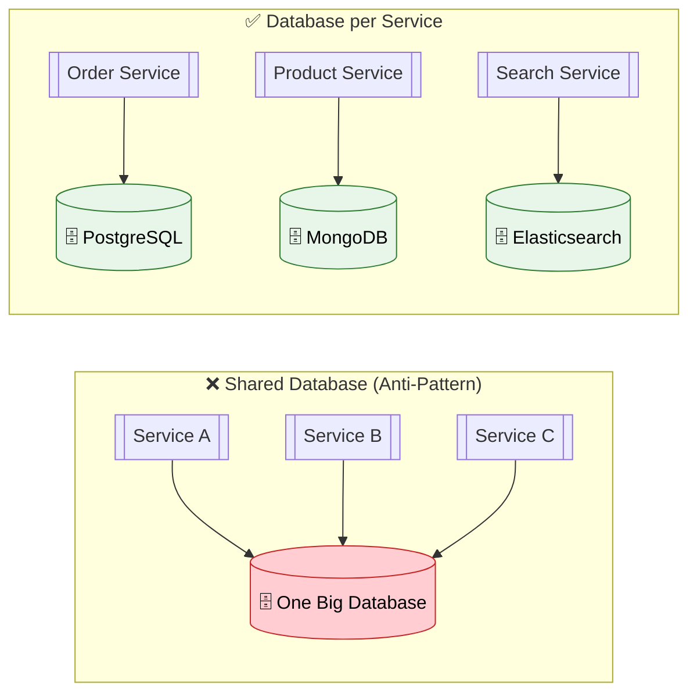
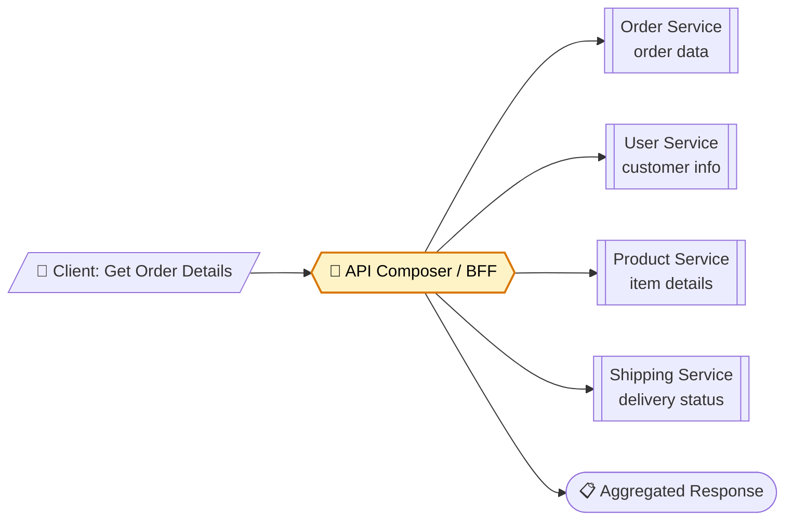
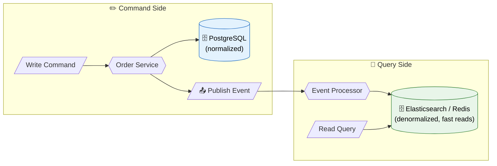
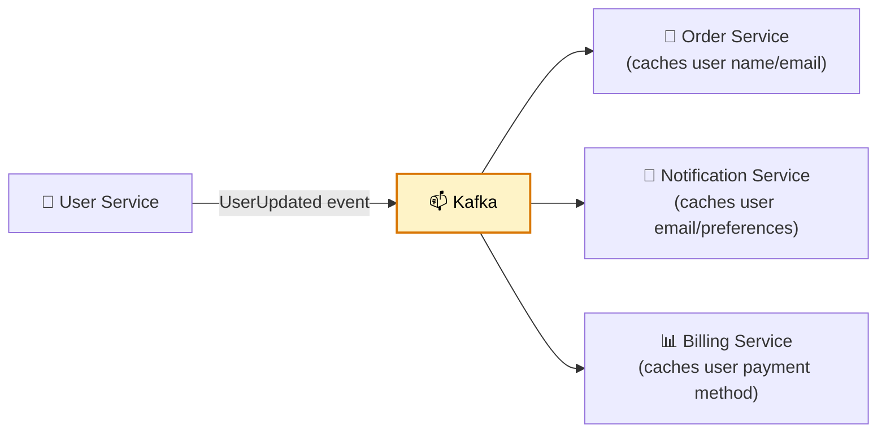
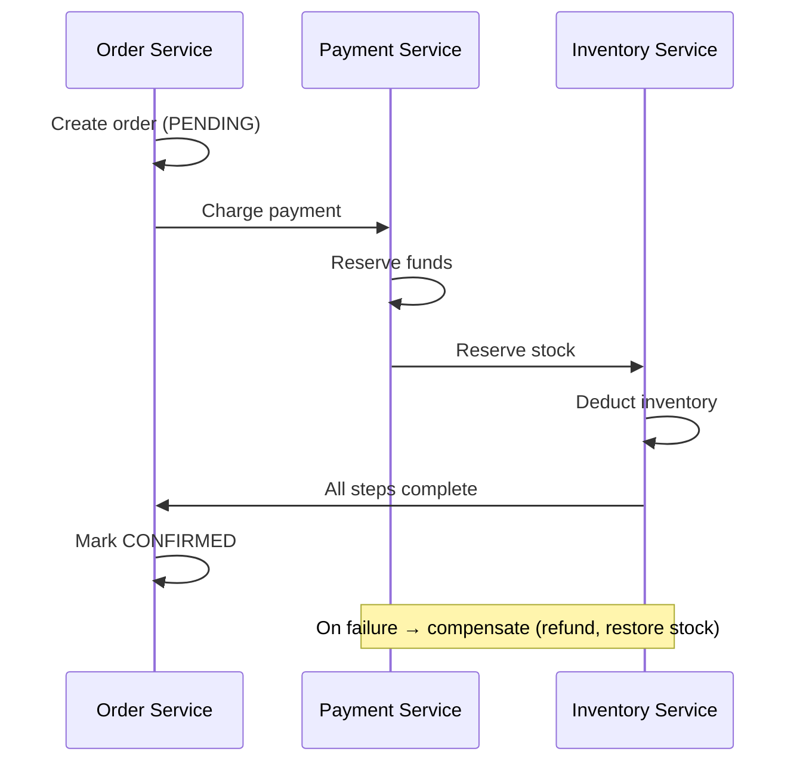

# 🗄️ Data Management Patterns

> **Handle data across microservices — each service owns its database, but you still need consistency, queries across services, and data synchronization.**

---

!!! abstract "Real-World Analogy"
    Think of **different government departments**. Each department (Immigration, Tax, Health) keeps its own records. They can't directly access each other's databases. To get a citizen's full picture, they exchange documents through formal channels. Microservices data management works the same way.



---

## 📐 Pattern 1: API Composition

Query across services by calling multiple APIs and joining in-memory:



```java
@Service
public class OrderDetailsComposer {

    public OrderDetailsResponse getOrderDetails(String orderId) {
        // Call multiple services in parallel
        CompletableFuture<Order> orderFuture = orderClient.getOrder(orderId);
        CompletableFuture<User> userFuture = orderFuture
            .thenCompose(order -> userClient.getUser(order.getUserId()));
        CompletableFuture<List<Product>> productsFuture = orderFuture
            .thenCompose(order -> productClient.getProducts(order.getItemIds()));
        CompletableFuture<Shipment> shipmentFuture = shippingClient.getByOrderId(orderId);

        // Combine results
        return CompletableFuture.allOf(orderFuture, userFuture, productsFuture, shipmentFuture)
            .thenApply(v -> new OrderDetailsResponse(
                orderFuture.join(),
                userFuture.join(),
                productsFuture.join(),
                shipmentFuture.join()
            )).join();
    }
}
```

---

## 📐 Pattern 2: CQRS (Command Query Responsibility Segregation)

Separate write model (optimized for updates) from read model (optimized for queries):



```java
// Write side — normalized, transactional
@Service
public class OrderCommandService {

    @Transactional
    public Order createOrder(CreateOrderCommand cmd) {
        Order order = orderRepository.save(new Order(cmd));
        eventPublisher.publish(new OrderCreatedEvent(order));
        return order;
    }
}

// Read side — denormalized, fast queries
@Service
public class OrderQueryService {

    @KafkaListener(topics = "order-events")
    public void handleOrderEvent(OrderCreatedEvent event) {
        // Build a denormalized read model
        OrderView view = new OrderView(
            event.orderId(),
            event.userName(),        // Denormalized — no JOIN needed
            event.productNames(),    // Denormalized
            event.totalAmount(),
            event.status()
        );
        orderViewRepository.save(view);  // Elasticsearch / Redis
    }

    public List<OrderView> searchOrders(String query) {
        return orderViewRepository.search(query);  // Fast!
    }
}
```

---

## 📐 Pattern 3: Event-Driven Data Sync

Services keep local copies of data they need, synced via events:



```java
// Order Service — maintains a local read-only copy of user data it needs
@Service
public class UserDataSyncConsumer {

    @KafkaListener(topics = "user-events")
    public void syncUserData(UserUpdatedEvent event) {
        localUserCache.save(new LocalUserRecord(
            event.userId(),
            event.name(),
            event.email()
        ));
    }
}
```

---

## 📐 Pattern 4: Saga for Distributed Writes

When a business operation spans multiple services' databases:



---

## 📊 Polyglot Persistence

Use the right database for each service's needs:

| Service | Database | Why |
|---|---|---|
| Order Service | PostgreSQL | Complex relationships, ACID transactions |
| Product Catalog | MongoDB | Flexible schema, nested documents |
| Search Service | Elasticsearch | Full-text search, fast filtering |
| Session Store | Redis | Low-latency key-value, TTL |
| Analytics | ClickHouse | Columnar, aggregation-heavy queries |
| Social Graph | Neo4j | Relationship queries (friends, recommendations) |

---

## ⚠️ Challenges & Solutions

| Challenge | Solution |
|---|---|
| Cross-service queries | API Composition, CQRS read models |
| Data consistency | Sagas, Outbox Pattern, eventual consistency |
| Distributed joins | Denormalize into read models |
| Reporting across services | Event-driven data lake / data warehouse |
| Data duplication | Accept it — trade storage for autonomy |
| Schema evolution | Backward-compatible changes, versioned events |

---

## 🎯 Interview Questions

??? question "1. How do you query data that spans multiple microservices?"
    Two main approaches: **API Composition** — an aggregator service calls multiple APIs and joins data in memory (simple but can be slow). **CQRS** — maintain denormalized read models optimized for specific queries, synced via events (complex but fast reads).

??? question "2. What is CQRS and when to use it?"
    Separate the write model (normalized, transactional) from the read model (denormalized, query-optimized). Use when: read and write patterns differ significantly, you need different data stores for reads vs writes, or you need high-performance search/filtering.

??? question "3. How do you handle data consistency without distributed transactions?"
    Use **eventual consistency** via: Sagas (compensating transactions), Outbox Pattern (reliable event publishing), event-driven data sync. Accept that services may be temporarily inconsistent (usually milliseconds). Design UIs to handle "processing" states.

??? question "4. What is polyglot persistence?"
    Using different database technologies for different services based on their specific needs — PostgreSQL for transactions, MongoDB for flexible documents, Redis for caching, Elasticsearch for search. Each service picks the best tool for its job.

??? question "5. How do you handle reporting across microservices?"
    Build a **read-optimized data store** (data lake or warehouse). Each service publishes events; a pipeline consumes events and builds consolidated reporting tables. Tools: Kafka → Spark/Flink → Data Warehouse, or CDC (Debezium) → Data Lake.

