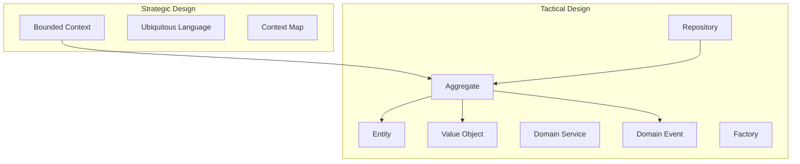
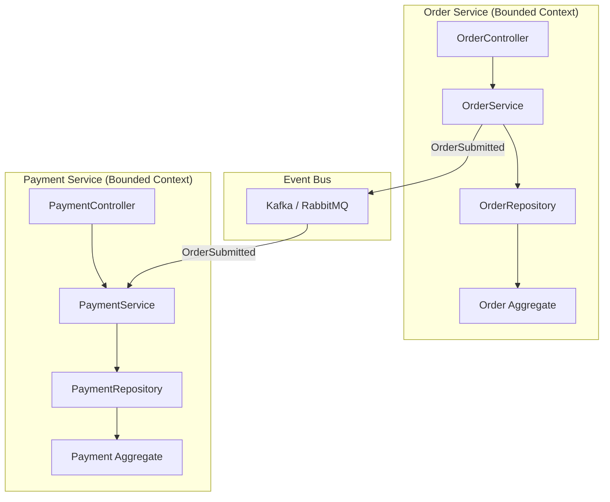

# Domain-Driven Design (DDD)

> DDD is not about technology — it's about understanding the business domain deeply enough to model it correctly in software. Every microservices interview at senior level touches DDD.

---

## Core Building Blocks



---

## Strategic Design

### Bounded Context

A boundary within which a particular model is defined and applicable. The same word means different things in different contexts.

| Context | "Product" means... | "Customer" means... |
|---------|-------------------|---------------------|
| Catalog | Name, description, images, categories | Browsing history, wishlist |
| Inventory | SKU, quantity, warehouse location | — (not relevant) |
| Shipping | Weight, dimensions, fragility | Delivery address, phone |
| Billing | Price, tax category, discount rules | Payment method, credit limit |

!!! tip "Interview signal"
    When asked "how would you split a monolith into microservices?" — identify bounded contexts first. Each context is a candidate microservice.

### Context Mapping Patterns

| Pattern | Description | When to Use |
|---------|-------------|-------------|
| **Shared Kernel** | Two teams share a subset of the model | Small teams, high trust |
| **Customer-Supplier** | Upstream supplies, downstream consumes | Clear dependency direction |
| **Conformist** | Downstream accepts upstream's model as-is | Can't influence upstream (3rd party API) |
| **Anti-Corruption Layer** | Translation layer protects your model | Integrating with legacy or external systems |
| **Open Host Service** | Well-defined public API for all consumers | Platform/library teams |
| **Published Language** | Shared schema (JSON schema, protobuf) | Cross-team event contracts |

```java
// Anti-Corruption Layer example
// External payment API uses different model — translate at boundary
public class PaymentAntiCorruption {
    private final ExternalPaymentClient externalClient;
    
    public PaymentResult charge(Money amount, CustomerId customerId) {
        // Translate OUR domain model to THEIR API model
        ExternalChargeRequest request = new ExternalChargeRequest();
        request.setAmountCents(amount.toCents());
        request.setCcy(amount.getCurrency().getCode());
        request.setMerchantRef(customerId.getValue());
        
        ExternalChargeResponse response = externalClient.charge(request);
        
        // Translate THEIR response back to OUR domain model
        return new PaymentResult(
            PaymentStatus.from(response.getStatus()),
            TransactionId.of(response.getTxnId())
        );
    }
}
```

---

## Tactical Design

### Entity vs Value Object

| | Entity | Value Object |
|---|--------|-------------|
| Identity | Has unique ID | Defined by attributes |
| Equality | Compared by ID | Compared by all fields |
| Mutability | Can change state | Immutable |
| Lifecycle | Created, modified, persisted | Created, used, discarded |
| Example | `Order(id=123)` | `Money(100, USD)` |

```java
// Entity — identified by orderId
public class Order {
    private final OrderId id; // identity
    private OrderStatus status;
    private List<OrderLine> lines;
    private Money totalAmount;
    
    public void addItem(Product product, int quantity) {
        lines.add(new OrderLine(product.getId(), quantity, product.getPrice()));
        recalculateTotal();
        // Publishes domain event
    }
    
    @Override
    public boolean equals(Object o) {
        return o instanceof Order other && this.id.equals(other.id);
    }
}

// Value Object — defined by amount + currency
public record Money(BigDecimal amount, Currency currency) {
    public Money {
        Objects.requireNonNull(amount);
        Objects.requireNonNull(currency);
        amount = amount.setScale(2, RoundingMode.HALF_UP);
    }
    
    public Money add(Money other) {
        if (!this.currency.equals(other.currency))
            throw new CurrencyMismatchException(currency, other.currency);
        return new Money(amount.add(other.amount), currency);
    }
}
```

### Aggregate

An aggregate is a cluster of entities and value objects with one **Aggregate Root** that enforces consistency rules.

**Rules:**

1. External objects can only reference the aggregate root (not internal entities)
2. Changes within an aggregate are transactionally consistent
3. Changes across aggregates are eventually consistent
4. Keep aggregates small — one to three entities max

```java
// Order is the Aggregate Root
// OrderLine is an internal entity — can't be accessed directly
public class Order {
    private final OrderId id;
    private final CustomerId customerId;
    private List<OrderLine> lines = new ArrayList<>();
    private OrderStatus status = OrderStatus.DRAFT;
    
    public void addItem(ProductId productId, int quantity, Money price) {
        if (status != OrderStatus.DRAFT) {
            throw new OrderAlreadySubmittedException(id);
        }
        if (quantity <= 0) {
            throw new InvalidQuantityException(quantity);
        }
        // Invariant enforced by aggregate root
        lines.add(new OrderLine(productId, quantity, price));
    }
    
    public void submit() {
        if (lines.isEmpty()) {
            throw new EmptyOrderException(id);
        }
        this.status = OrderStatus.SUBMITTED;
        DomainEvents.publish(new OrderSubmitted(id, customerId, calculateTotal()));
    }
    
    public Money calculateTotal() {
        return lines.stream()
            .map(OrderLine::subtotal)
            .reduce(Money.ZERO, Money::add);
    }
}
```

### Repository

Provides the illusion of an in-memory collection of aggregates:

```java
public interface OrderRepository {
    Optional<Order> findById(OrderId id);
    void save(Order order);
    void delete(OrderId id);
    List<Order> findByCustomer(CustomerId customerId);
}

// Implementation hides persistence details
@Repository
public class JpaOrderRepository implements OrderRepository {
    private final OrderJpaRepository jpa;
    private final OrderMapper mapper;
    
    public Optional<Order> findById(OrderId id) {
        return jpa.findById(id.getValue())
            .map(mapper::toDomain);
    }
    
    public void save(Order order) {
        OrderEntity entity = mapper.toEntity(order);
        jpa.save(entity);
    }
}
```

### Domain Events

Something meaningful that happened in the domain:

```java
public record OrderSubmitted(
    OrderId orderId,
    CustomerId customerId,
    Money totalAmount,
    Instant occurredAt
) implements DomainEvent {
    public OrderSubmitted(OrderId orderId, CustomerId customerId, Money totalAmount) {
        this(orderId, customerId, totalAmount, Instant.now());
    }
}

// Publishing from aggregate
public class Order {
    private final List<DomainEvent> events = new ArrayList<>();
    
    public void submit() {
        this.status = OrderStatus.SUBMITTED;
        events.add(new OrderSubmitted(id, customerId, calculateTotal()));
    }
    
    public List<DomainEvent> getDomainEvents() {
        return Collections.unmodifiableList(events);
    }
    
    public void clearEvents() {
        events.clear();
    }
}

// Application service dispatches events after persistence
@Transactional
public void submitOrder(OrderId orderId) {
    Order order = orderRepository.findById(orderId).orElseThrow();
    order.submit();
    orderRepository.save(order);
    
    // Dispatch events after successful transaction
    order.getDomainEvents().forEach(eventPublisher::publish);
    order.clearEvents();
}
```

---

## DDD + Microservices Mapping



| DDD Concept | Microservice Equivalent |
|-------------|------------------------|
| Bounded Context | One microservice |
| Aggregate | Transaction boundary |
| Domain Event | Async message (Kafka topic) |
| Anti-Corruption Layer | API adapter/gateway |
| Repository | Data access layer |
| Ubiquitous Language | API contracts, protobuf schemas |

---

## Event Sourcing with DDD

Instead of storing current state, store the sequence of events that led to current state:

```java
// Traditional: store current state
// orders table: {id: 1, status: "SHIPPED", total: 150.00}

// Event Sourcing: store events
// order_events table:
// {order_id: 1, event: "OrderCreated", data: {...}, timestamp: T1}
// {order_id: 1, event: "ItemAdded", data: {product: "Widget", qty: 2}, timestamp: T2}
// {order_id: 1, event: "OrderSubmitted", data: {...}, timestamp: T3}
// {order_id: 1, event: "PaymentReceived", data: {amount: 150}, timestamp: T4}
// {order_id: 1, event: "OrderShipped", data: {tracking: "XY123"}, timestamp: T5}

// Rebuild state by replaying events
public Order reconstitute(List<DomainEvent> events) {
    Order order = new Order();
    for (DomainEvent event : events) {
        order.apply(event); // each event mutates state
    }
    return order;
}
```

**When to use Event Sourcing:**

| Use When | Avoid When |
|----------|-----------|
| Full audit trail required (finance, legal) | Simple CRUD with no history needs |
| Complex business rules with temporal queries | Team inexperienced with eventual consistency |
| Need to answer "what was the state at time T?" | High-volume writes with no read model |
| CQRS provides clear read/write separation | Reporting can query the write model directly |

---

## Interview Questions

??? question "What is a Bounded Context and how do you identify one?"

    A Bounded Context is a boundary within which a specific domain model applies. Identify them by: looking for different meanings of the same term across teams (e.g., "Account" in Banking vs Marketing), finding natural team boundaries, and identifying where translation happens between systems. Each bounded context should own its data and expose contracts (APIs/events) to others.

??? question "What's the difference between an Entity and a Value Object?"

    Entities have a unique identity that persists over time (e.g., User with userId). Value Objects are defined entirely by their attributes and are immutable (e.g., Address, Money). Two entities are equal if they have the same ID regardless of other fields. Two value objects are equal if all their fields are equal.

??? question "How do Aggregates enforce consistency in DDD?"

    An Aggregate groups related entities/value objects under one root entity that enforces all business invariants. All access goes through the root. Changes within one aggregate are ACID-consistent. Changes across aggregates use eventual consistency via domain events. Keep aggregates small — large aggregates create contention and scaling problems.
