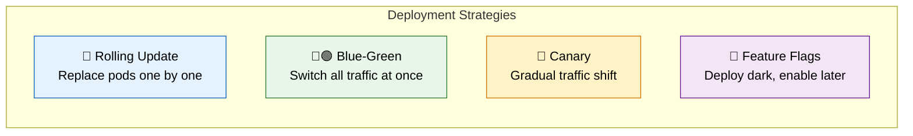
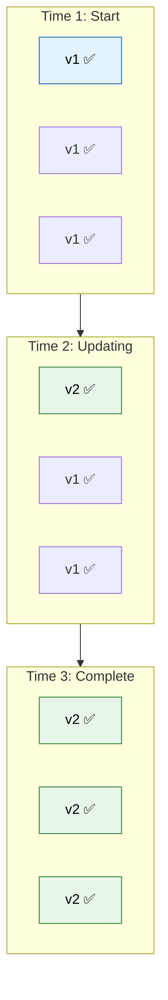
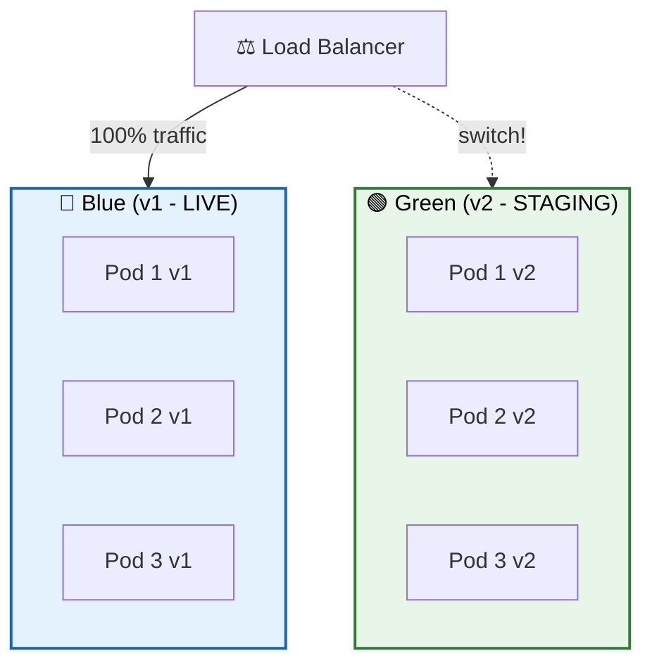
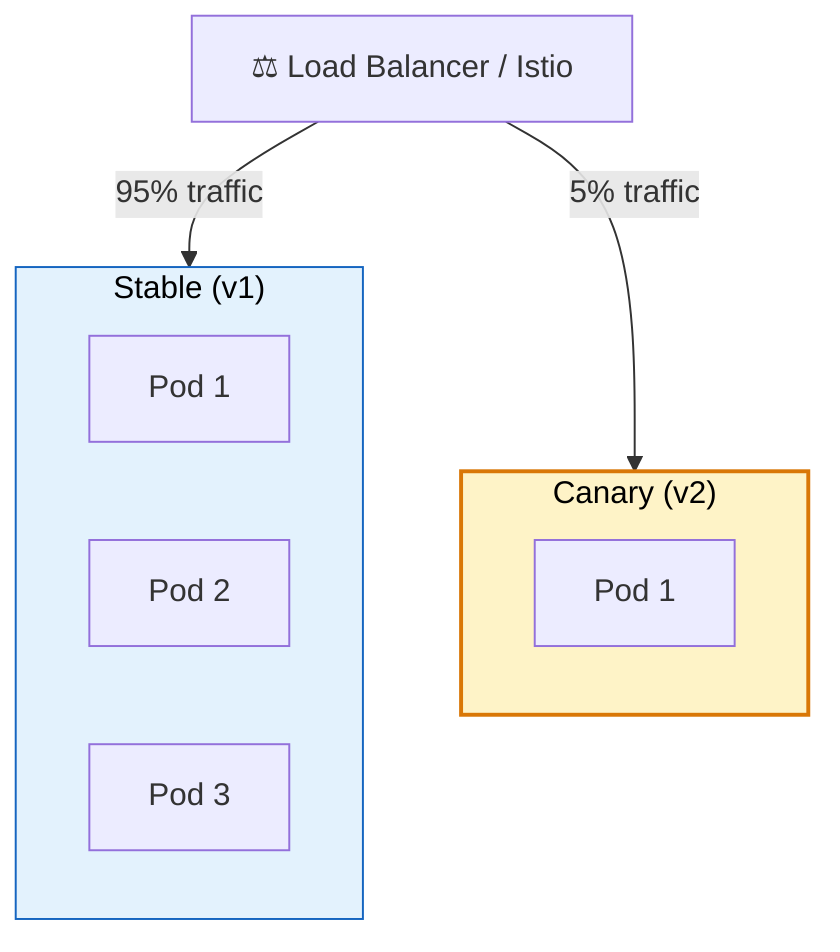
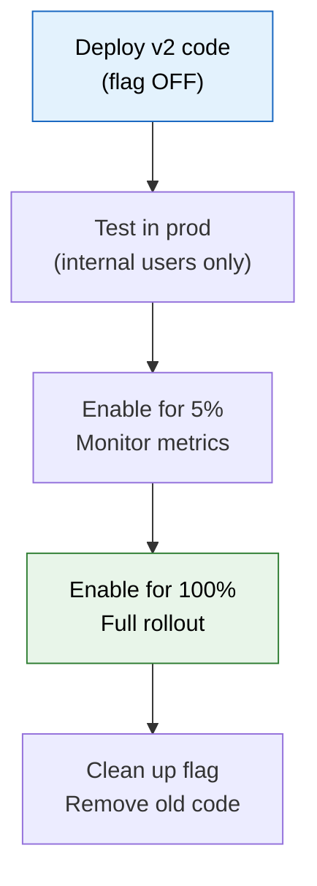
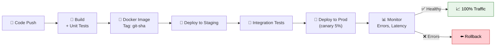

# 🚀 Deployment Strategies

> **Deploy microservices to production with zero downtime — blue-green, canary, rolling updates, and feature flags.**

---

!!! abstract "Real-World Analogy"
    Think of **renovating a restaurant while it's open**. You can't close for weeks. **Blue-Green**: build a duplicate restaurant next door, switch customers over when ready. **Canary**: seat 5% of customers in the renovated section, check reviews, then move everyone. **Rolling**: renovate one table at a time while others keep serving.



---

## 🔄 Rolling Update (Default in Kubernetes)

Replace old pods with new ones gradually:



```yaml
# Kubernetes deployment with rolling update
spec:
  replicas: 3
  strategy:
    type: RollingUpdate
    rollingUpdate:
      maxSurge: 1        # At most 1 extra pod during update
      maxUnavailable: 0  # Always maintain full capacity
```

| Pros | Cons |
|---|---|
| Simple, built-in to K8s | Both versions run simultaneously (briefly) |
| Zero downtime | Rollback is another rolling update (slow) |
| No extra infrastructure | Hard to test with real traffic first |

---

## 🔵🟢 Blue-Green Deployment

Run two identical environments. Switch traffic instantly:



```yaml
# Switch by updating the service selector
apiVersion: v1
kind: Service
metadata:
  name: order-service
spec:
  selector:
    app: order-service
    version: green   # Change from "blue" to "green" to switch
  ports:
    - port: 80
      targetPort: 8080
```

| Pros | Cons |
|---|---|
| Instant rollback (switch back) | Double infrastructure cost |
| Test green before switching | Database migrations need care |
| Zero downtime | Both environments must be maintained |

---

## 🐤 Canary Deployment

Gradually shift traffic to the new version:



### With Istio Service Mesh

```yaml
apiVersion: networking.istio.io/v1alpha3
kind: VirtualService
metadata:
  name: order-service
spec:
  hosts:
    - order-service
  http:
    - route:
        - destination:
            host: order-service
            subset: stable
          weight: 95
        - destination:
            host: order-service
            subset: canary
          weight: 5
```

### Progressive Delivery

```
5% → monitor errors/latency → 25% → monitor → 50% → monitor → 100%
     ↓ (if errors spike)
     Automatic rollback!
```

| Pros | Cons |
|---|---|
| Low risk — small blast radius | More complex setup |
| Real user validation | Need good monitoring/alerting |
| Automatic rollback possible | Mixed versions serve traffic |

---

## 🏁 Feature Flags (Deploy Dark)

Deploy code to production but keep it hidden behind a flag:

```java
@Service
public class CheckoutService {

    @Value("${feature.new-payment-flow.enabled:false}")
    private boolean newPaymentFlowEnabled;

    public PaymentResult processCheckout(Order order) {
        if (newPaymentFlowEnabled) {
            return newPaymentFlow(order);  // New code, deployed but inactive
        }
        return legacyPaymentFlow(order);   // Currently active
    }
}
```



---

## 📊 Strategy Comparison

| Strategy | Downtime | Risk | Cost | Rollback Speed | Best For |
|---|---|---|---|---|---|
| Rolling | None | Medium | Low | Medium (minutes) | Most deployments |
| Blue-Green | None | Low | High (2x infra) | Instant | Critical services |
| Canary | None | Lowest | Medium | Fast (seconds) | High-traffic services |
| Feature Flags | None | Lowest | Low | Instant (toggle) | Gradual feature rollout |

---

## 🔄 CI/CD Pipeline



---

## 🎯 Interview Questions

??? question "1. What deployment strategies do you know?"
    **Rolling Update** — replace pods gradually (K8s default). **Blue-Green** — two environments, instant switch. **Canary** — route small % of traffic to new version, gradually increase. **Feature Flags** — deploy dark, enable incrementally. **A/B Testing** — route specific user segments to different versions.

??? question "2. How do you achieve zero-downtime deployments?"
    Readiness probes (don't send traffic until ready), graceful shutdown (finish in-flight requests), rolling updates (always maintain capacity), backward-compatible API changes, and database migrations that work with both old and new code.

??? question "3. How do you handle database migrations with zero downtime?"
    **Expand-and-contract pattern**: 1) Add new column (nullable), deploy new code that writes to both columns. 2) Migrate existing data. 3) Deploy code that only reads new column. 4) Drop old column. Never make breaking schema changes in one step.

??? question "4. What is a canary deployment and when would you use it?"
    Deploy new version alongside stable, route a small percentage (1-5%) of traffic to it. Monitor error rates, latency, and business metrics. If healthy, gradually increase. If degraded, automatically roll back. Use for high-traffic production services where bugs have large blast radius.

??? question "5. How do you roll back a failed deployment?"
    **Rolling**: K8s `kubectl rollout undo`. **Blue-Green**: switch service selector back. **Canary**: shift weight to 0%. **Feature flags**: toggle off instantly. Always keep the previous version's Docker image available. Database rollbacks are harder — prefer forward-fix with expand-and-contract.

