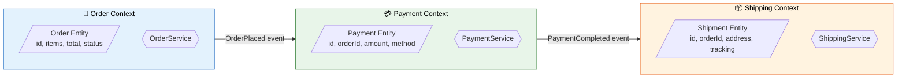
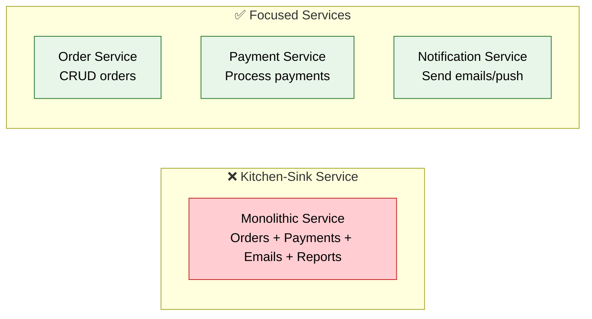
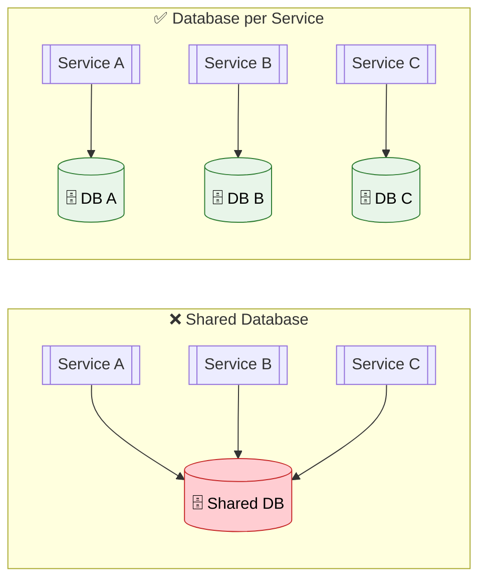
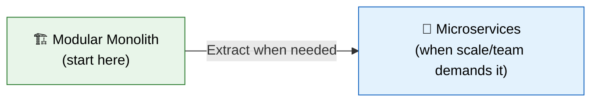

# 🏗️ Microservices Design Principles

> **The 12-Factor App methodology, Domain-Driven Design boundaries, and key principles that separate production-grade microservices from toy projects.**

---

!!! abstract "Real-World Analogy"
    Think of a **city**. Each district (microservice) has its own governance (database), utilities (infrastructure), and specialty (business domain). Districts communicate via roads and postal systems (APIs/events). A well-designed city has clear boundaries, efficient transit, and no district depends on another's internal workings.

---

## 🎯 The 12-Factor App

The industry standard for building cloud-native microservices:

| Factor | Principle | Microservice Practice |
|---|---|---|
| **1. Codebase** | One repo per service | Separate Git repos or mono-repo with clear boundaries |
| **2. Dependencies** | Explicitly declare | Maven/Gradle with locked versions |
| **3. Config** | Store in environment | Spring Profiles, ConfigMaps, Vault |
| **4. Backing Services** | Treat as attached resources | DB, Redis, Kafka as swappable URLs |
| **5. Build, Release, Run** | Strict separation | CI/CD pipeline: build JAR → Docker image → deploy |
| **6. Processes** | Stateless | No in-memory sessions; use Redis/DB |
| **7. Port Binding** | Export via port | Embedded Tomcat, self-contained JAR |
| **8. Concurrency** | Scale via processes | Horizontal pod autoscaling |
| **9. Disposability** | Fast startup/shutdown | Graceful shutdown, health probes |
| **10. Dev/Prod Parity** | Keep environments similar | Docker, Testcontainers |
| **11. Logs** | Treat as event streams | stdout → log aggregator (Loki/ELK) |
| **12. Admin Processes** | Run as one-off tasks | K8s Jobs, Spring Batch |

---

## 📐 Domain-Driven Design (DDD) Boundaries

### Bounded Contexts

Each microservice owns ONE bounded context:



!!! tip "Key Insight"
    The same real-world concept (e.g., "Customer") means different things in different contexts. In Billing, it's payment methods and invoices. In Shipping, it's addresses and delivery preferences. Each service has its OWN model of Customer — don't share entity classes!

### Decomposition Strategies

| Strategy | Description | Example |
|---|---|---|
| **By Business Capability** | Align services to business functions | Order, Payment, Shipping, Inventory |
| **By Subdomain** | Core, Supporting, Generic subdomains | Core: Pricing, Supporting: Notifications |
| **By Team** | Conway's Law — system mirrors org structure | Team A owns Service A |
| **Strangler Fig** | Gradually replace monolith piece by piece | Route /orders to new service, rest stays |

---

## 🔑 Key Design Principles

### 1. Single Responsibility



### 2. Database per Service

Each service owns its data. Never share databases:



### 3. Smart Endpoints, Dumb Pipes

- Services contain all business logic (smart endpoints)
- Communication channels (HTTP, Kafka) are simple transport (dumb pipes)
- No business logic in the message broker or API gateway

### 4. Design for Failure

Assume everything will fail:

```java
// Every external call should have:
// 1. Timeout
// 2. Retry with backoff
// 3. Circuit breaker
// 4. Fallback

@CircuitBreaker(name = "payment", fallbackMethod = "paymentFallback")
@Retry(name = "payment", fallbackMethod = "paymentFallback")
@TimeLimiter(name = "payment")
public CompletableFuture<PaymentResult> processPayment(Order order) {
    return CompletableFuture.supplyAsync(() -> paymentClient.charge(order));
}

public CompletableFuture<PaymentResult> paymentFallback(Order order, Throwable t) {
    return CompletableFuture.completedFuture(PaymentResult.pending("Queued for retry"));
}
```

### 5. Evolutionary Design

Start with a monolith, extract services when needed:



---

## 📊 Service Size Guidelines

| Signal | Too Small | Too Large |
|---|---|---|
| **Lines of code** | < 500 | > 50,000 |
| **Team** | < 1 person | > 8 people (2-pizza rule) |
| **Deploy frequency** | Never (no changes) | Blocked by other features |
| **DB tables** | 1-2 tables | > 20 tables in different domains |
| **Rewrite time** | Trivial (just a function) | > 2 weeks |

---

## 🎯 Interview Questions

??? question "1. How do you decide microservice boundaries?"
    Use **Domain-Driven Design** bounded contexts. Each service should own one business capability with its own data store. Signals: if two pieces of code always change together, they belong in one service. If they have different change rates, deployment needs, or team ownership — separate them.

??? question "2. What is the 12-Factor App?"
    A methodology for building cloud-native applications. Key principles: externalize config, treat backing services as resources, keep processes stateless, export services via port binding, and treat logs as event streams. It ensures services are portable, scalable, and operationally consistent.

??? question "3. Why 'Database per Service' and not shared DB?"
    Shared databases create tight coupling — one service's schema change breaks others. Services can't scale, deploy, or evolve independently. Each service should own its data and expose it via APIs. Trade-off: you lose ACID transactions across services (use Sagas instead).

??? question "4. What is Conway's Law and how does it affect microservices?"
    "Organizations design systems that mirror their communication structure." If you have 4 teams, you'll get 4 services. This means team structure should align with service boundaries — one team owns one or few related services end-to-end.

??? question "5. Monolith First or Microservices First?"
    **Monolith first** (recommended by Martin Fowler). You don't know the domain boundaries well enough initially. Build a well-structured modular monolith, then extract services when: team grows, different parts need different scaling, or deployment conflicts arise. Premature decomposition is the biggest microservices mistake.

??? question "6. What are anti-patterns in microservices?"
    **Distributed monolith** — services are tightly coupled, must deploy together. **Shared database** — defeats independent deployment. **Chatty services** — too many synchronous calls. **Wrong boundaries** — data that changes together is split across services. **No service mesh** — missing observability and security.

