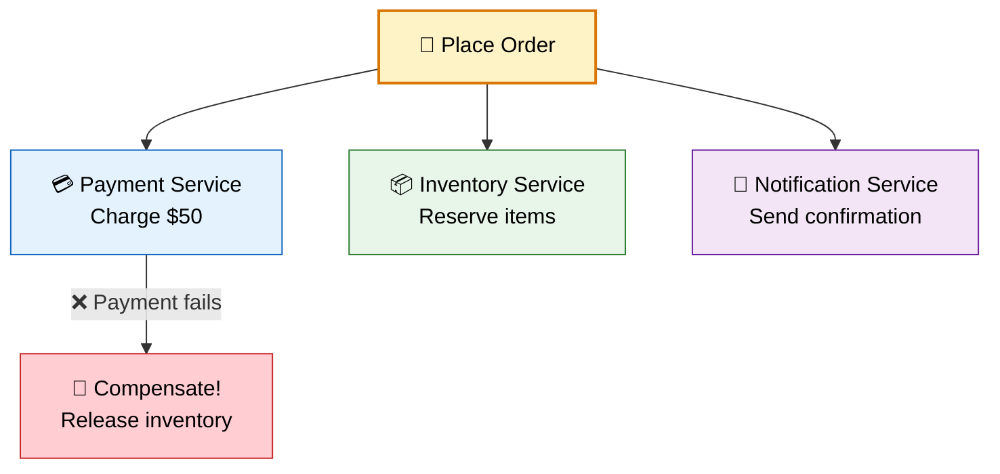
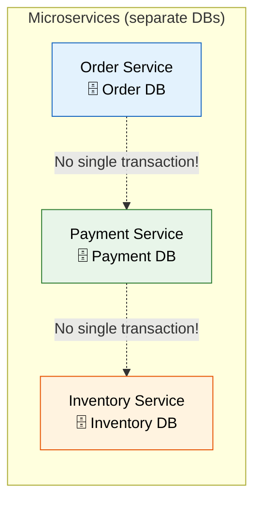
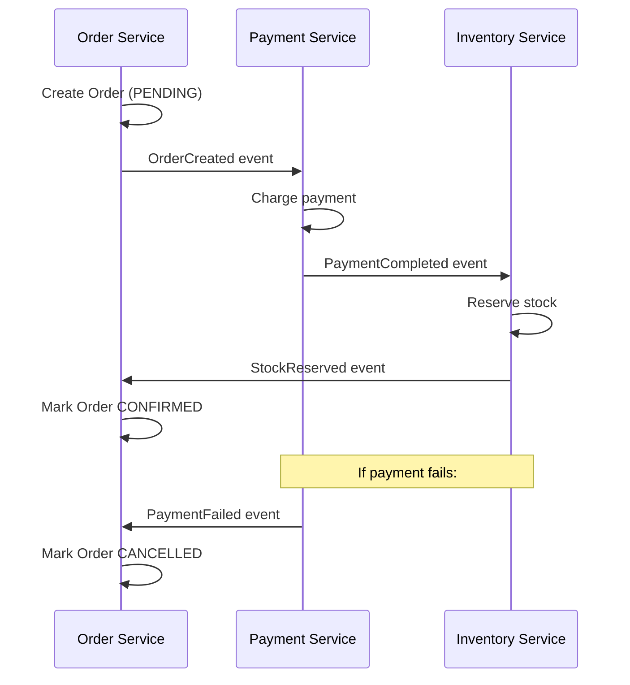
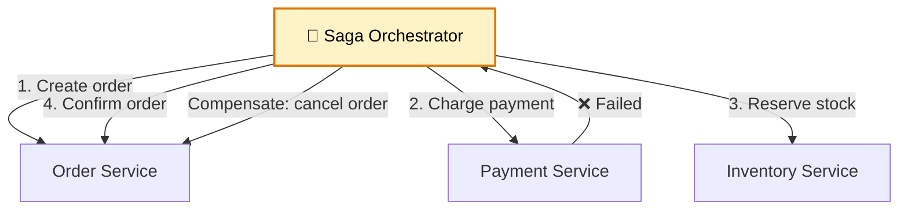
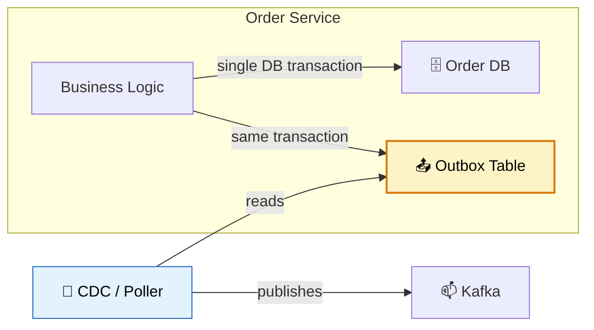
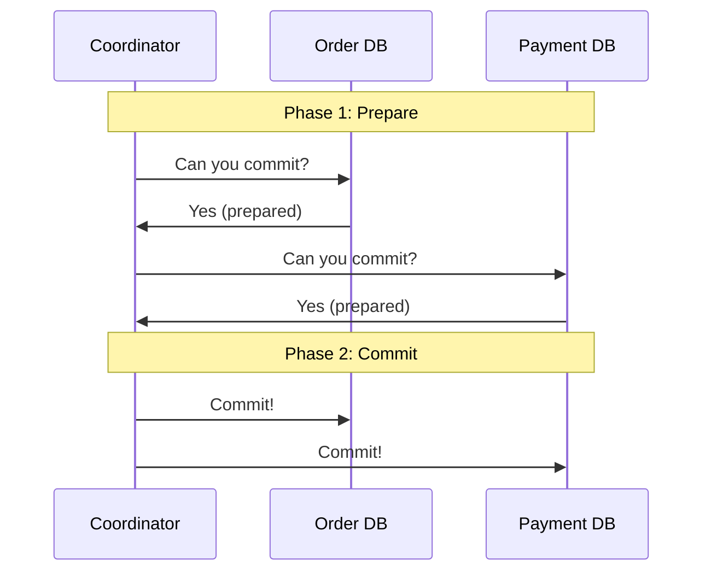
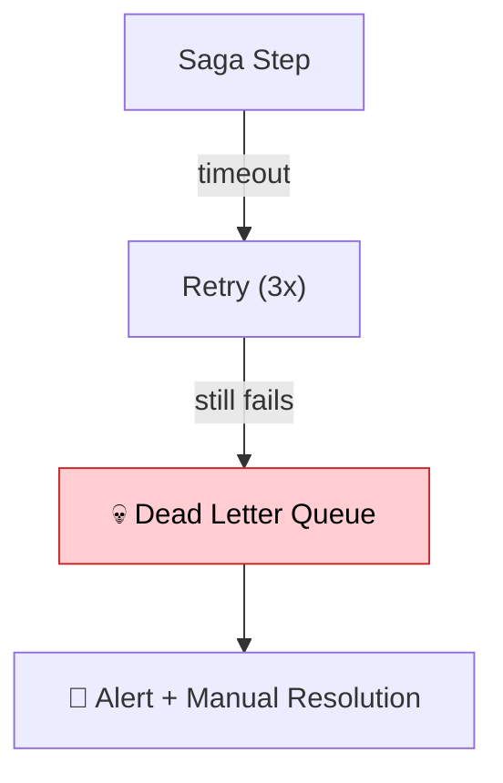

# 🔄 Distributed Transactions

> **Maintain data consistency across multiple microservices — when one service's database update depends on another service succeeding.**

---

!!! abstract "Real-World Analogy"
    Think of **booking a vacation package**. You need to book a flight, hotel, AND car rental together. If the hotel is full, you need to cancel the flight booking too. In a monolith, one database transaction handles this. In microservices, each service has its own database — you need coordination strategies to keep everything consistent.



---

## ❌ The Problem: No ACID Across Services

In a monolith:
```java
@Transactional  // One DB transaction = automatic rollback
public void placeOrder(OrderRequest req) {
    orderRepo.save(order);
    paymentRepo.charge(order);
    inventoryRepo.reserve(order);
}
```

In microservices: **each service has its own database**. There is no single `@Transactional` that spans multiple services.



---

## 📐 Solution 1: Saga Pattern

Break a distributed transaction into a sequence of **local transactions** + **compensating transactions** (undo actions).

### Choreography-Based Saga

Services communicate via events — no central coordinator:



### Orchestration-Based Saga

A central **orchestrator** coordinates the steps:



```java
@Service
public class OrderSagaOrchestrator {

    public void executeSaga(OrderRequest request) {
        String orderId = null;
        String paymentId = null;

        try {
            // Step 1: Create order
            orderId = orderService.createOrder(request);
            
            // Step 2: Process payment
            paymentId = paymentService.charge(orderId, request.amount());
            
            // Step 3: Reserve inventory
            inventoryService.reserve(orderId, request.items());
            
            // Step 4: Confirm
            orderService.confirmOrder(orderId);

        } catch (PaymentException e) {
            // Compensate: cancel the order
            if (orderId != null) orderService.cancelOrder(orderId);
            throw e;
            
        } catch (InventoryException e) {
            // Compensate: refund payment + cancel order
            if (paymentId != null) paymentService.refund(paymentId);
            if (orderId != null) orderService.cancelOrder(orderId);
            throw e;
        }
    }
}
```

### Choreography vs Orchestration

| | Choreography | Orchestration |
|---|---|---|
| **Coordination** | Decentralized (events) | Centralized (orchestrator) |
| **Coupling** | Loosest | Orchestrator knows all steps |
| **Visibility** | Hard to track flow | Easy to monitor |
| **Complexity** | Grows with more services | Stays in one place |
| **Best for** | Simple flows (2-3 steps) | Complex flows (4+ steps) |

---

## 📐 Solution 2: Transactional Outbox Pattern

Ensure events are published reliably — even if the message broker is temporarily down:



```java
@Service
@Transactional
public class OrderService {

    public Order createOrder(OrderRequest request) {
        // Save order (business data)
        Order order = orderRepository.save(new Order(request));
        
        // Save event to outbox table (same transaction!)
        outboxRepository.save(new OutboxEvent(
            "OrderCreated",
            order.getId(),
            objectMapper.writeValueAsString(new OrderCreatedEvent(order))
        ));
        
        return order;  // Both saved atomically
    }
}

// Separate process polls outbox and publishes to Kafka
@Scheduled(fixedDelay = 1000)
public void publishOutboxEvents() {
    List<OutboxEvent> events = outboxRepository.findUnpublished();
    for (OutboxEvent event : events) {
        kafkaTemplate.send("order-events", event.getAggregateId(), event.getPayload());
        event.markPublished();
        outboxRepository.save(event);
    }
}
```

---

## 📐 Solution 3: Two-Phase Commit (2PC)

A coordinator asks all participants to **prepare**, then **commit**:



!!! warning "2PC in Microservices"
    2PC is rarely used in microservices because it's slow (blocking), doesn't scale well, and creates a single point of failure (the coordinator). Prefer Sagas for microservices.

---

## 📊 Comparison of Approaches

| Approach | Consistency | Performance | Complexity | Use Case |
|---|---|---|---|---|
| **Saga (Choreography)** | Eventual | High | Medium | Simple flows |
| **Saga (Orchestration)** | Eventual | High | Medium-High | Complex flows |
| **Outbox Pattern** | At-least-once delivery | High | Low-Medium | Reliable event publishing |
| **2PC** | Strong | Low (blocking) | High | Rarely in microservices |

---

## 🛡️ Handling Failures

### Idempotency

Every step must be safe to retry:

```java
@Transactional
public void processPayment(String orderId, BigDecimal amount) {
    // Check if already processed (idempotency key)
    if (paymentRepository.existsByOrderId(orderId)) {
        log.info("Payment already processed for order: {}", orderId);
        return;
    }
    // Process payment...
}
```

### Timeout & Dead Letters



---

## 🎯 Interview Questions

??? question "1. How do you handle transactions across microservices?"
    Use the **Saga pattern** — break the distributed transaction into a sequence of local transactions, each with a compensating transaction (undo). Coordinate via events (choreography) or a central orchestrator.

??? question "2. What is a compensating transaction?"
    An action that undoes the effect of a previous step. Example: if payment was charged but inventory reservation fails, the compensating transaction is a **refund**. Unlike database rollback, compensating transactions are explicit business logic.

??? question "3. Choreography vs Orchestration — when to use which?"
    **Choreography** (event-driven): simple flows with 2-3 steps, prefer loose coupling. **Orchestration** (central coordinator): complex flows with many steps, need visibility into the process, or conditional logic between steps.

??? question "4. What is the Outbox Pattern?"
    A pattern that writes business data AND the event to publish in a **single database transaction**. A separate process (CDC or poller) reads the outbox table and publishes events to the message broker. Guarantees events are published exactly when the business operation succeeds.

??? question "5. Why not use 2PC (Two-Phase Commit) in microservices?"
    2PC is blocking (participants hold locks during prepare phase), creates a single point of failure (coordinator), doesn't scale across network partitions, and is too slow for high-throughput systems. Sagas with eventual consistency are the industry standard for microservices.

??? question "6. How do you ensure exactly-once execution in a saga?"
    Make every step **idempotent** — store processed request IDs and check before executing. Use unique business keys (orderId) as idempotency keys. Combined with at-least-once delivery from the message broker, this achieves effectively-once semantics.

