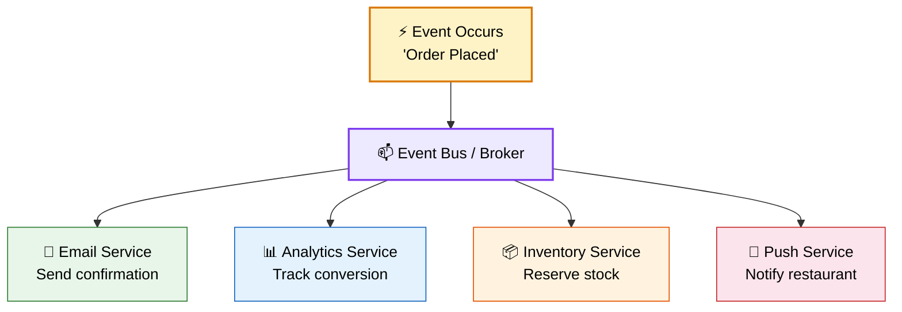
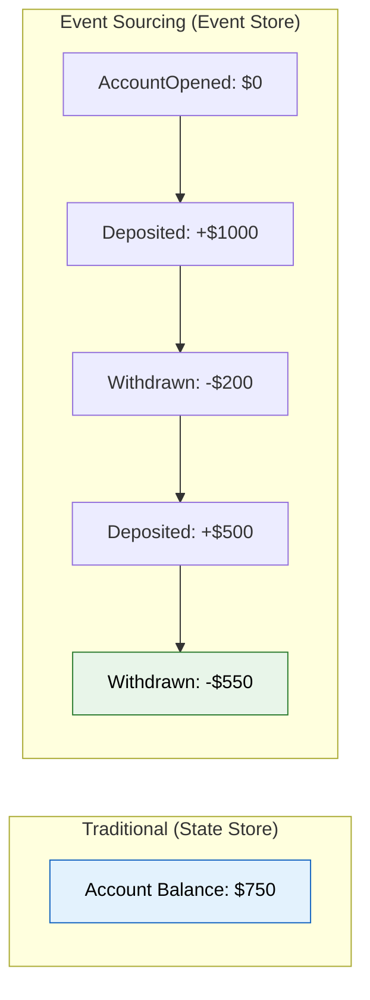
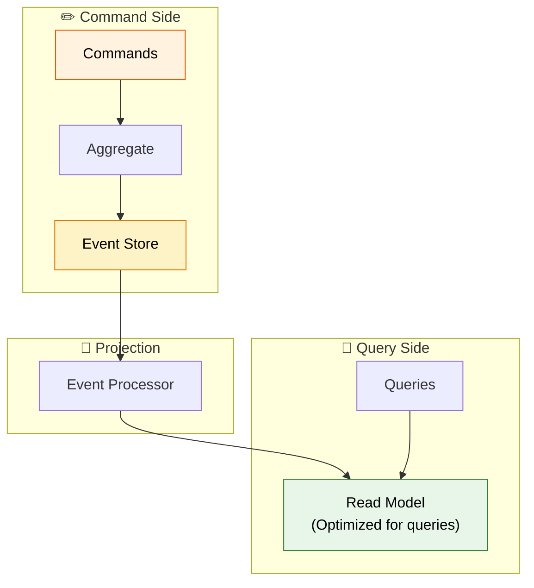
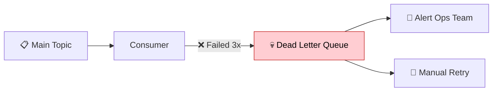

# ⚡ Event-Driven Architecture

> **Services communicate by producing and consuming events — enabling loose coupling, scalability, and real-time processing.**

---

!!! abstract "Real-World Analogy"
    Think of a **newspaper publishing model**. The newspaper (event producer) publishes stories without knowing who reads them. Subscribers (event consumers) choose which sections to read. If a new subscriber joins, the newspaper doesn't change anything. If a subscriber leaves, nothing breaks. This is event-driven — producers and consumers are completely decoupled.



---

## 🧩 Core Concepts

### Domain Events

A domain event represents **something that happened** in the business domain:

```java
public record OrderPlacedEvent(
    String eventId,
    String orderId,
    String userId,
    BigDecimal amount,
    List<OrderItem> items,
    Instant occurredAt
) {}

public record PaymentCompletedEvent(
    String eventId,
    String orderId,
    String paymentId,
    BigDecimal amount,
    Instant occurredAt
) {}
```

!!! tip "Event Naming"
    Use **past tense** for events — they describe something that already happened: `OrderPlaced`, `PaymentCompleted`, `UserRegistered`. Never `CreateOrder` (that's a command).

---

## 📐 Event Sourcing

Instead of storing current state, store **all events** that led to the current state:



**Benefits:** Complete audit trail, time travel (replay to any point), debugging, analytics.

```java
// Event Store
public interface EventStore {
    void append(String aggregateId, DomainEvent event);
    List<DomainEvent> getEvents(String aggregateId);
    List<DomainEvent> getEventsSince(String aggregateId, long version);
}

// Rebuild state from events
public class BankAccount {
    private BigDecimal balance = BigDecimal.ZERO;
    
    public static BankAccount fromEvents(List<DomainEvent> events) {
        BankAccount account = new BankAccount();
        events.forEach(account::apply);
        return account;
    }
    
    private void apply(DomainEvent event) {
        switch (event) {
            case MoneyDeposited e -> balance = balance.add(e.amount());
            case MoneyWithdrawn e -> balance = balance.subtract(e.amount());
            default -> {}
        }
    }
}
```

---

## 🔄 CQRS with Events

**Command Query Responsibility Segregation** — separate the write model from the read model:



---

## 🛡️ Handling Failures

### Idempotent Consumers

Events may be delivered more than once. Consumers must be **idempotent**:

```java
@Service
public class PaymentConsumer {
    
    @Autowired private ProcessedEventRepository processedEvents;
    
    @KafkaListener(topics = "order-events")
    @Transactional
    public void handle(OrderPlacedEvent event) {
        // Check if already processed
        if (processedEvents.existsByEventId(event.eventId())) {
            log.info("Event already processed, skipping: {}", event.eventId());
            return;
        }
        
        // Process the event
        paymentService.charge(event.orderId(), event.amount());
        
        // Mark as processed
        processedEvents.save(new ProcessedEvent(event.eventId()));
    }
}
```

### Dead Letter Queue (DLQ)



---

## 🎯 Interview Questions

??? question "1. What is event-driven architecture?"
    A design pattern where services communicate by producing and consuming events through a message broker. Producers don't know who consumes events. This enables loose coupling, independent scaling, and real-time processing.

??? question "2. What is Event Sourcing?"
    Instead of storing current state, you store all events that led to the current state. The current state is rebuilt by replaying events. Benefits: complete audit trail, time travel, debugging.

??? question "3. How do you handle duplicate events?"
    Make consumers idempotent — store processed event IDs and check before processing. Use database unique constraints on business keys. Design operations to be naturally idempotent (e.g., SET balance=X vs ADD X to balance).

??? question "4. What is eventual consistency?"
    In event-driven systems, different services may have temporarily inconsistent views. Eventually (usually milliseconds to seconds), all services will be consistent. Trade-off: you gain availability and partition tolerance (CAP theorem).

??? question "5. Event Sourcing vs Traditional CRUD — when to use which?"
    **Event Sourcing**: audit requirements, temporal queries, complex business logic, debugging needs. **CRUD**: simple domains, strong consistency needed, team unfamiliar with ES patterns.
