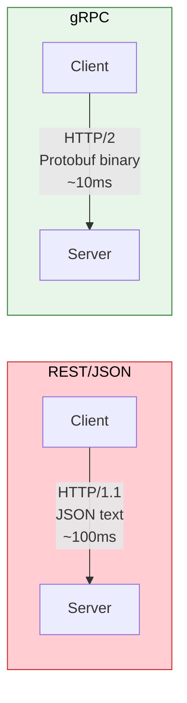
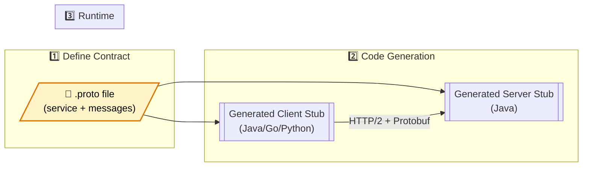
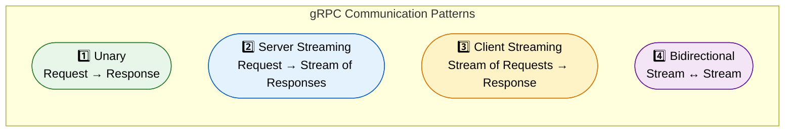

# 🚄 gRPC Communication

> **High-performance, strongly-typed inter-service communication using Protocol Buffers — faster than REST, with streaming support and code generation.**

---

!!! abstract "Real-World Analogy"
    REST is like **sending letters** — human-readable, flexible format, but slow to write and parse. gRPC is like a **direct phone line** — pre-agreed protocol, extremely fast, supports two-way conversations (streaming). You sacrifice human readability for raw performance.



---

## 🏗️ Architecture



---

## 📜 Protocol Buffer Definition

```protobuf
syntax = "proto3";

package com.example.order;

option java_multiple_files = true;
option java_package = "com.example.order.grpc";

// Service definition
service OrderService {
    // Unary RPC
    rpc CreateOrder (CreateOrderRequest) returns (OrderResponse);
    rpc GetOrder (GetOrderRequest) returns (OrderResponse);
    
    // Server streaming
    rpc GetOrderUpdates (GetOrderRequest) returns (stream OrderStatusUpdate);
    
    // Client streaming
    rpc BatchCreateOrders (stream CreateOrderRequest) returns (BatchOrderResponse);
    
    // Bidirectional streaming
    rpc OrderChat (stream OrderMessage) returns (stream OrderMessage);
}

// Messages
message CreateOrderRequest {
    string user_id = 1;
    repeated OrderItem items = 2;
    string shipping_address = 3;
    PaymentMethod payment_method = 4;
}

message OrderItem {
    string product_id = 1;
    int32 quantity = 2;
    double unit_price = 3;
}

message OrderResponse {
    string order_id = 1;
    string status = 2;
    double total_amount = 3;
    google.protobuf.Timestamp created_at = 4;
}

enum PaymentMethod {
    CREDIT_CARD = 0;
    DEBIT_CARD = 1;
    WALLET = 2;
}

message OrderStatusUpdate {
    string order_id = 1;
    string status = 2;
    string message = 3;
    google.protobuf.Timestamp timestamp = 4;
}
```

---

## 🖥️ Server Implementation (Spring Boot + grpc-spring-boot-starter)

### Dependencies

```xml
<dependency>
    <groupId>net.devh</groupId>
    <artifactId>grpc-server-spring-boot-starter</artifactId>
    <version>3.1.0.RELEASE</version>
</dependency>
```

### Service Implementation

```java
@GrpcService
public class OrderGrpcService extends OrderServiceGrpc.OrderServiceImplBase {

    private final OrderService orderService;

    @Override
    public void createOrder(CreateOrderRequest request, StreamObserver<OrderResponse> responseObserver) {
        try {
            Order order = orderService.create(toOrderCommand(request));

            OrderResponse response = OrderResponse.newBuilder()
                .setOrderId(order.getId())
                .setStatus(order.getStatus().name())
                .setTotalAmount(order.getTotal().doubleValue())
                .setCreatedAt(toTimestamp(order.getCreatedAt()))
                .build();

            responseObserver.onNext(response);
            responseObserver.onCompleted();
        } catch (Exception e) {
            responseObserver.onError(Status.INTERNAL
                .withDescription(e.getMessage())
                .asRuntimeException());
        }
    }

    // Server streaming — push real-time order updates
    @Override
    public void getOrderUpdates(GetOrderRequest request, 
                                StreamObserver<OrderStatusUpdate> responseObserver) {
        String orderId = request.getOrderId();

        orderService.subscribeToUpdates(orderId, update -> {
            responseObserver.onNext(OrderStatusUpdate.newBuilder()
                .setOrderId(orderId)
                .setStatus(update.status())
                .setMessage(update.message())
                .setTimestamp(toTimestamp(update.timestamp()))
                .build());
        });

        // Complete when order reaches terminal state
    }
}
```

---

## 📡 Client Implementation

```java
@Service
public class OrderGrpcClient {

    private final OrderServiceGrpc.OrderServiceBlockingStub blockingStub;
    private final OrderServiceGrpc.OrderServiceStub asyncStub;

    public OrderGrpcClient(@GrpcClient("order-service") Channel channel) {
        this.blockingStub = OrderServiceGrpc.newBlockingStub(channel);
        this.asyncStub = OrderServiceGrpc.newStub(channel);
    }

    // Unary call (blocking)
    public OrderResponse createOrder(String userId, List<OrderItem> items) {
        CreateOrderRequest request = CreateOrderRequest.newBuilder()
            .setUserId(userId)
            .addAllItems(items)
            .build();

        return blockingStub
            .withDeadlineAfter(5, TimeUnit.SECONDS)  // Timeout
            .createOrder(request);
    }

    // Server streaming (async)
    public void subscribeToOrderUpdates(String orderId, Consumer<OrderStatusUpdate> callback) {
        GetOrderRequest request = GetOrderRequest.newBuilder()
            .setOrderId(orderId)
            .build();

        asyncStub.getOrderUpdates(request, new StreamObserver<>() {
            @Override
            public void onNext(OrderStatusUpdate update) {
                callback.accept(update);
            }

            @Override
            public void onError(Throwable t) {
                log.error("Stream error for order: {}", orderId, t);
            }

            @Override
            public void onCompleted() {
                log.info("Order updates stream completed: {}", orderId);
            }
        });
    }
}
```

### Client Configuration

```yaml
grpc:
  client:
    order-service:
      address: dns:///order-service:9090
      negotiation-type: TLS
      enable-keep-alive: true
      keep-alive-time: 30s
```

---

## 📊 Communication Patterns



| Pattern | Use Case | Example |
|---|---|---|
| **Unary** | Simple request-response | Get order, create user |
| **Server Streaming** | Real-time updates from server | Price feeds, order status |
| **Client Streaming** | Batch uploads from client | Bulk data import, log collection |
| **Bidirectional** | Real-time two-way communication | Chat, collaborative editing |

---

## ⚠️ Error Handling

```java
@GrpcService
public class OrderGrpcService extends OrderServiceGrpc.OrderServiceImplBase {

    @Override
    public void getOrder(GetOrderRequest request, StreamObserver<OrderResponse> observer) {
        try {
            Order order = orderService.findById(request.getOrderId())
                .orElseThrow(() -> Status.NOT_FOUND
                    .withDescription("Order not found: " + request.getOrderId())
                    .asRuntimeException());

            observer.onNext(toResponse(order));
            observer.onCompleted();

        } catch (StatusRuntimeException e) {
            observer.onError(e);  // gRPC status errors pass through
        } catch (IllegalArgumentException e) {
            observer.onError(Status.INVALID_ARGUMENT
                .withDescription(e.getMessage())
                .asRuntimeException());
        } catch (Exception e) {
            observer.onError(Status.INTERNAL
                .withDescription("Unexpected error")
                .asRuntimeException());
        }
    }
}
```

### gRPC Status Codes

| Code | HTTP Equivalent | Use When |
|---|---|---|
| `OK` | 200 | Success |
| `INVALID_ARGUMENT` | 400 | Bad request |
| `NOT_FOUND` | 404 | Resource doesn't exist |
| `ALREADY_EXISTS` | 409 | Duplicate |
| `PERMISSION_DENIED` | 403 | Not authorized |
| `UNAUTHENTICATED` | 401 | Not authenticated |
| `DEADLINE_EXCEEDED` | 408 | Timeout |
| `UNAVAILABLE` | 503 | Service down |
| `INTERNAL` | 500 | Server error |

---

## 🔧 Interceptors (Middleware)

```java
// Server interceptor for logging and metrics
@GrpcGlobalServerInterceptor
public class LoggingInterceptor implements ServerInterceptor {

    @Override
    public <Req, Resp> ServerCall.Listener<Req> interceptCall(
            ServerCall<Req, Resp> call,
            Metadata headers,
            ServerCallHandler<Req, Resp> next) {

        String method = call.getMethodDescriptor().getFullMethodName();
        Instant start = Instant.now();
        log.info("gRPC call started: {}", method);

        return new ForwardingServerCallListener.SimpleForwardingServerCallListener<>(
                next.startCall(call, headers)) {
            @Override
            public void onComplete() {
                long duration = Duration.between(start, Instant.now()).toMillis();
                log.info("gRPC call completed: {} ({}ms)", method, duration);
                super.onComplete();
            }
        };
    }
}
```

---

## 📊 gRPC vs REST Comparison

| Feature | gRPC | REST |
|---|---|---|
| **Protocol** | HTTP/2 | HTTP/1.1 (usually) |
| **Payload** | Protocol Buffers (binary) | JSON (text) |
| **Speed** | ~10x faster serialization | Human-readable |
| **Contract** | Strict (.proto) | Flexible (OpenAPI optional) |
| **Streaming** | Native (4 patterns) | Workarounds (SSE, WebSocket) |
| **Code Generation** | Built-in (all languages) | Optional (codegen tools) |
| **Browser Support** | Limited (needs grpc-web) | Universal |
| **Tooling** | grpcurl, Postman (newer) | curl, Postman, browsers |
| **Best For** | Internal microservice calls | Public APIs, web clients |

---

## 🎯 Interview Questions

??? question "1. When would you choose gRPC over REST?"
    Choose gRPC for: **internal service-to-service communication** where performance matters, polyglot environments (auto-generated clients), streaming use cases (real-time updates), strict contracts (API evolution safety). Keep REST for: public APIs, browser clients, simple CRUD, when human readability matters.

??? question "2. What are the four gRPC communication patterns?"
    **Unary** (request → response), **Server Streaming** (request → stream of responses), **Client Streaming** (stream of requests → response), **Bidirectional Streaming** (stream ↔ stream). Each serves different use cases from simple RPC to real-time bidirectional communication.

??? question "3. How does gRPC achieve better performance than REST?"
    Three reasons: **HTTP/2** (multiplexing, header compression, single connection), **Protocol Buffers** (binary serialization, 3-10x smaller and faster than JSON), **Connection reuse** (persistent connections, no handshake per request). Combined, gRPC is typically 7-10x faster than REST for serialization/deserialization.

??? question "4. How do you handle errors in gRPC?"
    Use `Status` codes (similar to HTTP status codes but richer). Return `StatusRuntimeException` with appropriate code (NOT_FOUND, INVALID_ARGUMENT, INTERNAL). Add descriptive messages. For rich error details, use `com.google.rpc.Status` with attached `Any` messages containing error-specific metadata.

??? question "5. How do you handle API evolution in gRPC?"
    Protocol Buffers have built-in backward compatibility rules: **never reuse field numbers**, **add new fields** (old clients ignore them), **deprecate fields** (don't remove). Use `reserved` to prevent reuse of removed field numbers. Additive changes are always safe.

??? question "6. How do you secure gRPC communication?"
    **TLS** for transport encryption (mandatory in production). **Interceptors** for authentication (extract JWT from metadata headers). **mTLS** for mutual authentication between services. Deadline propagation prevents cascading timeouts. Use `CallCredentials` for per-call auth tokens.
