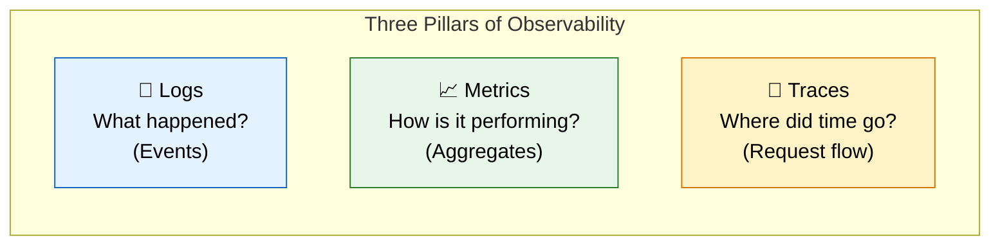
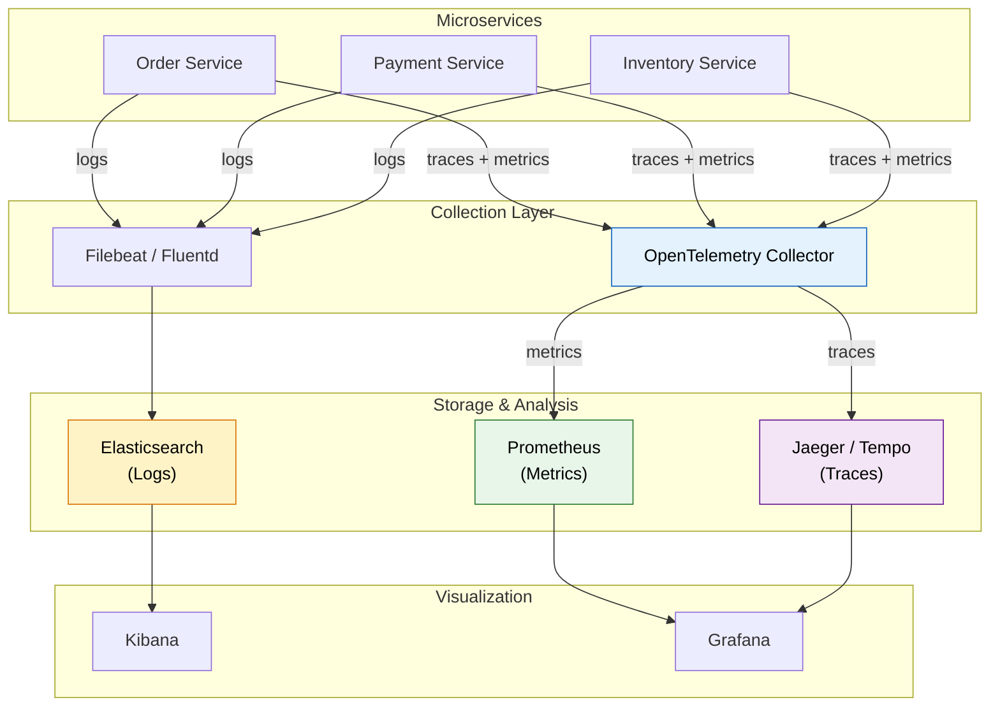
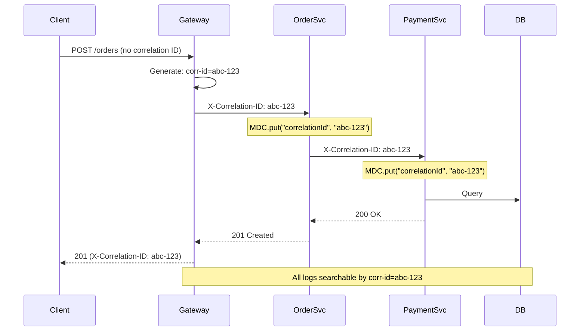
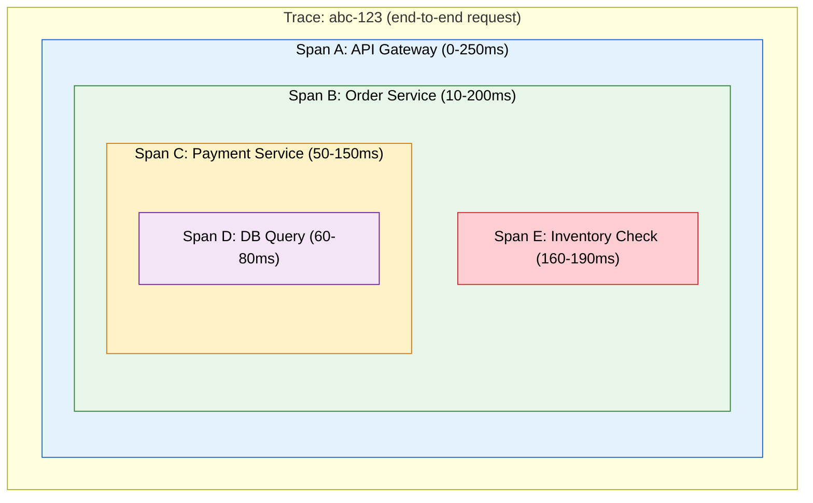
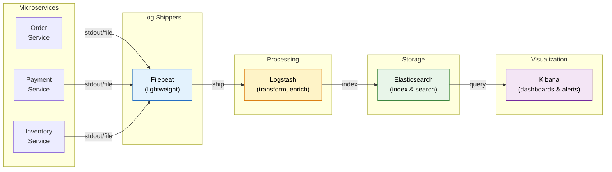
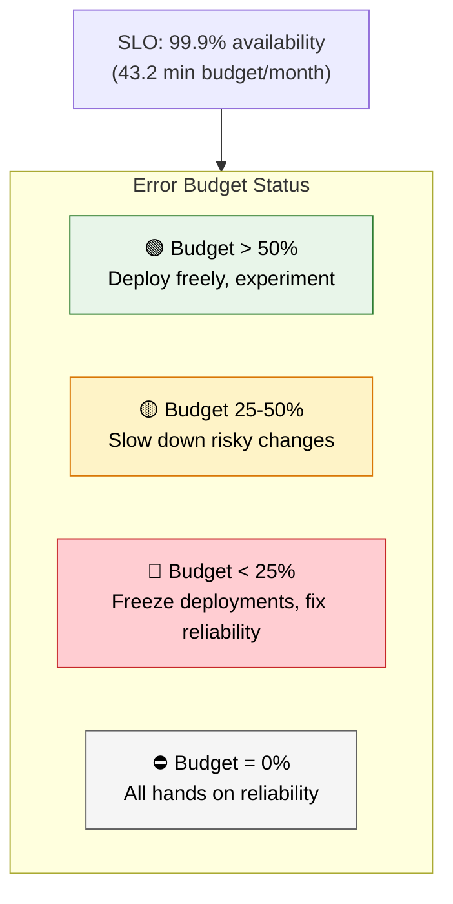
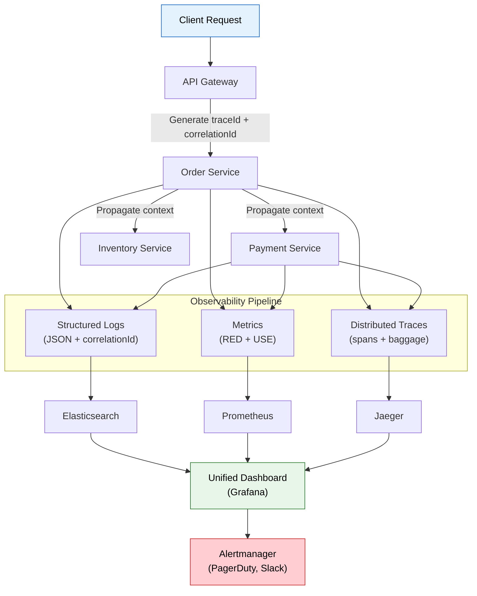

# 📊 Logging, Monitoring & Distributed Tracing

> **Achieve full observability across microservices — correlate logs, traces, and metrics to diagnose issues in seconds, not hours.**

---

!!! abstract "Real-World Analogy"
    Imagine managing a **city's transportation network**. **Logs** are like security cameras at every intersection — they record what happened. **Metrics** are the dashboard gauges showing traffic volume, average speed, and congestion levels. **Traces** are like a GPS tracker on a single package as it moves through warehouses, trucks, and delivery vans. You need all three to understand why a package arrived late.



---

## 🏗️ Observability Stack Architecture



---

## 📝 Structured Logging with SLF4J + Logback

### Why Structured Logging?

| Unstructured Log | Structured Log (JSON) |
|---|---|
| Hard to parse | Machine-readable |
| No correlation | Correlation ID included |
| Grep-based search | Field-based queries |
| `Order 12345 failed for user john` | `{"orderId":"12345","userId":"john","event":"ORDER_FAILED"}` |

### Logback Configuration for JSON Output

```xml
<!-- logback-spring.xml -->
<configuration>
    <springProperty scope="context" name="appName" source="spring.application.name"/>

    <appender name="CONSOLE" class="ch.qos.logback.core.ConsoleAppender">
        <encoder class="net.logstash.logback.encoder.LogstashEncoder">
            <includeMdcKeyName>correlationId</includeMdcKeyName>
            <includeMdcKeyName>userId</includeMdcKeyName>
            <includeMdcKeyName>spanId</includeMdcKeyName>
            <includeMdcKeyName>traceId</includeMdcKeyName>
            <customFields>{"service":"${appName}"}</customFields>
            <timeZone>UTC</timeZone>
        </encoder>
    </appender>

    <appender name="FILE" class="ch.qos.logback.core.rolling.RollingFileAppender">
        <file>logs/${appName}.log</file>
        <rollingPolicy class="ch.qos.logback.core.rolling.SizeAndTimeBasedRollingPolicy">
            <fileNamePattern>logs/${appName}-%d{yyyy-MM-dd}.%i.log.gz</fileNamePattern>
            <maxFileSize>100MB</maxFileSize>
            <maxHistory>30</maxHistory>
            <totalSizeCap>3GB</totalSizeCap>
        </rollingPolicy>
        <encoder class="net.logstash.logback.encoder.LogstashEncoder"/>
    </appender>

    <!-- Async wrapper to avoid blocking application threads -->
    <appender name="ASYNC_FILE" class="ch.qos.logback.classic.AsyncAppender">
        <queueSize>1024</queueSize>
        <discardingThreshold>0</discardingThreshold>
        <appender-ref ref="FILE"/>
    </appender>

    <root level="INFO">
        <appender-ref ref="CONSOLE"/>
        <appender-ref ref="ASYNC_FILE"/>
    </root>

    <!-- Reduce noisy libraries -->
    <logger name="org.hibernate.SQL" level="WARN"/>
    <logger name="org.apache.kafka" level="WARN"/>
    <logger name="org.springframework.web" level="INFO"/>
</configuration>
```

### JSON Log Output Example

```json
{
  "timestamp": "2026-05-12T14:23:45.123Z",
  "level": "ERROR",
  "logger": "com.example.order.OrderService",
  "message": "Payment processing failed",
  "service": "order-service",
  "traceId": "abc123def456",
  "spanId": "span789",
  "correlationId": "req-7f3a-4b2c",
  "userId": "user-42",
  "orderId": "ORD-98765",
  "exception": "com.example.PaymentDeclinedException: Insufficient funds",
  "stack_trace": "..."
}
```

---

## 🔑 MDC (Mapped Diagnostic Context) for Correlation IDs

MDC allows you to attach contextual data to every log statement in a request thread.

### Correlation ID Filter

```java
@Component
@Order(Ordered.HIGHEST_PRECEDENCE)
public class CorrelationIdFilter extends OncePerRequestFilter {

    private static final String CORRELATION_ID_HEADER = "X-Correlation-ID";

    @Override
    protected void doFilterInternal(HttpServletRequest request,
                                     HttpServletResponse response,
                                     FilterChain filterChain) throws ServletException, IOException {
        try {
            String correlationId = extractOrGenerateCorrelationId(request);
            MDC.put("correlationId", correlationId);
            MDC.put("userId", extractUserId(request));

            // Propagate correlation ID in response headers
            response.setHeader(CORRELATION_ID_HEADER, correlationId);

            filterChain.doFilter(request, response);
        } finally {
            MDC.clear(); // Prevent memory leaks in thread pools
        }
    }

    private String extractOrGenerateCorrelationId(HttpServletRequest request) {
        String correlationId = request.getHeader(CORRELATION_ID_HEADER);
        return (correlationId != null && !correlationId.isBlank())
                ? correlationId
                : UUID.randomUUID().toString();
    }

    private String extractUserId(HttpServletRequest request) {
        // Extract from JWT or security context
        Authentication auth = SecurityContextHolder.getContext().getAuthentication();
        return auth != null ? auth.getName() : "anonymous";
    }
}
```

### Propagating Correlation ID to Downstream Services

```java
@Configuration
public class RestClientConfig {

    @Bean
    public RestClient restClient(RestClient.Builder builder) {
        return builder
            .requestInterceptor((request, body, execution) -> {
                // Propagate correlation ID from MDC to outgoing requests
                String correlationId = MDC.get("correlationId");
                if (correlationId != null) {
                    request.getHeaders().set("X-Correlation-ID", correlationId);
                }
                return execution.execute(request, body);
            })
            .build();
    }
}
```



---

## 🔗 Distributed Tracing with OpenTelemetry

### How Traces Work



### Spring Boot + OpenTelemetry Setup

```xml
<!-- pom.xml dependencies -->
<dependency>
    <groupId>io.micrometer</groupId>
    <artifactId>micrometer-tracing-bridge-otel</artifactId>
</dependency>
<dependency>
    <groupId>io.opentelemetry</groupId>
    <artifactId>opentelemetry-exporter-otlp</artifactId>
</dependency>
<dependency>
    <groupId>io.micrometer</groupId>
    <artifactId>micrometer-registry-prometheus</artifactId>
</dependency>
```

```yaml
# application.yml
management:
  tracing:
    sampling:
      probability: 1.0  # 100% in dev, 0.1 (10%) in production
  otlp:
    tracing:
      endpoint: http://otel-collector:4318/v1/traces
    metrics:
      endpoint: http://otel-collector:4318/v1/metrics

logging:
  pattern:
    correlation: "[${spring.application.name:},%mdc{traceId:-},%mdc{spanId:-}] "
```

### Custom Spans for Business Operations

```java
@Service
@RequiredArgsConstructor
public class OrderService {

    private static final Logger log = LoggerFactory.getLogger(OrderService.class);
    private final ObservationRegistry observationRegistry;
    private final PaymentClient paymentClient;
    private final InventoryClient inventoryClient;

    public Order createOrder(CreateOrderRequest request) {
        return Observation.createNotStarted("order.create", observationRegistry)
            .lowCardinalityKeyValue("order.type", request.getType().name())
            .highCardinalityKeyValue("order.id", request.getOrderId())
            .observe(() -> {
                log.info("Creating order for customer={}, items={}",
                    request.getCustomerId(), request.getItems().size());

                // Each call creates a child span automatically
                InventoryResult inventory = inventoryClient.reserve(request.getItems());
                if (!inventory.isAvailable()) {
                    log.warn("Insufficient inventory for order={}", request.getOrderId());
                    throw new InsufficientInventoryException(request.getOrderId());
                }

                PaymentResult payment = paymentClient.charge(request.getPaymentDetails());
                if (!payment.isSuccess()) {
                    log.error("Payment failed for order={}, reason={}",
                        request.getOrderId(), payment.getDeclineReason());
                    inventoryClient.release(request.getItems());
                    throw new PaymentFailedException(payment.getDeclineReason());
                }

                Order order = Order.create(request, inventory, payment);
                log.info("Order created successfully orderId={}, total={}",
                    order.getId(), order.getTotal());
                return order;
            });
    }
}
```

### Async Trace Context Propagation

```java
@Configuration
@EnableAsync
public class AsyncConfig implements AsyncConfigurer {

    @Override
    public Executor getAsyncExecutor() {
        ThreadPoolTaskExecutor executor = new ThreadPoolTaskExecutor();
        executor.setCorePoolSize(10);
        executor.setMaxPoolSize(50);
        executor.setQueueCapacity(100);
        executor.setThreadNamePrefix("async-");
        executor.initialize();

        // Wrap executor to propagate trace context to async threads
        return ContextExecutorService.wrap(executor.getThreadPoolExecutor());
    }
}
```

---

## 📈 Metrics with Micrometer + Prometheus + Grafana

### Spring Boot Metrics Configuration

```yaml
# application.yml
management:
  endpoints:
    web:
      exposure:
        include: health,info,prometheus,metrics
  metrics:
    tags:
      application: ${spring.application.name}
      environment: ${ENVIRONMENT:dev}
    distribution:
      percentiles-histogram:
        http.server.requests: true
      slo:
        http.server.requests: 50ms,100ms,200ms,500ms,1s
```

### Custom Business Metrics

```java
@Service
@RequiredArgsConstructor
public class PaymentService {

    private static final Logger log = LoggerFactory.getLogger(PaymentService.class);
    private final MeterRegistry meterRegistry;
    private final PaymentGateway paymentGateway;

    private final Counter paymentSuccessCounter;
    private final Counter paymentFailureCounter;
    private final Timer paymentProcessingTimer;

    public PaymentService(MeterRegistry meterRegistry, PaymentGateway paymentGateway) {
        this.meterRegistry = meterRegistry;
        this.paymentGateway = paymentGateway;

        this.paymentSuccessCounter = Counter.builder("payments.processed")
            .tag("status", "success")
            .description("Number of successful payments")
            .register(meterRegistry);

        this.paymentFailureCounter = Counter.builder("payments.processed")
            .tag("status", "failure")
            .description("Number of failed payments")
            .register(meterRegistry);

        this.paymentProcessingTimer = Timer.builder("payments.duration")
            .description("Payment processing duration")
            .publishPercentiles(0.5, 0.95, 0.99)
            .register(meterRegistry);
    }

    public PaymentResult processPayment(PaymentRequest request) {
        return paymentProcessingTimer.record(() -> {
            try {
                PaymentResult result = paymentGateway.charge(request);
                paymentSuccessCounter.increment();

                // Track payment amount as distribution summary
                DistributionSummary.builder("payments.amount")
                    .tag("currency", request.getCurrency())
                    .register(meterRegistry)
                    .record(request.getAmount().doubleValue());

                log.info("Payment processed successfully paymentId={}, amount={}",
                    result.getPaymentId(), request.getAmount());
                return result;

            } catch (PaymentGatewayException e) {
                paymentFailureCounter.increment();
                meterRegistry.counter("payments.errors",
                    "type", e.getErrorCode(),
                    "gateway", request.getGateway()
                ).increment();

                log.error("Payment processing failed paymentId={}, error={}",
                    request.getPaymentId(), e.getErrorCode(), e);
                throw e;
            }
        });
    }

    // Gauge for active payment sessions (current state)
    @Scheduled(fixedRate = 30000)
    public void reportActivePayments() {
        Gauge.builder("payments.active_sessions", paymentGateway, PaymentGateway::getActiveSessions)
            .description("Currently active payment sessions")
            .register(meterRegistry);
    }
}
```

---

## 🚦 RED & USE Methodologies

### RED Method (for request-driven services)

| Metric | What to Measure | Prometheus Query Example |
|---|---|---|
| **R**ate | Requests per second | `rate(http_server_requests_seconds_count[5m])` |
| **E**rrors | Failed requests per second | `rate(http_server_requests_seconds_count{status=~"5.."}[5m])` |
| **D**uration | Latency distribution | `histogram_quantile(0.99, rate(http_server_requests_seconds_bucket[5m]))` |

### USE Method (for infrastructure resources)

| Metric | What to Measure | Example |
|---|---|---|
| **U**tilization | % time resource is busy | CPU usage, heap usage, connection pool usage |
| **S**aturation | Queue depth / backlog | Thread pool queue size, Kafka consumer lag |
| **E**rrors | Error events | OOM kills, connection timeouts, disk errors |

### Key Metrics Dashboard

```java
@Component
@RequiredArgsConstructor
public class SystemMetrics {

    private final MeterRegistry registry;
    private final DataSource dataSource;
    private final ThreadPoolTaskExecutor taskExecutor;

    @PostConstruct
    public void registerMetrics() {
        // Connection pool utilization (USE - Utilization)
        Gauge.builder("db.pool.active", dataSource, ds -> {
            HikariDataSource hds = (HikariDataSource) ds;
            return hds.getHikariPoolMXBean().getActiveConnections();
        }).register(registry);

        // Thread pool saturation (USE - Saturation)
        Gauge.builder("threadpool.queue.size", taskExecutor,
            e -> e.getThreadPoolExecutor().getQueue().size())
            .register(registry);

        // Thread pool utilization
        Gauge.builder("threadpool.active", taskExecutor,
            e -> e.getThreadPoolExecutor().getActiveCount())
            .register(registry);

        // JVM memory utilization
        Gauge.builder("jvm.heap.utilization", () ->
            (double) Runtime.getRuntime().totalMemory() / Runtime.getRuntime().maxMemory())
            .register(registry);
    }
}
```

---

## 📊 Centralized Logging: ELK Stack



### Logstash Pipeline Configuration

```ruby
# logstash.conf
input {
  beats {
    port => 5044
  }
}

filter {
  json {
    source => "message"
  }

  # Extract trace context for linking to Jaeger
  if [traceId] {
    mutate {
      add_field => { "trace_link" => "http://jaeger:16686/trace/%{traceId}" }
    }
  }

  # Enrich with GeoIP for client requests
  if [clientIp] {
    geoip {
      source => "clientIp"
    }
  }

  # Parse timestamps
  date {
    match => ["timestamp", "ISO8601"]
    target => "@timestamp"
  }
}

output {
  elasticsearch {
    hosts => ["elasticsearch:9200"]
    index => "logs-%{[service]}-%{+YYYY.MM.dd}"
    ilm_enabled => true
    ilm_rollover_alias => "logs"
    ilm_policy => "logs-lifecycle"
  }
}
```

---

## 🚨 Alerting: SLOs, SLIs, and Error Budgets

### Key Definitions

| Term | Definition | Example |
|---|---|---|
| **SLI** (Service Level Indicator) | A measurement of service behavior | 99.2% of requests < 200ms |
| **SLO** (Service Level Objective) | Target value for an SLI | 99.9% availability per month |
| **SLA** (Service Level Agreement) | Contract with consequences | 99.95% uptime or credits issued |
| **Error Budget** | Allowed failure = 1 - SLO | 0.1% = 43.2 min downtime/month |

### Prometheus Alerting Rules

```yaml
# prometheus-alerts.yml
groups:
  - name: slo-alerts
    rules:
      # SLO: 99.9% availability (error budget: 0.1%)
      - alert: HighErrorRate
        expr: |
          (
            sum(rate(http_server_requests_seconds_count{status=~"5.."}[5m]))
            /
            sum(rate(http_server_requests_seconds_count[5m]))
          ) > 0.001
        for: 5m
        labels:
          severity: critical
        annotations:
          summary: "Error rate exceeds SLO budget"
          description: "Error rate is {{ $value | humanizePercentage }} (SLO: 0.1%)"

      # SLO: p99 latency < 500ms
      - alert: HighLatency
        expr: |
          histogram_quantile(0.99,
            sum(rate(http_server_requests_seconds_bucket[5m])) by (le, service)
          ) > 0.5
        for: 5m
        labels:
          severity: warning
        annotations:
          summary: "p99 latency exceeds 500ms SLO"

      # Error budget burn rate (multi-window)
      - alert: ErrorBudgetBurnRate
        expr: |
          (
            sum(rate(http_server_requests_seconds_count{status=~"5.."}[1h]))
            /
            sum(rate(http_server_requests_seconds_count[1h]))
          ) > (14.4 * 0.001)
        for: 5m
        labels:
          severity: critical
        annotations:
          summary: "Burning error budget 14.4x faster than allowed"

      # Saturation: thread pool exhaustion
      - alert: ThreadPoolSaturation
        expr: |
          (threadpool_active / threadpool_max) > 0.9
        for: 2m
        labels:
          severity: warning
        annotations:
          summary: "Thread pool >90% utilized"
```

### Error Budget Tracking



---

## 📋 Log Levels Best Practices

| Level | When to Use | Example |
|---|---|---|
| **ERROR** | Something failed that needs immediate attention | Payment gateway timeout, database connection lost |
| **WARN** | Something unexpected but recoverable | Retry succeeded on 2nd attempt, cache miss fallback |
| **INFO** | Key business events and state changes | Order created, user logged in, deployment started |
| **DEBUG** | Detailed flow for troubleshooting (off in prod) | Request/response payloads, SQL parameters |
| **TRACE** | Extremely granular (never in prod) | Loop iterations, variable values |

### Anti-Patterns to Avoid

```java
// BAD: Logging sensitive data
log.info("User login: username={}, password={}", username, password);

// BAD: Logging inside tight loops
for (Item item : items) {
    log.debug("Processing item: {}", item);  // Could generate millions of logs
}

// BAD: String concatenation (evaluates even if level disabled)
log.debug("Order details: " + order.toString());

// GOOD: Parameterized logging (lazy evaluation)
log.debug("Order details: {}", order);

// GOOD: Guard expensive computations
if (log.isDebugEnabled()) {
    log.debug("Full payload: {}", objectMapper.writeValueAsString(largeObject));
}

// GOOD: Structured key-value pairs for searchability
log.info("Order processed orderId={} customerId={} total={} items={}",
    order.getId(), order.getCustomerId(), order.getTotal(), order.getItemCount());
```

---

## 🔧 Production Spring Boot Configuration

```yaml
# application-production.yml
spring:
  application:
    name: order-service

management:
  endpoints:
    web:
      exposure:
        include: health,info,prometheus
  endpoint:
    health:
      show-details: when-authorized
      probes:
        enabled: true
  metrics:
    tags:
      application: ${spring.application.name}
      region: ${REGION:us-east-1}
      instance: ${HOSTNAME:unknown}
    distribution:
      percentiles-histogram:
        http.server.requests: true
      minimum-expected-value:
        http.server.requests: 1ms
      maximum-expected-value:
        http.server.requests: 10s
  tracing:
    sampling:
      probability: 0.1  # Sample 10% in production
  otlp:
    tracing:
      endpoint: ${OTEL_EXPORTER_OTLP_ENDPOINT:http://otel-collector:4318/v1/traces}

logging:
  level:
    root: INFO
    com.example: INFO
    org.springframework.web: WARN
    org.hibernate: WARN
    org.apache.kafka: WARN
  pattern:
    correlation: "[${spring.application.name},%mdc{traceId:-},%mdc{spanId:-}] "
```

### Health Check with Observability

```java
@Component
public class DownstreamHealthIndicator implements HealthIndicator {

    private final RestClient restClient;
    private final MeterRegistry meterRegistry;
    private static final Logger log = LoggerFactory.getLogger(DownstreamHealthIndicator.class);

    @Override
    public Health health() {
        Timer.Sample sample = Timer.start(meterRegistry);
        try {
            ResponseEntity<Void> response = restClient.get()
                .uri("/actuator/health")
                .retrieve()
                .toBodilessEntity();

            sample.stop(Timer.builder("health.check.duration")
                .tag("target", "payment-service")
                .tag("status", "UP")
                .register(meterRegistry));

            return Health.up()
                .withDetail("payment-service", "reachable")
                .build();

        } catch (Exception e) {
            sample.stop(Timer.builder("health.check.duration")
                .tag("target", "payment-service")
                .tag("status", "DOWN")
                .register(meterRegistry));

            log.error("Health check failed for payment-service", e);
            return Health.down()
                .withDetail("payment-service", e.getMessage())
                .build();
        }
    }
}
```

---

## 📊 Complete Observability Flow



---

## 🎯 Interview Questions

??? question "1. What are the three pillars of observability, and how do they complement each other?"
    **Logs** record discrete events with full context (what happened). **Metrics** provide aggregated numerical measurements over time (how is the system performing). **Traces** track a single request across service boundaries (where did time go). They complement each other: metrics alert you to a problem (high error rate), traces help you find which service is slow, and logs explain why it failed. The correlation ID ties all three together — you can jump from an alert to a trace to the specific error log.

??? question "2. How do you propagate correlation IDs across microservices, including async communication?"
    For synchronous HTTP calls, use a servlet filter to extract or generate a correlation ID, store it in MDC (Mapped Diagnostic Context), and propagate via `X-Correlation-ID` header using an HTTP client interceptor. For async messaging (Kafka, RabbitMQ), include the correlation ID in message headers. For async threads within a service, use a custom TaskDecorator that copies MDC context to child threads. OpenTelemetry handles trace context propagation automatically via W3C TraceContext headers (`traceparent`, `tracestate`), which can also serve as correlation IDs.

??? question "3. Explain SLOs, SLIs, error budgets, and how they drive engineering decisions."
    An **SLI** is a quantitative measurement (e.g., 99.2% of requests served within 200ms). An **SLO** is the target (e.g., "99.9% of requests must succeed each month"). The **error budget** is `1 - SLO` — for 99.9%, that's 0.1% or ~43 minutes of downtime per month. When the budget is healthy, teams can deploy aggressively and experiment. When it's nearly exhausted, teams freeze feature work and focus on reliability. This creates a data-driven balance between velocity and stability — product teams want to ship fast, SREs want reliability, and the error budget gives an objective threshold.

??? question "4. What is the difference between the RED and USE methods? When do you use each?"
    **RED** (Rate, Errors, Duration) is for **request-driven services** — web servers, APIs, microservices. You measure how many requests/sec, what percentage fail, and latency distribution (p50, p95, p99). **USE** (Utilization, Saturation, Errors) is for **infrastructure resources** — CPU, memory, disk, network, connection pools, thread pools. You measure percentage busy, queue depth/backlog, and error counts. Use RED for your application layer and USE for the underlying resources. For example, if RED shows high latency, USE might reveal that the database connection pool is saturated (queue depth growing).

??? question "5. How would you design a production logging strategy that handles 10,000 requests/second?"
    Key decisions: (1) **Structured JSON logging** for machine parseability. (2) **Async appenders** with bounded queues to prevent logging from blocking request threads. (3) **Log level INFO in production** — never DEBUG/TRACE. (4) **Sampling** — log 100% of errors but only 10% of successful requests for high-volume endpoints. (5) **Centralized aggregation** — ship logs to ELK/Loki via lightweight shippers (Filebeat), not direct network appenders. (6) **Index lifecycle management** — hot/warm/cold tiers, auto-delete after 30 days. (7) **Rate limiting** on log shippers to protect Elasticsearch during log storms. (8) **Avoid logging request/response bodies** in production — use trace sampling for payload inspection.

??? question "6. How does OpenTelemetry distributed tracing work in Spring Boot, and how do you handle sampling in production?"
    Spring Boot integrates via Micrometer Tracing + OpenTelemetry bridge. Every incoming request starts a trace (unique traceId). Each operation creates a span (spanId, parentSpanId, timestamps, attributes). Context propagates via W3C `traceparent` header: `00-traceId-spanId-flags`. In production, you cannot trace 100% of requests (too expensive). Strategies: **Probabilistic sampling** (e.g., 10% of requests), **Rate-limiting** (max N traces/sec), **Tail-based sampling** at the collector (keep all traces with errors or high latency, sample healthy ones). The OpenTelemetry Collector acts as a pipeline — it receives spans, applies sampling decisions, and exports to backends like Jaeger or Tempo. Always trace 100% of errors regardless of sampling rate.
