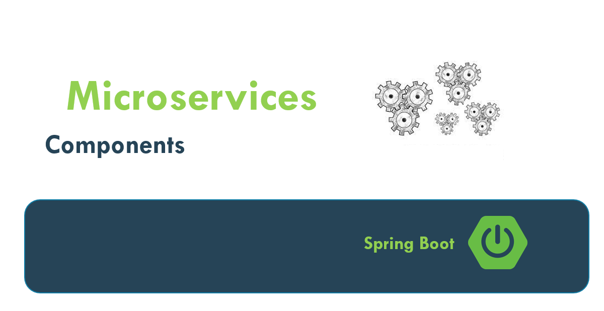

## What Is Monolithic Application?

- In Monolithic the application is build as a single
- Such application comprises client-side interface , server-side interface and a
- Normally a monolithic application have one large code and it lack