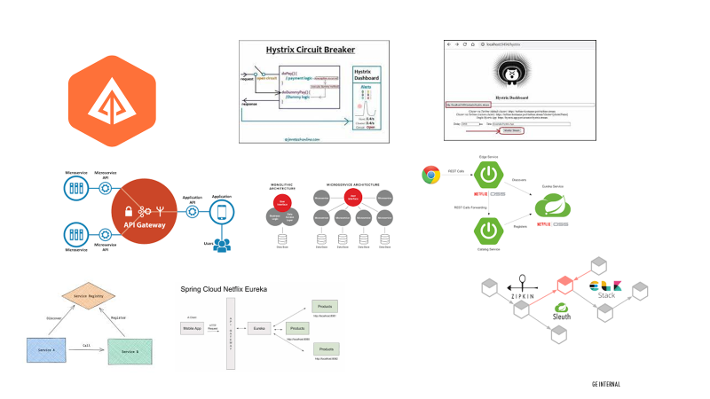
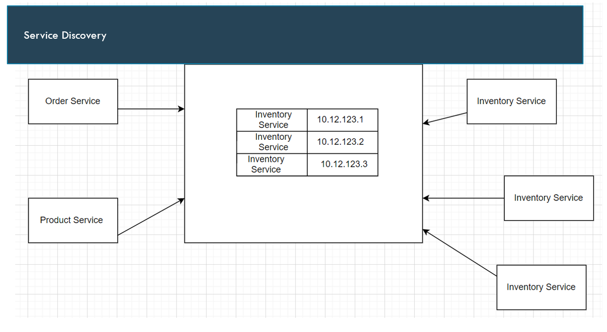

  
MicroServices

  

# What Is Monolithic Application?

- In Monolithic the application is build as a single
- Such application comprises client-side interface , server-side interface and a
- Normally a monolithic application have one large code and it lack

# Disadvantages Of Monolithic

- The code base get larger with time and hence it’s very difficult to
- It is very difficult to introduce new technology as it affects the whole
- A single bug in any module can bring down the whole
- It is very difficult to scale a single
- Continuous deployment is extremely Large monolithic applications are actually an obstacle to frequent deployments. In order to update one component , we have to redeploy the entire application.

## What Are Microservices?

While Monolithic Applications work as a single component , a MicroService Architecture breaks it down to independent standalone small applications , each serving one particular requirement .

Eg: 1 Micro service for handling product details and other service like user details ,

payment and inventory.

Within this microservice architecture, the entire functionality is split in independent

deployable module which communicate each other through Restful Web Services.

# Components

- Service Discovery
- API GATEWAY
- Spring Cloud Config Server
- Hystrix Circuit Breaker
- Zipkin and Sleuth
- Ribbon

# SERVICE REGISTRY (EUREKA SERVER)

- To maintain the port information of different micro services and to scaling up of the services we require service
- The service registry is an important part of service discovery
- The service registry is similar to a phone book where we maintain the phone number of contacts similarly service registry maintains services

information. So essentially this is a database containing the network locations of service instances where it’s running.

- Service instances need to be highly available and up to
- Clients can cache network locations obtained from the service registry and this information can become out of date and clients become unable to discover the service instances so a service registry consists of a cluster of servers that use a replication protocol to maintain consistency
- AWS, Kubernetes does not have a separate service registry but it’s inbuilt into the
- Example of service registry – Eureka Service registry by Netflix, Consul

**HOW** **TO REGISTER TO THE SERVICE REGISTRY?**

- Self Registration option – a service instance is responsible for registering and deregistering itself with the service Heartbeat requests will be sent out to go out of registry expirations. @EnableEurekaClient is being used by any eureka client is a good example of this
- Third-party registration option- in this case instead of service register/deregister itself another third party system manages track of all running it’s the kind of registrar who maintains all of this using polling or tracking all the services instances. Registrar project, Netflix Prana.