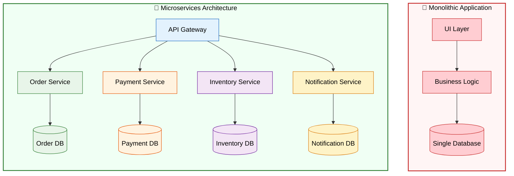
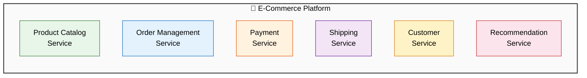
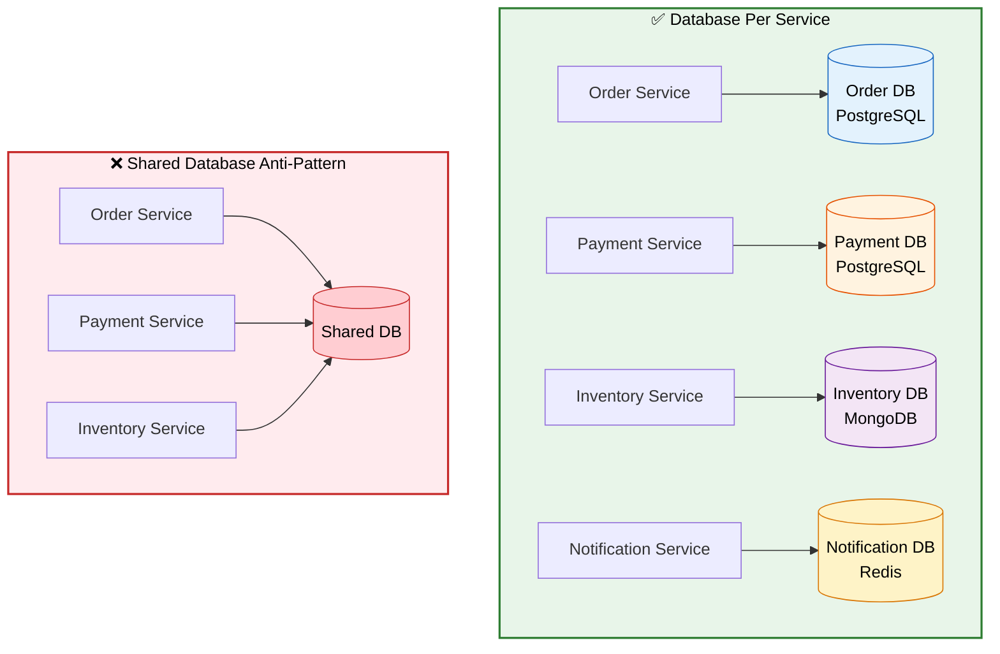
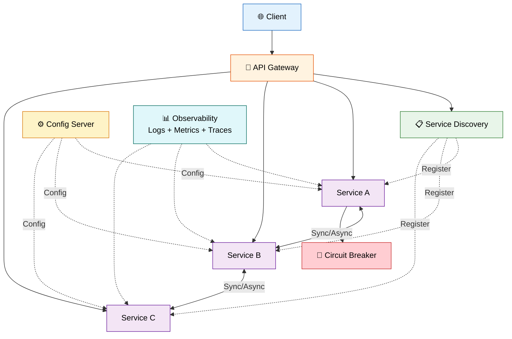

# 🏗️ Microservices Architecture

> **An architectural style that structures an application as a collection of small, autonomous services modeled around a business domain.**

---

!!! abstract "Real-World Analogy"
    Think of a **shopping mall** vs a **single mega-store**. In a mega-store (monolith), if the electronics section catches fire, the entire store shuts down. In a mall (microservices), each shop operates independently — if one shop closes for renovation, the rest of the mall continues business as usual. Each shop has its own staff, inventory, and cash register.

```mermaid
flowchart TB
    subgraph Monolith["🏢 Monolithic Application"]
        direction TB
        UI1["UI Layer"] --> BL1["Business Logic"]
        BL1 --> DB1[("Single Database")]
        style UI1 fill:#FFCDD2,stroke:#C62828,color:#000
        style BL1 fill:#FFCDD2,stroke:#C62828,color:#000
        style DB1 fill:#FFCDD2,stroke:#C62828,color:#000
    end

    subgraph Microservices["🏬 Microservices Architecture"]
        direction TB
        GW["API Gateway"] --> S1["Order Service"]
        GW --> S2["Payment Service"]
        GW --> S3["Inventory Service"]
        GW --> S4["Notification Service"]
        S1 --> DB2[("Order DB")]
        S2 --> DB3[("Payment DB")]
        S3 --> DB4[("Inventory DB")]
        S4 --> DB5[("Notification DB")]
        style GW fill:#E3F2FD,stroke:#1565C0,color:#000
        style S1 fill:#E8F5E9,stroke:#2E7D32,color:#000
        style S2 fill:#FFF3E0,stroke:#E65100,color:#000
        style S3 fill:#F3E5F5,stroke:#6A1B9A,color:#000
        style S4 fill:#FEF3C7,stroke:#D97706,color:#000
        style DB2 fill:#E8F5E9,stroke:#2E7D32,color:#000
        style DB3 fill:#FFF3E0,stroke:#E65100,color:#000
        style DB4 fill:#F3E5F5,stroke:#6A1B9A,color:#000
        style DB5 fill:#FEF3C7,stroke:#D97706,color:#000
    end

    style Monolith fill:#FFF5F5,stroke:#C62828,stroke-width:2px,color:#000
    style Microservices fill:#F0FFF4,stroke:#2E7D32,stroke-width:2px,color:#000
```

---

## 🏢 Monolithic Architecture

A monolithic application is built as a **single, unified unit**. All components — UI, business logic, data access — are tightly coupled and deployed together.

| Aspect | Monolithic |
|--------|-----------|
| Deployment | Single deployable unit |
| Scaling | Scale the entire application |
| Technology | Single tech stack |
| Database | Shared single database |
| Team Structure | One large team |
| Failure Impact | One bug can crash everything |

!!! warning "When Monoliths Become Painful"
    - Codebase grows massive (100k+ lines)
    - Deploy cycles become weeks instead of hours
    - A bug in one module brings down the entire system
    - Cannot scale individual components independently
    - New developers take months to understand the system

---

## 🏬 What Are Microservices?

Microservices architecture breaks an application into **small, independently deployable services**, each responsible for a specific business capability.

### Key Characteristics

| Characteristic | Description |
|---------------|-------------|
| **Single Responsibility** | Each service does one thing well |
| **Independently Deployable** | Deploy without affecting other services |
| **Decentralized Data** | Each service owns its database |
| **Technology Agnostic** | Each service can use different tech stack |
| **Fault Isolated** | Failure in one service doesn't cascade |
| **Organized Around Business** | Teams own entire business capabilities |
| **API-First** | Services communicate via well-defined APIs |

---

## ✅ Advantages of Microservices

| Advantage | Explanation |
|-----------|------------|
| **Independent Deployment** | Deploy changes to one service without redeploying the entire system |
| **Technology Freedom** | Use Java for Order Service, Python for ML recommendations |
| **Fault Isolation** | If Payment service fails, users can still browse products |
| **Scalability** | Scale only the services under heavy load |
| **Team Autonomy** | Small teams own and operate their services end-to-end |
| **Faster Time to Market** | Parallel development across teams |

---

## ❌ Disadvantages of Microservices

| Disadvantage | Explanation |
|-------------|------------|
| **Distributed System Complexity** | Network failures, eventual consistency, distributed tracing |
| **Data Consistency** | No ACID transactions across services |
| **Operational Overhead** | Need CI/CD, monitoring, logging for each service |
| **Testing Complexity** | Integration testing across services is hard |
| **Network Latency** | Service-to-service calls add latency |
| **Debugging Difficulty** | Tracing a request across 10 services is non-trivial |

!!! tip "Rule of Thumb"
    If your team is less than 10 people and your application is not complex, **start with a monolith** and extract microservices when you feel the pain. Premature decomposition is a common mistake.

---

## 🤔 When to Use / Not Use Microservices

=== "Use When"

    - Large, complex applications with multiple teams
    - Need to scale specific components independently
    - Different parts need different technology stacks
    - Rapid, independent deployment is critical
    - Organization follows Conway's Law (team per service)

=== "Avoid When"

    - Small team (< 10 developers)
    - Simple CRUD application
    - Strong consistency requirements across the system
    - Limited DevOps maturity (no CI/CD, no containerization)
    - Startup with unclear domain boundaries

---

## 🔪 Decomposition Strategies

### 1. Decompose by Business Capability

Align services with what the business **does**.

```mermaid
flowchart LR
    subgraph E-Commerce["🛒 E-Commerce Platform"]
        direction TB
        A["Product Catalog<br/>Service"] 
        B["Order Management<br/>Service"]
        C["Payment<br/>Service"]
        D["Shipping<br/>Service"]
        E["Customer<br/>Service"]
        F["Recommendation<br/>Service"]
    end
    
    style A fill:#E8F5E9,stroke:#2E7D32,color:#000
    style B fill:#E3F2FD,stroke:#1565C0,color:#000
    style C fill:#FFF3E0,stroke:#E65100,color:#000
    style D fill:#F3E5F5,stroke:#6A1B9A,color:#000
    style E fill:#FEF3C7,stroke:#D97706,color:#000
    style F fill:#FCE4EC,stroke:#C62828,color:#000
    style E-Commerce fill:#FAFAFA,stroke:#424242,stroke-width:2px,color:#000
```

### 2. Decompose by Subdomain (DDD)

Use **Domain-Driven Design** to identify bounded contexts.

| DDD Concept | Microservice Mapping |
|-------------|---------------------|
| Core Domain | Your competitive advantage (e.g., Recommendation Engine) |
| Supporting Domain | Necessary but not differentiating (e.g., Notification) |
| Generic Domain | Common, can be outsourced (e.g., Authentication) |

!!! tip "Bounded Context = Service Boundary"
    Each bounded context in DDD maps naturally to a microservice. The context boundary defines what the service owns — its data, its business rules, its API.

---

## 🗄️ Database Per Service Pattern

Each microservice owns its database — no sharing of data stores between services.

```mermaid
flowchart TB
    subgraph Correct["✅ Database Per Service"]
        O1["Order Service"] --> ODB[("Order DB<br/>PostgreSQL")]
        P1["Payment Service"] --> PDB[("Payment DB<br/>PostgreSQL")]
        I1["Inventory Service"] --> IDB[("Inventory DB<br/>MongoDB")]
        N1["Notification Service"] --> NDB[("Notification DB<br/>Redis")]
    end
    
    subgraph Wrong["❌ Shared Database Anti-Pattern"]
        O2["Order Service"] --> SDB[("Shared DB")]
        P2["Payment Service"] --> SDB
        I2["Inventory Service"] --> SDB
    end
    
    style Correct fill:#E8F5E9,stroke:#2E7D32,stroke-width:2px,color:#000
    style Wrong fill:#FFEBEE,stroke:#C62828,stroke-width:2px,color:#000
    style ODB fill:#E3F2FD,stroke:#1565C0,color:#000
    style PDB fill:#FFF3E0,stroke:#E65100,color:#000
    style IDB fill:#F3E5F5,stroke:#6A1B9A,color:#000
    style NDB fill:#FEF3C7,stroke:#D97706,color:#000
    style SDB fill:#FFCDD2,stroke:#C62828,color:#000
```

**Why Database Per Service?**

- **Loose Coupling** — Services are truly independent
- **Technology Freedom** — Use the best DB for each use case (SQL, NoSQL, Graph)
- **Independent Scaling** — Scale data tier per service need
- **Failure Isolation** — One DB going down doesn't affect others

**Challenge:** Cross-service queries require the Saga pattern or API Composition.

---

## 🧩 Core Components of a Microservices Ecosystem

```mermaid
flowchart TB
    Client["🌐 Client"] --> GW["🚪 API Gateway"]
    GW --> SD["📋 Service Discovery"]
    GW --> S1["Service A"]
    GW --> S2["Service B"]
    GW --> S3["Service C"]
    S1 <-->|"Sync/Async"| S2
    S2 <-->|"Sync/Async"| S3
    S1 --> CB["🔌 Circuit Breaker"]
    SD -.->|"Register"| S1
    SD -.->|"Register"| S2
    SD -.->|"Register"| S3
    CS["⚙️ Config Server"] -.->|"Config"| S1
    CS -.->|"Config"| S2
    CS -.->|"Config"| S3
    OB["📊 Observability<br/>Logs + Metrics + Traces"] -.-> S1
    OB -.-> S2
    OB -.-> S3
    
    style Client fill:#E3F2FD,stroke:#1565C0,color:#000
    style GW fill:#FFF3E0,stroke:#E65100,color:#000
    style SD fill:#E8F5E9,stroke:#2E7D32,color:#000
    style S1 fill:#F3E5F5,stroke:#6A1B9A,color:#000
    style S2 fill:#F3E5F5,stroke:#6A1B9A,color:#000
    style S3 fill:#F3E5F5,stroke:#6A1B9A,color:#000
    style CB fill:#FFCDD2,stroke:#C62828,color:#000
    style CS fill:#FEF3C7,stroke:#D97706,color:#000
    style OB fill:#E0F7FA,stroke:#00695C,color:#000
```

| Component | Purpose |
|-----------|---------|
| **API Gateway** | Single entry point, routing, auth, rate limiting |
| **Service Discovery** | Dynamic registry of service instances |
| **Circuit Breaker** | Prevent cascading failures |
| **Config Server** | Centralized external configuration |
| **Observability** | Logs, metrics, distributed tracing |
| **Message Broker** | Async communication between services |

---

## 🎯 Interview Q&A

??? question "Q1: What is the difference between Monolithic and Microservices architecture?"
    **Monolithic** = single deployable unit with shared database and tightly coupled components. **Microservices** = independently deployable services, each with its own database, communicating via APIs. Key trade-off: simplicity vs scalability and team autonomy.

??? question "Q2: What is the Database per Service pattern and why is it important?"
    Each microservice has its private database. This ensures loose coupling — services can't bypass APIs and directly access another service's data. It enables independent deployment, technology freedom (SQL vs NoSQL), and fault isolation.

??? question "Q3: How do you handle transactions that span multiple services?"
    Use the **Saga Pattern** — either choreography (event-driven) or orchestration (central coordinator). Each service performs its local transaction and publishes events. Compensating transactions handle rollbacks.

??? question "Q4: How do you decide service boundaries?"
    Use **Domain-Driven Design (DDD)** — identify bounded contexts. Each bounded context becomes a service. Alternatively, decompose by business capability. Avoid decomposing by technical layer (UI service, DB service).

??? question "Q5: What are the challenges of microservices?"
    1. Distributed system complexity (network failures, latency)
    2. Data consistency (eventual consistency)
    3. Operational overhead (monitoring, CI/CD per service)
    4. Testing complexity (integration tests across services)
    5. Debugging difficulty (distributed tracing needed)

??? question "Q6: What is Conway's Law and how does it relate to microservices?"
    Conway's Law states that system design mirrors organization communication structure. In microservices, you structure teams around business capabilities — each team owns one or more services end-to-end (you build it, you run it).

??? question "Q7: When would you NOT recommend microservices?"
    - Small team or simple application
    - Startup with unclear domain boundaries
    - Strong consistency requirements
    - No DevOps maturity (no CI/CD, containers, or monitoring)
    - Greenfield project where you don't understand the domain yet

---

## Related Topics

- [Inter-Service Communication](InterServiceCommunication.md) — How services talk to each other
- [API Gateway](APIGATEWAY.md) — Single entry point for clients
- [Service Discovery](ServiceDiscovery.md) — Dynamic service registration
- [Circuit Breaker](CircuitBreaker.md) — Resilience patterns
- [Saga Pattern](SagaDesignPattern.md) — Distributed transactions
- [Observability](Observability.md) — Monitoring and tracing
