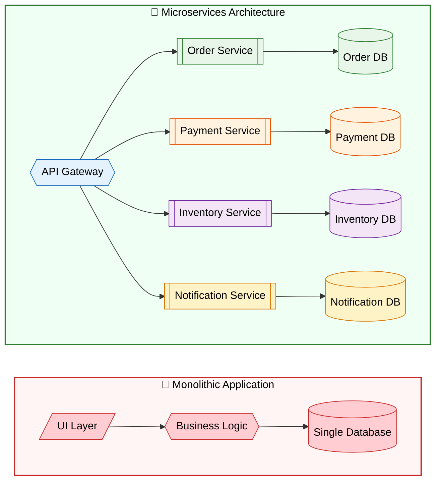
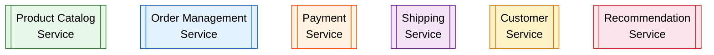
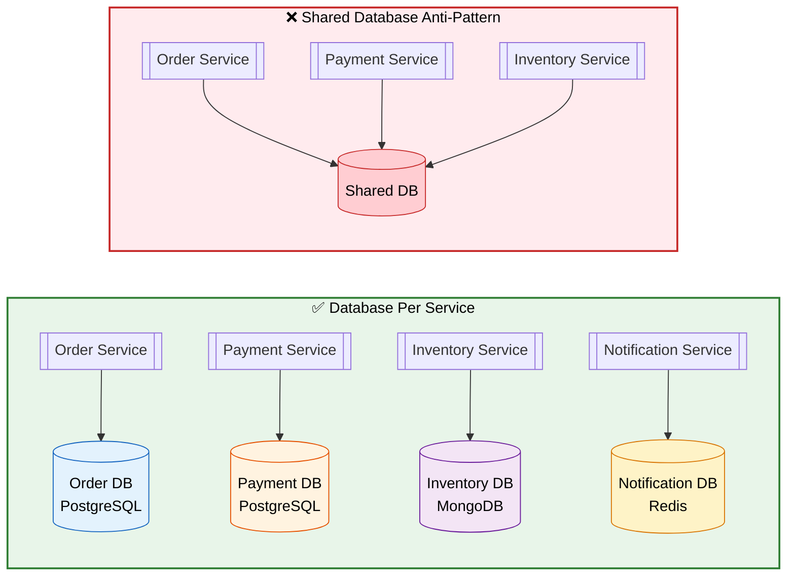
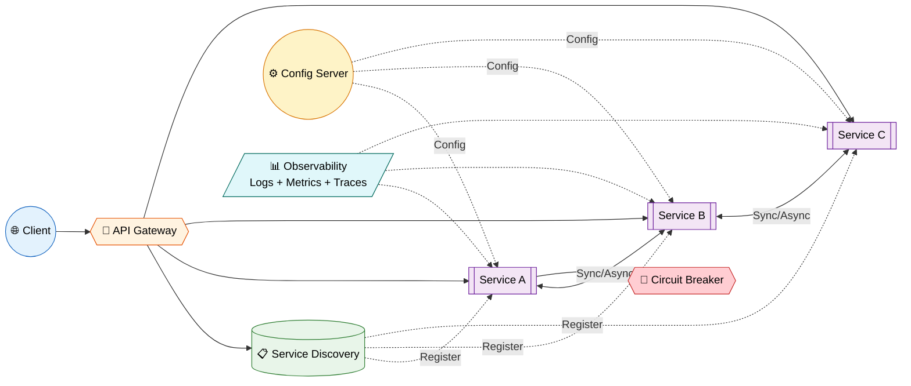

# Microservices Architecture

> **An architectural style that structures an application as a collection of small, autonomous services modeled around a business domain.**

---

!!! abstract "Real-World Analogy"
    Think of a **shopping mall** vs a **single mega-store**. In a mega-store (monolith), if the electronics section catches fire, the entire store shuts down. In a mall (microservices), each shop operates independently — if one shop closes for renovation, the rest of the mall continues business as usual. Each shop has its own staff, inventory, and cash register.

```mermaid
flowchart LR
    subgraph Monolith["🏢 Monolithic Application"]
        direction LR
        UI1[/"UI Layer"/] --> BL1{{"Business Logic"}}
        BL1 --> DB1[("Single Database")]
        style UI1 fill:#FFCDD2,stroke:#C62828,color:#000
        style BL1 fill:#FFCDD2,stroke:#C62828,color:#000
        style DB1 fill:#FFCDD2,stroke:#C62828,color:#000
    end

    subgraph Microservices["🏬 Microservices Architecture"]
        direction LR
        GW{{"API Gateway"}} --> S1[["Order Service"]]
        GW --> S2[["Payment Service"]]
        GW --> S3[["Inventory Service"]]
        GW --> S4[["Notification Service"]]
        S1 --> DB2[("Order DB")]
        S2 --> DB3[("Payment DB")]
        S3 --> DB4[("Inventory DB")]
        S4 --> DB5[("Notification DB")]
        style GW fill:#E3F2FD,stroke:#1565C0,color:#000
        style S1 fill:#E8F5E9,stroke:#2E7D32,color:#000
        style S2 fill:#FFF3E0,stroke:#E65100,color:#000
        style S3 fill:#F3E5F5,stroke:#6A1B9A,color:#000
        style S4 fill:#FEF3C7,stroke:#D97706,color:#000
        style DB2 fill:#E8F5E9,stroke:#2E7D32,color:#000
        style DB3 fill:#FFF3E0,stroke:#E65100,color:#000
        style DB4 fill:#F3E5F5,stroke:#6A1B9A,color:#000
        style DB5 fill:#FEF3C7,stroke:#D97706,color:#000
    end

    style Monolith fill:#FFF5F5,stroke:#C62828,stroke-width:2px,color:#000
    style Microservices fill:#F0FFF4,stroke:#2E7D32,stroke-width:2px,color:#000
```

---

## Monolithic Architecture

A monolithic application is built as a **single, unified unit**. All components — UI, business logic, data access — are tightly coupled and deployed together as one artifact (a single WAR or JAR file).

In the early stages of a project, monoliths are the right choice. They are simple to develop, test, deploy, and debug. A single codebase means you can trace any request from HTTP to database in one IDE. Transactions are ACID by default because everything shares one database.

The problems emerge as the application grows:

| Aspect | Monolithic |
|--------|-----------|
| **Deployment** | Single deployable unit — changing one line requires redeploying the entire application |
| **Scaling** | Scale the entire application even if only one module is under load |
| **Technology** | Locked into a single tech stack — migrating one module means migrating everything |
| **Database** | Shared single database — schema changes require coordination across all teams |
| **Team Structure** | One large team — merge conflicts, long code reviews, coordination overhead |
| **Failure Impact** | One bug or memory leak can crash the entire system |
| **Build Time** | Full builds can take 30+ minutes as the codebase grows |

!!! warning "When Monoliths Become Painful"
    - Codebase exceeds 100k+ lines and no single person understands the whole system
    - Deploy cycles stretch from hours to weeks because of risk and coordination
    - A memory leak in the reporting module takes down the entire checkout flow
    - You need Python for the ML recommendation engine but the whole app is Java
    - New developers take months to become productive because of the tangled dependencies
    - Feature branches live for weeks, leading to painful merge conflicts

!!! tip "Monolith First"
    Martin Fowler's advice: **start with a monolith**. You don't have enough domain knowledge at the beginning to draw good service boundaries. A poorly decomposed microservice architecture is worse than a well-structured monolith. Build the monolith, learn the domain, identify the seams, then extract services.

---

## What Are Microservices?

Microservices architecture breaks an application into **small, independently deployable services**, each responsible for a specific business capability. Each service runs in its own process, owns its own data, and communicates with other services through well-defined APIs.

The term was popularized by Martin Fowler and James Lewis in 2014, but the ideas trace back to Unix philosophy ("do one thing well") and SOA (Service-Oriented Architecture). The key difference from SOA is that microservices favor lightweight protocols (HTTP/REST, gRPC, messaging) over heavyweight enterprise service buses.

### Key Characteristics

| Characteristic | Description | Real-World Example |
|---------------|-------------|-------------------|
| **Single Responsibility** | Each service does one thing well | Netflix: separate services for recommendations, streaming, billing, user profiles |
| **Independently Deployable** | Deploy one service without touching others | Amazon deploys thousands of times per day — each team deploys independently |
| **Decentralized Data** | Each service owns its database | Uber: trips in PostgreSQL, maps in graph DB, surge pricing in Redis |
| **Technology Agnostic** | Each service can use different tech stack | Spotify: Java for backend services, Python for ML, Go for infrastructure |
| **Fault Isolated** | Failure in one service doesn't cascade | Netflix: if recommendations fail, users still see a generic list and can still stream |
| **Organized Around Business** | Teams own entire business capabilities | Amazon's "two-pizza teams" — each team owns a service end-to-end |
| **API-First** | Services communicate via well-defined contracts | gRPC with protobuf schemas, OpenAPI specifications for REST |

!!! info "How Small is 'Micro'?"
    There's no universal size rule. A better question is: can a single team (5-8 people) own and operate this service end-to-end? Can it be rewritten from scratch in 2-4 weeks? If yes, the size is probably right. Services that are too small create excessive network overhead and operational complexity. Services that are too large defeat the purpose.

---

## Advantages of Microservices

| Advantage | Explanation | Impact |
|-----------|------------|--------|
| **Independent Deployment** | Deploy changes to one service without redeploying the entire system | Faster release cycles — from monthly to multiple times per day |
| **Technology Freedom** | Use Java for Order Service, Python for ML recommendations, Go for real-time messaging | Pick the right tool for each problem |
| **Fault Isolation** | If the Payment service fails, users can still browse products and add to cart | Higher overall system availability |
| **Granular Scaling** | Scale only the services under heavy load (e.g., 50 instances of Search, 3 instances of Billing) | Better resource utilization, lower infrastructure cost |
| **Team Autonomy** | Small teams own their services end-to-end — build, deploy, monitor, on-call | Faster decision-making, less coordination overhead |
| **Faster Time to Market** | Parallel development across teams — no waiting for other teams' code to merge | Features ship independently |
| **Easier to Understand** | Each service is small enough for a developer to fully comprehend | Faster onboarding, fewer bugs from misunderstanding |
| **Resilience** | Circuit breakers, retries, and fallbacks prevent cascading failures | The system degrades gracefully instead of crashing entirely |

---

## Disadvantages of Microservices

| Disadvantage | Explanation | Mitigation |
|-------------|------------|------------|
| **Distributed System Complexity** | Network failures, timeouts, partial failures are now everyday reality | Circuit breakers, retries with backoff, idempotent APIs |
| **Data Consistency** | No ACID transactions across services — eventual consistency is the norm | Saga pattern (choreography or orchestration) |
| **Operational Overhead** | Each service needs its own CI/CD pipeline, monitoring, logging, alerting | Platform engineering team, standardized templates |
| **Testing Complexity** | Integration testing across 20 services is exponentially harder than testing one monolith | Contract testing (Pact), service virtualization |
| **Network Latency** | Service-to-service calls add 1-10ms per hop — a request touching 5 services adds up | Async communication where possible, caching, data locality |
| **Debugging Difficulty** | Tracing a single request across 10 services requires distributed tracing | Jaeger/Zipkin, correlation IDs, structured logging |
| **Deployment Complexity** | Managing 50+ services requires container orchestration | Kubernetes, Helm charts, GitOps |
| **Service Discovery** | Services need to find each other dynamically as instances scale up/down | Eureka, Consul, or Kubernetes DNS |

!!! tip "Rule of Thumb"
    If your team is less than 10 people and your application is not complex, **start with a monolith** and extract microservices when you feel the pain. Premature decomposition is one of the most common and expensive mistakes in software architecture.

---

## When to Use / Not Use Microservices

=== "Use When"

    - **Large organization** with multiple teams that need to ship independently
    - **Complex domain** with clear bounded contexts (e.g., e-commerce: orders, payments, inventory, shipping)
    - **Different scaling requirements** — search gets 1000x more traffic than admin dashboard
    - **Different technology needs** — ML pipeline in Python, transaction engine in Java, real-time chat in Go
    - **Rapid, independent deployment** is a business requirement — you can't wait for other teams
    - **Organizational maturity** — you have CI/CD, containerization, monitoring, and on-call culture
    - **The monolith is genuinely painful** — merge conflicts, long build times, coupled failures

=== "Avoid When"

    - **Small team** (fewer than 10 developers) — the overhead will slow you down
    - **Simple CRUD application** — microservices add complexity without proportional benefit
    - **Strong consistency requirements** — financial systems that need ACID across all operations
    - **No DevOps maturity** — no CI/CD, no containers, no monitoring means operational chaos
    - **Startup with unclear domain** — you don't know enough to draw good service boundaries yet
    - **Tight budget** — the infrastructure cost of running 20+ services is significantly higher than one monolith
    - **Team lacks distributed systems experience** — the learning curve is steep

---

## Decomposition Strategies

The hardest part of microservices is deciding where to draw the boundaries. Get this wrong, and you end up with a distributed monolith — all the complexity of microservices with none of the benefits.

### 1. Decompose by Business Capability

Align services with what the business **does**, not with technical layers. Each service maps to a business function that would exist regardless of technology.

```mermaid
flowchart LR
    A[["Product Catalog<br/>Service"]] ~~~ B[["Order Management<br/>Service"]] ~~~ C[["Payment<br/>Service"]]
    C ~~~ D[["Shipping<br/>Service"]] ~~~ E[["Customer<br/>Service"]] ~~~ F[["Recommendation<br/>Service"]]

    style A fill:#E8F5E9,stroke:#2E7D32,color:#000
    style B fill:#E3F2FD,stroke:#1565C0,color:#000
    style C fill:#FFF3E0,stroke:#E65100,color:#000
    style D fill:#F3E5F5,stroke:#6A1B9A,color:#000
    style E fill:#FEF3C7,stroke:#D97706,color:#000
    style F fill:#FCE4EC,stroke:#C62828,color:#000
```

This is the most common and recommended approach. Ask: "If this business function were outsourced to an external company, what would the API contract look like?" That boundary is your service boundary.

**Real-world examples:**

- **Amazon** decomposed by business capability: product catalog, order management, fulfillment, recommendations, payments — each owned by a "two-pizza team"
- **Uber** organized services around business capabilities: rides, drivers, pricing, mapping, payments, notifications
- **Netflix** split into services like streaming, recommendations, user profiles, billing, content metadata

### 2. Decompose by Subdomain (DDD)

Use **Domain-Driven Design** to identify bounded contexts. A bounded context is a logical boundary within which a particular domain model applies. The same word (e.g., "account") can mean different things in different contexts.

| DDD Concept | Microservice Mapping | Example |
|-------------|---------------------|---------|
| **Core Domain** | Your competitive advantage — invest the most here | Recommendation engine at Netflix, pricing algorithm at Uber |
| **Supporting Domain** | Necessary but not differentiating | Notification service, reporting service |
| **Generic Domain** | Common, can be outsourced or use SaaS | Authentication (use Auth0), email (use SendGrid), payments (use Stripe) |

!!! tip "Bounded Context = Service Boundary"
    Each bounded context in DDD maps naturally to a microservice. The context boundary defines what the service owns — its data, its business rules, its API. In the "Order" context, a Customer is an ID + shipping address. In the "Marketing" context, a Customer is preferences + engagement history. These should be different services with different data models.

### 3. Strangler Fig Pattern (Migration from Monolith)

Named after strangler fig trees that grow around a host tree and eventually replace it. Instead of a risky big-bang rewrite, you incrementally extract services from the monolith:

1. **Identify a seam** — a module with clear boundaries and minimal coupling to the rest
2. **Build the new service** that implements the same functionality
3. **Route traffic** to the new service (using an API gateway or reverse proxy)
4. **Remove the old code** from the monolith once the new service is proven
5. **Repeat** for the next module

!!! example "Migration in Practice"
    A common first extraction is the **authentication service** — it has a clear API (login, register, validate token), minimal coupling to business logic, and high reuse potential. Other good first candidates: notification service, file upload service, or search service.

---

## Database Per Service Pattern

Each microservice owns its database — no sharing of data stores between services. This is non-negotiable in a true microservices architecture.

```mermaid
flowchart LR
    subgraph Correct["✅ Database Per Service"]
        O1[["Order Service"]] --> ODB[("Order DB<br/>PostgreSQL")]
        P1[["Payment Service"]] --> PDB[("Payment DB<br/>PostgreSQL")]
        I1[["Inventory Service"]] --> IDB[("Inventory DB<br/>MongoDB")]
        N1[["Notification Service"]] --> NDB[("Notification DB<br/>Redis")]
    end
    
    subgraph Wrong["❌ Shared Database Anti-Pattern"]
        O2[["Order Service"]] --> SDB[("Shared DB")]
        P2[["Payment Service"]] --> SDB
        I2[["Inventory Service"]] --> SDB
    end
    
    style Correct fill:#E8F5E9,stroke:#2E7D32,stroke-width:2px,color:#000
    style Wrong fill:#FFEBEE,stroke:#C62828,stroke-width:2px,color:#000
    style ODB fill:#E3F2FD,stroke:#1565C0,color:#000
    style PDB fill:#FFF3E0,stroke:#E65100,color:#000
    style IDB fill:#F3E5F5,stroke:#6A1B9A,color:#000
    style NDB fill:#FEF3C7,stroke:#D97706,color:#000
    style SDB fill:#FFCDD2,stroke:#C62828,color:#000
```

**Benefits of Database Per Service:**

- **Loose Coupling** — Services are truly independent; schema changes in one service don't break others
- **Technology Freedom** — Use PostgreSQL for orders (relational), MongoDB for product catalog (document), Redis for sessions (key-value), Neo4j for social graph (graph)
- **Independent Scaling** — Scale each database independently based on its load profile
- **Failure Isolation** — If the inventory database goes down, orders and payments continue working

**Challenges and Solutions:**

| Challenge | Solution |
|-----------|---------|
| Cross-service queries ("show order with payment status") | **API Composition** — the API gateway or a composite service calls both services and joins the results |
| Data consistency across services | **Saga Pattern** — choreography (events) or orchestration (coordinator) for distributed transactions |
| Reporting across all services | **CQRS** — maintain a read-optimized view that aggregates data from multiple services via events |
| Data duplication | Accept it — services can store denormalized copies of data they need (via events), trading storage for independence |
| Referential integrity | Enforce at the application level, not the database level — services validate via API calls |

!!! warning "Shared Database Anti-Pattern"
    If two services access the same database table, you have a distributed monolith. Schema changes require coordinating both services. You can't deploy independently. You can't scale independently. You've gotten all the complexity of microservices with none of the benefits.

---

## Communication Patterns

Services need to talk to each other. The communication style you choose has major implications for coupling, resilience, and performance.

### Synchronous Communication

The caller sends a request and **waits** for a response. Simple but creates temporal coupling — if the downstream service is slow or down, the caller is blocked.

| Protocol | Best For | Trade-offs |
|----------|----------|------------|
| **REST (HTTP/JSON)** | CRUD operations, public APIs, simple request-response | Human-readable, widely supported, but verbose and slow for internal calls |
| **gRPC (HTTP/2 + Protobuf)** | Internal service-to-service calls, streaming, high performance | 10x faster than REST, type-safe contracts, but harder to debug |
| **GraphQL** | Client-facing APIs where clients need flexible queries | Eliminates over/under-fetching, but adds complexity on the server |

### Asynchronous Communication

The caller sends a message and **doesn't wait**. The receiver processes it when ready. This decouples services in time — they don't need to be available simultaneously.

| Pattern | Best For | Technologies |
|---------|----------|-------------|
| **Event-driven (pub/sub)** | Broadcasting state changes ("order created", "payment completed") | Kafka, RabbitMQ, AWS SNS/SQS |
| **Command queue** | Work distribution, background processing | Kafka, RabbitMQ, Redis Streams |
| **Event sourcing** | Audit trails, temporal queries, complex state machines | Kafka + event store |

!!! tip "Choose Async by Default"
    For internal service-to-service communication, prefer async messaging over synchronous REST calls. Async communication is more resilient (the consumer can be temporarily down), enables better scaling (consumers process at their own pace), and reduces cascading failures. Use synchronous calls only when you need an immediate response (e.g., validating a credit card during checkout).

→ Deep dive: [Inter-Service Communication](InterServiceCommunication.md) | [Async with Kafka](AsyncCommunicationUsingKafka.md) | [gRPC](grpc.md)

---

## Core Components of a Microservices Ecosystem

```mermaid
flowchart LR
    Client(("🌐 Client")) --> GW{{"🚪 API Gateway"}}
    GW --> SD[("📋 Service Discovery")]
    GW --> S1[["Service A"]]
    GW --> S2[["Service B"]]
    GW --> S3[["Service C"]]
    S1 <-->|"Sync/Async"| S2
    S2 <-->|"Sync/Async"| S3
    S1 --> CB{{"🔌 Circuit Breaker"}}
    SD -.->|"Register"| S1
    SD -.->|"Register"| S2
    SD -.->|"Register"| S3
    CS(("⚙️ Config Server")) -.->|"Config"| S1
    CS -.->|"Config"| S2
    CS -.->|"Config"| S3
    OB[/"📊 Observability<br/>Logs + Metrics + Traces"/] -.-> S1
    OB -.-> S2
    OB -.-> S3
    
    style Client fill:#E3F2FD,stroke:#1565C0,color:#000
    style GW fill:#FFF3E0,stroke:#E65100,color:#000
    style SD fill:#E8F5E9,stroke:#2E7D32,color:#000
    style S1 fill:#F3E5F5,stroke:#6A1B9A,color:#000
    style S2 fill:#F3E5F5,stroke:#6A1B9A,color:#000
    style S3 fill:#F3E5F5,stroke:#6A1B9A,color:#000
    style CB fill:#FFCDD2,stroke:#C62828,color:#000
    style CS fill:#FEF3C7,stroke:#D97706,color:#000
    style OB fill:#E0F7FA,stroke:#00695C,color:#000
```

### API Gateway

The **single entry point** for all client requests. Instead of clients calling 20 different services directly (and knowing all their addresses), they call one gateway that routes requests to the right service.

Responsibilities: request routing, authentication/authorization, rate limiting, response aggregation, SSL termination, request/response transformation, caching.

Technologies: Spring Cloud Gateway, Kong, AWS API Gateway, Envoy, NGINX.

→ Deep dive: [API Gateway](APIGATEWAY.md) | [API Gateway Patterns](api-gateway-patterns.md)

### Service Discovery

In a dynamic environment where service instances spin up and down (auto-scaling, deployments, failures), services need a way to find each other. Service Discovery maintains a registry of all running instances and their network locations.

**How it works:** When a service instance starts, it registers itself (IP, port, health URL) with the discovery server. When another service needs to call it, it queries the discovery server for available instances and picks one (client-side load balancing).

Technologies: Netflix Eureka, HashiCorp Consul, Kubernetes DNS (built-in).

→ Deep dive: [Service Discovery](ServiceDiscovery.md)

### Circuit Breaker

When a downstream service is failing, a circuit breaker **stops calling it** temporarily to prevent cascading failures. It's like an electrical circuit breaker that trips to prevent a short circuit from burning down the house.

**Three states:** CLOSED (normal — requests flow through), OPEN (tripped — requests fail immediately with a fallback), HALF-OPEN (testing — allow a few requests to check if the downstream service has recovered).

Technologies: Resilience4j (recommended), Spring Cloud Circuit Breaker, Hystrix (deprecated).

→ Deep dive: [Circuit Breaker](CircuitBreaker.md) | [Resilience Patterns](resilience-patterns.md)

### Config Server

Centralized configuration management for all services. Instead of each service having its own `application.yml` with hardcoded values, all configuration is stored in a central location (Git repo, Consul, Vault) and fetched at startup.

Benefits: change configuration without redeploying, environment-specific configs (dev/staging/prod), secrets management, configuration auditing.

Technologies: Spring Cloud Config, HashiCorp Consul, Kubernetes ConfigMaps/Secrets.

→ Deep dive: [Config Management](config-management.md)

### Observability

In a monolith, you look at one log file. In microservices, a single user request might touch 10 services — you need three pillars of observability:

| Pillar | Purpose | Technologies |
|--------|---------|-------------|
| **Logging** | Record events and errors with correlation IDs | ELK Stack (Elasticsearch + Logstash + Kibana), Loki + Grafana |
| **Metrics** | Measure request rates, error rates, latencies, saturation | Prometheus + Grafana, Micrometer |
| **Distributed Tracing** | Follow a single request across all services it touches | Jaeger, Zipkin, OpenTelemetry |

→ Deep dive: [Observability](Observability.md) | [Logging & Monitoring](logging-monitoring.md)

---

## Common Anti-Patterns

| Anti-Pattern | Problem | Solution |
|-------------|---------|----------|
| **Distributed Monolith** | Services are "micro" but still tightly coupled — deploying one requires deploying others | Ensure services can be deployed independently; use async communication |
| **Shared Database** | Multiple services read/write the same tables | Enforce database-per-service; use events for data sharing |
| **Synchronous Chain** | Service A calls B calls C calls D — one failure breaks everything | Use async messaging, circuit breakers, and fallbacks |
| **Wrong Service Boundaries** | Services split by technical layer (UI service, DB service) instead of business capability | Decompose by bounded context or business capability |
| **Too Fine-Grained** | Hundreds of nano-services that each do almost nothing | Merge services that always change together or always deploy together |
| **No API Versioning** | Changing a service's API breaks all consumers | Version your APIs; use backward-compatible changes |
| **Ignoring Data Ownership** | Services query each other's databases via shared views or direct SQL | Each service owns its data; expose it only through APIs |
| **Big Bang Migration** | Rewriting the entire monolith as microservices at once | Use the Strangler Fig pattern — extract one service at a time |

---

## Interview Q&A

??? question "What is the difference between Monolithic and Microservices architecture?"
    **Monolithic** = single deployable unit with shared database and tightly coupled components. All modules run in the same process and share the same memory space. **Microservices** = independently deployable services, each with its own database, running in separate processes and communicating via APIs. The key trade-off: monoliths are simpler to develop, test, and deploy initially, but become painful at scale. Microservices handle scale and team autonomy well but introduce distributed system complexity from day one.

??? question "What is the Database per Service pattern and why is it important?"
    Each microservice has its private database that only it can access directly. Other services must go through the owning service's API. This ensures loose coupling — services can't bypass APIs and directly query another service's tables. It enables independent deployment (schema changes don't affect other services), technology freedom (PostgreSQL for orders, MongoDB for catalog, Redis for caching), and fault isolation (one database going down doesn't cascade). The main challenge is cross-service queries, which require API composition or CQRS patterns.

??? question "How do you handle transactions that span multiple services?"
    Use the **Saga Pattern** — either choreography (event-driven, each service listens for events and acts) or orchestration (a central coordinator directs the flow). Each service performs its local transaction and publishes an event. If any step fails, compensating transactions undo the previous steps. For example, if payment fails after inventory was reserved, a compensating event releases the inventory. There's no distributed ACID — you embrace eventual consistency.

??? question "How do you decide service boundaries?"
    Use **Domain-Driven Design (DDD)** — identify bounded contexts through event storming workshops with domain experts. Each bounded context becomes a service. Alternatively, decompose by business capability. Key indicators of a good boundary: the service can be developed and deployed independently, it has a clear API contract, it owns its data, and it maps to a team. Avoid decomposing by technical layer (UI service, DB service) — that creates a distributed monolith.

??? question "What are the challenges of microservices?"
    1. **Distributed system complexity** — network failures, timeouts, partial failures are constant
    2. **Data consistency** — no ACID transactions across services; must design for eventual consistency
    3. **Operational overhead** — each service needs CI/CD, monitoring, logging, alerting
    4. **Testing complexity** — integration testing across services requires contract testing and service virtualization
    5. **Debugging difficulty** — a single request touching 10 services requires distributed tracing (Jaeger/Zipkin)
    6. **Deployment complexity** — managing 50+ services requires Kubernetes, Helm, and GitOps

??? question "What is Conway's Law and how does it relate to microservices?"
    Conway's Law states that organizations design systems that mirror their communication structure. In microservices, you structure teams around business capabilities — each team owns one or more services end-to-end ("you build it, you run it"). A cross-functional team of 5-8 people owns the service from design through deployment to on-call. This means your microservice architecture should align with your team structure, and vice versa. Changing one without the other leads to friction.

??? question "What is the API Gateway pattern and why is it needed?"
    An API Gateway is a single entry point for all client requests. Instead of clients knowing the addresses of 20 services, they call one gateway. The gateway handles routing, authentication, rate limiting, response aggregation, SSL termination, and protocol translation. In Spring Cloud, Spring Cloud Gateway or Zuul serves this role. In cloud environments, AWS API Gateway or Kong are common. Without a gateway, clients become tightly coupled to internal service topology, and cross-cutting concerns like auth must be duplicated in every service.

??? question "What is the Circuit Breaker pattern?"
    A circuit breaker prevents cascading failures by stopping calls to a failing downstream service. It has three states: **CLOSED** (normal — requests flow through), **OPEN** (tripped — requests fail immediately with a fallback response), and **HALF-OPEN** (testing — a few requests are allowed through to check if the service has recovered). Resilience4j is the standard implementation in the Spring ecosystem. Without circuit breakers, a single slow or failing service can exhaust the thread pools and connection pools of all upstream services, bringing down the entire system.

??? question "Explain the Saga pattern with an example."
    Consider an e-commerce order: (1) Order Service creates the order, (2) Payment Service charges the customer, (3) Inventory Service reserves the items, (4) Shipping Service schedules delivery. In **choreography**, each service publishes an event after completing its step, and the next service reacts. If payment fails, it publishes "PaymentFailed" and the Order Service compensates by canceling the order. In **orchestration**, a central Saga Coordinator directs each step and handles failures. Orchestration is easier to understand and debug; choreography is more decoupled but harder to trace.

??? question "When would you NOT recommend microservices?"
    - Small team (fewer than 10 developers) — the overhead will slow you down
    - Simple CRUD application — the complexity isn't justified
    - Startup with unclear domain — you'll draw wrong boundaries and have to re-draw them later
    - Strong ACID consistency requirements across all operations
    - No DevOps maturity — without CI/CD, containers, and monitoring, operations become chaotic
    - Limited budget — running 20+ services costs significantly more than one monolith
    - The team lacks distributed systems experience — the learning curve is steep and the failure modes are subtle

??? question "What is the Strangler Fig pattern?"
    A migration strategy for incrementally replacing a monolith with microservices. Named after strangler fig trees that grow around a host tree. You identify a module with clear boundaries, build a new microservice that implements the same functionality, route traffic to the new service via an API gateway, verify it works, then remove the old code from the monolith. Repeat for each module. This approach is low-risk because you can always route traffic back to the monolith if the new service has issues.

??? question "How do microservices communicate? Compare synchronous vs asynchronous."
    **Synchronous** (REST, gRPC): The caller sends a request and waits for a response. Simple and intuitive, but creates temporal coupling — both services must be available simultaneously. If the downstream service is slow, the caller is blocked. **Asynchronous** (Kafka, RabbitMQ): The caller publishes a message and moves on. The consumer processes it when ready. More resilient (consumer can be temporarily down), enables better scaling, and reduces cascading failures. Use sync for operations that need immediate responses (checkout validation). Use async for everything else (notifications, analytics, data sync between services).

??? question "What is service mesh and when do you need one?"
    A service mesh is an infrastructure layer that handles service-to-service communication. Instead of each service implementing retry logic, circuit breaking, mutual TLS, and observability, a sidecar proxy (like Envoy) handles all of this transparently. Istio and Linkerd are the most popular service meshes. You need one when you have 50+ services and want to standardize cross-cutting concerns without adding library dependencies to every service. For smaller systems (under 20 services), a service mesh adds unnecessary operational complexity.

??? question "How do you ensure data consistency in microservices?"
    1. **Saga pattern** — for distributed transactions across services (choreography or orchestration)
    2. **Event sourcing** — store state as a sequence of events; services can replay events to rebuild state
    3. **CQRS** — separate read and write models; write model is strongly consistent, read model is eventually consistent
    4. **Outbox pattern** — atomically write to the database and an outbox table, then publish events from the outbox (prevents lost messages)
    5. **Idempotent APIs** — ensure that processing the same message twice produces the same result (critical for at-least-once delivery)

---

## Related Topics

- [Design Principles](design-principles.md) — Principles for designing microservices
- [Inter-Service Communication](InterServiceCommunication.md) — How services talk to each other
- [gRPC Communication](grpc.md) — High-performance internal communication
- [Async Communication (Kafka)](AsyncCommunicationUsingKafka.md) — Event-driven messaging
- [Event-Driven Architecture](event-driven.md) — Pub/sub and event sourcing
- [API Gateway](APIGATEWAY.md) — Single entry point for clients
- [Service Discovery](ServiceDiscovery.md) — Dynamic service registration
- [Circuit Breaker](CircuitBreaker.md) — Resilience patterns
- [Saga Pattern](SagaDesignPattern.md) — Distributed transactions
- [Distributed Transactions](distributed-transactions.md) — Consistency patterns
- [Data Management](data-management.md) — Database per service and CQRS
- [Observability](Observability.md) — Monitoring and tracing
- [Security](security-microservices.md) — Securing microservices
