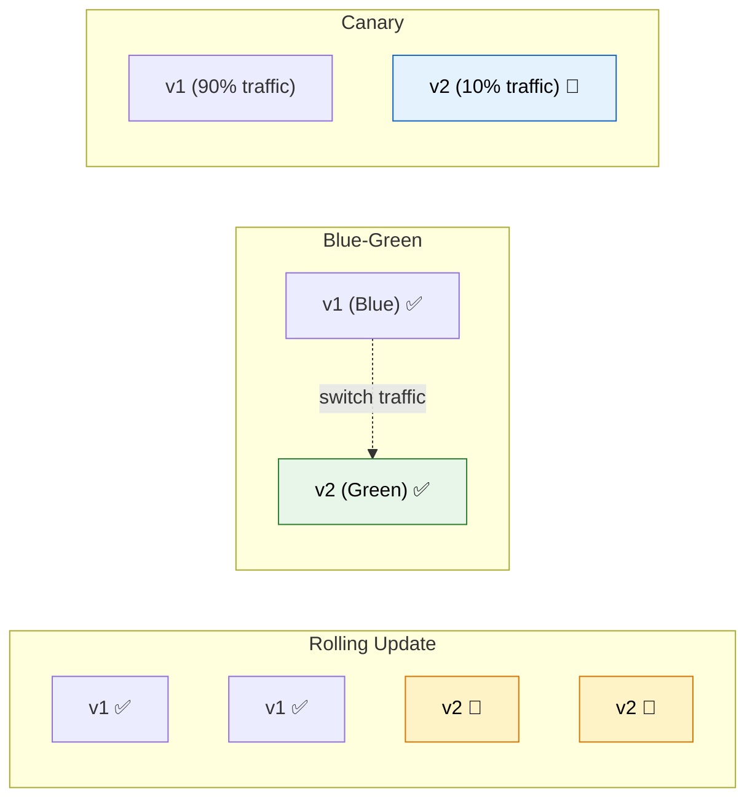
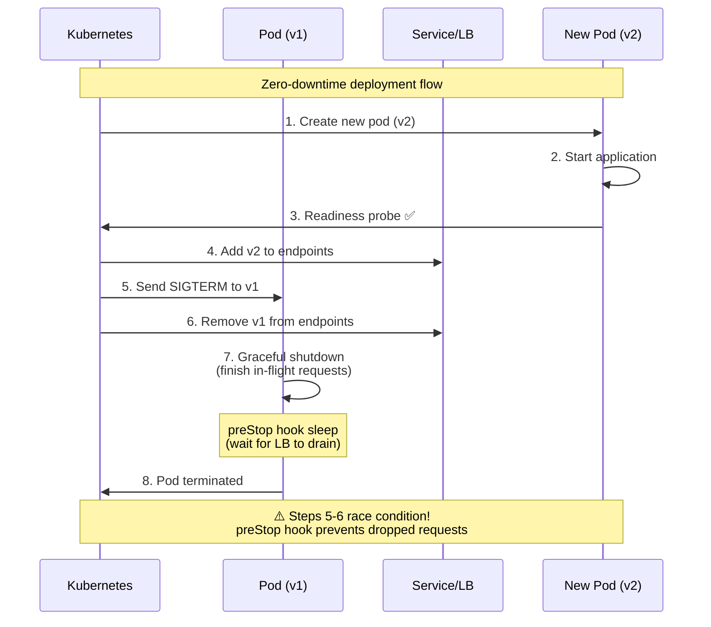
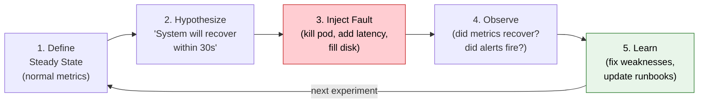
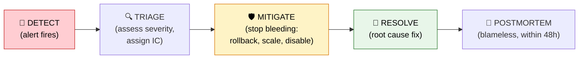
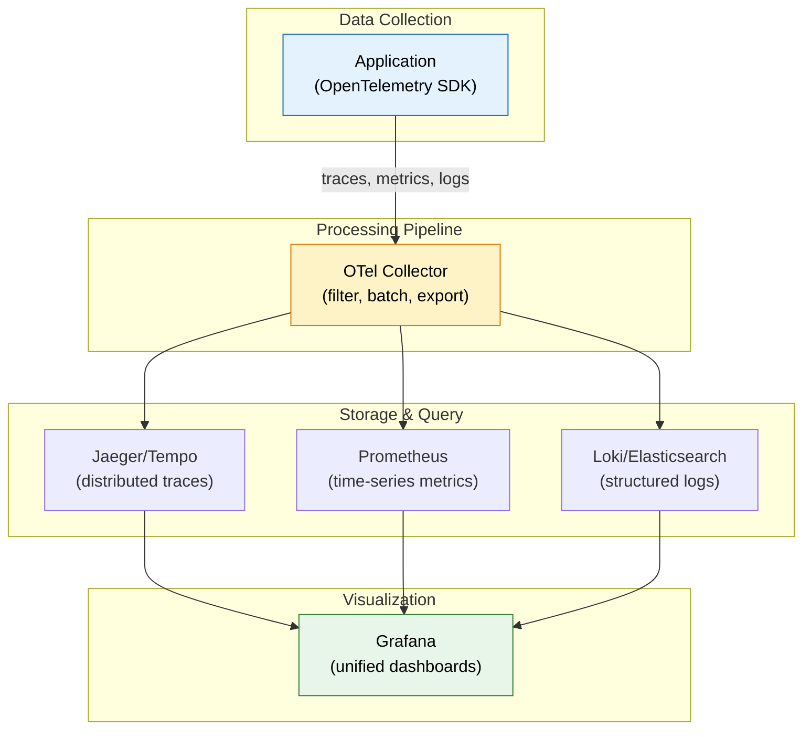

# Production Operations & Reliability

> **What separates "it works on my machine" from "it handles 10K requests/second at 3am on Black Friday" — the operations knowledge that distinguishes senior engineers.**

---

!!! abstract "Real-World Analogy"
    Running microservices in production is like **managing an airport**. Thousands of flights (requests) arrive and depart continuously. Air traffic control (load balancers) routes traffic, maintenance crews (health checks) inspect aircraft between flights, weather alerts (monitoring) trigger contingency plans, and sometimes you need to divert traffic to other runways (failover) — all without passengers noticing delays.

---

## Kubernetes Deployment Strategies

### Strategy Comparison



| Strategy | Downtime | Rollback Speed | Resource Cost | Risk |
|----------|----------|---------------|---------------|------|
| **Rolling Update** | Zero | Slow (new pods spin up) | 1x (in-place) | Medium (mixed versions) |
| **Blue-Green** | Zero | Instant (switch back) | 2x (both live) | Low |
| **Canary** | Zero | Fast (shift traffic back) | 1.1x (small canary) | Lowest |
| **Recreate** | Yes (brief) | Slow | 1x | Highest (big-bang) |

### Canary Deployment with Istio

```yaml
# VirtualService — route 10% to canary
apiVersion: networking.istio.io/v1beta1
kind: VirtualService
metadata:
  name: order-service
spec:
  hosts:
    - order-service
  http:
    - route:
        - destination:
            host: order-service
            subset: stable
          weight: 90
        - destination:
            host: order-service
            subset: canary
          weight: 10
---
# DestinationRule — define subsets
apiVersion: networking.istio.io/v1beta1
kind: DestinationRule
metadata:
  name: order-service
spec:
  host: order-service
  subsets:
    - name: stable
      labels:
        version: v1
    - name: canary
      labels:
        version: v2
```

---

## Zero-Downtime Deployments

### The Critical Sequence



### Spring Boot Configuration

```yaml
# application.yml
server:
  shutdown: graceful          # wait for in-flight requests
  
spring:
  lifecycle:
    timeout-per-shutdown-phase: 30s   # max 30s to finish requests
```

```yaml
# Kubernetes deployment
spec:
  containers:
    - name: app
      lifecycle:
        preStop:
          exec:
            command: ["sh", "-c", "sleep 5"]  # wait for LB to drain
      readinessProbe:
        httpGet:
          path: /actuator/health/readiness
          port: 8080
        initialDelaySeconds: 10
        periodSeconds: 5
        failureThreshold: 3
      livenessProbe:
        httpGet:
          path: /actuator/health/liveness
          port: 8080
        initialDelaySeconds: 30
        periodSeconds: 10
        failureThreshold: 5      # more tolerant — don't kill during GC pause
```

!!! danger "Readiness vs Liveness — Get This Wrong and You're Paged"
    
    | Probe | Failed Consequence | Should Check |
    |-------|-------------------|-------------|
    | **Readiness** | Pod removed from Service endpoints (no traffic) | "Can I serve requests?" (DB up, dependencies reachable) |
    | **Liveness** | Pod KILLED and restarted | "Am I deadlocked/hung?" (minimal check) |
    
    **Common mistake:** Checking database connectivity in the liveness probe. If the DB is down, ALL pods get killed and restarted simultaneously → total outage instead of graceful degradation.

### Database Migrations Without Downtime

The **Expand-Contract** pattern:

| Phase | Action | Old Code | New Code |
|-------|--------|----------|----------|
| **Expand** | Add new column (nullable) | Reads old column | Reads old column |
| **Migrate** | Backfill data to new column | Reads old column | Reads new column (fallback to old) |
| **Contract** | Drop old column | — (deployed after) | Reads new column |

```sql
-- Phase 1: EXPAND (safe — additive change)
ALTER TABLE orders ADD COLUMN customer_email VARCHAR(255);  -- nullable!

-- Phase 2: MIGRATE (backfill)
UPDATE orders SET customer_email = (
    SELECT email FROM customers WHERE customers.id = orders.customer_id
);

-- Phase 3: CONTRACT (only after all code reads new column)
ALTER TABLE orders DROP COLUMN customer_id_legacy;
```

---

## Chaos Engineering

### The Process



### Types of Chaos Experiments

| Experiment | What It Tests | Tool |
|-----------|---------------|------|
| **Pod kill** | Auto-restart, graceful shutdown | Chaos Monkey, LitmusChaos |
| **Network latency** (100-500ms) | Timeouts, circuit breakers, retries | Toxiproxy, Istio fault injection |
| **Network partition** | Split-brain handling, data consistency | LitmusChaos, Gremlin |
| **CPU stress** (90%+) | Autoscaling, request queuing, throttling | stress-ng, LitmusChaos |
| **Disk fill** (95%+) | Log rotation, alerting, graceful degradation | FIO, Gremlin |
| **DNS failure** | Service discovery fallback, caching | CoreDNS disruption |
| **Dependency unavailable** | Fallbacks, circuit breakers, bulkheads | Kill downstream service |

### Chaos Monkey for Spring Boot

```yaml
# Enable chaos in non-prod environments
chaos:
  monkey:
    enabled: true
    watcher:
      controller: true
      restController: true
      service: true
      repository: true
    assaults:
      level: 5                    # 1 in 5 requests affected
      latencyActive: true
      latencyRangeStart: 500      # add 500-1000ms latency
      latencyRangeEnd: 1000
      exceptionsActive: true
      killApplicationActive: false  # don't kill in shared environments!
```

!!! warning "Chaos Engineering Rules"
    1. **Start in staging** — never surprise production without organizational buy-in
    2. **Have a kill switch** — ability to instantly stop the experiment
    3. **Monitor during experiments** — watch dashboards in real-time
    4. **Small blast radius** — affect one pod, not the entire fleet
    5. **Business hours only** — unless you're Netflix-level mature

---

## Incident Response Playbook

### Severity Levels

| Level | Definition | Response Time | Example |
|-------|-----------|---------------|---------|
| **SEV1** | Complete service outage affecting all users | < 5 min | Payment processing down |
| **SEV2** | Major degradation, subset of users affected | < 15 min | Search returns errors for 20% of queries |
| **SEV3** | Minor issue, workaround exists | < 1 hour | Notifications delayed by 5 min |
| **SEV4** | Low impact, cosmetic or non-urgent | Next business day | Dashboard shows stale data |

### Incident Timeline



### Common Failure Runbooks

??? danger "Cascading Timeout"

    **Symptoms:** Latency spikes across multiple services, thread pool exhaustion, increasing error rates
    
    **Immediate actions:**
    
    1. Identify the slowest downstream dependency (check distributed traces)
    2. Check if that service's circuit breaker tripped
    3. If not — manually trip the circuit breaker or increase timeout thresholds
    4. Scale the affected service horizontally
    5. Enable fallback/degraded mode
    
    **Root cause investigation:** Slow database query? Resource exhaustion? GC pauses?

??? danger "Connection Pool Exhaustion"

    **Symptoms:** `HikariPool-1 - Connection is not available, request timed out after 30000ms`
    
    **Immediate actions:**
    
    1. Check current pool usage: `/actuator/metrics/hikaricp.connections.active`
    2. Check for leaked connections: `hikaricp.connections.pending` growing
    3. Thread dump to find WHERE connections are held: `jcmd <PID> Thread.print`
    4. Restart affected pods (temporary fix)
    5. Enable `leak-detection-threshold` if not already set
    
    **Root cause:** Missing `@Transactional` close, long-running query, or N+1 problem under load

??? danger "Memory Leak (Gradual Degradation)"

    **Symptoms:** Memory usage grows over hours/days, increasing GC frequency, eventually OOMKill
    
    **Immediate actions:**
    
    1. Capture heap dump BEFORE pod dies: `jcmd <PID> GC.heap_dump /tmp/dump.hprof`
    2. Rolling restart to buy time
    3. Analyze heap dump with Eclipse MAT or VisualVM
    
    **Common causes:** ThreadLocal not cleared, growing in-memory caches without eviction, classloader leaks

---

## Observability Stack

### The Three Pillars + Correlation



### Distributed Tracing: Correlation IDs

```java
// MDC propagation — every log line includes the trace ID
@Component
public class TraceFilter extends OncePerRequestFilter {
    @Override
    protected void doFilterInternal(HttpServletRequest req, HttpServletResponse res,
                                     FilterChain chain) throws ServletException, IOException {
        String traceId = req.getHeader("X-Trace-Id");
        if (traceId == null) traceId = UUID.randomUUID().toString();
        MDC.put("traceId", traceId);
        res.setHeader("X-Trace-Id", traceId);
        try {
            chain.doFilter(req, res);
        } finally {
            MDC.clear();
        }
    }
}

// logback-spring.xml pattern
// %d{ISO8601} [%thread] %-5level %logger - [traceId=%X{traceId}] %msg%n
```

### SLI / SLO / SLA

| Term | Definition | Example |
|------|-----------|---------|
| **SLI** (Indicator) | The metric you measure | p99 latency of `/checkout` endpoint |
| **SLO** (Objective) | Your internal target | p99 latency < 200ms, 99.9% of the time |
| **SLA** (Agreement) | Customer-facing promise with penalties | 99.95% uptime or service credits |
| **Error Budget** | 100% - SLO = time you can be down | 0.1% = ~8.7 hours/year |

!!! tip "SLO Best Practice"
    Set SLOs tighter than SLAs. If your SLA promises 99.95% uptime (26 min downtime/month), set your SLO at 99.99% (4 min/month). When you burn through your SLO error budget, freeze feature work and prioritize reliability.

---

## Scaling Strategies

### Horizontal Pod Autoscaler (HPA)

```yaml
apiVersion: autoscaling/v2
kind: HorizontalPodAutoscaler
metadata:
  name: order-service
spec:
  scaleTargetRef:
    apiVersion: apps/v1
    kind: Deployment
    name: order-service
  minReplicas: 3
  maxReplicas: 50
  metrics:
    - type: Resource
      resource:
        name: cpu
        target:
          type: Utilization
          averageUtilization: 70    # scale when CPU > 70%
    - type: Pods
      pods:
        metric:
          name: http_requests_per_second
        target:
          type: AverageValue
          averageValue: "1000"      # scale when > 1000 RPS per pod
  behavior:
    scaleUp:
      stabilizationWindowSeconds: 30   # wait 30s before scaling up more
      policies:
        - type: Percent
          value: 50                     # add max 50% more pods at once
          periodSeconds: 60
    scaleDown:
      stabilizationWindowSeconds: 300  # wait 5min before scaling down
      policies:
        - type: Pods
          value: 2                      # remove max 2 pods per minute
          periodSeconds: 60
```

### KEDA — Event-Driven Autoscaling

```yaml
# Scale based on Kafka consumer lag
apiVersion: keda.sh/v1alpha1
kind: ScaledObject
metadata:
  name: order-processor
spec:
  scaleTargetRef:
    name: order-processor
  minReplicaCount: 1
  maxReplicaCount: 30
  triggers:
    - type: kafka
      metadata:
        bootstrapServers: kafka:9092
        consumerGroup: order-processor
        topic: orders
        lagThreshold: "100"    # scale when lag > 100 messages per partition
```

### Scaling Anti-Patterns

| Anti-Pattern | Problem | Fix |
|-------------|---------|-----|
| Scaling on CPU for I/O-bound workload | CPU stays low, requests queue | Scale on request count or queue depth |
| No scale-down cooldown | Thrashing (up-down-up-down) | Set stabilization window (5+ min) |
| Same min and max replicas | Defeats autoscaling purpose | Set min for baseline, max for peak |
| Ignoring cold start time | New pods not ready when traffic arrives | Pre-warming, readiness probes, PodDisruptionBudget |
| Thundering herd | All pods scale in, overwhelm DB | Rate-limit scale-up (% based) |

---

## Production Readiness Checklist

| Category | Item | Why It Matters | How to Verify |
|----------|------|---------------|---------------|
| **Health** | Readiness probe configured | Prevents traffic to unready pods | `kubectl describe pod` |
| **Health** | Liveness probe (minimal) | Detects deadlocks without false kills | Check probe doesn't depend on external services |
| **Deploy** | Graceful shutdown enabled | No dropped requests during deploy | Send traffic during `kubectl rollout` |
| **Deploy** | PreStop hook (sleep 5s) | Handles LB propagation delay | Watch for 502s during rollout |
| **Observe** | Structured logging with traceId | Trace requests across services | Check log format includes traceId |
| **Observe** | RED metrics exposed | Know rate, errors, duration | Check `/actuator/prometheus` |
| **Observe** | Alerts configured | Get paged before users notice | Simulate failure, verify alert fires |
| **Scale** | HPA configured | Handle traffic spikes | Load test and watch pod count |
| **Scale** | Resource requests/limits set | Scheduler can place pods correctly | `kubectl top pods` vs limits |
| **Resilience** | Circuit breaker on external calls | Prevent cascading failures | Kill dependency, verify fallback |
| **Resilience** | Timeouts on all HTTP clients | No threads blocked forever | Check WebClient/RestTemplate config |
| **Security** | No secrets in env vars or configs | Prevent credential leaks | Audit ConfigMaps, use sealed secrets |
| **Security** | Network policies defined | Restrict pod-to-pod communication | `kubectl get networkpolicy` |
| **Data** | Database backups verified | Recovery from data loss | Test restore procedure quarterly |
| **Docs** | Runbook exists | On-call can fix without author | New team member can follow it |
