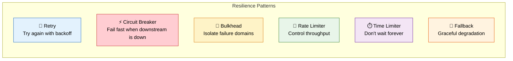
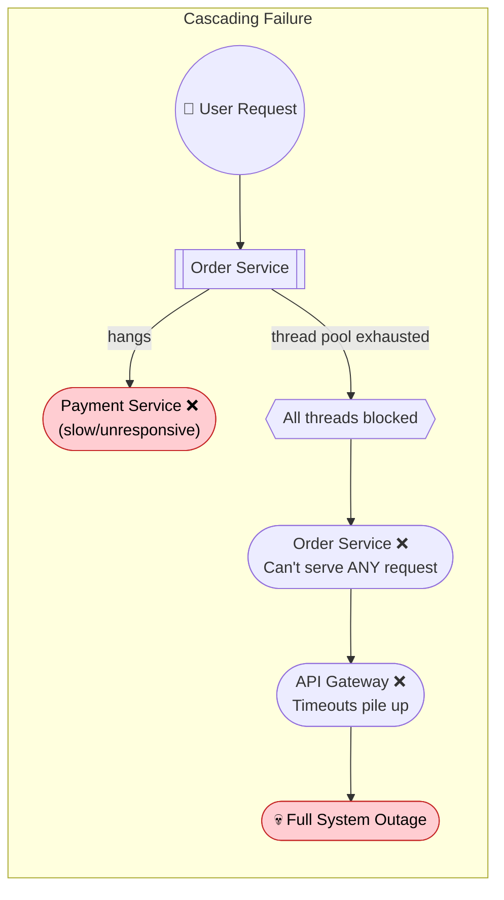
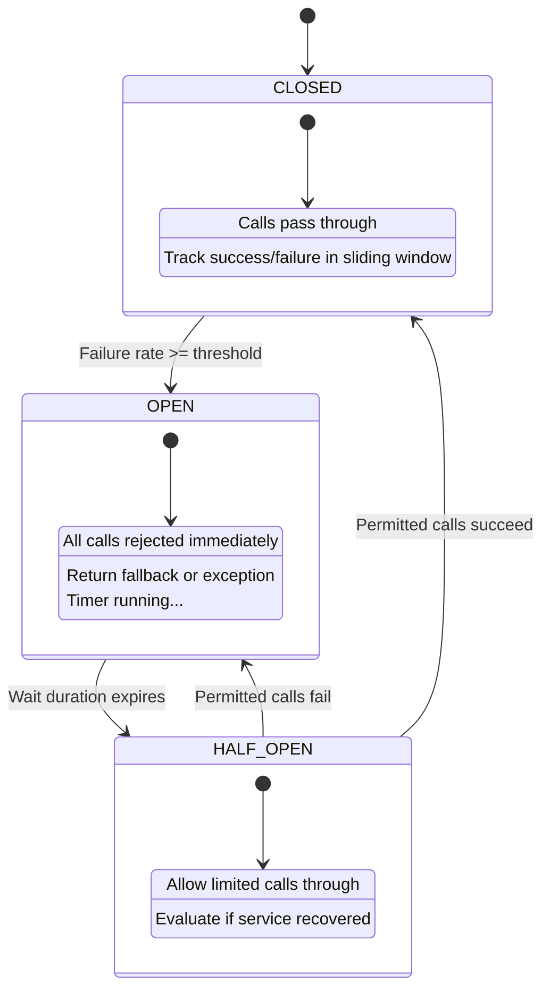
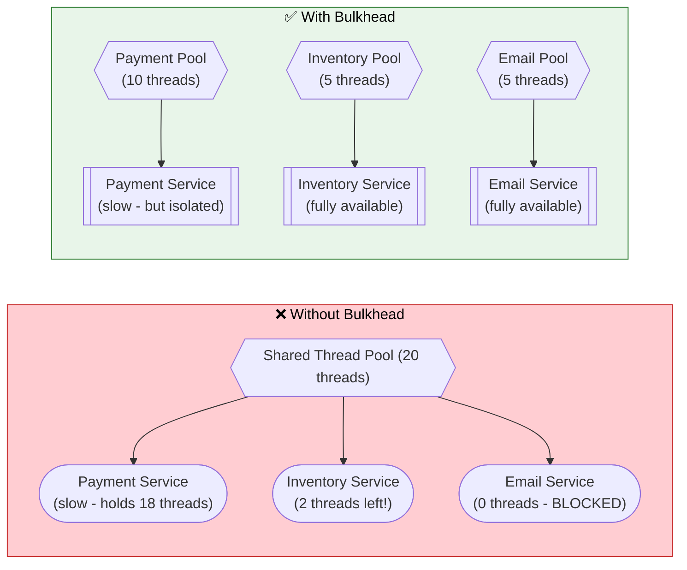

# 🛡️ Resilience Patterns for Microservices

> **Build fault-tolerant distributed systems that degrade gracefully — retry, circuit break, bulkhead, rate limit, and combine patterns to survive partial failures.**

---

!!! abstract "Real-World Analogy"
    Think of an **aircraft with redundant systems**. If one engine fails, the other keeps flying (bulkhead). If turbulence is detected, the autopilot retries a smoother altitude (retry). If a runway is too damaged, the pilot diverts to an alternate airport (fallback). If too many planes approach at once, air traffic control spaces them out (rate limiter). No single failure should crash the entire system.



---

## 💥 Why Resilience Matters

In a distributed system, **partial failures are inevitable**. Networks drop packets, services crash, databases slow down. Without resilience patterns, a single slow service can bring down your entire platform.



| Problem | Description | Without Resilience |
|---|---|---|
| **Cascading Failure** | One slow service blocks all callers | Entire system goes down |
| **Partial Failure** | Some instances are unhealthy | Requests keep hitting bad instances |
| **Thundering Herd** | All clients retry simultaneously | Overwhelms recovering service |
| **Resource Exhaustion** | Threads/connections held by slow calls | No capacity for healthy requests |

---

## 🔄 Retry Pattern

Automatically retry failed operations — transient errors (network blips, 503s) often resolve on the next attempt.

### Resilience4j Configuration

```java
@Configuration
public class RetryConfig {

    @Bean
    public RetryRegistry retryRegistry() {
        RetryConfig config = RetryConfig.custom()
            .maxAttempts(3)
            .waitDuration(Duration.ofMillis(500))
            .intervalFunction(IntervalFunction.ofExponentialBackoff(500, 2.0))
            .retryOnResult(response -> response.getStatusCode() == 503)
            .retryExceptions(IOException.class, TimeoutException.class)
            .ignoreExceptions(BusinessException.class, ValidationException.class)
            .failAfterMaxAttempts(true)
            .build();

        return RetryRegistry.of(config);
    }
}
```

### Using Annotations

```java
@Service
@Slf4j
public class PaymentServiceClient {

    private final RestTemplate restTemplate;

    @Retry(name = "paymentService", fallbackMethod = "paymentFallback")
    public PaymentResponse processPayment(PaymentRequest request) {
        log.info("Attempting payment for order: {}", request.getOrderId());
        return restTemplate.postForObject(
            "http://payment-service/api/payments",
            request,
            PaymentResponse.class
        );
    }

    private PaymentResponse paymentFallback(PaymentRequest request, Exception ex) {
        log.warn("Payment failed after retries for order: {}", request.getOrderId(), ex);
        return PaymentResponse.builder()
            .status(PaymentStatus.PENDING)
            .message("Payment queued for async processing")
            .build();
    }
}
```

### application.yml

```yaml
resilience4j:
  retry:
    instances:
      paymentService:
        max-attempts: 3
        wait-duration: 500ms
        exponential-backoff-multiplier: 2.0
        retry-exceptions:
          - java.io.IOException
          - java.util.concurrent.TimeoutException
          - org.springframework.web.client.HttpServerErrorException
        ignore-exceptions:
          - com.example.exception.BusinessException
```

!!! warning "Retry Anti-Patterns"
    - **Never retry non-idempotent operations** (e.g., POST creating a resource) without an idempotency key
    - **Always use exponential backoff + jitter** to prevent thundering herd
    - **Set a reasonable max** — retrying 10 times just delays the inevitable

---

## ⚡ Circuit Breaker Pattern

When a downstream service is failing, **stop calling it** and fail fast. Prevents resource exhaustion and gives the failing service time to recover.

### State Machine



### Configuration

```java
@Configuration
public class CircuitBreakerConfig {

    @Bean
    public CircuitBreakerRegistry circuitBreakerRegistry() {
        CircuitBreakerConfig config = CircuitBreakerConfig.custom()
            // Sliding window
            .slidingWindowType(SlidingWindowType.COUNT_BASED)
            .slidingWindowSize(10)
            .minimumNumberOfCalls(5)
            // Failure thresholds
            .failureRateThreshold(50.0f)
            .slowCallRateThreshold(80.0f)
            .slowCallDurationThreshold(Duration.ofSeconds(2))
            // State transitions
            .waitDurationInOpenState(Duration.ofSeconds(30))
            .permittedNumberOfCallsInHalfOpenState(3)
            .automaticTransitionFromOpenToHalfOpenEnabled(true)
            // What counts as failure
            .recordExceptions(IOException.class, TimeoutException.class)
            .ignoreExceptions(BusinessException.class)
            .build();

        return CircuitBreakerRegistry.of(config);
    }
}
```

### Service Implementation

```java
@Service
@Slf4j
public class InventoryServiceClient {

    private final WebClient webClient;

    @CircuitBreaker(name = "inventoryService", fallbackMethod = "inventoryFallback")
    public Mono<InventoryResponse> checkStock(String productId) {
        return webClient.get()
            .uri("/api/inventory/{productId}", productId)
            .retrieve()
            .bodyToMono(InventoryResponse.class);
    }

    private Mono<InventoryResponse> inventoryFallback(String productId, Throwable t) {
        log.warn("Circuit breaker open for inventory check, product: {}", productId);
        // Return cached or optimistic response
        return Mono.just(InventoryResponse.builder()
            .productId(productId)
            .available(true)  // Optimistic — verify at checkout
            .source("CACHE_FALLBACK")
            .build());
    }
}
```

### application.yml

```yaml
resilience4j:
  circuitbreaker:
    instances:
      inventoryService:
        sliding-window-type: COUNT_BASED
        sliding-window-size: 10
        minimum-number-of-calls: 5
        failure-rate-threshold: 50
        slow-call-rate-threshold: 80
        slow-call-duration-threshold: 2s
        wait-duration-in-open-state: 30s
        permitted-number-of-calls-in-half-open-state: 3
        automatic-transition-from-open-to-half-open-enabled: true
        register-health-indicator: true
```

---

## 🚧 Bulkhead Pattern

Isolate critical resources so that failure in one area doesn't exhaust shared resources. Named after ship bulkheads that prevent flooding from spreading.



### Thread Pool Bulkhead

```java
@Service
@Slf4j
public class OrderService {

    @Bulkhead(name = "paymentBulkhead", type = Bulkhead.Type.THREADPOOL,
              fallbackMethod = "paymentBulkheadFallback")
    public CompletableFuture<PaymentResponse> processPayment(PaymentRequest request) {
        return CompletableFuture.supplyAsync(() -> {
            return paymentClient.charge(request);
        });
    }

    private CompletableFuture<PaymentResponse> paymentBulkheadFallback(
            PaymentRequest request, BulkheadFullException ex) {
        log.warn("Payment bulkhead full, queuing order: {}", request.getOrderId());
        return CompletableFuture.completedFuture(
            PaymentResponse.queued(request.getOrderId())
        );
    }
}
```

### Semaphore Bulkhead

```java
@Service
public class NotificationService {

    @Bulkhead(name = "emailBulkhead", type = Bulkhead.Type.SEMAPHORE)
    public void sendEmail(EmailRequest request) {
        // At most N concurrent calls allowed
        emailClient.send(request);
    }
}
```

### application.yml

```yaml
resilience4j:
  bulkhead:
    instances:
      emailBulkhead:
        max-concurrent-calls: 10        # Max concurrent calls (semaphore)
        max-wait-duration: 100ms        # Wait time when bulkhead is full
  thread-pool-bulkhead:
    instances:
      paymentBulkhead:
        max-thread-pool-size: 10        # Dedicated thread pool size
        core-thread-pool-size: 5
        queue-capacity: 20              # Requests queued when threads busy
        keep-alive-duration: 100ms
```

| Type | Use When | Pros | Cons |
|---|---|---|---|
| **Semaphore** | Synchronous calls, limit concurrency | Lightweight, no thread overhead | Doesn't isolate slow calls |
| **Thread Pool** | Async calls, need true isolation | Slow calls can't block others | Thread overhead, context switch cost |

---

## 🚦 Rate Limiter Pattern

Control how many calls a service accepts in a time window. Protects services from being overwhelmed.

### Resilience4j Rate Limiter

```java
@RestController
@RequestMapping("/api/orders")
@Slf4j
public class OrderController {

    private final OrderService orderService;

    @RateLimiter(name = "orderApi", fallbackMethod = "rateLimitFallback")
    @PostMapping
    public ResponseEntity<OrderResponse> createOrder(@RequestBody OrderRequest request) {
        return ResponseEntity.ok(orderService.createOrder(request));
    }

    private ResponseEntity<OrderResponse> rateLimitFallback(
            OrderRequest request, RequestNotPermitted ex) {
        log.warn("Rate limit exceeded for order creation");
        return ResponseEntity.status(HttpStatus.TOO_MANY_REQUESTS)
            .header("Retry-After", "1")
            .body(OrderResponse.rateLimited());
    }
}
```

### application.yml

```yaml
resilience4j:
  ratelimiter:
    instances:
      orderApi:
        limit-for-period: 100            # 100 requests per period
        limit-refresh-period: 1s         # Refresh every second
        timeout-duration: 500ms          # Wait time if limit reached
        register-health-indicator: true
        event-consumer-buffer-size: 100
```

### Algorithms Compared

| Algorithm | Description | Best For |
|---|---|---|
| **Token Bucket** | Tokens refill at steady rate; requests consume tokens | Allows short bursts, smooth average rate |
| **Sliding Window** | Count requests in a rolling time window | Strict rate enforcement, no bursts |
| **Fixed Window** | Count requests in fixed intervals | Simple but allows 2x burst at window edges |
| **Leaky Bucket** | Requests queue and process at fixed rate | Smoothest output rate, no bursts |

---

## ⏱️ Time Limiter (Timeout Pattern)

Never wait forever. Set explicit timeouts so slow calls don't block threads indefinitely.

```java
@Service
@Slf4j
public class ProductCatalogService {

    @TimeLimiter(name = "catalogService", fallbackMethod = "catalogTimeout")
    @CircuitBreaker(name = "catalogService")
    public CompletableFuture<ProductDetails> getProductDetails(String productId) {
        return CompletableFuture.supplyAsync(() -> {
            return catalogClient.fetchProduct(productId);
        });
    }

    private CompletableFuture<ProductDetails> catalogTimeout(
            String productId, TimeoutException ex) {
        log.warn("Catalog service timeout for product: {}", productId);
        return CompletableFuture.completedFuture(
            cachedProductRepository.findById(productId)
                .orElse(ProductDetails.unavailable(productId))
        );
    }
}
```

### application.yml

```yaml
resilience4j:
  timelimiter:
    instances:
      catalogService:
        timeout-duration: 3s              # Cancel if no response in 3s
        cancel-running-future: true       # Cancel the underlying future
```

!!! tip "Timeout Strategy"
    Set timeouts at **every layer**: HTTP client (connection + read), circuit breaker, and gateway. The outer timeout should always be greater than the inner. Example: Gateway 10s > Service 5s > HTTP client 3s.

---

## 🔀 Fallback Strategies

When all else fails, degrade gracefully instead of returning errors.

```java
@Service
@Slf4j
public class RecommendationService {

    private final RecommendationClient recommendationClient;
    private final CacheManager cacheManager;
    private final List<String> defaultPopularProducts;

    /**
     * Strategy 1: Return cached data
     */
    @CircuitBreaker(name = "recommendations", fallbackMethod = "cachedRecommendations")
    public List<Product> getPersonalizedRecommendations(String userId) {
        List<Product> recommendations = recommendationClient.getForUser(userId);
        // Update cache on success
        cacheManager.getCache("recommendations").put(userId, recommendations);
        return recommendations;
    }

    private List<Product> cachedRecommendations(String userId, Throwable t) {
        log.warn("Using cached recommendations for user: {}", userId);
        Cache.ValueWrapper cached = cacheManager.getCache("recommendations").get(userId);
        if (cached != null) {
            return (List<Product>) cached.get();
        }
        return popularProductsFallback(userId, t);
    }

    /**
     * Strategy 2: Return default/static data
     */
    private List<Product> popularProductsFallback(String userId, Throwable t) {
        log.warn("Using popular products fallback for user: {}", userId);
        return defaultPopularProducts;
    }

    /**
     * Strategy 3: Return empty/neutral response
     */
    private List<Product> emptyFallback(String userId, Throwable t) {
        log.error("All fallbacks exhausted for user: {}", userId);
        return Collections.emptyList();  // UI shows "No recommendations available"
    }
}
```

| Fallback Strategy | Use When | Example |
|---|---|---|
| **Cached data** | Stale data is acceptable | Product catalog, recommendations |
| **Default values** | A reasonable default exists | Default shipping estimate, popular items |
| **Graceful degradation** | Feature is optional | Hide recommendations section entirely |
| **Queue for later** | Operation must eventually happen | Queue payment for async retry |
| **Alternative service** | Backup provider exists | Switch to backup payment gateway |

---

## 🔗 Combining Patterns (Order Matters!)

In production, you rarely use a single pattern in isolation. Resilience4j applies decorators in a specific order:

```mermaid
flowchart LR
    REQ[/"Incoming Request"/] --> RT{{"🚦 Rate Limiter<br/>(outermost)"}}
    RT --> RL{{"⏱️ Time Limiter"}}
    RL --> BH{{"🚧 Bulkhead"}}
    BH --> CB{{"⚡ Circuit Breaker"}}
    CB --> RY{{"🔄 Retry<br/>(innermost)"}}
    RY --> SVC(["Downstream Service"])

    style REQ fill:#E3F2FD,stroke:#1565C0,color:#000
    style RT fill:#E8F5E9,stroke:#2E7D32,color:#000
    style RL fill:#F3E5F5,stroke:#6A1B9A,color:#000
    style BH fill:#FEF3C7,stroke:#D97706,color:#000
    style CB fill:#FFCDD2,stroke:#C62828,color:#000
    style RY fill:#E3F2FD,stroke:#1565C0,color:#000
    style SVC fill:#F5F5F5,stroke:#616161,color:#000
```



!!! warning "Decorator Order"
    Resilience4j annotation order is: `Retry > CircuitBreaker > RateLimiter > TimeLimiter > Bulkhead` (highest to lowest priority). The **Retry is innermost** — it retries before the circuit breaker counts a failure. If you reverse them, each retry attempt would count as a separate failure against the circuit breaker.

### Combined Example

```java
@Service
@Slf4j
public class PaymentGatewayService {

    private final PaymentClient paymentClient;

    /**
     * Combined resilience: Retry (innermost) -> CircuitBreaker -> Bulkhead -> TimeLimiter -> RateLimiter (outermost)
     * 
     * Execution flow:
     * 1. RateLimiter: ensures we don't exceed payment provider's API limits
     * 2. TimeLimiter: cancels if total time exceeds 10s
     * 3. Bulkhead: limits concurrent payment calls to 10
     * 4. CircuitBreaker: opens if failure rate > 50%
     * 5. Retry: retries up to 3 times on transient failures
     */
    @RateLimiter(name = "paymentGateway")
    @TimeLimiter(name = "paymentGateway")
    @Bulkhead(name = "paymentGateway", type = Bulkhead.Type.THREADPOOL)
    @CircuitBreaker(name = "paymentGateway", fallbackMethod = "paymentFallback")
    @Retry(name = "paymentGateway")
    public CompletableFuture<PaymentResult> chargeCustomer(ChargeRequest request) {
        return CompletableFuture.supplyAsync(() -> {
            log.info("Charging customer: {} amount: {}", 
                request.getCustomerId(), request.getAmount());
            return paymentClient.charge(request);
        });
    }

    private CompletableFuture<PaymentResult> paymentFallback(
            ChargeRequest request, Throwable t) {
        log.error("Payment failed for customer: {}, queuing for retry", 
            request.getCustomerId(), t);
        // Queue to dead letter for manual/async processing
        paymentRetryQueue.enqueue(request);
        return CompletableFuture.completedFuture(
            PaymentResult.builder()
                .status(PaymentStatus.QUEUED)
                .message("Payment will be processed shortly")
                .retryReference(UUID.randomUUID().toString())
                .build()
        );
    }
}
```

### Full application.yml

```yaml
resilience4j:
  retry:
    instances:
      paymentGateway:
        max-attempts: 3
        wait-duration: 1s
        exponential-backoff-multiplier: 2.0
        retry-exceptions:
          - java.io.IOException
          - java.util.concurrent.TimeoutException
  circuitbreaker:
    instances:
      paymentGateway:
        sliding-window-size: 20
        failure-rate-threshold: 50
        wait-duration-in-open-state: 60s
        permitted-number-of-calls-in-half-open-state: 5
  bulkhead:
    instances:
      paymentGateway:
        max-concurrent-calls: 10
  thread-pool-bulkhead:
    instances:
      paymentGateway:
        max-thread-pool-size: 10
        core-thread-pool-size: 5
        queue-capacity: 25
  timelimiter:
    instances:
      paymentGateway:
        timeout-duration: 10s
        cancel-running-future: true
  ratelimiter:
    instances:
      paymentGateway:
        limit-for-period: 50
        limit-refresh-period: 1s
        timeout-duration: 0ms
```

---

## 📊 Health Monitoring & Metrics

### Actuator Integration

```java
@Configuration
public class ResilienceHealthConfig {

    @Bean
    public HealthIndicator circuitBreakerHealthIndicator(
            CircuitBreakerRegistry registry) {
        return new CircuitBreakersHealthIndicator(registry);
    }
}
```

### application.yml — Expose Metrics

```yaml
management:
  endpoints:
    web:
      exposure:
        include: health, metrics, prometheus
  endpoint:
    health:
      show-details: always
  health:
    circuitbreakers:
      enabled: true
    ratelimiters:
      enabled: true

  metrics:
    tags:
      application: ${spring.application.name}
    distribution:
      percentiles-histogram:
        resilience4j.circuitbreaker.calls: true
```

### Key Metrics to Monitor

| Metric | What It Tells You |
|---|---|
| `resilience4j_circuitbreaker_state` | Current CB state (0=CLOSED, 1=OPEN, 2=HALF_OPEN) |
| `resilience4j_circuitbreaker_failure_rate` | Sliding window failure percentage |
| `resilience4j_retry_calls_total` | Total retries (success_with_retry, failed_with/without_retry) |
| `resilience4j_bulkhead_available_concurrent_calls` | Remaining capacity |
| `resilience4j_ratelimiter_available_permissions` | Remaining tokens |
| `resilience4j_timelimiter_calls_total` | Timeouts vs successful calls |

### Grafana Alert Example

```yaml
# Alert when circuit breaker opens
- alert: CircuitBreakerOpen
  expr: resilience4j_circuitbreaker_state{state="open"} == 1
  for: 1m
  labels:
    severity: warning
  annotations:
    summary: "Circuit breaker {{ $labels.name }} is OPEN"
    description: "Service {{ $labels.application }} circuit breaker has been open for > 1 minute"
```

---

## ⚖️ Library-Based vs Infrastructure-Based Resilience

| Aspect | Resilience4j (Library) | Istio (Service Mesh) |
|---|---|---|
| **Implementation** | In-process, annotations/code | Sidecar proxy (Envoy) |
| **Language** | Java/Kotlin only | Language-agnostic |
| **Latency** | Zero overhead (in-process) | ~1ms per hop (proxy) |
| **Granularity** | Method-level, fine-grained | Service-level, coarser |
| **Configuration** | application.yml, programmatic | YAML CRDs (Kubernetes) |
| **Patterns** | Full suite (retry, CB, bulkhead, rate limit, time limit) | Retry, timeout, circuit breaker, rate limit |
| **Fallback logic** | Rich (custom Java methods) | Limited (return error codes) |
| **Monitoring** | Micrometer + Prometheus | Built-in Envoy metrics |
| **Deployment** | Repackage/redeploy to change | Hot-reload, no redeploy |
| **Team autonomy** | Developers own resilience config | Platform team manages policies |
| **Best for** | Java microservices, fine-grained control | Polyglot, platform-wide policies |

!!! tip "In Practice: Use Both"
    Most production systems combine both approaches. Use **Istio** for baseline retry/timeout policies across all services, and **Resilience4j** for business-critical paths that need fine-grained fallback logic, method-level bulkheads, or complex retry conditions.

---

## 🎯 Interview Questions

??? question "1. What happens when you don't implement resilience patterns in a microservices architecture?"
    Without resilience patterns, a single failing service causes **cascading failures**. Calling services hold threads waiting for responses, exhausting thread pools. Upstream services then also become unresponsive, causing a domino effect that brings down the entire system. The classic example: Service A calls Service B (which is slow), all of A's threads get blocked, A can't serve any other requests, and the failure propagates upstream to the API gateway and users.

??? question "2. Explain the Circuit Breaker states and transitions. How do you choose the right thresholds?"
    **CLOSED**: Normal operation — calls pass through, failures are counted in a sliding window. **OPEN**: Failure rate exceeded threshold — all calls are rejected immediately (fail fast). **HALF_OPEN**: After a wait duration, limited calls are permitted to test recovery. If they succeed, transition to CLOSED; if they fail, back to OPEN. Choosing thresholds: Start with 50% failure rate, sliding window of 10-20 calls, 30-60s wait in open state, and 3-5 permitted calls in half-open. Tune based on actual traffic patterns and SLA requirements.

??? question "3. Why does the order of resilience decorators matter? What happens if you put Retry outside CircuitBreaker?"
    Resilience4j applies: Retry(CircuitBreaker(Bulkhead(TimeLimiter(RateLimiter(function))))). **Retry is innermost** — it retries the actual call before the circuit breaker records a failure. If Retry were outside CircuitBreaker, each retry attempt would be a separate call to the circuit breaker — 3 retries means 3 failures counted, causing the circuit to open prematurely. The correct order ensures retries are exhausted first, and only a final failure after all retries is counted against the circuit breaker threshold.

??? question "4. When would you use a Thread Pool Bulkhead vs a Semaphore Bulkhead?"
    **Semaphore Bulkhead**: Limits concurrent calls but executes on the caller's thread. Use for fast, synchronous calls where you just need concurrency limiting. Lightweight with no thread overhead. **Thread Pool Bulkhead**: Executes on a separate thread pool. Use when calls might be slow/blocking — a slow downstream service won't consume the caller's threads. The trade-off is thread context switching overhead and the need to return CompletableFuture. In practice, use thread pool isolation for I/O-bound calls to external services and semaphore for CPU-bound or fast operations.

??? question "5. How do you implement graceful degradation with fallbacks? Give a real-world example."
    Implement a **fallback chain**: Primary call -> Cached data -> Default response -> Empty response. Example for a product recommendation engine: 1) Call ML recommendation service for personalized results. 2) If that fails (circuit open), return cached recommendations from Redis. 3) If cache is empty, return popular products (static fallback). 4) If all else fails, return empty list and hide the recommendations section in the UI. The key principle: **a degraded experience is always better than an error page**. Configure fallbacks via `fallbackMethod` in Resilience4j annotations.

??? question "6. Compare implementing resilience at the application level (Resilience4j) vs infrastructure level (Istio). When would you use each?"
    **Resilience4j** (application): Fine-grained method-level control, rich fallback logic (custom Java code), zero latency overhead, but Java-only and requires redeployment to change. **Istio** (infrastructure): Language-agnostic, no code changes needed, hot-reloadable policies, consistent across all services, but coarser granularity (service-level), limited fallbacks (can only return error codes), and adds ~1ms latency per hop. **Use Resilience4j** for business-critical paths needing complex fallback logic (e.g., payment processing with queue fallback). **Use Istio** for organization-wide baseline policies (e.g., all services get 3 retries and 5s timeout). In practice at FAANG scale, you use both — Istio as a safety net, Resilience4j for critical business logic.
