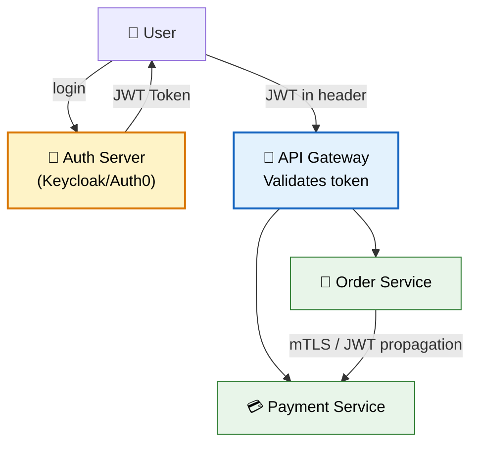
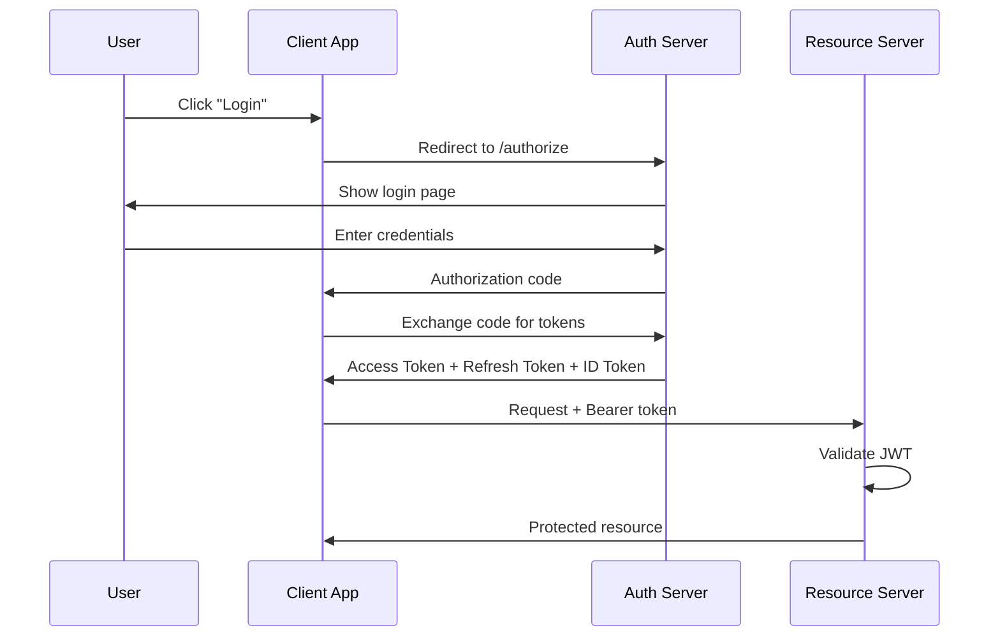
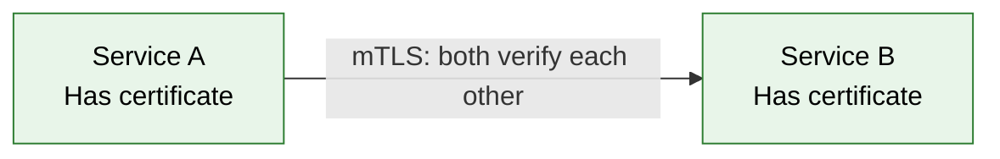

# 🔐 Security in Microservices

> **Secure service-to-service communication, authenticate users across distributed systems, and protect APIs at scale.**

---

!!! abstract "Real-World Analogy"
    Think of an **airport security system**. You authenticate once at check-in (get a boarding pass/JWT). At every gate (service), they verify your pass without calling back to check-in. Between restricted areas (services), staff use badges (mTLS) to verify each other. The control tower (API Gateway) decides who gets in.



---

## 🔄 OAuth 2.0 + OpenID Connect Flow



### Spring Boot as Resource Server

```yaml
# application.yml
spring:
  security:
    oauth2:
      resourceserver:
        jwt:
          issuer-uri: https://auth.example.com/realms/myapp
```

```java
@Configuration
@EnableWebSecurity
public class SecurityConfig {

    @Bean
    public SecurityFilterChain filterChain(HttpSecurity http) throws Exception {
        return http
            .authorizeHttpRequests(auth -> auth
                .requestMatchers("/api/public/**").permitAll()
                .requestMatchers("/api/admin/**").hasRole("ADMIN")
                .anyRequest().authenticated()
            )
            .oauth2ResourceServer(oauth2 -> oauth2.jwt(Customizer.withDefaults()))
            .build();
    }
}
```

---

## 🎫 JWT Propagation Between Services

When Service A calls Service B, it forwards the user's JWT:

```java
@Configuration
public class WebClientConfig {

    @Bean
    public WebClient webClient(ReactiveOAuth2AuthorizedClientManager clientManager) {
        return WebClient.builder()
            .filter(new ServletBearerExchangeFilterFunction()) // propagates JWT
            .build();
    }
}

// Or manually with Feign
@Component
public class AuthInterceptor implements RequestInterceptor {
    @Override
    public void apply(RequestTemplate template) {
        String token = SecurityContextHolder.getContext()
            .getAuthentication().getCredentials().toString();
        template.header("Authorization", "Bearer " + token);
    }
}
```

---

## 🔒 Service-to-Service Authentication (mTLS)

For internal service communication without user context:



!!! tip "Service Mesh (Istio/Linkerd)"
    In production, use a service mesh to handle mTLS automatically. Istio injects sidecar proxies that encrypt all service-to-service traffic without code changes.

---

## 🚪 API Gateway Security

The gateway handles cross-cutting security concerns:

| Concern | Implementation |
|---------|---------------|
| Authentication | Validate JWT before routing |
| Rate Limiting | Prevent abuse (Redis-based) |
| IP Whitelisting | Block suspicious traffic |
| CORS | Control allowed origins |
| Request Size | Prevent DoS via large payloads |

```yaml
# Spring Cloud Gateway
spring:
  cloud:
    gateway:
      routes:
        - id: order-service
          uri: lb://order-service
          predicates:
            - Path=/api/orders/**
          filters:
            - TokenRelay   # forwards OAuth2 token downstream
            - name: RequestRateLimiter
              args:
                redis-rate-limiter.replenishRate: 10
                redis-rate-limiter.burstCapacity: 20
```

---

## 🛡️ Method-Level Security

```java
@RestController
@RequestMapping("/api/orders")
public class OrderController {

    @GetMapping
    @PreAuthorize("hasRole('USER')")
    public List<Order> getMyOrders() { ... }

    @DeleteMapping("/{id}")
    @PreAuthorize("hasRole('ADMIN') or @orderService.isOwner(#id, authentication.name)")
    public void deleteOrder(@PathVariable Long id) { ... }

    @GetMapping("/admin/all")
    @PreAuthorize("hasAuthority('SCOPE_admin:read')")
    public List<Order> getAllOrders() { ... }
}
```

---

## 🎯 Interview Questions

??? question "1. How do you secure microservices?"
    Layer approach: API Gateway (rate limiting, auth validation) → OAuth2/JWT for user authentication → mTLS or JWT propagation for service-to-service → Method-level authorization (@PreAuthorize) → Secrets management (Vault/K8s secrets).

??? question "2. How does JWT work in microservices?"
    User authenticates once with Auth Server, gets a JWT. JWT is self-contained (has user info, roles, expiry). Each service validates the JWT signature locally (no call back to auth server). Token is propagated between services via Authorization header.

??? question "3. What is the difference between authentication and authorization?"
    **Authentication**: Who are you? (verify identity — login). **Authorization**: What can you do? (verify permissions — roles/scopes).

??? question "4. How do services authenticate with each other (no user context)?"
    **mTLS** (mutual TLS) — both services present certificates. **Client Credentials Grant** (OAuth2) — service gets its own token. **API Keys** — simple but less secure. In Kubernetes, use **Service Accounts**.

??? question "5. How do you handle token expiry?"
    Use short-lived access tokens (5-15 min) + long-lived refresh tokens. When access token expires, client uses refresh token to get a new one. If refresh token expires → re-login. Never extend access token lifetime as a workaround.
