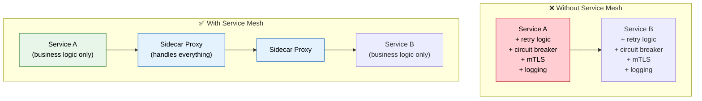
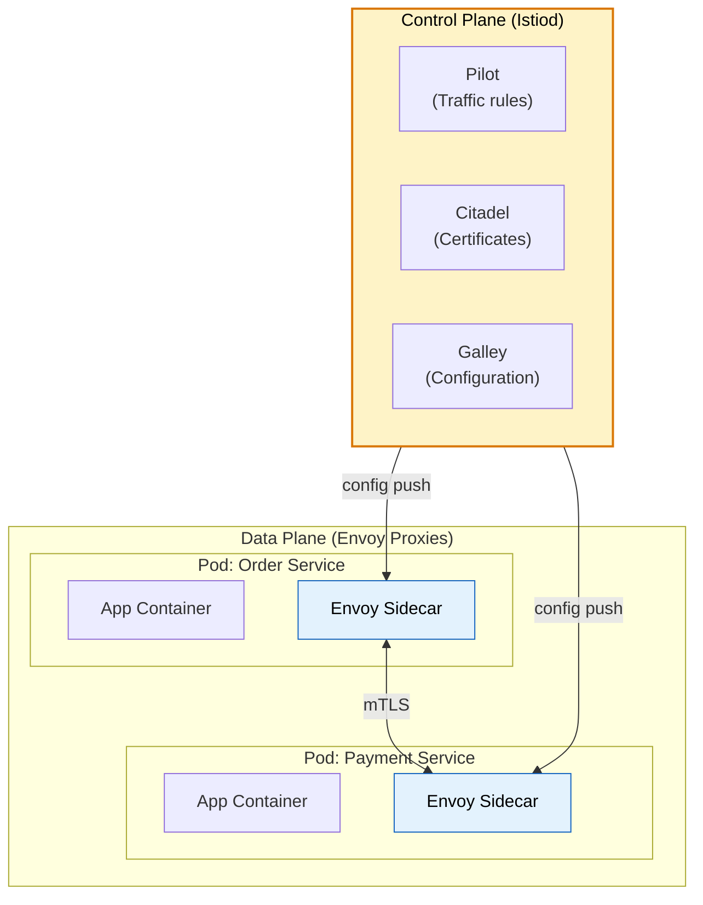

# 🕸️ Service Mesh (Istio & Sidecar Pattern)

> **Add observability, security, and traffic management to microservices without changing application code — using a transparent infrastructure layer.**

---

!!! abstract "Real-World Analogy"
    Think of a **corporate mail room**. Every department has a mail clerk (sidecar proxy) who handles all incoming and outgoing letters. The clerk encrypts sensitive mail (mTLS), tracks delivery times (observability), redirects mail during moves (traffic routing), and blocks suspicious senders (security). Departments focus on their work — the mail system is transparent.



---

## 🏗️ Architecture



| Component | Role |
|---|---|
| **Data Plane** | Envoy sidecar proxies intercept all network traffic |
| **Control Plane** | Istiod configures proxies, manages certs, defines policies |
| **Envoy** | High-performance proxy (C++) deployed as sidecar |

---

## 🔑 Key Features

### 1. Automatic mTLS (Zero-Trust Networking)

```yaml
apiVersion: security.istio.io/v1beta1
kind: PeerAuthentication
metadata:
  name: default
  namespace: production
spec:
  mtls:
    mode: STRICT  # All traffic encrypted, both sides verified
```

All service-to-service communication is encrypted and mutually authenticated — **without any code changes**.

### 2. Traffic Management

```yaml
# Canary deployment — 90/10 traffic split
apiVersion: networking.istio.io/v1alpha3
kind: VirtualService
metadata:
  name: order-service
spec:
  hosts:
    - order-service
  http:
    - route:
        - destination:
            host: order-service
            subset: v1
          weight: 90
        - destination:
            host: order-service
            subset: v2
          weight: 10
```

```yaml
# Automatic retry + timeout
apiVersion: networking.istio.io/v1alpha3
kind: VirtualService
metadata:
  name: payment-service
spec:
  hosts:
    - payment-service
  http:
    - timeout: 5s
      retries:
        attempts: 3
        perTryTimeout: 2s
        retryOn: 5xx,reset,connect-failure
      route:
        - destination:
            host: payment-service
```

### 3. Circuit Breaking

```yaml
apiVersion: networking.istio.io/v1alpha3
kind: DestinationRule
metadata:
  name: payment-service
spec:
  host: payment-service
  trafficPolicy:
    connectionPool:
      tcp:
        maxConnections: 100
      http:
        h2UpgradePolicy: DEFAULT
        http1MaxPendingRequests: 100
        http2MaxRequests: 1000
    outlierDetection:
      consecutive5xxErrors: 5
      interval: 30s
      baseEjectionTime: 60s
      maxEjectionPercent: 50
```

### 4. Observability (Automatic!)

Without any code instrumentation, Istio provides:

- **Distributed tracing** (Jaeger/Zipkin)
- **Metrics** (request count, latency, error rate per service pair)
- **Access logs** (every request logged)
- **Service dependency graph**

---

## 📊 When to Use a Service Mesh

| Use If... | Skip If... |
|---|---|
| 10+ services in production | < 5 services |
| Need zero-trust security (mTLS) | Single-tenant, trusted network |
| Complex traffic routing needs | Simple direct calls |
| Team struggles with cross-cutting concerns | Team can manage resilience in code |
| Compliance requires encrypted internal traffic | Low-security requirements |

---

## 🎯 Interview Questions

??? question "1. What is a service mesh and why do you need one?"
    A dedicated infrastructure layer that handles service-to-service communication. It provides mTLS, traffic management, observability, and resilience (retries, circuit breaking) **without modifying application code**. Use when: many services, need zero-trust security, complex routing, or cross-cutting concerns are becoming maintenance burden.

??? question "2. What is the sidecar pattern?"
    A container deployed alongside your app container in the same pod. It intercepts all inbound/outbound traffic. Your app talks to localhost; the sidecar handles routing, encryption, retries, and telemetry. The app remains unaware of the mesh infrastructure.

??? question "3. How does Istio provide mTLS without code changes?"
    Istio's control plane (Citadel) auto-generates and rotates TLS certificates for every service. Envoy sidecars intercept traffic, perform TLS handshake, and verify the peer's certificate — all transparently. Apps just make plain HTTP calls to localhost.

??? question "4. Service mesh vs library-based resilience (Resilience4j)?"
    **Library (Resilience4j)**: in-process, language-specific, developers must add/configure, faster (no network hop). **Service mesh (Istio)**: language-agnostic, no code changes, consistent policy across all services, adds latency (~1ms per hop). Large polyglot organizations benefit from mesh; small Java-only teams may prefer libraries.

??? question "5. What is Envoy proxy?"
    A high-performance, open-source edge/service proxy (written in C++). Used as the data plane in Istio. Features: L4/L7 load balancing, automatic retries, circuit breaking, rate limiting, gRPC support, distributed tracing, and hot-reload configuration.

