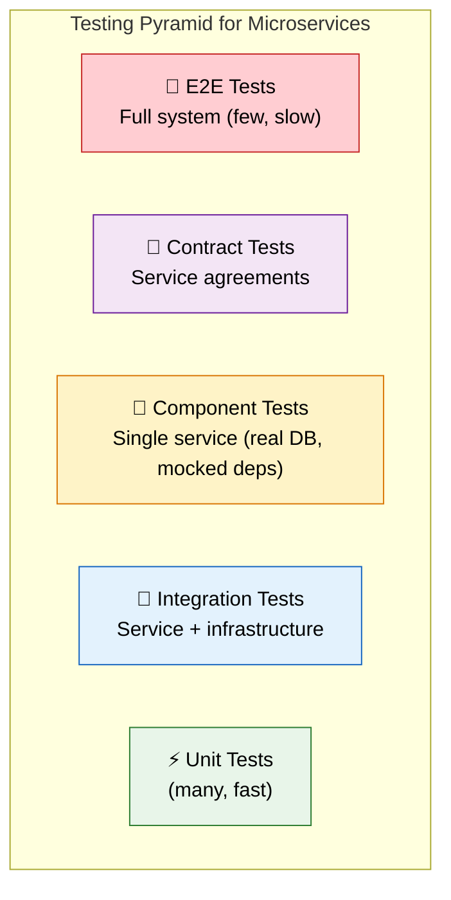
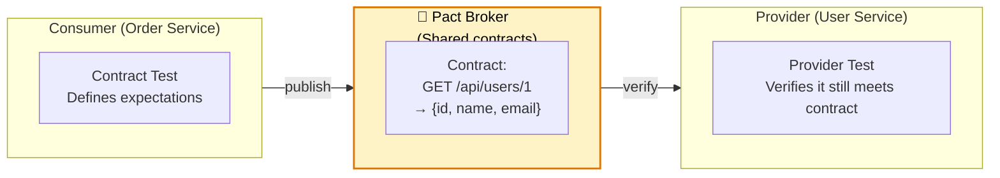

# 🧪 Testing Microservices

> **Test distributed systems effectively — from unit tests to contract tests to full end-to-end flows across services.**

---

!!! abstract "Real-World Analogy"
    Think of testing a **Formula 1 car**. You don't only test it on race day. You test each part individually (unit: engine, tires). You test subsystems together (integration: engine + transmission). You test the car on a dyno (component). You do wind tunnel tests (contract). Finally, track days (E2E). Each layer catches different problems.



---

## ⚡ Unit Tests

Test business logic in isolation — no Spring context, no database:

```java
@ExtendWith(MockitoExtension.class)
class OrderServiceTest {

    @Mock private OrderRepository orderRepository;
    @Mock private InventoryClient inventoryClient;
    @InjectMocks private OrderService orderService;

    @Test
    void shouldRejectOrderWhenOutOfStock() {
        when(inventoryClient.checkStock("ITEM-1")).thenReturn(new StockResponse(0));

        assertThatThrownBy(() -> orderService.placeOrder(new OrderRequest("ITEM-1", 5)))
            .isInstanceOf(OutOfStockException.class)
            .hasMessageContaining("ITEM-1");

        verify(orderRepository, never()).save(any());
    }
}
```

---

## 🧩 Component Tests

Test a single microservice end-to-end with real DB but mocked external services:

```java
@SpringBootTest(webEnvironment = RANDOM_PORT)
@Testcontainers
@ActiveProfiles("test")
class OrderServiceComponentTest {

    @Container
    static PostgreSQLContainer<?> postgres = new PostgreSQLContainer<>("postgres:16");

    @DynamicPropertySource
    static void configure(DynamicPropertyRegistry registry) {
        registry.add("spring.datasource.url", postgres::getJdbcUrl);
    }

    @Autowired private TestRestTemplate rest;

    @MockBean private InventoryClient inventoryClient;  // Mock external dependency

    @Test
    void fullOrderFlow() {
        // Mock external service
        when(inventoryClient.checkStock("ITEM-1")).thenReturn(new StockResponse(10));

        // Create order via REST API
        var request = new OrderRequest("user-1", "ITEM-1", 2);
        var response = rest.postForEntity("/api/orders", request, OrderResponse.class);

        assertThat(response.getStatusCode()).isEqualTo(HttpStatus.CREATED);
        assertThat(response.getBody().status()).isEqualTo("CONFIRMED");

        // Verify via GET
        var getResponse = rest.getForEntity(
            "/api/orders/" + response.getBody().id(), OrderResponse.class);
        assertThat(getResponse.getBody().status()).isEqualTo("CONFIRMED");
    }
}
```

---

## 📜 Contract Tests (Consumer-Driven)

Verify that service APIs don't break their consumers when they change:



### Consumer Side (Order Service)

```java
@ExtendWith(PactConsumerTestExt.class)
@PactTestFor(providerName = "user-service")
class UserClientContractTest {

    @Pact(consumer = "order-service")
    public V4Pact getUserPact(PactDslWithProvider builder) {
        return builder
            .given("user 1 exists")
            .uponReceiving("get user by id")
            .path("/api/users/1")
            .method("GET")
            .willRespondWith()
            .status(200)
            .body(new PactDslJsonBody()
                .integerType("id", 1)
                .stringType("name", "John")
                .stringType("email", "john@example.com"))
            .toPact(V4Pact.class);
    }

    @Test
    @PactTestFor(pactMethod = "getUserPact")
    void shouldGetUser(MockServer mockServer) {
        UserClient client = new UserClient(mockServer.getUrl());
        UserResponse user = client.getUser(1L);

        assertThat(user.name()).isEqualTo("John");
        assertThat(user.email()).isEqualTo("john@example.com");
    }
}
```

### Provider Side (User Service)

```java
@SpringBootTest(webEnvironment = RANDOM_PORT)
@Provider("user-service")
@PactBroker(url = "http://pact-broker:9292")
class UserServiceProviderTest {

    @TestTemplate
    @ExtendWith(PactVerificationInvocationContextProvider.class)
    void verifyPact(PactVerificationContext context) {
        context.verifyInteraction();
    }

    @State("user 1 exists")
    void setupUser1() {
        userRepository.save(new User(1L, "John", "john@example.com"));
    }
}
```

---

## 🔌 Integration Tests with WireMock

Mock external HTTP services:

```java
@SpringBootTest
@WireMockTest(httpPort = 8089)
class PaymentIntegrationTest {

    @Test
    void shouldHandlePaymentGatewayTimeout() {
        // Simulate payment gateway timeout
        stubFor(post("/api/charge")
            .willReturn(aResponse()
                .withStatus(200)
                .withFixedDelay(5000)));  // 5 second delay

        assertThatThrownBy(() -> paymentService.charge("order-1", BigDecimal.TEN))
            .isInstanceOf(PaymentTimeoutException.class);
    }

    @Test
    void shouldProcessPaymentSuccessfully() {
        stubFor(post("/api/charge")
            .withRequestBody(matchingJsonPath("$.amount", equalTo("49.99")))
            .willReturn(okJson("""
                { "transactionId": "txn-123", "status": "SUCCESS" }
                """)));

        PaymentResult result = paymentService.charge("order-1", new BigDecimal("49.99"));
        assertThat(result.transactionId()).isEqualTo("txn-123");
    }
}
```

---

## 🏁 End-to-End Tests

Test the full flow across multiple real services (sparingly!):

```java
@SpringBootTest
@Testcontainers
class E2EOrderFlowTest {

    @Container static DockerComposeContainer<?> env = new DockerComposeContainer<>(
        new File("src/test/resources/docker-compose-test.yml"))
        .withExposedService("order-service", 8080)
        .withExposedService("payment-service", 8081)
        .withExposedService("kafka", 9092)
        .waitingFor("order-service", Wait.forHttp("/actuator/health"));

    @Test
    void fullOrderToPaymentFlow() {
        String orderUrl = "http://localhost:" + env.getServicePort("order-service", 8080);

        // Place order
        var response = RestAssured.given()
            .contentType("application/json")
            .body("""
                { "userId": "user-1", "items": ["item-1"], "amount": 29.99 }
                """)
            .post(orderUrl + "/api/orders")
            .then()
            .statusCode(201)
            .extract().as(OrderResponse.class);

        // Wait for async payment processing
        await().atMost(10, SECONDS).untilAsserted(() -> {
            OrderResponse order = RestAssured.get(orderUrl + "/api/orders/" + response.id())
                .as(OrderResponse.class);
            assertThat(order.status()).isEqualTo("PAID");
        });
    }
}
```

---

## 📊 Testing Strategy Summary

| Layer | What it tests | Tools | Speed | Count |
|---|---|---|---|---|
| **Unit** | Business logic | JUnit, Mockito | ⚡ ms | Hundreds |
| **Integration** | Service + DB/cache | Testcontainers, WireMock | 🚀 seconds | Dozens |
| **Component** | Full service in isolation | Spring Boot Test, TestRestTemplate | 🏃 seconds | Dozen |
| **Contract** | API compatibility | Pact, Spring Cloud Contract | 🚀 seconds | Per consumer pair |
| **E2E** | Cross-service flows | Docker Compose, REST Assured | 🐢 minutes | Few (critical paths) |

---

## 🎯 Interview Questions

??? question "1. How do you test microservices differently from monoliths?"
    Microservices add new testing dimensions: **Contract tests** (verify API compatibility between services), **Component tests** (test one service with real infra but mocked dependencies), and **Cross-service E2E tests**. The testing pyramid still applies but has more layers.

??? question "2. What are contract tests and why are they important?"
    Tests that verify the agreement (contract) between a service consumer and provider. The consumer defines what it expects; the provider verifies it still meets those expectations. Prevents breaking changes when services evolve independently — catches incompatibilities before deployment.

??? question "3. How do you mock external services in tests?"
    **WireMock** — mock HTTP APIs with request matching and response stubbing. **Testcontainers** — run real dependencies (DB, Kafka) in Docker. **@MockBean** — replace Spring beans with mocks. Choose based on fidelity needed: mock for unit speed, containers for integration confidence.

??? question "4. What is Component Testing for microservices?"
    Testing a single microservice in isolation with its real database (Testcontainers) but with external service dependencies mocked (@MockBean or WireMock). It verifies the service works correctly end-to-end (API → Service → Repository → DB) without needing other services running.

??? question "5. How many E2E tests should you write?"
    As few as possible — only for critical business flows (happy path: user registration → order → payment). E2E tests are slow, flaky, and expensive to maintain. Most confidence should come from unit + integration + contract tests. A failing E2E test should trigger investigation, not be retried and ignored.

