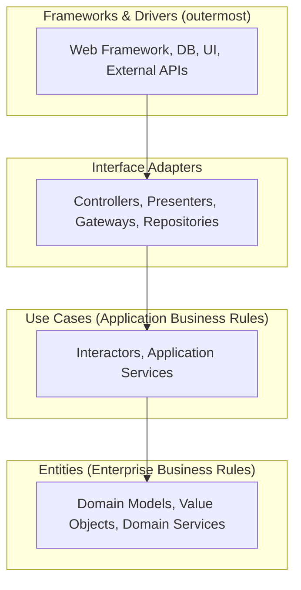
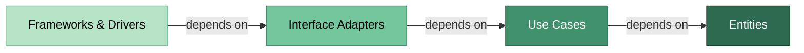
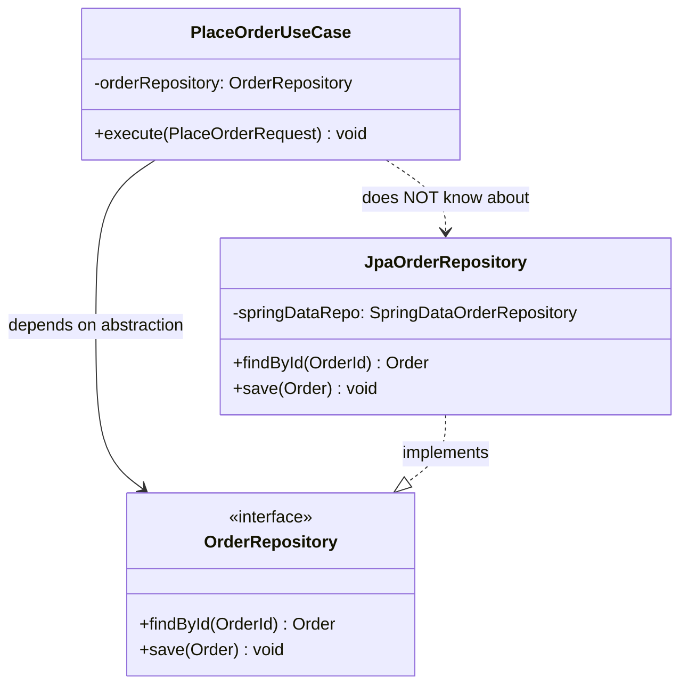
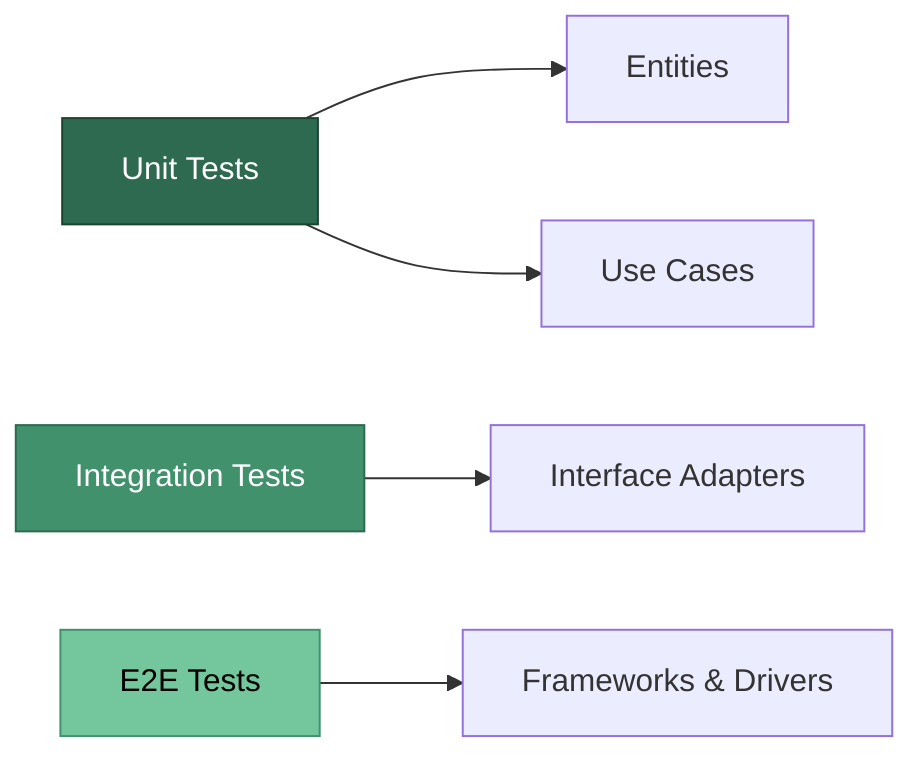

# Clean Architecture

!!! tip "Why This Matters for Senior Interviews"
    At FAANG companies, senior and staff engineers are expected to design systems that are **maintainable, testable, and adaptable** to changing requirements. Clean Architecture questions assess whether you can reason about **separation of concerns**, **dependency management**, and **long-term system evolution** — skills that distinguish senior engineers from mid-level developers.

---

## Overview

Clean Architecture, introduced by Robert C. Martin (Uncle Bob) in 2012, is a software design philosophy that separates concerns into concentric layers. The core principle is that **source code dependencies must point inward** — toward higher-level policies and away from implementation details.

---

## The Dependency Rule

> Source code dependencies can only point **inward**. Nothing in an inner circle can know anything about something in an outer circle.





---

## Layers Explained

### 1. Entities (Enterprise Business Rules)

The innermost layer contains **domain models** and **business rules** that are enterprise-wide. These are the least likely to change when something external changes.

- Pure domain objects with business logic
- Value Objects (e.g., `Money`, `Email`, `OrderId`)
- Domain Services (stateless operations on domain objects)
- No dependencies on any framework or external library

```java
// Entity - no framework dependencies
public class Order {
    private OrderId id;
    private CustomerId customerId;
    private List<OrderItem> items;
    private OrderStatus status;

    public Money calculateTotal() {
        return items.stream()
            .map(OrderItem::subtotal)
            .reduce(Money.ZERO, Money::add);
    }

    public void confirm() {
        if (items.isEmpty()) {
            throw new EmptyOrderException("Cannot confirm empty order");
        }
        this.status = OrderStatus.CONFIRMED;
    }
}
```

### 2. Use Cases (Application Business Rules)

Contains **application-specific** business rules. Orchestrates data flow to and from entities and directs those entities to use their enterprise-wide business rules.

- One class per use case (Single Responsibility)
- Defines input/output port interfaces
- Coordinates entities to fulfill a business operation
- Depends only on Entities layer

```java
public class PlaceOrderUseCase implements PlaceOrderInputPort {
    private final OrderRepository orderRepository;
    private final PaymentGateway paymentGateway;
    private final PlaceOrderOutputPort outputPort;

    public PlaceOrderUseCase(OrderRepository orderRepository,
                             PaymentGateway paymentGateway,
                             PlaceOrderOutputPort outputPort) {
        this.orderRepository = orderRepository;
        this.paymentGateway = paymentGateway;
        this.outputPort = outputPort;
    }

    @Override
    public void execute(PlaceOrderRequest request) {
        Order order = orderRepository.findById(request.getOrderId());
        order.confirm();
        paymentGateway.charge(order.getCustomerId(), order.calculateTotal());
        orderRepository.save(order);
        outputPort.presentSuccess(new PlaceOrderResponse(order.getId()));
    }
}
```

### 3. Interface Adapters

Converts data between the format most convenient for **use cases/entities** and the format required by **external agencies** (DB, web, etc.).

- Controllers (receive input from web/CLI)
- Presenters (format output for views)
- Gateway implementations
- Data mappers (ORM entities to domain entities)

```java
@RestController
@RequestMapping("/api/orders")
public class OrderController {
    private final PlaceOrderInputPort placeOrderUseCase;

    @PostMapping
    public ResponseEntity<OrderDto> placeOrder(@RequestBody PlaceOrderDto dto) {
        PlaceOrderRequest request = new PlaceOrderRequest(dto.getOrderId());
        placeOrderUseCase.execute(request);
        return ResponseEntity.accepted().build();
    }
}
```

### 4. Frameworks & Drivers

The outermost layer — composed of frameworks and tools. This is where all the details go: the database, the web framework, UI, etc.

- Spring Boot configuration
- JPA/Hibernate setup
- Message broker clients (Kafka, RabbitMQ)
- External API clients
- Database migrations

---

## Comparison with Other Architectures

| Aspect | Clean Architecture | Hexagonal (Ports & Adapters) | Onion Architecture |
|--------|-------------------|------------------------------|-------------------|
| **Author** | Robert C. Martin (2012) | Alistair Cockburn (2005) | Jeffrey Palermo (2008) |
| **Core Idea** | Concentric layers, dependency rule | Ports (interfaces) and Adapters (implementations) | Concentric layers around domain model |
| **Layers** | Entities, Use Cases, Adapters, Frameworks | Domain, Ports, Adapters | Domain, Domain Services, Application Services, Infrastructure |
| **Dependency Direction** | Inward only | Inward via ports | Inward only |
| **Primary Focus** | Separation of concerns across 4 layers | Interchangeability of external systems | Domain model centrality |
| **Testability** | High — mock outer layers | High — mock adapters | High — mock outer rings |
| **Use Case Concept** | Explicit layer | Implicit in application services | Application services layer |
| **Key Difference** | Prescribes specific layer responsibilities | Focuses on symmetry between input/output | Emphasizes domain model above all |

!!! note "They Are Conceptually Aligned"
    All three architectures share the same fundamental principle: **dependencies point inward toward the domain**. The differences are mostly in terminology and emphasis. In interviews, acknowledge this commonality.

---

## Java/Spring Boot Project Structure

```
com.example.orderservice/
|
+-- domain/                          # Entities Layer
|   +-- model/
|   |   +-- Order.java
|   |   +-- OrderItem.java
|   |   +-- OrderStatus.java
|   +-- valueobject/
|   |   +-- Money.java
|   |   +-- OrderId.java
|   +-- exception/
|       +-- EmptyOrderException.java
|
+-- application/                     # Use Cases Layer
|   +-- port/
|   |   +-- input/
|   |   |   +-- PlaceOrderInputPort.java
|   |   |   +-- GetOrderInputPort.java
|   |   +-- output/
|   |       +-- OrderRepository.java
|   |       +-- PaymentGateway.java
|   |       +-- PlaceOrderOutputPort.java
|   +-- usecase/
|   |   +-- PlaceOrderUseCase.java
|   |   +-- GetOrderUseCase.java
|   +-- dto/
|       +-- PlaceOrderRequest.java
|       +-- PlaceOrderResponse.java
|
+-- adapter/                         # Interface Adapters Layer
|   +-- input/
|   |   +-- web/
|   |   |   +-- OrderController.java
|   |   |   +-- OrderDto.java
|   |   +-- messaging/
|   |       +-- OrderEventListener.java
|   +-- output/
|       +-- persistence/
|       |   +-- JpaOrderRepository.java
|       |   +-- OrderJpaEntity.java
|       |   +-- OrderMapper.java
|       +-- payment/
|           +-- StripePaymentGateway.java
|
+-- infrastructure/                  # Frameworks & Drivers Layer
    +-- config/
    |   +-- BeanConfiguration.java
    |   +-- SecurityConfig.java
    +-- persistence/
        +-- SpringDataOrderRepository.java
```

---

## Dependency Inversion in Practice

The key mechanism that makes Clean Architecture work is the **Dependency Inversion Principle (DIP)**: inner layers define interfaces, outer layers provide implementations.



```java
// Defined in APPLICATION layer (inner)
public interface OrderRepository {
    Order findById(OrderId id);
    void save(Order order);
    List<Order> findByCustomerId(CustomerId customerId);
}

// Defined in APPLICATION layer (inner)
public interface PaymentGateway {
    PaymentResult charge(CustomerId customerId, Money amount);
}

// Implemented in ADAPTER layer (outer)
@Repository
public class JpaOrderRepository implements OrderRepository {
    private final SpringDataOrderRepository springDataRepo;
    private final OrderMapper mapper;

    @Override
    public Order findById(OrderId id) {
        OrderJpaEntity entity = springDataRepo.findById(id.getValue())
            .orElseThrow(() -> new OrderNotFoundException(id));
        return mapper.toDomain(entity);
    }

    @Override
    public void save(Order order) {
        OrderJpaEntity entity = mapper.toJpaEntity(order);
        springDataRepo.save(entity);
    }
}
```

---

## Benefits and Trade-offs

### Benefits

| Benefit | Explanation |
|---------|-------------|
| **Framework Independence** | Business logic does not depend on Spring, Hibernate, or any framework |
| **Testability** | Core logic can be tested without DB, web server, or external services |
| **UI Independence** | Swap a REST API for gRPC or CLI without touching business logic |
| **Database Independence** | Switch from PostgreSQL to MongoDB by changing adapter implementations |
| **Maintainability** | Changes in one layer rarely cascade to other layers |
| **Parallel Development** | Teams can work on different layers independently |

### Trade-offs

| Trade-off | When It Hurts |
|-----------|---------------|
| **More boilerplate** | Simple CRUD apps with little business logic |
| **Indirection overhead** | Mapping between layers adds code and cognitive load |
| **Over-engineering risk** | Microservices with single responsibility already isolate concerns |
| **Learning curve** | Teams unfamiliar with DIP may struggle initially |
| **Slower initial development** | Setup takes longer than a simple layered approach |

!!! warning "When Clean Architecture Is Overkill"
    - Simple CRUD applications with no business logic
    - Prototypes or MVPs where speed matters more than maintainability
    - Small scripts or utilities with a short lifespan
    - Applications where the framework IS the product (e.g., WordPress plugins)

    **Rule of thumb**: If your app is mostly data-in, data-out with minimal transformation, a simpler layered architecture may suffice.

---

## Complete Code Example: Order Use Case

Below is a complete, compilable example showing clean boundaries in action.

```java
// === DOMAIN LAYER ===
public record OrderId(UUID value) {}
public record CustomerId(UUID value) {}

public class Money {
    public static final Money ZERO = new Money(BigDecimal.ZERO);
    private final BigDecimal amount;

    public Money(BigDecimal amount) { this.amount = amount; }
    public Money add(Money other) { return new Money(this.amount.add(other.amount)); }
    public BigDecimal getAmount() { return amount; }
}

public class Order {
    private final OrderId id;
    private final CustomerId customerId;
    private final List<OrderItem> items;
    private OrderStatus status;

    public Order(OrderId id, CustomerId customerId, List<OrderItem> items) {
        this.id = id;
        this.customerId = customerId;
        this.items = new ArrayList<>(items);
        this.status = OrderStatus.DRAFT;
    }

    public Money calculateTotal() {
        return items.stream()
            .map(OrderItem::subtotal)
            .reduce(Money.ZERO, Money::add);
    }

    public void confirm() {
        if (items.isEmpty()) throw new EmptyOrderException(id);
        if (status != OrderStatus.DRAFT) throw new InvalidStateException(id, status);
        this.status = OrderStatus.CONFIRMED;
    }

    // getters omitted for brevity
}

// === APPLICATION LAYER ===
public interface PlaceOrderInputPort {
    PlaceOrderResponse execute(PlaceOrderRequest request);
}

public interface OrderRepository {
    Order findById(OrderId id);
    void save(Order order);
}

public interface PaymentGateway {
    PaymentResult charge(CustomerId customerId, Money amount);
}

public record PlaceOrderRequest(UUID orderId) {}
public record PlaceOrderResponse(UUID orderId, String status, BigDecimal total) {}

public class PlaceOrderUseCase implements PlaceOrderInputPort {
    private final OrderRepository orderRepository;
    private final PaymentGateway paymentGateway;

    public PlaceOrderUseCase(OrderRepository orderRepository,
                             PaymentGateway paymentGateway) {
        this.orderRepository = orderRepository;
        this.paymentGateway = paymentGateway;
    }

    @Override
    public PlaceOrderResponse execute(PlaceOrderRequest request) {
        Order order = orderRepository.findById(new OrderId(request.orderId()));
        order.confirm();

        Money total = order.calculateTotal();
        PaymentResult result = paymentGateway.charge(order.getCustomerId(), total);

        if (!result.isSuccessful()) {
            throw new PaymentFailedException(order.getId(), result.errorMessage());
        }

        orderRepository.save(order);
        return new PlaceOrderResponse(order.getId().value(), "CONFIRMED", total.getAmount());
    }
}

// === ADAPTER LAYER (Spring Controller) ===
@RestController
@RequestMapping("/api/v1/orders")
public class OrderController {
    private final PlaceOrderInputPort placeOrder;

    public OrderController(PlaceOrderInputPort placeOrder) {
        this.placeOrder = placeOrder;
    }

    @PostMapping("/{orderId}/confirm")
    public ResponseEntity<PlaceOrderResponse> confirmOrder(@PathVariable UUID orderId) {
        PlaceOrderResponse response = placeOrder.execute(new PlaceOrderRequest(orderId));
        return ResponseEntity.ok(response);
    }
}

// === INFRASTRUCTURE (Wiring) ===
@Configuration
public class BeanConfiguration {
    @Bean
    public PlaceOrderInputPort placeOrderUseCase(OrderRepository orderRepository,
                                                  PaymentGateway paymentGateway) {
        return new PlaceOrderUseCase(orderRepository, paymentGateway);
    }
}
```

---

## Testing Advantages

Clean Architecture makes testing significantly easier by allowing each layer to be tested in isolation.



| Layer | Test Type | Speed | Dependencies |
|-------|-----------|-------|--------------|
| Entities | Unit tests | Milliseconds | None |
| Use Cases | Unit tests with mocks | Milliseconds | Mocked ports |
| Interface Adapters | Integration tests | Seconds | Spring context, testcontainers |
| Frameworks & Drivers | E2E tests | Seconds-minutes | Full stack |

### Example: Testing a Use Case Without Any Framework

```java
class PlaceOrderUseCaseTest {

    private OrderRepository orderRepository;
    private PaymentGateway paymentGateway;
    private PlaceOrderUseCase useCase;

    @BeforeEach
    void setUp() {
        orderRepository = mock(OrderRepository.class);
        paymentGateway = mock(PaymentGateway.class);
        useCase = new PlaceOrderUseCase(orderRepository, paymentGateway);
    }

    @Test
    void shouldConfirmOrderAndChargePayment() {
        // Given
        Order order = new Order(
            new OrderId(UUID.randomUUID()),
            new CustomerId(UUID.randomUUID()),
            List.of(new OrderItem("Widget", new Money(new BigDecimal("29.99")), 2))
        );
        when(orderRepository.findById(any())).thenReturn(order);
        when(paymentGateway.charge(any(), any()))
            .thenReturn(PaymentResult.success());

        // When
        PlaceOrderResponse response = useCase.execute(
            new PlaceOrderRequest(order.getId().value())
        );

        // Then
        assertEquals("CONFIRMED", response.status());
        verify(orderRepository).save(order);
        verify(paymentGateway).charge(order.getCustomerId(), order.calculateTotal());
    }

    @Test
    void shouldRejectEmptyOrder() {
        // Given
        Order emptyOrder = new Order(
            new OrderId(UUID.randomUUID()),
            new CustomerId(UUID.randomUUID()),
            List.of()  // no items
        );
        when(orderRepository.findById(any())).thenReturn(emptyOrder);

        // When / Then
        assertThrows(EmptyOrderException.class, () ->
            useCase.execute(new PlaceOrderRequest(emptyOrder.getId().value()))
        );
        verify(paymentGateway, never()).charge(any(), any());
    }
}
```

!!! success "Key Testing Wins"
    - **No Spring context needed** for domain and use case tests
    - **No database needed** — repository is mocked
    - **Tests run in milliseconds**, not seconds
    - **Failure isolation** — a broken DB adapter does not break domain tests
    - **TDD friendly** — write use case tests before implementing adapters

---

## Interview Questions

??? question "What is the Dependency Rule in Clean Architecture, and why does it matter?"
    The Dependency Rule states that source code dependencies must only point **inward** — from outer layers (frameworks, UI, DB) toward inner layers (entities, use cases). This matters because it ensures that business logic is **isolated from infrastructure concerns**. If the database or web framework changes, the core domain remains untouched. In practice, this is achieved through **Dependency Inversion** — inner layers define interfaces (ports), and outer layers provide implementations (adapters).

??? question "How does Clean Architecture differ from traditional layered (N-tier) architecture?"
    In traditional layered architecture, dependencies flow **downward** (Controller -> Service -> Repository -> Database), and the domain layer often depends on the data access layer. In Clean Architecture, the dependency is **inverted** — the domain and use case layers define repository interfaces, and the infrastructure layer implements them. This means you can test business logic without a database, swap persistence strategies without touching domain code, and keep frameworks as replaceable plugins rather than foundational dependencies.

??? question "When would you NOT recommend Clean Architecture?"
    Clean Architecture adds indirection and boilerplate that is not justified when: (1) The application is primarily CRUD with little or no business logic, (2) It is a short-lived prototype or MVP where speed-to-market is paramount, (3) The team is small and the application scope is limited, (4) You are building framework-centric applications like WordPress plugins where the framework IS the architecture. The cost of mapping between layers and maintaining port/adapter interfaces outweighs the benefits in these scenarios.

??? question "Explain how you would implement the Repository pattern in Clean Architecture with Spring Data JPA."
    In Clean Architecture, the `OrderRepository` interface is defined in the **application layer** (inner). It uses domain types like `Order` and `OrderId`. The implementation `JpaOrderRepository` lives in the **adapter layer** (outer) and depends on a `SpringDataOrderRepository` (which extends `JpaRepository`). The adapter maps between JPA entities (`OrderJpaEntity`) and domain entities (`Order`) using a mapper class. Spring wires the adapter into the use case via constructor injection. The use case never knows about JPA, Hibernate, or Spring Data.

??? question "How does Clean Architecture improve testability compared to a traditional Spring Boot service?"
    In a typical Spring Boot app, service classes depend directly on Spring Data repositories and other Spring-managed beans, requiring a Spring context or `@DataJpaTest` to test. In Clean Architecture, use cases depend on **interfaces** (ports) with no framework annotations. You can unit-test them with plain Mockito mocks in milliseconds, without starting Spring. Entity tests require zero dependencies. Only adapter tests need integration infrastructure (like Testcontainers). This results in a faster test suite, better failure isolation, and easier TDD.

??? question "How would you handle cross-cutting concerns (logging, transactions, security) in Clean Architecture?"
    Cross-cutting concerns should NOT leak into use cases or entities. The recommended approaches are: (1) **Decorator pattern** — wrap use cases with a logging/transaction decorator that delegates to the real implementation, (2) **Aspect-Oriented Programming** — apply `@Transactional` or logging aspects at the adapter/infrastructure layer, (3) **Middleware/Interceptors** — handle security at the controller or framework layer before the request reaches use cases. The key principle is that the use case class remains focused purely on business orchestration logic.

---

## References

- [The Clean Architecture — Robert C. Martin](https://blog.cleancoder.com/uncle-bob/2012/08/13/the-clean-architecture.html)
- [Hexagonal Architecture — Alistair Cockburn](https://alistair.cockburn.us/hexagonal-architecture/)
- [Clean Architecture with Spring Boot — Baeldung](https://www.baeldung.com/spring-boot-clean-architecture)
- *Clean Architecture: A Craftsman's Guide to Software Structure and Design* — Robert C. Martin (2017)
