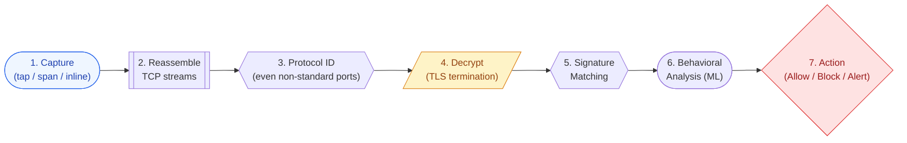
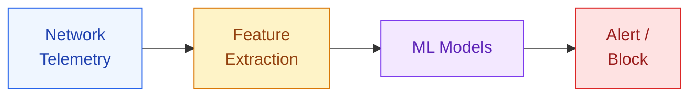
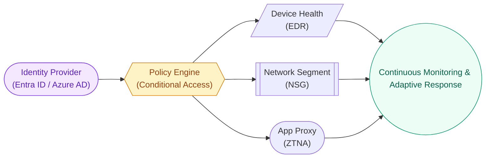

# Network Security & Threat Detection

This section bridges networking fundamentals with real-world security product development — the kind of work done at Microsoft Defender, CrowdStrike, and Palo Alto Networks.

---

## Network Threat Landscape

### Attack Categories by Layer

| Layer | Attack | Technique | Detection Strategy |
|---|---|---|---|
| L2 | ARP Spoofing | Fake ARP replies → MITM | ARP table monitoring, Dynamic ARP Inspection |
| L3 | IP Spoofing | Forged source IP | Ingress filtering (BCP38), RPF checks |
| L3 | ICMP Floods | Smurf/ping of death | Rate limiting, anomaly detection |
| L4 | SYN Flood | Half-open connection exhaustion | SYN cookies, connection rate monitoring |
| L4 | Port Scanning | Enumerate open services | Honeypots, scan detection heuristics |
| L7 | SQL Injection | Malicious SQL in HTTP params | WAF rules, input pattern analysis |
| L7 | DNS Tunneling | Data exfiltration via DNS | Query entropy analysis, ML models |
| L7 | C2 Beaconing | Periodic callbacks to attacker | Interval analysis, JA3/JA4 fingerprinting |
| Cross | Lateral Movement | Pivot through compromised hosts | Network flow correlation, microsegmentation |

---

## Deep Packet Inspection (DPI)

DPI examines packet payloads beyond headers — the core technology behind NGFWs and network security products.

### How DPI Works



### DPI Challenges

| Challenge | Explanation | Solution |
|---|---|---|
| Encrypted traffic | TLS hides payload | TLS inspection proxy, JA3 fingerprinting, metadata analysis |
| Performance | Line-rate inspection is expensive | Hardware offload (FPGA/ASIC), sampling |
| Evasion | Fragmentation, encoding tricks | Stream reassembly, normalization |
| Privacy | Inspecting user content | Policy-based selective inspection |

---

## TLS Inspection & Encrypted Traffic Analysis

### The Encrypted Traffic Problem

~95% of web traffic is encrypted. Attackers use TLS too — malware over HTTPS is invisible to traditional network security.

### Approaches

| Approach | How | Tradeoff |
|---|---|---|
| **TLS Interception (MITM proxy)** | Proxy terminates TLS, inspects, re-encrypts | Full visibility but breaks E2E encryption, certificate trust issues |
| **JA3/JA3S Fingerprinting** | Hash TLS ClientHello parameters | Identifies malware families without decryption |
| **JA4+ Fingerprinting** | Extended fingerprinting (JA4, JA4S, JA4H, JA4X) | More granular identification |
| **Metadata Analysis** | Certificate fields, SNI, flow timing, byte patterns | No decryption needed, lower accuracy |
| **ESNI/ECH Detection** | Detect encrypted SNI (privacy feature used by malware) | Identifies evasion attempts |

### JA3 Fingerprint (Widely Used in Defender)

```
JA3 = MD5(TLSVersion, Ciphers, Extensions, EllipticCurves, EllipticCurvePointFormats)

Example:
  TLS 1.2 ClientHello with specific cipher/extension combo
  → JA3: e7d705a3286e19ea42f587b344ee6865
  → Known to be associated with Cobalt Strike
```

---

## Command and Control (C2) Detection

### Common C2 Techniques

| Technique | Channel | Indicator |
|---|---|---|
| HTTP/HTTPS Beaconing | Port 80/443 | Regular intervals, small payloads, known C2 domains |
| DNS Tunneling | Port 53 | High entropy subdomains, TXT record abuse |
| Domain Fronting | CDN (appears legitimate) | SNI doesn't match Host header |
| Protocol Tunneling | ICMP, DNS, WebSocket | Unexpected data in protocol fields |
| Fast Flux DNS | Rapidly changing IPs | Short TTL, many A records |
| Tor/Proxy | Anonymous routing | Known exit node IPs |

### Detection Strategies



**Features extracted**: Beacon interval regularity (jitter), bytes up/down ratio, time-of-day patterns, domain age/WHOIS, TLS certificate characteristics, DNS query patterns, connection duration distribution.

**Models used**: Random Forest (beacon detection), LSTM (sequence-based), Isolation Forest (anomaly detection), Graph Neural Networks (lateral movement).

---

## Network Telemetry Collection

### Data Sources for Security Products

| Source | Data | Use |
|---|---|---|
| **NetFlow/IPFIX** | 5-tuple (src/dst IP, src/dst port, protocol) + bytes/packets | Flow analysis, baseline, anomaly detection |
| **DNS Logs** | Queries, responses, NXDOMAIN | Malware domain detection, DGA |
| **Packet Capture (PCAP)** | Full packet content | Forensics, signature matching |
| **Firewall Logs** | Allow/deny decisions | Policy violations, blocked attacks |
| **Proxy Logs** | HTTP method, URL, user-agent, response code | Web threat detection |
| **TLS Metadata** | Certificate info, JA3, SNI | Encrypted threat detection |
| **Endpoint Network Events** | Socket calls, DNS resolutions per process | Process-level network attribution |

### Defender for Endpoint — Network Signals

Microsoft Defender for Endpoint collects:

- Process-level network connections (which process opened which socket)
- DNS resolutions mapped to processes
- TLS certificate metadata
- Network flow summaries
- Inbound connection attempts

This enables queries like: "Show me all processes that connected to IPs in Country X in the last 24 hours" — combining OS-level and network-level telemetry.

---

## Zero Trust Network Architecture

### Principles

| Principle | Traditional | Zero Trust |
|---|---|---|
| Trust model | Trust inside perimeter | Never trust, always verify |
| Network access | Flat internal network | Microsegmented, least-privilege |
| Authentication | Once at perimeter | Continuous, per-request |
| Encryption | Only external traffic | All traffic (east-west included) |
| Monitoring | Perimeter-focused | All traffic, all endpoints |

### Implementation Components



---

## Protocol Analysis for Security

### HTTP Indicators of Compromise (IoC)

| Indicator | What It Suggests |
|---|---|
| Unusual User-Agent strings | Custom malware, scripted attacks |
| Encoded/obfuscated URLs | Payload delivery, WAF evasion |
| POST to uncommon endpoints | C2 communication, data exfiltration |
| High-frequency periodic requests | Beaconing behavior |
| Non-standard HTTP methods | Probing, exploitation |
| Abnormal Content-Length | Tunneling, data smuggling |

### DNS Indicators

| Indicator | What It Suggests |
|---|---|
| High NXDOMAIN rate | DGA (Domain Generation Algorithm) |
| Long subdomain labels (>30 chars) | DNS tunneling |
| High entropy in labels | Encoded data in queries |
| TXT record queries to obscure domains | C2 data exfiltration |
| Queries to newly registered domains | Malware infrastructure |
| Excessive queries from single host | Compromised host doing reconnaissance |

---

## Network Forensics

### Investigation Workflow

1. **Identify** — Alert triggers (IDS, EDR, SIEM correlation)
2. **Scope** — Determine affected hosts, timeframe, data flow
3. **Capture** — Preserve relevant PCAP, flow data, logs
4. **Analyze** — Reconstruct sessions, identify attacker actions
5. **Timeline** — Build chronological event sequence
6. **Report** — Document findings, indicators, recommendations

### Key Questions During Investigation

- What process initiated the connection? (endpoint telemetry)
- Where did the traffic go? (IP reputation, geo-location)
- What was transferred? (content analysis, byte patterns)
- How long did the connection last? (persistent C2 vs one-shot)
- Were other hosts contacted similarly? (lateral movement)

---

## Interview Questions

??? question "1. How would you design a system to detect lateral movement in a corporate network?"
    **Data sources**: (1) Authentication logs (Kerberos, NTLM), (2) Network flow data (east-west traffic), (3) Endpoint process-level connections, (4) SMB/RPC traffic logs. **Detection logic**: Build a baseline graph of normal communication patterns (which hosts normally talk to which). Flag anomalies: (1) New connections between previously unrelated hosts. (2) Admin tool usage (PsExec, WMI, PowerShell remoting) from non-admin workstations. (3) Kerberoasting patterns (TGS requests for service accounts). (4) Pass-the-hash indicators (NTLM from unusual sources). **Architecture**: Graph database for relationship modeling, streaming analytics for real-time detection, ML for anomaly scoring.

??? question "2. Design a network-based malware detection system that works with encrypted traffic."
    **Without decryption**: (1) JA3/JA4 fingerprinting — build a database of known malware TLS fingerprints. (2) Certificate analysis — self-signed certs, unusual validity periods, suspicious issuers. (3) Flow metadata — connection timing patterns (beaconing), byte ratios, duration. (4) DNS correlation — domain age, reputation, DGA detection. (5) SNI analysis — mismatches between SNI and certificate. **With decryption (enterprise)**: TLS inspection proxy at network boundary + full DPI + signature matching. **Hybrid approach**: Use metadata for initial triage, decrypt only suspicious flows to reduce performance impact and privacy concerns.

??? question "3. Explain how a DDoS mitigation system works."
    **Detection**: Monitor incoming traffic volume, packet rates, connection rates against baseline. Identify attack patterns (SYN flood, UDP amplification, HTTP flood). **Mitigation layers**: (1) **BGP anycast** — distribute traffic across global scrubbing centers. (2) **Rate limiting** — per-source-IP request limits. (3) **SYN cookies** — handle SYN floods without state. (4) **Challenge-response** — JavaScript challenges for HTTP floods (bot vs human). (5) **Traffic shaping** — prioritize legitimate traffic, drop attack traffic. (6) **Black hole routing** — last resort, null-route the target IP. **Cloud-scale**: Azure DDoS Protection/Cloudflare absorbs attacks at the network edge before reaching the origin.

??? question "4. What network signals would indicate a compromised endpoint phoning home to a C2 server?"
    (1) **Regular beacon intervals** — connections every N seconds (even with jitter, statistical analysis reveals periodicity). (2) **Small, consistent payload sizes** — heartbeat packets are typically tiny. (3) **Long-lived connections** — maintaining persistent channels. (4) **Communication to rare destinations** — IPs/domains not seen across the fleet. (5) **Abnormal timing** — activity during off-hours. (6) **DNS anomalies** — DGA-looking domains, high NXDOMAIN rate. (7) **TLS fingerprint match** — JA3 hash matching known C2 frameworks (Cobalt Strike, Metasploit). (8) **User-agent anomalies** — tools masquerading as browsers but with wrong fingerprint.
