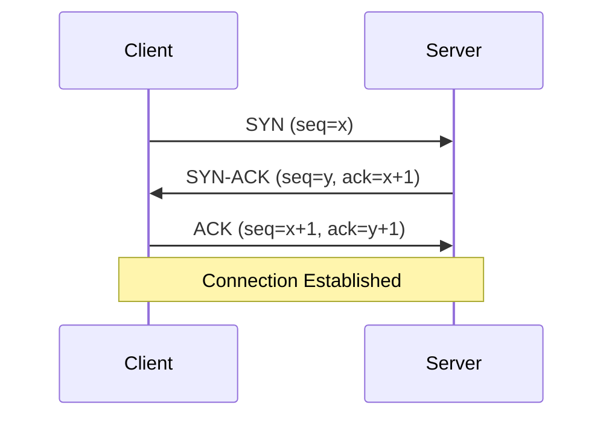
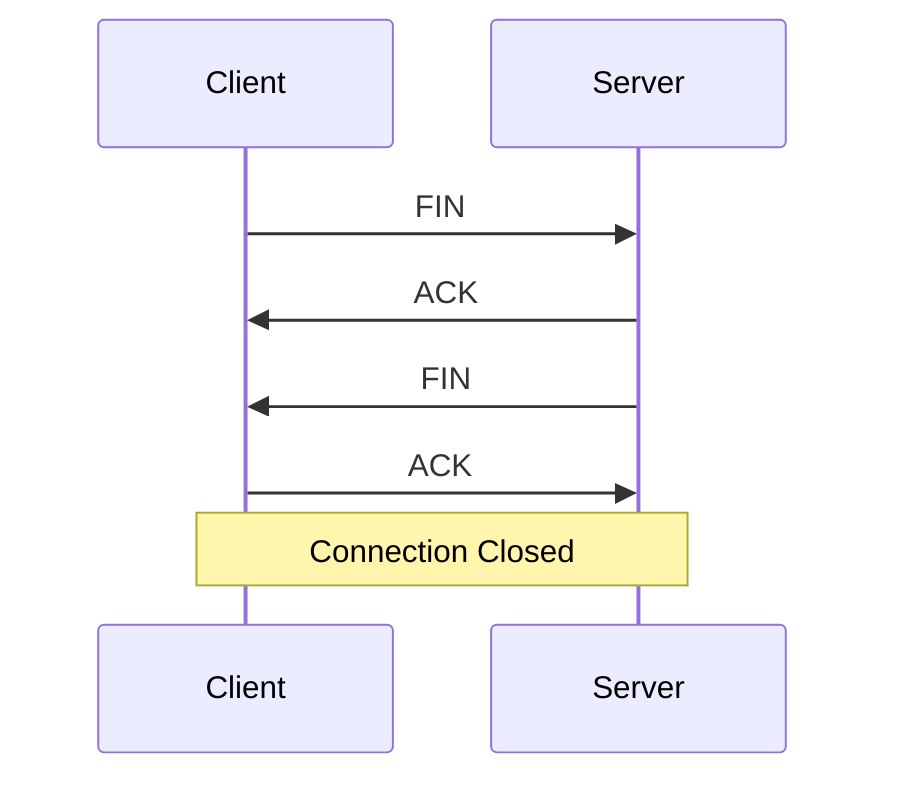
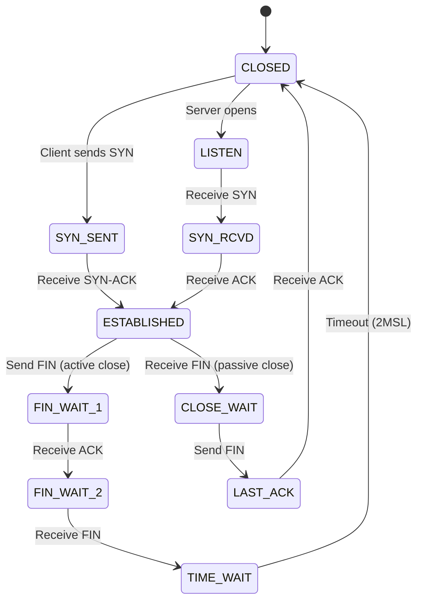
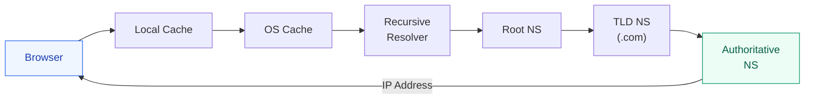
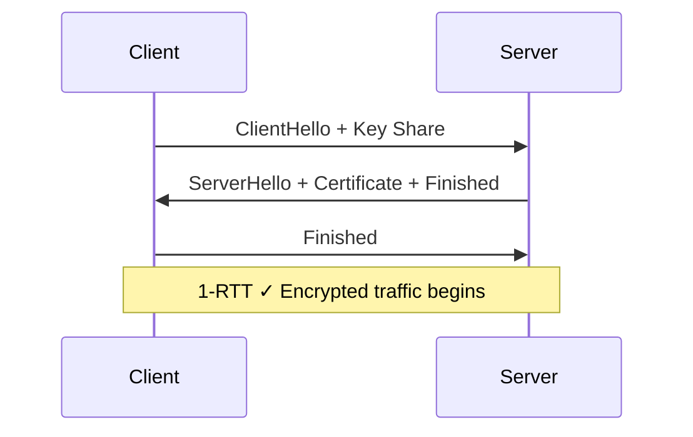

# Computer Networks

A deep understanding of networking is essential for building secure, high-performance distributed systems — and critical for security product development where you intercept, inspect, and protect network traffic at every layer.

---

## OSI Model vs TCP/IP Model

| OSI Layer | TCP/IP Layer | Function | Security Relevance |
|---|---|---|---|
| 7. Application | Application | HTTP, DNS, SMTP, TLS | WAF, DLP, threat detection |
| 6. Presentation | Application | Encryption, compression | TLS/SSL termination |
| 5. Session | Application | Session management | Session hijacking detection |
| 4. Transport | Transport | TCP, UDP, ports | Firewall rules, port scanning |
| 3. Network | Internet | IP, ICMP, routing | IDS/IPS, IP reputation |
| 2. Data Link | Network Access | Ethernet, MAC, ARP | ARP spoofing detection |
| 1. Physical | Network Access | Cables, signals | Physical security |

### Why This Matters for Security Products

An EDR/XDR agent inspects traffic at **multiple layers simultaneously**:

- Layer 3/4: Detect port scans, lateral movement
- Layer 7: Inspect HTTP payloads for malware, command-and-control (C2) beacons
- Cross-layer correlation: A DNS query (L7) + unusual TCP connection (L4) + process spawn (OS) = potential threat

---

## TCP — The Reliable Transport

### Three-Way Handshake



### Four-Way Termination



### TCP Header (Key Fields)

| Field | Size | Purpose |
|---|---|---|
| Source Port | 16 bits | Sender's port |
| Destination Port | 16 bits | Receiver's port |
| Sequence Number | 32 bits | Byte-stream position |
| Acknowledgment | 32 bits | Next expected byte |
| Flags | 6 bits | SYN, ACK, FIN, RST, PSH, URG |
| Window Size | 16 bits | Flow control (receive buffer) |
| Checksum | 16 bits | Error detection |

### TCP Flow Control & Congestion Control

| Mechanism | Purpose | How |
|---|---|---|
| **Sliding Window** | Flow control | Receiver advertises available buffer |
| **Slow Start** | Congestion avoidance | Exponential cwnd growth until threshold |
| **Congestion Avoidance** | Steady state | Linear cwnd growth after threshold |
| **Fast Retransmit** | Loss recovery | Retransmit after 3 duplicate ACKs |
| **Fast Recovery** | Maintain throughput | Don't reset to slow start after fast retransmit |

### TCP States



**Security insight**: A SYN flood attack exploits `SYN_RCVD` state — half-open connections exhaust server resources. **SYN cookies** mitigate this without storing state.

---

## UDP — The Fast Transport

| Feature | TCP | UDP |
|---|---|---|
| Connection | Connection-oriented | Connectionless |
| Reliability | Guaranteed delivery | Best effort |
| Ordering | Ordered | No ordering |
| Overhead | 20-60 byte header | 8 byte header |
| Use cases | HTTP, SSH, SMTP | DNS, DHCP, video, gaming |
| Speed | Slower (handshake, ACKs) | Faster (fire and forget) |

**Security insight**: DNS over UDP (port 53) is commonly exploited for amplification attacks. DNS response is much larger than request — attacker spoofs source IP to flood victim.

---

## IP Addressing

### IPv4 vs IPv6

| Feature | IPv4 | IPv6 |
|---|---|---|
| Address size | 32 bits | 128 bits |
| Notation | Dotted decimal (192.168.1.1) | Hex colons (2001:db8::1) |
| Address space | ~4.3 billion | ~3.4 × 10³⁸ |
| Header | Variable (20-60 bytes) | Fixed (40 bytes) |
| NAT needed | Yes | No (every device gets public IP) |
| IPSec | Optional | Built-in |

### Subnetting

```
192.168.1.0/24
├── Network:   192.168.1.0     (first address)
├── Usable:    192.168.1.1 - 192.168.1.254
└── Broadcast: 192.168.1.255   (last address)

Hosts = 2^(32 - prefix) - 2 = 2^8 - 2 = 254
```

| CIDR | Subnet Mask | Hosts |
|---|---|---|
| /8 | 255.0.0.0 | 16,777,214 |
| /16 | 255.255.0.0 | 65,534 |
| /24 | 255.255.255.0 | 254 |
| /28 | 255.255.255.240 | 14 |
| /32 | 255.255.255.255 | 1 (single host) |

### Private IP Ranges (RFC 1918)

| Class | Range | CIDR |
|---|---|---|
| A | 10.0.0.0 – 10.255.255.255 | 10.0.0.0/8 |
| B | 172.16.0.0 – 172.31.255.255 | 172.16.0.0/12 |
| C | 192.168.0.0 – 192.168.255.255 | 192.168.0.0/16 |

---

## DNS — Domain Name System

### Resolution Process



### Record Types

| Type | Purpose | Example |
|---|---|---|
| A | IPv4 address | example.com → 93.184.216.34 |
| AAAA | IPv6 address | example.com → 2606:2800:... |
| CNAME | Alias | www.example.com → example.com |
| MX | Mail server | example.com → mail.example.com |
| NS | Name server | example.com → ns1.example.com |
| TXT | Arbitrary text | SPF, DKIM, domain verification |
| SOA | Zone authority | Primary NS, serial, refresh timers |
| PTR | Reverse lookup | IP → domain name |

### DNS Security

| Attack | Description | Mitigation |
|---|---|---|
| DNS Spoofing/Cache Poisoning | Inject false records into resolver cache | DNSSEC (signed responses) |
| DNS Tunneling | Exfiltrate data via DNS queries | Monitor query patterns, payload size |
| DNS Amplification DDoS | Spoof source IP, query open resolvers | Rate limiting, response rate limiting (RRL) |
| Domain Generation Algorithms (DGA) | Malware generates random domains for C2 | ML-based detection of random domain patterns |

**Defender relevance**: Microsoft Defender detects DNS tunneling and DGA patterns by analyzing query entropy, frequency, and payload characteristics.

---

## HTTP/HTTPS

### HTTP/1.1 vs HTTP/2 vs HTTP/3

| Feature | HTTP/1.1 | HTTP/2 | HTTP/3 |
|---|---|---|---|
| Transport | TCP | TCP | QUIC (UDP) |
| Multiplexing | No (one req/connection) | Yes (streams) | Yes + no HoL blocking |
| Header compression | No | HPACK | QPACK |
| Server push | No | Yes | Yes |
| Connection setup | TCP + TLS (2-3 RTT) | Same | 0-1 RTT (QUIC) |

### TLS 1.3 Handshake



Key improvements over TLS 1.2: removed RSA key exchange (forward secrecy mandatory), 1-RTT handshake (was 2-RTT), removed weak ciphers.

### Common HTTP Status Codes

| Code | Meaning | Security Context |
|---|---|---|
| 200 | OK | — |
| 301/302 | Redirect | Open redirect vulnerabilities |
| 400 | Bad Request | Malformed input |
| 401 | Unauthorized | Missing/invalid auth |
| 403 | Forbidden | Insufficient permissions |
| 404 | Not Found | Information leakage if verbose |
| 429 | Too Many Requests | Rate limiting active |
| 500 | Internal Server Error | Error disclosure risk |
| 503 | Service Unavailable | DDoS indicator |

---

## Network Security Fundamentals

### Firewalls

| Type | Layer | Function |
|---|---|---|
| **Packet Filter** | L3/L4 | Allow/deny by IP, port, protocol |
| **Stateful** | L3/L4 | Track connection state (NEW, ESTABLISHED) |
| **Application (WAF)** | L7 | Inspect HTTP content, block SQL injection |
| **Next-Gen (NGFW)** | L3-L7 | Deep packet inspection + threat intelligence |

### IDS vs IPS

| Feature | IDS | IPS |
|---|---|---|
| Mode | Passive (monitor) | Inline (block) |
| Action | Alert only | Alert + drop/block |
| Placement | Span port / tap | Inline between network segments |
| Risk | Missed alerts | False positives block legitimate traffic |

### Network-Based Detection Techniques

| Technique | What It Detects | How |
|---|---|---|
| **Signature-based** | Known threats | Pattern matching against known malicious payloads |
| **Anomaly-based** | Unknown/zero-day | Deviation from baseline behavior (ML models) |
| **Behavioral** | Advanced persistent threats | Correlation of events over time |
| **Flow analysis** | Lateral movement, data exfiltration | NetFlow/sFlow metadata analysis |

---

## Network Address Translation (NAT)

### Types

| Type | Description | Use Case |
|---|---|---|
| **SNAT** | Change source IP (many → one) | Internal hosts accessing internet |
| **DNAT** | Change destination IP | Port forwarding to internal servers |
| **PAT** | SNAT + port mapping | Most home routers (overloading) |
| **1:1 NAT** | Static mapping | DMZ servers |

### NAT Traversal Challenges

NAT breaks end-to-end connectivity. Solutions:

- **STUN**: Discover public IP/port mapping
- **TURN**: Relay traffic through a server
- **ICE**: Try direct, then STUN, then TURN
- **UPnP/NAT-PMP**: Ask router to open ports

---

## Routing

### Protocols

| Protocol | Type | Algorithm | Use |
|---|---|---|---|
| **RIP** | Distance vector | Bellman-Ford | Small networks (max 15 hops) |
| **OSPF** | Link state | Dijkstra | Enterprise internal |
| **BGP** | Path vector | Policy-based | Internet backbone (AS-to-AS) |
| **EIGRP** | Hybrid | DUAL | Cisco networks |

### BGP Security

BGP has **no built-in authentication** — BGP hijacking can redirect internet traffic:

- **Route Origin Validation (ROV)**: RPKI certificates prove who owns a prefix
- **BGPsec**: Cryptographic path validation (not widely deployed)
- **Defender relevance**: Nation-state actors use BGP hijacking for surveillance. Security products monitor route changes for anomalies.

---

## ARP and Layer 2

### ARP (Address Resolution Protocol)

Maps IP addresses → MAC addresses on a local network.

```
"Who has 192.168.1.1? Tell 192.168.1.100"  → ARP Request (broadcast)
"192.168.1.1 is at AA:BB:CC:DD:EE:FF"      → ARP Reply (unicast)
```

### ARP Spoofing

Attacker sends fake ARP replies to associate their MAC with the gateway's IP → becomes man-in-the-middle.

**Detection**: Monitor for multiple IPs claiming same MAC, gratuitous ARP floods. EDR agents detect ARP table changes that indicate MITM.

---

## Network Monitoring & Packet Analysis

### Key Tools

| Tool | Purpose |
|---|---|
| **Wireshark** | GUI packet capture and analysis |
| **tcpdump** | CLI packet capture |
| **netstat/ss** | Active connections and listening ports |
| **nmap** | Network scanning, port discovery |
| **traceroute** | Path discovery (TTL-based) |
| **dig/nslookup** | DNS queries |

### Packet Capture for Security

```bash
# Capture all traffic on interface eth0
tcpdump -i eth0 -w capture.pcap

# Filter HTTP traffic
tcpdump -i eth0 port 80 or port 443

# Show DNS queries
tcpdump -i eth0 port 53 -vv

# Detect SYN scan (many SYN, no ACK)
tcpdump -i eth0 'tcp[tcpflags] & tcp-syn != 0 and tcp[tcpflags] & tcp-ack == 0'
```

---

## Interview Questions

??? question "1. What happens when you type google.com in the browser?"
    1. **DNS Resolution**: Browser cache → OS cache → recursive resolver → root NS → `.com` TLD → Google's authoritative NS → returns IP (142.250.x.x). 2. **TCP Connection**: Three-way handshake (SYN → SYN-ACK → ACK) to port 443. 3. **TLS Handshake**: ClientHello → ServerHello + certificate → key exchange → encrypted channel. 4. **HTTP Request**: `GET / HTTP/2` with headers (Host, User-Agent, Accept). 5. **Server Processing**: Load balancer → web server → application server → database. 6. **HTTP Response**: Status 200, HTML content, headers (Content-Type, Cache-Control). 7. **Rendering**: Parse HTML → build DOM → fetch CSS/JS → build CSSOM → render tree → paint.

??? question "2. How would you detect a SYN flood attack?"
    Monitor for: (1) High rate of half-open connections (`SYN_RCVD` state). (2) Many SYNs from diverse source IPs with no subsequent ACKs. (3) Server connection table filling up. **Mitigation**: SYN cookies (encode state in ISN, don't allocate resources until ACK), rate limiting, increasing backlog queue, using a CDN/DDoS protection service. **At the EDR level**: Monitor `netstat` output for abnormal `SYN_RCVD` counts and alert when threshold exceeded.

??? question "3. Explain how DNS tunneling works and how to detect it."
    **How**: Attacker encodes data in DNS query names (e.g., `base64data.evil.com`) and responses (TXT records). Since DNS is rarely blocked, it bypasses firewalls. The attacker's authoritative DNS server decodes the queries and relays data. **Detection**: (1) Unusually long subdomain labels (>50 chars). (2) High entropy in query names (random-looking strings). (3) Excessive DNS queries to a single domain. (4) Large TXT record responses. (5) Unusual query volume from a single host. ML models trained on query patterns achieve high accuracy.

??? question "4. What is the difference between a hub, switch, and router?"
    **Hub** (L1): Broadcasts all traffic to all ports — no intelligence. **Switch** (L2): Learns MAC addresses, forwards frames only to the correct port — reduces collisions. **Router** (L3): Routes packets between different networks using IP addresses — makes forwarding decisions based on routing tables. In security: switches can be configured with port security and VLANs; routers apply ACLs and connect to firewalls.

??? question "5. How does a CDN improve both performance and security?"
    **Performance**: Caches content at edge locations close to users → reduced latency, fewer origin requests. Uses anycast routing so users hit the nearest node. **Security**: (1) Absorbs DDoS by distributing attack across global network. (2) WAF at edge blocks malicious requests before reaching origin. (3) Hides origin server IP. (4) TLS termination at edge with always-updated certificates. (5) Bot detection and rate limiting. Examples: Cloudflare, Akamai, Azure Front Door.

??? question "6. Explain TCP vs UDP — when would a security product use each?"
    **TCP** for: Reliable telemetry upload from agents to cloud (can't lose alert data), management channel to endpoints, file transfer (malware samples). **UDP** for: Real-time log streaming (syslog/514), DNS monitoring, initial beacon check-ins where speed matters. A security agent typically uses TCP for critical alert delivery (guaranteed) but UDP for high-volume, loss-tolerant telemetry like network flow data.

??? question "7. What is a VLAN and how does it improve security?"
    A VLAN (Virtual LAN) segments a physical network into isolated broadcast domains at Layer 2. Security benefits: (1) **Isolation** — compromised device in VLAN-A can't directly reach VLAN-B. (2) **Reduced attack surface** — lateral movement requires routing through a firewall. (3) **Policy enforcement** — apply different security policies per VLAN. (4) **Compliance** — separate PCI/sensitive data traffic. A Zero Trust network uses micro-segmentation (extreme VLANs) to limit blast radius.
