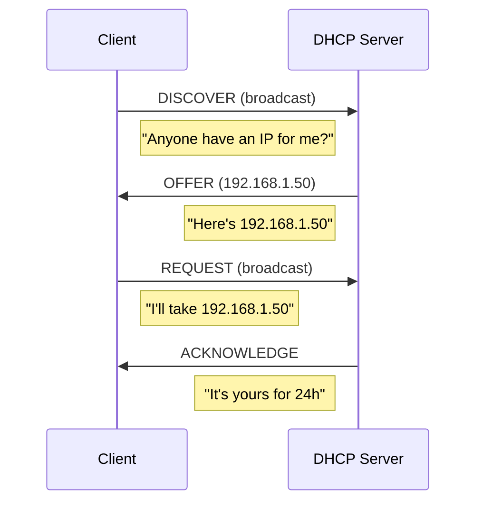
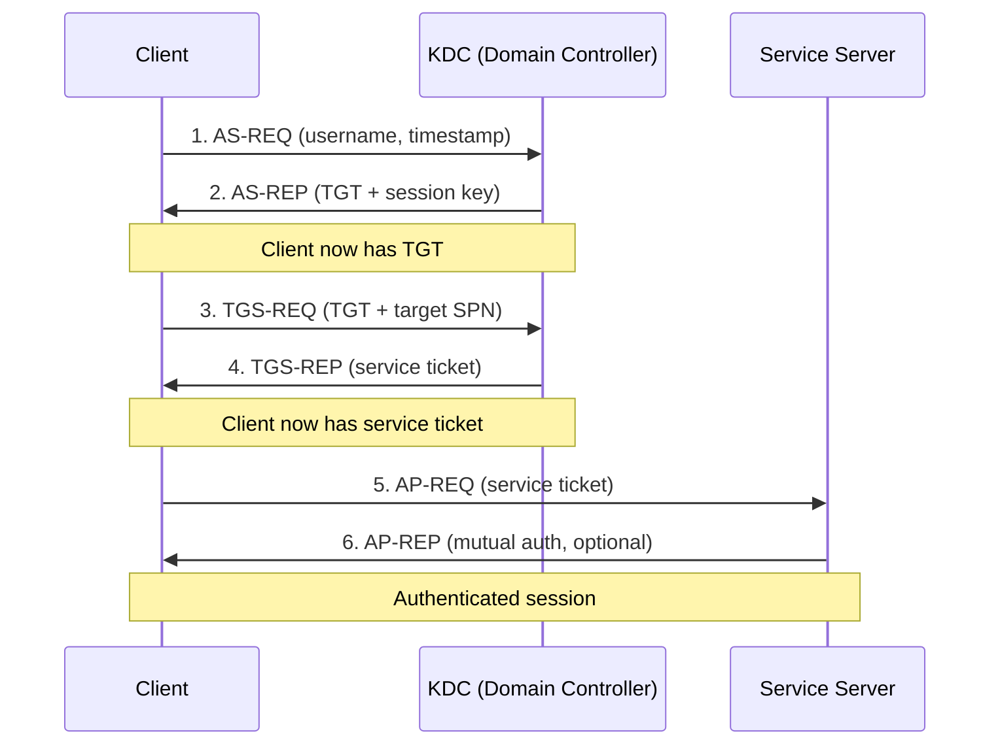
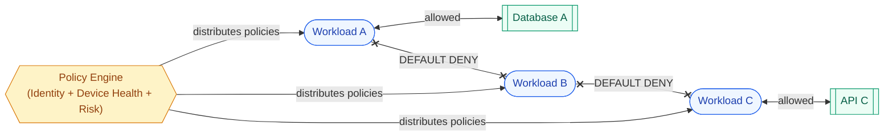

# Network Protocols Deep Dive

Production-level understanding of protocols you'll work with daily in network security product development.

---

## TCP Deep Dive

### Segment Structure

```
 0                   1                   2                   3
 0 1 2 3 4 5 6 7 8 9 0 1 2 3 4 5 6 7 8 9 0 1 2 3 4 5 6 7 8 9 0 1
├─┼─┼─┼─┼─┼─┼─┼─┼─┼─┼─┼─┼─┼─┼─┼─┼─┼─┼─┼─┼─┼─┼─┼─┼─┼─┼─┼─┼─┼─┼─┼─┤
│          Source Port          │       Destination Port        │
├─┼─┼─┼─┼─┼─┼─┼─┼─┼─┼─┼─┼─┼─┼─┼─┼─┼─┼─┼─┼─┼─┼─┼─┼─┼─┼─┼─┼─┼─┼─┼─┤
│                        Sequence Number                        │
├─┼─┼─┼─┼─┼─┼─┼─┼─┼─┼─┼─┼─┼─┼─┼─┼─┼─┼─┼─┼─┼─┼─┼─┼─┼─┼─┼─┼─┼─┼─┼─┤
│                    Acknowledgment Number                      │
├─┼─┼─┼─┼─┼─┼─┼─┼─┼─┼─┼─┼─┼─┼─┼─┼─┼─┼─┼─┼─┼─┼─┼─┼─┼─┼─┼─┼─┼─┼─┼─┤
│Offset│ Res │Flags│          Window Size                      │
├─┼─┼─┼─┼─┼─┼─┼─┼─┼─┼─┼─┼─┼─┼─┼─┼─┼─┼─┼─┼─┼─┼─┼─┼─┼─┼─┼─┼─┼─┼─┼─┤
│           Checksum            │        Urgent Pointer         │
├─┼─┼─┼─┼─┼─┼─┼─┼─┼─┼─┼─┼─┼─┼─┼─┼─┼─┼─┼─┼─┼─┼─┼─┼─┼─┼─┼─┼─┼─┼─┼─┤
│                    Options (if any)                           │
└─┴─┴─┴─┴─┴─┴─┴─┴─┴─┴─┴─┴─┴─┴─┴─┴─┴─┴─┴─┴─┴─┴─┴─┴─┴─┴─┴─┴─┴─┴─┴─┘
```

### TCP Flags and Their Security Significance

| Flag | Normal Use | Abuse/Attack |
|---|---|---|
| **SYN** | Connection initiation | SYN flood, SYN scan |
| **ACK** | Acknowledge data | ACK scan (firewall probing) |
| **FIN** | Connection termination | FIN scan (stealth port scan) |
| **RST** | Abort connection | RST injection (connection disruption) |
| **PSH** | Deliver immediately | Force immediate processing |
| **URG** | Urgent data | Rarely used, can confuse IDS |
| **XMAS** | (SYN+FIN+URG all set) | XMAS scan (IDS evasion) |
| **NULL** | (No flags) | NULL scan (IDS evasion) |

### TCP Attacks and Mitigations

| Attack | Mechanism | Mitigation |
|---|---|---|
| **SYN Flood** | Exhaust connection table with half-open connections | SYN cookies, increase backlog, rate limit |
| **RST Injection** | Send RST with correct sequence number to kill connections | Encrypted transport (TLS), TCP-AO |
| **Session Hijacking** | Predict sequence numbers, inject data | Randomized ISN, encrypted sessions |
| **TCP Replay** | Replay captured segments | Timestamps, sequence number validation |
| **Slow Loris** | Keep connections open with partial headers | Connection timeouts, max connections per IP |

---

## DHCP & Network Discovery

### DHCP Process (DORA)



### DHCP Attacks

| Attack | Description | Mitigation |
|---|---|---|
| **Rogue DHCP** | Attacker runs fake DHCP, assigns malicious DNS/gateway | DHCP snooping on switches |
| **DHCP Starvation** | Request all IPs with spoofed MACs | Port security, rate limiting |
| **DHCP Spoofing** | Fake DHCP responses | 802.1X authentication, DHCP snooping |

---

## ICMP & Network Diagnostics

### ICMP Message Types

| Type | Code | Name | Use |
|---|---|---|---|
| 0 | 0 | Echo Reply | Ping response |
| 3 | 0-15 | Destination Unreachable | Network/host/port unreachable |
| 5 | 0-3 | Redirect | Route optimization (can be abused) |
| 8 | 0 | Echo Request | Ping |
| 11 | 0-1 | Time Exceeded | Traceroute (TTL expired) |

### ICMP Security Concerns

| Attack | Description | Detection |
|---|---|---|
| **Ping flood** | Overwhelm with ICMP echo requests | Rate limiting, drop excessive ICMP |
| **ICMP tunneling** | Encode data in ping payloads | Payload size analysis, payload inspection |
| **ICMP redirect** | Reroute traffic through attacker | Block ICMP redirect at host |
| **Ping of death** | Oversized ICMP packet (historical) | Modern OS not vulnerable |

---

## SMB (Server Message Block)

Critical protocol for Windows environments — and a primary vector for lateral movement.

### SMB Versions

| Version | Windows | Key Changes |
|---|---|---|
| SMB 1.0 | XP/2003 | Vulnerable (EternalBlue), no encryption |
| SMB 2.0 | Vista/2008 | Reduced chattiness, larger buffers |
| SMB 2.1 | 7/2008R2 | Leasing, large MTU |
| SMB 3.0 | 8/2012 | Encryption, multichannel, direct storage access |
| SMB 3.1.1 | 10/2016 | Pre-auth integrity, AES-128-GCM |

### SMB Security

| Risk | Description | Mitigation |
|---|---|---|
| **EternalBlue** | Buffer overflow in SMB1 (MS17-010) | Disable SMB1, patch |
| **Pass-the-Hash** | Authenticate with NTLM hash directly | Credential Guard, disable NTLM |
| **Relay attacks** | Forward SMB auth to another host | SMB signing (required), EPA |
| **Enumeration** | List shares, users, groups | Restrict anonymous access |
| **Lateral movement** | PsExec over SMB (admin$) | Monitor SMB to admin shares |

**Detection**: Monitor for unusual SMB connections between workstations (normally only workstation-to-server), access to admin$ and C$ shares, and SMB traffic to non-standard ports.

---

## Kerberos Authentication

The primary authentication protocol in Active Directory environments.

### Kerberos Flow



### Kerberos Attacks

| Attack | Target | Detection |
|---|---|---|
| **Kerberoasting** | Request TGS for service accounts, crack offline | Unusual TGS requests for many SPNs |
| **AS-REP Roasting** | Accounts without pre-auth, crack AS-REP | Monitor for pre-auth disabled accounts |
| **Golden Ticket** | Forged TGT (requires KRBTGT hash) | TGT without corresponding AS-REQ |
| **Silver Ticket** | Forged service ticket (requires service hash) | Service ticket without TGS-REQ |
| **Pass-the-Ticket** | Steal and reuse existing tickets | Tickets used from unexpected IPs |
| **Overpass-the-Hash** | Use NTLM hash to get Kerberos ticket | NTLM auth followed by immediate Kerberos |
| **Skeleton Key** | Patch DC to accept master password | DC process integrity monitoring |

---

## Network Scanning & Reconnaissance

### Port Scan Types

| Scan Type | Method | Stealth | Detection |
|---|---|---|---|
| **TCP Connect** | Full handshake | Low (logged) | Connection logs |
| **SYN Scan** | SYN only (half-open) | Medium | IDS signature, half-open tracking |
| **FIN Scan** | FIN only | High | Unusual flag combinations |
| **XMAS Scan** | FIN+PSH+URG | High | Unusual flag combinations |
| **NULL Scan** | No flags | High | Packets with no flags |
| **UDP Scan** | UDP probe | Variable | ICMP unreachable responses |
| **ACK Scan** | ACK only (map firewall rules) | Medium | Unsolicited ACKs |

### Reconnaissance Detection

| Signal | Indicates |
|---|---|
| Single source contacting many ports on one host | Vertical port scan |
| Single source contacting one port on many hosts | Horizontal scan (worm-like) |
| Sequential port access pattern | Automated scanning tool |
| High rate of RST/ICMP unreachable responses | Scanning closed ports |
| DNS queries for internal hostnames from external | External reconnaissance |

---

## Network Segmentation & Microsegmentation

### Traditional vs Microsegmentation

| Aspect | Traditional (VLAN/Firewall) | Microsegmentation |
|---|---|---|
| Granularity | Network/subnet level | Per-workload/per-process |
| Policy basis | IP addresses, ports | Identity, labels, behavior |
| East-west traffic | Limited visibility | Full visibility and control |
| Scale | Hundreds of rules | Thousands+ auto-generated |
| Adaptation | Manual rule updates | Dynamic, follows workloads |

### Zero Trust Microsegmentation Architecture



---

## Wireless Network Security

| Standard | Encryption | Status |
|---|---|---|
| WEP | RC4 (24-bit IV) | Broken — crackable in minutes |
| WPA | TKIP (RC4-based) | Deprecated — weak |
| WPA2 | AES-CCMP | Current standard (KRACK vulnerability patched) |
| WPA3 | SAE (Dragonfly) | Latest — forward secrecy, no offline dictionary attacks |

### Wireless Attacks

| Attack | Description | Mitigation |
|---|---|---|
| **Evil Twin** | Fake AP mimicking legitimate one | 802.1X/EAP, certificate-based auth |
| **Deauth Attack** | Forge deauthentication frames | 802.11w (protected management frames) |
| **KRACK** | Reinstall key via handshake manipulation | WPA3, patched WPA2 implementations |
| **Karma/MANA** | Respond to all probe requests | Don't auto-connect to known SSIDs |

---

## Interview Questions

??? question "1. Explain how you would detect Kerberoasting in a network."
    **Kerberoasting** requests TGS tickets for service accounts, then cracks them offline. **Detection signals**: (1) Single user requesting TGS tickets for many different SPNs in a short window (normal users access 2-5 services, attacker requests dozens). (2) TGS requests with RC4 encryption (downgrade from AES — easier to crack). (3) Requests for service accounts that the user has never accessed before. (4) High volume of Event ID 4769 (TGS requested) from a single source. **Implementation**: Baseline normal TGS request patterns per user. Alert when: request count exceeds 3x baseline within 10 minutes, OR RC4 encryption requested for accounts that support AES, OR requests for known sensitive service accounts (SQL, backup, admin).

??? question "2. How does SMB relay work and how would you prevent it?"
    **How it works**: (1) Attacker positions themselves between client and server (via LLMNR/NBNS poisoning or compromised host). (2) Client attempts to authenticate to attacker's machine. (3) Attacker relays the NTLM authentication to a real server. (4) Server validates the relayed credentials and grants access. (5) Attacker now has authenticated session on the target server. **Prevention**: (1) **Require SMB signing** — signed packets can't be relayed (breaks the relay). (2) **Disable NTLM** where possible, use Kerberos. (3) **EPA (Extended Protection for Authentication)** — channel binding ties auth to the specific TLS session. (4) **Disable LLMNR/NBNS** — removes the initial poisoning vector. (5) **Network segmentation** — limit which hosts can initiate SMB to servers.

??? question "3. Design a network-level indicator of compromise (IoC) detection system."
    **Architecture**: (1) **Collection layer**: Network taps/span ports at key segments + DNS query logs + proxy logs + firewall logs + endpoint network events. (2) **Normalization**: Parse all sources into a common event format (source IP, dest IP, port, protocol, timestamp, bytes, metadata). (3) **IoC storage**: Bloom filter for fast hash lookups (IP, domain, URL hashes), trie structure for domain matching, radix tree for IP range matching. Update from threat intelligence feeds every 5 minutes. (4) **Matching engine**: Stream processor (Kafka + Flink) that checks every connection against IoC database. (5) **Context enrichment**: On match, enrich with: process info (from EDR), user info (from AD), geo-IP, WHOIS, domain age. (6) **Scoring**: Not every IoC match is critical — score based on IoC confidence, asset criticality, and behavioral context. (7) **Response**: High-confidence matches trigger automated blocking (DNS sinkhole, firewall block). Lower confidence triggers alert for analyst review.

??? question "4. What is the difference between network-level and host-level visibility for security monitoring?"
    **Network-level**: Sees all traffic between hosts. Strengths: can't be disabled by malware on endpoint, sees lateral movement, catches unmanaged devices. Weaknesses: encrypted traffic is opaque, no process context (which app made the connection), can miss loopback traffic. **Host-level (EDR)**: Sees per-process activity. Strengths: full process context (who, what, why), sees encrypted content before/after encryption, catches fileless attacks, monitors internal system calls. Weaknesses: can be disabled/evaded by sophisticated malware, doesn't see unmanaged devices. **Best practice**: Combine both. Network gives you coverage for unmanaged devices and cross-host correlation. Host gives you process-level attribution and encrypted traffic visibility. The combination is what XDR (Extended Detection and Response) provides — Microsoft Defender XDR correlates endpoint + network + identity + cloud signals.
