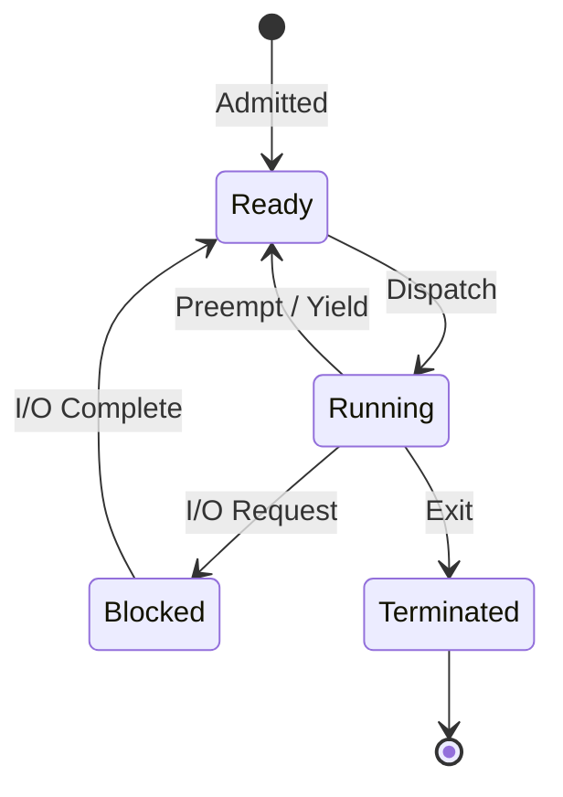
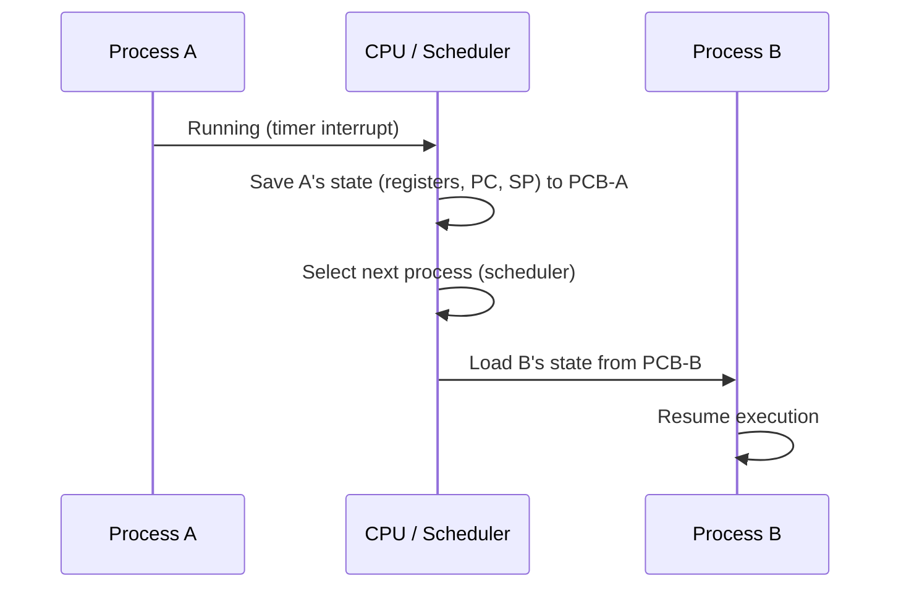
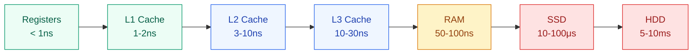
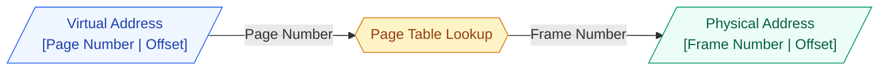
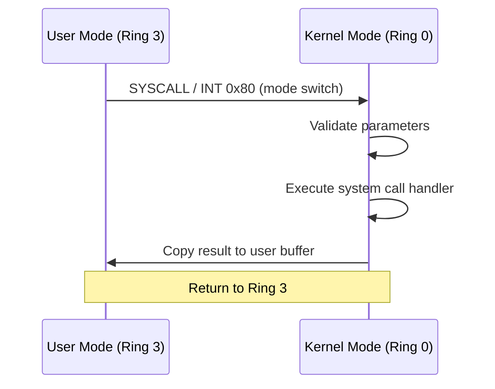
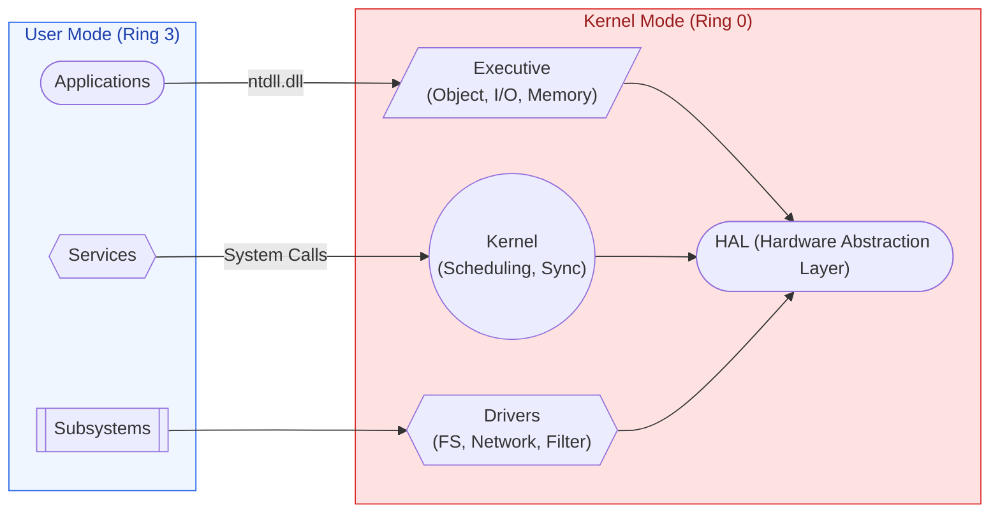
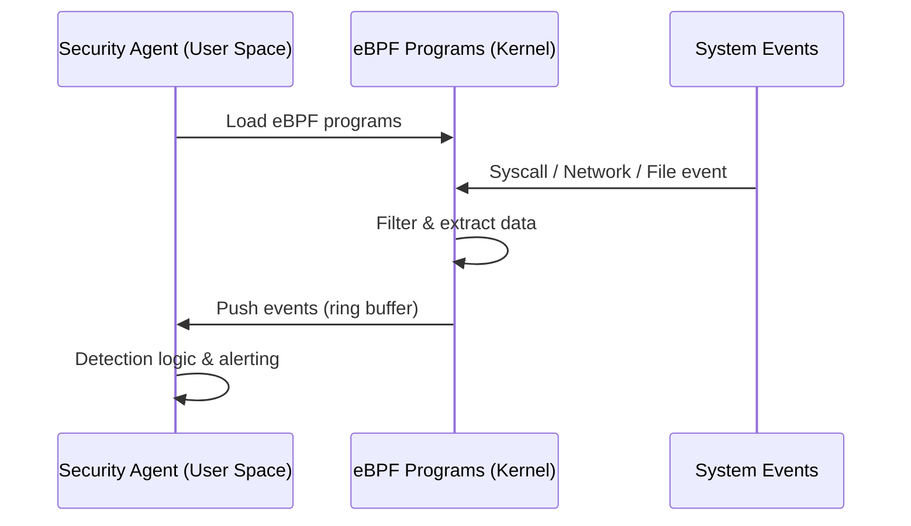

# Operating System Fundamentals

Understanding OS internals is foundational for security product development — EDR agents operate at the kernel/driver level, hooking system calls, monitoring process behavior, and protecting against rootkits.

---

## Process Management

### What is a Process?

A process is a program in execution — it includes:

| Component | Description |
|---|---|
| **Code (Text)** | The program instructions |
| **Data** | Global/static variables |
| **Heap** | Dynamically allocated memory |
| **Stack** | Function calls, local variables, return addresses |
| **PCB** | Process Control Block (OS metadata) |

### Process Control Block (PCB)

| Field | Purpose |
|---|---|
| Process ID (PID) | Unique identifier |
| Process State | Running, Ready, Blocked, Terminated |
| Program Counter | Next instruction address |
| CPU Registers | Saved register state |
| Memory Info | Page table base, limits |
| I/O Status | Open files, devices |
| Scheduling Info | Priority, CPU time used |
| Parent PID | Who spawned this process |

### Process States



### Process vs Thread

| Feature | Process | Thread |
|---|---|---|
| Memory | Separate address space | Shared address space |
| Creation cost | High (fork, copy page tables) | Low (share everything except stack) |
| Communication | IPC (pipes, sockets, shared mem) | Direct memory access |
| Crash isolation | One crash doesn't affect others | One thread crash kills all threads |
| Context switch | Expensive (TLB flush, page table switch) | Cheap (same address space) |
| Use case | Isolation (browser tabs, microservices) | Parallelism within a task (web server) |

**Security relevance**: Malware often injects threads into legitimate processes (process hollowing, DLL injection) to evade detection. EDR agents monitor thread creation across process boundaries.

### Process Creation

| OS | System Call | Mechanism |
|---|---|---|
| Linux | `fork()` + `exec()` | Copy parent, then replace with new program |
| Linux (modern) | `clone()` | Fine-grained control (share memory, files, etc.) |
| Windows | `CreateProcess()` | Create new process directly (no fork) |
| Windows | `NtCreateProcess()` | Low-level native API |

### Interprocess Communication (IPC)

| Method | Speed | Use Case |
|---|---|---|
| **Pipes** | Fast | Parent-child communication (unidirectional) |
| **Named Pipes (FIFO)** | Fast | Unrelated processes |
| **Message Queues** | Medium | Structured message passing |
| **Shared Memory** | Fastest | High-throughput data sharing |
| **Sockets** | Medium | Network or local communication |
| **Signals** | Fast | Simple notifications (SIGTERM, SIGKILL) |
| **Memory-Mapped Files** | Fast | File-backed shared memory |

---

## CPU Scheduling

### Scheduling Criteria

| Metric | Definition | Optimize |
|---|---|---|
| **CPU Utilization** | % time CPU is busy | Maximize |
| **Throughput** | Processes completed per time unit | Maximize |
| **Turnaround Time** | Total time from submission to completion | Minimize |
| **Waiting Time** | Time spent in ready queue | Minimize |
| **Response Time** | Time from request to first response | Minimize |

### Scheduling Algorithms

| Algorithm | Type | Description | Pros | Cons |
|---|---|---|---|---|
| **FCFS** | Non-preemptive | First come, first served | Simple | Convoy effect |
| **SJF** | Non-preemptive | Shortest job next | Optimal avg. wait | Starvation of long jobs |
| **SRTF** | Preemptive | Shortest remaining time first | Better than SJF | Starvation, hard to predict burst |
| **Round Robin** | Preemptive | Fixed time quantum, rotate | Fair, good response time | High context switch overhead if quantum too small |
| **Priority** | Both | Higher priority runs first | Important tasks get CPU | Starvation (solved by aging) |
| **Multilevel Queue** | Both | Multiple queues with different policies | Class-based scheduling | Inflexible |
| **MLFQ** | Preemptive | Move between queues based on behavior | Adaptive, no prior knowledge needed | Complex |
| **CFS (Linux)** | Preemptive | Red-black tree, virtual runtime fairness | Fair, scalable | Overhead for RT workloads |

### Context Switch



Cost: ~1-10 microseconds (varies by architecture and cache state)

**Security relevance**: Context switch overhead matters for EDR agents — they hook system calls and must process them with minimal latency to avoid user-visible performance degradation.

---

## Memory Management

### Memory Hierarchy



### Virtual Memory

Every process gets its own virtual address space — the OS + MMU translates to physical addresses.

| Concept | Description |
|---|---|
| **Page** | Fixed-size block of virtual memory (typically 4KB) |
| **Frame** | Physical memory block (same size as page) |
| **Page Table** | Maps virtual pages to physical frames |
| **TLB** | Cache for page table entries (Translation Lookaside Buffer) |
| **Page Fault** | Page not in RAM, must load from disk |
| **Swap Space** | Disk area for evicted pages |

### Page Table Structure



### Multi-Level Page Tables

Single-level page table for 32-bit address space with 4KB pages = 2^20 entries x 4 bytes = **4MB per process** (wasteful for sparse address spaces).

**Solution**: Multi-level (hierarchical) page tables — only allocate table pages for regions actually used.

```
x86-64 uses 4-level page tables:
PML4 (512 entries) → PDPT → PD → PT → Physical Frame
```

### Page Replacement Algorithms

| Algorithm | Description | Used In Practice? |
|---|---|---|
| **FIFO** | Evict oldest page | Simple but Belady's anomaly |
| **LRU** | Evict least recently used | Good but expensive to implement exactly |
| **Clock (Second Chance)** | FIFO with reference bit | Linux (approximation of LRU) |
| **LFU** | Evict least frequently used | Doesn't adapt to changing patterns |
| **Optimal** | Evict page used farthest in future | Theoretical (used as benchmark) |

### Memory Protection

| Mechanism | Purpose | Security |
|---|---|---|
| **Page permissions** | R/W/X bits per page | Prevent code execution on stack (NX bit) |
| **ASLR** | Randomize memory layout | Prevent ROP/buffer overflow exploitation |
| **Stack canaries** | Detect stack smashing | Guard values before return address |
| **Guard pages** | Unmapped pages between regions | Detect overflows |
| **SMEP/SMAP** | Prevent kernel executing/reading user pages | Kernel exploit mitigation |
| **W^X** | Page is writable OR executable, never both | Prevent code injection |

**Defender relevance**: EDR agents monitor for processes that allocate memory with RWX permissions (common in malware shellcode injection) and detect ASLR bypass attempts.

---

## File Systems

### File System Concepts

| Concept | Description |
|---|---|
| **Inode** | Metadata structure (permissions, timestamps, block pointers) |
| **Superblock** | File system metadata (size, free blocks, inode count) |
| **Directory** | Mapping of names to inodes |
| **Block** | Minimum allocation unit (typically 4KB) |
| **Journal** | Log for crash recovery (ext4, NTFS) |

### Common File Systems

| FS | OS | Key Features |
|---|---|---|
| **ext4** | Linux | Journaling, extents, 1EB max volume |
| **XFS** | Linux | High performance, parallel I/O |
| **Btrfs** | Linux | Copy-on-write, snapshots, checksums |
| **NTFS** | Windows | ACLs, encryption (EFS), journaling, ADS |
| **APFS** | macOS | Copy-on-write, encryption, snapshots |

### NTFS Alternate Data Streams (Security Relevant)

NTFS allows multiple data streams per file — commonly abused by malware:

```
file.txt           ← Main data stream (visible normally)
file.txt:hidden    ← Alternate Data Stream (invisible to dir, hidden payload)
```

**Detection**: Defender scans ADS for malicious content. `dir /r` reveals streams.

### File System Permissions

| System | Model | Components |
|---|---|---|
| Linux | DAC (Discretionary Access Control) | Owner/Group/Other x Read/Write/Execute |
| Linux | MAC (SELinux/AppArmor) | Type enforcement, mandatory policies |
| Windows | ACL (Access Control Lists) | Per-object DACLs with fine-grained permissions |
| Windows | Integrity Levels | Low/Medium/High/System — processes can't write up |

---

## Synchronization & Concurrency

### Critical Section Problem

Multiple processes/threads accessing shared resource — must ensure:

1. **Mutual Exclusion** — Only one in critical section at a time
2. **Progress** — If none in CS, selection among waiting can't be postponed indefinitely
3. **Bounded Waiting** — Limit on how long a process waits to enter CS

### Synchronization Primitives

| Primitive | Description | Use Case |
|---|---|---|
| **Mutex** | Binary lock (one holder) | Protecting shared data |
| **Semaphore** | Counter-based (N holders) | Resource pools, producer-consumer |
| **Spinlock** | Busy-wait lock | Short critical sections in kernel |
| **Read-Write Lock** | Multiple readers OR one writer | Read-heavy workloads |
| **Condition Variable** | Wait for a condition | Producer-consumer coordination |
| **Barrier** | Wait until N threads arrive | Parallel computation phases |

### Classic Problems

| Problem | Description | Solution |
|---|---|---|
| **Producer-Consumer** | Bounded buffer between producer and consumer | Semaphores (empty/full/mutex) |
| **Readers-Writers** | Multiple readers or single writer | Read-write locks with priority policy |
| **Dining Philosophers** | Circular dependency on resources | Resource ordering, or Chandy/Misra |

### Deadlock

Four necessary conditions (all must hold):

1. **Mutual Exclusion** — Resources are non-sharable
2. **Hold and Wait** — Process holds one resource, waits for another
3. **No Preemption** — Resources can't be forcibly taken
4. **Circular Wait** — Circular chain of processes waiting

**Prevention**: Break any one condition (e.g., resource ordering breaks circular wait).

**Detection**: Build a resource allocation graph, detect cycles.

**Recovery**: Kill a process, preempt a resource, or rollback.

---

## System Calls & Kernel Mode

### User Mode vs Kernel Mode

| Feature | User Mode | Kernel Mode |
|---|---|---|
| Privilege level | Ring 3 (restricted) | Ring 0 (full access) |
| Hardware access | No direct access | Full hardware control |
| Memory access | Only own address space | All physical memory |
| Failure impact | Only that process crashes | Entire system crashes (BSOD/panic) |
| Transition | System call (trap/interrupt) | Return from system call |

### System Call Categories

| Category | Examples (Linux) | Examples (Windows) |
|---|---|---|
| Process | fork, exec, wait, exit | CreateProcess, TerminateProcess |
| File | open, read, write, close | CreateFile, ReadFile, WriteFile |
| Memory | mmap, brk, munmap | VirtualAlloc, VirtualProtect |
| Network | socket, bind, listen, accept | WSASocket, connect |
| IPC | pipe, shmget, msgget | CreatePipe, CreateFileMapping |

### System Call Flow



**Security relevance**: EDR agents hook system calls (via filter drivers on Windows, eBPF on Linux) to monitor all process activity — file access, network connections, process creation, registry modifications.

---

## Windows Internals (Defender-Relevant)

### Windows Architecture



### Key Windows Security Components

| Component | Purpose | How Defender Uses It |
|---|---|---|
| **LSASS** | Authentication, credential storage | Monitors for credential dumping (Mimikatz) |
| **ETW (Event Tracing for Windows)** | Kernel and user-mode event telemetry | Primary telemetry source for EDR |
| **Minifilter Drivers** | File system filtering | Real-time file scanning, ransomware detection |
| **AMSI** | Antimalware Scan Interface | Scans scripts (PowerShell, VBS, JS) before execution |
| **Credential Guard** | Isolate LSASS in VM (VBS) | Prevent credential theft |
| **Kernel Patch Protection (PatchGuard)** | Prevent kernel modification | Detect rootkits |
| **Code Integrity (WDAC)** | Allow only signed code | Block unsigned malware |

### Windows Security Events (Key for Detection)

| Event ID | Description | Why It Matters |
|---|---|---|
| 4624 | Successful logon | Track access patterns |
| 4625 | Failed logon | Brute force detection |
| 4648 | Explicit credentials (runas) | Lateral movement indicator |
| 4672 | Special privileges assigned | Privilege escalation |
| 4688 | Process creation | Track process execution chains |
| 4697 | Service installed | Persistence mechanism |
| 4698 | Scheduled task created | Persistence mechanism |
| 4720 | User account created | Backdoor accounts |
| 7045 | Service registered | Persistence, malware installation |

---

## Linux Internals (Security-Relevant)

### Linux Security Modules

| Module | Purpose |
|---|---|
| **SELinux** | Mandatory Access Control (label-based) |
| **AppArmor** | Path-based MAC (simpler than SELinux) |
| **seccomp** | Restrict available system calls per process |
| **namespaces** | Isolation (PID, network, mount, user) |
| **cgroups** | Resource limits (CPU, memory, I/O) |
| **eBPF** | Programmable kernel hooks (observability, security) |

### eBPF for Security (Modern EDR Foundation)



eBPF advantages over traditional kernel modules:

- Verified at load time (can't crash kernel)
- No kernel rebuild needed
- Near-native performance
- Dynamic attach/detach

---

## Storage & I/O

### I/O Models

| Model | Description | Use Case |
|---|---|---|
| **Blocking I/O** | Thread waits until complete | Simple applications |
| **Non-blocking I/O** | Returns immediately, check later | Polling-based servers |
| **I/O Multiplexing** | select/poll/epoll — wait on multiple FDs | Event-driven servers (Nginx) |
| **Async I/O** | Kernel notifies when complete | High-performance I/O (io_uring) |
| **Memory-Mapped I/O** | Map file to memory, access like array | Databases, large files |

### Disk Scheduling

| Algorithm | Description |
|---|---|
| **FCFS** | First come first served |
| **SSTF** | Shortest seek time first |
| **SCAN (Elevator)** | Move in one direction, service all, reverse |
| **C-SCAN** | Like SCAN but only services in one direction, jumps back |
| **CFQ (Linux)** | Completely Fair Queuing — fair I/O per process |
| **Deadline** | Guarantees maximum wait time per request |

---

## Interview Questions

??? question "1. Explain the difference between a process and a thread. When would you use each in a security agent?"
    **Process**: Independent address space, crash isolation, heavier creation. **Thread**: Shared address space, lightweight, can corrupt each other. **In an EDR agent**: Use **separate processes** for isolation — the scanning engine runs in its own process so a malware-triggered crash doesn't kill the monitoring agent. Use **threads** within the monitoring agent for parallelism — one thread watches process creation, another monitors file operations, another handles network events. The driver component (kernel) must be single-process but can use kernel threads for concurrent monitoring of different subsystems.

??? question "2. How does virtual memory help with security?"
    (1) **Process isolation** — each process has its own address space, can't read/write other processes' memory (without kernel cooperation). (2) **ASLR** — randomize stack, heap, library base addresses to prevent ROP attacks. (3) **NX/DEP** — mark data pages non-executable so injected shellcode can't run. (4) **Guard pages** — detect buffer overflows. (5) **Copy-on-write** — fork() shares pages read-only until write, efficiently creating isolated processes. (6) **Memory-mapped files** — controlled sharing with permissions. For EDR: monitors VirtualProtect calls that change page permissions to RWX (shellcode injection indicator).

??? question "3. What is a race condition and how can it be exploited?"
    A race condition occurs when the correctness of a program depends on the timing of events (typically thread scheduling). **Security exploitation**: TOCTOU (Time-of-Check-Time-of-Use) — check if a file is safe, then between the check and the open, attacker replaces it with a malicious file (symlink race). **Kernel race conditions** can lead to privilege escalation: if a kernel data structure is accessed concurrently without proper locking, an attacker can manipulate it (e.g., Dirty COW exploit — race in copy-on-write handling allowed writing to read-only pages). **Mitigation**: Proper locking, atomic operations, file descriptor passing instead of path-based access.

??? question "4. How does an EDR agent monitor process creation on Windows?"
    Multiple mechanisms: (1) **PsSetCreateProcessNotifyRoutine** — kernel callback that fires on every process creation/termination. The minifilter driver registers this callback. (2) **ETW (Event Tracing for Windows)** — subscribe to Microsoft-Windows-Kernel-Process provider for process events with command-line arguments. (3) **Minifilter for image loads** — PsSetLoadImageNotifyRoutine fires when DLLs are loaded (detect DLL injection). (4) **User-mode hooks** — hook CreateProcess in ntdll.dll (less reliable, can be bypassed). The kernel callbacks are preferred because they can't be easily unhooked by malware running in user mode. Defender uses the kernel callback to capture the full process tree: parent PID, command line, image hash, and user context.

??? question "5. Explain how a rootkit hides from the operating system and how to detect it."
    **Hiding techniques**: (1) **DKOM (Direct Kernel Object Manipulation)** — unlink process from the kernel's process list (PsActiveProcessHead) so it doesn't appear in Task Manager. (2) **SSDT hooking** — modify System Service Dispatch Table to intercept system calls and hide files/processes. (3) **Inline hooking** — patch kernel function prologs to redirect execution. (4) **Bootkits** — infect boot process before OS loads, control everything from the start. **Detection**: (1) Cross-reference multiple sources (process list vs scheduler queue vs handle table). (2) Memory scanning for known rootkit signatures. (3) Integrity checking of kernel code pages. (4) Secure Boot plus UEFI firmware checks. (5) Hypervisor-based monitoring (runs below the OS — rootkit can't hide from it). Defender uses Virtualization-Based Security (VBS) to monitor from a hypervisor layer the rootkit can't reach.

??? question "6. What happens during a context switch and why does it matter for performance?"
    **Steps**: (1) Save current process state (PC, registers, stack pointer) to its PCB. (2) Update process state (Running to Ready/Blocked). (3) Select next process (scheduler). (4) Load new process state from PCB. (5) Flush TLB (if switching address spaces — not needed for thread switch within same process). (6) Restore CPU and resume. **Performance impact**: Direct cost is ~1-10 microseconds, but indirect cost is much larger — TLB misses and cold caches after switch can cause 100x slowdown for cache-sensitive code. **For security agents**: Frequent context switches between the agent and monitored processes reduce system throughput. This is why modern EDR uses eBPF (Linux) or ETW (Windows) — event-driven, not polling-based — to minimize context switches while maintaining full visibility.

??? question "7. How does ASLR work and what are its limitations?"
    **How**: On each process start, the OS randomizes the base addresses of: stack, heap, loaded libraries (DLLs/shared objects), and the executable itself (PIE). An attacker who knows a buffer overflow exists can't reliably predict where their shellcode or ROP gadgets will be. **Entropy**: Linux provides ~28 bits for mmap base, ~22 bits for stack. Windows provides less (8-19 bits depending on architecture). **Limitations**: (1) Information leaks (format string bugs) can reveal addresses. (2) 32-bit systems have limited entropy (can be brute-forced). (3) Non-PIE executables have a fixed base address. (4) Fork-based servers share the same layout across children. (5) Side-channel attacks can reveal ASLR base. Modern exploits typically chain an info leak plus code execution to bypass ASLR.
