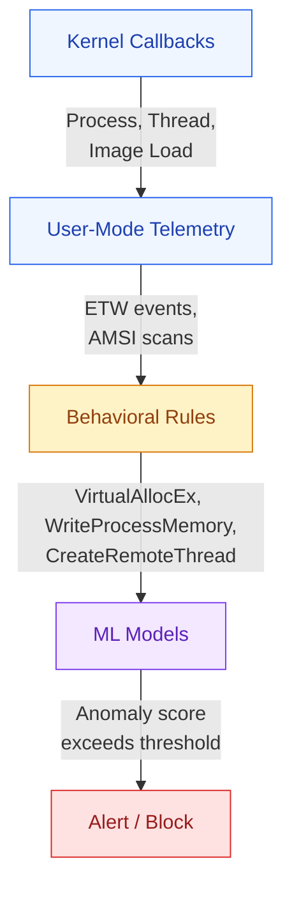
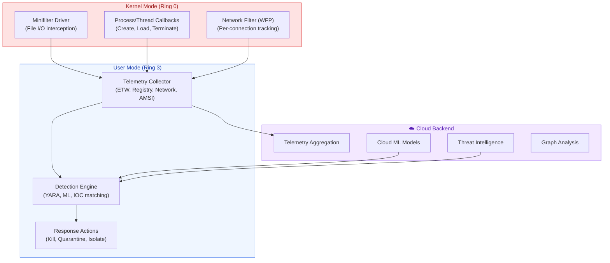
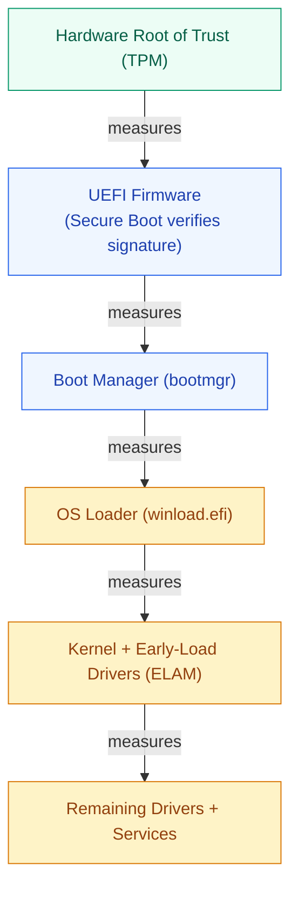

# OS Security & Endpoint Protection

How operating systems enforce security — and how security products like Microsoft Defender leverage OS primitives to detect, prevent, and respond to threats.

---

## Threat Models & Attack Surfaces

### OS Attack Surfaces

| Surface | Attacks | Detection |
|---|---|---|
| **Processes** | Injection, hollowing, masquerading | Process tree analysis, behavioral monitoring |
| **Memory** | Buffer overflow, ROP, heap spray | DEP/NX, ASLR, CFI, stack canaries |
| **File system** | Malware drop, ADS abuse, timestomping | Real-time scanning, file integrity monitoring |
| **Registry (Windows)** | Persistence, config tampering | Registry key monitoring |
| **Network stack** | Raw sockets, packet manipulation | Socket-level monitoring per process |
| **Drivers/Kernel** | Rootkits, vulnerable driver exploitation | Code integrity, Secure Boot, hypervisor |
| **Boot chain** | Bootkits, UEFI implants | Measured boot, TPM attestation |
| **Credentials** | Dumping LSASS, Kerberoasting | Credential Guard, protected processes |

---

## Process Injection Techniques

Malware injects code into legitimate processes to evade detection.

### Common Techniques

| Technique | How It Works | Detection Indicators |
|---|---|---|
| **DLL Injection** | LoadLibrary in target via CreateRemoteThread | Remote thread creation, unusual DLL loads |
| **Process Hollowing** | Create suspended process, unmap code, inject new | Suspended process creation, memory unmapping |
| **APC Injection** | Queue APC to target thread | Cross-process APC queuing |
| **AtomBombing** | Write to global atom table, trigger read | Atom table writes + APC |
| **Thread Hijacking** | Suspend thread, modify context, resume | Thread suspension + context change |
| **PE Injection** | Write PE + manually resolve imports in target | Cross-process memory writes |
| **Reflective DLL Loading** | DLL loads itself from memory (no file on disk) | In-memory execution, no LoadLibrary call |
| **Early Bird** | Inject before main thread starts | Very early thread creation in suspended process |

### How Defender Detects Injection



---

## Persistence Mechanisms

How malware survives reboot — and what EDR monitors:

### Windows Persistence

| Location | Mechanism | Detection |
|---|---|---|
| **Run keys** | HKCU/HKLM\Software\Microsoft\Windows\CurrentVersion\Run | Registry monitoring |
| **Scheduled Tasks** | schtasks or COM-based task creation | Event 4698, task folder monitoring |
| **Services** | New service registration | Event 7045, SCM monitoring |
| **WMI Event Subscriptions** | Permanent WMI consumers | WMI repository monitoring |
| **Startup Folder** | Drop shortcut/exe in Startup | File system monitoring |
| **DLL Search Order Hijacking** | Plant DLL in app directory | Module load tracking, hash verification |
| **COM Hijacking** | Override COM CLSID registry entries | CLSID registry monitoring |
| **Boot/Logon Scripts** | Group Policy scripts | GP object monitoring |
| **Office Template Injection** | Modified Normal.dotm | Template file integrity checks |

### Linux Persistence

| Location | Mechanism | Detection |
|---|---|---|
| **crontab** | Scheduled execution | Monitor cron directories, auditd |
| **systemd services** | Custom unit files | Monitor /etc/systemd/ and /lib/systemd/ |
| **rc.local / init scripts** | Execute at boot | File integrity monitoring |
| **SSH authorized_keys** | Backdoor access | Monitor .ssh directories |
| **LD_PRELOAD** | Hijack library loading | Check environment variables |
| **Kernel modules** | Loadable rootkits | Monitor module loading (insmod) |
| **bashrc/profile** | Execute on login | Integrity monitoring of shell configs |

---

## Memory Forensics & Analysis

### Key Memory Artifacts

| Artifact | Location | Reveals |
|---|---|---|
| **Process list** | Kernel data structures | Running processes (including hidden ones via pool scanning) |
| **Network connections** | Socket objects | Active connections per process |
| **Loaded modules** | VAD tree + PEB | DLLs loaded (detect injected ones) |
| **Registry hives** | Memory-mapped hive files | Live registry state |
| **Command history** | Console buffers | Commands executed |
| **Crypto keys** | Process heap/stack | Encryption keys in memory |

### Virtual Address Descriptor (VAD) Tree

Windows tracks per-process memory regions via a balanced binary tree:

```
VAD entry contains:
- Base address, size
- Protection (RWX)
- Mapped file (if any)
- Commit state

Security use: Walk VAD tree to find:
- RWX regions (shellcode)
- Unbacked executable regions (reflective loading)
- Memory not associated with any file (injected code)
```

---

## Privilege Escalation

### Windows Privilege Escalation

| Technique | Description | Prevention |
|---|---|---|
| **Token manipulation** | Steal/duplicate high-privilege token | Token integrity enforcement |
| **Unquoted service paths** | Exploit space in service path | Quoted paths, WDAC |
| **DLL hijacking** | Plant DLL in search path | SafeDLLSearchMode, known DLL list |
| **Named pipe impersonation** | Client connects, server impersonates | Named pipe security descriptors |
| **Kernel exploit** | Exploit vulnerability in driver/kernel | HVCI, kernel CFG |
| **UAC bypass** | Abuse auto-elevating programs | Enforce always-prompt UAC |
| **LSASS credential theft** | Dump credentials from LSASS memory | Credential Guard, PPL |

### Linux Privilege Escalation

| Technique | Description | Prevention |
|---|---|---|
| **SUID binaries** | Execute with owner's privileges | Minimize SUID, use capabilities |
| **Kernel exploit** | Exploit kernel vulnerability | Keep kernel updated, seccomp |
| **Sudo misconfiguration** | Wildcards or NOPASSWD abuse | Audit sudoers, use allowlist |
| **Writable PATH directories** | Plant malicious binary | Secure PATH, integrity monitoring |
| **Container escape** | Exploit namespace/cgroup weakness | Rootless containers, SELinux |
| **Capability abuse** | Overly permissive capabilities | Principle of least capability |

---

## Endpoint Detection and Response (EDR) Architecture

### Core Components


```

### Detection Approaches

| Approach | Speed | Accuracy | Evasion Difficulty |
|---|---|---|---|
| **Signature/Hash** | Instant | High (for known) | Easy (polymorphism, packing) |
| **Heuristic rules** | Fast | Medium | Medium (behavior change) |
| **Behavioral analysis** | Medium | High | Hard (must change entire behavior) |
| **ML models** | Medium | High | Hard (adversarial ML needed) |
| **Cloud detonation** | Slow (minutes) | Very high | Very hard (full sandbox) |
| **Graph correlation** | Slow | Very high | Very hard (requires full environment knowledge) |

---

## Ransomware Detection

### Behavioral Indicators

| Signal | What It Means | Weight |
|---|---|---|
| Rapid file enumeration | Scanning for targets | Medium |
| File extension changes (mass rename) | Encryption in progress | Critical |
| Writing ransom notes | Post-encryption | Critical (too late) |
| Deleting shadow copies (vssadmin) | Preventing recovery | High |
| High I/O with entropy increase | Encryption pattern | High |
| Disabling security tools | Preparing for attack | High |
| Network shares enumeration | Lateral spread | Medium |

### Defender Anti-Ransomware

```
Controlled Folder Access:
  - Whitelist of allowed apps
  - Protected folders (Documents, Desktop, etc.)
  - Untrusted processes blocked from writing to protected folders

Attack Surface Reduction (ASR) Rules:
  - Block Office apps from creating child processes
  - Block credential stealing from LSASS
  - Block untrusted executables from USB
  - Block process creations from PSExec/WMI commands
```

---

## Secure Boot & Measured Boot

### Boot Chain Security



TPM PCRs contain hash chain of all stages — remote attestation verifies boot integrity.
```

| Component | Purpose |
|---|---|
| **Secure Boot** | Only boot signed bootloaders/kernels (UEFI) |
| **Measured Boot** | TPM records hash of each boot component |
| **ELAM (Early Launch AM)** | Antimalware driver loads before all other drivers |
| **VBS (Virtualization-Based Security)** | Hypervisor creates isolated memory regions |
| **HVCI** | Kernel code integrity enforced by hypervisor |
| **Credential Guard** | LSASS isolated in VBS enclave |

---

## MITRE ATT&CK Framework (OS-Level Tactics)

| Tactic | OS Techniques (Examples) |
|---|---|
| **Initial Access** | Exploit public app, phishing attachment execution |
| **Execution** | PowerShell, WMI, scheduled task, service execution |
| **Persistence** | Registry run keys, scheduled tasks, DLL hijacking |
| **Privilege Escalation** | Token manipulation, exploit kernel vuln, UAC bypass |
| **Defense Evasion** | Process injection, timestomping, rootkit, AMSI bypass |
| **Credential Access** | LSASS dump, Kerberoasting, brute force |
| **Discovery** | Process listing, network scan, file/registry enumeration |
| **Lateral Movement** | PsExec, WMI remote, RDP, pass-the-hash |
| **Collection** | Keylogging, screen capture, clipboard |
| **Exfiltration** | DNS tunneling, encrypted channel, cloud storage |
| **Impact** | Ransomware encryption, wiper, service stop |

---

## Interview Questions

??? question "1. Design the architecture for a kernel-level file monitoring component of an EDR."
    **Requirements**: Monitor all file operations with minimal performance impact. **Architecture**: (1) **Minifilter driver** registered with Filter Manager at appropriate altitude (320000-329999 for anti-virus). (2) Register **pre-operation callbacks** for IRP_MJ_CREATE, IRP_MJ_WRITE, IRP_MJ_SET_INFORMATION (rename/delete). (3) In pre-create: check file hash against blocklist, scan if needed. For performance: maintain an in-memory cache of clean file hashes, only scan on first access or after write. (4) **Post-operation callbacks** for write operations: mark file as dirty (needs re-scan). (5) Communication with user-mode service via **filter communication port** (FltCreateCommunicationPort). (6) User-mode service handles: heavy scanning (AV engine), cloud lookups, logging. **Performance**: Use asynchronous scanning for non-executable files, synchronous only for PE/script files. Maintain per-file state using stream contexts.

??? question "2. How would you detect a process hollowing attack?"
    **Signals to monitor**: (1) Process created in suspended state (CREATE_SUSPENDED flag). (2) NtUnmapViewOfSection called on the new process (unmapping original code). (3) VirtualAllocEx + WriteProcessMemory to the target (injecting new code). (4) SetThreadContext to change entry point. (5) ResumeThread to start execution. **Detection logic**: Correlate these events in sequence within a short time window. Additional checks: Compare the on-disk image path (what the process says it is) with the actual memory content (hash of in-memory code vs file on disk). If they don't match — hollowing detected. **Defender approach**: Uses kernel callbacks to catch process creation + ETW for memory operations, then behavioral ML model scores the sequence.

??? question "3. Explain how Controlled Folder Access works at the OS level."
    **Mechanism**: (1) Minifilter driver intercepts all IRP_MJ_CREATE/WRITE operations targeting protected folders. (2) For each write attempt, identifies the requesting process (via PID from I/O request). (3) Checks process against an allowlist (maintained in registry and updated from cloud). (4) If process is NOT on allowlist: block the write (STATUS_ACCESS_DENIED), log the event, notify user. (5) System processes and known-good apps (Office, etc.) are pre-approved. **Challenges**: False positives (legitimate new apps blocked), user experience (must manually approve new apps), and performance (checking allowlist on every write to protected folders). **Ransomware impact**: Even if ransomware is running with admin privileges, it can't modify protected folders because the minifilter operates at the I/O manager level before the filesystem.

??? question "4. How does AMSI work and how do attackers try to bypass it?"
    **How AMSI works**: (1) Script hosts (PowerShell, VBScript, JScript, Office macros) call AmsiScanBuffer before executing content. (2) AMSI passes content to registered anti-malware provider (Defender). (3) Provider scans and returns clean/malware verdict. (4) Script host proceeds or blocks based on verdict. **Bypass attempts**: (1) Patching amsi.dll in memory (overwrite AmsiScanBuffer to return clean). (2) Unhooking — restore original bytes of hooked functions. (3) Reflection — use .NET reflection to set amsiInitFailed = true. (4) Obfuscation — encode payload to evade string-based detection. (5) Running in a context where AMSI isn't loaded. **Counter-defenses**: ETW monitoring of amsi.dll modifications, code integrity checks, behavioral detection of the bypass attempt itself.

??? question "5. How would you build a system to detect lateral movement in a Windows environment?"
    **Data sources**: (1) Windows Security Event Logs — logon events (4624 type 3/10), explicit credentials (4648). (2) Process creation events (4688) — PsExec, WMIC, PowerShell remoting patterns. (3) Network connections — SMB (445), WinRM (5985/5986), RDP (3389) between workstations. (4) Kerberos ticket requests — TGS for unusual services. **Detection logic**: Build a graph of normal communication patterns. Alert on: (a) First-time connections between hosts, (b) Admin tools (PsExec, WMIC) from non-admin workstations, (c) Service account used from unexpected sources, (d) Rapid sequential connections (A→B→C→D in minutes). **Architecture**: Stream processing (Kafka + Flink), graph database for relationship storage, ML model for anomaly scoring based on historical patterns.
