# PostgreSQL - The Developer's Deep Dive

PostgreSQL is the most advanced open-source relational database, widely used at companies like Apple, Instagram, Spotify, and Netflix. For FAANG interviews, you need to understand not just SQL but the internals — how PostgreSQL handles concurrency, scales horizontally, optimizes queries, and ensures durability. This page covers the critical topics that come up in system design and backend engineering interviews.

---

## Architecture Overview

PostgreSQL uses a **process-per-connection** model (not threaded). Each client connection spawns a backend process that communicates with shared memory.

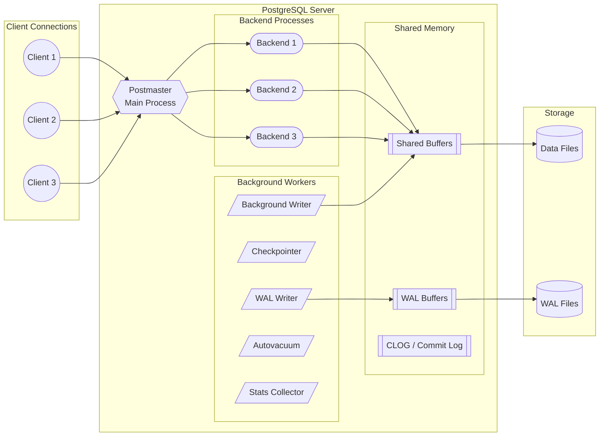

**Key components:**

| Component | Role |
|---|---|
| **Postmaster** | Listens for connections, forks backend processes |
| **Shared Buffers** | In-memory cache of data pages (typically 25% of RAM) |
| **WAL (Write-Ahead Log)** | Ensures durability — changes written to WAL before data files |
| **Checkpointer** | Periodically flushes dirty pages from shared buffers to disk |
| **Autovacuum** | Reclaims dead tuples, updates statistics, prevents transaction ID wraparound |
| **CLOG** | Tracks transaction commit/abort status |

---

## Replication

Replication is essential for **high availability**, **read scaling**, and **disaster recovery**. PostgreSQL supports multiple replication strategies.

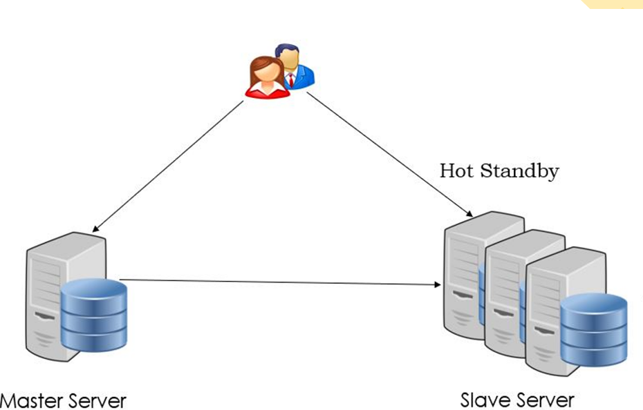

### Types of Replication

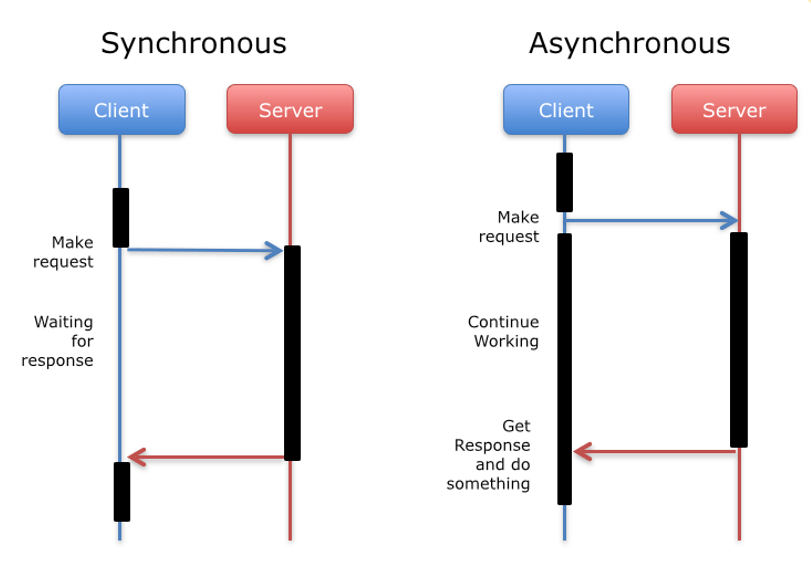

### Streaming Replication (Physical)

Streaming replication sends WAL records from primary to standby in real-time. The standby replays the WAL to maintain an exact byte-for-byte copy.

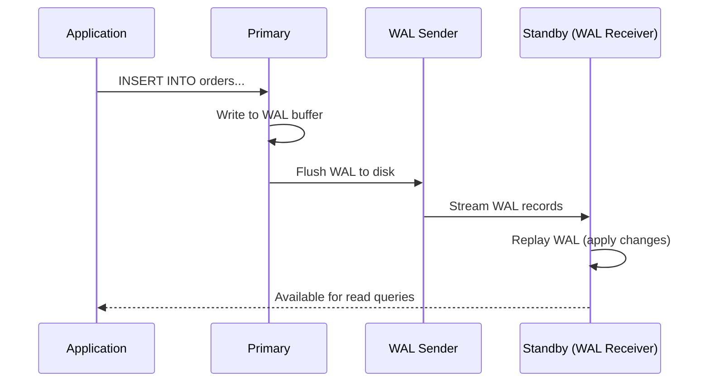

**Setup steps:**

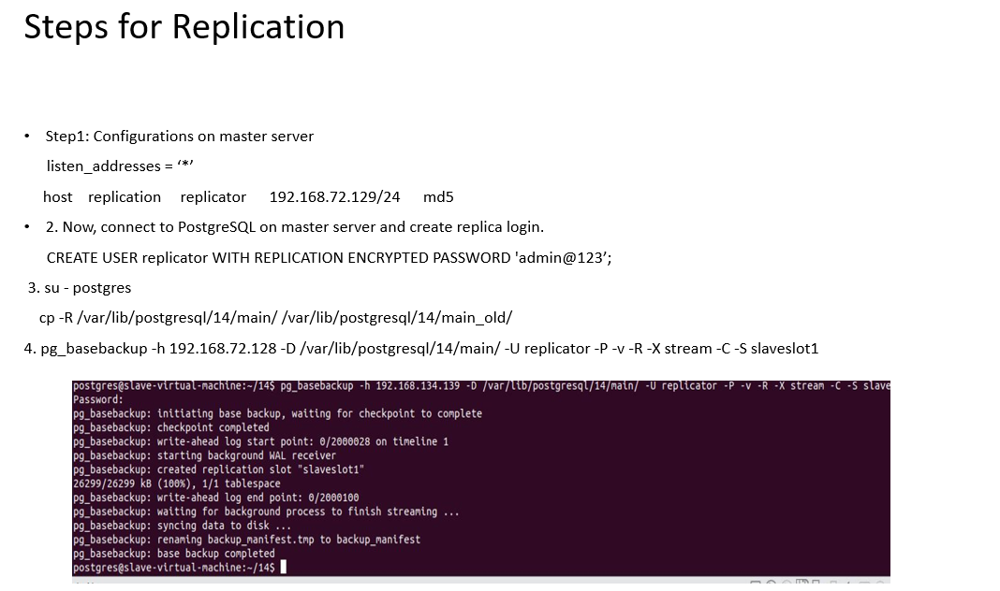

```sql
-- On primary: postgresql.conf
wal_level = replica
max_wal_senders = 10
synchronous_standby_names = 'standby1'

-- On primary: pg_hba.conf (allow replication connections)
host replication replicator 10.0.0.0/24 md5

-- On standby: create base backup
pg_basebackup -h primary-host -D /var/lib/postgresql/data -U replicator -P --wal-method=stream
```

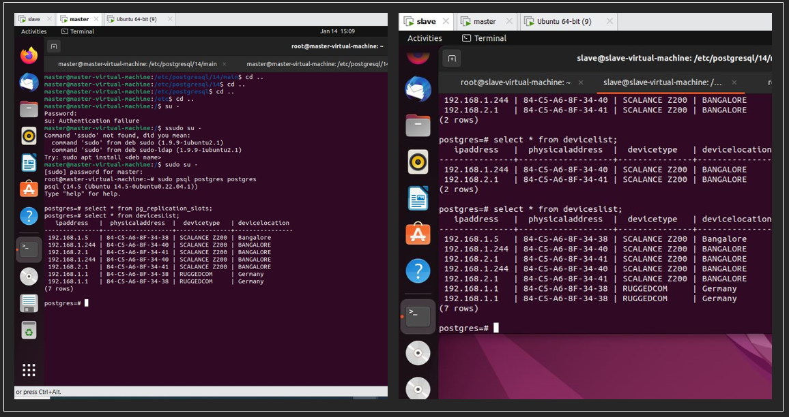

### Synchronous vs Asynchronous Replication

| Aspect | Synchronous | Asynchronous |
|---|---|---|
| **Durability** | Zero data loss (RPO = 0) | Potential data loss on failover |
| **Latency** | Higher (waits for standby ACK) | Lower (fire and forget) |
| **Use case** | Financial systems, critical data | Read replicas, analytics |
| **Config** | `synchronous_commit = on` | `synchronous_commit = off` |

```sql
-- Synchronous: primary waits for standby to write WAL to disk
SET synchronous_commit = 'remote_write';  -- standby wrote to OS buffer
SET synchronous_commit = 'remote_apply';  -- standby applied the change (visible to queries)
SET synchronous_commit = 'on';            -- standby flushed WAL to disk
```

### Logical Replication

Unlike streaming replication (which copies raw WAL bytes), **logical replication** decodes changes into logical operations (INSERT, UPDATE, DELETE) and publishes them to subscribers.

```sql
-- On publisher
CREATE PUBLICATION my_publication FOR TABLE orders, customers;

-- On subscriber
CREATE SUBSCRIPTION my_subscription
    CONNECTION 'host=publisher-host dbname=mydb'
    PUBLICATION my_publication;
```

**When to use logical replication:**

- Replicating a subset of tables (not the entire database)
- Replicating between different PostgreSQL versions
- Data integration with other systems (CDC pattern)
- Multi-master setups (with conflict resolution)

---

## Partitioning

Partitioning splits a large table into smaller, more manageable pieces. PostgreSQL supports **declarative partitioning** since version 10.

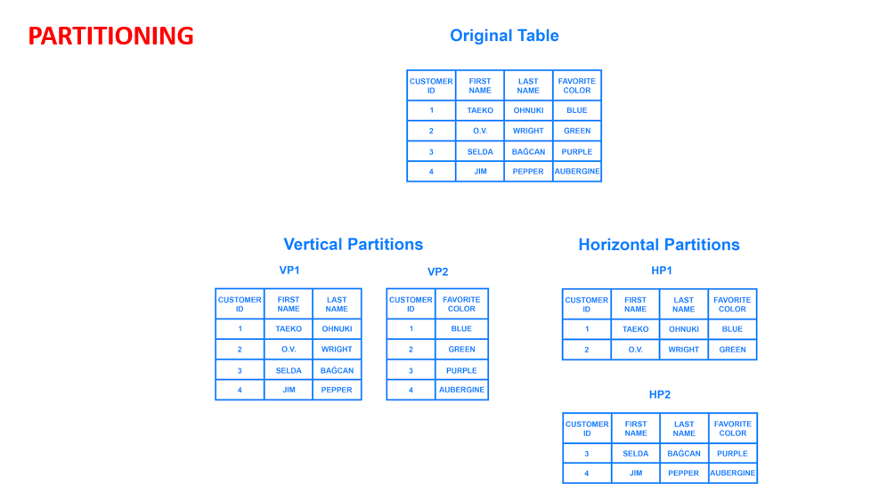

### Why Partition?

- **Query performance** — partition pruning skips irrelevant partitions
- **Maintenance** — vacuum, reindex, and backup individual partitions
- **Bulk data management** — drop old partitions instantly (vs. slow DELETE)
- **Parallel scans** — each partition can be scanned in parallel

### Range Partitioning

Best for time-series data or any column with a natural ordering.

```sql
CREATE TABLE events (
    id          BIGSERIAL,
    event_time  TIMESTAMPTZ NOT NULL,
    user_id     BIGINT NOT NULL,
    payload     JSONB
) PARTITION BY RANGE (event_time);

-- Create monthly partitions
CREATE TABLE events_2024_01 PARTITION OF events
    FOR VALUES FROM ('2024-01-01') TO ('2024-02-01');
CREATE TABLE events_2024_02 PARTITION OF events
    FOR VALUES FROM ('2024-02-01') TO ('2024-03-01');
CREATE TABLE events_2024_03 PARTITION OF events
    FOR VALUES FROM ('2024-03-01') TO ('2024-04-01');

-- Drop old data instantly (no vacuum needed)
DROP TABLE events_2024_01;
```

### List Partitioning

Best for categorical data with a known set of values.

```sql
CREATE TABLE orders (
    id          BIGSERIAL,
    region      TEXT NOT NULL,
    amount      NUMERIC,
    created_at  TIMESTAMPTZ
) PARTITION BY LIST (region);

CREATE TABLE orders_us PARTITION OF orders FOR VALUES IN ('us-east', 'us-west');
CREATE TABLE orders_eu PARTITION OF orders FOR VALUES IN ('eu-west', 'eu-central');
CREATE TABLE orders_apac PARTITION OF orders FOR VALUES IN ('ap-south', 'ap-east');
```

### Hash Partitioning

Best for evenly distributing data when there is no natural range or list.

```sql
CREATE TABLE user_sessions (
    session_id  UUID PRIMARY KEY,
    user_id     BIGINT NOT NULL,
    data        JSONB
) PARTITION BY HASH (user_id);

CREATE TABLE user_sessions_0 PARTITION OF user_sessions FOR VALUES WITH (MODULUS 4, REMAINDER 0);
CREATE TABLE user_sessions_1 PARTITION OF user_sessions FOR VALUES WITH (MODULUS 4, REMAINDER 1);
CREATE TABLE user_sessions_2 PARTITION OF user_sessions FOR VALUES WITH (MODULUS 4, REMAINDER 2);
CREATE TABLE user_sessions_3 PARTITION OF user_sessions FOR VALUES WITH (MODULUS 4, REMAINDER 3);
```

!!! tip "Partition Pruning"
    PostgreSQL automatically eliminates partitions that cannot contain matching rows. Verify with `EXPLAIN` — look for "Partitions removed" in the output.

---

## Sharding

Sharding distributes data across **multiple independent PostgreSQL instances** (nodes). Unlike partitioning (single server), sharding enables **horizontal scaling** beyond the capacity of one machine.

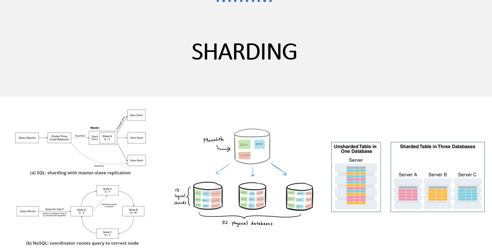

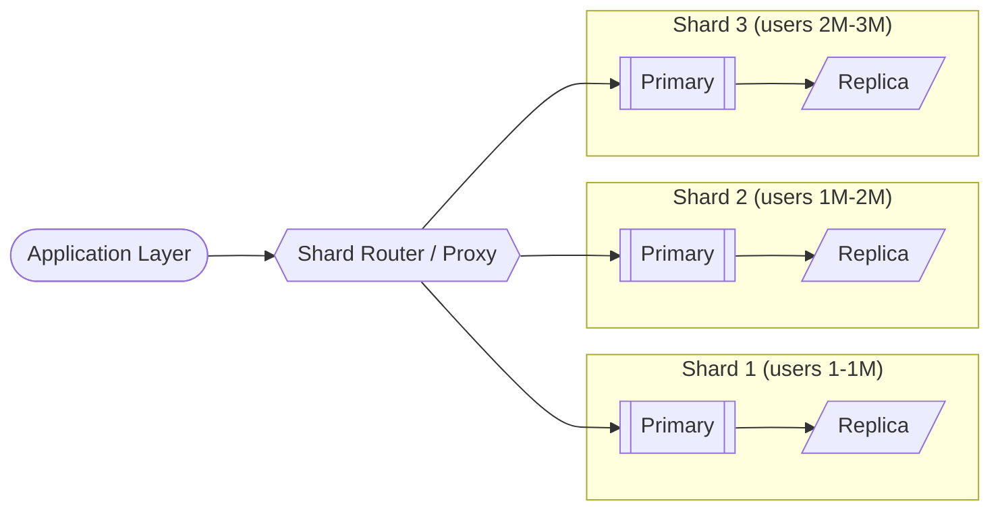

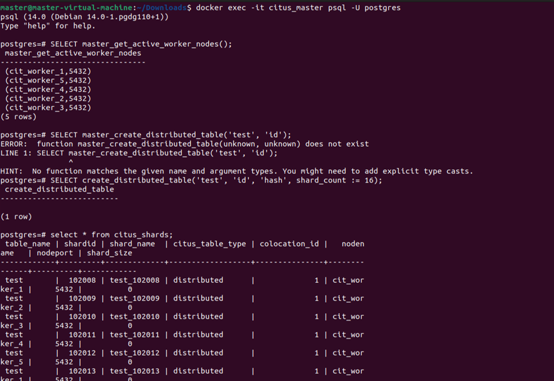

### Sharding Strategies

| Strategy | Description | Pros | Cons |
|---|---|---|---|
| **Range-based** | user_id 1-1M on shard 1 | Simple, range queries efficient | Hotspots, uneven distribution |
| **Hash-based** | shard = hash(user_id) % N | Even distribution | Range queries hit all shards |
| **Directory-based** | Lookup table maps key to shard | Flexible, easy rebalancing | Lookup service is a bottleneck |
| **Geo-based** | Data placed by user region | Low latency, compliance | Cross-region queries expensive |

### Citus (Distributed PostgreSQL)

Citus extends PostgreSQL to distribute tables across worker nodes transparently.

```sql
-- On the coordinator node
SELECT create_distributed_table('orders', 'customer_id');

-- Queries are automatically routed / parallelized
SELECT customer_id, SUM(amount) 
FROM orders 
WHERE created_at > '2024-01-01'
GROUP BY customer_id;
-- Citus pushes the aggregation down to each worker
```

### PgPool-II

PgPool-II sits between application and PostgreSQL, providing connection pooling, load balancing, and parallel query execution across shards.

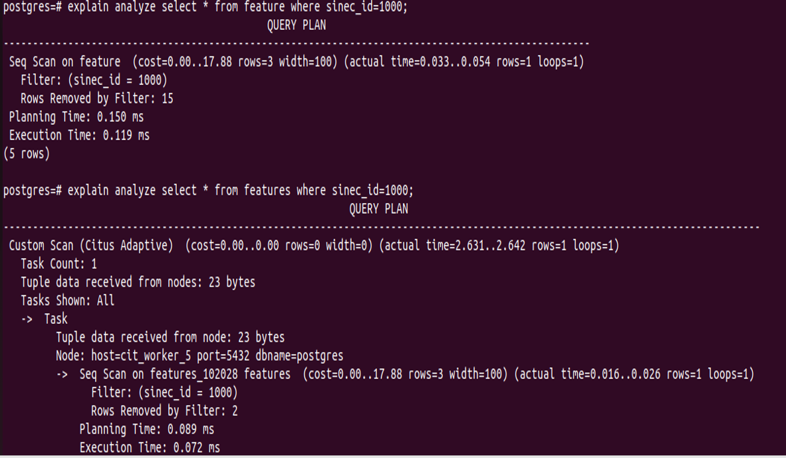

!!! warning "Sharding Challenges"
    - **Cross-shard JOINs** are expensive (require data shuffling)
    - **Distributed transactions** need 2PC (two-phase commit) — adds latency
    - **Resharding** (adding/removing nodes) requires data migration
    - Always **co-locate related data** on the same shard (e.g., user + user's orders)

---

## Indexing

Indexes are the single most impactful tool for query performance. PostgreSQL offers multiple index types, each optimized for different access patterns.

### B-Tree Index (Default)

The workhorse index. Supports equality (`=`) and range (`<`, `>`, `BETWEEN`) queries.

```sql
-- Automatically created for PRIMARY KEY and UNIQUE constraints
CREATE INDEX idx_orders_customer ON orders (customer_id);

-- Composite index (column order matters!)
CREATE INDEX idx_orders_cust_date ON orders (customer_id, created_at DESC);

-- Queries that benefit:
SELECT * FROM orders WHERE customer_id = 42;                          -- uses index
SELECT * FROM orders WHERE customer_id = 42 AND created_at > '2024-01-01'; -- uses composite
SELECT * FROM orders WHERE created_at > '2024-01-01';                 -- CANNOT use composite (leading col missing)
```

### GIN (Generalized Inverted Index)

Optimized for **composite values** — arrays, JSONB, full-text search.

```sql
-- JSONB indexing
CREATE INDEX idx_events_payload ON events USING GIN (payload);

-- Query using the GIN index
SELECT * FROM events WHERE payload @> '{"type": "purchase"}';
SELECT * FROM events WHERE payload ? 'coupon_code';

-- Full-text search
CREATE INDEX idx_articles_fts ON articles USING GIN (to_tsvector('english', body));
SELECT * FROM articles WHERE to_tsvector('english', body) @@ to_tsquery('distributed & systems');

-- Array containment
CREATE INDEX idx_tags ON posts USING GIN (tags);
SELECT * FROM posts WHERE tags @> ARRAY['postgresql', 'performance'];
```

### GiST (Generalized Search Tree)

Supports **geometric data**, range types, and nearest-neighbor searches.

```sql
-- Geospatial (with PostGIS)
CREATE INDEX idx_locations_geo ON locations USING GiST (geom);
SELECT * FROM locations WHERE ST_DWithin(geom, ST_MakePoint(-122.4, 37.7)::geography, 5000);

-- Range types (overlapping schedules)
CREATE INDEX idx_bookings_range ON bookings USING GiST (time_range);
SELECT * FROM bookings WHERE time_range && '[2024-03-01, 2024-03-07]'::daterange;
```

### BRIN (Block Range INdex)

Extremely compact index for **naturally ordered data** (time-series, append-only tables).

```sql
-- Ideal for time-series tables where data arrives in chronological order
CREATE INDEX idx_logs_time ON logs USING BRIN (created_at);

-- BRIN stores min/max per block range (128 pages by default)
-- Size: ~1000x smaller than B-tree for large tables
-- Tradeoff: less precise (scans extra blocks), but creation/maintenance is near-zero
```

### Partial Indexes

Index only the rows that matter — reduces index size and maintenance cost.

```sql
-- Only index active orders (90% of queries filter on status='active')
CREATE INDEX idx_orders_active ON orders (customer_id, created_at)
    WHERE status = 'active';

-- Only index non-null emails
CREATE INDEX idx_users_email ON users (email) WHERE email IS NOT NULL;
```

!!! info "Index Selection Guide"
    | Access Pattern | Best Index |
    |---|---|
    | Equality / Range on scalars | B-Tree |
    | JSONB containment, arrays, full-text | GIN |
    | Geometric, range overlap, nearest-neighbor | GiST |
    | Large time-series, naturally ordered | BRIN |
    | Subset of rows queried frequently | Partial Index |

---

## MVCC (Multi-Version Concurrency Control)

MVCC is how PostgreSQL achieves **high concurrency without read locks**. Readers never block writers, and writers never block readers.

### How It Works

Every row (tuple) in PostgreSQL has hidden system columns:

| Column | Purpose |
|---|---|
| `xmin` | Transaction ID that inserted this tuple |
| `xmax` | Transaction ID that deleted/updated this tuple (0 if live) |
| `ctid` | Physical location (page, offset) of the tuple |

```mermaid
sequenceDiagram
    participant T1 as Transaction 100
    participant DB as Database (Row: balance=1000)
    participant T2 as Transaction 101
    
    T1->>DB: BEGIN; SELECT balance → 1000
    T2->>DB: BEGIN; UPDATE balance = 500
    Note over DB: Old tuple: xmin=99, xmax=101<br/>New tuple: xmin=101, xmax=0, balance=500
    T1->>DB: SELECT balance → still sees 1000!
    Note over T1: T1's snapshot predates T101<br/>so it reads the old version
    T2->>DB: COMMIT
    T1->>DB: SELECT balance → still 1000 (snapshot isolation)
    T1->>DB: COMMIT
    T1->>DB: SELECT balance → now sees 500
```

### Visibility Rules

A tuple is visible to a transaction if:

1. `xmin` is committed AND `xmin` < transaction's snapshot
2. `xmax` is either 0 (not deleted) OR `xmax` is not yet committed from this transaction's perspective

### Dead Tuples and VACUUM

When a row is updated, the old version remains on disk (marked with `xmax`). These **dead tuples** accumulate and must be cleaned:

```sql
-- Check dead tuple bloat
SELECT relname, n_dead_tup, n_live_tup, 
       round(n_dead_tup::numeric / NULLIF(n_live_tup, 0) * 100, 2) AS dead_pct
FROM pg_stat_user_tables
ORDER BY n_dead_tup DESC LIMIT 10;

-- Manual vacuum (autovacuum handles this normally)
VACUUM VERBOSE orders;

-- Reclaim space back to OS (locks table — use carefully)
VACUUM FULL orders;
```

!!! warning "Transaction ID Wraparound"
    PostgreSQL uses 32-bit transaction IDs (~4 billion). If `autovacuum` is blocked (e.g., long-running transactions), the database will **shut down to prevent data corruption**. Monitor `age(datfrozenxid)` and never let it approach 2 billion.

---

## Query Optimization

### EXPLAIN ANALYZE

The most powerful tool for understanding query performance.

```sql
EXPLAIN (ANALYZE, BUFFERS, FORMAT TEXT)
SELECT o.id, o.amount, c.name
FROM orders o
JOIN customers c ON c.id = o.customer_id
WHERE o.created_at > '2024-01-01'
  AND o.status = 'completed';
```

**Reading the output:**

```
Nested Loop  (cost=0.85..1234.56 rows=100 width=48) (actual time=0.05..2.34 rows=95 loops=1)
  Buffers: shared hit=200 read=5
  -> Index Scan using idx_orders_status_date on orders o  (cost=0.43..890.12 rows=100 width=24) (actual time=0.03..1.20 rows=95 loops=1)
        Index Cond: ((created_at > '2024-01-01') AND (status = 'completed'))
        Buffers: shared hit=150 read=3
  -> Index Scan using customers_pkey on customers c  (cost=0.42..3.44 rows=1 width=24) (actual time=0.01..0.01 rows=1 loops=95)
        Index Cond: (id = o.customer_id)
        Buffers: shared hit=50 read=2
Planning Time: 0.15 ms
Execution Time: 2.50 ms
```

**Key things to look for:**

| Indicator | Meaning |
|---|---|
| `Seq Scan` on large table | Missing index — full table scan |
| `actual rows` >> `rows` estimate | Stale statistics — run `ANALYZE` |
| `Buffers: read` is high | Data not in shared_buffers (cold cache) |
| `Nested Loop` with high `loops` | Consider hash join or index optimization |
| `Sort` with `external merge` | Work_mem too low — sorts spilling to disk |

### Common Optimization Patterns

```sql
-- 1. Covering index (index-only scan, no heap fetch)
CREATE INDEX idx_orders_covering ON orders (customer_id, created_at) 
    INCLUDE (amount, status);

-- 2. Force index usage for testing (not for production!)
SET enable_seqscan = off;

-- 3. Update statistics for better plans
ANALYZE orders;

-- 4. Increase work_mem for complex sorts/aggregations (session-level)
SET work_mem = '256MB';

-- 5. Use CTEs carefully — in PG12+ they can be inlined (not optimization fences)
WITH recent_orders AS MATERIALIZED (
    SELECT * FROM orders WHERE created_at > NOW() - INTERVAL '1 day'
)
SELECT * FROM recent_orders WHERE status = 'pending';

-- 6. Batch IN queries instead of correlated subqueries
SELECT * FROM orders WHERE customer_id = ANY(ARRAY[1, 2, 3, 4, 5]);
```

---

## Connection Pooling

PostgreSQL forks a new **OS process** per connection (~5-10 MB RAM each). At scale (thousands of connections), this becomes unsustainable. Connection pooling is mandatory for production.

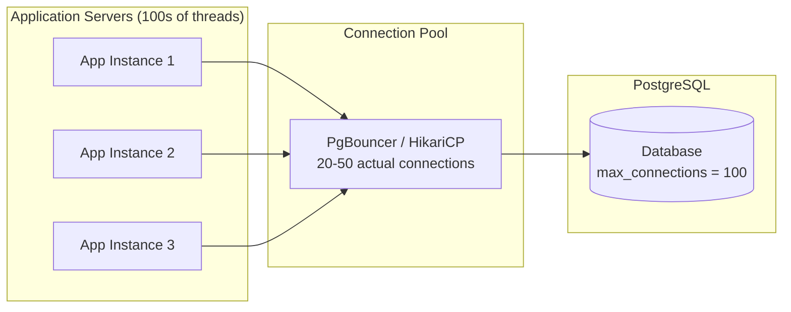

### PgBouncer

External, lightweight connection pooler (sits between app and database).

| Pool Mode | Description | Use Case |
|---|---|---|
| **Session** | Connection held for entire client session | Legacy apps using session state |
| **Transaction** | Connection returned after each transaction | Most web applications (recommended) |
| **Statement** | Connection returned after each statement | Simple queries, no multi-statement txns |

```ini
; pgbouncer.ini
[databases]
mydb = host=localhost port=5432 dbname=mydb

[pgbouncer]
pool_mode = transaction
max_client_conn = 1000
default_pool_size = 20
min_pool_size = 5
reserve_pool_size = 5
```

### HikariCP (Java)

The fastest JDBC connection pool, widely used in Spring Boot applications.

```java
@Configuration
public class DataSourceConfig {
    
    @Bean
    public HikariDataSource dataSource() {
        HikariConfig config = new HikariConfig();
        config.setJdbcUrl("jdbc:postgresql://localhost:5432/mydb");
        config.setUsername("app_user");
        config.setPassword("secret");
        
        // Pool sizing: connections = (core_count * 2) + effective_spindle_count
        config.setMaximumPoolSize(20);
        config.setMinimumIdle(5);
        
        // Connection validation
        config.setConnectionTimeout(30000);     // 30s max wait for connection
        config.setIdleTimeout(600000);          // 10min before idle connection is retired
        config.setMaxLifetime(1800000);         // 30min max connection lifetime
        config.setValidationTimeout(5000);      // 5s for alive check
        
        // Performance settings
        config.addDataSourceProperty("cachePrepStmts", "true");
        config.addDataSourceProperty("prepStmtCacheSize", "250");
        config.addDataSourceProperty("prepStmtCacheSqlLimit", "2048");
        
        return new HikariDataSource(config);
    }
}
```

!!! tip "Pool Sizing Formula"
    The optimal pool size is surprisingly small. For most OLTP workloads:
    `pool_size = (CPU cores * 2) + number_of_disks`. A server with 4 cores and 1 SSD needs only ~10 connections to saturate throughput. More connections = more contention = worse performance.

---

## Common Interview Questions

### Q1: How does PostgreSQL handle concurrent writes to the same row?

PostgreSQL uses **row-level locking** combined with MVCC. When two transactions try to UPDATE the same row:

1. First transaction acquires a row-level exclusive lock (sets `xmax`)
2. Second transaction **blocks** until the first commits or aborts
3. After first commits, second re-checks the row — if its WHERE clause still matches the new version, it proceeds; otherwise, the update affects 0 rows

This prevents lost updates at the `READ COMMITTED` isolation level.

### Q2: What is the difference between `TRUNCATE` and `DELETE`?

| Aspect | DELETE | TRUNCATE |
|---|---|---|
| Mechanism | Marks each tuple dead (MVCC) | Removes all data files, creates new empty |
| Speed | Slow (row-by-row) | Instant (O(1)) |
| WAL generated | Yes (lots) | Minimal |
| MVCC safe | Yes (other txns still see old data) | No (acquires ACCESS EXCLUSIVE lock) |
| Triggers | Fires row-level triggers | Fires statement-level triggers only |
| VACUUM needed | Yes (dead tuples remain) | No |

### Q3: When would you choose PostgreSQL over NoSQL?

Choose PostgreSQL when you need:

- **ACID transactions** across multiple tables
- **Complex JOINs** and relational integrity
- **Strong consistency** (not eventual)
- **Rich querying** (window functions, CTEs, JSON operators)
- **Flexible indexing** (GIN for JSON gives you "NoSQL" speed with SQL power)

Choose NoSQL when you need:

- Extreme write throughput (millions of writes/sec)
- Schema-free documents with unpredictable structure
- Global distribution with tunable consistency
- Simple key-value access patterns at massive scale

### Q4: How would you design a time-series table for 1 billion events/day?

```sql
-- 1. Partitioned table (daily partitions)
CREATE TABLE events (
    id          BIGINT GENERATED ALWAYS AS IDENTITY,
    event_time  TIMESTAMPTZ NOT NULL,
    device_id   BIGINT NOT NULL,
    payload     JSONB
) PARTITION BY RANGE (event_time);

-- 2. BRIN index (tiny, fast for time-range queries)
CREATE INDEX idx_events_time ON events USING BRIN (event_time);

-- 3. B-tree for device lookups within a partition
CREATE INDEX idx_events_device ON events (device_id, event_time DESC);

-- 4. Automated partition creation (pg_partman extension or cron)
-- 5. Drop old partitions for retention policy
-- 6. Enable parallel query for aggregations
SET max_parallel_workers_per_gather = 4;
```

### Q5: Explain the WAL (Write-Ahead Log) and why it matters.

The WAL guarantees **durability** (the D in ACID):

1. Before modifying any data page, PostgreSQL writes the change to the WAL
2. WAL is sequentially written (fast) vs. random I/O for data pages
3. On crash recovery, PostgreSQL replays uncommitted WAL entries to restore consistency
4. WAL enables replication (standby servers replay the same log)
5. WAL enables point-in-time recovery (PITR) by archiving old WAL segments

**Key parameters:**

```sql
-- Force WAL flush on every commit (default, safest)
SET synchronous_commit = 'on';

-- Allow async WAL writes (faster, risk losing last few ms of commits on crash)
SET synchronous_commit = 'off';

-- Checkpoint tuning
checkpoint_timeout = '10min'         -- time between checkpoints
max_wal_size = '2GB'                 -- trigger checkpoint if WAL exceeds this
```

---

## Quick Reference: Production Tuning Checklist

```sql
-- Shared buffers: 25% of total RAM
shared_buffers = '4GB'              -- for a 16GB server

-- Effective cache size: 75% of RAM (tells planner about OS cache)
effective_cache_size = '12GB'

-- Work memory: per-operation memory for sorts/hashes
work_mem = '64MB'                    -- careful: multiplied by max_connections * operations

-- WAL settings
wal_level = 'replica'               -- enables streaming replication
max_wal_senders = 10
wal_keep_size = '1GB'

-- Autovacuum tuning (don't starve it)
autovacuum_max_workers = 4
autovacuum_naptime = '30s'
autovacuum_vacuum_scale_factor = 0.05   -- vacuum when 5% of table is dead (default 20% is too lazy)

-- Connection limits
max_connections = 100                -- keep low, use connection pooler
```

!!! note "Golden Rule"
    PostgreSQL with proper indexing, partitioning, and connection pooling can handle **most workloads up to ~10TB and tens of thousands of QPS** on a single node. Only shard when you have exhausted vertical scaling and read replicas.
