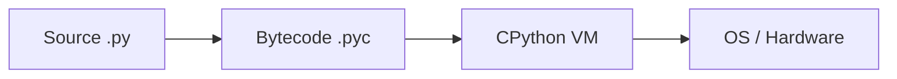
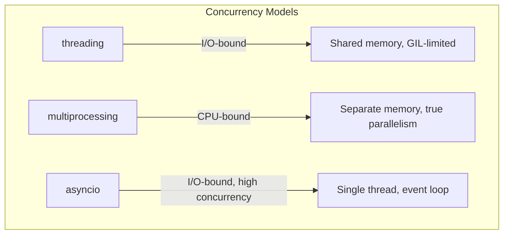

# Python Fundamentals

## Overview

Python is a high-level, interpreted, dynamically-typed programming language emphasizing readability and developer productivity.

| Feature | Detail |
|---------|--------|
| **Typing** | Dynamic, strong (no implicit type coercion) |
| **Execution** | Interpreted via CPython bytecode |
| **Memory** | Reference counting + cyclic garbage collector |
| **Concurrency** | GIL limits true parallelism in threads |

!!! info "The Global Interpreter Lock (GIL)"
    The GIL is a mutex in CPython that allows only one thread to execute Python bytecode at a time. This simplifies memory management but means CPU-bound threads cannot run in parallel. Use `multiprocessing` or `asyncio` for true concurrency.



---

## Data Types and Structures

### Primitive Types

```python
x: int = 42
pi: float = 3.14159
name: str = "Python"
flag: bool = True
nothing: None = None
```

### Core Collections

| Structure | Ordered | Mutable | Duplicates | Lookup |
|-----------|---------|---------|------------|--------|
| `list`    | Yes | Yes | Yes | O(n) |
| `tuple`   | Yes | No  | Yes | O(n) |
| `dict`    | Yes (3.7+) | Yes | Keys: No | O(1) avg |
| `set`     | No  | Yes | No  | O(1) avg |

```python
# List - dynamic array
nums = [1, 2, 3]
nums.append(4)          # [1, 2, 3, 4]

# Tuple - immutable sequence (hashable if elements are)
point = (3, 4)

# Dict - hash map
config = {"host": "localhost", "port": 8080}
config.get("timeout", 30)  # default value

# Set - unique elements, fast membership test
seen = {1, 2, 3}
seen.intersection({2, 3, 4})  # {2, 3}
```

!!! tip "When to use what"
    - **list**: ordered, mutable collection (default choice)
    - **tuple**: fixed records, dict keys, function return values
    - **dict**: key-value lookups, JSON-like data
    - **set**: membership tests, deduplication

---

## Functions

### Arguments and Parameters

```python
def fetch_data(url: str, *, timeout: int = 30, retries: int = 3) -> dict:
    """Keyword-only params after the * separator."""
    ...

def variadic(*args, **kwargs):
    """args is a tuple, kwargs is a dict."""
    print(args)    # positional arguments
    print(kwargs)  # keyword arguments
```

### Decorators

Decorators wrap functions to extend behavior without modifying the original.

```python
import functools
import time

def timer(func):
    @functools.wraps(func)
    def wrapper(*args, **kwargs):
        start = time.perf_counter()
        result = func(*args, **kwargs)
        elapsed = time.perf_counter() - start
        print(f"{func.__name__} took {elapsed:.4f}s")
        return result
    return wrapper

@timer
def compute(n: int) -> int:
    return sum(range(n))
```

### Generators

Generators produce values lazily using `yield`, enabling memory-efficient iteration.

```python
def fibonacci():
    a, b = 0, 1
    while True:
        yield a
        a, b = b, a + b

# Only computes values on demand
fib = fibonacci()
first_ten = [next(fib) for _ in range(10)]
```

---

## OOP in Python

### Classes and Inheritance

```python
from abc import ABC, abstractmethod

class Shape(ABC):
    @abstractmethod
    def area(self) -> float:
        ...

class Rectangle(Shape):
    def __init__(self, width: float, height: float):
        self.width = width
        self.height = height

    def area(self) -> float:
        return self.width * self.height

    def __repr__(self) -> str:
        return f"Rectangle({self.width}, {self.height})"
```

### Key Dunder (Magic) Methods

| Method | Purpose |
|--------|---------|
| `__init__` | Constructor |
| `__repr__` | Developer-friendly string |
| `__str__` | User-friendly string |
| `__eq__`, `__hash__` | Equality and hashing |
| `__len__` | Support `len()` |
| `__getitem__` | Support indexing `obj[key]` |
| `__enter__`, `__exit__` | Context manager protocol |
| `__iter__`, `__next__` | Iterator protocol |

### MRO (Method Resolution Order)

Python uses C3 linearization for multiple inheritance.

```python
class A: pass
class B(A): pass
class C(A): pass
class D(B, C): pass

print(D.__mro__)
# (D, B, C, A, object)
```

---

## Concurrency



### Threading (I/O-bound tasks)

```python
import threading
import requests

def download(url: str) -> None:
    resp = requests.get(url)
    print(f"{url}: {len(resp.content)} bytes")

urls = ["https://example.com"] * 5
threads = [threading.Thread(target=download, args=(u,)) for u in urls]
for t in threads:
    t.start()
for t in threads:
    t.join()
```

### Multiprocessing (CPU-bound tasks)

```python
from multiprocessing import Pool

def compute_heavy(n: int) -> int:
    return sum(i * i for i in range(n))

with Pool(processes=4) as pool:
    results = pool.map(compute_heavy, [10**6] * 4)
```

### Asyncio (cooperative multitasking)

```python
import asyncio
import aiohttp

async def fetch(session: aiohttp.ClientSession, url: str) -> int:
    async with session.get(url) as resp:
        data = await resp.read()
        return len(data)

async def main():
    async with aiohttp.ClientSession() as session:
        tasks = [fetch(session, f"https://example.com/{i}") for i in range(10)]
        results = await asyncio.gather(*tasks)
        print(results)

asyncio.run(main())
```

!!! warning "Common pitfall"
    Never mix blocking I/O calls inside an `async` function without using `loop.run_in_executor()`. Blocking calls will freeze the entire event loop.

---

## Common Patterns

### Context Managers

```python
class DatabaseConnection:
    def __enter__(self):
        self.conn = create_connection()
        return self.conn

    def __exit__(self, exc_type, exc_val, exc_tb):
        self.conn.close()
        return False  # do not suppress exceptions

# Or using contextlib
from contextlib import contextmanager

@contextmanager
def open_db():
    conn = create_connection()
    try:
        yield conn
    finally:
        conn.close()
```

### Comprehensions

```python
# List comprehension
squares = [x**2 for x in range(10) if x % 2 == 0]

# Dict comprehension
word_lengths = {w: len(w) for w in ["python", "java", "go"]}

# Set comprehension
unique_chars = {c for word in ["hello", "world"] for c in word}

# Generator expression (lazy)
total = sum(x**2 for x in range(1_000_000))
```

### Itertools Patterns

```python
from itertools import chain, groupby, islice, product

# Flatten nested lists
flat = list(chain.from_iterable([[1, 2], [3, 4], [5]]))

# Group sorted data
data = [("a", 1), ("a", 2), ("b", 3)]
for key, group in groupby(data, key=lambda x: x[0]):
    print(key, list(group))

# Cartesian product
for x, y in product([1, 2], ["a", "b"]):
    print(x, y)

# Lazy slicing
first_five = list(islice(fibonacci(), 5))
```

---

## Virtual Environments and Package Management

### venv (standard library)

```bash
# Create
python -m venv .venv

# Activate
source .venv/bin/activate    # macOS/Linux
.venv\Scripts\activate       # Windows

# Install dependencies
pip install -r requirements.txt

# Freeze current packages
pip freeze > requirements.txt
```

### Modern tooling

| Tool | Purpose |
|------|---------|
| **pip** | Package installer (standard) |
| **poetry** | Dependency management + packaging |
| **uv** | Ultra-fast pip/venv replacement (Rust-based) |
| **pyproject.toml** | Modern project metadata (PEP 621) |
| **pipx** | Install CLI tools in isolated envs |

```bash
# Poetry workflow
poetry init
poetry add requests
poetry install
poetry run python main.py

# uv workflow (faster alternative)
uv venv
uv pip install -r requirements.txt
```

---

## Common Interview Questions

!!! question "Mutable default arguments"
    ```python
    # BUG: default list is shared across calls
    def append_to(element, target=[]):
        target.append(element)
        return target

    # FIX: use None sentinel
    def append_to(element, target=None):
        if target is None:
            target = []
        target.append(element)
        return target
    ```

!!! question "Difference between `is` and `==`"
    - `==` checks **value equality** (calls `__eq__`)
    - `is` checks **identity** (same object in memory)
    ```python
    a = [1, 2, 3]
    b = [1, 2, 3]
    a == b  # True  (same value)
    a is b  # False (different objects)
    ```

!!! question "How does Python manage memory?"
    - **Reference counting**: each object tracks how many references point to it
    - **Garbage collector**: detects and collects reference cycles
    - **Memory pools**: small object allocator for ints, strings, etc.

!!! question "What is the difference between a shallow copy and a deep copy?"
    ```python
    import copy
    original = [[1, 2], [3, 4]]
    shallow = copy.copy(original)      # inner lists are shared
    deep = copy.deepcopy(original)     # fully independent copy
    ```

!!! question "Explain Python's GIL and how to work around it"
    The GIL prevents multiple threads from executing bytecode simultaneously. Workarounds:

    - `multiprocessing` for CPU-bound parallelism
    - `asyncio` for I/O-bound concurrency
    - C extensions that release the GIL (NumPy, etc.)
    - Sub-interpreters (Python 3.12+)

!!! question "What are slots?"
    ```python
    class Point:
        __slots__ = ('x', 'y')  # no __dict__, saves memory
        def __init__(self, x, y):
            self.x = x
            self.y = y
    ```
    Using `__slots__` prevents dynamic attribute creation and reduces per-instance memory by eliminating the instance `__dict__`.

!!! question "Dataclasses vs NamedTuples"
    ```python
    from dataclasses import dataclass
    from typing import NamedTuple

    @dataclass
    class PointDC:
        x: float
        y: float

    class PointNT(NamedTuple):
        x: float
        y: float
    ```
    - **dataclass**: mutable by default, supports `__post_init__`, field defaults
    - **NamedTuple**: immutable, hashable, tuple-compatible, lighter weight
