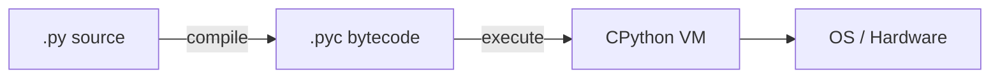
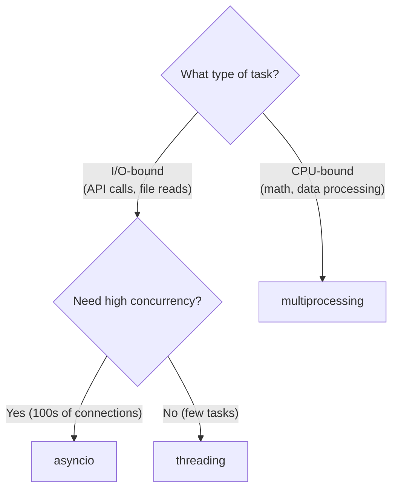

# Python — Complete Guide for Java Developers

A comprehensive Python reference designed for experienced Java developers. Every concept is mapped to its Java equivalent so you can leverage what you already know.

---

## Python vs Java — At a Glance

| Aspect | Java | Python |
|--------|------|--------|
| **Typing** | Static, strong | Dynamic, strong |
| **Compilation** | `.java` → bytecode → JVM | `.py` → bytecode → CPython VM |
| **Entry point** | `public static void main(String[])` | `if __name__ == "__main__":` |
| **Memory** | GC (G1, ZGC) | Reference counting + cyclic GC |
| **Concurrency** | Real threads, no GIL | GIL limits thread parallelism |
| **Package manager** | Maven / Gradle | pip / poetry / uv |
| **Build artifact** | JAR / WAR | wheel / sdist |
| **REPL** | JShell (Java 9+) | Built-in `python` REPL, IPython |
| **Indentation** | Braces `{}` | Whitespace (4 spaces) |
| **Null** | `null` | `None` |
| **Ecosystem** | Enterprise, Android, Big Data | AI/ML, scripting, web, data science |



!!! info "Key Mindset Shift"
    Python favors **readability over verbosity**. No semicolons, no braces, no type declarations required (but type hints are encouraged). If your Python looks like Java with different syntax, you're doing it wrong.

---

## Environment Setup

### Installation

```bash
# macOS (Homebrew)
brew install python@3.12

# Verify
python3 --version   # Python 3.12.x
```

### Virtual Environments (like separate JDK installations per project)

```bash
# Create a virtual environment
python3 -m venv .venv

# Activate it
source .venv/bin/activate      # macOS/Linux
# .venv\Scripts\activate       # Windows

# Now `python` and `pip` point to this environment
pip install requests

# Deactivate when done
deactivate
```

### Modern Tooling — uv (Rust-based, blazing fast)

```bash
# Install uv
curl -LsSf https://astral.sh/uv/install.sh | sh

# Create project (like `mvn archetype:generate`)
uv init my-project
cd my-project

# Add dependencies (like adding to pom.xml)
uv add requests httpx pydantic

# Run
uv run python main.py

# Lock dependencies (like Maven dependency:tree)
uv lock
```

### Comparison to Java Build Tools

| Java (Maven/Gradle) | Python Equivalent |
|---------------------|-------------------|
| `pom.xml` / `build.gradle` | `pyproject.toml` |
| `mvn install` | `pip install -r requirements.txt` or `uv sync` |
| `mvn dependency:tree` | `pip list` or `uv tree` |
| `.m2/repository` (local cache) | `.venv/lib/` (per-project) |
| `mvn package` → JAR | `python -m build` → wheel |
| Maven Central | PyPI (pypi.org) |

### pyproject.toml (the modern pom.xml)

```toml
[project]
name = "my-agent"
version = "0.1.0"
requires-python = ">=3.12"
dependencies = [
    "anthropic>=0.30",
    "httpx>=0.27",
    "pydantic>=2.0",
]

[project.optional-dependencies]
dev = ["pytest", "mypy", "ruff"]
```

---

## Data Types & Variables

### No Declarations — Just Assign

```python
# Java: String name = "Python";
name = "Python"              # type is inferred

# Java: final int MAX = 100;
MAX = 100                    # convention: UPPER_CASE = constant (not enforced)

# Type hints (optional, like Java types but not enforced at runtime)
name: str = "Python"
age: int = 25
pi: float = 3.14159
active: bool = True
nothing: None = None
```

### Type System Comparison

| Java | Python | Notes |
|------|--------|-------|
| `int` | `int` | Python int has unlimited precision (no overflow!) |
| `double` | `float` | 64-bit IEEE 754, same as Java `double` |
| `String` | `str` | Immutable in both languages |
| `boolean` | `bool` | `True`/`False` (capitalized) |
| `null` | `None` | Singleton, check with `is None` not `== None` |
| `char` | No equivalent | Just a string of length 1 |
| `byte[]` | `bytes` | Immutable; `bytearray` for mutable |

### Type Hints (Python 3.9+)

```python
# Basic hints
def greet(name: str) -> str:
    return f"Hello, {name}"

# Collections
from typing import Optional

def find_user(user_id: int) -> Optional[dict]:
    ...

# Modern syntax (Python 3.10+)
def find_user(user_id: int) -> dict | None:
    ...

# Generic collections (Python 3.9+)
names: list[str] = ["Alice", "Bob"]
config: dict[str, int] = {"port": 8080}
coordinates: tuple[float, float] = (3.14, 2.71)
```

### Identity vs Equality

```python
a = [1, 2, 3]
b = [1, 2, 3]
c = a

a == b    # True  — same VALUE (like Java .equals())
a is b    # False — different OBJECT (like Java ==)
a is c    # True  — same object reference

# Always use `is` for None checks
if x is None:     # correct
    ...
if x == None:     # wrong — can be overridden by __eq__
    ...
```

!!! warning "Java Developer Trap"
    In Java, `==` compares references and `.equals()` compares values. In Python, it's the opposite: `==` compares values and `is` compares references. This will trip you up.

### Everything is an Object

```python
# Even functions are objects
def add(a, b):
    return a + b

print(type(add))        # <class 'function'>
print(add.__name__)     # 'add'
operations = {"add": add}
operations["add"](3, 4) # 7

# Even classes are objects
print(type(int))         # <class 'type'>
```

---

## Data Structures

### Collection Mapping: Java → Python

| Java | Python | Notes |
|------|--------|-------|
| `ArrayList<E>` | `list` | Dynamic array, same concept |
| `LinkedList<E>` | `collections.deque` | Double-ended queue |
| `HashMap<K,V>` | `dict` | Hash table, ordered since Python 3.7 |
| `LinkedHashMap<K,V>` | `dict` | Python dict IS insertion-ordered by default |
| `TreeMap<K,V>` | No built-in | Use `sorted()` or `sortedcontainers` lib |
| `HashSet<E>` | `set` | Same concept |
| `TreeSet<E>` | No built-in | Use `sorted(set)` |
| `ArrayDeque<E>` | `collections.deque` | Same concept |
| `PriorityQueue<E>` | `heapq` | Module, not a class (min-heap) |
| `Stack<E>` | `list` | Use `append()` / `pop()` |
| `Queue<E>` | `queue.Queue` | Thread-safe queue |
| `ConcurrentHashMap<K,V>` | No direct equivalent | Use `threading.Lock` + `dict` |
| `Collections.unmodifiableList` | `tuple` | Immutable sequence |
| `Optional<T>` | `X | None` | Just use None, no wrapper class |

### list (ArrayList equivalent)

```python
# Create
nums = [1, 2, 3, 4, 5]
names: list[str] = ["Alice", "Bob"]

# Access
nums[0]          # 1 (first)
nums[-1]         # 5 (last — no Java equivalent!)
nums[1:3]        # [2, 3] (slice — like subList)
nums[::2]        # [1, 3, 5] (every 2nd element)
nums[::-1]       # [5, 4, 3, 2, 1] (reversed)

# Modify
nums.append(6)           # add to end — O(1)
nums.insert(0, 0)        # insert at index — O(n)
nums.extend([7, 8])      # addAll equivalent
nums.pop()               # remove last — O(1)
nums.pop(0)              # remove first — O(n)
nums.remove(3)           # remove first occurrence of value 3

# Search
3 in nums                # True — O(n) membership test
nums.index(3)            # index of first occurrence
nums.count(3)            # count occurrences

# Sort
nums.sort()                          # in-place sort
nums.sort(reverse=True)              # descending
nums.sort(key=lambda x: abs(x))     # custom comparator (like Comparator)
sorted_nums = sorted(nums)          # returns new sorted list
```

### dict (HashMap equivalent)

```python
# Create
config = {"host": "localhost", "port": 8080, "debug": True}
config: dict[str, any] = {}

# Access
config["host"]                   # "localhost" — KeyError if missing
config.get("timeout", 30)       # 30 (default if missing — like getOrDefault)
config.get("timeout")           # None if missing

# Modify
config["timeout"] = 60          # put
config.update({"ssl": True})    # putAll
config.pop("debug")             # remove and return
config.setdefault("retries", 3) # set only if key absent (like putIfAbsent)

# Iterate
for key in config:                          # keys only
    print(key)
for key, value in config.items():           # entrySet equivalent
    print(f"{key} = {value}")
for value in config.values():               # values only
    print(value)

# Comprehension (no Java equivalent — very Pythonic)
squares = {x: x**2 for x in range(10)}
# {0: 0, 1: 1, 2: 4, 3: 9, ...}

# Merge (Python 3.9+)
defaults = {"timeout": 30, "retries": 3}
overrides = {"timeout": 60}
merged = defaults | overrides    # {"timeout": 60, "retries": 3}
```

### set (HashSet equivalent)

```python
seen = {1, 2, 3, 4, 5}
empty_set = set()       # NOT {} — that's an empty dict!

seen.add(6)
seen.discard(3)         # remove if present (no error)
seen.remove(3)          # remove — KeyError if missing

# Set operations (much better than Java's retainAll/removeAll)
a = {1, 2, 3, 4}
b = {3, 4, 5, 6}
a | b     # union:        {1, 2, 3, 4, 5, 6}
a & b     # intersection:  {3, 4}
a - b     # difference:    {1, 2}
a ^ b     # symmetric diff: {1, 2, 5, 6}

3 in seen  # O(1) membership test
```

### tuple (Immutable list — like Collections.unmodifiableList)

```python
point = (3, 4)
rgb = (255, 128, 0)

x, y = point              # destructuring (no Java equivalent)
r, g, b = rgb

# Single element tuple needs trailing comma
single = (42,)             # tuple
not_tuple = (42)           # just int 42

# Use as dict keys (lists can't be keys — not hashable)
cache = {(0, 0): "origin", (1, 1): "diagonal"}
```

### collections module — Specialized containers

```python
from collections import defaultdict, Counter, deque, namedtuple

# defaultdict — like Java's computeIfAbsent
word_count = defaultdict(int)
for word in ["apple", "banana", "apple"]:
    word_count[word] += 1
# {"apple": 2, "banana": 1}

groups = defaultdict(list)
for name, dept in [("Alice", "eng"), ("Bob", "eng"), ("Carol", "sales")]:
    groups[dept].append(name)
# {"eng": ["Alice", "Bob"], "sales": ["Carol"]}

# Counter — frequency counting
counter = Counter(["a", "b", "a", "c", "a", "b"])
counter.most_common(2)    # [("a", 3), ("b", 2)]
counter["a"]              # 3

# deque — double-ended queue (like Java ArrayDeque)
dq = deque([1, 2, 3])
dq.appendleft(0)          # O(1) add to front
dq.popleft()              # O(1) remove from front
dq.append(4)              # O(1) add to back
dq.rotate(1)              # rotate right by 1

# namedtuple — lightweight immutable class
Point = namedtuple("Point", ["x", "y"])
p = Point(3, 4)
p.x                       # 3
p._asdict()                # {"x": 3, "y": 4}
```

### Time Complexity

| Operation | list | dict | set | deque |
|-----------|------|------|-----|-------|
| Access by index | O(1) | — | — | O(n) |
| Search | O(n) | O(1) avg | O(1) avg | O(n) |
| Insert at end | O(1) | O(1) avg | O(1) avg | O(1) |
| Insert at start | O(n) | — | — | O(1) |
| Delete | O(n) | O(1) avg | O(1) avg | O(n) |

---

## Strings

### Java String vs Python str

Both are **immutable**. But Python strings are far more powerful out of the box.

```python
name = "Python"
version = 3.12

# f-strings (like String.format but 10x better)
msg = f"Hello {name} {version}"
msg = f"Result: {2 + 2}"
msg = f"Padded: {42:>10}"           # right-align, width 10
msg = f"Float: {3.14159:.2f}"       # "3.14"
msg = f"Debug: {name!r}"            # "Debug: 'Python'" (repr)

# Multi-line strings (like Java text blocks)
query = """
SELECT *
FROM users
WHERE active = true
ORDER BY name
"""

# Raw strings (no escape processing — great for regex and Windows paths)
pattern = r"\d{3}-\d{3}-\d{4}"
path = r"C:\Users\vamsi\Documents"
```

### Common String Operations

```python
s = "Hello, World!"

# Slicing (no Java equivalent — very powerful)
s[0:5]        # "Hello"
s[7:]         # "World!"
s[-6:]        # "orld!"
s[::-1]       # "!dlroW ,olleH" (reverse)

# Methods
s.lower()                  # "hello, world!"
s.upper()                  # "HELLO, WORLD!"
s.strip()                  # trim whitespace (like Java .trim())
s.split(", ")              # ["Hello", "World!"]
", ".join(["a", "b", "c"]) # "a, b, c" (like String.join)
s.replace("World", "Python") # "Hello, Python!"
s.startswith("Hello")      # True
s.endswith("!")             # True
s.find("World")            # 7 (index, -1 if not found)
s.count("l")               # 3
s.isdigit()                # False
s.isalpha()                # False (has comma, space, !)

# Check empty/blank
bool("")             # False (empty string is falsy)
bool("  ".strip())   # False
```

### Regex

```python
import re

text = "Call me at 123-456-7890 or 987-654-3210"

# Search (like Java Pattern.compile + matcher.find)
match = re.search(r"\d{3}-\d{3}-\d{4}", text)
if match:
    print(match.group())     # "123-456-7890"

# Find all
phones = re.findall(r"\d{3}-\d{3}-\d{4}", text)
# ["123-456-7890", "987-654-3210"]

# Replace
clean = re.sub(r"\d", "X", text)
# "Call me at XXX-XXX-XXXX or XXX-XXX-XXXX"

# Compile for reuse (like Java Pattern.compile)
PHONE_RE = re.compile(r"(\d{3})-(\d{3})-(\d{4})")
m = PHONE_RE.search(text)
m.group(1)    # "123" (area code)
```

---

## Control Flow

### Conditionals

```python
# if/elif/else (no parentheses, no braces)
score = 85
if score >= 90:
    grade = "A"
elif score >= 80:
    grade = "B"
else:
    grade = "C"

# Ternary (like Java's condition ? a : b)
status = "pass" if score >= 60 else "fail"

# Truthy/Falsy (no Java equivalent — learn this!)
# Falsy: None, False, 0, 0.0, "", [], {}, set()
# Everything else is truthy

if not my_list:          # empty list check (Pythonic)
    print("empty")
# Java: if (myList.isEmpty())
```

### Loops

```python
# for loop (like Java enhanced for)
for name in ["Alice", "Bob", "Carol"]:
    print(name)

# for with index (like Java for(int i=0; ...))
for i, name in enumerate(["Alice", "Bob", "Carol"]):
    print(f"{i}: {name}")

# range (like Java IntStream.range)
for i in range(5):           # 0, 1, 2, 3, 4
    print(i)
for i in range(2, 10, 3):   # 2, 5, 8 (start, stop, step)
    print(i)

# while
count = 0
while count < 5:
    count += 1

# for/else — runs if loop completes without break (unique to Python)
for n in range(2, 10):
    for x in range(2, n):
        if n % x == 0:
            break
    else:
        print(f"{n} is prime")

# Iterate dict
for key, value in config.items():
    print(f"{key} = {value}")

# Zip — iterate multiple sequences in parallel
names = ["Alice", "Bob"]
scores = [95, 87]
for name, score in zip(names, scores):
    print(f"{name}: {score}")
```

### match-case (Python 3.10+ — like Java switch expressions)

```python
def handle_command(command: str) -> str:
    match command.split():
        case ["quit"]:
            return "Goodbye"
        case ["hello", name]:
            return f"Hello, {name}!"
        case ["add", *numbers]:
            return str(sum(int(n) for n in numbers))
        case _:
            return "Unknown command"

# Pattern matching with types
def process(value):
    match value:
        case int(n) if n > 0:
            return f"positive int: {n}"
        case str(s) if len(s) > 0:
            return f"non-empty string: {s}"
        case [x, y]:
            return f"pair: ({x}, {y})"
        case {"name": name, "age": age}:
            return f"{name} is {age}"
        case _:
            return "unknown"
```

### Comprehensions (No Java Equivalent — Master These)

```python
# List comprehension (replaces map + filter)
# Java: list.stream().filter(x -> x % 2 == 0).map(x -> x * x).collect(toList())
squares = [x**2 for x in range(10) if x % 2 == 0]
# [0, 4, 16, 36, 64]

# Dict comprehension
word_lengths = {w: len(w) for w in ["python", "java", "go"]}
# {"python": 6, "java": 4, "go": 2}

# Set comprehension
unique_lengths = {len(w) for w in ["hello", "world", "hi"]}
# {5, 2}

# Nested comprehension (flatten)
matrix = [[1, 2], [3, 4], [5, 6]]
flat = [x for row in matrix for x in row]
# [1, 2, 3, 4, 5, 6]

# Generator expression (lazy — like Java Stream)
total = sum(x**2 for x in range(1_000_000))  # no list created in memory

# Walrus operator := (Python 3.8+ — assign inside expression)
if (n := len(data)) > 10:
    print(f"Processing {n} items")
```

---

## Functions

### Basics

```python
# Java: public int add(int a, int b) { return a + b; }
def add(a: int, b: int) -> int:
    return a + b

# Default arguments (like Java method overloading, but simpler)
def connect(host: str, port: int = 5432, ssl: bool = False) -> None:
    ...

connect("localhost")                  # uses defaults
connect("db.example.com", 3306)       # override port
connect("db.example.com", ssl=True)   # keyword argument
```

### *args and **kwargs (No Java Equivalent)

```python
def log(message: str, *args, **kwargs):
    """
    *args  = captures extra positional args as a tuple
    **kwargs = captures extra keyword args as a dict
    """
    print(f"[LOG] {message}")
    for arg in args:
        print(f"  - {arg}")
    for key, value in kwargs.items():
        print(f"  {key}={value}")

log("Server started", "port=8080", "mode=prod", version=2, debug=False)

# Keyword-only arguments (after *)
def fetch(url: str, *, timeout: int = 30, retries: int = 3) -> bytes:
    """timeout and retries MUST be passed as keywords."""
    ...

fetch("https://api.example.com", timeout=10)  # OK
fetch("https://api.example.com", 10)           # TypeError!
```

### First-Class Functions

```python
# Functions are objects — pass them around like Java functional interfaces
def apply(func, value):
    return func(value)

apply(str.upper, "hello")    # "HELLO"
apply(len, [1, 2, 3])       # 3

# Lambda (like Java lambda expressions)
# Java: (a, b) -> a + b
add = lambda a, b: a + b
add(3, 4)   # 7

# Sort with key function (like Java Comparator)
students = [("Alice", 92), ("Bob", 87), ("Carol", 95)]
students.sort(key=lambda s: s[1], reverse=True)
# [("Carol", 95), ("Alice", 92), ("Bob", 87)]
```

### Closures

```python
def make_multiplier(factor: int):
    def multiply(x: int) -> int:
        return x * factor    # captures `factor` from enclosing scope
    return multiply

double = make_multiplier(2)
triple = make_multiplier(3)
double(5)    # 10
triple(5)    # 15
```

---

## Decorators

Decorators are Python's version of **Java annotations + AOP combined**. They wrap functions to add behavior.

### Basic Decorator

```python
import functools
import time

# This is like writing a Spring AOP @Around advice
def timer(func):
    @functools.wraps(func)  # preserves original function metadata
    def wrapper(*args, **kwargs):
        start = time.perf_counter()
        result = func(*args, **kwargs)
        elapsed = time.perf_counter() - start
        print(f"{func.__name__} took {elapsed:.4f}s")
        return result
    return wrapper

@timer
def process_data(n: int) -> int:
    return sum(range(n))

process_data(1_000_000)
# "process_data took 0.0312s"
```

### Decorator with Arguments

```python
def retry(max_attempts: int = 3, delay: float = 1.0):
    def decorator(func):
        @functools.wraps(func)
        def wrapper(*args, **kwargs):
            for attempt in range(1, max_attempts + 1):
                try:
                    return func(*args, **kwargs)
                except Exception as e:
                    if attempt == max_attempts:
                        raise
                    print(f"Attempt {attempt} failed: {e}. Retrying...")
                    time.sleep(delay)
        return wrapper
    return decorator

@retry(max_attempts=5, delay=2.0)
def call_api(url: str) -> dict:
    ...
```

### Built-in Decorators You Must Know

| Decorator | Java Equivalent | Purpose |
|-----------|----------------|---------|
| `@property` | getter/setter | Attribute access with logic |
| `@staticmethod` | `static` method | No `self`, no `cls` |
| `@classmethod` | Factory methods | Receives class as first arg |
| `@abstractmethod` | `abstract` method | Must be overridden |
| `@dataclass` | Lombok `@Data` / Java `record` | Auto-generate boilerplate |
| `@functools.lru_cache` | Manual memoization | Cache function results |
| `@functools.singledispatch` | Method overloading | Dispatch by first arg type |

```python
from functools import lru_cache

@lru_cache(maxsize=128)
def fibonacci(n: int) -> int:
    if n < 2:
        return n
    return fibonacci(n - 1) + fibonacci(n - 2)

fibonacci(100)   # instant — cached
```

---

## OOP in Python

### Classes (Java comparison)

```python
# Java:
# public class User {
#     private String name;
#     private int age;
#     public User(String name, int age) { ... }
#     public String getName() { return name; }
# }

class User:
    # Class variable (like Java static field)
    count: int = 0

    def __init__(self, name: str, age: int):
        # Instance variables (like Java fields)
        self.name = name        # public by default
        self._email = ""        # convention: "protected" (single underscore)
        self.__secret = "x"     # name-mangled: becomes _User__secret
        self.age = age
        User.count += 1

    # Instance method (self = Java's this)
    def greet(self) -> str:
        return f"Hi, I'm {self.name}"

    # Property (Java getter/setter pattern)
    @property
    def email(self) -> str:
        return self._email

    @email.setter
    def email(self, value: str) -> None:
        if "@" not in value:
            raise ValueError("Invalid email")
        self._email = value

    # Class method (like Java static factory)
    @classmethod
    def from_dict(cls, data: dict) -> "User":
        return cls(data["name"], data["age"])

    # Static method (like Java static method)
    @staticmethod
    def validate_age(age: int) -> bool:
        return 0 < age < 150

    # String representations
    def __repr__(self) -> str:     # for developers (like Java toString)
        return f"User(name={self.name!r}, age={self.age})"

    def __str__(self) -> str:      # for users
        return self.name

    # Equality (like Java equals + hashCode)
    def __eq__(self, other) -> bool:
        if not isinstance(other, User):
            return NotImplemented
        return self.name == other.name and self.age == other.age

    def __hash__(self) -> int:
        return hash((self.name, self.age))
```

### Inheritance

```python
from abc import ABC, abstractmethod

# Abstract class (like Java abstract class)
class Shape(ABC):
    @abstractmethod
    def area(self) -> float:
        ...

    @abstractmethod
    def perimeter(self) -> float:
        ...

    def describe(self) -> str:
        return f"{type(self).__name__}: area={self.area():.2f}"

class Circle(Shape):
    def __init__(self, radius: float):
        self.radius = radius

    def area(self) -> float:
        return 3.14159 * self.radius ** 2

    def perimeter(self) -> float:
        return 2 * 3.14159 * self.radius

# Multiple inheritance (Java only has interfaces)
class Serializable:
    def to_json(self) -> dict:
        return self.__dict__

class Loggable:
    def log(self) -> None:
        print(f"[LOG] {self!r}")

class PersistentCircle(Circle, Serializable, Loggable):
    pass

c = PersistentCircle(5.0)
c.area()        # from Circle
c.to_json()     # from Serializable
c.log()         # from Loggable
```

### Protocol (Structural Typing — like Java interfaces but implicit)

```python
from typing import Protocol

# Java: public interface Drawable { void draw(); }
# In Python, you DON'T need to explicitly implement it
class Drawable(Protocol):
    def draw(self) -> None:
        ...

class Circle:
    def draw(self) -> None:      # implicitly satisfies Drawable
        print("Drawing circle")

class Square:
    def draw(self) -> None:      # implicitly satisfies Drawable
        print("Drawing square")

def render(shape: Drawable) -> None:
    shape.draw()

render(Circle())    # works — Circle has draw() method
render(Square())    # works — Square has draw() method
```

!!! info "Duck Typing"
    Python uses duck typing: "If it walks like a duck and quacks like a duck, it's a duck." You don't need to declare `implements Drawable` — just having the right methods is enough.

### Dunder Methods Reference

| Category | Method | Java Equivalent | Purpose |
|----------|--------|----------------|---------|
| **Creation** | `__init__` | Constructor | Initialize instance |
| **String** | `__repr__` | `toString()` | Developer string |
| | `__str__` | `toString()` | User-friendly string |
| **Comparison** | `__eq__` | `equals()` | Equality check |
| | `__hash__` | `hashCode()` | Hash for dict/set |
| | `__lt__`, `__gt__` | `compareTo()` | Ordering |
| **Container** | `__len__` | `size()` | Length |
| | `__getitem__` | `get(index)` | Indexing `obj[key]` |
| | `__setitem__` | `set(index, val)` | Assignment `obj[key] = val` |
| | `__contains__` | `contains()` | `in` operator |
| | `__iter__` | `iterator()` | Make iterable |
| **Arithmetic** | `__add__` | — | `+` operator |
| | `__mul__` | — | `*` operator |
| **Context** | `__enter__`, `__exit__` | `AutoCloseable` | `with` statement |
| **Callable** | `__call__` | — | `obj()` like a function |

### __slots__ (Memory optimization)

```python
class Point:
    __slots__ = ("x", "y")    # no __dict__, saves ~40% memory per instance

    def __init__(self, x: float, y: float):
        self.x = x
        self.y = y

p = Point(3, 4)
p.x = 5         # OK
p.z = 6         # AttributeError — can't add new attributes
```

---

## Dataclasses & Pydantic

### @dataclass (like Java record or Lombok @Data)

```python
from dataclasses import dataclass, field

@dataclass
class User:
    name: str
    age: int
    email: str = ""
    tags: list[str] = field(default_factory=list)

    def is_adult(self) -> bool:
        return self.age >= 18

# Auto-generates: __init__, __repr__, __eq__
u1 = User("Alice", 30, "alice@example.com")
u2 = User("Alice", 30, "alice@example.com")
u1 == u2     # True (auto __eq__)
print(u1)    # User(name='Alice', age=30, email='alice@example.com', tags=[])

# Frozen (immutable — like Java record)
@dataclass(frozen=True)
class Point:
    x: float
    y: float

p = Point(3, 4)
p.x = 5         # FrozenInstanceError
```

!!! warning "Mutable Default Trap"
    Never use `tags: list[str] = []` — the same list object would be shared across all instances. Always use `field(default_factory=list)`.

### Pydantic (like Java Bean Validation + Jackson combined)

```python
from pydantic import BaseModel, Field, field_validator

class User(BaseModel):
    name: str = Field(min_length=1, max_length=100)
    age: int = Field(ge=0, le=150)
    email: str

    @field_validator("email")
    @classmethod
    def validate_email(cls, v: str) -> str:
        if "@" not in v:
            raise ValueError("Invalid email")
        return v.lower()

# Auto-validates on creation
user = User(name="Alice", age=30, email="Alice@Example.com")
user.email    # "alice@example.com" (normalized)

# Serialization (like Jackson)
user.model_dump()       # {"name": "Alice", "age": 30, "email": "alice@example.com"}
user.model_dump_json()  # JSON string

# Parse from dict/JSON (like Jackson deserialization)
user = User.model_validate({"name": "Bob", "age": 25, "email": "bob@test.com"})
user = User.model_validate_json('{"name": "Bob", "age": 25, "email": "bob@test.com"}')

# Validation error
User(name="", age=200, email="invalid")  # ValidationError with details
```

---

## Error Handling

### Java vs Python Exception Handling

```python
# Java:                              # Python:
# try {                              try:
#     riskyOperation();                  risky_operation()
# } catch (IOException e) {          except IOError as e:
#     log(e);                            log(e)
# } catch (Exception e) {            except Exception as e:
#     handle(e);                         handle(e)
# } finally {                        else:
#     cleanup();                         success()  # runs ONLY if no exception
# }                                  finally:
#                                        cleanup()
```

### Exception Hierarchy

```
BaseException
├── SystemExit
├── KeyboardInterrupt
├── GeneratorExit
└── Exception              ← catch this, not BaseException
    ├── ValueError
    ├── TypeError
    ├── KeyError
    ├── IndexError
    ├── FileNotFoundError
    ├── IOError
    ├── RuntimeError
    ├── StopIteration
    └── ...
```

### Custom Exceptions

```python
class AppError(Exception):
    """Base exception for our application."""
    pass

class NotFoundError(AppError):
    def __init__(self, entity: str, entity_id: int):
        self.entity = entity
        self.entity_id = entity_id
        super().__init__(f"{entity} with id {entity_id} not found")

class ValidationError(AppError):
    def __init__(self, field: str, message: str):
        self.field = field
        super().__init__(f"Validation failed for {field}: {message}")

# Chained exceptions (like Java `throw new X(cause)`)
try:
    data = fetch_from_db(user_id)
except DatabaseError as e:
    raise NotFoundError("User", user_id) from e
```

### Context Managers (like Java try-with-resources)

```python
# Java: try (var conn = getConnection()) { ... }
# Python: with get_connection() as conn: ...

# Built-in
with open("data.txt", "r") as f:
    content = f.read()
# file is automatically closed

# Custom context manager — class-based
class Timer:
    def __enter__(self):
        self.start = time.perf_counter()
        return self

    def __exit__(self, exc_type, exc_val, exc_tb):
        self.elapsed = time.perf_counter() - self.start
        print(f"Elapsed: {self.elapsed:.4f}s")
        return False   # don't suppress exceptions

with Timer() as t:
    process_data()

# Custom context manager — decorator-based (simpler)
from contextlib import contextmanager

@contextmanager
def database_transaction(conn):
    tx = conn.begin()
    try:
        yield tx
        tx.commit()
    except Exception:
        tx.rollback()
        raise
```

!!! tip "EAFP vs LBYL"
    Python prefers **EAFP** (Easier to Ask Forgiveness than Permission):
    ```python
    # LBYL (Java style) — Look Before You Leap
    if "key" in my_dict:
        value = my_dict["key"]

    # EAFP (Python style) — just try it
    try:
        value = my_dict["key"]
    except KeyError:
        value = default
    
    # Even better — use .get()
    value = my_dict.get("key", default)
    ```

---

## Iterators & Generators

### Iterator Protocol (like Java Iterator)

```python
# Java: implements Iterator<T> { hasNext(), next() }
# Python: implements __iter__() and __next__()

class CountDown:
    def __init__(self, start: int):
        self.current = start

    def __iter__(self):
        return self

    def __next__(self) -> int:
        if self.current <= 0:
            raise StopIteration
        self.current -= 1
        return self.current + 1

for n in CountDown(5):
    print(n)    # 5, 4, 3, 2, 1
```

### Generators (Lazy sequences — like Java Stream but simpler)

```python
# Generator function — uses yield instead of return
def fibonacci():
    a, b = 0, 1
    while True:
        yield a           # pauses here, resumes on next()
        a, b = b, a + b

# Only computes values on demand
fib = fibonacci()
first_ten = [next(fib) for _ in range(10)]
# [0, 1, 1, 2, 3, 5, 8, 13, 21, 34]

# Generator for reading large files (memory efficient)
def read_chunks(file_path: str, chunk_size: int = 8192):
    with open(file_path, "rb") as f:
        while chunk := f.read(chunk_size):
            yield chunk

# yield from — delegate to sub-generator
def flatten(nested: list) -> list:
    for item in nested:
        if isinstance(item, list):
            yield from flatten(item)
        else:
            yield item

list(flatten([1, [2, [3, 4], 5], 6]))   # [1, 2, 3, 4, 5, 6]
```

### itertools (Power tools for iteration)

```python
from itertools import chain, groupby, islice, product, combinations, permutations, count, cycle, repeat, starmap, accumulate

# chain — concatenate iterables (like Java Stream.concat)
list(chain([1, 2], [3, 4], [5]))          # [1, 2, 3, 4, 5]
list(chain.from_iterable([[1, 2], [3]]))  # [1, 2, 3] (flatten one level)

# groupby — group sorted data (like Java Collectors.groupingBy)
data = [("eng", "Alice"), ("eng", "Bob"), ("sales", "Carol")]
for dept, members in groupby(data, key=lambda x: x[0]):
    print(dept, [m[1] for m in members])

# islice — lazy slicing (like Java Stream.limit/skip)
list(islice(fibonacci(), 5))              # [0, 1, 1, 2, 3]
list(islice(fibonacci(), 5, 10))          # [5, 8, 13, 21, 34]

# product — cartesian product
list(product([1, 2], ["a", "b"]))         # [(1,"a"), (1,"b"), (2,"a"), (2,"b")]

# combinations / permutations
list(combinations([1, 2, 3], 2))          # [(1,2), (1,3), (2,3)]
list(permutations([1, 2, 3], 2))          # [(1,2), (1,3), (2,1), (2,3), ...]

# accumulate — running totals
list(accumulate([1, 2, 3, 4]))            # [1, 3, 6, 10]

# starmap — map with unpacked arguments
list(starmap(pow, [(2, 3), (3, 2)]))      # [8, 9]
```

### Java Stream API → Python Equivalents

| Java Stream | Python | Example |
|-------------|--------|---------|
| `.filter(x -> x > 5)` | `[x for x in lst if x > 5]` or `filter(lambda x: x > 5, lst)` |
| `.map(x -> x * 2)` | `[x * 2 for x in lst]` or `map(lambda x: x * 2, lst)` |
| `.flatMap()` | `[y for x in lst for y in x]` or `chain.from_iterable()` |
| `.reduce(0, Integer::sum)` | `functools.reduce(operator.add, lst, 0)` or `sum(lst)` |
| `.collect(toList())` | Just use `list(...)` |
| `.sorted()` | `sorted(lst)` |
| `.distinct()` | `list(set(lst))` or `list(dict.fromkeys(lst))` |
| `.limit(n)` | `lst[:n]` or `islice(it, n)` |
| `.skip(n)` | `lst[n:]` or `islice(it, n, None)` |
| `.count()` | `len(lst)` |
| `.anyMatch()` | `any(cond(x) for x in lst)` |
| `.allMatch()` | `all(cond(x) for x in lst)` |
| `.findFirst()` | `next((x for x in lst if cond(x)), None)` |
| `.forEach()` | `for x in lst:` |
| `Collectors.groupingBy()` | `itertools.groupby()` or `defaultdict(list)` |
| `Collectors.toMap()` | `{k: v for k, v in pairs}` |

---

## Functional Programming

```python
from functools import reduce, partial, lru_cache, singledispatch
import operator

# map / filter / reduce
nums = [1, 2, 3, 4, 5]
doubled = list(map(lambda x: x * 2, nums))          # [2, 4, 6, 8, 10]
evens = list(filter(lambda x: x % 2 == 0, nums))    # [2, 4]
total = reduce(operator.add, nums, 0)                # 15

# partial — fix some arguments (like Java's currying)
multiply_by_ten = partial(operator.mul, 10)
multiply_by_ten(5)    # 50

# singledispatch — method overloading by type
@singledispatch
def process(value):
    raise TypeError(f"Unsupported type: {type(value)}")

@process.register(int)
def _(value: int) -> str:
    return f"Integer: {value}"

@process.register(str)
def _(value: str) -> str:
    return f"String: {value.upper()}"

@process.register(list)
def _(value: list) -> str:
    return f"List with {len(value)} items"

process(42)           # "Integer: 42"
process("hello")      # "String: HELLO"
process([1, 2, 3])    # "List with 3 items"
```

---

## File I/O

### Reading and Writing Files

```python
from pathlib import Path
import json

# Read entire file
content = Path("data.txt").read_text(encoding="utf-8")

# Read line by line (memory efficient for large files)
with open("data.txt", "r") as f:
    for line in f:
        process(line.strip())

# Write
Path("output.txt").write_text("Hello, World!", encoding="utf-8")

with open("output.txt", "w") as f:
    f.write("line 1\n")
    f.write("line 2\n")

# Append
with open("log.txt", "a") as f:
    f.write(f"[{datetime.now()}] Event occurred\n")
```

### pathlib (like Java NIO Path)

```python
from pathlib import Path

# Java: Paths.get("/Users/vamsi/projects")
p = Path("/Users/vamsi/projects")

p.exists()                  # Files.exists()
p.is_file()                 # Files.isRegularFile()
p.is_dir()                  # Files.isDirectory()
p.name                      # "projects"
p.stem                      # filename without extension
p.suffix                    # ".txt" etc
p.parent                    # parent directory
p / "subdir" / "file.txt"  # join paths (like Path.resolve)

# Glob (like Files.walk with filter)
for py_file in Path(".").rglob("*.py"):
    print(py_file)

# Create directories
Path("output/reports").mkdir(parents=True, exist_ok=True)
```

### JSON (like Jackson/Gson)

```python
import json

# Serialize (Java: objectMapper.writeValueAsString)
data = {"name": "Alice", "scores": [95, 87, 92]}
json_str = json.dumps(data, indent=2)

# Deserialize (Java: objectMapper.readValue)
parsed = json.loads(json_str)

# File I/O
with open("data.json", "w") as f:
    json.dump(data, f, indent=2)

with open("data.json", "r") as f:
    loaded = json.load(f)
```

---

## Concurrency & Parallelism



### The GIL (Global Interpreter Lock)

!!! warning "The #1 Gotcha for Java Developers"
    Python's GIL means **only one thread executes Python bytecode at a time**. Unlike Java where threads give you true parallelism, Python threads only help with I/O-bound tasks (where threads spend time waiting). For CPU-bound parallelism, you must use `multiprocessing`.

### threading (like Java Thread / Runnable)

```python
import threading
from concurrent.futures import ThreadPoolExecutor

# Basic thread
def download(url: str) -> bytes:
    import httpx
    return httpx.get(url).content

# ThreadPoolExecutor (like Java ExecutorService)
urls = ["https://example.com"] * 10
with ThreadPoolExecutor(max_workers=5) as executor:
    futures = [executor.submit(download, url) for url in urls]
    results = [f.result() for f in futures]

# Thread-safe data structures
lock = threading.Lock()
counter = 0

def increment():
    global counter
    with lock:              # like Java synchronized block
        counter += 1
```

### multiprocessing (true parallelism — like Java ProcessBuilder)

```python
from multiprocessing import Pool
from concurrent.futures import ProcessPoolExecutor

def compute_heavy(n: int) -> int:
    return sum(i * i for i in range(n))

# ProcessPoolExecutor (like Java ExecutorService but with processes)
with ProcessPoolExecutor(max_workers=4) as executor:
    futures = [executor.submit(compute_heavy, 10**6) for _ in range(4)]
    results = [f.result() for f in futures]

# Pool.map (simpler API)
with Pool(processes=4) as pool:
    results = pool.map(compute_heavy, [10**6] * 4)
```

### asyncio (Cooperative multitasking — no Java equivalent)

```python
import asyncio
import httpx

# async function = coroutine
async def fetch(client: httpx.AsyncClient, url: str) -> int:
    response = await client.get(url)     # suspends here, doesn't block
    return response.status_code

async def main():
    async with httpx.AsyncClient() as client:
        # Run 100 requests concurrently (not parallel — single thread!)
        tasks = [fetch(client, f"https://httpbin.org/get?i={i}") for i in range(100)]
        results = await asyncio.gather(*tasks)
        print(f"Completed {len(results)} requests")

asyncio.run(main())
```

### When to Use What

| Scenario | Use | Why |
|----------|-----|-----|
| 100+ API calls | `asyncio` | Non-blocking I/O, single thread handles all |
| Download 5 files | `threading` | Simple, GIL releases during I/O |
| Number crunching | `multiprocessing` | Bypasses GIL with separate processes |
| Mixed I/O + CPU | `asyncio` + `ProcessPoolExecutor` | Async for I/O, processes for CPU |

---

## Modules & Packages

### Import System (like Java packages)

```python
# Java: import java.util.List;
# Python:
import os                          # import entire module
from os.path import join, exists   # import specific items
from collections import defaultdict, Counter
import json as j                   # alias (like Java import static)

# Relative imports (within a package)
from . import sibling_module       # same package
from ..utils import helper         # parent package
```

### Package Structure

```
my_project/
├── pyproject.toml          # like pom.xml
├── src/
│   └── my_agent/
│       ├── __init__.py     # makes this a package (can be empty)
│       ├── main.py
│       ├── models/
│       │   ├── __init__.py
│       │   └── user.py
│       └── services/
│           ├── __init__.py
│           └── api.py
└── tests/
    ├── __init__.py
    └── test_main.py
```

```python
# __init__.py — controls what's exported
# my_agent/models/__init__.py
from .user import User, UserCreate

# __all__ — controls `from module import *`
__all__ = ["User", "UserCreate"]

# Entry point pattern
# my_agent/main.py
def run():
    ...

if __name__ == "__main__":
    run()
```

---

## Type Hints & Static Analysis

### typing Module (like Java generics)

```python
from typing import (
    Optional, Union, TypeVar, Generic, Protocol,
    Literal, TypeAlias, Any, ClassVar, Final
)

# Optional (Java: @Nullable or Optional<T>)
def find(user_id: int) -> str | None:    # Python 3.10+
    ...

# Union (Java: no equivalent)
Value: TypeAlias = int | str | float

# Literal (restrict to specific values)
def set_mode(mode: Literal["read", "write", "append"]) -> None:
    ...

# TypeVar + Generic (like Java generics)
T = TypeVar("T")

class Stack(Generic[T]):
    def __init__(self) -> None:
        self._items: list[T] = []

    def push(self, item: T) -> None:
        self._items.append(item)

    def pop(self) -> T:
        return self._items.pop()

stack: Stack[int] = Stack()
stack.push(42)

# Callable type (like Java Function<T, R>)
from collections.abc import Callable

def apply(func: Callable[[int, int], int], a: int, b: int) -> int:
    return func(a, b)
```

### Static Analysis with mypy

```bash
# Install
pip install mypy

# Run type checking (like Java compiler but optional)
mypy src/

# Strict mode
mypy --strict src/
```

---

## Testing (pytest — like JUnit 5 + Mockito)

### Basic Tests

```python
# test_calculator.py
# Java: @Test void testAdd() { assertEquals(5, calc.add(2, 3)); }

def test_add():
    assert add(2, 3) == 5

def test_divide_by_zero():
    import pytest
    with pytest.raises(ZeroDivisionError):
        divide(1, 0)

def test_string_contains():
    result = greet("Alice")
    assert "Alice" in result
    assert result.startswith("Hello")
```

### Fixtures (like JUnit @BeforeEach)

```python
import pytest

@pytest.fixture
def db_connection():
    conn = create_connection()
    yield conn                    # test runs here
    conn.close()                  # teardown (like @AfterEach)

@pytest.fixture
def sample_user():
    return User(name="Alice", age=30)

def test_user_query(db_connection, sample_user):
    db_connection.save(sample_user)
    result = db_connection.find("Alice")
    assert result.age == 30
```

### Parametrize (like JUnit @ParameterizedTest)

```python
@pytest.mark.parametrize("input,expected", [
    ("hello", "HELLO"),
    ("World", "WORLD"),
    ("", ""),
])
def test_uppercase(input, expected):
    assert input.upper() == expected
```

### Mocking (like Mockito)

```python
from unittest.mock import Mock, patch, MagicMock

# Mock an object
mock_api = Mock()
mock_api.get_user.return_value = {"name": "Alice"}
result = mock_api.get_user(123)
mock_api.get_user.assert_called_once_with(123)

# Patch a module (like Mockito @MockBean)
@patch("my_module.requests.get")
def test_fetch_data(mock_get):
    mock_get.return_value.json.return_value = {"status": "ok"}
    result = fetch_data("https://api.example.com")
    assert result["status"] == "ok"
```

### Run Tests

```bash
# Run all tests
pytest

# Verbose output
pytest -v

# Run specific file/test
pytest tests/test_calculator.py
pytest tests/test_calculator.py::test_add

# With coverage
pytest --cov=src --cov-report=html
```

---

## Python for AI/ML — Essential Libraries

| Library | Purpose | Java Equivalent |
|---------|---------|-----------------|
| `anthropic` | Claude API SDK | — |
| `openai` | OpenAI API SDK | — |
| `httpx` | Async HTTP client | OkHttp / WebClient |
| `FastAPI` | Web framework (async) | Spring Boot |
| `pydantic` | Data validation | Bean Validation + Jackson |
| `chromadb` | Vector database | — |
| `langchain` | LLM application framework | — |
| `numpy` | Numerical computing | — |
| `pandas` | Data manipulation | — |
| `requests` | HTTP client (sync) | HttpClient |

### Anthropic SDK — Calling Claude

```python
import anthropic

client = anthropic.Anthropic()     # uses ANTHROPIC_API_KEY env var

message = client.messages.create(
    model="claude-sonnet-4-6-20250514",
    max_tokens=1024,
    messages=[
        {"role": "user", "content": "Explain Python generators in one paragraph."}
    ]
)
print(message.content[0].text)
```

### Tool Use (Function Calling)

```python
import anthropic
import json

client = anthropic.Anthropic()

tools = [
    {
        "name": "get_weather",
        "description": "Get current weather for a city",
        "input_schema": {
            "type": "object",
            "properties": {
                "city": {"type": "string", "description": "City name"},
            },
            "required": ["city"]
        }
    }
]

def get_weather(city: str) -> str:
    return f"72°F and sunny in {city}"

response = client.messages.create(
    model="claude-sonnet-4-6-20250514",
    max_tokens=1024,
    tools=tools,
    messages=[{"role": "user", "content": "What's the weather in Austin?"}]
)

# Handle tool use
for block in response.content:
    if block.type == "tool_use":
        result = get_weather(**block.input)
        print(f"Tool called: {block.name}({block.input}) → {result}")
```

### FastAPI (like Spring Boot but faster to write)

```python
from fastapi import FastAPI, HTTPException
from pydantic import BaseModel

app = FastAPI()

class UserCreate(BaseModel):
    name: str
    email: str

class UserResponse(BaseModel):
    id: int
    name: str
    email: str

@app.get("/users/{user_id}")
async def get_user(user_id: int) -> UserResponse:
    user = await db.find(user_id)
    if not user:
        raise HTTPException(status_code=404, detail="User not found")
    return user

@app.post("/users", status_code=201)
async def create_user(user: UserCreate) -> UserResponse:
    return await db.create(user)
```

```bash
# Run (like `mvn spring-boot:run`)
uvicorn main:app --reload
```

---

## Common Gotchas for Java Developers

### 1. Mutable Default Arguments

```python
# BUG: default list is shared across ALL calls
def add_item(item, items=[]):
    items.append(item)
    return items

add_item("a")   # ["a"]
add_item("b")   # ["a", "b"] ← BUG! Expected ["b"]

# FIX: use None sentinel
def add_item(item, items=None):
    if items is None:
        items = []
    items.append(item)
    return items
```

### 2. Late Binding Closures

```python
# BUG: all lambdas capture the SAME variable i
funcs = [lambda: i for i in range(5)]
[f() for f in funcs]   # [4, 4, 4, 4, 4] ← all return 4!

# FIX: capture current value as default arg
funcs = [lambda i=i: i for i in range(5)]
[f() for f in funcs]   # [0, 1, 2, 3, 4]
```

### 3. == vs is (Already covered, but worth repeating)

```python
a = 256
b = 256
a is b    # True — CPython caches small ints (-5 to 256)

a = 257
b = 257
a is b    # False — different objects! Use == for value comparison
```

### 4. No Method Overloading

```python
# Java has method overloading. Python does NOT.
# The second definition REPLACES the first.
def process(x: int): ...
def process(x: str): ...    # this completely overwrites the int version!

# Use singledispatch instead
from functools import singledispatch

@singledispatch
def process(x):
    raise TypeError(f"Unsupported: {type(x)}")

@process.register(int)
def _(x): return x * 2

@process.register(str)
def _(x): return x.upper()
```

### 5. Global and Nonlocal

```python
count = 0

def increment():
    global count       # must declare global to modify module-level variable
    count += 1

def outer():
    x = 10
    def inner():
        nonlocal x     # must declare nonlocal to modify enclosing scope
        x += 1
    inner()
    print(x)           # 11
```

### 6. Everything is Public

```python
# Python has NO access modifiers (no private, protected, public)
# Convention only:
class MyClass:
    def public_method(self): ...         # public
    def _internal_method(self): ...      # "protected" by convention
    def __private_method(self): ...      # name-mangled to _MyClass__private_method
    # But NOTHING is truly private — you can always access it
```

---

## Python vs Java — Quick Reference

| Task | Java | Python |
|------|------|--------|
| **Print** | `System.out.println("hi")` | `print("hi")` |
| **String format** | `String.format("Hi %s", name)` | `f"Hi {name}"` |
| **Null check** | `if (x == null)` | `if x is None` |
| **Array/List create** | `List.of(1, 2, 3)` | `[1, 2, 3]` |
| **Map create** | `Map.of("a", 1)` | `{"a": 1}` |
| **List filter** | `list.stream().filter(...)` | `[x for x in list if ...]` |
| **List map** | `list.stream().map(...)` | `[f(x) for x in list]` |
| **Sort** | `Collections.sort(list)` | `list.sort()` or `sorted(list)` |
| **Read file** | `Files.readString(path)` | `Path("f").read_text()` |
| **Write file** | `Files.writeString(path, s)` | `Path("f").write_text(s)` |
| **Parse JSON** | `objectMapper.readValue(s, T)` | `json.loads(s)` |
| **HTTP GET** | `HttpClient.send(request, ...)` | `httpx.get(url)` |
| **Create thread** | `new Thread(() -> ...).start()` | `threading.Thread(target=...).start()` |
| **Thread pool** | `Executors.newFixedThreadPool(4)` | `ThreadPoolExecutor(max_workers=4)` |
| **Async** | `CompletableFuture` | `async/await` |
| **Test** | `@Test assertEquals(a, b)` | `assert a == b` |
| **Mock** | `Mockito.mock(T.class)` | `Mock()` or `@patch` |
| **Enum** | `enum Color { RED, GREEN }` | `class Color(Enum): RED = auto()` |
| **Record/DTO** | `record User(String name)` | `@dataclass class User: name: str` |
| **Interface** | `interface Runnable { void run(); }` | `class Runnable(Protocol): def run(self): ...` |
| **Try-with-resources** | `try (var r = open()) {}` | `with open() as r:` |
| **Lambda** | `(a, b) -> a + b` | `lambda a, b: a + b` |
| **Optional** | `Optional.ofNullable(x)` | Just use `x` (can be `None`) |
| **instanceof** | `obj instanceof String s` | `isinstance(obj, str)` |
| **Cast** | `(String) obj` | No casting needed (duck typing) |
| **Package** | `package com.example;` | directory + `__init__.py` |
| **Main** | `public static void main(String[])` | `if __name__ == "__main__":` |
| **Getter/Setter** | `getName()` / `setName()` | `@property` |
| **Constants** | `public static final int MAX = 100` | `MAX = 100` (convention) |
| **Switch** | `switch (x) { case 1: ... }` | `match x: case 1: ...` |
| **Varargs** | `void f(String... args)` | `def f(*args)` |
