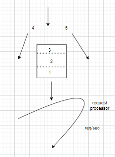

Scenario 1:
* Consider you have an application which is deployed in a server, and then it is working fine and some day you started to see sudden
  increase in traffic, for ex: 10 times the normal traffic and all the traffic is from BOTS.

Scenario 2:
* Consider you have a product which provides API for payment gateway , you want to restrict the user after 3 requests per day.

* For Both these scenarios the solution is rate limiting.
* Rate limiting products your APIs from overuse by limiting how often user can access your API.
* Once the users quota is finished either the requests are dropped or rejected, and it is very important for many important reasons 
  
  for example: 

  a) User Experience (UX): In the application some users are using overusing the API's in that case the other users will get affected. So if you maintain quality of 
                            service or better UX you need to rate limit.

  b) Security: People might try brut forcing the login API's or some other API's like promo codes, you need to rate limit to protect the application attacked by the hackers.
  
  c) Operational Cost: For example your application is enabled for auto-scaling or Pay as you go service. If the users are bombarding requests just for fun or by mistake, then the cost will increase.

**Levels at which use can Rate Limit or Types of Rate Limiting**

* User : how many requests you are going to allow for a user for one min or a certain duration.
* Concurrent : For a given user how many parallel sessions or parallel connection is allowed.The main at advantage is to mitigate the DDOS attack.
* Location Id : You are running a campaign dedicated to that location. you can rate limit all the other locations.In that way you can provide high quality of service for the location which you to target. 
* Server : This is a weired case, but it might come handy on certain kind of situations where you have defined a server is dedicated for certain kind of service in which you can rate limit different services the server provides that way it will help you to enforce some kind of rule on 
           serve rate.

**Algorithms For Rate Limit**

**a)Token Bucket** : Suppose we are limiting our API's to 5 requests/min .

* We can use redis as the token bucket because it is in memory and faster to access.
* For every unique user we will track the last time at which the request was made and the available tokens.
        U1 : 12:04:01 5
* So every time when the request comes in the rate limiter should do 2 things
   1. Fetch Token
   2. Update Token : once it access the token, and understood that we have enough token left so it can make the request and also 
                     afterwards it should update the token to the latest token available
* U1 12:04:25 then the available tokens will be 5 , as the new request is made the token will be updated to 4.
* U1 12:04:37 then the token will be reduced to 3.
* U1 12:07:07  and the token is refilled to 5 as this is the new minute,then the token will be reduced to 4.
* If all 5 tokens are completed , if the new request comes in the same minute then the request will be dropped.
* This algorithm is memory efficient as we are saving less amount of data per user.
* But in distributed environment it could cause race around condition i.e 2 requests are coming from 2 app servers for the same user, so both will
  try to update the token and the time.

**b)Leaky Bucket** : 

* Consider you have bucket which can hold 3 requests at any given point of time    

   
* Whenever the requests are coming into the bucket it will sit into the bucket and from there to the request processor.
* If more requests are coming in the bucket will fill immediately before even we process it.
* And the extra requests like 4 , 5 requests will overflow.
* If the first request is processed , so we have some space in the bucj=ket , so we can accommodate a new request in the bucket.

**c) Fixed Window Counter**
