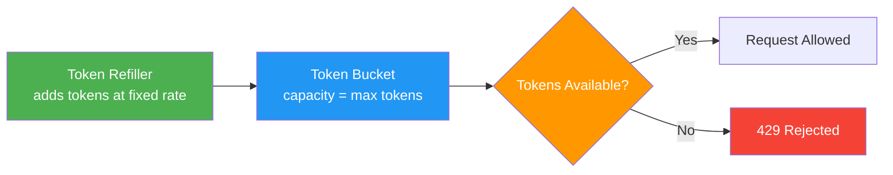
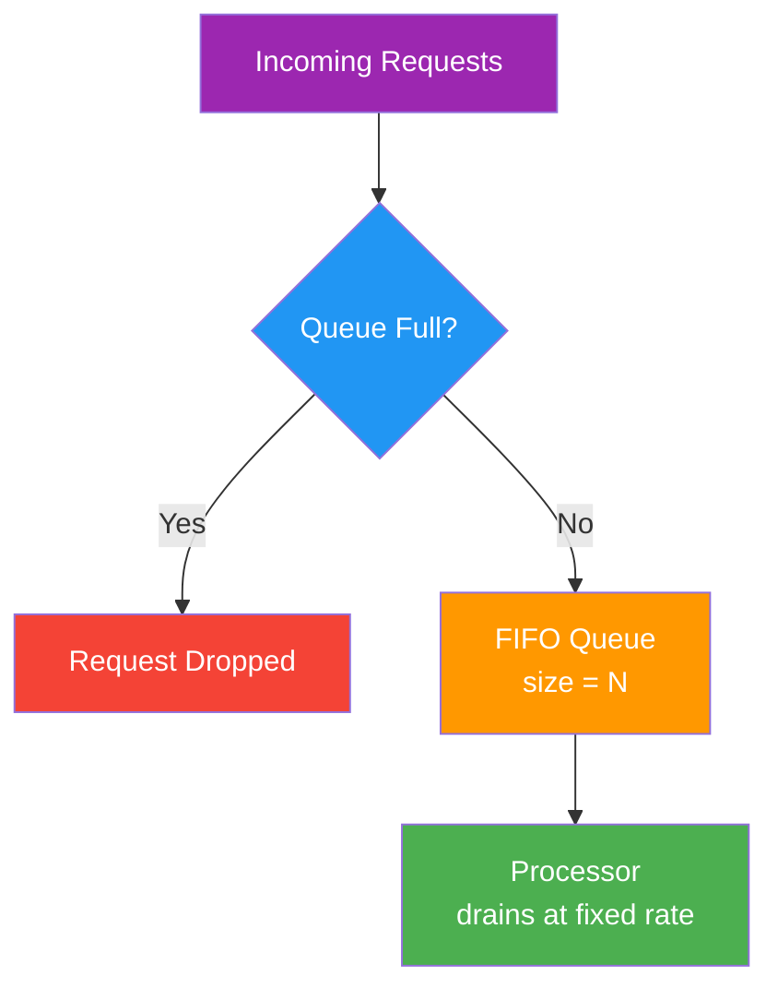
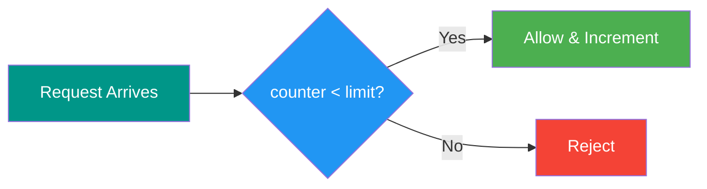
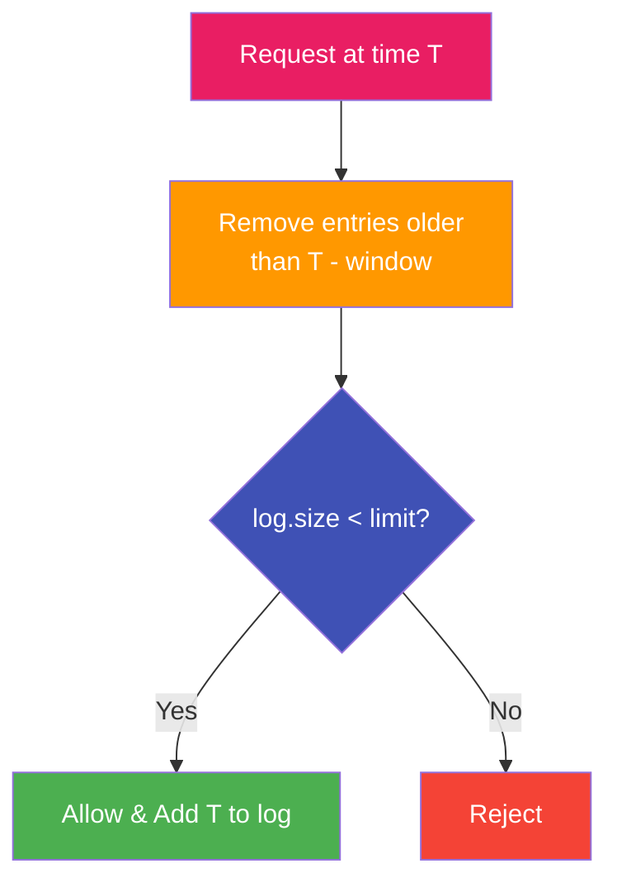
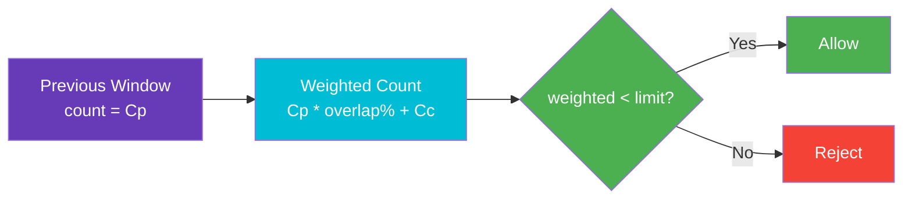
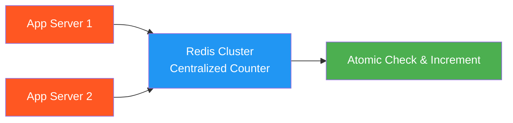
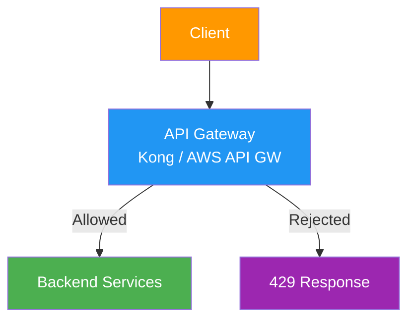
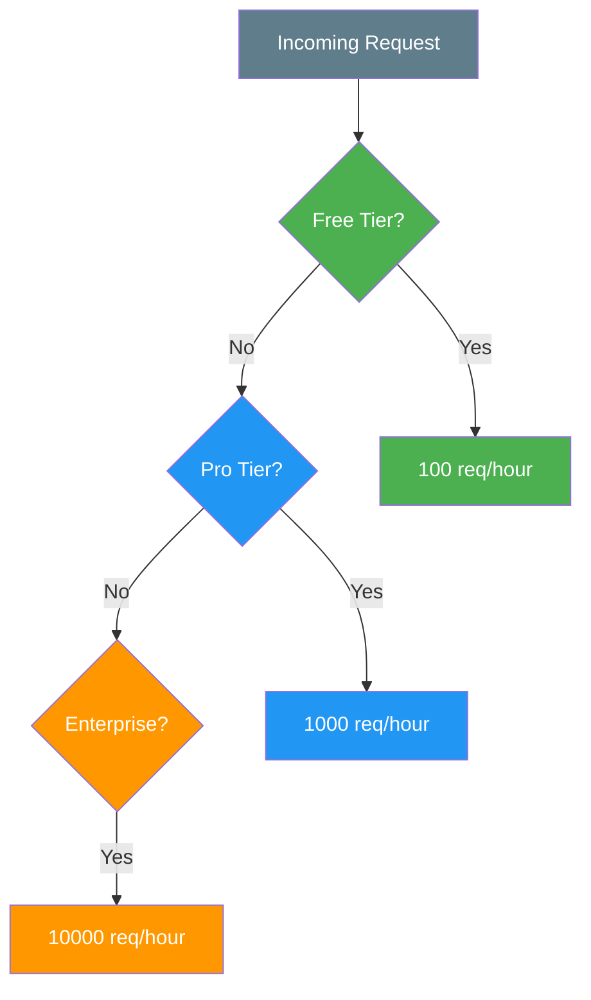

# Rate Limiting

!!! tip "Why This Appears in System Design Interviews"
    Rate limiting is a **top-5 system design topic** at FAANG companies. Interviewers use it to test your understanding of distributed systems, concurrency, trade-offs between accuracy and performance, and your ability to design scalable infrastructure components. Expect it as a standalone question or as part of designing an API gateway, chat system, or payment service.

---

## Why Rate Limiting?

Rate limiting controls the number of requests a client can make to a service within a given time window.

| Concern | Explanation |
|---------|-------------|
| **DDoS Protection** | Prevents malicious actors from overwhelming your service with traffic |
| **Fair Usage** | Ensures no single user monopolizes shared resources |
| **Cost Control** | Prevents runaway costs in auto-scaling or pay-per-use environments |
| **Service Stability** | Protects downstream services from cascading failures |
| **Compliance** | Enforces contractual API usage limits for tiered pricing |

---

## Rate Limiting Algorithms

### 1. Token Bucket

Allows bursty traffic while enforcing an average rate. Tokens are added at a fixed rate; each request consumes one token.


```mermaid
graph LR
    style A fill:#4CAF50,color:#fff
    style B fill:#2196F3,color:#fff
    style C fill:#FF9800,color:#fff
    style D fill:#f44336,color:#fff

    A[Token Refiller<br/>adds tokens at fixed rate] --> B[Token Bucket<br/>capacity = max tokens]
    B --> C{Tokens Available?}
    C -->|Yes| E[Request Allowed]
    C -->|No| D[429 Rejected]
```

```java
public class TokenBucket {
    private final int maxTokens;
    private final long refillIntervalNanos;
    private double availableTokens;
    private long lastRefillTimestamp;

    public TokenBucket(int maxTokens, int refillPerSecond) {
        this.maxTokens = maxTokens;
        this.availableTokens = maxTokens;
        this.refillIntervalNanos = 1_000_000_000L / refillPerSecond;
        this.lastRefillTimestamp = System.nanoTime();
    }

    public synchronized boolean tryConsume() {
        refill();
        if (availableTokens >= 1) {
            availableTokens -= 1;
            return true;
        }
        return false;
    }

    private void refill() {
        long now = System.nanoTime();
        double tokensToAdd = (double)(now - lastRefillTimestamp) / refillIntervalNanos;
        availableTokens = Math.min(maxTokens, availableTokens + tokensToAdd);
        lastRefillTimestamp = now;
    }
}
```

---

### 2. Leaky Bucket

Processes requests at a constant rate. Excess requests queue up or are dropped if the queue is full.


```mermaid
graph TD
    style A fill:#9C27B0,color:#fff
    style B fill:#2196F3,color:#fff
    style C fill:#4CAF50,color:#fff
    style D fill:#f44336,color:#fff
    style E fill:#FF9800,color:#fff

    A[Incoming Requests] --> B{Queue Full?}
    B -->|No| E[FIFO Queue<br/>size = N]
    B -->|Yes| D[Request Dropped]
    E --> C[Processor<br/>drains at fixed rate]
```

```java
public class LeakyBucket {
    private final int capacity;
    private final long leakIntervalMs;
    private final Queue<Runnable> queue = new LinkedList<>();
    private long lastLeakTimestamp;

    public LeakyBucket(int capacity, int leaksPerSecond) {
        this.capacity = capacity;
        this.leakIntervalMs = 1000L / leaksPerSecond;
        this.lastLeakTimestamp = System.currentTimeMillis();
    }

    public synchronized boolean tryEnqueue(Runnable request) {
        leak();
        if (queue.size() < capacity) {
            queue.offer(request);
            return true;
        }
        return false;
    }

    private void leak() {
        long now = System.currentTimeMillis();
        int leaks = (int)((now - lastLeakTimestamp) / leakIntervalMs);
        for (int i = 0; i < leaks && !queue.isEmpty(); i++) {
            queue.poll().run();
        }
        if (leaks > 0) lastLeakTimestamp = now;
    }
}
```

---

### 3. Fixed Window Counter

Divides time into fixed windows and counts requests per window. Simple but allows up to 2x the rate at window boundaries.


```mermaid
graph LR
    style A fill:#009688,color:#fff
    style B fill:#2196F3,color:#fff
    style C fill:#4CAF50,color:#fff
    style D fill:#f44336,color:#fff

    A[Request Arrives] --> B{counter < limit?}
    B -->|Yes| C[Allow & Increment]
    B -->|No| D[Reject]
```

```java
public class FixedWindowCounter {
    private final int limit;
    private final long windowSizeMs;
    private long windowStart;
    private int counter;

    public FixedWindowCounter(int limit, long windowSizeMs) {
        this.limit = limit;
        this.windowSizeMs = windowSizeMs;
        this.windowStart = System.currentTimeMillis();
    }

    public synchronized boolean tryAcquire() {
        long now = System.currentTimeMillis();
        if (now - windowStart >= windowSizeMs) {
            windowStart = now;
            counter = 0;
        }
        if (counter < limit) { counter++; return true; }
        return false;
    }
}
```

---

### 4. Sliding Window Log

Maintains a log of timestamps for each request. Filters out expired entries. Most accurate but memory-intensive.


```mermaid
graph TD
    style A fill:#E91E63,color:#fff
    style B fill:#3F51B5,color:#fff
    style C fill:#4CAF50,color:#fff
    style D fill:#f44336,color:#fff
    style E fill:#FF9800,color:#fff

    A[Request at time T] --> E[Remove entries older<br/>than T - window]
    E --> B{log.size < limit?}
    B -->|Yes| C[Allow & Add T to log]
    B -->|No| D[Reject]
```

```java
public class SlidingWindowLog {
    private final int limit;
    private final long windowSizeMs;
    private final TreeMap<Long, Integer> log = new TreeMap<>();

    public SlidingWindowLog(int limit, long windowSizeMs) {
        this.limit = limit;
        this.windowSizeMs = windowSizeMs;
    }

    public synchronized boolean tryAcquire() {
        long now = System.currentTimeMillis();
        log.headMap(now - windowSizeMs).clear();
        int count = log.values().stream().mapToInt(Integer::intValue).sum();
        if (count < limit) { log.merge(now, 1, Integer::sum); return true; }
        return false;
    }
}
```

---

### 5. Sliding Window Counter

Hybrid of Fixed Window and Sliding Log. Uses weighted counts from current and previous windows for accuracy with low memory.


```mermaid
graph LR
    style A fill:#673AB7,color:#fff
    style B fill:#00BCD4,color:#fff
    style C fill:#4CAF50,color:#fff
    style D fill:#f44336,color:#fff

    A[Previous Window<br/>count = Cp] --> B[Weighted Count<br/>Cp * overlap% + Cc]
    B --> C{weighted < limit?}
    C -->|Yes| D2[Allow]
    C -->|No| D[Reject]

    style D2 fill:#4CAF50,color:#fff
```

**Formula:** `effective_count = prev_count * ((window_size - elapsed) / window_size) + current_count`

```java
public class SlidingWindowCounter {
    private final int limit;
    private final long windowSizeMs;
    private int previousCount, currentCount;
    private long currentWindowStart;

    public SlidingWindowCounter(int limit, long windowSizeMs) {
        this.limit = limit;
        this.windowSizeMs = windowSizeMs;
        this.currentWindowStart = System.currentTimeMillis();
    }

    public synchronized boolean tryAcquire() {
        long now = System.currentTimeMillis();
        long elapsed = now - currentWindowStart;
        if (elapsed >= windowSizeMs) {
            previousCount = currentCount;
            currentCount = 0;
            currentWindowStart = now;
            elapsed = 0;
        }
        double effective = previousCount * (1.0 - (double) elapsed / windowSizeMs) + currentCount;
        if (effective < limit) { currentCount++; return true; }
        return false;
    }
}
```

---

## Algorithm Comparison

| Algorithm | Pros | Cons | Best Use Case |
|-----------|------|------|---------------|
| **Token Bucket** | Allows bursts, memory efficient | Distributed sync complex | API rate limiting with burst tolerance |
| **Leaky Bucket** | Smooth output, predictable load | No burst handling, queue delay | Streaming, traffic shaping |
| **Fixed Window** | Extremely simple, low memory | Boundary spike (2x burst) | Low-precision internal limiting |
| **Sliding Window Log** | Most accurate, no boundary issues | High memory per user | Security-critical endpoints |
| **Sliding Window Counter** | Good accuracy, low memory | Approximate | General-purpose API limiting |

---

## Distributed Rate Limiting

### Redis-Based Implementation


```mermaid
graph LR
    style A fill:#FF5722,color:#fff
    style B fill:#FF5722,color:#fff
    style C fill:#2196F3,color:#fff
    style D fill:#4CAF50,color:#fff

    A[App Server 1] --> C[Redis Cluster<br/>Centralized Counter]
    B[App Server 2] --> C
    C --> D[Atomic Check & Increment]
```

**Lua Script for Atomic Token Bucket:**

```lua
local key = KEYS[1]
local max_tokens = tonumber(ARGV[1])
local refill_rate = tonumber(ARGV[2])
local now = tonumber(ARGV[3])

local data = redis.call('HMGET', key, 'tokens', 'last_refill')
local tokens = tonumber(data[1]) or max_tokens
local last_refill = tonumber(data[2]) or now

local elapsed = now - last_refill
tokens = math.min(max_tokens, tokens + elapsed * refill_rate)

local allowed = 0
if tokens >= 1 then
    tokens = tokens - 1
    allowed = 1
end

redis.call('HMSET', key, 'tokens', tokens, 'last_refill', now)
redis.call('EXPIRE', key, math.ceil(max_tokens / refill_rate) * 2)
return allowed
```

### Race Conditions and Solutions

| Problem | Solution |
|---------|----------|
| **Read-then-write race** | Lua scripts execute atomically in Redis |
| **Clock drift across nodes** | Use Redis server time instead of client time |
| **Redis failover** | Accept slight over-counting or use Redis Cluster |
| **Network partition** | Fall back to local rate limiting with relaxed limits |

---

## Rate Limiting at Different Layers

### API Gateway (Kong, AWS API Gateway)


```mermaid
graph TD
    style A fill:#FF9800,color:#fff
    style B fill:#2196F3,color:#fff
    style C fill:#4CAF50,color:#fff
    style D fill:#9C27B0,color:#fff

    A[Client] --> B[API Gateway<br/>Kong / AWS API GW]
    B -->|Allowed| C[Backend Services]
    B -->|Rejected| D[429 Response]
```

```yaml
# Kong rate-limiting plugin
plugins:
  - name: rate-limiting
    config:
      minute: 100
      hour: 1000
      policy: redis
      redis_host: redis-cluster.internal
      limit_by: consumer
```

### Application Level (Spring Boot Interceptor)

```java
@Component
public class RateLimitInterceptor implements HandlerInterceptor {
    private final RateLimiterService rateLimiterService;

    @Override
    public boolean preHandle(HttpServletRequest request,
                             HttpServletResponse response, Object handler) {
        String clientId = extractClientId(request);
        RateLimitResult result = rateLimiterService.checkLimit(clientId);

        response.setHeader("X-RateLimit-Limit", String.valueOf(result.limit()));
        response.setHeader("X-RateLimit-Remaining", String.valueOf(result.remaining()));

        if (!result.allowed()) {
            response.setHeader("Retry-After", String.valueOf(result.retryAfterSeconds()));
            response.setStatus(429);
            return false;
        }
        return true;
    }

    private String extractClientId(HttpServletRequest request) {
        String apiKey = request.getHeader("X-API-Key");
        if (apiKey != null) return "key:" + apiKey;
        if (request.getUserPrincipal() != null) return "user:" + request.getUserPrincipal().getName();
        return "ip:" + request.getRemoteAddr();
    }
}
```

### Infrastructure Level (NGINX, Envoy)

```nginx
http {
    limit_req_zone $binary_remote_addr zone=api_limit:10m rate=10r/s;
    server {
        location /api/ {
            limit_req zone=api_limit burst=20 nodelay;
            limit_req_status 429;
            proxy_pass http://backend;
        }
    }
}
```

---

## HTTP Rate Limit Headers

| Header | Purpose | Example |
|--------|---------|---------|
| `X-RateLimit-Limit` | Max requests allowed in window | `100` |
| `X-RateLimit-Remaining` | Requests remaining | `57` |
| `X-RateLimit-Reset` | Unix timestamp when window resets | `1672531200` |
| `Retry-After` | Seconds until client should retry | `30` |

```http
HTTP/1.1 429 Too Many Requests
X-RateLimit-Limit: 100
X-RateLimit-Remaining: 0
Retry-After: 60
Content-Type: application/json

{"error": "Rate limit exceeded", "message": "Try again in 60 seconds"}
```

---

## Design Considerations

### Choosing a Rate Limiting Key

| Strategy | Key Format | When to Use |
|----------|-----------|-------------|
| **By IP** | `rl:ip:192.168.1.1` | Unauthenticated endpoints, login pages |
| **By User ID** | `rl:user:12345` | Authenticated APIs, per-user fairness |
| **By API Key** | `rl:key:abc123` | B2B APIs with tiered pricing |
| **By Endpoint** | `rl:ep:/api/search` | Protect expensive operations |
| **Composite** | `rl:user:123:/api/pay` | Fine-grained per-user-per-endpoint |

### Tiered Rate Limits


```mermaid
graph TD
    style A fill:#607D8B,color:#fff
    style B fill:#4CAF50,color:#fff
    style C fill:#2196F3,color:#fff
    style D fill:#FF9800,color:#fff

    A[Incoming Request] --> B{Free Tier?}
    B -->|Yes| F[100 req/hour]
    B -->|No| C{Pro Tier?}
    C -->|Yes| G[1000 req/hour]
    C -->|No| D{Enterprise?}
    D -->|Yes| H[10000 req/hour]

    style F fill:#4CAF50,color:#fff
    style G fill:#2196F3,color:#fff
    style H fill:#FF9800,color:#fff
```

- **Graceful Degradation:** Return cached data instead of hard rejecting
- **Rate Limit Bypass:** Whitelist internal services and health checks
- **Monitoring:** Track rate limit hits as a signal for abuse or capacity issues
- **Client-Side Throttling:** SDKs should limit locally to avoid wasted requests

---

## Spring Boot Implementation with Redis

**RateLimiterService.java:**

```java
@Service
public class RateLimiterService {
    private final StringRedisTemplate redisTemplate;
    private final DefaultRedisScript<Long> rateLimitScript;

    private static final String LUA_SCRIPT = """
        local key = KEYS[1]
        local limit = tonumber(ARGV[1])
        local window = tonumber(ARGV[2])
        local current = redis.call('INCR', key)
        if current == 1 then redis.call('EXPIRE', key, window) end
        if current > limit then return 0 end
        return limit - current
        """;

    public RateLimiterService(StringRedisTemplate redisTemplate) {
        this.redisTemplate = redisTemplate;
        this.rateLimitScript = new DefaultRedisScript<>(LUA_SCRIPT, Long.class);
    }

    public RateLimitResult checkLimit(String clientId) {
        int limit = getLimitForClient(clientId);
        Long remaining = redisTemplate.execute(rateLimitScript,
                List.of("rate_limit:" + clientId),
                String.valueOf(limit), "60");
        boolean allowed = remaining != null && remaining >= 0;
        return new RateLimitResult(allowed, limit, allowed ? remaining.intValue() : 0, allowed ? 0 : 60);
    }

    private int getLimitForClient(String clientId) {
        if (clientId.startsWith("key:enterprise")) return 10000;
        if (clientId.startsWith("key:pro")) return 1000;
        return 100;
    }
}
```

**RateLimitResult.java:**

```java
public record RateLimitResult(boolean allowed, int limit, int remaining, int retryAfterSeconds) {}
```

**WebConfig.java:**

```java
@Configuration
public class WebConfig implements WebMvcConfigurer {
    private final RateLimitInterceptor rateLimitInterceptor;

    @Override
    public void addInterceptors(InterceptorRegistry registry) {
        registry.addInterceptor(rateLimitInterceptor)
                .addPathPatterns("/api/**")
                .excludePathPatterns("/api/health");
    }
}
```

---

## Interview Questions

??? question "Design a rate limiter for a system handling 1 million requests per second. Which algorithm would you choose and why?"
    Use a **Sliding Window Counter** with Redis Cluster. It provides O(1) memory per user, avoids the boundary burst problem of Fixed Window, and Redis Cluster supports horizontal sharding by key. Use Lua scripts for atomicity. For 1M RPS, partition rate limit keys across 10+ Redis nodes using consistent hashing.

??? question "How do you handle race conditions in a distributed rate limiter?"
    Three approaches: (1) **Redis Lua scripts** execute atomically on the server, eliminating read-modify-write races. (2) **Redis WATCH/MULTI/EXEC** provides optimistic locking with retry on conflict. (3) **Local rate limiting with sync** where each node enforces `limit/N` locally and periodically reconciles. Lua scripts are the industry standard.

??? question "What is the boundary burst problem in Fixed Window Counter, and how do you solve it?"
    If the limit is 100 req/min and a user sends 100 requests at 11:00:59 and another 100 at 11:01:00, they send 200 requests in 2 seconds. Solutions: (1) **Sliding Window Counter** weights the previous window's count. (2) **Sliding Window Log** for exact tracking. (3) Combine Fixed Window with a shorter sub-window.

??? question "Where should you place the rate limiter in a microservices architecture?"
    Layer it: (1) **API Gateway** blocks abuse before requests reach services. (2) **Service mesh/sidecar** (Envoy, Istio) enforces per-service limits for internal traffic. (3) **Application level** handles business rules (e.g., 3 password attempts/hour). The gateway handles volumetric attacks; the application handles business logic limits.

??? question "How would you implement rate limiting across multiple data centers?"
    Options: (1) **Global Redis with cross-DC replication** using CRDTs; slight over-counting during replication lag. (2) **Local limiting per DC** where each DC gets `total_limit / num_DCs`; simple but wastes capacity if traffic is uneven. (3) **Eventual consistency with gossip** where nodes share counters periodically. Most systems choose option 1 with ~5% over-counting tolerance.

??? question "A client claims they are within quota but getting rate limited. How do you debug?"
    Steps: (1) Check if rate limit key is by IP — shared NAT combines multiple users. (2) Verify clock sync across nodes. (3) Check Sliding Window approximation. (4) Look for retry storms amplifying requests. (5) Inspect Redis key TTLs — missing EXPIRE accumulates across windows. (6) Check multiple API keys aggregated under one user ID.

??? question "How do you design rate limiting for tiered pricing (free, pro, enterprise)?"
    Store tier-to-limit mappings in a config service. On each request: extract API key, look up tier (cache with TTL), apply limit. Use composite Redis key `rl:{tier}:{userId}:{endpoint}`. Support dynamic limit updates without redeployment by externalizing configuration.

??? question "What happens to in-flight requests when rate limits change dynamically?"
    In-flight requests that already passed are unaffected. For new limits: (1) **Immediate** — update config in Redis; next Lua evaluation uses new values. (2) **Graceful** — keep the higher of old/new limits for one window duration. (3) **TTL reset** — when increasing limits, reset counter to give immediate benefit. Never require restarts for limit changes.
